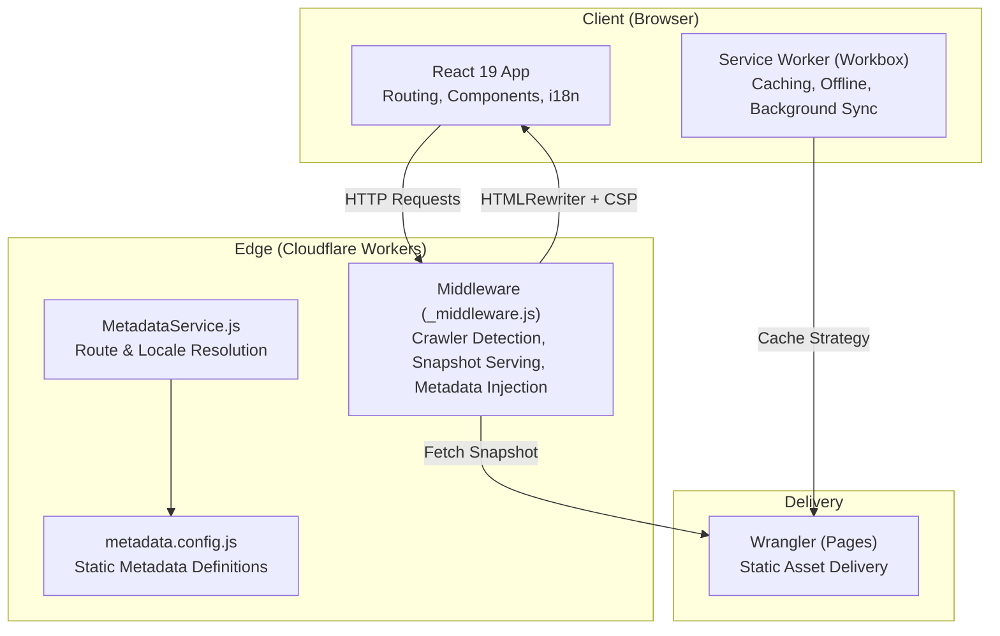
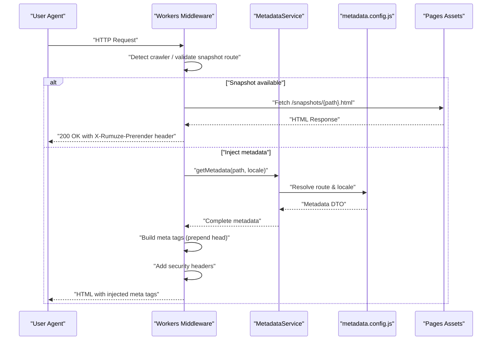
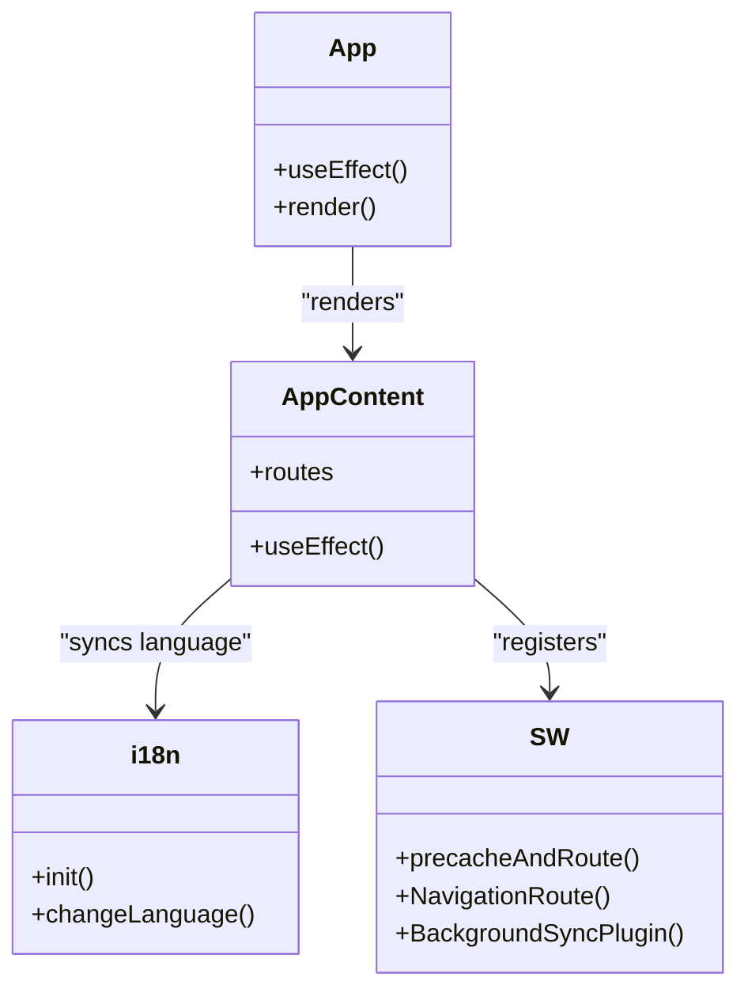
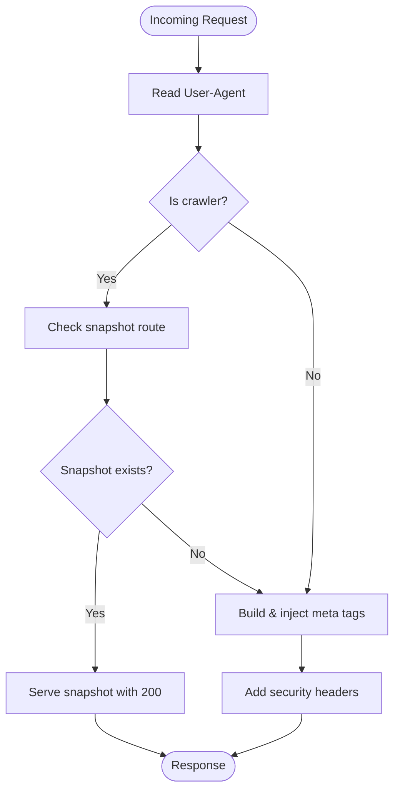
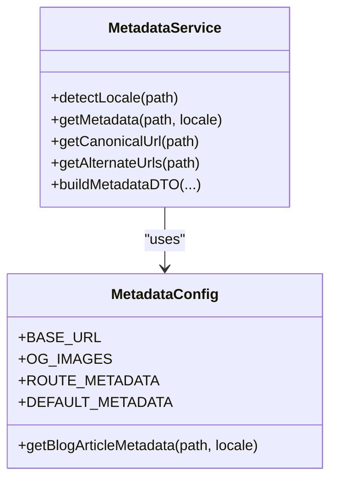
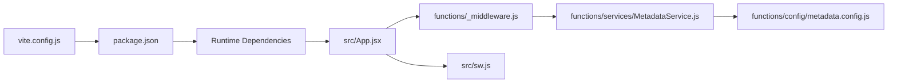

# Architecture Overview

<cite>
**Referenced Files in This Document**
- [vite.config.js](file://vite.config.js)
- [wrangler.jsonc](file://wrangler.jsonc)
- [package.json](file://package.json)
- [src/main.jsx](file://src/main.jsx)
- [src/App.jsx](file://src/App.jsx)
- [functions/_middleware.js](file://functions/_middleware.js)
- [functions/services/MetadataService.js](file://functions/services/MetadataService.js)
- [functions/config/metadata.config.js](file://functions/config/metadata.config.js)
- [src/i18n.js](file://src/i18n.js)
- [src/sw.js](file://src/sw.js)
- [src/hooks/useMetadata.js](file://src/hooks/useMetadata.js)
- [src/utils/MetaConfig.js](file://src/utils/MetaConfig.js)
</cite>

## Table of Contents
1. [Introduction](#introduction)
2. [Project Structure](#project-structure)
3. [Core Components](#core-components)
4. [Architecture Overview](#architecture-overview)
5. [Detailed Component Analysis](#detailed-component-analysis)
6. [Dependency Analysis](#dependency-analysis)
7. [Performance Considerations](#performance-considerations)
8. [Troubleshooting Guide](#troubleshooting-guide)
9. [Conclusion](#conclusion)

## Introduction
This document describes the hybrid frontend-backend architecture of the landing page application. It combines a modern React 19 single-page application (SPA) built with Vite and enhanced with a Progressive Web App (PWA) layer, served via Cloudflare Workers middleware. The backend middleware injects SEO metadata for social crawlers and search engines, supports snapshot-based pre-rendering, and enforces robust security headers. Cross-cutting concerns include internationalization, offline-first behavior, and performance optimization strategies.

## Project Structure
The project is organized into distinct layers:
- Frontend (React 19 SPA): Client-side routing, components, i18n, PWA service worker, and build configuration.
- Backend (Cloudflare Workers): Middleware for metadata injection, crawler handling, snapshot serving, and security headers.
- Shared configuration: Metadata definitions and helpers for SEO and structured data.

**Diagram sources**
- [src/App.jsx](file://src/App.jsx#L311-L348)
- [src/sw.js](file://src/sw.js#L1-L227)
- [functions/_middleware.js](file://functions/_middleware.js#L76-L264)
- [functions/services/MetadataService.js](file://functions/services/MetadataService.js#L44-L88)
- [functions/config/metadata.config.js](file://functions/config/metadata.config.js#L119-L209)
- [wrangler.jsonc](file://wrangler.jsonc#L1-L8)

**Section sources**
- [src/main.jsx](file://src/main.jsx#L1-L12)
- [package.json](file://package.json#L6-L15)
- [vite.config.js](file://vite.config.js#L1-L262)
- [wrangler.jsonc](file://wrangler.jsonc#L1-L8)

## Core Components
- React 19 SPA with client-side routing, lazy loading, and animations.
- PWA layer powered by Vite PWA and Workbox for caching, offline fallback, and background sync.
- Cloudflare Workers middleware for crawler detection, snapshot serving, metadata injection, and security hardening.
- Metadata service and configuration for multilingual SEO and structured data.

**Section sources**
- [src/App.jsx](file://src/App.jsx#L1-L348)
- [src/sw.js](file://src/sw.js#L1-L227)
- [functions/_middleware.js](file://functions/_middleware.js#L1-L383)
- [functions/services/MetadataService.js](file://functions/services/MetadataService.js#L1-L380)
- [functions/config/metadata.config.js](file://functions/config/metadata.config.js#L1-L369)

## Architecture Overview
The system operates as follows:
- Client requests reach Cloudflare Workers middleware.
- Middleware detects crawlers and either serves pre-rendered snapshots or injects metadata into the HTML response.
- Non-crawler requests pass through to static assets delivered by Cloudflare Pages.
- The React SPA runs in the browser with client-side routing, PWA caching, and i18n synchronization.

**Diagram sources**
- [functions/_middleware.js](file://functions/_middleware.js#L76-L264)
- [functions/services/MetadataService.js](file://functions/services/MetadataService.js#L70-L88)
- [functions/config/metadata.config.js](file://functions/config/metadata.config.js#L119-L209)

## Detailed Component Analysis

### Frontend: React 19 SPA and PWA
- App initialization sets up theme, error boundary, router, and lazy-loaded routes.
- Internationalization synchronizes language with URL segments and document direction.
- PWA features include automatic service worker registration, periodic background sync, and offline toast handling.
- Vite build optimizes chunking, minification, and asset inlining for performance.

**Diagram sources**
- [src/App.jsx](file://src/App.jsx#L74-L309)
- [src/i18n.js](file://src/i18n.js#L1-L45)
- [src/sw.js](file://src/sw.js#L14-L32)

**Section sources**
- [src/App.jsx](file://src/App.jsx#L1-L348)
- [src/i18n.js](file://src/i18n.js#L1-L45)
- [src/sw.js](file://src/sw.js#L1-L227)
- [vite.config.js](file://vite.config.js#L19-L202)

### Backend: Cloudflare Workers Middleware
- Detects social and search engine crawlers and normalizes responses to avoid partial content errors.
- Attempts to serve pre-rendered snapshots for valid routes; otherwise injects metadata into the HTML head.
- Enforces strict security headers and sanitizes meta content.
- Passes through PWA assets and static resources to avoid interference.

**Diagram sources**
- [functions/_middleware.js](file://functions/_middleware.js#L76-L264)

**Section sources**
- [functions/_middleware.js](file://functions/_middleware.js#L1-L383)

### Metadata Service and Configuration
- Resolves locale and route-specific metadata, with fallbacks and sanitization.
- Generates canonical URLs, alternate hreflang links, and image dimensions required by social crawlers.
- Blog article metadata supports dynamic slugs with shared and localized fields.

**Diagram sources**
- [functions/services/MetadataService.js](file://functions/services/MetadataService.js#L44-L347)
- [functions/config/metadata.config.js](file://functions/config/metadata.config.js#L39-L336)

**Section sources**
- [functions/services/MetadataService.js](file://functions/services/MetadataService.js#L1-L380)
- [functions/config/metadata.config.js](file://functions/config/metadata.config.js#L1-L369)

### Client-Side Metadata Utilities
- Provides a hook to manage metadata overrides and helpers for absolute image URLs and default OG images.
- Works alongside the server-side middleware to ensure consistency across SPA navigation.

**Section sources**
- [src/hooks/useMetadata.js](file://src/hooks/useMetadata.js#L1-L117)
- [src/utils/MetaConfig.js](file://src/utils/MetaConfig.js#L250-L295)

## Dependency Analysis
- Build and deployment pipeline integrates Vite, PWA generation, and Cloudflare Pages.
- Runtime dependencies include React 19, React Router, i18n, and PWA-related libraries.
- Middleware depends on the metadata service and configuration modules.

**Diagram sources**
- [vite.config.js](file://vite.config.js#L1-L262)
- [package.json](file://package.json#L16-L48)
- [src/App.jsx](file://src/App.jsx#L1-L348)
- [functions/_middleware.js](file://functions/_middleware.js#L29-L151)
- [functions/services/MetadataService.js](file://functions/services/MetadataService.js#L16-L29)
- [functions/config/metadata.config.js](file://functions/config/metadata.config.js#L1-L369)
- [src/sw.js](file://src/sw.js#L1-L227)

**Section sources**
- [package.json](file://package.json#L1-L49)
- [vite.config.js](file://vite.config.js#L1-L262)
- [wrangler.jsonc](file://wrangler.jsonc#L1-L8)

## Performance Considerations
- Vite build:
  - Manual chunking separates core libraries, router, animation, i18n, and icons for efficient loading.
  - Minification and compression (gzip/brotli) reduce payload sizes.
  - CSS inlining for critical path rendering.
- PWA caching:
  - Pre-caching of critical assets and offline.html.
  - Stale-while-revalidate for JS/CSS, cache-first for images/fonts, network-first for APIs.
  - Size limits and quota-aware purging for images.
- Middleware:
  - Snapshot-based pre-rendering reduces server-side rendering overhead for crawlers.
  - Security headers and response normalization improve reliability and trust signals.

[No sources needed since this section provides general guidance]

## Troubleshooting Guide
- Crawler metadata issues:
  - Verify crawler detection patterns and snapshot route validation.
  - Ensure meta tags are prepended to the head and absolute URLs are used.
- PWA offline behavior:
  - Confirm navigation fallback and offline.html are precached.
  - Check background sync queue and periodic sync registration.
- Internationalization:
  - Validate language synchronization with URL segments and document direction.
- Build and deployment:
  - Review Vite plugin configurations and Wrangler asset directory mapping.

**Section sources**
- [functions/_middleware.js](file://functions/_middleware.js#L276-L288)
- [src/sw.js](file://src/sw.js#L155-L174)
- [src/i18n.js](file://src/i18n.js#L14-L40)
- [vite.config.js](file://vite.config.js#L19-L202)
- [wrangler.jsonc](file://wrangler.jsonc#L4-L6)

## Conclusion
This hybrid architecture leverages a modern React 19 SPA with a robust PWA layer and Cloudflare Workers middleware to deliver fast, SEO-friendly experiences across desktop and mobile. The middleware’s crawler-aware metadata injection and snapshot serving ensure strong social previews and search visibility, while the PWA guarantees resilient offline behavior. The modular metadata service and configuration enable maintainable, bilingual SEO across all routes.