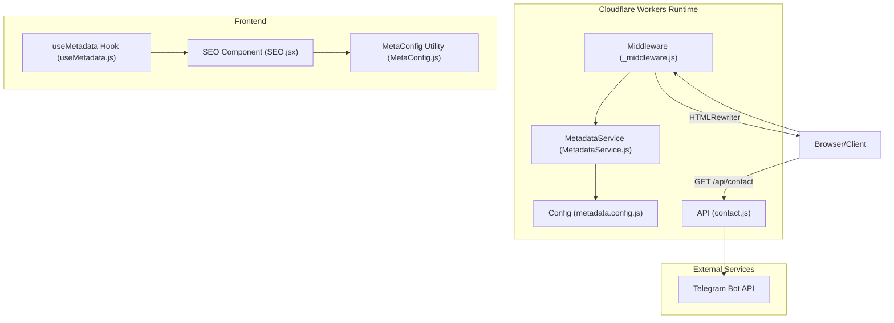
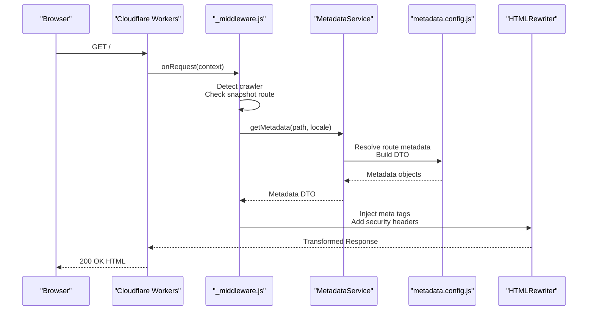
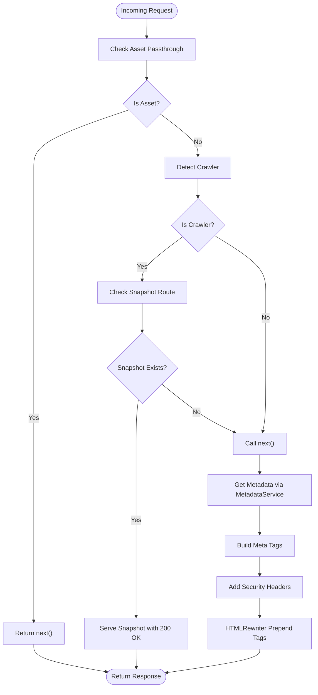
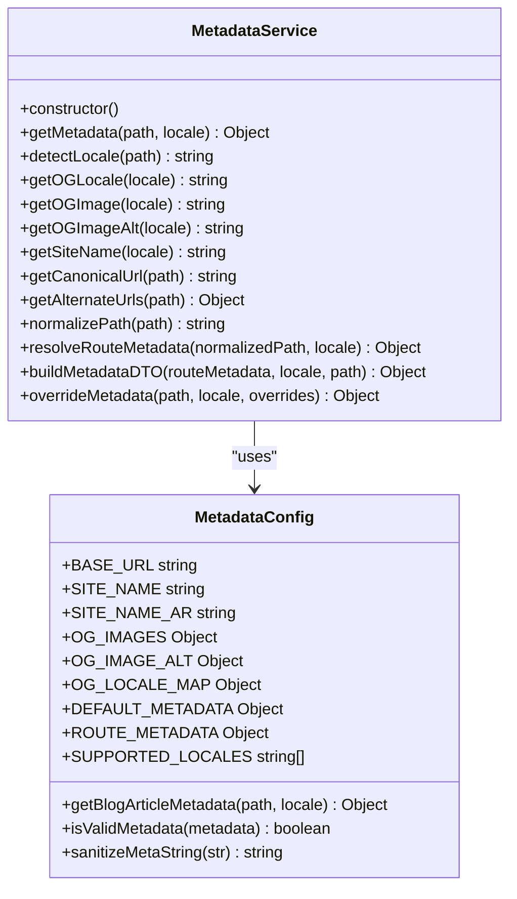
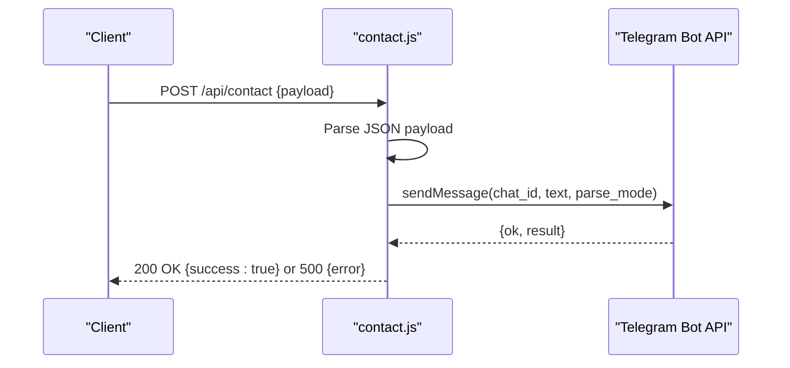
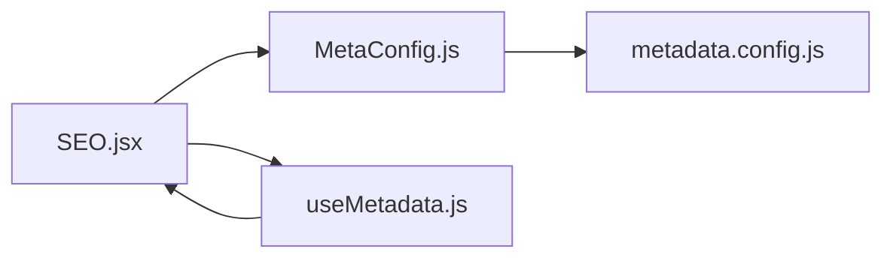
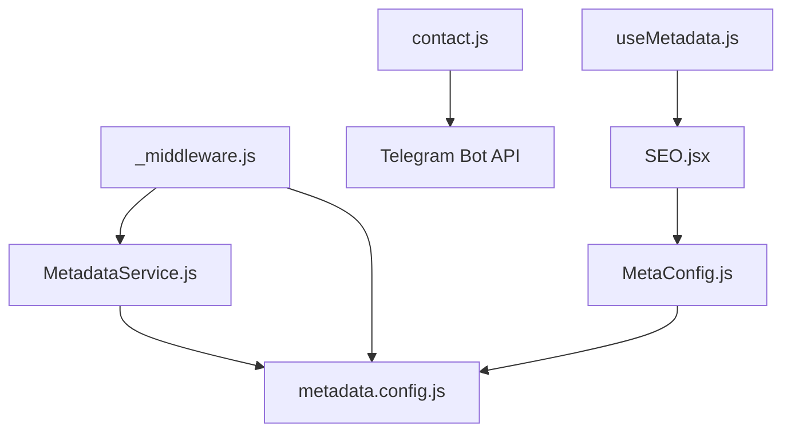
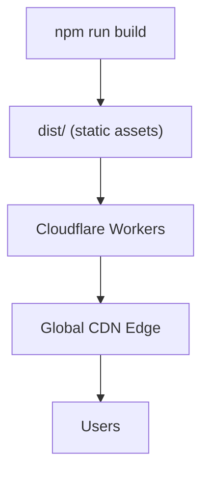

# Backend Architecture

<cite>
**Referenced Files in This Document**
- [functions/_middleware.js](file://functions/_middleware.js)
- [functions/services/MetadataService.js](file://functions/services/MetadataService.js)
- [functions/config/metadata.config.js](file://functions/config/metadata.config.js)
- [functions/api/contact.js](file://functions/api/contact.js)
- [wrangler.jsonc](file://wrangler.jsonc)
- [docs/FACEBOOK_CRAWLER_FIX.md](file://docs/FACEBOOK_CRAWLER_FIX.md)
- [src/components/SEO.jsx](file://src/components/SEO.jsx)
- [src/hooks/useMetadata.js](file://src/hooks/useMetadata.js)
- [src/utils/MetaConfig.js](file://src/utils/MetaConfig.js)
- [functions/services/MetadataService.test.js](file://functions/services/MetadataService.test.js)
- [package.json](file://package.json)
</cite>

## Table of Contents
1. [Introduction](#introduction)
2. [Project Structure](#project-structure)
3. [Core Components](#core-components)
4. [Architecture Overview](#architecture-overview)
5. [Detailed Component Analysis](#detailed-component-analysis)
6. [Dependency Analysis](#dependency-analysis)
7. [Performance Considerations](#performance-considerations)
8. [Security Considerations](#security-considerations)
9. [Deployment and Edge Computing](#deployment-and-edge-computing)
10. [Integration with Frontend](#integration-with-frontend)
11. [Troubleshooting Guide](#troubleshooting-guide)
12. [Conclusion](#conclusion)

## Introduction
This document describes the backend architecture of a Cloudflare Workers-based system that powers a multilingual landing page. It focuses on the middleware pattern implementation for request processing, SEO optimization, and crawler detection; the MetadataService architecture for dynamic meta tag generation and route-based metadata resolution; the contact form API endpoint with background synchronization; Cloudflare Workers deployment configuration; environment variables; edge computing benefits; security considerations; request/response transformation patterns; and the separation of concerns between SEO middleware, business logic services, and API endpoints.

## Project Structure
The backend is organized around Cloudflare Workers functions and configuration:
- Middleware: functions/_middleware.js orchestrates request processing, crawler detection, snapshot serving, and meta tag injection.
- Business logic: functions/services/MetadataService.js encapsulates metadata resolution and DTO building.
- Configuration: functions/config/metadata.config.js centralizes metadata definitions and helpers.
- API endpoints: functions/api/contact.js implements the contact form submission with Telegram integration.
- Deployment: wrangler.jsonc defines the Workers app name, compatibility date, and asset directory.
- Documentation: docs/FACEBOOK_CRAWLER_FIX.md explains the crawler compatibility fixes and rationale.
- Frontend integration: src/components/SEO.jsx and src/utils/MetaConfig.js provide client-side SEO and metadata utilities.

**Diagram sources**
- [functions/_middleware.js](file://functions/_middleware.js#L76-L264)
- [functions/services/MetadataService.js](file://functions/services/MetadataService.js#L44-L380)
- [functions/config/metadata.config.js](file://functions/config/metadata.config.js#L1-L369)
- [functions/api/contact.js](file://functions/api/contact.js#L1-L62)
- [src/components/SEO.jsx](file://src/components/SEO.jsx#L1-L278)
- [src/utils/MetaConfig.js](file://src/utils/MetaConfig.js#L1-L530)
- [src/hooks/useMetadata.js](file://src/hooks/useMetadata.js#L1-L117)

**Section sources**
- [wrangler.jsonc](file://wrangler.jsonc#L1-L8)
- [package.json](file://package.json#L1-L49)

## Core Components
- Middleware pipeline: Detects crawlers, serves pre-rendered snapshots when available, injects security headers, and injects Open Graph and Twitter meta tags using HTMLRewriter.
- MetadataService: Provides locale-aware metadata resolution, route matching, fallback mechanisms, and DTO construction with sanitization and validation.
- Configuration: Centralized metadata definitions, locale mapping, blog article metadata, and helper functions for sanitization and validation.
- Contact API: Processes form submissions and forwards messages to Telegram via a configured bot.

**Section sources**
- [functions/_middleware.js](file://functions/_middleware.js#L76-L264)
- [functions/services/MetadataService.js](file://functions/services/MetadataService.js#L44-L380)
- [functions/config/metadata.config.js](file://functions/config/metadata.config.js#L1-L369)
- [functions/api/contact.js](file://functions/api/contact.js#L1-L62)

## Architecture Overview
The system follows a layered architecture:
- Presentation layer: Static assets served via Cloudflare Pages/Workers Assets.
- Edge middleware: Cloudflare Workers middleware handles SEO, crawler optimization, and meta tag injection.
- Business logic: MetadataService encapsulates metadata resolution and DTO building.
- API layer: Cloudflare Functions implement contact form submission with background sync to Telegram.
- Frontend integration: Client-side SEO component and utilities complement server-side middleware.

**Diagram sources**
- [functions/_middleware.js](file://functions/_middleware.js#L76-L264)
- [functions/services/MetadataService.js](file://functions/services/MetadataService.js#L70-L88)
- [functions/config/metadata.config.js](file://functions/config/metadata.config.js#L119-L209)

## Detailed Component Analysis

### Middleware Pattern Implementation
The middleware implements a robust request processing pipeline:
- Asset passthrough: Exempts service workers, manifests, and snapshot assets from HTML rewriting to avoid interference.
- Crawler detection: Uses a curated list of User-Agent patterns to identify social media and search engine crawlers.
- Snapshot serving: Attempts to serve pre-rendered HTML snapshots for crawler-friendly responses.
- Response normalization: Converts 206 Partial Content to 200 OK for crawlers to prevent parsing failures.
- Meta tag injection: Prepends Open Graph and Twitter tags to the head to ensure they appear within the first 1KB.
- Security headers: Adds CSP, HSTS, X-Content-Type-Options, X-Frame-Options, X-XSS-Protection, Referrer-Policy, and Permissions-Policy.

**Diagram sources**
- [functions/_middleware.js](file://functions/_middleware.js#L84-L144)
- [functions/_middleware.js](file://functions/_middleware.js#L150-L169)
- [functions/_middleware.js](file://functions/_middleware.js#L196-L225)
- [functions/_middleware.js](file://functions/_middleware.js#L228-L263)

**Section sources**
- [functions/_middleware.js](file://functions/_middleware.js#L76-L264)
- [docs/FACEBOOK_CRAWLER_FIX.md](file://docs/FACEBOOK_CRAWLER_FIX.md#L37-L416)

### MetadataService Architecture
MetadataService encapsulates business logic for metadata resolution:
- Public API: getMetadata(path, locale) resolves locale, detects blog articles, normalizes path, resolves route metadata, and builds a complete DTO.
- Locale detection: detectLocale(path) determines 'en' or 'ar' based on path prefix.
- URL generation: getCanonicalUrl(path) constructs absolute canonical URLs; getAlternateUrls(path) generates hreflang alternatives.
- DTO building: buildMetadataDTO merges route metadata with defaults, applies sanitization, and sets image dimensions and locale mapping.
- Helpers: normalizePath(path), getOGLocale(locale), getOGImage(locale), getOGImageAlt(locale), getSiteName(locale), overrideMetadata(path, locale, overrides).

**Diagram sources**
- [functions/services/MetadataService.js](file://functions/services/MetadataService.js#L44-L380)
- [functions/config/metadata.config.js](file://functions/config/metadata.config.js#L1-L369)

**Section sources**
- [functions/services/MetadataService.js](file://functions/services/MetadataService.js#L44-L380)
- [functions/config/metadata.config.js](file://functions/config/metadata.config.js#L1-L369)

### Contact Form API Endpoint
The contact endpoint implements background synchronization to Telegram:
- Request parsing: Extracts name, email, company, subject, and message from JSON payload.
- Telegram integration: Sends a Markdown-formatted message to a configured chat via Telegram Bot API.
- Response handling: Returns success or error responses with appropriate CORS headers.
- Security note: Tokens and chat IDs should be moved to environment variables in production.

**Diagram sources**
- [functions/api/contact.js](file://functions/api/contact.js#L1-L62)

**Section sources**
- [functions/api/contact.js](file://functions/api/contact.js#L1-L62)

### Configuration Management and Route-Based Metadata Resolution
The configuration module centralizes metadata definitions:
- Constants: BASE_URL, SITE_NAME, SITE_NAME_AR, TWITTER_HANDLE, OG_IMAGE_VERSION.
- OG images: Per-locale OG image URLs with cache-busting version.
- Defaults: DEFAULT_METADATA for fallback scenarios.
- Routes: ROUTE_METADATA with localized entries for services, about, blog, labs, portfolio, and contact.
- Blog articles: BLOG_ARTICLE_METADATA with shared and localized fields for dynamic slugs.
- Helpers: getBlogArticleMetadata(path, locale), isValidMetadata(metadata), sanitizeMetaString(str).

**Section sources**
- [functions/config/metadata.config.js](file://functions/config/metadata.config.js#L1-L369)

### Frontend Integration and Client-Side SEO
The frontend integrates with server-side metadata:
- SEO component: Uses getMetaForRoute and validateMetadata to render title, description, canonical, Open Graph, Twitter, and JSON-LD schemas.
- useMetadata hook: Provides utilities for dynamic metadata overrides and image URL generation.
- MetaConfig utility: Offers centralized metadata configuration and structured data generation.

**Diagram sources**
- [src/components/SEO.jsx](file://src/components/SEO.jsx#L1-L278)
- [src/utils/MetaConfig.js](file://src/utils/MetaConfig.js#L1-L530)
- [src/hooks/useMetadata.js](file://src/hooks/useMetadata.js#L1-L117)
- [functions/config/metadata.config.js](file://functions/config/metadata.config.js#L1-L369)

**Section sources**
- [src/components/SEO.jsx](file://src/components/SEO.jsx#L1-L278)
- [src/hooks/useMetadata.js](file://src/hooks/useMetadata.js#L1-L117)
- [src/utils/MetaConfig.js](file://src/utils/MetaConfig.js#L1-L530)

## Dependency Analysis
The system exhibits clear separation of concerns:
- Middleware depends on MetadataService and configuration to build metadata and inject tags.
- MetadataService depends on configuration for constants, route metadata, and helpers.
- API depends on external Telegram Bot API for background synchronization.
- Frontend components depend on client-side utilities for metadata rendering.

**Diagram sources**
- [functions/_middleware.js](file://functions/_middleware.js#L29-L30)
- [functions/services/MetadataService.js](file://functions/services/MetadataService.js#L16-L29)
- [functions/config/metadata.config.js](file://functions/config/metadata.config.js#L1-L369)
- [functions/api/contact.js](file://functions/api/contact.js#L1-L62)
- [src/components/SEO.jsx](file://src/components/SEO.jsx#L1-L278)
- [src/utils/MetaConfig.js](file://src/utils/MetaConfig.js#L1-L530)
- [src/hooks/useMetadata.js](file://src/hooks/useMetadata.js#L1-L117)

**Section sources**
- [functions/_middleware.js](file://functions/_middleware.js#L29-L30)
- [functions/services/MetadataService.js](file://functions/services/MetadataService.js#L16-L29)
- [functions/api/contact.js](file://functions/api/contact.js#L1-L62)

## Performance Considerations
- Edge computing: Cloudflare Workers execute close to users, minimizing latency and improving crawler parsing reliability.
- Response normalization: Converting 206 to 200 for crawlers ensures complete content delivery and avoids retries.
- Tag injection order: Prepending meta tags to the head ensures crawlers parse OG tags within the first 1KB.
- Asset passthrough: Avoiding HTML rewriting for service workers and static assets reduces unnecessary processing.
- Caching: OG images include cache-busting versions to balance freshness and CDN efficiency.

[No sources needed since this section provides general guidance]

## Security Considerations
- Content Security Policy: Comprehensive CSP mitigates XSS and mixed-content risks.
- Strict Transport Security: Enforces HTTPS for all connections.
- Frame Options and XSS Protection: Prevent clickjacking and XSS attacks.
- Header precedence: Security headers are added to a cloned response to avoid conflicts with upstream headers.
- Input sanitization: Metadata strings are sanitized to prevent XSS in meta tags.

**Section sources**
- [functions/_middleware.js](file://functions/_middleware.js#L196-L225)
- [functions/config/metadata.config.js](file://functions/config/metadata.config.js#L357-L368)

## Deployment and Edge Computing
- Workers configuration: wrangler.jsonc defines the app name, compatibility date, and asset directory for static assets.
- Build pipeline: The build script compiles the frontend, inlines critical CSS, generates sitemaps, prerenders pages, and verifies the build.
- Deployment: The deploy script uses Wrangler to push the Worker and assets to Cloudflare.

**Diagram sources**
- [wrangler.jsonc](file://wrangler.jsonc#L1-L8)
- [package.json](file://package.json#L6-L14)

**Section sources**
- [wrangler.jsonc](file://wrangler.jsonc#L1-L8)
- [package.json](file://package.json#L6-L14)

## Integration with Frontend
- Server-side middleware complements client-side SEO: The middleware injects canonical URLs, hreflang tags, and meta tags for crawlers; the client-side SEO component renders additional tags and JSON-LD for user-facing pages.
- Client-side overrides: useMetadata hook enables dynamic metadata updates during SPA navigation, while the middleware provides baseline metadata for SSR-like behavior.

**Section sources**
- [src/components/SEO.jsx](file://src/components/SEO.jsx#L1-L278)
- [src/hooks/useMetadata.js](file://src/hooks/useMetadata.js#L1-L117)
- [src/utils/MetaConfig.js](file://src/utils/MetaConfig.js#L1-L530)

## Troubleshooting Guide
- Crawler compatibility: If Facebook or other crawlers fail to parse OG tags, verify that meta tags are prepended and the response status is 200 for crawlers.
- Snapshot serving: Ensure snapshot routes are valid and snapshots exist under the expected path; otherwise, the middleware gracefully falls back to metadata injection.
- Telegram API errors: Confirm the bot token and chat ID are configured and that the Telegram API responds with success.
- Metadata validation: Use the provided validation utilities to catch missing fields and ensure description length and image URLs meet requirements.

**Section sources**
- [docs/FACEBOOK_CRAWLER_FIX.md](file://docs/FACEBOOK_CRAWLER_FIX.md#L225-L416)
- [functions/api/contact.js](file://functions/api/contact.js#L52-L60)
- [src/utils/MetaConfig.js](file://src/utils/MetaConfig.js#L304-L325)

## Conclusion
The backend architecture leverages Cloudflare Workers to deliver a fast, secure, and SEO-optimized experience. The middleware pattern ensures crawler-friendly responses with pre-rendered snapshots and comprehensive meta tag injection. The MetadataService cleanly separates business logic from presentation, while the contact API provides background synchronization to Telegram. Together with frontend integration and robust configuration management, the system achieves high reliability and maintainability at the edge.