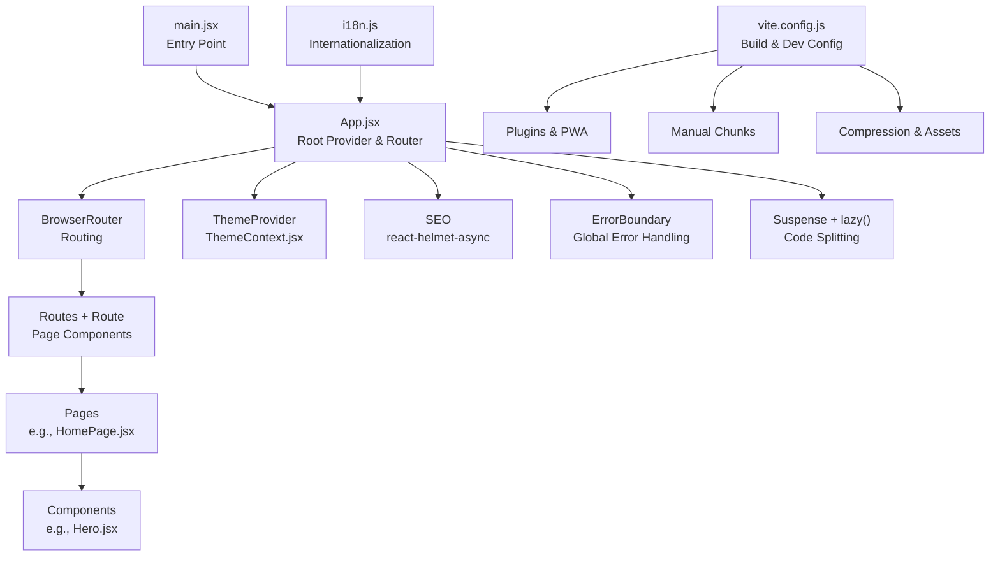
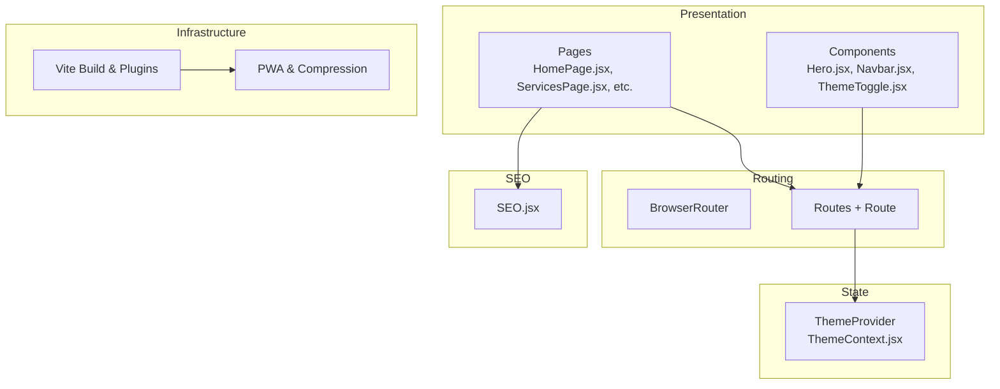
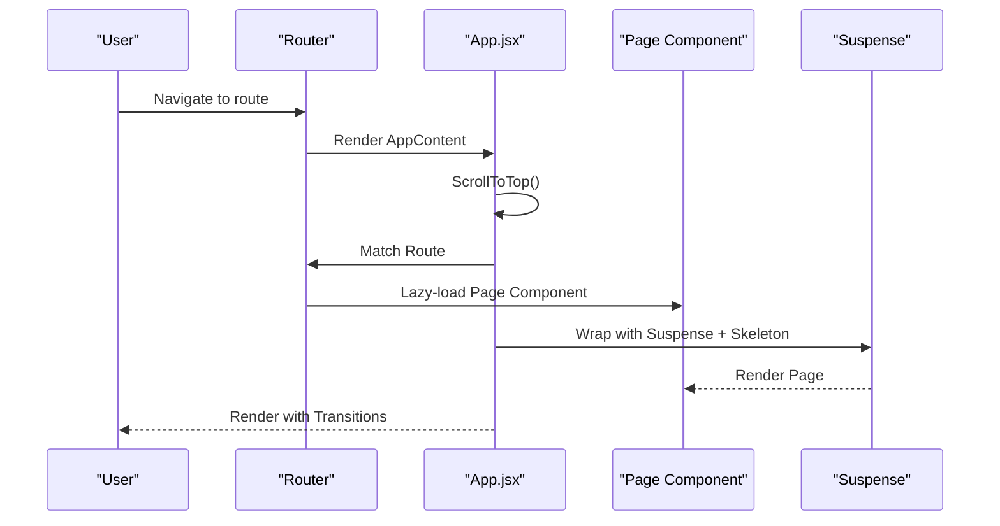
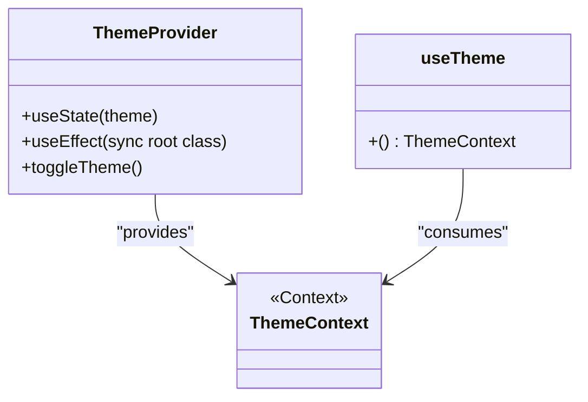
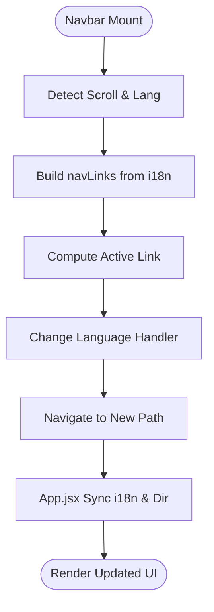
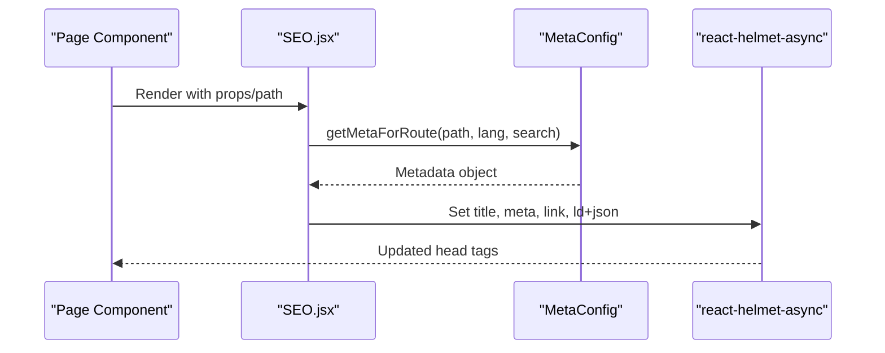
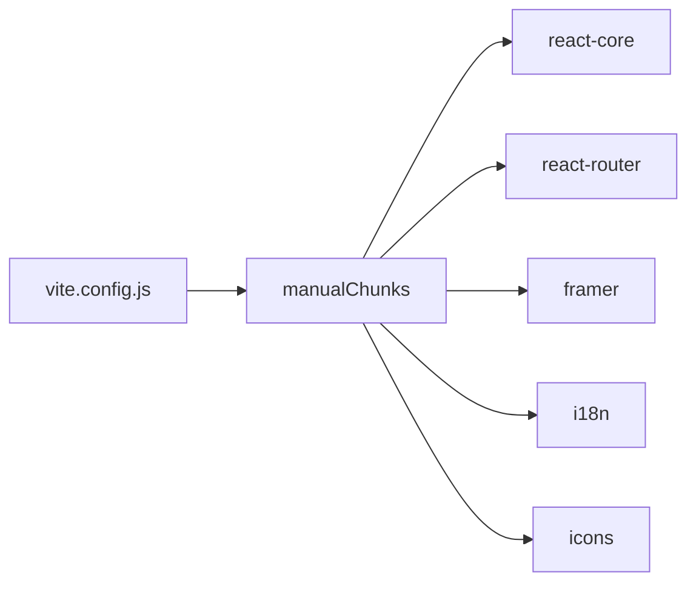

# Frontend Architecture

<cite>
**Referenced Files in This Document**
- [App.jsx](file://src/App.jsx)
- [main.jsx](file://src/main.jsx)
- [vite.config.js](file://vite.config.js)
- [package.json](file://package.json)
- [ThemeContext.jsx](file://src/context/ThemeContext.jsx)
- [Navbar.jsx](file://src/components/Navbar.jsx)
- [ThemeToggle.jsx](file://src/components/ThemeToggle.jsx)
- [SEO.jsx](file://src/components/SEO.jsx)
- [Hero.jsx](file://src/components/Hero.jsx)
- [HomePage.jsx](file://src/pages/HomePage.jsx)
- [i18n.js](file://src/i18n.js)
- [useMetadata.js](file://src/hooks/useMetadata.js)
</cite>

## Table of Contents
1. [Introduction](#introduction)
2. [Project Structure](#project-structure)
3. [Core Components](#core-components)
4. [Architecture Overview](#architecture-overview)
5. [Detailed Component Analysis](#detailed-component-analysis)
6. [Dependency Analysis](#dependency-analysis)
7. [Performance Considerations](#performance-considerations)
8. [Troubleshooting Guide](#troubleshooting-guide)
9. [Conclusion](#conclusion)

## Introduction
This document describes the frontend architecture of a React 19 application built with Vite. It focuses on the component hierarchy starting from the root App.jsx, routing configuration with React Router, state management via the Context API, and composition strategies for providers, layouts, and shared UI. It also covers the Vite build configuration including code splitting, asset optimization, and development server tuning, along with performance and development workflow practices.

## Project Structure
The application follows a feature-based structure with clear separation of concerns:
- Root entry initializes the app and strict mode.
- App.jsx orchestrates providers, routing, lazy loading, and global UI elements.
- Pages are organized per route and composed of reusable components.
- Shared UI components live under components/.
- Providers and contexts are isolated under context/.
- Internationalization is configured centrally.
- Build and deployment scripts are defined in package.json.

**Diagram sources**
- [main.jsx](file://src/main.jsx#L1-L12)
- [App.jsx](file://src/App.jsx#L1-L348)
- [vite.config.js](file://vite.config.js#L1-L262)
- [i18n.js](file://src/i18n.js#L1-L45)

**Section sources**
- [main.jsx](file://src/main.jsx#L1-L12)
- [App.jsx](file://src/App.jsx#L1-L348)
- [vite.config.js](file://vite.config.js#L1-L262)
- [package.json](file://package.json#L1-L49)

## Core Components
- App.jsx: Central orchestrator that sets up providers, routes, lazy-loading, skeleton fallbacks, scroll restoration, PWA registration, offline handling, and global UI elements.
- ThemeContext.jsx: Provider and hook for theme state with persistence and system preference fallback.
- SEO.jsx: Centralized SEO component using react-helmet-async with metadata configuration, JSON-LD, and multilingual support.
- Navbar.jsx: Navigation with theme toggle, language switching, responsive menus, and active link highlighting.
- ThemeToggle.jsx: Minimal toggle button leveraging ThemeContext.
- HomePage.jsx: Composes feature sections with lazy loading and skeleton fallback.
- Hero.jsx: Feature hero with animations and localized content.
- i18n.js: Internationalization initialization with language detection and storage.
- useMetadata.js: Client-side metadata utilities for SPA navigation.

**Section sources**
- [App.jsx](file://src/App.jsx#L1-L348)
- [ThemeContext.jsx](file://src/context/ThemeContext.jsx#L1-L46)
- [SEO.jsx](file://src/components/SEO.jsx#L1-L278)
- [Navbar.jsx](file://src/components/Navbar.jsx#L1-L337)
- [ThemeToggle.jsx](file://src/components/ThemeToggle.jsx#L1-L51)
- [HomePage.jsx](file://src/pages/HomePage.jsx#L1-L43)
- [Hero.jsx](file://src/components/Hero.jsx#L1-L165)
- [i18n.js](file://src/i18n.js#L1-L45)
- [useMetadata.js](file://src/hooks/useMetadata.js#L1-L117)

## Architecture Overview
The application uses a layered architecture:
- Presentation Layer: Pages and components render UI and orchestrate local state.
- Routing Layer: React Router manages navigation and route-based lazy loading.
- State Layer: Context API provides global state (theme) with persistence.
- SEO Layer: Centralized metadata management via react-helmet-async.
- Infrastructure Layer: Vite handles bundling, code splitting, PWA, and dev server.

**Diagram sources**
- [App.jsx](file://src/App.jsx#L1-L348)
- [HomePage.jsx](file://src/pages/HomePage.jsx#L1-L43)
- [Hero.jsx](file://src/components/Hero.jsx#L1-L165)
- [Navbar.jsx](file://src/components/Navbar.jsx#L1-L337)
- [ThemeContext.jsx](file://src/context/ThemeContext.jsx#L1-L46)
- [SEO.jsx](file://src/components/SEO.jsx#L1-L278)
- [vite.config.js](file://vite.config.js#L1-L262)

## Detailed Component Analysis

### App.jsx: Root Orchestrator
Key responsibilities:
- Provider setup: HelmetProvider, ErrorBoundary, ThemeProvider.
- Router setup: BrowserRouter, ScrollToTop, AnimatePresence for transitions.
- Routing: Route definitions for home, portfolio, labs, services, about, blog, legal, contact, and catch-all.
- Lazy loading: Suspense with skeleton fallbacks for page components.
- PWA: Service worker registration and periodic sync registration.
- i18n synchronization: Aligns URL path with language and document direction.
- Global UI: Share button, update toast, install prompt, offline toast, cursor effects.

**Diagram sources**
- [App.jsx](file://src/App.jsx#L52-L72)
- [App.jsx](file://src/App.jsx#L180-L291)

**Section sources**
- [App.jsx](file://src/App.jsx#L1-L348)

### ThemeContext.jsx: Provider Pattern
Implements the Provider pattern for theme management:
- Persists user choice in localStorage.
- Respects system preference as fallback.
- Applies theme to document root for Tailwind dark mode.
- Exposes a hook for consuming theme state and toggle function.

**Diagram sources**
- [ThemeContext.jsx](file://src/context/ThemeContext.jsx#L1-L46)

**Section sources**
- [ThemeContext.jsx](file://src/context/ThemeContext.jsx#L1-L46)

### Navbar.jsx: Composition and Responsive Behavior
- Integrates ThemeToggle and language switching.
- Computes active links based on current path.
- Implements desktop, mobile, and fullscreen overlays with animations.
- Uses lucide-react icons and framer-motion for micro-interactions.

**Diagram sources**
- [Navbar.jsx](file://src/components/Navbar.jsx#L30-L71)
- [App.jsx](file://src/App.jsx#L119-L143)

**Section sources**
- [Navbar.jsx](file://src/components/Navbar.jsx#L1-L337)

### SEO.jsx: Centralized Metadata Management
- Reads route-specific metadata from a configuration utility.
- Generates JSON-LD schemas (organization, service, FAQ, breadcrumbs, webpage).
- Emits HTML meta tags via react-helmet-async.
- Provides manual fallbacks for React 19 and async rendering edge cases.

**Diagram sources**
- [SEO.jsx](file://src/components/SEO.jsx#L7-L44)

**Section sources**
- [SEO.jsx](file://src/components/SEO.jsx#L1-L278)

### HomePage.jsx: Feature Composition with Lazy Loading
- Composes Hero, Services, Portfolio, TechStack, and Contact.
- Wraps children in Suspense with a skeleton fallback.
- Supports localized path for AR variant.

**Section sources**
- [HomePage.jsx](file://src/pages/HomePage.jsx#L1-L43)
- [Hero.jsx](file://src/components/Hero.jsx#L1-L165)

### i18n.js: Internationalization Initialization
- Initializes i18next with resources for English and Arabic.
- Uses i18next-browser-languagedetector with localStorage caching.
- Biases initial language selection for Arabic locales.

**Section sources**
- [i18n.js](file://src/i18n.js#L1-L45)

### useMetadata.js: Client-Side Metadata Utilities
- Provides a typed interface for setting and retrieving metadata during SPA navigation.
- Offers helpers for absolute URLs and default OG images.

**Section sources**
- [useMetadata.js](file://src/hooks/useMetadata.js#L1-L117)

## Dependency Analysis
The build configuration defines explicit manual chunks to optimize caching and reduce initial payload:
- react-core: react, react-dom, jsx runtime.
- react-router: react-router-dom.
- framer: framer-motion.
- i18n: i18next, react-i18next, language detector.
- icons: lucide-react.

**Diagram sources**
- [vite.config.js](file://vite.config.js#L222-L237)

**Section sources**
- [vite.config.js](file://vite.config.js#L1-L262)
- [package.json](file://package.json#L1-L49)

## Performance Considerations
- Code splitting: Route-level lazy loading with Suspense and skeleton fallbacks reduces initial JS.
- Manual chunks: Vendor bundles improve long-term caching and reduce duplicate code.
- Asset optimization: Vite PWA plugin with injectManifest, gzip/brotli compression, and strict precache limits.
- CSS strategy: Single CSS bundle inlining for critical path optimization.
- Dev server: HMR tuned for fast iteration.
- Bundle size warnings: Increased thresholds for vendor chunks to accommodate heavy libraries.

Recommendations:
- Monitor chunk sizes and adjust manualChunks as new features are added.
- Keep precache assets minimal; large assets are excluded from precaching.
- Consider dynamic imports for infrequently used components to further reduce initial load.

**Section sources**
- [App.jsx](file://src/App.jsx#L18-L36)
- [vite.config.js](file://vite.config.js#L204-L248)

## Troubleshooting Guide
Common areas to inspect:
- Routing and lazy loading: Ensure Suspense boundaries wrap lazy components and skeleton fallbacks are appropriate.
- Theme synchronization: Verify ThemeProvider wraps the app and localStorage persists user preferences.
- i18n alignment: Confirm App.jsx language sync logic matches Navbar navigation and document direction.
- PWA updates: Check SW registration callbacks and periodic sync registration for errors.
- SEO metadata: Validate metadata generation and JSON-LD injection; use debug logs in development.

**Section sources**
- [App.jsx](file://src/App.jsx#L87-L167)
- [ThemeContext.jsx](file://src/context/ThemeContext.jsx#L18-L26)
- [Navbar.jsx](file://src/components/Navbar.jsx#L39-L57)
- [SEO.jsx](file://src/components/SEO.jsx#L171-L223)

## Conclusion
The application employs a clean, layered architecture with clear separation of routing, state, and presentation. Provider patterns (ThemeProvider, HelmetProvider), route-based lazy loading, and centralized metadata management enable a scalable and maintainable frontend. The Vite configuration emphasizes performance through strategic code splitting, asset compression, and PWA integration, while the development workflow remains efficient with optimized HMR and build scripts.