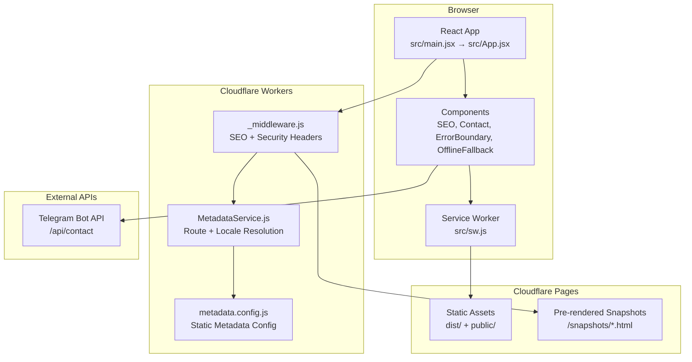
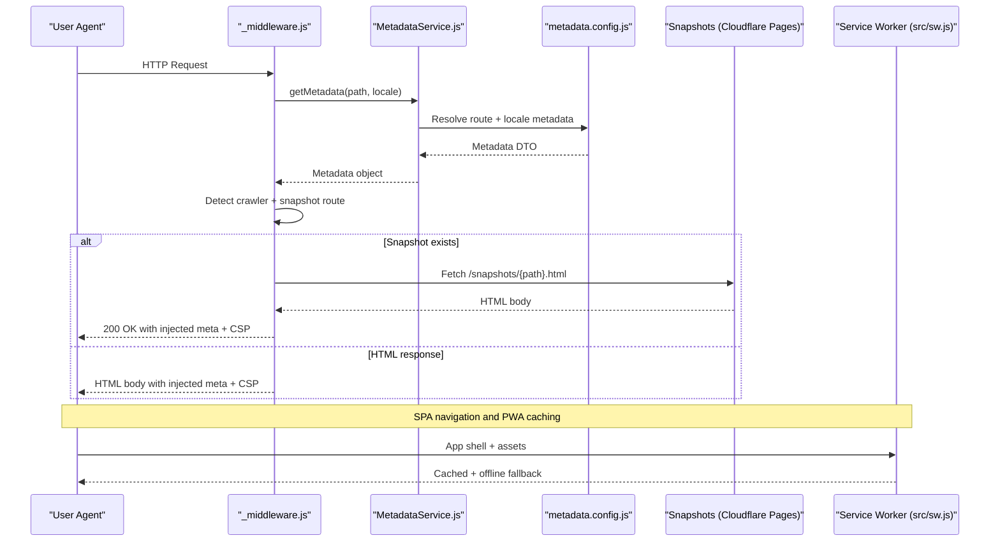
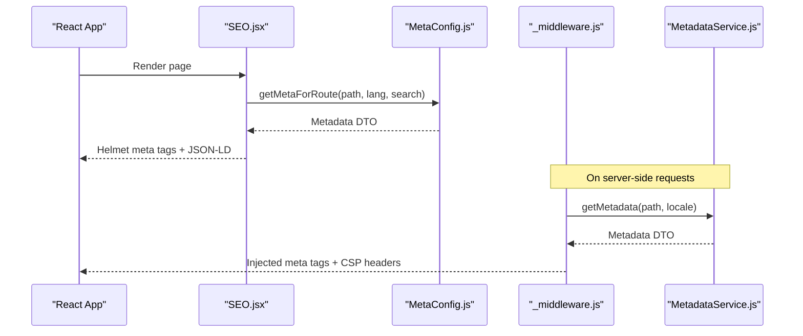
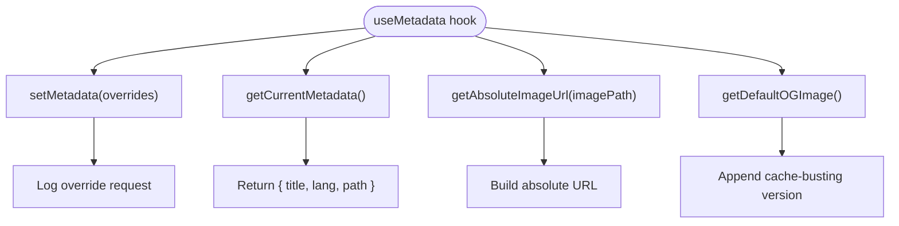
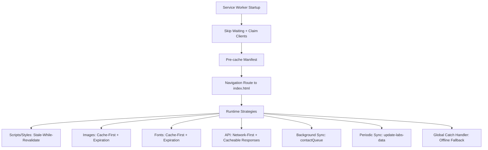
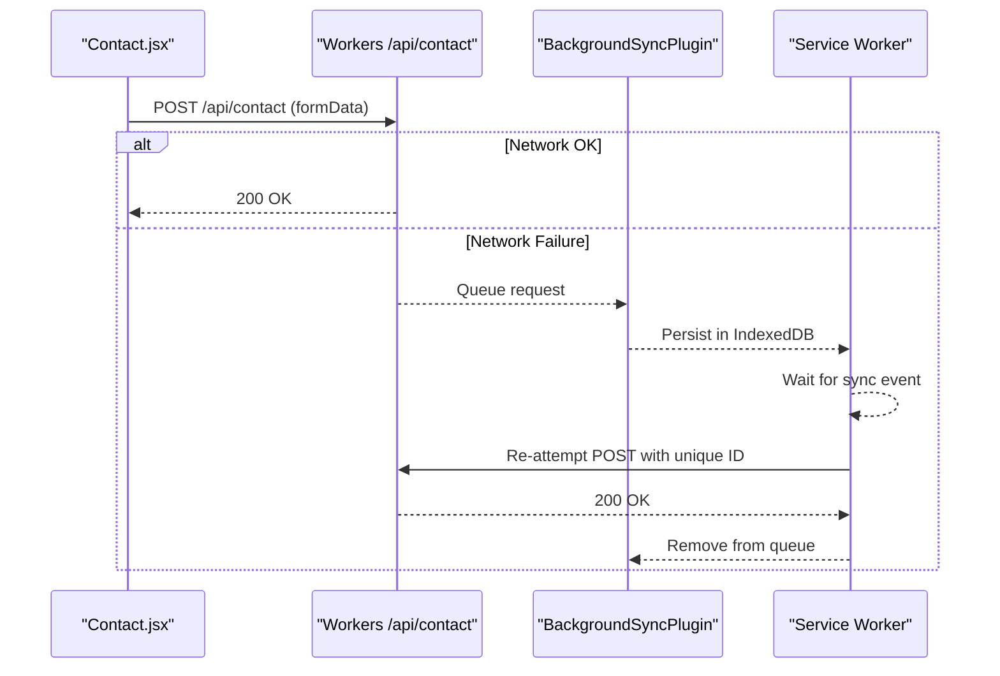
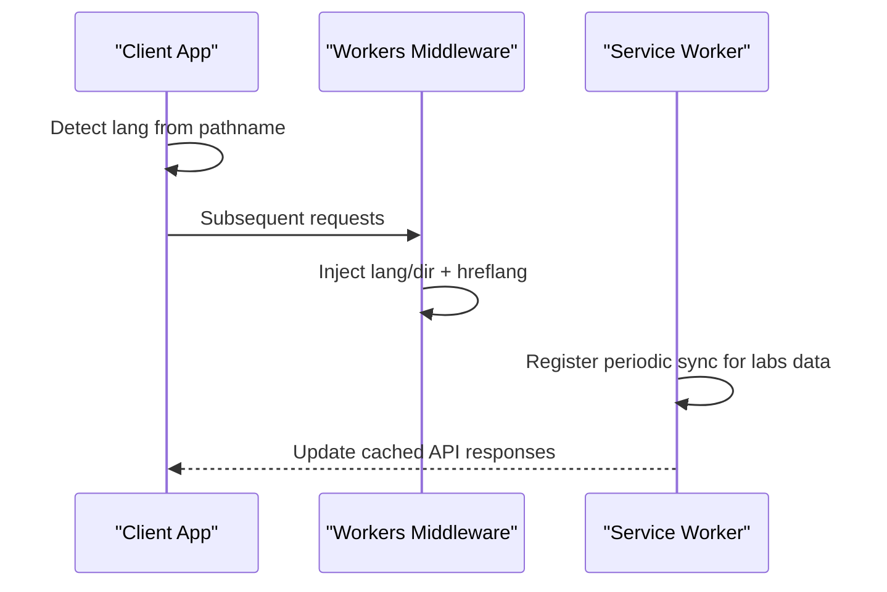
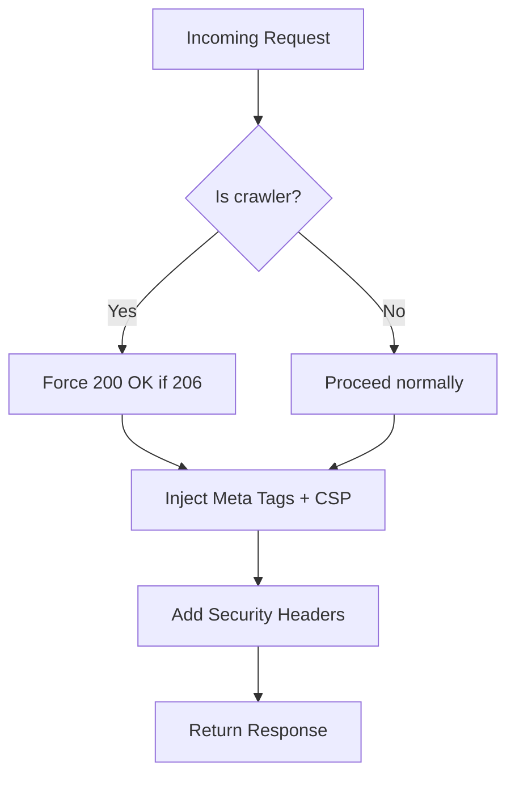
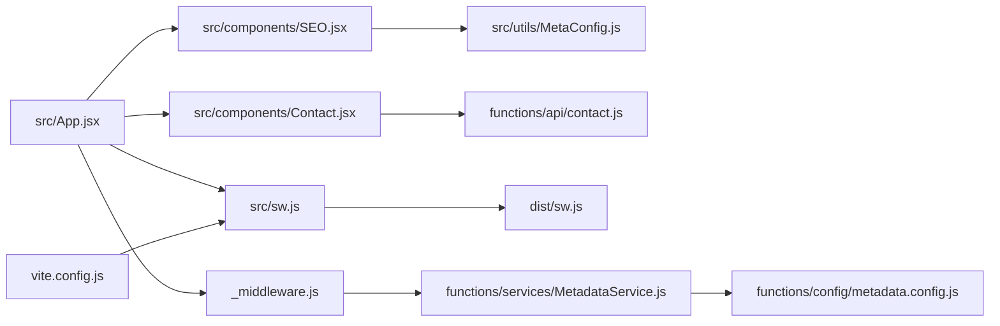

# Integration Patterns

<cite>
**Referenced Files in This Document**
- [src/main.jsx](file://src/main.jsx)
- [src/App.jsx](file://src/App.jsx)
- [src/components/SEO.jsx](file://src/components/SEO.jsx)
- [src/hooks/useMetadata.js](file://src/hooks/useMetadata.js)
- [src/utils/MetaConfig.js](file://src/utils/MetaConfig.js)
- [src/components/Contact.jsx](file://src/components/Contact.jsx)
- [src/components/ErrorBoundary.jsx](file://src/components/ErrorBoundary.jsx)
- [src/pages/OfflineFallback.jsx](file://src/pages/OfflineFallback.jsx)
- [functions/_middleware.js](file://functions/_middleware.js)
- [functions/services/MetadataService.js](file://functions/services/MetadataService.js)
- [functions/config/metadata.config.js](file://functions/config/metadata.config.js)
- [functions/api/contact.js](file://functions/api/contact.js)
- [src/sw.js](file://src/sw.js)
- [dist/sw.js](file://dist/sw.js)
- [vite.config.js](file://vite.config.js)
</cite>

## Table of Contents
1. [Introduction](#introduction)
2. [Project Structure](#project-structure)
3. [Core Components](#core-components)
4. [Architecture Overview](#architecture-overview)
5. [Detailed Component Analysis](#detailed-component-analysis)
6. [Dependency Analysis](#dependency-analysis)
7. [Performance Considerations](#performance-considerations)
8. [Troubleshooting Guide](#troubleshooting-guide)
9. [Conclusion](#conclusion)
10. [Appendices](#appendices)

## Introduction
This document describes the integration patterns of a hybrid system that combines:
- Frontend React components with Cloudflare Workers middleware for SEO optimization and metadata injection
- A Progressive Web App (PWA) with a service worker and client-side components, including cache strategies, offline functionality, background sync, and periodic updates
- A metadata hook system for dynamic meta tag updates
- Cross-origin resource sharing, caching headers, and progressive enhancement principles

It explains data flow patterns, error handling strategies across the full stack, and performance optimizations.

## Project Structure
The project follows a modern hybrid architecture:
- Client-side React application built with Vite and PWA enabled
- Cloudflare Workers middleware for SEO and security headers
- Static assets and snapshots served via Cloudflare Pages
- Service worker implementing Workbox strategies for caching and offline behavior

**Diagram sources**
- [src/main.jsx](file://src/main.jsx#L1-L12)
- [src/App.jsx](file://src/App.jsx#L1-L348)
- [src/components/SEO.jsx](file://src/components/SEO.jsx#L1-L278)
- [src/components/Contact.jsx](file://src/components/Contact.jsx#L1-L359)
- [src/components/ErrorBoundary.jsx](file://src/components/ErrorBoundary.jsx#L1-L57)
- [src/pages/OfflineFallback.jsx](file://src/pages/OfflineFallback.jsx#L1-L57)
- [src/sw.js](file://src/sw.js#L1-L227)
- [functions/_middleware.js](file://functions/_middleware.js#L1-L383)
- [functions/services/MetadataService.js](file://functions/services/MetadataService.js#L1-L380)
- [functions/config/metadata.config.js](file://functions/config/metadata.config.js#L1-L369)
- [functions/api/contact.js](file://functions/api/contact.js#L1-L62)

**Section sources**
- [src/main.jsx](file://src/main.jsx#L1-L12)
- [src/App.jsx](file://src/App.jsx#L1-L348)
- [vite.config.js](file://vite.config.js#L1-L262)

## Core Components
- React application bootstrap and routing with SEO and PWA integration
- Cloudflare Workers middleware for crawler detection, snapshot serving, metadata injection, and security headers
- Metadata service and configuration for route and locale-aware metadata
- Service worker with Workbox strategies for caching, offline fallback, background sync, and periodic updates
- Contact form submission pipeline with background sync for offline resiliency
- Error boundary and offline fallback UI for graceful degradation

**Section sources**
- [src/App.jsx](file://src/App.jsx#L74-L309)
- [functions/_middleware.js](file://functions/_middleware.js#L68-L264)
- [functions/services/MetadataService.js](file://functions/services/MetadataService.js#L44-L347)
- [functions/config/metadata.config.js](file://functions/config/metadata.config.js#L11-L369)
- [src/sw.js](file://src/sw.js#L14-L227)
- [src/components/Contact.jsx](file://src/components/Contact.jsx#L44-L82)
- [src/components/ErrorBoundary.jsx](file://src/components/ErrorBoundary.jsx#L4-L54)
- [src/pages/OfflineFallback.jsx](file://src/pages/OfflineFallback.jsx#L5-L52)

## Architecture Overview
The hybrid architecture integrates three layers:
- Client-side rendering with React and PWA capabilities
- Cloudflare Workers middleware for SEO and security
- Static assets and snapshots for pre-rendered content

**Diagram sources**
- [functions/_middleware.js](file://functions/_middleware.js#L68-L264)
- [functions/services/MetadataService.js](file://functions/services/MetadataService.js#L70-L88)
- [functions/config/metadata.config.js](file://functions/config/metadata.config.js#L119-L209)
- [src/sw.js](file://src/sw.js#L26-L45)

## Detailed Component Analysis

### SEO Integration Between Client and Workers
- Client-side SEO component renders meta tags and JSON-LD via React Helmet and a centralized metadata configuration.
- Workers middleware injects meta tags and security headers into HTML responses, ensuring crawlers receive complete metadata and that responses are secure.

**Diagram sources**
- [src/components/SEO.jsx](file://src/components/SEO.jsx#L7-L44)
- [src/utils/MetaConfig.js](file://src/utils/MetaConfig.js#L250-L295)
- [functions/_middleware.js](file://functions/_middleware.js#L150-L167)
- [functions/services/MetadataService.js](file://functions/services/MetadataService.js#L70-L88)

**Section sources**
- [src/components/SEO.jsx](file://src/components/SEO.jsx#L1-L278)
- [src/utils/MetaConfig.js](file://src/utils/MetaConfig.js#L1-L530)
- [functions/_middleware.js](file://functions/_middleware.js#L1-L383)
- [functions/services/MetadataService.js](file://functions/services/MetadataService.js#L1-L380)
- [functions/config/metadata.config.js](file://functions/config/metadata.config.js#L1-L369)

### Metadata Hook System for Dynamic Updates
- A custom React hook encapsulates metadata utilities for dynamic overrides and image helpers.
- The hook provides a clean API for components to signal metadata changes; the SEO component consumes these signals and updates Helmet accordingly.

**Diagram sources**
- [src/hooks/useMetadata.js](file://src/hooks/useMetadata.js#L43-L114)

**Section sources**
- [src/hooks/useMetadata.js](file://src/hooks/useMetadata.js#L1-L117)
- [src/components/SEO.jsx](file://src/components/SEO.jsx#L226-L274)

### PWA Integration: Service Worker and Client Components
- The service worker implements Workbox strategies:
  - Pre-caching of critical assets
  - Stale-while-revalidate for scripts/styles
  - Cache-first for images/fonts
  - Network-first for API
  - Background sync for contact form submissions
  - Periodic background sync for labs data
  - Comprehensive offline fallback
- The client app registers the service worker and exposes update/install prompts.

**Diagram sources**
- [src/sw.js](file://src/sw.js#L14-L227)
- [dist/sw.js](file://dist/sw.js#L1-L2)

**Section sources**
- [src/sw.js](file://src/sw.js#L1-L227)
- [dist/sw.js](file://dist/sw.js#L1-L2)
- [src/App.jsx](file://src/App.jsx#L87-L167)

### Background Sync for Contact Forms
- Client submits to /api/contact; on network failure, the service worker queues the request.
- Background sync retries queued submissions when connectivity is restored, adding a unique submission identifier to prevent duplicates.

**Diagram sources**
- [src/components/Contact.jsx](file://src/components/Contact.jsx#L51-L82)
- [functions/api/contact.js](file://functions/api/contact.js#L1-L62)
- [src/sw.js](file://src/sw.js#L118-L153)

**Section sources**
- [src/components/Contact.jsx](file://src/components/Contact.jsx#L1-L359)
- [functions/api/contact.js](file://functions/api/contact.js#L1-L62)
- [src/sw.js](file://src/sw.js#L118-L153)

### State Synchronization Between Client and Server
- Language and direction synchronization between client and server:
  - Client detects language from URL and updates document attributes
  - Workers inject appropriate HTML lang/dir and canonical hreflang tags
- Periodic background sync keeps client data fresh without requiring user interaction

**Diagram sources**
- [src/App.jsx](file://src/App.jsx#L119-L143)
- [functions/_middleware.js](file://functions/_middleware.js#L228-L263)
- [src/sw.js](file://src/sw.js#L183-L203)

**Section sources**
- [src/App.jsx](file://src/App.jsx#L117-L167)
- [functions/_middleware.js](file://functions/_middleware.js#L228-L263)
- [src/sw.js](file://src/sw.js#L183-L203)

### Cross-Origin Resource Sharing and Security Headers
- Workers enforce strict security headers and normalize crawler responses
- API endpoints include CORS headers for external access
- CSP is applied to mitigate XSS risks

**Diagram sources**
- [functions/_middleware.js](file://functions/_middleware.js#L177-L225)

**Section sources**
- [functions/_middleware.js](file://functions/_middleware.js#L196-L225)
- [functions/api/contact.js](file://functions/api/contact.js#L44-L59)

## Dependency Analysis
The integration relies on clear boundaries:
- Client depends on SEO utilities and metadata configuration
- Workers depend on the metadata service and configuration
- Service worker depends on Workbox and IndexedDB for persistence
- Build-time configuration controls PWA behavior and caching limits

**Diagram sources**
- [src/App.jsx](file://src/App.jsx#L1-L348)
- [src/components/SEO.jsx](file://src/components/SEO.jsx#L1-L278)
- [src/utils/MetaConfig.js](file://src/utils/MetaConfig.js#L1-L530)
- [src/components/Contact.jsx](file://src/components/Contact.jsx#L1-L359)
- [functions/api/contact.js](file://functions/api/contact.js#L1-L62)
- [src/sw.js](file://src/sw.js#L1-L227)
- [dist/sw.js](file://dist/sw.js#L1-L2)
- [functions/_middleware.js](file://functions/_middleware.js#L1-L383)
- [functions/services/MetadataService.js](file://functions/services/MetadataService.js#L1-L380)
- [functions/config/metadata.config.js](file://functions/config/metadata.config.js#L1-L369)
- [vite.config.js](file://vite.config.js#L1-L262)

**Section sources**
- [vite.config.js](file://vite.config.js#L19-L202)

## Performance Considerations
- Compression: gzip and brotli enabled at build time
- Asset inlining: small assets are inlined; larger assets are chunked and hashed
- Code splitting: vendor bundles separated for optimal caching
- Caching strategies:
  - Stale-while-revalidate for JS/CSS
  - Cache-first for images/fonts
  - Network-first for API with short timeouts
  - Precaching critical assets for instant first load
- Offline fallback reduces server load and improves resilience
- CSP and security headers improve trust and reduce attack surface

[No sources needed since this section provides general guidance]

## Troubleshooting Guide
- Error boundary displays a friendly UI and logs errors for diagnosis
- Offline fallback provides clear messaging and a reload action
- Service worker logs and background sync ensure offline submissions are retried
- Workers normalize crawler responses and inject meta tags to avoid 206 partial content issues

**Section sources**
- [src/components/ErrorBoundary.jsx](file://src/components/ErrorBoundary.jsx#L1-L57)
- [src/pages/OfflineFallback.jsx](file://src/pages/OfflineFallback.jsx#L1-L57)
- [src/sw.js](file://src/sw.js#L118-L153)
- [functions/_middleware.js](file://functions/_middleware.js#L177-L187)

## Conclusion
This hybrid architecture delivers:
- SEO-first behavior with crawler-aware middleware and metadata injection
- Progressive enhancement through robust PWA caching and offline fallback
- Resilient form submissions via background sync
- Strong security posture with CSP and normalized responses
- Maintainable metadata configuration and client-side hooks

[No sources needed since this section summarizes without analyzing specific files]

## Appendices

### Data Flow Patterns
- Client-side navigation triggers React rendering and Helmet updates
- Workers intercept HTML responses to inject metadata and security headers
- Service worker manages caching, offline fallback, and background tasks
- API calls leverage network-first with background sync for reliability

**Section sources**
- [src/App.jsx](file://src/App.jsx#L180-L291)
- [functions/_middleware.js](file://functions/_middleware.js#L168-L263)
- [src/sw.js](file://src/sw.js#L47-L174)
- [functions/api/contact.js](file://functions/api/contact.js#L1-L62)