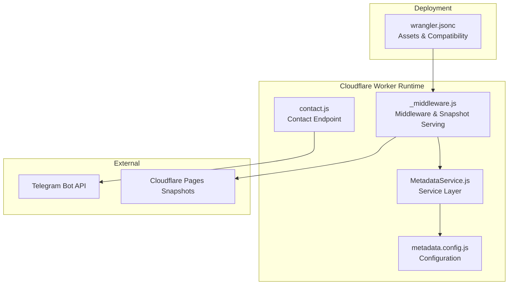
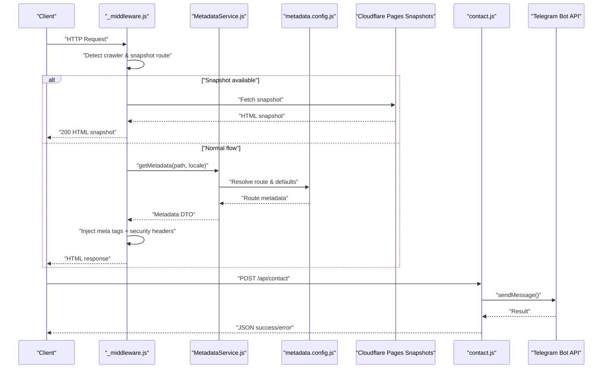
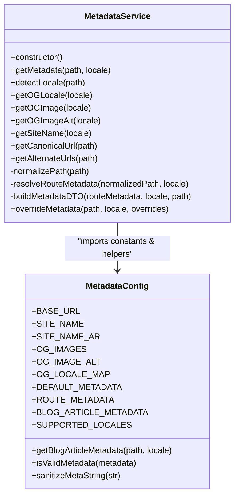
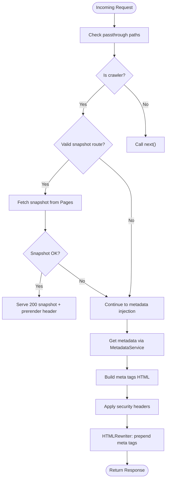
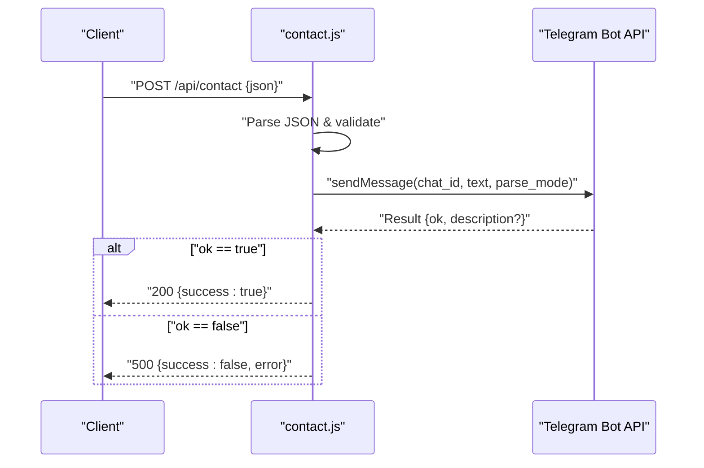
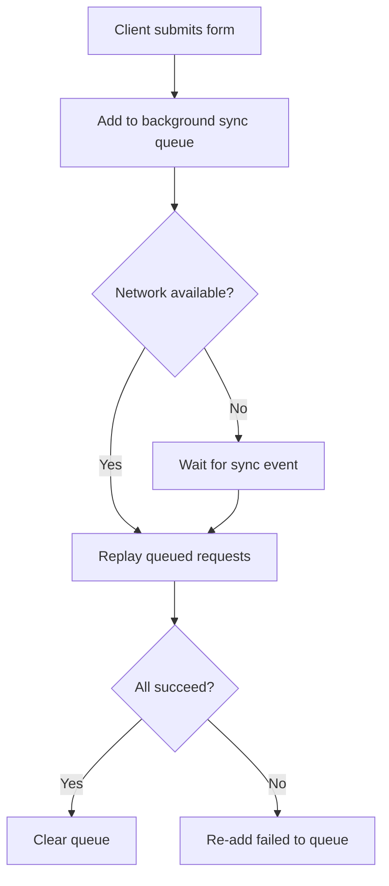
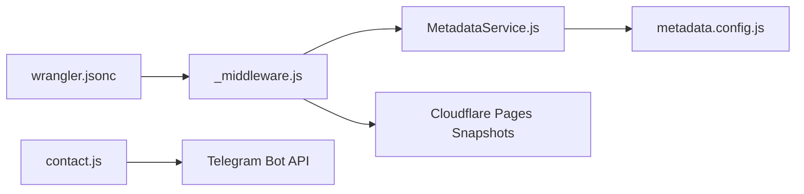

# Backend Services

<cite>
**Referenced Files in This Document**
- [_middleware.js](file://functions/_middleware.js)
- [MetadataService.js](file://functions/services/MetadataService.js)
- [metadata.config.js](file://functions/config/metadata.config.js)
- [contact.js](file://functions/api/contact.js)
- [wrangler.jsonc](file://wrangler.jsonc)
- [package.json](file://package.json)
- [MetadataService.test.js](file://functions/services/MetadataService.test.js)
- [MetaConfig.js](file://src/utils/MetaConfig.js)
- [useMetadata.js](file://src/hooks/useMetadata.js)
</cite>

## Table of Contents
1. [Introduction](#introduction)
2. [Project Structure](#project-structure)
3. [Core Components](#core-components)
4. [Architecture Overview](#architecture-overview)
5. [Detailed Component Analysis](#detailed-component-analysis)
6. [Dependency Analysis](#dependency-analysis)
7. [Performance Considerations](#performance-considerations)
8. [Troubleshooting Guide](#troubleshooting-guide)
9. [Conclusion](#conclusion)
10. [Appendices](#appendices)

## Introduction
This document explains the backend services powering the landing page using Cloudflare Workers. It covers the metadata service architecture, contact form processing, middleware functionality, service layer pattern, configuration management, error handling, background sync capabilities, and security considerations. Practical guidance is included for extending the metadata service, adding new endpoints, and integrating with external services. Performance optimization, logging, and monitoring strategies for serverless functions are also addressed.

## Project Structure
The backend is organized around a Cloudflare Worker middleware and a small set of services and configuration modules:
- Worker middleware injects metadata and security headers, and serves pre-rendered snapshots for crawlers.
- A service layer encapsulates metadata resolution and composition.
- Configuration is centralized and typed for robustness.
- An API endpoint processes contact submissions and forwards them to an external service.
- Wrangler configuration defines asset delivery and compatibility.

**Diagram sources**
- [_middleware.js](file://functions/_middleware.js#L76-L264)
- [MetadataService.js](file://functions/services/MetadataService.js#L44-L373)
- [metadata.config.js](file://functions/config/metadata.config.js#L39-L368)
- [contact.js](file://functions/api/contact.js#L1-L61)
- [wrangler.jsonc](file://wrangler.jsonc#L1-L8)

**Section sources**
- [wrangler.jsonc](file://wrangler.jsonc#L1-L8)

## Core Components
- Middleware: Detects crawlers, optionally serves pre-rendered snapshots, injects metadata and security headers, and normalizes HTML responses.
- MetadataService: Resolves localized metadata for routes, supports blog articles, and builds standardized metadata DTOs.
- Configuration: Centralized constants, route metadata, and helpers for sanitization and validation.
- Contact API: Receives form submissions, composes a message, and posts to an external Telegram API.
- Testing: Unit tests validate service behavior and edge cases.

**Section sources**
- [_middleware.js](file://functions/_middleware.js#L76-L264)
- [MetadataService.js](file://functions/services/MetadataService.js#L44-L373)
- [metadata.config.js](file://functions/config/metadata.config.js#L39-L368)
- [contact.js](file://functions/api/contact.js#L1-L61)
- [MetadataService.test.js](file://functions/services/MetadataService.test.js#L15-L369)

## Architecture Overview
The runtime flow:
- Requests arrive at the Worker middleware.
- Middleware detects crawlers and optionally serves cached snapshots from Cloudflare Pages.
- For HTML responses, metadata is resolved via MetadataService and injected using HTMLRewriter.
- Security headers are applied consistently.
- API requests are routed to the contact endpoint, which posts to an external service.

**Diagram sources**
- [_middleware.js](file://functions/_middleware.js#L76-L264)
- [MetadataService.js](file://functions/services/MetadataService.js#L70-L88)
- [metadata.config.js](file://functions/config/metadata.config.js#L119-L210)
- [contact.js](file://functions/api/contact.js#L1-L61)

## Detailed Component Analysis

### Metadata Service
The MetadataService implements a service layer pattern with:
- Strategy-like resolution for exact and partial matches against routes.
- Factory pattern for building standardized metadata DTOs.
- Helpers for locale detection, URL normalization, canonical and alternate URLs, and image selection.
- Singleton factory for reuse within a worker lifecycle.

**Diagram sources**
- [MetadataService.js](file://functions/services/MetadataService.js#L44-L347)
- [metadata.config.js](file://functions/config/metadata.config.js#L39-L368)

**Section sources**
- [MetadataService.js](file://functions/services/MetadataService.js#L44-L373)
- [metadata.config.js](file://functions/config/metadata.config.js#L39-L368)
- [MetadataService.test.js](file://functions/services/MetadataService.test.js#L15-L369)

### Middleware Functionality
Key responsibilities:
- Passthrough for PWA assets and snapshot routes to avoid interference.
- Crawler detection and snapshot serving from Cloudflare Pages.
- HTMLRewriter-based injection of meta tags at the beginning of the head.
- Security headers for best-practice hardening.
- Response normalization to avoid 206 Partial Content errors for crawlers.

**Diagram sources**
- [_middleware.js](file://functions/_middleware.js#L76-L264)

**Section sources**
- [_middleware.js](file://functions/_middleware.js#L76-L264)

### Contact API Endpoint
The endpoint:
- Parses JSON payload and extracts required fields.
- Composes a Markdown-formatted message.
- Posts to the Telegram Bot API using a configured token and chat ID.
- Returns a JSON response with success or error status.

**Diagram sources**
- [contact.js](file://functions/api/contact.js#L1-L61)

**Section sources**
- [contact.js](file://functions/api/contact.js#L1-L61)

### Background Sync Capabilities
The service worker includes a background sync queue for offline-friendly submission retries:
- A background sync queue stores failed requests locally.
- On sync events or on-demand, the worker replays queued submissions.
- Requests are retried with optional metadata tagging and respect retention limits.

**Diagram sources**
- [sw.js](file://dist/sw.js#L1-L200)

**Section sources**
- [sw.js](file://dist/sw.js#L1-L200)

### Security Considerations
- Content Security Policy, HSTS, frame options, XSS protection, referrer policy, and permissions policy are applied.
- Meta tags are sanitized to mitigate XSS risks.
- Absolute URLs are enforced for canonical and image references.
- Environment variables should be used for secrets (e.g., Telegram token) in production.

**Section sources**
- [_middleware.js](file://functions/_middleware.js#L196-L225)
- [metadata.config.js](file://functions/config/metadata.config.js#L357-L368)

### Configuration Management
- Centralized constants for base URLs, site names, OG images, locales, and metadata defaults.
- Route-specific metadata with bilingual support.
- Helpers for blog article metadata, validation, and sanitization.
- Client-side metadata utilities mirror server-side configuration for consistency.

**Section sources**
- [metadata.config.js](file://functions/config/metadata.config.js#L39-L368)
- [MetaConfig.js](file://src/utils/MetaConfig.js#L11-L180)
- [useMetadata.js](file://src/hooks/useMetadata.js#L43-L117)

### Error Handling Strategies
- Middleware: Clones and normalizes responses to avoid 206 errors for crawlers; logs snapshot fetch failures.
- MetadataService: Validates metadata and falls back to defaults; sanitizes inputs.
- Contact endpoint: Propagates Telegram API errors; returns structured JSON with error messages.

**Section sources**
- [_middleware.js](file://functions/_middleware.js#L177-L187)
- [MetadataService.js](file://functions/services/MetadataService.js#L275-L281)
- [contact.js](file://functions/api/contact.js#L52-L60)

## Dependency Analysis
- Middleware depends on MetadataService and HTMLRewriter for response transformation.
- MetadataService imports configuration constants and helpers.
- Contact endpoint depends on external Telegram API.
- Wrangler configuration defines asset delivery and compatibility date.

**Diagram sources**
- [_middleware.js](file://functions/_middleware.js#L76-L264)
- [MetadataService.js](file://functions/services/MetadataService.js#L44-L373)
- [metadata.config.js](file://functions/config/metadata.config.js#L39-L368)
- [contact.js](file://functions/api/contact.js#L1-L61)
- [wrangler.jsonc](file://wrangler.jsonc#L1-L8)

**Section sources**
- [package.json](file://package.json#L1-L49)

## Performance Considerations
- Minimize work in middleware: leverage caching and pre-rendered snapshots for crawlers.
- Keep metadata DTO construction lightweight; reuse the singleton service instance.
- Use absolute URLs and cache-busting for OG images to reduce revalidation overhead.
- Apply appropriate cache-control headers and consider CDN caching for static assets.
- Monitor response sizes and ensure meta tag injection occurs early to keep initial bytes optimal.

[No sources needed since this section provides general guidance]

## Troubleshooting Guide
- 206 Partial Content errors: Ensure responses are normalized to 200 for crawlers and that HTMLRewriter is used to prepend meta tags.
- Snapshot serving: Verify snapshot paths and that the fetch to Cloudflare Pages succeeds; log and gracefully degrade to metadata injection.
- Telegram API errors: Inspect returned error descriptions and ensure credentials are correct; consider rate limits and network timeouts.
- Metadata validation: If titles or descriptions appear incorrect, check sanitization and fallback logic.

**Section sources**
- [_middleware.js](file://functions/_middleware.js#L177-L187)
- [contact.js](file://functions/api/contact.js#L40-L42)

## Conclusion
The backend leverages a clean service layer, centralized configuration, and robust middleware to deliver optimized metadata for social crawlers, enforce strong security, and provide a resilient contact submission pipeline. Extending the system involves adding route metadata, implementing new endpoints, and integrating external services through the Worker runtime.

[No sources needed since this section summarizes without analyzing specific files]

## Appendices

### Practical Extension Examples
- Extend metadata service:
  - Add new route entries in configuration with localized titles and descriptions.
  - Implement article metadata for dynamic slugs using the existing blog helper.
  - Use the override method to programmatically adjust metadata for dynamic content.

- Add a new endpoint:
  - Create a new module under functions/api with an onRequest handler.
  - Define routing in the Worker manifest and ensure CORS headers if applicable.
  - Integrate with external APIs and propagate structured success/error responses.

- Integrate external services:
  - Use environment variables for tokens and secrets.
  - Implement retry/backoff for transient failures.
  - Log outcomes and monitor error rates.

**Section sources**
- [metadata.config.js](file://functions/config/metadata.config.js#L119-L284)
- [MetadataService.js](file://functions/services/MetadataService.js#L336-L346)
- [contact.js](file://functions/api/contact.js#L1-L61)