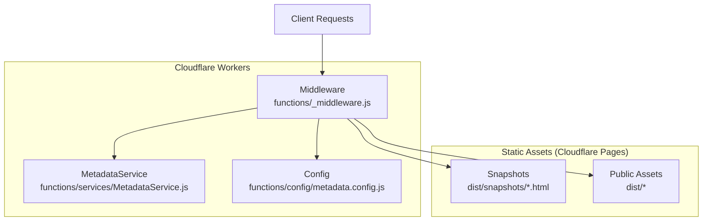
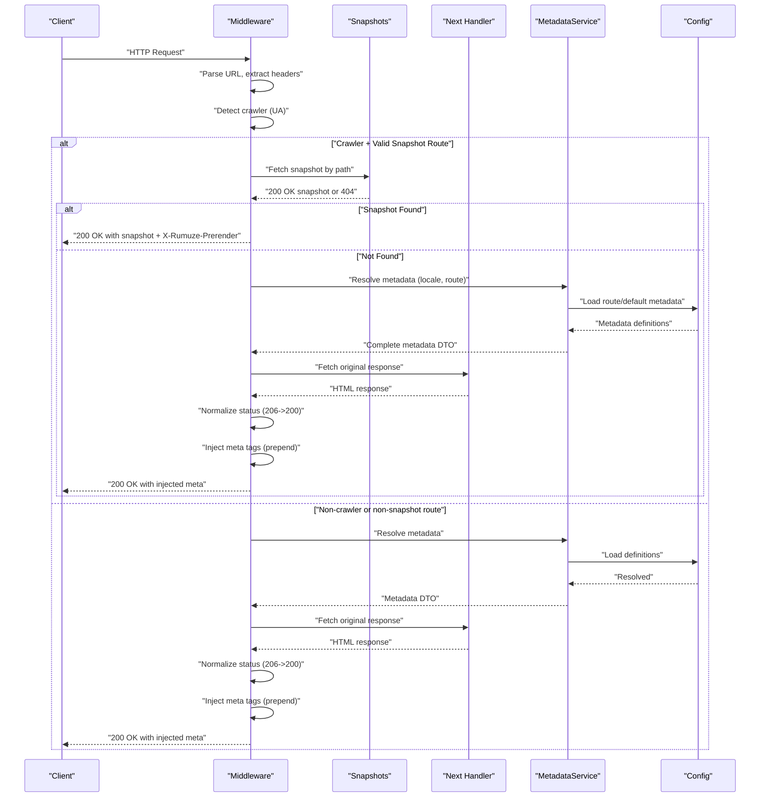
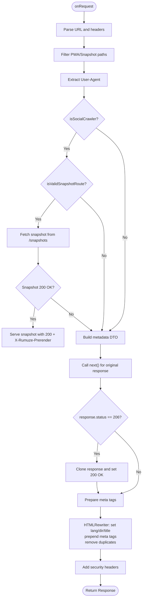
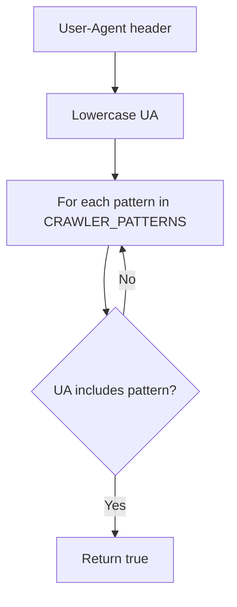
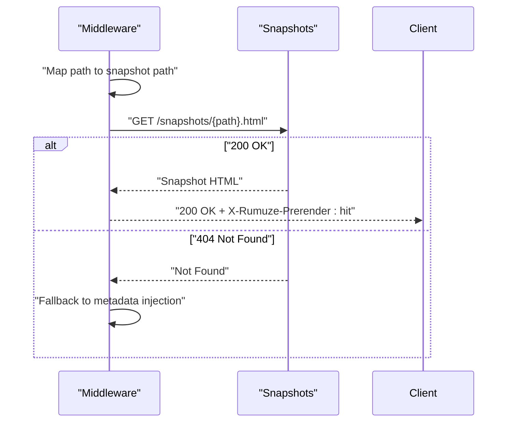
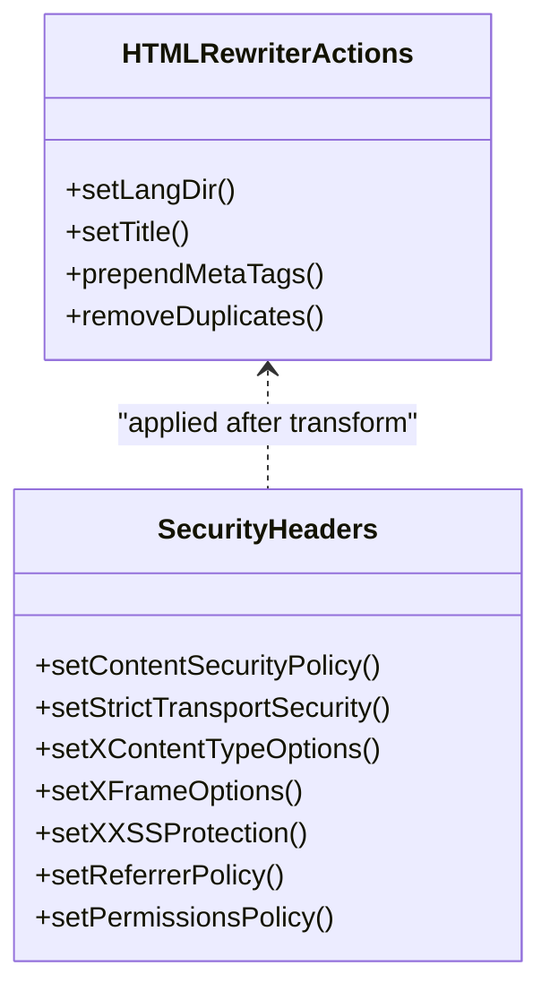
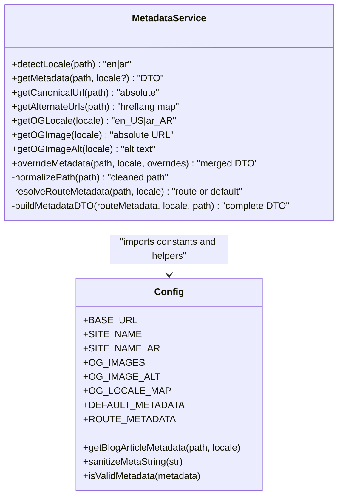
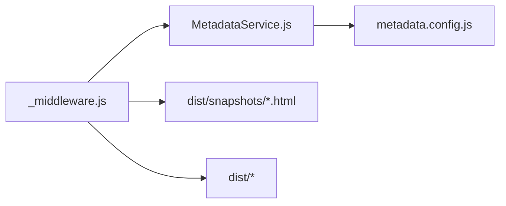

# Cloudflare Workers Middleware

<cite>
**Referenced Files in This Document**
- [functions/_middleware.js](file://functions/_middleware.js)
- [functions/services/MetadataService.js](file://functions/services/MetadataService.js)
- [functions/config/metadata.config.js](file://functions/config/metadata.config.js)
- [functions/services/MetadataService.test.js](file://functions/services/MetadataService.test.js)
- [wrangler.jsonc](file://wrangler.jsonc)
- [dist/snapshots/index.html](file://dist/snapshots/index.html)
- [docs/FACEBOOK_CRAWLER_FIX.md](file://docs/FACEBOOK_CRAWLER_FIX.md)
- [docs/DEPLOYMENT.md](file://docs/DEPLOYMENT.md)
- [package.json](file://package.json)
</cite>

## Table of Contents
1. [Introduction](#introduction)
2. [Project Structure](#project-structure)
3. [Core Components](#core-components)
4. [Architecture Overview](#architecture-overview)
5. [Detailed Component Analysis](#detailed-component-analysis)
6. [Dependency Analysis](#dependency-analysis)
7. [Performance Considerations](#performance-considerations)
8. [Troubleshooting Guide](#troubleshooting-guide)
9. [Conclusion](#conclusion)
10. [Appendices](#appendices)

## Introduction
This document explains the Cloudflare Workers middleware that powers SEO optimization and crawler detection for the landing page. It covers the middleware execution flow, request processing pipeline, response transformation logic, crawler detection algorithms, snapshot serving mechanisms, security headers, integration with the MetadataService, caching strategies, and performance optimizations. It also provides guidance on configuration, custom header addition, request filtering, debugging/logging, monitoring, and extending the middleware for advanced features such as A/B testing, traffic routing, and analytics.

## Project Structure
The middleware resides in the functions directory and integrates with a static asset delivery model via Cloudflare Pages. The build pipeline generates prerendered snapshots and static assets, while the middleware enriches responses for social crawlers and applies security headers.

**Diagram sources**
- [functions/_middleware.js](file://functions/_middleware.js#L76-L264)
- [functions/services/MetadataService.js](file://functions/services/MetadataService.js#L44-L380)
- [functions/config/metadata.config.js](file://functions/config/metadata.config.js#L1-L369)
- [dist/snapshots/index.html](file://dist/snapshots/index.html#L1-L107)

**Section sources**
- [functions/_middleware.js](file://functions/_middleware.js#L1-L383)
- [wrangler.jsonc](file://wrangler.jsonc#L1-L8)

## Core Components
- Middleware entrypoint: Orchestrates crawler detection, snapshot serving, metadata enrichment, and security headers.
- MetadataService: Resolves localized metadata, builds metadata DTOs, and supports overrides.
- Configuration: Centralized metadata definitions, locale mapping, and helpers.
- Snapshot assets: Pre-rendered HTML snapshots for crawler-friendly responses.

**Section sources**
- [functions/_middleware.js](file://functions/_middleware.js#L76-L264)
- [functions/services/MetadataService.js](file://functions/services/MetadataService.js#L44-L380)
- [functions/config/metadata.config.js](file://functions/config/metadata.config.js#L1-L369)
- [dist/snapshots/index.html](file://dist/snapshots/index.html#L1-L107)

## Architecture Overview
The middleware follows a layered architecture:
- Request layer: Extracts URL, detects crawler, and decides snapshot vs metadata path.
- Snapshot layer: Serves prerendered HTML when available.
- Metadata layer: Builds SEO metadata and injects it into the response.
- Security layer: Adds hardened headers.
- Transformation layer: Uses HTMLRewriter to prepend meta tags and remove duplicates.

**Diagram sources**
- [functions/_middleware.js](file://functions/_middleware.js#L76-L264)
- [functions/services/MetadataService.js](file://functions/services/MetadataService.js#L70-L88)
- [functions/config/metadata.config.js](file://functions/config/metadata.config.js#L119-L210)

## Detailed Component Analysis

### Middleware Execution Flow
- Request parsing: Extracts URL and path; excludes PWA assets and snapshot paths to avoid loops.
- Crawler detection: Compares User-Agent against known crawler patterns.
- Snapshot serving: Constructs snapshot path from request path and attempts to fetch from Cloudflare Pages assets.
- Fallback metadata injection: Builds metadata DTO, normalizes response status, injects meta tags, and adds security headers.
- Response transformation: Uses HTMLRewriter to set html lang/dir, update title, prepend meta tags, remove duplicates, and return transformed response.

**Diagram sources**
- [functions/_middleware.js](file://functions/_middleware.js#L76-L264)

**Section sources**
- [functions/_middleware.js](file://functions/_middleware.js#L76-L264)

### Crawler Detection Algorithms
- Pattern matching: Maintains a list of crawler User-Agent substrings and checks if any match the incoming request’s User-Agent.
- Scope: Covers major social media crawlers (Facebook, WhatsApp, LinkedIn, Twitter/X, Slack, Telegram, Discord, Skype) and search engines (Google, Bing, Baidu, DuckDuckGo, Yandex).
- Performance: O(P) where P is the number of patterns; negligible overhead.

**Diagram sources**
- [functions/_middleware.js](file://functions/_middleware.js#L276-L279)

**Section sources**
- [functions/_middleware.js](file://functions/_middleware.js#L42-L62)
- [functions/_middleware.js](file://functions/_middleware.js#L276-L279)

### Snapshot Serving Mechanism
- Path mapping: Converts request path to snapshot path (e.g., root to index.html, nested paths to underscore-separated filenames).
- Origin fetch: Requests snapshot from the same origin to leverage Cloudflare Pages static asset delivery.
- Graceful degradation: If snapshot not found, falls back to metadata injection.
- Header tagging: Adds a custom header to indicate snapshot was served.

**Diagram sources**
- [functions/_middleware.js](file://functions/_middleware.js#L102-L144)
- [dist/snapshots/index.html](file://dist/snapshots/index.html#L1-L107)

**Section sources**
- [functions/_middleware.js](file://functions/_middleware.js#L102-L144)

### Response Transformation Logic
- HTMLRewriter actions:
  - Set html lang and dir attributes based on metadata.
  - Replace title content.
  - Prepend meta tags to head (critical for crawler parsing within first 1KB).
  - Remove duplicate meta tags and links to avoid duplication.
- Security headers: Enforced for robust security posture.

**Diagram sources**
- [functions/_middleware.js](file://functions/_middleware.js#L228-L263)
- [functions/_middleware.js](file://functions/_middleware.js#L196-L225)

**Section sources**
- [functions/_middleware.js](file://functions/_middleware.js#L196-L263)

### MetadataService and Configuration
- Responsibilities:
  - Detect locale from path.
  - Resolve route-specific metadata or fallback to defaults.
  - Build complete metadata DTO with image dimensions, canonical URLs, alternate URLs, and article metadata.
  - Support overrides for dynamic content.
- Configuration:
  - Centralized metadata definitions, locale mapping, OG images, and helpers.
  - Validation and sanitization utilities.

**Diagram sources**
- [functions/services/MetadataService.js](file://functions/services/MetadataService.js#L44-L347)
- [functions/config/metadata.config.js](file://functions/config/metadata.config.js#L1-L369)

**Section sources**
- [functions/services/MetadataService.js](file://functions/services/MetadataService.js#L70-L347)
- [functions/config/metadata.config.js](file://functions/config/metadata.config.js#L119-L369)

### Security Header Implementation
- Content Security Policy tailored for Vite/React and CDN resources.
- Strict Transport Security, X-Content-Type-Options, X-Frame-Options, X-XSS-Protection, Referrer-Policy, Permissions-Policy.
- Applied to a cloned response to preserve original headers and body.

**Section sources**
- [functions/_middleware.js](file://functions/_middleware.js#L196-L225)

### Integration with MetadataService
- The middleware initializes a singleton MetadataService instance and resolves metadata for the current path and locale.
- Metadata DTOs are used to construct meta tags and canonical/hreflang links.

**Section sources**
- [functions/_middleware.js](file://functions/_middleware.js#L150-L167)
- [functions/services/MetadataService.js](file://functions/services/MetadataService.js#L70-L88)

### Response Caching Strategies
- Snapshot caching: Static assets served by Cloudflare Pages; middleware adds a custom header to indicate snapshot origin.
- OG image cache busting: Versioned OG images to force refresh across social platforms.
- Recommendations:
  - Use long-lived cache headers for static assets.
  - Consider CDN caching for prerendered snapshots.
  - Monitor cache hit rates and adjust TTLs.

**Section sources**
- [functions/_middleware.js](file://functions/_middleware.js#L129-L137)
- [functions/config/metadata.config.js](file://functions/config/metadata.config.js#L52-L71)
- [docs/DEPLOYMENT.md](file://docs/DEPLOYMENT.md#L92-L124)

### Performance Optimization Techniques
- Minimal overhead: Crawler detection and response normalization only apply when needed.
- Prepend injection: Ensures crawler-readability without scanning entire documents.
- Status normalization: Fixes 206 responses to 200 for crawlers.
- Static snapshot serving: Reduces runtime processing for crawlers.

**Section sources**
- [functions/_middleware.js](file://functions/_middleware.js#L177-L187)
- [docs/FACEBOOK_CRAWLER_FIX.md](file://docs/FACEBOOK_CRAWLER_FIX.md#L282-L301)

## Dependency Analysis
- Middleware depends on MetadataService and configuration constants.
- MetadataService depends on configuration for route metadata, defaults, and helpers.
- Snapshot assets are served by Cloudflare Pages; middleware fetches them from the same origin.

**Diagram sources**
- [functions/_middleware.js](file://functions/_middleware.js#L29-L29)
- [functions/services/MetadataService.js](file://functions/services/MetadataService.js#L16-L29)
- [functions/config/metadata.config.js](file://functions/config/metadata.config.js#L1-L369)

**Section sources**
- [functions/_middleware.js](file://functions/_middleware.js#L29-L29)
- [functions/services/MetadataService.js](file://functions/services/MetadataService.js#L16-L29)
- [functions/config/metadata.config.js](file://functions/config/metadata.config.js#L1-L369)

## Performance Considerations
- Middleware latency: ~5–12 ms depending on crawler detection and normalization.
- Snapshot serving: Leverages static assets for near-zero runtime cost.
- OG image size: ~150 KB; consider WebP conversion and CDN caching for reduction.
- Recommendations:
  - Minimize HTMLRewriter operations to essential selectors.
  - Cache metadata DTOs per worker lifecycle (already singleton).
  - Monitor Cloudflare Worker metrics for CPU time and error rates.

[No sources needed since this section provides general guidance]

## Troubleshooting Guide
- 206 Partial Content errors:
  - Ensure crawler detection triggers normalization to 200 OK.
  - Verify HTMLRewriter runs after response normalization.
- OG tags not visible:
  - Confirm meta tags are prepended to head and appear first.
  - Clear platform caches (e.g., Facebook “Scrape Again”).
- Snapshot not served:
  - Verify snapshot path mapping and existence.
  - Check for infinite loops by avoiding snapshot paths in passthrough.
- Security headers:
  - Validate CSP and other headers are present on responses.
- Logging and monitoring:
  - Use Cloudflare Workers logs to inspect User-Agent patterns and response statuses.
  - Monitor error rates and latency in dashboard metrics.

**Section sources**
- [functions/_middleware.js](file://functions/_middleware.js#L177-L187)
- [functions/_middleware.js](file://functions/_middleware.js#L228-L263)
- [docs/FACEBOOK_CRAWLER_FIX.md](file://docs/FACEBOOK_CRAWLER_FIX.md#L336-L362)
- [docs/DEPLOYMENT.md](file://docs/DEPLOYMENT.md#L127-L144)

## Conclusion
The middleware provides a robust, production-grade solution for SEO optimization and crawler compatibility on Cloudflare Workers. It combines crawler detection, snapshot serving, metadata enrichment, and security hardening to deliver fast, compliant responses for social platforms. The architecture is modular, testable, and extensible for future enhancements such as A/B testing, traffic routing, and analytics integration.

[No sources needed since this section summarizes without analyzing specific files]

## Appendices

### Middleware Configuration Examples
- Adding custom headers:
  - Extend the response cloning and header-setting logic to include additional headers.
- Custom crawler patterns:
  - Update the crawler patterns list to include new platforms or refine detection.
- Snapshot route exclusions:
  - Adjust passthrough filters to exclude additional asset types or routes.

**Section sources**
- [functions/_middleware.js](file://functions/_middleware.js#L196-L225)
- [functions/_middleware.js](file://functions/_middleware.js#L42-L62)
- [functions/_middleware.js](file://functions/_middleware.js#L84-L92)

### Debugging and Monitoring Best Practices
- Use Cloudflare Workers logs to track crawler activity and response statuses.
- Validate with platform debuggers (e.g., Facebook Sharing Debugger).
- Monitor Cloudflare Worker metrics for CPU time and error rates.
- Maintain cache-busting strategy for OG images.

**Section sources**
- [docs/DEPLOYMENT.md](file://docs/DEPLOYMENT.md#L127-L144)
- [docs/FACEBOOK_CRAWLER_FIX.md](file://docs/FACEBOOK_CRAWLER_FIX.md#L225-L279)

### Extending the Middleware
- A/B testing:
  - Introduce feature flags or split logic based on request headers or query parameters.
- Traffic routing:
  - Route requests to different snapshot sets or metadata configurations.
- Analytics integration:
  - Add lightweight analytics hooks (e.g., custom headers or opt-in telemetry) while preserving performance.

[No sources needed since this section provides general guidance]