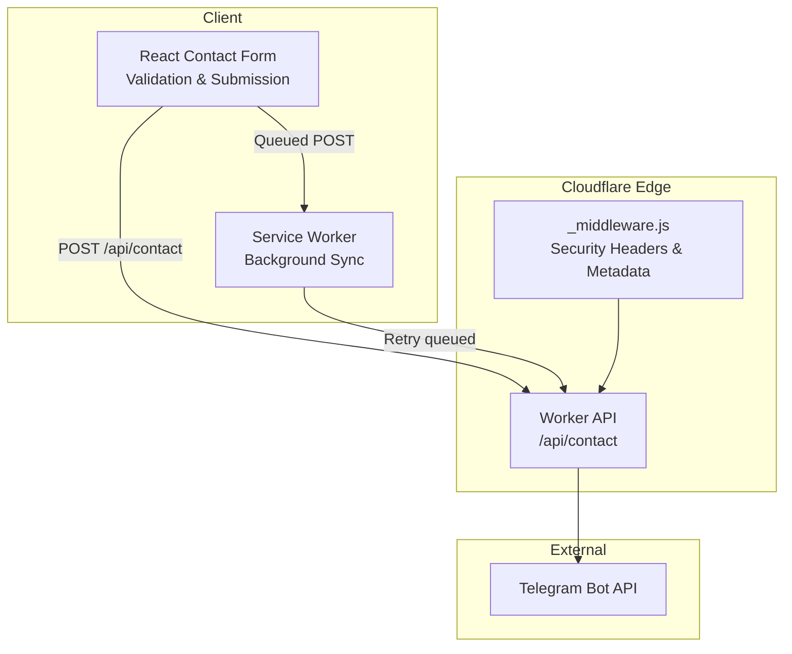
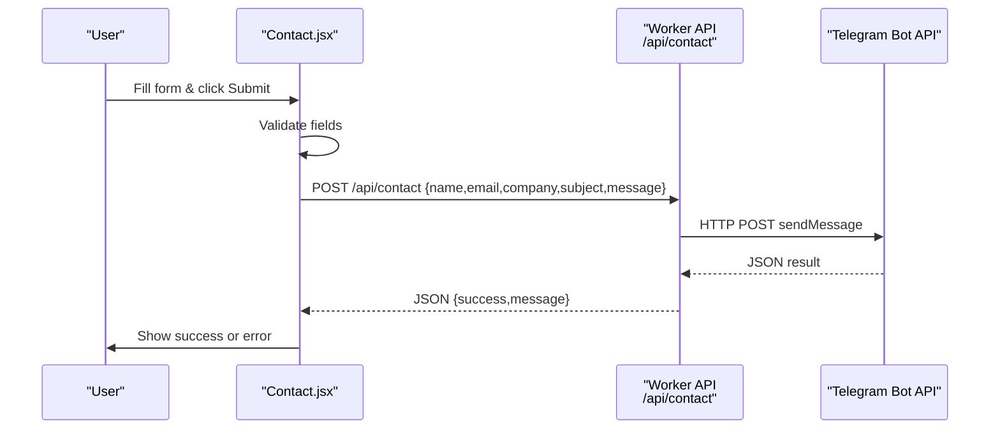
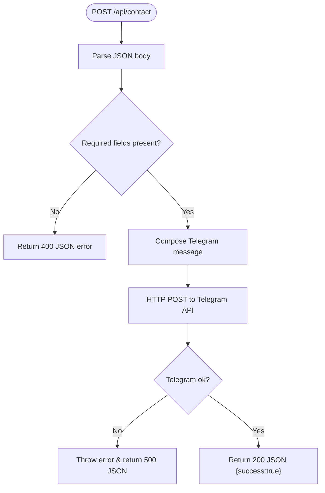
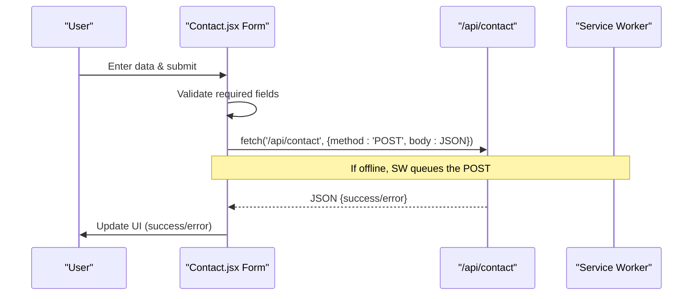
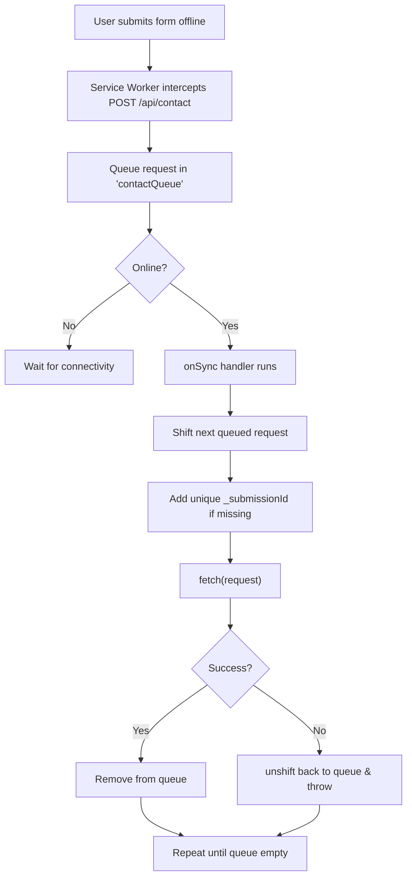
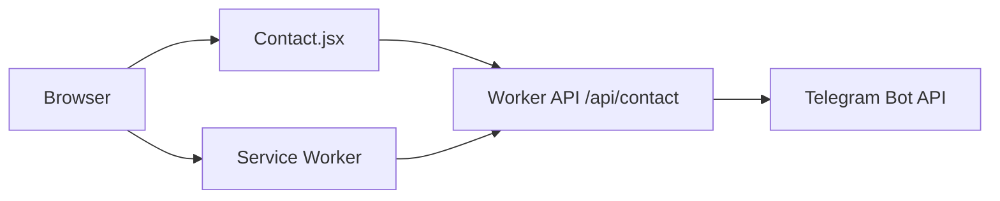

# Contact API

<cite>
**Referenced Files in This Document**
- [contact.js](file://functions/api/contact.js)
- [Contact.jsx](file://src/components/Contact.jsx)
- [ContactPage.jsx](file://src/pages/ContactPage.jsx)
- [sw.js](file://src/sw.js)
- [_middleware.js](file://functions/_middleware.js)
- [wrangler.jsonc](file://wrangler.jsonc)
- [OfflineToast.jsx](file://src/components/OfflineToast.jsx)
</cite>

## Table of Contents
1. [Introduction](#introduction)
2. [Project Structure](#project-structure)
3. [Core Components](#core-components)
4. [Architecture Overview](#architecture-overview)
5. [Detailed Component Analysis](#detailed-component-analysis)
6. [Dependency Analysis](#dependency-analysis)
7. [Performance Considerations](#performance-considerations)
8. [Troubleshooting Guide](#troubleshooting-guide)
9. [Conclusion](#conclusion)

## Introduction
This document describes the contact form API endpoint built with Cloudflare Workers. It explains the request processing workflow, validation logic, and background synchronization capabilities for offline submissions. It also documents the API endpoint specification, error handling, security measures, rate limiting, spam prevention, compliance considerations, and practical client-side integration patterns.

## Project Structure
The contact form spans three layers:
- Frontend React component that validates and submits form data
- Cloudflare Worker API endpoint that forwards messages to Telegram
- Service Worker that queues and retries failed submissions for offline scenarios

**Diagram sources**
- [Contact.jsx](file://src/components/Contact.jsx#L44-L82)
- [sw.js](file://src/sw.js#L118-L153)
- [_middleware.js](file://functions/_middleware.js#L76-L264)
- [contact.js](file://functions/api/contact.js#L1-L62)

**Section sources**
- [contact.js](file://functions/api/contact.js#L1-L62)
- [Contact.jsx](file://src/components/Contact.jsx#L1-L359)
- [sw.js](file://src/sw.js#L1-L227)
- [_middleware.js](file://functions/_middleware.js#L1-L383)

## Core Components
- Contact API endpoint: Receives JSON payload, validates required fields, and posts to Telegram via HTTPS.
- Client-side form: Validates locally and submits to the API endpoint.
- Service Worker: Queues failed POST requests and retries them when connectivity is restored.
- Middleware: Applies security headers and metadata normalization for social crawlers.

Key implementation references:
- API endpoint: [contact.js](file://functions/api/contact.js#L1-L62)
- Client-side validation and submission: [Contact.jsx](file://src/components/Contact.jsx#L33-L82)
- Background sync queue and retry: [sw.js](file://src/sw.js#L118-L153)
- Security headers and metadata: [_middleware.js](file://functions/_middleware.js#L196-L225)

**Section sources**
- [contact.js](file://functions/api/contact.js#L1-L62)
- [Contact.jsx](file://src/components/Contact.jsx#L33-L82)
- [sw.js](file://src/sw.js#L118-L153)
- [_middleware.js](file://functions/_middleware.js#L196-L225)

## Architecture Overview
The contact form follows a straightforward pipeline:
1. Client-side validation occurs before submission.
2. The form posts JSON to the Cloudflare Worker endpoint.
3. The Worker forwards the message to Telegram and returns a JSON response.
4. Service Worker intercepts POST requests to the contact endpoint and queues failures for retry.

**Diagram sources**
- [Contact.jsx](file://src/components/Contact.jsx#L44-L82)
- [contact.js](file://functions/api/contact.js#L1-L62)

## Detailed Component Analysis

### API Endpoint: /api/contact
- Purpose: Accepts contact form submissions and forwards them to Telegram.
- Method: POST
- Request Body Schema:
  - name: string (required)
  - email: string (required, validated client-side)
  - company: string (optional)
  - subject: string (optional)
  - message: string (required)
- Response Schema:
  - success: boolean
  - message: string (on success)
  - error: string (on failure)
- Validation:
  - Required fields: name, email, message
  - Email format validated client-side
- Error Handling:
  - Throws on Telegram API errors
  - Returns 500 with JSON error on exceptions
- Security:
  - Access-Control-Allow-Origin: *
  - No CSRF protection implemented at endpoint level

**Diagram sources**
- [contact.js](file://functions/api/contact.js#L1-L62)

**Section sources**
- [contact.js](file://functions/api/contact.js#L1-L62)

### Client-Side Integration (React)
- Validation:
  - name: required
  - email: required, basic format check
  - message: required
- Submission:
  - Posts to /api/contact with JSON payload
  - Handles success (clears form, shows success) and error (alerts user)
- Success Feedback:
  - Clears form fields and displays a success message for a short time

**Diagram sources**
- [Contact.jsx](file://src/components/Contact.jsx#L33-L82)
- [sw.js](file://src/sw.js#L118-L153)

**Section sources**
- [Contact.jsx](file://src/components/Contact.jsx#L33-L82)

### Background Sync and Offline Submissions
- Interception:
  - Service Worker intercepts POST requests to /api/contact
- Queue Management:
  - Uses Background Sync queue named "contactQueue"
  - Retains requests for up to 24 hours
  - Prevents duplicate submissions by adding a unique "_submissionId" to form data
- Retry Logic:
  - On sync or subsequent attempts, re-fetches the queued request
  - On failure, re-inserts at the front of the queue
- Fallback:
  - Comprehensive offline fallback for navigation and images

**Diagram sources**
- [sw.js](file://src/sw.js#L118-L153)

**Section sources**
- [sw.js](file://src/sw.js#L118-L153)

### Security Measures
- Content Security Policy applied by middleware:
  - Limits script and style sources
  - Restricts framing and enables XSS protections
  - Enforces strict transport security and referrer policy
- Cross-Origin Allow:
  - API endpoint allows any origin for CORS
- Recommendations:
  - Add CSRF protection tokens
  - Implement rate limiting at edge
  - Use environment variables for Telegram credentials

**Section sources**
- [_middleware.js](file://functions/_middleware.js#L196-L225)
- [contact.js](file://functions/api/contact.js#L44-L59)

## Dependency Analysis
- Client → Worker API: fetch('/api/contact', POST)
- Worker API → Telegram Bot API: HTTPS POST sendMessage
- Service Worker → Worker API: Background Sync retry
- Middleware applies security headers globally

**Diagram sources**
- [Contact.jsx](file://src/components/Contact.jsx#L44-L82)
- [contact.js](file://functions/api/contact.js#L1-L62)
- [sw.js](file://src/sw.js#L118-L153)

**Section sources**
- [Contact.jsx](file://src/components/Contact.jsx#L44-L82)
- [contact.js](file://functions/api/contact.js#L1-L62)
- [sw.js](file://src/sw.js#L118-L153)

## Performance Considerations
- Edge compute: Cloudflare Workers reduce latency by processing close to users.
- Background sync: Queues requests to avoid blocking user experience.
- Caching: Service Worker strategies optimize static assets and API responses.
- Recommendations:
  - Add rate limiting to prevent abuse
  - Consider request batching for high-volume scenarios
  - Monitor Telegram API response times and implement circuit breaker logic

## Troubleshooting Guide
Common issues and resolutions:
- Telegram API errors:
  - Symptom: 500 response with error message
  - Cause: Telegram API returned non-ok result
  - Action: Verify BOT_TOKEN and CHAT_ID; check Telegram API status
  - Reference: [contact.js](file://functions/api/contact.js#L40-L42)
- CORS issues:
  - Symptom: Preflight blocked or blocked by CORS policy
  - Cause: Origin restrictions or missing headers
  - Action: Confirm Access-Control-Allow-Origin setting
  - Reference: [contact.js](file://functions/api/contact.js#L47-L57)
- Offline submissions not syncing:
  - Symptom: Form appears submitted but no message arrives
  - Cause: Service Worker not registered or queue not configured
  - Action: Verify Service Worker installation and background sync permissions
  - References: [sw.js](file://src/sw.js#L118-L153), [OfflineToast.jsx](file://src/components/OfflineToast.jsx#L1-L47)
- Duplicate submissions after retry:
  - Symptom: Duplicate messages after connectivity restore
  - Cause: Missing unique submission ID
  - Action: Ensure unique "_submissionId" is added to form data
  - Reference: [sw.js](file://src/sw.js#L131-L135)
- Client-side validation bypass:
  - Symptom: Empty or invalid fields sent to API
  - Cause: Validation skipped or disabled
  - Action: Ensure client-side validation runs before submission
  - Reference: [Contact.jsx](file://src/components/Contact.jsx#L33-L42)

**Section sources**
- [contact.js](file://functions/api/contact.js#L40-L42)
- [contact.js](file://functions/api/contact.js#L47-L57)
- [sw.js](file://src/sw.js#L118-L153)
- [OfflineToast.jsx](file://src/components/OfflineToast.jsx#L1-L47)
- [Contact.jsx](file://src/components/Contact.jsx#L33-L42)

## Conclusion
The contact form leverages Cloudflare Workers for efficient, low-latency processing and integrates a robust Service Worker background sync mechanism to handle offline submissions reliably. While the current implementation focuses on Telegram delivery and basic client-side validation, enhancements such as rate limiting, CSRF protection, and environment-based secrets would strengthen security and scalability for production use.