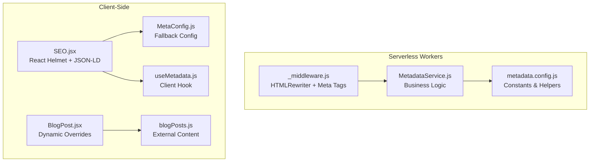
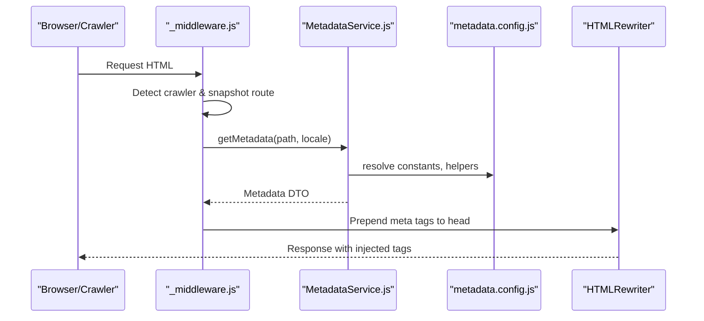
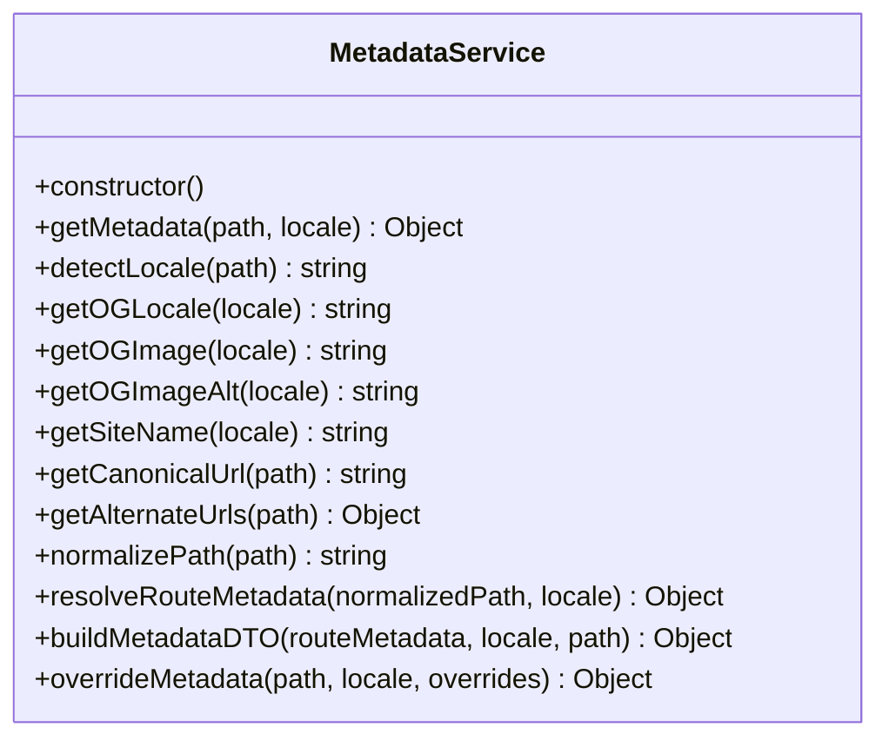
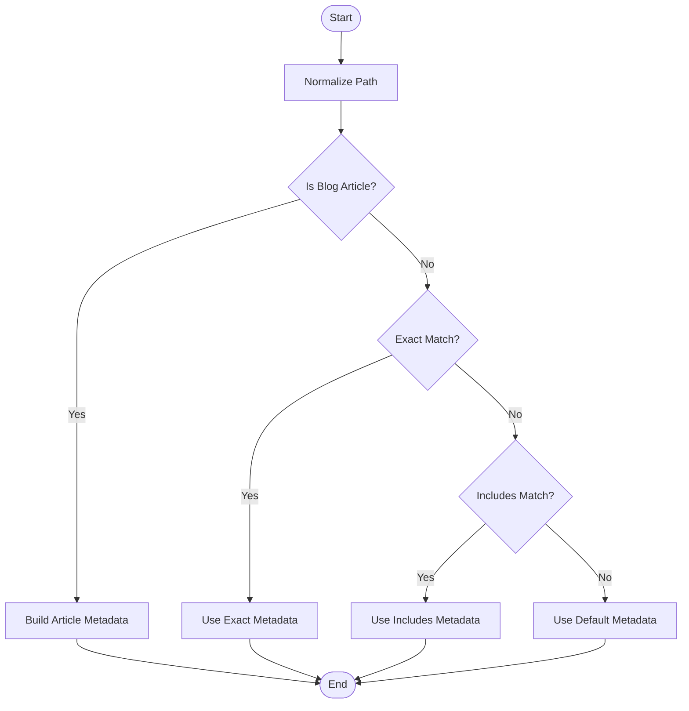
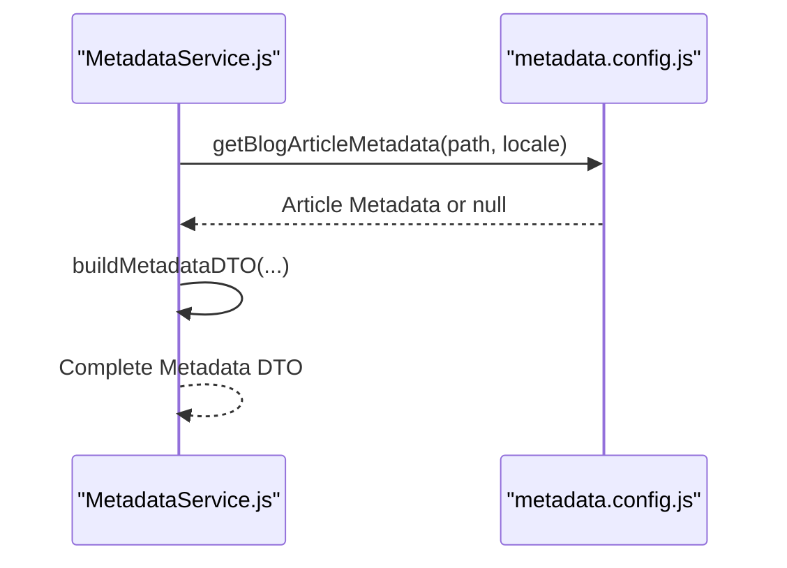
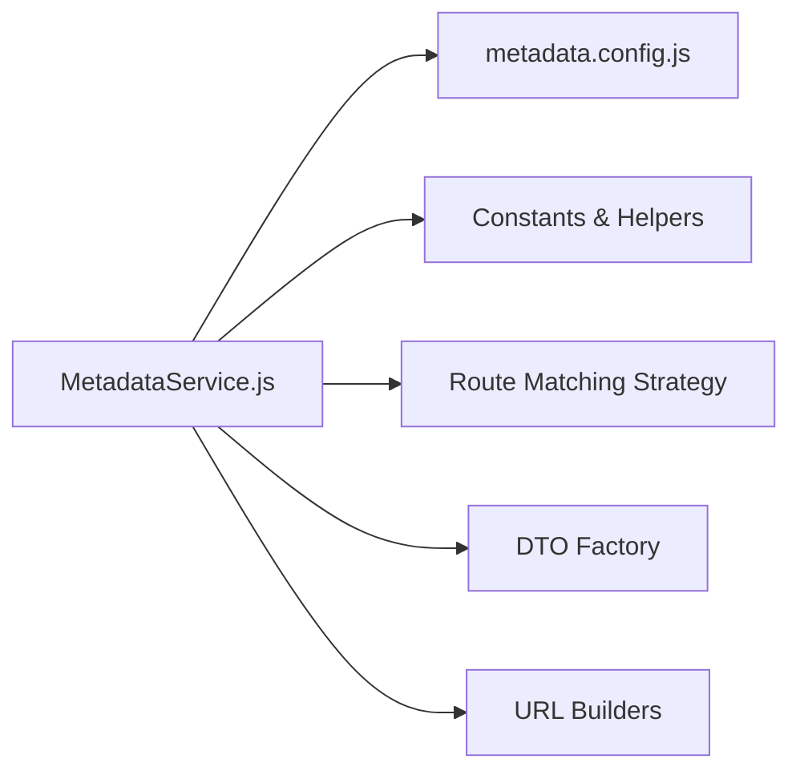

# Metadata Service

<cite>
**Referenced Files in This Document**
- [MetadataService.js](file://functions/services/MetadataService.js)
- [metadata.config.js](file://functions/config/metadata.config.js)
- [_middleware.js](file://functions/_middleware.js)
- [MetaConfig.js](file://src/utils/MetaConfig.js)
- [useMetadata.js](file://src/hooks/useMetadata.js)
- [SEO.jsx](file://src/components/SEO.jsx)
- [BlogPost.jsx](file://src/pages/BlogPost.jsx)
- [blogPosts.js](file://src/data/blogPosts.js)
- [MetadataService.test.js](file://functions/services/MetadataService.test.js)
</cite>

## Table of Contents
1. [Introduction](#introduction)
2. [Project Structure](#project-structure)
3. [Core Components](#core-components)
4. [Architecture Overview](#architecture-overview)
5. [Detailed Component Analysis](#detailed-component-analysis)
6. [Dependency Analysis](#dependency-analysis)
7. [Performance Considerations](#performance-considerations)
8. [Troubleshooting Guide](#troubleshooting-guide)
9. [Conclusion](#conclusion)
10. [Appendices](#appendices)

## Introduction
This document explains the MetadataService class that powers dynamic metadata resolution for the landing page. It covers the service architecture, including locale detection, route metadata resolution, and metadata DTO building. It documents SOLID principles implementation, the strategy pattern for route matching, and the factory pattern for metadata creation. It also details the complete metadata object structure, including title, description, images, Open Graph properties, and URL generation. Practical examples demonstrate metadata configuration, blog article metadata handling, and localization support. Finally, it addresses performance optimization techniques, caching strategies, error handling patterns, and guidance for extending the service with new routes, custom metadata fields, and integration with external content sources.

## Project Structure
The metadata system spans both serverless middleware and client-side components:
- Serverless workers middleware injects metadata into HTML responses for crawlers and users.
- The MetadataService encapsulates business logic for locale detection, route matching, and DTO construction.
- Configuration files centralize metadata definitions and helpers.
- Client-side SEO component and hooks manage runtime metadata for SPAs.

**Diagram sources**
- [_middleware.js](file://functions/_middleware.js#L1-L383)
- [MetadataService.js](file://functions/services/MetadataService.js#L1-L380)
- [metadata.config.js](file://functions/config/metadata.config.js#L1-L369)
- [SEO.jsx](file://src/components/SEO.jsx#L1-L278)
- [useMetadata.js](file://src/hooks/useMetadata.js#L1-L117)
- [MetaConfig.js](file://src/utils/MetaConfig.js#L1-L530)
- [BlogPost.jsx](file://src/pages/BlogPost.jsx#L1-L132)
- [blogPosts.js](file://src/data/blogPosts.js#L1-L189)

**Section sources**
- [_middleware.js](file://functions/_middleware.js#L1-L383)
- [MetadataService.js](file://functions/services/MetadataService.js#L1-L380)
- [metadata.config.js](file://functions/config/metadata.config.js#L1-L369)
- [SEO.jsx](file://src/components/SEO.jsx#L1-L278)
- [MetaConfig.js](file://src/utils/MetaConfig.js#L1-L530)
- [BlogPost.jsx](file://src/pages/BlogPost.jsx#L1-L132)
- [blogPosts.js](file://src/data/blogPosts.js#L1-L189)

## Core Components
- MetadataService: Core class that resolves metadata for routes, detects locales, builds DTOs, and generates canonical and alternate URLs.
- metadata.config.js: Centralized configuration for constants, default metadata, route-specific metadata, blog article metadata, locale mapping, and helpers.
- _middleware.js: Cloudflare Workers middleware that injects metadata into HTML responses for crawlers and users, ensuring proper status codes and tag placement.
- MetaConfig.js: Client-side fallback configuration and helpers for metadata generation and structured data.
- useMetadata.js: Client-side React hook for dynamic metadata management and image URL normalization.
- SEO.jsx: Client-side component that renders meta tags and JSON-LD schemas using configuration and validation.
- BlogPost.jsx: Example of dynamic metadata overrides for blog articles.
- blogPosts.js: External content source for blog posts used in dynamic metadata.

**Section sources**
- [MetadataService.js](file://functions/services/MetadataService.js#L44-L380)
- [metadata.config.js](file://functions/config/metadata.config.js#L1-L369)
- [_middleware.js](file://functions/_middleware.js#L1-L383)
- [MetaConfig.js](file://src/utils/MetaConfig.js#L1-L530)
- [useMetadata.js](file://src/hooks/useMetadata.js#L1-L117)
- [SEO.jsx](file://src/components/SEO.jsx#L1-L278)
- [BlogPost.jsx](file://src/pages/BlogPost.jsx#L1-L132)
- [blogPosts.js](file://src/data/blogPosts.js#L1-L189)

## Architecture Overview
The metadata pipeline integrates serverless workers and client-side rendering:
- Serverless workers detect crawlers, fetch snapshots when available, and inject meta tags using MetadataService.
- MetadataService applies locale detection, route matching, and DTO construction, then injects tags via HTMLRewriter.
- Client-side SEO component manages runtime metadata for SPA navigation and validates metadata in development.

**Diagram sources**
- [_middleware.js](file://functions/_middleware.js#L76-L264)
- [MetadataService.js](file://functions/services/MetadataService.js#L70-L88)
- [metadata.config.js](file://functions/config/metadata.config.js#L39-L369)

## Detailed Component Analysis

### MetadataService Class
The MetadataService class encapsulates all metadata resolution logic:
- Public API: getMetadata(path, locale?) resolves locale, checks for blog article metadata, normalizes path, resolves route metadata, and builds a complete DTO.
- Locale Detection: detectLocale(path) determines 'en' or 'ar' based on path prefix.
- URL Generation: getCanonicalUrl(path) and getAlternateUrls(path) produce absolute URLs and hreflang alternatives.
- Strategy Pattern: resolveRouteMetadata(normalizedPath, locale) uses exact match and includes match strategies.
- Factory Pattern: buildMetadataDTO(routeMetadata, locale, path) constructs a standardized DTO with sanitized strings and defaults.
- Utility Methods: getOGLocale, getOGImage, getOGImageAlt, getSiteName, normalizePath, overrideMetadata.

**Diagram sources**
- [MetadataService.js](file://functions/services/MetadataService.js#L44-L347)

**Section sources**
- [MetadataService.js](file://functions/services/MetadataService.js#L44-L347)

### Route Metadata Resolution Strategy
The service uses a dual-strategy approach:
- Exact Match: Matches normalized paths like '/services'.
- Includes Match: Matches dynamic routes like '/blog/:slug' by checking if the normalized path includes a key.
- Fallback: Uses DEFAULT_METADATA when no route-specific metadata is found.

**Diagram sources**
- [MetadataService.js](file://functions/services/MetadataService.js#L247-L262)
- [metadata.config.js](file://functions/config/metadata.config.js#L119-L209)

**Section sources**
- [MetadataService.js](file://functions/services/MetadataService.js#L247-L262)
- [metadata.config.js](file://functions/config/metadata.config.js#L119-L209)

### Metadata DTO Building and Validation
The factory method buildMetadataDTO constructs a complete metadata object:
- Core Fields: title, description, sanitized via sanitizeMetaString.
- Image Fields: image, imageAlt, imageWidth, imageHeight, imageType.
- Open Graph Fields: type, locale, siteName.
- URL Fields: url, alternateUrls.
- Additional Fields: direction, lang, and optional article fields (author, publishedTime, modifiedTime, section, tags).

Validation occurs via isValidMetadata to ensure required fields exist and are non-empty.

**Section sources**
- [MetadataService.js](file://functions/services/MetadataService.js#L275-L319)
- [metadata.config.js](file://functions/config/metadata.config.js#L347-L368)

### Blog Article Metadata Handling
Blog article metadata is resolved using getBlogArticleMetadata(path, locale):
- Supports paths like '/blog/:slug' and '/ar/blog/:slug'.
- Merges shared metadata (author, dates, section, tags, image) with locale-specific title/description/type.
- Returns null if the slug is not found or locale-specific metadata is missing.

**Diagram sources**
- [MetadataService.js](file://functions/services/MetadataService.js#L75-L78)
- [metadata.config.js](file://functions/config/metadata.config.js#L317-L336)

**Section sources**
- [metadata.config.js](file://functions/config/metadata.config.js#L217-L284)
- [MetadataService.js](file://functions/services/MetadataService.js#L75-L78)

### Localization Support
Localization is handled across:
- Locale Detection: detectLocale(path) determines 'en' or 'ar'.
- OG Locale Mapping: getOGLocale(locale) maps to 'en_US'/'ar_AR'.
- Site Name: getSiteName(locale) returns localized brand names.
- Direction and Lang: direction and lang fields reflect RTL/LTR and language.
- Alternate URLs: getAlternateUrls(path) generates hreflang alternatives.

**Section sources**
- [MetadataService.js](file://functions/services/MetadataService.js#L100-L155)
- [metadata.config.js](file://functions/config/metadata.config.js#L294-L303)

### Client-Side Metadata Management
Client-side components complement server-side metadata:
- SEO.jsx: Renders meta tags and JSON-LD schemas, validates metadata in development, and injects fallbacks.
- useMetadata.js: Provides utilities for dynamic metadata overrides and image URL normalization.
- MetaConfig.js: Offers fallback metadata configuration and structured data generation for client-side use.

**Section sources**
- [SEO.jsx](file://src/components/SEO.jsx#L1-L278)
- [useMetadata.js](file://src/hooks/useMetadata.js#L1-L117)
- [MetaConfig.js](file://src/utils/MetaConfig.js#L1-L530)

### Example: Blog Article Metadata Integration
BlogPost.jsx demonstrates dynamic metadata overrides:
- Uses SEO component with path and overrideMeta to set title, description, image, type, author, and publishedTime.
- Pulls content from blogPosts.js for localized titles, excerpts, and images.

**Section sources**
- [BlogPost.jsx](file://src/pages/BlogPost.jsx#L31-L41)
- [blogPosts.js](file://src/data/blogPosts.js#L1-L189)

## Dependency Analysis
The service depends on centralized configuration and helpers:
- Constants: BASE_URL, SITE_NAME, SITE_NAME_AR, OG_IMAGES, OG_IMAGE_ALT, OG_LOCALE_MAP, SUPPORTED_LOCALES.
- Route Metadata: ROUTE_METADATA for static routes and DEFAULT_METADATA for fallbacks.
- Helpers: getBlogArticleMetadata, sanitizeMetaString, isValidMetadata.

**Diagram sources**
- [MetadataService.js](file://functions/services/MetadataService.js#L16-L29)
- [metadata.config.js](file://functions/config/metadata.config.js#L39-L369)

**Section sources**
- [MetadataService.js](file://functions/services/MetadataService.js#L16-L29)
- [metadata.config.js](file://functions/config/metadata.config.js#L39-L369)

## Performance Considerations
- Caching Strategies:
  - OG Image Versioning: OG_IMAGE_VERSION forces crawlers to re-fetch updated images.
  - Snapshot Serving: _middleware.js attempts to serve pre-rendered snapshots for crawler-friendly responses.
- Response Optimization:
  - Prepend Meta Tags: HTMLRewriter prepends tags to ensure they appear in the first 1KB for crawler parsing.
  - Status Code Normalization: Forces 200 OK for crawler responses to avoid 206 Partial Content errors.
- Path Normalization: normalizePath removes locale prefixes and trailing slashes to reduce ambiguity and improve matching.
- Validation: isValidMetadata and sanitizeMetaString prevent invalid or unsafe metadata from propagating.

**Section sources**
- [metadata.config.js](file://functions/config/metadata.config.js#L56-L56)
- [_middleware.js](file://functions/_middleware.js#L177-L187)
- [_middleware.js](file://functions/_middleware.js#L228-L263)
- [MetadataService.js](file://functions/services/MetadataService.js#L213-L232)
- [MetadataService.js](file://functions/services/MetadataService.js#L347-L368)

## Troubleshooting Guide
- Common Issues:
  - 206 Partial Content Errors: Fixed by forcing 200 OK for crawler responses.
  - Missing OG Tags: Ensure meta tags are prepended to head and absolute URLs are used.
  - Incorrect Locale Detection: Verify detectLocale logic and path normalization.
  - Invalid Metadata: Use isValidMetadata and sanitizeMetaString to validate and sanitize inputs.
- Testing:
  - Unit tests cover locale detection, URL generation, route resolution, DTO structure, and overrides.
  - Edge cases include empty paths, query parameters, hashes, and deeply nested paths.

**Section sources**
- [_middleware.js](file://functions/_middleware.js#L177-L187)
- [_middleware.js](file://functions/_middleware.js#L228-L263)
- [MetadataService.test.js](file://functions/services/MetadataService.test.js#L1-L370)

## Conclusion
The MetadataService provides a robust, SOLID-compliant foundation for dynamic metadata resolution across locales and routes. It leverages the strategy pattern for route matching and the factory pattern for DTO construction, ensuring consistent, validated metadata across serverless workers and client-side rendering. With built-in localization, URL generation, and crawler-friendly optimizations, it supports scalable, SEO-friendly experiences for both static and dynamic content.

## Appendices

### Metadata Object Structure
The complete metadata DTO includes:
- Core: title, description
- Image: image, imageAlt, imageWidth, imageHeight, imageType
- Open Graph: type, locale, siteName
- URL: url, alternateUrls
- Additional: direction, lang
- Article (optional): author, publishedTime, modifiedTime, section, tags

**Section sources**
- [MetadataService.js](file://functions/services/MetadataService.js#L283-L316)
- [metadata.config.js](file://functions/config/metadata.config.js#L15-L33)

### Extending the Service
- New Routes:
  - Add entries to ROUTE_METADATA with localized keys.
  - Ensure DEFAULT_METADATA covers fallback scenarios.
- Custom Metadata Fields:
  - Extend buildMetadataDTO to include new fields and apply sanitization/validation.
- External Content Sources:
  - Integrate with external APIs or CMS to populate metadata dynamically.
  - Use overrideMetadata to merge external data with configuration.
- Blog Articles:
  - Add slugs to BLOG_ARTICLE_METADATA with shared and locale-specific fields.
  - Ensure getBlogArticleMetadata supports new patterns.

**Section sources**
- [metadata.config.js](file://functions/config/metadata.config.js#L119-L284)
- [MetadataService.js](file://functions/services/MetadataService.js#L336-L346)