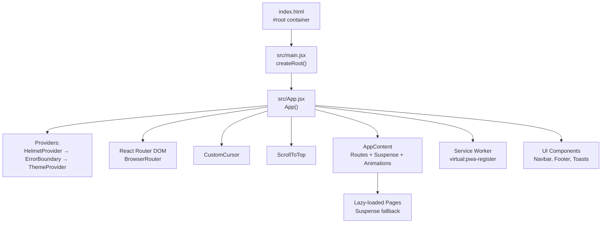
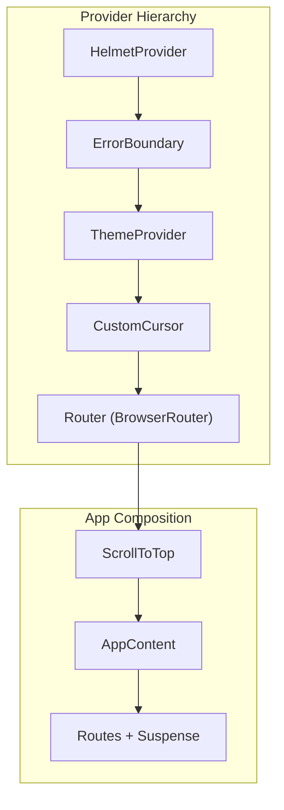
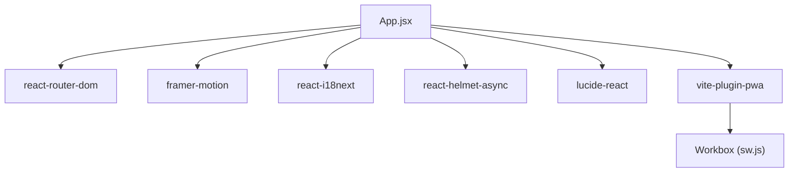

# Application Entry Point

<cite>
**Referenced Files in This Document**
- [main.jsx](file://src/main.jsx)
- [App.jsx](file://src/App.jsx)
- [ThemeContext.jsx](file://src/context/ThemeContext.jsx)
- [ErrorBoundary.jsx](file://src/components/ErrorBoundary.jsx)
- [CustomCursor.jsx](file://src/components/CustomCursor.jsx)
- [LoadingSpinner.jsx](file://src/components/LoadingSpinner.jsx)
- [UpdateToast.jsx](file://src/components/UpdateToast.jsx)
- [InstallPrompt.jsx](file://src/components/InstallPrompt.jsx)
- [sw.js](file://src/sw.js)
- [index.html](file://index.html)
- [vite.config.js](file://vite.config.js)
- [package.json](file://package.json)
</cite>

## Table of Contents
1. [Introduction](#introduction)
2. [Project Structure](#project-structure)
3. [Core Components](#core-components)
4. [Architecture Overview](#architecture-overview)
5. [Detailed Component Analysis](#detailed-component-analysis)
6. [Dependency Analysis](#dependency-analysis)
7. [Performance Considerations](#performance-considerations)
8. [Troubleshooting Guide](#troubleshooting-guide)
9. [Conclusion](#conclusion)

## Introduction
This document explains the React application entry point and main application structure for the landing page. It covers the App component architecture, provider setup (ThemeProvider, ErrorBoundary, HelmetProvider), routing configuration with React Router DOM, lazy loading with Suspense, animation integration with Framer Motion, global state management, performance optimizations, ScrollToTop behavior, custom cursor implementation, and service worker integration. It also clarifies the relationship between main.jsx and App.jsx, provider hierarchies, and component initialization order.

## Project Structure
The application bootstraps from a minimal entry point that renders the root App component inside a strict mode wrapper. The App component composes providers, routing, animations, and platform integrations.

**Diagram sources**
- [index.html](file://index.html#L65-L70)
- [main.jsx](file://src/main.jsx#L1-L12)
- [App.jsx](file://src/App.jsx#L311-L345)

**Section sources**
- [main.jsx](file://src/main.jsx#L1-L12)
- [index.html](file://index.html#L1-L87)

## Core Components
- Entry point: main.jsx creates the root and renders the App component inside StrictMode.
- App.jsx: The main application component that sets up providers, routing, animations, PWA integration, and global UI elements.
- Providers: ThemeProvider manages theme state and persistence; ErrorBoundary provides graceful error handling; HelmetProvider manages SEO metadata.
- Routing: React Router DOM with lazy-loaded routes and Suspense fallbacks.
- Animations: Framer Motion integrates scroll progress, route transitions, and UI micro-interactions.
- PWA: Service worker via Workbox, virtual:pwa-register for updates, and install prompt flow.
- Global UI: CustomCursor, ScrollToTop, LoadingSpinner, UpdateToast, InstallPrompt, Offline indicators.

**Section sources**
- [main.jsx](file://src/main.jsx#L1-L12)
- [App.jsx](file://src/App.jsx#L1-L348)
- [ThemeContext.jsx](file://src/context/ThemeContext.jsx#L1-L46)
- [ErrorBoundary.jsx](file://src/components/ErrorBoundary.jsx#L1-L57)
- [CustomCursor.jsx](file://src/components/CustomCursor.jsx#L1-L91)
- [LoadingSpinner.jsx](file://src/components/LoadingSpinner.jsx#L1-L94)
- [UpdateToast.jsx](file://src/components/UpdateToast.jsx#L1-L47)
- [InstallPrompt.jsx](file://src/components/InstallPrompt.jsx#L1-L104)

## Architecture Overview
The provider hierarchy and initialization order are central to the app’s behavior. The App component wraps the entire application with providers and router, ensuring proper context propagation and lifecycle management.

**Diagram sources**
- [App.jsx](file://src/App.jsx#L321-L344)
- [App.jsx](file://src/App.jsx#L51-L72)
- [App.jsx](file://src/App.jsx#L74-L309)

**Section sources**
- [App.jsx](file://src/App.jsx#L311-L345)

## Detailed Component Analysis

### Entry Point: main.jsx and index.html
- main.jsx imports the CSS, internationalization setup, and the App component, then mounts the App into the DOM root.
- index.html defines the #root container, PWA metadata, preloads, and explicit service worker registration script.

Key behaviors:
- StrictMode enabled at the root.
- Service worker registration included in HTML for deterministic PWA behavior.
- Preloads and CSP configured for performance and security.

**Section sources**
- [main.jsx](file://src/main.jsx#L1-L12)
- [index.html](file://index.html#L1-L87)

### App.jsx: Provider Setup, Routing, and Animations
Provider hierarchy and composition:
- HelmetProvider wraps the entire app to manage SEO metadata.
- ErrorBoundary wraps providers and routing to catch unhandled errors.
- ThemeProvider manages theme state and persists preferences.
- Router provides routing context.
- CustomCursor and ScrollToTop are positioned at the top level for global behavior.
- AppContent encapsulates routing, lazy loading, Suspense fallbacks, and animations.

Routing and lazy loading:
- Routes are defined with lazy-loaded components using React.lazy and Suspense.
- AnimatePresence with mode="wait" coordinates route transitions.
- Skeleton loaders provide perceived performance during lazy loads.

Animations:
- useScroll and useSpring power a progress indicator.
- Framer Motion is used for route transitions, toasts, and UI micro-interactions.

PWA integration:
- virtual:pwa-register/react hook manages service worker updates and offline readiness.
- UpdateToast displays update prompts.
- InstallPrompt handles the beforeinstallprompt flow and user choice.

Global state and effects:
- Theme synchronization with localStorage and system preference.
- Language synchronization with URL path (/ar vs /).
- Offline detection and periodic background sync registration.

**Section sources**
- [App.jsx](file://src/App.jsx#L1-L348)

### ThemeProvider: ThemeContext.jsx
Responsibilities:
- Initializes theme from localStorage or system preference.
- Applies 'dark' class to documentElement and persists user choice.
- Exposes toggleTheme for consumers.

Integration:
- Consumed by components via useTheme hook.
- Used by the app’s layout and UI elements.

**Section sources**
- [ThemeContext.jsx](file://src/context/ThemeContext.jsx#L1-L46)

### ErrorBoundary: ErrorBoundary.jsx
Responsibilities:
- Catches errors in the component tree below.
- Renders a friendly error UI with a reload option.
- Logs error and errorInfo for debugging.

Integration:
- Wrapped around providers and routing to protect the app from runtime errors.

**Section sources**
- [ErrorBoundary.jsx](file://src/components/ErrorBoundary.jsx#L1-L57)

### CustomCursor: CustomCursor.jsx
Responsibilities:
- Provides a custom animated cursor with spring physics.
- Detects interactive elements to adjust cursor appearance.
- Activates only on devices with fine pointers (desktop mouse).

Integration:
- Rendered at the top level to overlay the entire viewport.

**Section sources**
- [CustomCursor.jsx](file://src/components/CustomCursor.jsx#L1-L91)

### ScrollToTop: App.jsx (inline component)
Responsibilities:
- Scrolls to top on navigation without hash.
- On hash navigation, waits briefly for lazy-loaded content to mount, then scrolls to the element by ID.

Integration:
- Rendered at the top level to ensure consistent scrolling behavior across route changes.

**Section sources**
- [App.jsx](file://src/App.jsx#L51-L72)

### LoadingSpinner: LoadingSpinner.jsx
Responsibilities:
- Provides a branded loading experience during initial app load.
- Uses Framer Motion for animations and cycling messages.

Integration:
- Used within App.jsx to display during initial loading phase.

**Section sources**
- [LoadingSpinner.jsx](file://src/components/LoadingSpinner.jsx#L1-L94)

### UpdateToast: UpdateToast.jsx
Responsibilities:
- Displays a persistent toast prompting users to refresh for updates.
- Integrates with virtual:pwa-register/react to trigger updates.

Integration:
- Controlled by state from App.jsx.

**Section sources**
- [UpdateToast.jsx](file://src/components/UpdateToast.jsx#L1-L47)

### InstallPrompt: InstallPrompt.jsx
Responsibilities:
- Listens to beforeinstallprompt, defers the native prompt, and shows a custom install card after engagement.
- Handles user choice and cleans up the deferred prompt.

Integration:
- Conditionally rendered based on offline state and installation status.

**Section sources**
- [InstallPrompt.jsx](file://src/components/InstallPrompt.jsx#L1-L104)

### Service Worker: sw.js and Vite PWA
Service worker features:
- Precaching of critical assets.
- Runtime caching strategies: StaleWhileRevalidate for scripts/styles, CacheFirst for images/fonts, NetworkFirst for API.
- Navigation fallback to SPA shell.
- Background sync for contact form submissions.
- Comprehensive offline fallback.
- Periodic background sync for labs data.
- Push notifications support.

Vite PWA configuration:
- Inject manifest strategy with custom srcDir and filename.
- Auto-update registration.
- Pre-caching of icons, offline.html, and fonts.
- Workbox tuning for file size limits and offline.html inclusion.
- Chunk splitting for performance (react-core, react-router, framer, i18n, icons).

**Section sources**
- [sw.js](file://src/sw.js#L1-L227)
- [vite.config.js](file://vite.config.js#L1-L262)

## Dependency Analysis
External libraries and their roles:
- React and ReactDOM: Core rendering.
- react-router-dom: Client-side routing.
- react-helmet-async: SEO metadata management.
- framer-motion: Animations and gestures.
- react-i18next: Internationalization.
- lucide-react: Icons.
- vite-plugin-pwa: PWA generation and service worker injection.

Build-time dependencies:
- Vite with plugins for React, compression, and PWA.
- Tailwind CSS for styling.

**Diagram sources**
- [App.jsx](file://src/App.jsx#L1-L348)
- [package.json](file://package.json#L16-L30)
- [vite.config.js](file://vite.config.js#L1-L262)
- [sw.js](file://src/sw.js#L1-L227)

**Section sources**
- [package.json](file://package.json#L1-L49)
- [vite.config.js](file://vite.config.js#L1-L262)

## Performance Considerations
- Code splitting: Manual chunks separate heavy libraries (framer-motion) and frequently used modules (react, router, i18n).
- Asset optimization: Compression plugins (gzip/brotli), inlining small assets, and limiting precache file sizes.
- Lazy loading: Routes are lazy-loaded with Suspense fallbacks to reduce initial bundle size.
- Animation optimization: Framer Motion leverages hardware acceleration; spring configurations tuned for responsiveness.
- CSS strategy: Single CSS bundle inlining for critical path optimization.
- PWA caching: Strategic caching tiers to balance freshness and performance.

Recommendations:
- Monitor chunk sizes and adjust manualChunks as new features are added.
- Keep Suspense fallbacks minimal and focused on perceived performance.
- Audit long tasks during route transitions and optimize heavy components.

**Section sources**
- [vite.config.js](file://vite.config.js#L204-L248)

## Troubleshooting Guide
Common issues and resolutions:
- Provider not found errors: Ensure ThemeProvider wraps components using useTheme.
- Routing issues: Verify lazy imports resolve correctly and Suspense fallbacks are appropriate.
- PWA update prompts not appearing: Confirm virtual:pwa-register is initialized and service worker is registered.
- Custom cursor not visible: Check pointer device detection and ensure the component renders only on fine-pointer devices.
- Offline fallback not working: Verify sw.js navigation fallback and offline.html are precached.

Debugging tips:
- Use browser DevTools to inspect provider contexts and routing state.
- Check the service worker panel for registration and caching behavior.
- Review console logs for PWA and error boundary outputs.

**Section sources**
- [ThemeContext.jsx](file://src/context/ThemeContext.jsx#L39-L45)
- [App.jsx](file://src/App.jsx#L311-L345)
- [CustomCursor.jsx](file://src/components/CustomCursor.jsx#L52-L54)
- [sw.js](file://src/sw.js#L34-L45)

## Conclusion
The application’s entry point and main structure combine a clean provider hierarchy, robust routing with lazy loading, and a polished animation system powered by Framer Motion. The PWA setup, service worker strategies, and performance optimizations deliver a modern, responsive, and resilient user experience. The ScrollToTop and custom cursor components enhance usability, while the ThemeProvider and ErrorBoundary contribute to maintainability and reliability.