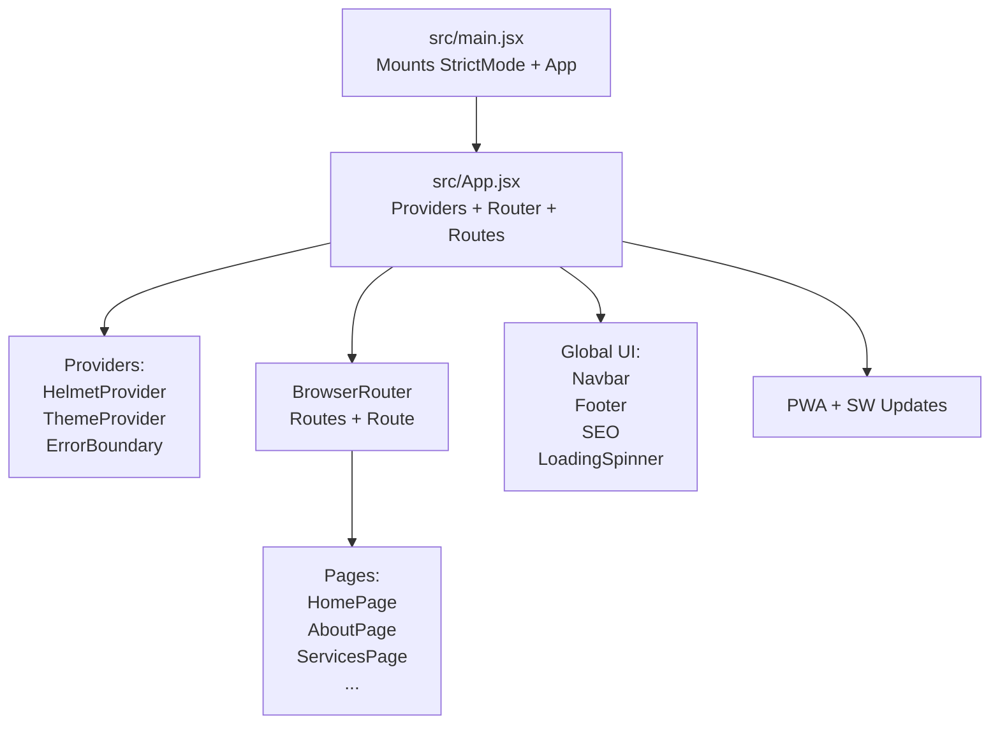
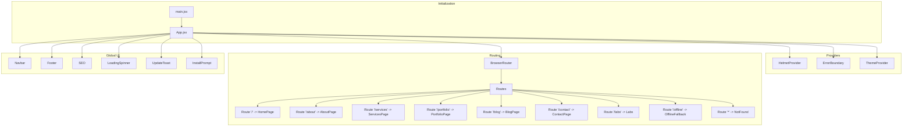
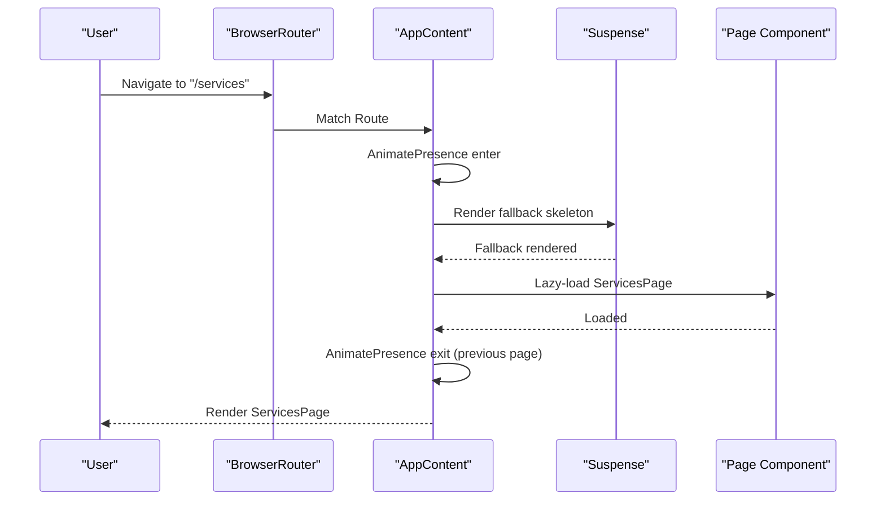
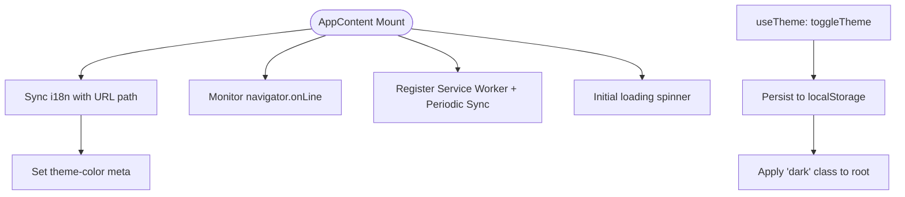
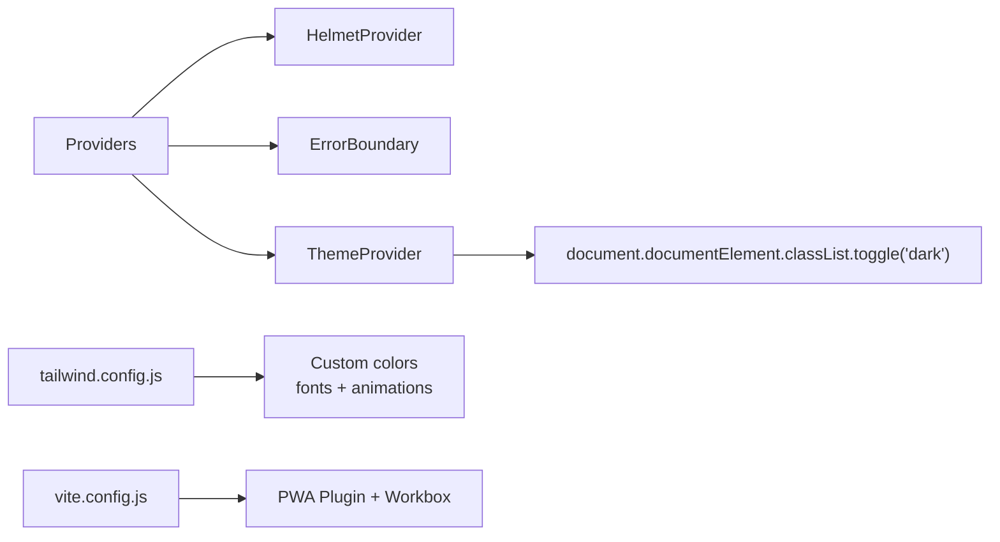
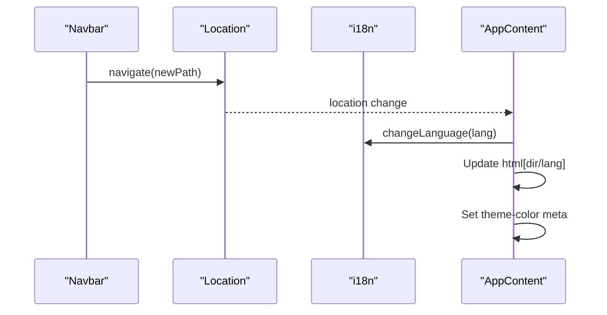
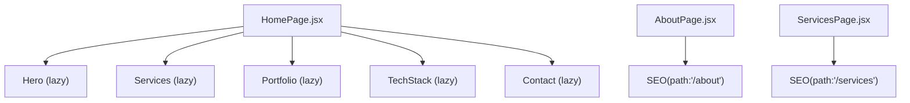
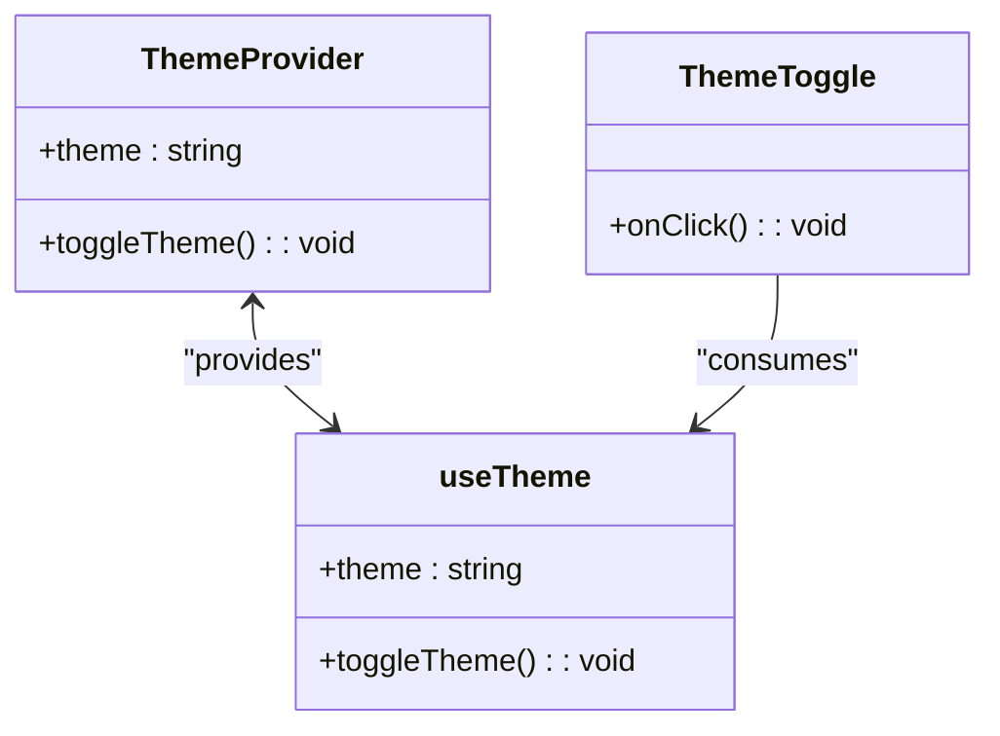
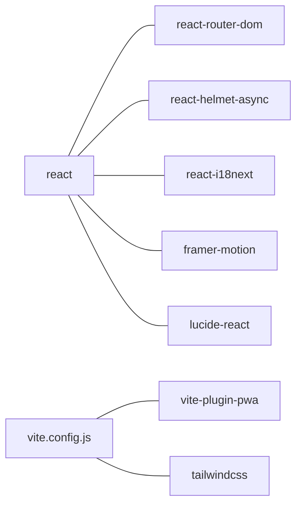

# Core Application

<cite>
**Referenced Files in This Document**
- [src/main.jsx](file://src/main.jsx)
- [src/App.jsx](file://src/App.jsx)
- [package.json](file://package.json)
- [vite.config.js](file://vite.config.js)
- [tailwind.config.js](file://tailwind.config.js)
- [src/context/ThemeContext.jsx](file://src/context/ThemeContext.jsx)
- [src/components/Navbar.jsx](file://src/components/Navbar.jsx)
- [src/components/Footer.jsx](file://src/components/Footer.jsx)
- [src/components/SEO.jsx](file://src/components/SEO.jsx)
- [src/hooks/useMetadata.js](file://src/hooks/useMetadata.js)
- [src/components/Hero.jsx](file://src/components/Hero.jsx)
- [src/pages/HomePage.jsx](file://src/pages/HomePage.jsx)
- [src/pages/AboutPage.jsx](file://src/pages/AboutPage.jsx)
- [src/pages/ServicesPage.jsx](file://src/pages/ServicesPage.jsx)
</cite>

## Table of Contents
1. [Introduction](#introduction)
2. [Project Structure](#project-structure)
3. [Core Components](#core-components)
4. [Architecture Overview](#architecture-overview)
5. [Detailed Component Analysis](#detailed-component-analysis)
6. [Dependency Analysis](#dependency-analysis)
7. [Performance Considerations](#performance-considerations)
8. [Troubleshooting Guide](#troubleshooting-guide)
9. [Conclusion](#conclusion)

## Introduction
This document explains the React application’s structure, routing, state management, providers, styling, and reusable components. It focuses on how the app composes pages (Home, About, Services, Portfolio, Blog, Contact), how shared components coordinate internationalization and theming, and how performance and UX are optimized through lazy loading, animations, and PWA features.

## Project Structure
The application is a Vite-built React 19 SPA with:
- A strict render root in main.jsx
- A top-level App wrapper that sets up providers, router, animations, and global UI
- Pages organized per route under src/pages
- Reusable components under src/components
- Theming via a React Context provider
- Internationalization with react-i18next and path-based language switching
- SEO via react-helmet-async and centralized metadata configuration
- Tailwind CSS for styling and dark mode support

**Diagram sources**
- [src/main.jsx](file://src/main.jsx#L1-L12)
- [src/App.jsx](file://src/App.jsx#L311-L348)

**Section sources**
- [src/main.jsx](file://src/main.jsx#L1-L12)
- [src/App.jsx](file://src/App.jsx#L1-L348)
- [package.json](file://package.json#L1-L49)
- [vite.config.js](file://vite.config.js#L1-L262)
- [tailwind.config.js](file://tailwind.config.js#L1-L47)

## Core Components
- ThemeProvider and useTheme: Manage light/dark mode with persistence and system preference fallback.
- Navbar: Desktop and mobile navigation with language switching, active link highlighting, and animated overlays.
- Footer: Multi-column footer with localized links and social media.
- SEO: Centralized metadata injection with schema.org JSON-LD generation and multilingual hreflang.
- useMetadata: Client-side metadata helper for dynamic overrides and utilities.
- Hero: Animated hero section with code visualization and magnetic button.
- HomePage: Aggregates Hero, Services, Portfolio, TechStack, and Contact via lazy loading.

**Section sources**
- [src/context/ThemeContext.jsx](file://src/context/ThemeContext.jsx#L1-L46)
- [src/components/Navbar.jsx](file://src/components/Navbar.jsx#L1-L337)
- [src/components/Footer.jsx](file://src/components/Footer.jsx#L1-L80)
- [src/components/SEO.jsx](file://src/components/SEO.jsx#L1-L278)
- [src/hooks/useMetadata.js](file://src/hooks/useMetadata.js#L1-L117)
- [src/components/Hero.jsx](file://src/components/Hero.jsx#L1-L165)
- [src/pages/HomePage.jsx](file://src/pages/HomePage.jsx#L1-L43)

## Architecture Overview
The app initializes with a strict root, then renders App. App composes:
- Providers: HelmetProvider, ErrorBoundary, ThemeProvider
- Router: BrowserRouter with routes for all pages
- Global UI: Navbar, Footer, SEO, LoadingSpinner, UpdateToast, InstallPrompt
- PWA: Service worker registration, periodic sync, offline handling, and update prompts

**Diagram sources**
- [src/main.jsx](file://src/main.jsx#L1-L12)
- [src/App.jsx](file://src/App.jsx#L311-L348)
- [src/components/Navbar.jsx](file://src/components/Navbar.jsx#L1-L337)
- [src/components/Footer.jsx](file://src/components/Footer.jsx#L1-L80)
- [src/components/SEO.jsx](file://src/components/SEO.jsx#L1-L278)

## Detailed Component Analysis

### Routing Configuration and Page Composition
- Routes are defined centrally in AppContent with lazy-loaded page components and Suspense skeletons for perceived performance.
- Home routes support both English and Arabic paths (/ and /ar).
- Each page route wraps content in AnimatePresence and motion transitions for smooth navigation.
- ScrollToTop resets scroll position on navigation; hash-aware scrolling is supported for anchor links.

**Diagram sources**
- [src/App.jsx](file://src/App.jsx#L180-L291)

**Section sources**
- [src/App.jsx](file://src/App.jsx#L51-L72)
- [src/App.jsx](file://src/App.jsx#L180-L291)

### State Management Patterns
- Theme state: Managed via ThemeProvider and useTheme hook with localStorage persistence and system preference fallback.
- App-level state: Language synchronization between URL path and i18n instance, offline status, and PWA update availability are handled in AppContent.
- No external state libraries are used; React hooks and context provide sufficient scope for current needs.

**Diagram sources**
- [src/App.jsx](file://src/App.jsx#L117-L167)
- [src/context/ThemeContext.jsx](file://src/context/ThemeContext.jsx#L18-L26)

**Section sources**
- [src/context/ThemeContext.jsx](file://src/context/ThemeContext.jsx#L1-L46)
- [src/App.jsx](file://src/App.jsx#L117-L167)

### Provider Setup and Global Styling
- Providers wrap the entire app: HelmetProvider for SEO, ErrorBoundary for resilience, ThemeProvider for theming.
- Tailwind is configured with dark mode via selector and custom color tokens, fonts, animations, and keyframes.
- Global CSS is imported in main.jsx and index.css; PWA-related assets and manifests are generated via Vite PWA plugin.

**Diagram sources**
- [src/App.jsx](file://src/App.jsx#L321-L344)
- [src/context/ThemeContext.jsx](file://src/context/ThemeContext.jsx#L18-L26)
- [tailwind.config.js](file://tailwind.config.js#L1-L47)
- [vite.config.js](file://vite.config.js#L19-L202)

**Section sources**
- [src/App.jsx](file://src/App.jsx#L321-L344)
- [tailwind.config.js](file://tailwind.config.js#L1-L47)
- [vite.config.js](file://vite.config.js#L19-L202)

### Shared Component Patterns
- Navbar: Language switching updates URL and relies on AppContent to synchronize i18n; desktop and mobile overlays with animated entries; active link detection.
- Footer: Uses translation keys and path prefixing for localized links.
- SEO: Centralized metadata configuration with validation and JSON-LD schema generation; supports multilingual hreflang and canonical URLs.
- useMetadata: Provides helpers for absolute image URLs, default OG images, and current metadata inspection.

**Diagram sources**
- [src/components/Navbar.jsx](file://src/components/Navbar.jsx#L39-L57)
- [src/App.jsx](file://src/App.jsx#L117-L143)

**Section sources**
- [src/components/Navbar.jsx](file://src/components/Navbar.jsx#L1-L337)
- [src/components/Footer.jsx](file://src/components/Footer.jsx#L1-L80)
- [src/components/SEO.jsx](file://src/components/SEO.jsx#L1-L278)
- [src/hooks/useMetadata.js](file://src/hooks/useMetadata.js#L1-L117)
- [src/App.jsx](file://src/App.jsx#L117-L143)

### Page Components and Composition
- HomePage: Composes Hero, Services, Portfolio, TechStack, and Contact lazily with a skeleton fallback.
- AboutPage: Uses motion variants for staggered animations and showcases values, tech stack, and leadership.
- ServicesPage: Implements scroll-based parallax transforms and a methodology timeline with TiltCard visuals.

**Diagram sources**
- [src/pages/HomePage.jsx](file://src/pages/HomePage.jsx#L1-L43)
- [src/pages/AboutPage.jsx](file://src/pages/AboutPage.jsx#L1-L219)
- [src/pages/ServicesPage.jsx](file://src/pages/ServicesPage.jsx#L1-L237)

**Section sources**
- [src/pages/HomePage.jsx](file://src/pages/HomePage.jsx#L1-L43)
- [src/pages/AboutPage.jsx](file://src/pages/AboutPage.jsx#L1-L219)
- [src/pages/ServicesPage.jsx](file://src/pages/ServicesPage.jsx#L1-L237)

### Theme and Cursor Integration
- ThemeToggle toggles between sun/moon icons with animated transitions and glow effects.
- CustomCursor is mounted globally to enhance interactivity.

**Diagram sources**
- [src/context/ThemeContext.jsx](file://src/context/ThemeContext.jsx#L1-L46)
- [src/components/ThemeToggle.jsx](file://src/components/ThemeToggle.jsx#L1-L51)

**Section sources**
- [src/context/ThemeContext.jsx](file://src/context/ThemeContext.jsx#L1-L46)
- [src/components/ThemeToggle.jsx](file://src/components/ThemeToggle.jsx#L1-L51)

## Dependency Analysis
- Runtime dependencies include React, react-router-dom, react-helmet-async, react-i18next, framer-motion, lucide-react, clsx, tailwind-merge.
- Build-time dependencies include Vite, @vitejs/plugin-react, vite-plugin-pwa, autoprefixer, tailwindcss, vitest.
- Vite PWA plugin configures manifest, service worker, offline.html, and workbox caching strategy.
- Tailwind dark mode uses selector mode with custom color palette and animations.

**Diagram sources**
- [package.json](file://package.json#L16-L31)
- [vite.config.js](file://vite.config.js#L1-L262)
- [tailwind.config.js](file://tailwind.config.js#L1-L47)

**Section sources**
- [package.json](file://package.json#L1-L49)
- [vite.config.js](file://vite.config.js#L1-L262)
- [tailwind.config.js](file://tailwind.config.js#L1-L47)

## Performance Considerations
- Lazy loading: All major page components and shared components are lazy-loaded with Suspense fallbacks to reduce initial bundle size.
- Animations: Framer Motion is used selectively for page transitions and micro-interactions; heavy animations are scoped to specific components.
- PWA: Service worker auto-update, periodic background sync for Labs data, and offline fallback ensure resilience and fast re-entry.
- Build optimization: Manual chunking separates core (react, react-router), animation (framer-motion), i18n, and icons; gzip/brotli compression enabled; assets inlined below threshold.
- CSS: Single CSS bundle inlining for critical path; Tailwind purges unused styles.

**Section sources**
- [src/App.jsx](file://src/App.jsx#L18-L36)
- [src/App.jsx](file://src/App.jsx#L311-L344)
- [vite.config.js](file://vite.config.js#L204-L248)

## Troubleshooting Guide
- Language switching does not apply: Ensure AppContent detects URL prefix and calls i18n.changeLanguage; confirm HTML dir/lang attributes update.
- Theme not persisting: Verify localStorage key exists and ThemeProvider applies 'dark' class to root.
- PWA update prompt not appearing: Confirm service worker registration and updateServiceWorker callback are invoked; check browser devtools for SW logs.
- SEO metadata missing: Validate centralized metadata configuration and ensure SEO component is rendered on each page; check console warnings in development.
- Offline mode issues: Confirm offline.html is precached and service worker handles fetch errors gracefully.

**Section sources**
- [src/App.jsx](file://src/App.jsx#L117-L167)
- [src/context/ThemeContext.jsx](file://src/context/ThemeContext.jsx#L18-L26)
- [src/components/SEO.jsx](file://src/components/SEO.jsx#L30-L44)

## Conclusion
The application follows a clean, modular structure with clear separation of concerns:
- Routing is centralized and lazy-loaded with smooth transitions.
- Providers encapsulate cross-cutting concerns (SEO, theming, error handling).
- Shared components enforce consistent navigation, language switching, and metadata.
- Performance is addressed through lazy loading, PWA features, and build-time optimizations.
This foundation supports scalable enhancements to pages, components, and integrations while maintaining strong UX and SEO.