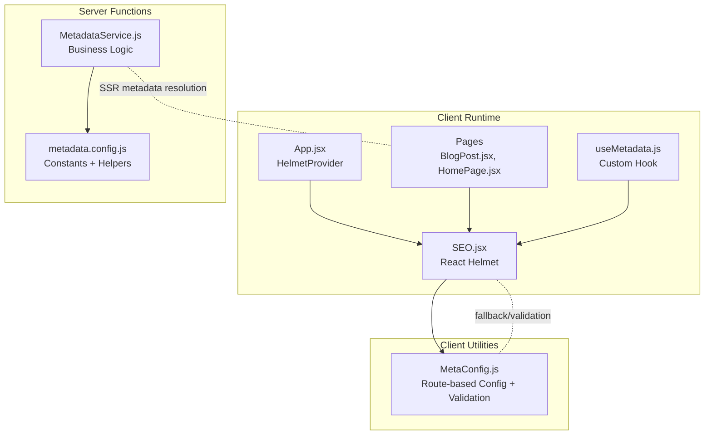
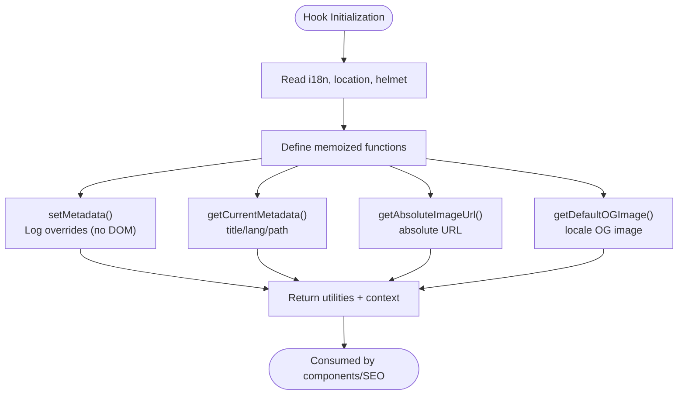
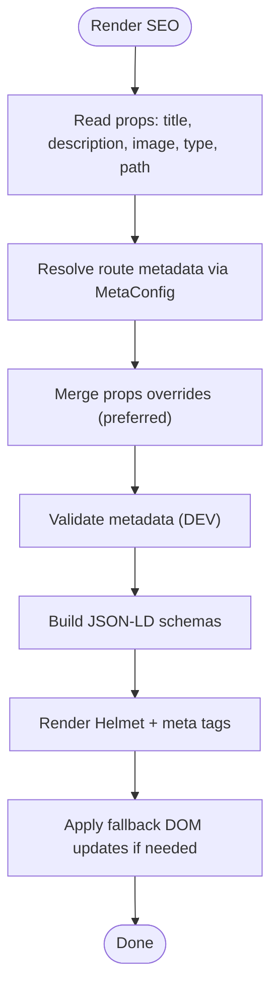
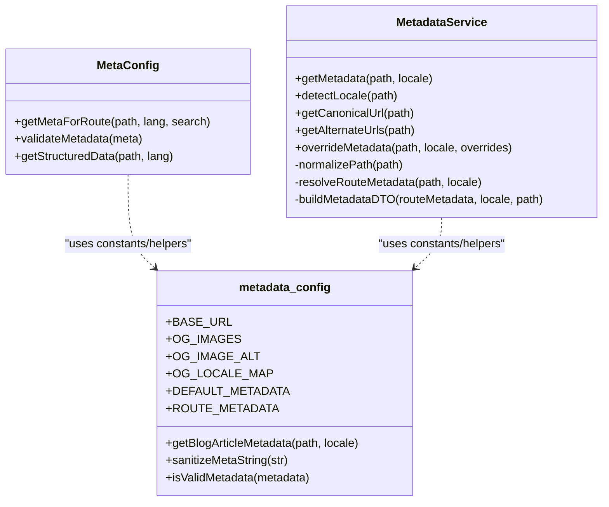
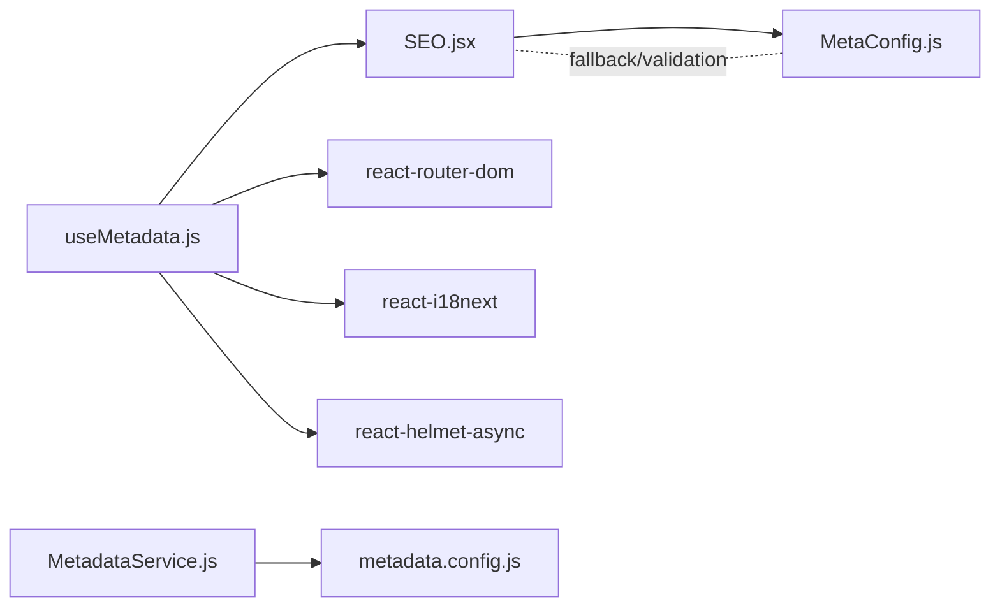

# Custom Hooks

<cite>
**Referenced Files in This Document**
- [useMetadata.js](file://src/hooks/useMetadata.js)
- [SEO.jsx](file://src/components/SEO.jsx)
- [MetaConfig.js](file://src/utils/MetaConfig.js)
- [MetadataService.js](file://functions/services/MetadataService.js)
- [metadata.config.js](file://functions/config/metadata.config.js)
- [MetadataService.test.js](file://functions/services/MetadataService.test.js)
- [MetaConfig.test.js](file://src/utils/MetaConfig.test.js)
- [BlogPost.jsx](file://src/pages/BlogPost.jsx)
- [HomePage.jsx](file://src/pages/HomePage.jsx)
- [App.jsx](file://src/App.jsx)
</cite>

## Table of Contents
1. [Introduction](#introduction)
2. [Project Structure](#project-structure)
3. [Core Components](#core-components)
4. [Architecture Overview](#architecture-overview)
5. [Detailed Component Analysis](#detailed-component-analysis)
6. [Dependency Analysis](#dependency-analysis)
7. [Performance Considerations](#performance-considerations)
8. [Troubleshooting Guide](#troubleshooting-guide)
9. [Conclusion](#conclusion)
10. [Appendices](#appendices)

## Introduction
This document focuses on the custom hooks used throughout the application, with a deep dive into the useMetadata hook, its integration with the SEO system, and the broader metadata resolution pipeline. It explains hook composition patterns, dependency management, performance optimization techniques, testing strategies, error handling, and reusability patterns. Examples demonstrate how hooks are used across components, how dependency arrays are managed, and how side effects are handled. Guidance is also provided on hook performance implications, memoization strategies, and best practices for building custom hooks.

## Project Structure
The metadata and SEO system spans both client-side and server-side layers:
- Client-side React components and hooks manage runtime metadata updates and rendering.
- Centralized configuration and utilities provide route-based metadata and validation.
- A server-side service encapsulates business logic for metadata resolution and overrides.



**Diagram sources**
- [App.jsx](file://src/App.jsx#L321-L344)
- [SEO.jsx](file://src/components/SEO.jsx#L1-L278)
- [useMetadata.js](file://src/hooks/useMetadata.js#L43-L117)
- [MetaConfig.js](file://src/utils/MetaConfig.js#L250-L295)
- [MetadataService.js](file://functions/services/MetadataService.js#L44-L88)
- [metadata.config.js](file://functions/config/metadata.config.js#L119-L209)

**Section sources**
- [App.jsx](file://src/App.jsx#L321-L344)
- [SEO.jsx](file://src/components/SEO.jsx#L1-L278)
- [useMetadata.js](file://src/hooks/useMetadata.js#L1-L117)
- [MetaConfig.js](file://src/utils/MetaConfig.js#L1-L530)
- [MetadataService.js](file://functions/services/MetadataService.js#L1-L380)
- [metadata.config.js](file://functions/config/metadata.config.js#L1-L369)

## Core Components
- useMetadata hook: Provides utilities for metadata state, URL normalization, and default OG image retrieval. It exposes a minimal API surface and defers actual DOM manipulation to the SEO component.
- SEO component: Centralizes metadata rendering via React Helmet, validates metadata in development, and injects JSON-LD schemas. It merges route-based configuration with optional overrides and supports a fallback mechanism.
- MetaConfig utilities: Provide route-based metadata lookup, canonical URL normalization, query parameter filtering, and metadata validation helpers used by the SEO component.
- MetadataService (server): Encapsulates business logic for locale detection, route matching, fallback strategies, URL generation, and metadata DTO construction. It supports dynamic overrides for content such as blog posts.

Key responsibilities:
- useMetadata: Client-side convenience utilities and metadata introspection.
- SEO: Declarative metadata rendering and structured data injection.
- MetaConfig: Centralized, validated, and normalized metadata configuration.
- MetadataService: Robust, testable metadata resolution with caching-friendly patterns.

**Section sources**
- [useMetadata.js](file://src/hooks/useMetadata.js#L43-L117)
- [SEO.jsx](file://src/components/SEO.jsx#L7-L44)
- [MetaConfig.js](file://src/utils/MetaConfig.js#L250-L325)
- [MetadataService.js](file://functions/services/MetadataService.js#L44-L88)

## Architecture Overview
The metadata pipeline integrates client-side and server-side concerns:
- On the client, the SEO component reads route-based metadata from MetaConfig, applies optional overrides, and renders meta tags and JSON-LD via React Helmet.
- The useMetadata hook offers a simple API for components to signal metadata changes; in practice, components pass overrides to the SEO component rather than calling the hook directly.
- For server-side rendering, MetadataService resolves metadata deterministically, enabling consistent SSR and dynamic overrides for content such as blog articles.

```mermaid
sequenceDiagram
participant Comp as "Component"
participant SEO as "SEO.jsx"
participant Util as "MetaConfig.js"
participant Hook as "useMetadata.js"
Comp->>SEO : Render with props (title, description, image, type, path)
SEO->>Util : getMetaForRoute(path, lang, search)
Util-->>SEO : Route metadata + canonical URL
SEO->>SEO : Merge props overrides (preferred)
SEO->>SEO : Validate metadata (DEV)
SEO->>SEO : Build JSON-LD schemas
SEO-->>Comp : Render Helmet + meta tags + JSON-LD
Note over Hook,SEO : useMetadata provides utilities; components typically pass overrides to SEO
```

**Diagram sources**
- [SEO.jsx](file://src/components/SEO.jsx#L7-L44)
- [MetaConfig.js](file://src/utils/MetaConfig.js#L250-L295)
- [useMetadata.js](file://src/hooks/useMetadata.js#L60-L81)

**Section sources**
- [SEO.jsx](file://src/components/SEO.jsx#L7-L44)
- [MetaConfig.js](file://src/utils/MetaConfig.js#L250-L295)
- [useMetadata.js](file://src/hooks/useMetadata.js#L60-L81)

## Detailed Component Analysis

### useMetadata Hook
Purpose:
- Provide client-side utilities for metadata-related tasks without directly manipulating DOM.
- Offer a stable API surface for components to request metadata state and helper functions.

Capabilities:
- setMetadata: Logs overrides for visibility; intended to be superseded by passing overrides to the SEO component.
- getCurrentMetadata: Returns current title, language, and path derived from Helmet and router.
- getAbsoluteImageUrl: Converts relative image paths to absolute URLs with protocol.
- getDefaultOGImage: Generates locale-specific OG image URL with cache-busting version.

Implementation patterns:
- Uses useCallback to memoize functions and stabilize dependencies.
- Reads i18n language and router location to derive current context.
- Exposes baseUrl and currentLang for downstream consumers.



**Diagram sources**
- [useMetadata.js](file://src/hooks/useMetadata.js#L43-L117)

**Section sources**
- [useMetadata.js](file://src/hooks/useMetadata.js#L43-L117)

### SEO Component
Responsibilities:
- Centralized metadata rendering via React Helmet.
- Route-based metadata resolution using MetaConfig.
- Optional prop-based overrides merged with configuration.
- Structured data (JSON-LD) generation for Knowledge Graph.
- Development-time validation and logging.
- Fallback mechanism for React 19/Helmet async scenarios.

Key behaviors:
- Merges props overrides with config metadata, preferring props.
- Builds schemas for Organization, Service, FAQ, Breadcrumbs, and WebPage.
- Applies canonical URL and hreflang tags.
- Manages side effects to update meta tags and JSON-LD when dependencies change.



**Diagram sources**
- [SEO.jsx](file://src/components/SEO.jsx#L7-L44)
- [SEO.jsx](file://src/components/SEO.jsx#L169-L223)
- [MetaConfig.js](file://src/utils/MetaConfig.js#L250-L295)

**Section sources**
- [SEO.jsx](file://src/components/SEO.jsx#L7-L44)
- [SEO.jsx](file://src/components/SEO.jsx#L169-L223)
- [MetaConfig.js](file://src/utils/MetaConfig.js#L250-L295)

### Metadata Resolution Pipeline
Client-side:
- MetaConfig.getMetaForRoute resolves metadata by route and language, normalizes paths, and constructs canonical URLs with filtered query parameters.

Server-side:
- MetadataService orchestrates locale detection, blog article resolution, route matching, and DTO construction. It supports dynamic overrides and sanitization.



**Diagram sources**
- [MetaConfig.js](file://src/utils/MetaConfig.js#L250-L325)
- [MetadataService.js](file://functions/services/MetadataService.js#L44-L88)
- [metadata.config.js](file://functions/config/metadata.config.js#L119-L209)

**Section sources**
- [MetaConfig.js](file://src/utils/MetaConfig.js#L250-L325)
- [MetadataService.js](file://functions/services/MetadataService.js#L44-L88)
- [metadata.config.js](file://functions/config/metadata.config.js#L119-L209)

### Hook Composition Patterns and Usage
- Composition: Components render the SEO component and optionally pass overrides. The useMetadata hook is a supporting utility; components rarely call it directly.
- Example usage:
  - HomePage passes a path to SEO for root routes.
  - BlogPost passes a path and an override object containing article-specific metadata.

```mermaid
sequenceDiagram
participant HP as "HomePage.jsx"
participant SEO as "SEO.jsx"
HP->>SEO : <SEO path={isAr ? '/ar' : '/'} />
Note over HP,SEO : No overrides; relies on MetaConfig
participant BP as "BlogPost.jsx"
participant SEO2 as "SEO.jsx"
BP->>SEO2 : <SEO path={...} overrideMeta={{title, description, image, type, ...}} />
Note over BP,SEO2 : Dynamic overrides for article
```

**Diagram sources**
- [HomePage.jsx](file://src/pages/HomePage.jsx#L25-L30)
- [BlogPost.jsx](file://src/pages/BlogPost.jsx#L31-L41)

**Section sources**
- [HomePage.jsx](file://src/pages/HomePage.jsx#L25-L30)
- [BlogPost.jsx](file://src/pages/BlogPost.jsx#L31-L41)

### Dependency Arrays and Side Effects
- SEO component’s effect depends on metadata fields and schemas; changes trigger DOM updates for meta tags and JSON-LD.
- useMetadata memoizes functions to minimize re-renders; dependencies include Helmet state, router location, and i18n language.
- App-level synchronization ensures document direction and language align with the current route.

Best practices:
- Keep dependency arrays minimal and accurate to avoid unnecessary re-renders.
- Use useMemo for expensive schema computations.
- Prefer declarative props over imperative DOM manipulation.

**Section sources**
- [SEO.jsx](file://src/components/SEO.jsx#L169-L223)
- [useMetadata.js](file://src/hooks/useMetadata.js#L75-L81)
- [App.jsx](file://src/App.jsx#L119-L143)

## Dependency Analysis
- SEO depends on MetaConfig for route metadata and validation.
- useMetadata depends on i18n, router, and Helmet to provide utilities.
- Server-side MetadataService depends on metadata.config for constants and helpers.
- Tests validate behavior across locale detection, path normalization, canonical URL generation, and metadata overrides.



**Diagram sources**
- [SEO.jsx](file://src/components/SEO.jsx#L1-L278)
- [MetaConfig.js](file://src/utils/MetaConfig.js#L1-L530)
- [useMetadata.js](file://src/hooks/useMetadata.js#L11-L14)
- [MetadataService.js](file://functions/services/MetadataService.js#L16-L29)
- [metadata.config.js](file://functions/config/metadata.config.js#L1-L369)

**Section sources**
- [SEO.jsx](file://src/components/SEO.jsx#L1-L278)
- [MetaConfig.js](file://src/utils/MetaConfig.js#L1-L530)
- [useMetadata.js](file://src/hooks/useMetadata.js#L11-L14)
- [MetadataService.js](file://functions/services/MetadataService.js#L16-L29)
- [metadata.config.js](file://functions/config/metadata.config.js#L1-L369)

## Performance Considerations
- Memoization:
  - Memoize expensive computations like JSON-LD schema generation using React.useMemo in the SEO component.
  - Memoize helper functions in useMetadata to avoid recreating callbacks on every render.
- Dependency arrays:
  - Keep effect dependencies minimal to prevent unnecessary DOM updates.
  - Ensure dependency lists reflect all external values used inside effects.
- Canonical URL normalization:
  - Filter query parameters to reduce URL variance and improve caching.
- SSR alignment:
  - Server-side MetadataService ensures deterministic metadata for SSR, reducing hydration mismatches.

[No sources needed since this section provides general guidance]

## Troubleshooting Guide
Common issues and resolutions:
- Missing metadata fields:
  - Use validateMetadata to identify missing fields during development and address configuration gaps.
- Incorrect OG image URLs:
  - Ensure images use HTTPS and are absolute; use getAbsoluteImageUrl for normalization.
- Locale and direction mismatches:
  - Verify i18n language sync with the route and document direction updates.
- Dynamic content overrides:
  - Pass overrides to the SEO component rather than calling setMetadata directly; ensure overrides are sanitized.

Testing strategies:
- Unit tests for MetadataService cover locale detection, path normalization, canonical URL generation, alternate URLs, and metadata overrides.
- Unit tests for MetaConfig cover canonical URL normalization and query parameter handling.

**Section sources**
- [SEO.jsx](file://src/components/SEO.jsx#L30-L44)
- [MetaConfig.js](file://src/utils/MetaConfig.js#L304-L325)
- [MetadataService.test.js](file://functions/services/MetadataService.test.js#L15-L370)
- [MetaConfig.test.js](file://src/utils/MetaConfig.test.js#L1-L54)

## Conclusion
The useMetadata hook provides a focused, memoized set of utilities for metadata-related tasks on the client. The SEO component centralizes metadata rendering and validation, leveraging route-based configuration and optional overrides. The server-side MetadataService ensures robust, testable metadata resolution with dynamic overrides and strong typing. Together, these pieces form a maintainable, performant, and extensible metadata system suitable for multilingual, SEO-focused applications.

[No sources needed since this section summarizes without analyzing specific files]

## Appendices

### Best Practices for Custom Hook Development
- Keep hooks focused and composable; expose only necessary utilities.
- Use useCallback and useMemo to optimize performance.
- Avoid imperative DOM manipulation inside hooks; delegate to components.
- Provide clear prop-based override patterns for dynamic content.
- Include development-time validation and logging for easier debugging.

[No sources needed since this section provides general guidance]