# Page Components

<cite>
**Referenced Files in This Document**
- [App.jsx](file://src/App.jsx)
- [main.jsx](file://src/main.jsx)
- [HomePage.jsx](file://src/pages/HomePage.jsx)
- [ServicesPage.jsx](file://src/pages/ServicesPage.jsx)
- [PortfolioPage.jsx](file://src/pages/PortfolioPage.jsx)
- [AboutPage.jsx](file://src/pages/AboutPage.jsx)
- [BlogPage.jsx](file://src/pages/BlogPage.jsx)
- [BlogPost.jsx](file://src/pages/BlogPost.jsx)
- [ContactPage.jsx](file://src/pages/ContactPage.jsx)
- [LegalPage.jsx](file://src/pages/LegalPage.jsx)
- [ManifestoPage.jsx](file://src/pages/ManifestoPage.jsx)
- [NotFound.jsx](file://src/pages/NotFound.jsx)
- [OfflineFallback.jsx](file://src/pages/OfflineFallback.jsx)
</cite>

## Table of Contents
1. [Introduction](#introduction)
2. [Project Structure](#project-structure)
3. [Core Components](#core-components)
4. [Architecture Overview](#architecture-overview)
5. [Detailed Component Analysis](#detailed-component-analysis)
6. [Dependency Analysis](#dependency-analysis)
7. [Performance Considerations](#performance-considerations)
8. [Troubleshooting Guide](#troubleshooting-guide)
9. [Conclusion](#conclusion)

## Introduction
This document provides comprehensive documentation for all page components in the application. It explains each page’s purpose, structure, implementation details, and integration with shared components. It also covers route configuration, parameter handling, page-specific styling, and implementation patterns for blog posts, legal pages, and specialized content pages. Special attention is given to page transitions, loading states, and error handling specific to each page type.

## Project Structure
The application uses React with client-side routing and lazy loading for optimal performance. Pages are organized under src/pages and integrate with shared components from src/components. Routing is configured centrally in App.jsx with animated transitions and Suspense-based fallbacks. Internationalization is handled via react-i18next, and SEO metadata is managed through a dedicated SEO component.

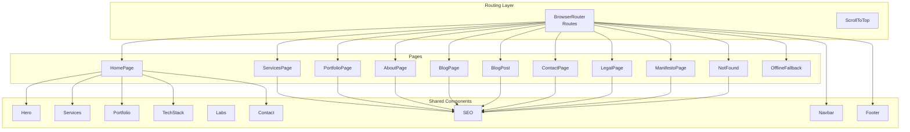

**Diagram sources**
- [App.jsx](file://src/App.jsx#L169-L309)
- [HomePage.jsx](file://src/pages/HomePage.jsx#L1-L43)
- [ServicesPage.jsx](file://src/pages/ServicesPage.jsx#L1-L237)
- [PortfolioPage.jsx](file://src/pages/PortfolioPage.jsx#L1-L204)
- [AboutPage.jsx](file://src/pages/AboutPage.jsx#L1-L219)
- [BlogPage.jsx](file://src/pages/BlogPage.jsx#L1-L141)
- [BlogPost.jsx](file://src/pages/BlogPost.jsx#L1-L132)
- [ContactPage.jsx](file://src/pages/ContactPage.jsx#L1-L27)
- [LegalPage.jsx](file://src/pages/LegalPage.jsx#L1-L232)
- [ManifestoPage.jsx](file://src/pages/ManifestoPage.jsx#L1-L120)
- [NotFound.jsx](file://src/pages/NotFound.jsx#L1-L152)
- [OfflineFallback.jsx](file://src/pages/OfflineFallback.jsx#L1-L57)

**Section sources**
- [App.jsx](file://src/App.jsx#L169-L309)
- [main.jsx](file://src/main.jsx#L1-L12)

## Core Components
- HomePage: Orchestrates hero, services, portfolio, tech stack, and contact sections with lazy loading and skeleton fallbacks. Uses motion transitions and SEO metadata.
- ServicesPage: Features parallax scrolling, service cards with tilt effects, and a methodology timeline. Implements bilingual content and responsive animations.
- PortfolioPage: Displays project cards with image optimization, skeleton loaders, and modal detail views with animated transitions.
- AboutPage: Highlights company values, technology stack, and founder profile with motion variants and interactive elements.
- BlogPage: Lists articles with skeletons, links to individual posts, and optimized images. Defensively handles missing blog data.
- BlogPost: Renders a single article by slug, with SEO overrides, share-ready metadata, and smooth back navigation.
- ContactPage: Integrates the Contact component with page-level transitions and SEO.
- LegalPage: Dynamic legal content rendering with scroll spy, sticky sidebar navigation, and responsive layout.
- ManifestoPage: Static bilingual content presentation with sectioned layout and subtle animations.
- NotFound: High-end 404 page with glassmorphism card, animations, and language-aware navigation.
- OfflineFallback: Offline experience with logo, pulsing indicator, and reload action.

**Section sources**
- [HomePage.jsx](file://src/pages/HomePage.jsx#L1-L43)
- [ServicesPage.jsx](file://src/pages/ServicesPage.jsx#L1-L237)
- [PortfolioPage.jsx](file://src/pages/PortfolioPage.jsx#L1-L204)
- [AboutPage.jsx](file://src/pages/AboutPage.jsx#L1-L219)
- [BlogPage.jsx](file://src/pages/BlogPage.jsx#L1-L141)
- [BlogPost.jsx](file://src/pages/BlogPost.jsx#L1-L132)
- [ContactPage.jsx](file://src/pages/ContactPage.jsx#L1-L27)
- [LegalPage.jsx](file://src/pages/LegalPage.jsx#L1-L232)
- [ManifestoPage.jsx](file://src/pages/ManifestoPage.jsx#L1-L120)
- [NotFound.jsx](file://src/pages/NotFound.jsx#L1-L152)
- [OfflineFallback.jsx](file://src/pages/OfflineFallback.jsx#L1-L57)

## Architecture Overview
The routing layer in App.jsx defines all routes, including localized paths (/ and /ar) and catch-all 404 handling. Each page integrates with SEO and may lazy-load shared components. Suspense fallbacks ensure consistent loading states across pages. Animations leverage Framer Motion for entrance/exit transitions and scroll-based effects. Internationalization synchronizes language and direction with URL segments.

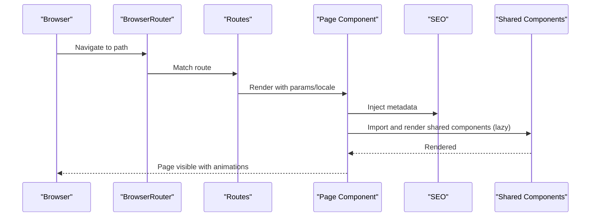

**Diagram sources**
- [App.jsx](file://src/App.jsx#L169-L309)
- [HomePage.jsx](file://src/pages/HomePage.jsx#L25-L40)
- [ServicesPage.jsx](file://src/pages/ServicesPage.jsx#L65-L104)
- [PortfolioPage.jsx](file://src/pages/PortfolioPage.jsx#L50-L81)
- [AboutPage.jsx](file://src/pages/AboutPage.jsx#L63-L99)
- [BlogPage.jsx](file://src/pages/BlogPage.jsx#L47-L63)
- [BlogPost.jsx](file://src/pages/BlogPost.jsx#L29-L41)
- [ContactPage.jsx](file://src/pages/ContactPage.jsx#L11-L23)
- [LegalPage.jsx](file://src/pages/LegalPage.jsx#L57-L60)
- [ManifestoPage.jsx](file://src/pages/ManifestoPage.jsx#L59-L68)

**Section sources**
- [App.jsx](file://src/App.jsx#L169-L309)

## Detailed Component Analysis

### HomePage
- Purpose: Primary landing page aggregating hero, services, portfolio, tech stack, and contact.
- Structure: Lazy-loads hero, services, portfolio, tech stack, and contact components; uses Suspense with a skeleton loader.
- Implementation: Applies motion transitions for opacity on mount/exit; injects SEO metadata with dynamic path based on locale.
- Integration: Composes shared components; relies on SEO for metadata; supports Arabic locale via path parameter.
- Styling: Minimal page-level styling; leverages shared component styles.
- Transitions: Fade-in/out using motion; Suspense fallback ensures smooth loading.
- Error Handling: No explicit error boundaries in the page; relies on global ErrorBoundary at the app level.

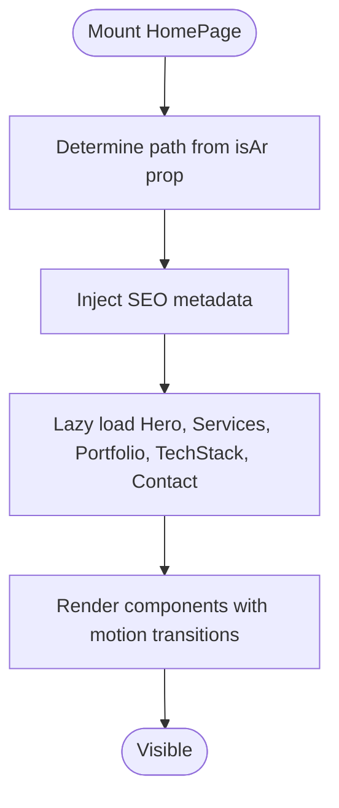

**Diagram sources**
- [HomePage.jsx](file://src/pages/HomePage.jsx#L25-L40)

**Section sources**
- [HomePage.jsx](file://src/pages/HomePage.jsx#L1-L43)

### ServicesPage
- Purpose: Showcase services with animated cards, methodology timeline, and bilingual CTA.
- Structure: Uses useScroll/useTransform for parallax; renders three service cards with icons, tech stacks, and benefits; displays a four-step process timeline.
- Implementation: Dynamically translates content using react-i18next; applies motion variants for staggered animations; uses TiltCard for visual depth.
- Integration: Consumes shared components (TiltCard) and SEO; responsive layout adapts to RTL/LTR.
- Styling: Gradient backgrounds, glow effects, and hover states; consistent typography and spacing.
- Transitions: Staggered entrance animations; hover interactions on cards and timeline steps.
- Error Handling: No explicit error handling; relies on global mechanisms.

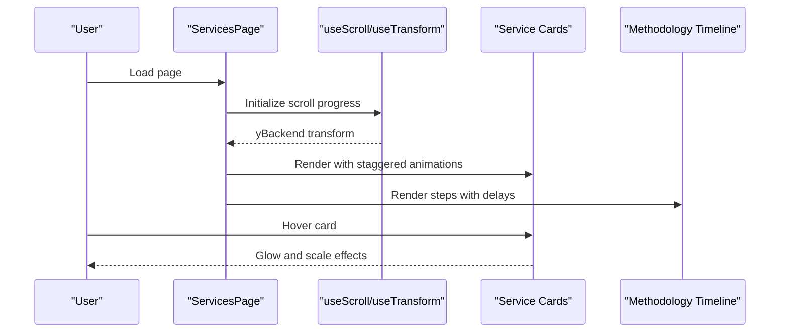

**Diagram sources**
- [ServicesPage.jsx](file://src/pages/ServicesPage.jsx#L9-L237)

**Section sources**
- [ServicesPage.jsx](file://src/pages/ServicesPage.jsx#L1-L237)

### PortfolioPage
- Purpose: Present a gallery of projects with image optimization and modal detail view.
- Structure: Skeleton loader during initial load; project cards with overlay text; modal popup with layout animation using AnimatePresence and layoutId.
- Implementation: Uses OptimizedImage for responsive images; implements click-to-open modal; scroll-to-top on mount.
- Integration: Consumes shared OptimizedImage and CardSkeleton; SEO injected at page level.
- Styling: Responsive grid, gradient overlays, and hover-driven reveal effects; RTL support via logical properties.
- Transitions: Fade-in on load; layout animations for modal; hover scaling and opacity changes.
- Error Handling: Defensive loading; no explicit error boundaries.

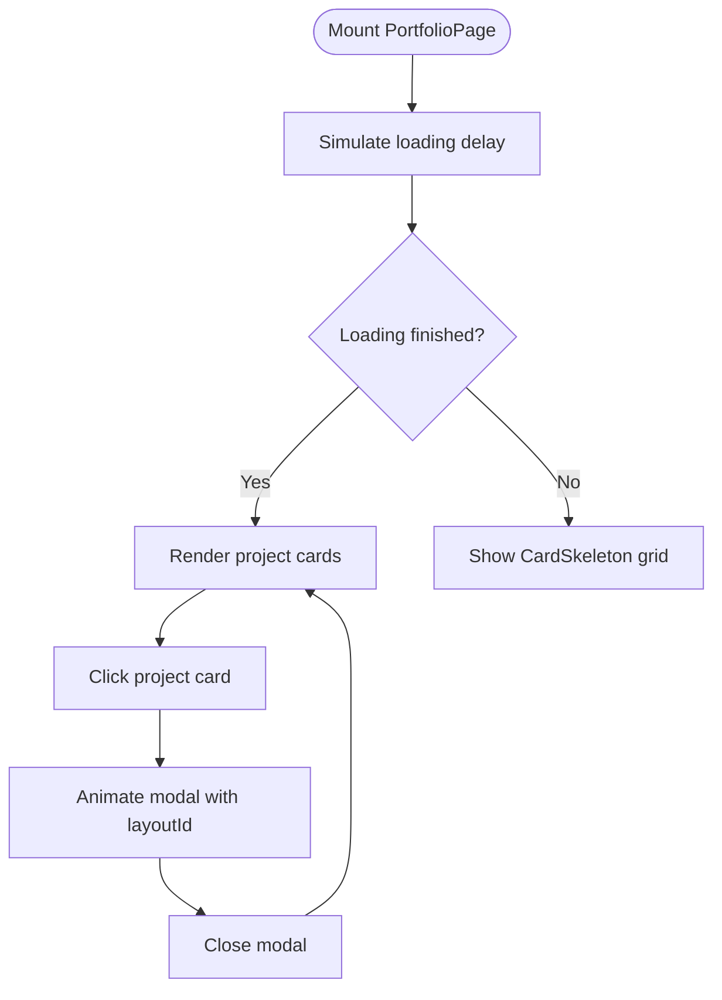

**Diagram sources**
- [PortfolioPage.jsx](file://src/pages/PortfolioPage.jsx#L9-L204)

**Section sources**
- [PortfolioPage.jsx](file://src/pages/PortfolioPage.jsx#L1-L204)

### AboutPage
- Purpose: Communicate company values, technology stack, and leadership.
- Structure: Values grid, tech stack categories, and a featured founder section; uses motion variants for staggered entrance.
- Implementation: Bilingual content via react-i18next; MagneticButton for interactive CTA; directional styling for RTL.
- Integration: Consumes shared components (MagneticButton); SEO injected; responsive layout.
- Styling: Gradient accents, carbon fiber background, and hover animations; consistent typography hierarchy.
- Transitions: Staggered container/item animations; hover effects on cards and buttons.
- Error Handling: No explicit error handling.

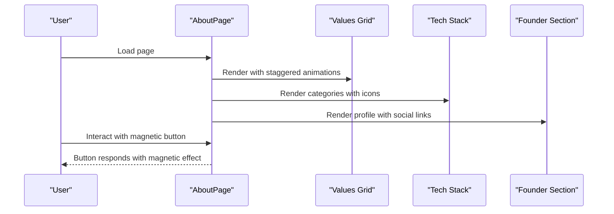

**Diagram sources**
- [AboutPage.jsx](file://src/pages/AboutPage.jsx#L9-L219)

**Section sources**
- [AboutPage.jsx](file://src/pages/AboutPage.jsx#L1-L219)

### BlogPage
- Purpose: List blog articles with category badges, reading time, and author info.
- Structure: Skeleton loader during initial load; maps centralized blog data to UI expectations; links to individual posts.
- Implementation: Defensive import of blog data; selects content based on current locale; uses OptimizedImage and ArticleSkeleton.
- Integration: Consumes shared OptimizedImage and ArticleSkeleton; SEO injected; responsive grid layout.
- Styling: Card-based layout with category tags, date/time metadata, and hover arrows.
- Transitions: Staggered entrance animations; hover scaling and arrow translation.
- Error Handling: Falls back to empty posts if data import fails; loading state prevents blank UI.

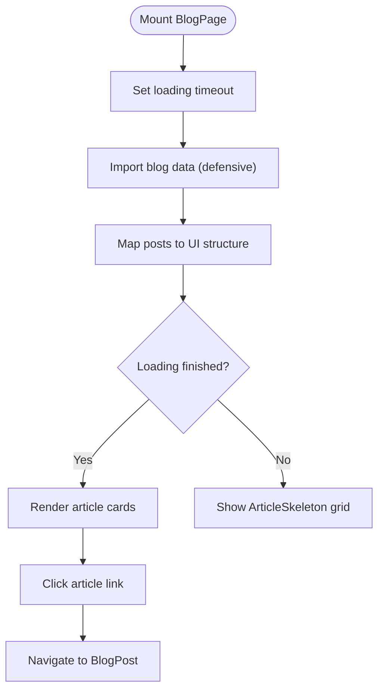

**Diagram sources**
- [BlogPage.jsx](file://src/pages/BlogPage.jsx#L19-L141)

**Section sources**
- [BlogPage.jsx](file://src/pages/BlogPage.jsx#L1-L141)

### BlogPost
- Purpose: Render a single blog article by slug with SEO overrides and share-ready metadata.
- Structure: Extracts slug from URL params; fetches post by slug; redirects to 404 if not found; renders header, hero image, and content.
- Implementation: Dynamically selects content locale; scrolls to top on mount; uses dangerouslySetInnerHTML for content rendering; provides back-to-blog navigation.
- Integration: Consumes shared OptimizedImage and ShareButton; SEO overrides include title, description, image, type, author, and published time.
- Styling: Prose styles with dark mode support; blockquote styling and link colors; RTL adjustments for Arabic.
- Transitions: Smooth entrance animations for header, image, and content; back link with directional arrow.
- Error Handling: Guards against missing posts with Navigate to 404.

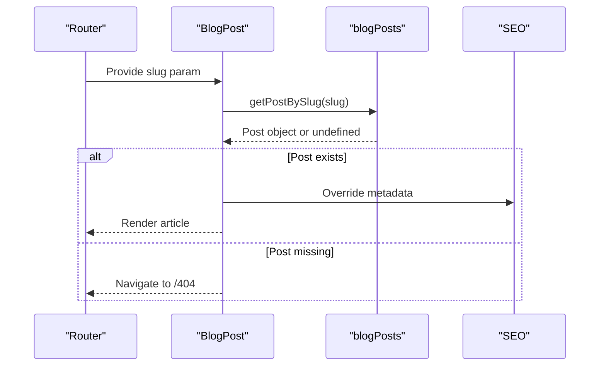

**Diagram sources**
- [BlogPost.jsx](file://src/pages/BlogPost.jsx#L11-L132)

**Section sources**
- [BlogPost.jsx](file://src/pages/BlogPost.jsx#L1-L132)

### ContactPage
- Purpose: Dedicated contact page integrating the Contact component.
- Structure: Page-level motion transitions and SEO injection; renders Contact component.
- Implementation: Determines locale from i18n; passes to SEO and Contact.
- Integration: Consumes shared Contact component; SEO injected.
- Styling: Minimal page-level padding; relies on Contact component styles.
- Transitions: Fade-in/out using motion; Suspense fallback if Contact is lazy-loaded elsewhere.
- Error Handling: No explicit error handling.

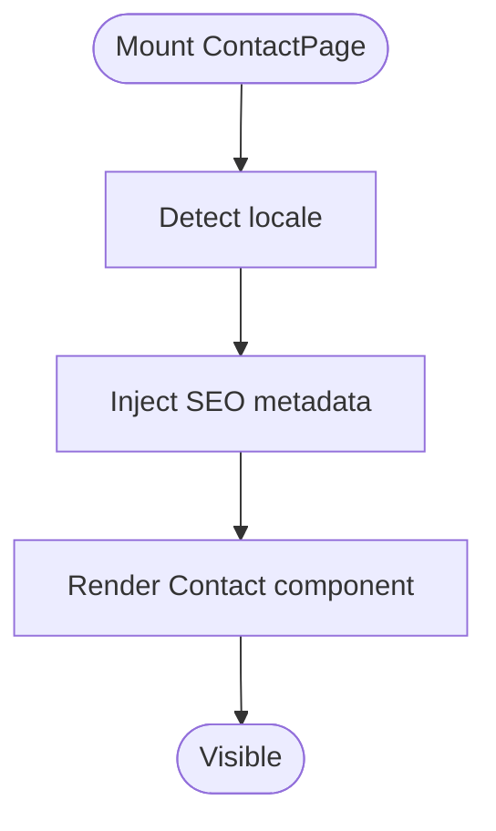

**Diagram sources**
- [ContactPage.jsx](file://src/pages/ContactPage.jsx#L7-L27)

**Section sources**
- [ContactPage.jsx](file://src/pages/ContactPage.jsx#L1-L27)

### LegalPage
- Purpose: Render dynamic legal content (privacy or terms) with scroll spy and sticky sidebar navigation.
- Structure: Accepts type prop to determine content; computes sections, title, and last updated; implements scroll spy and smooth scrolling.
- Implementation: Uses react-i18next to fetch structured content; mobile sidebar toggles with AnimatePresence; desktop sticky nav with active section highlighting.
- Integration: Consumes SEO; responsive grid layout with sidebar and main content areas.
- Styling: Sticky navigation, decorative lines, and active state indicators; RTL support.
- Transitions: Smooth scroll to sections; animated sidebar on mobile; hover states on navigation items.
- Error Handling: Defensive fallbacks if translation keys are missing.

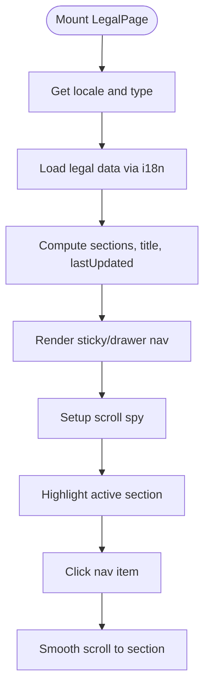

**Diagram sources**
- [LegalPage.jsx](file://src/pages/LegalPage.jsx#L8-L232)

**Section sources**
- [LegalPage.jsx](file://src/pages/LegalPage.jsx#L1-L232)

### ManifestoPage
- Purpose: Present a static bilingual manifesto with sectioned layout and subtle animations.
- Structure: Inline bilingual content object; selects content based on locale; renders sections with staggered entrance.
- Implementation: Uses SEO override to set title and description; applies motion variants for staggered reveals.
- Integration: Consumes SEO; minimal shared component usage.
- Styling: Sectioned layout with accent borders and hover effects; responsive typography.
- Transitions: Staggered entrance per section; hover color transitions.
- Error Handling: No explicit error handling.

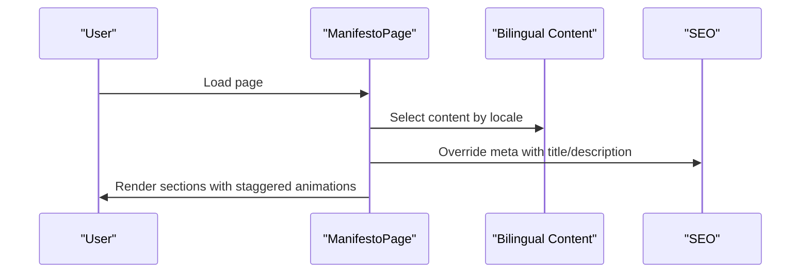

**Diagram sources**
- [ManifestoPage.jsx](file://src/pages/ManifestoPage.jsx#L6-L120)

**Section sources**
- [ManifestoPage.jsx](file://src/pages/ManifestoPage.jsx#L1-L120)

### NotFound
- Purpose: High-end 404 page with glassmorphism card, animations, and language-aware navigation.
- Structure: Bilingual content object; detects locale from URL; renders glass card with actions and decorative elements.
- Implementation: Uses memoization to detect locale; animates elements with Framer Motion; provides back-to-home and back actions.
- Integration: Consumes SEO; responsive layout with RTL support.
- Styling: Glass-like card, gradient accents, and rotating decorative border.
- Transitions: Staggered entrance for all elements; hover effects on buttons.
- Error Handling: No runtime errors; designed as a fallback page.

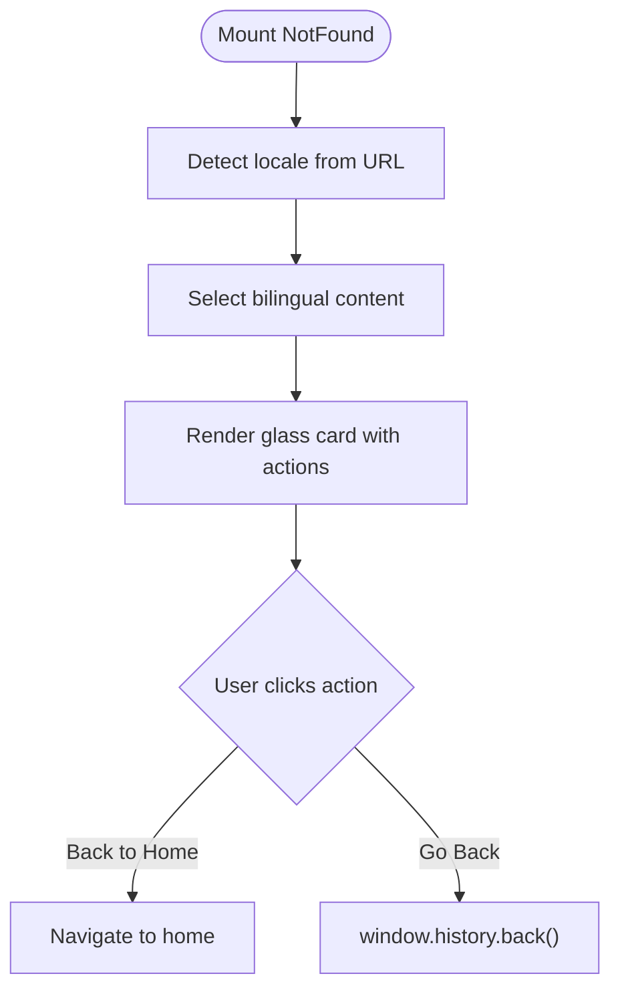

**Diagram sources**
- [NotFound.jsx](file://src/pages/NotFound.jsx#L18-L152)

**Section sources**
- [NotFound.jsx](file://src/pages/NotFound.jsx#L1-L152)

### OfflineFallback
- Purpose: Provide a friendly offline experience with logo, pulsing indicator, and reload action.
- Structure: Renders logo, offline icon with pulse animation, message, and reload button.
- Implementation: Uses motion for scale and opacity animations; reload triggers window location refresh.
- Integration: Standalone page component; no external dependencies except Lucide icons.
- Styling: Dark theme with cyan accents; centered layout.
- Transitions: Scale and opacity animations; continuous pulse effect.
- Error Handling: No explicit error handling; relies on browser connectivity events.

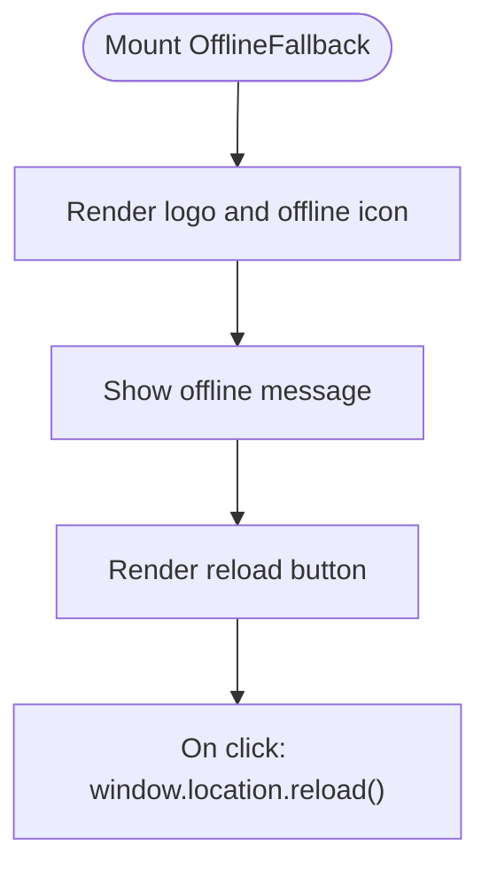

**Diagram sources**
- [OfflineFallback.jsx](file://src/pages/OfflineFallback.jsx#L5-L57)

**Section sources**
- [OfflineFallback.jsx](file://src/pages/OfflineFallback.jsx#L1-L57)

## Dependency Analysis
- Routing Dependencies: App.jsx defines all routes and passes parameters (e.g., type for LegalPage). HomePage accepts isAr prop to differentiate locales.
- Parameter Handling: BlogPost extracts slug via useParams; LegalPage receives type via route; HomePage determines locale via prop.
- Lazy Loading: All pages and shared components are lazy-loaded; Suspense fallbacks ensure consistent UX.
- Shared Component Coupling: Pages depend on SEO and various shared components (Contact, OptimizedImage, etc.). HomePage composes multiple shared components.
- Internationalization: Pages rely on react-i18next for translations; App.jsx synchronizes language/direction with URL.

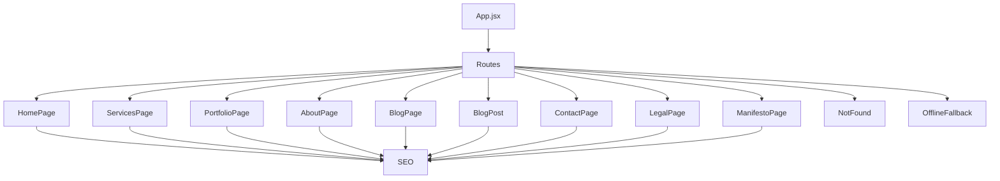

**Diagram sources**
- [App.jsx](file://src/App.jsx#L169-L309)

**Section sources**
- [App.jsx](file://src/App.jsx#L169-L309)

## Performance Considerations
- Lazy Loading: All pages and shared components are lazy-loaded to reduce initial bundle size.
- Suspense Fallbacks: Consistent skeleton loaders improve perceived performance during hydration and data fetches.
- Image Optimization: OptimizedImage is used across PortfolioPage and BlogPage/BlogPost for responsive images.
- Animations: Framer Motion is used selectively to avoid heavy computations; scroll-based transforms are optimized via useTransform.
- PWA Updates: Service worker registration and periodic sync are configured to keep content fresh without manual refresh.

[No sources needed since this section provides general guidance]

## Troubleshooting Guide
- Blog Data Unavailable: BlogPage uses a defensive import and falls back to empty posts if data is missing, preventing crashes.
- Missing Blog Post: BlogPost redirects to 404 if the post is not found, ensuring graceful degradation.
- Locale Mismatch: App.jsx synchronizes i18n language/direction with URL; ensure routes start with /ar for Arabic.
- Offline Experience: App.jsx listens for online/offline events and conditionally renders OfflineFallback; users can reload to recover.
- 404 Handling: NotFound is rendered for unmatched routes; bilingual messages adapt to locale detection.
- Loading States: Skeleton loaders and loading spinners provide feedback during initial load and route transitions.

**Section sources**
- [BlogPage.jsx](file://src/pages/BlogPage.jsx#L10-L17)
- [BlogPost.jsx](file://src/pages/BlogPost.jsx#L24-L27)
- [App.jsx](file://src/App.jsx#L118-L143)
- [App.jsx](file://src/App.jsx#L78-L115)
- [NotFound.jsx](file://src/pages/NotFound.jsx#L18-L44)

## Conclusion
Each page component is designed with a focus on internationalization, performance, and user experience. Routing is centralized with animated transitions and Suspense fallbacks. Shared components are integrated consistently, and SEO metadata is injected per page. Specialized pages like BlogPost, LegalPage, and PortfolioPage demonstrate robust patterns for content rendering, navigation, and accessibility.

[No sources needed since this section summarizes without analyzing specific files]