# Routing and Navigation

<cite>
**Referenced Files in This Document**
- [src/App.jsx](file://src/App.jsx)
- [src/main.jsx](file://src/main.jsx)
- [src/i18n.js](file://src/i18n.js)
- [src/components/Navbar.jsx](file://src/components/Navbar.jsx)
- [src/components/SEO.jsx](file://src/components/SEO.jsx)
- [src/components/ErrorBoundary.jsx](file://src/components/ErrorBoundary.jsx)
- [src/pages/HomePage.jsx](file://src/pages/HomePage.jsx)
- [src/pages/PortfolioPage.jsx](file://src/pages/PortfolioPage.jsx)
- [src/pages/ServicesPage.jsx](file://src/pages/ServicesPage.jsx)
- [src/pages/AboutPage.jsx](file://src/pages/AboutPage.jsx)
- [src/pages/BlogPage.jsx](file://src/pages/BlogPage.jsx)
- [src/pages/ContactPage.jsx](file://src/pages/ContactPage.jsx)
- [src/pages/LegalPage.jsx](file://src/pages/LegalPage.jsx)
- [src/pages/NotFound.jsx](file://src/pages/NotFound.jsx)
- [src/utils/MetaConfig.js](file://src/utils/MetaConfig.js)
- [src/locales/en.json](file://src/locales/en.json)
- [src/locales/ar.json](file://src/locales/ar.json)
</cite>

## Table of Contents
1. [Introduction](#introduction)
2. [Project Structure](#project-structure)
3. [Core Components](#core-components)
4. [Architecture Overview](#architecture-overview)
5. [Detailed Component Analysis](#detailed-component-analysis)
6. [Dependency Analysis](#dependency-analysis)
7. [Performance Considerations](#performance-considerations)
8. [Troubleshooting Guide](#troubleshooting-guide)
9. [Conclusion](#conclusion)

## Introduction
This document explains the application’s routing and navigation system. It covers React Router DOM configuration, route definitions, navigation patterns, internationalization-aware routing, lazy loading with Suspense, animation transitions using Framer Motion, scroll restoration, error handling, and fallback mechanisms for invalid routes. It also documents active link highlighting, accessibility features, and SEO integration via centralized metadata.

## Project Structure
The routing system is centered around a single-page application bootstrapped in the main entry file and configured with React Router DOM. Internationalization is managed by i18n, and navigation is coordinated through a shared Navbar component. Pages and components use lazy loading and Suspense for performance, with Framer Motion providing smooth transitions between views.

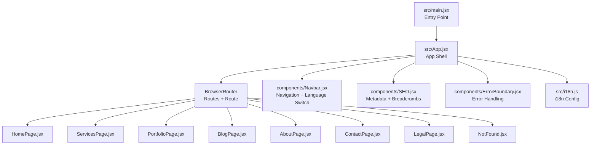

**Diagram sources**
- [src/main.jsx](file://src/main.jsx#L1-L12)
- [src/App.jsx](file://src/App.jsx#L311-L348)
- [src/components/Navbar.jsx](file://src/components/Navbar.jsx#L1-L337)
- [src/components/SEO.jsx](file://src/components/SEO.jsx#L1-L278)
- [src/components/ErrorBoundary.jsx](file://src/components/ErrorBoundary.jsx#L1-L57)
- [src/i18n.js](file://src/i18n.js#L1-L45)

**Section sources**
- [src/main.jsx](file://src/main.jsx#L1-L12)
- [src/App.jsx](file://src/App.jsx#L311-L348)

## Core Components
- App shell with Router, ScrollToTop, ErrorBoundary, ThemeProvider, and PWA update handling.
- Lazy-loaded page components and shared components.
- Centralized SEO component with metadata and structured data generation.
- Navbar with active link detection, language switching, and responsive menus.
- i18n configuration with automatic language detection and storage.

**Section sources**
- [src/App.jsx](file://src/App.jsx#L1-L348)
- [src/components/SEO.jsx](file://src/components/SEO.jsx#L1-L278)
- [src/components/Navbar.jsx](file://src/components/Navbar.jsx#L1-L337)
- [src/i18n.js](file://src/i18n.js#L1-L45)

## Architecture Overview
The routing architecture integrates:
- React Router DOM for declarative routing and navigation.
- i18n for language-aware paths and document direction.
- Framer Motion for page transitions and progress indicators.
- Suspense for lazy-loaded components with skeleton fallbacks.
- SEO component for metadata and breadcrumbs.
- Error boundary for graceful error handling.

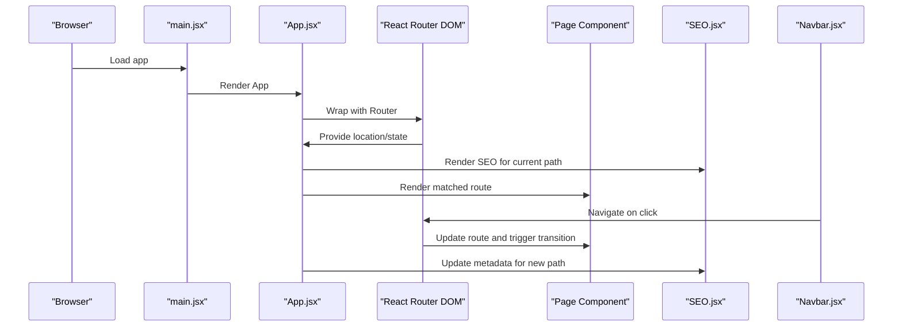

**Diagram sources**
- [src/main.jsx](file://src/main.jsx#L1-L12)
- [src/App.jsx](file://src/App.jsx#L336-L340)
- [src/components/SEO.jsx](file://src/components/SEO.jsx#L7-L274)
- [src/components/Navbar.jsx](file://src/components/Navbar.jsx#L116-L137)

## Detailed Component Analysis

### Routing Configuration and Route Definitions
- Root and Arabic routes for homepage.
- Dedicated routes for portfolio, labs, services, about, blog, legal pages (privacy/terms), contact, and offline.
- Catch-all route for 404 with animated transition and Suspense fallback.

```mermaid
flowchart TD
Start(["App.jsx Routes"]) --> HomeEN["'/' -> HomePage"]
HomeEN --> HomeAR["'/ar' -> HomePage (isAr=true)"]
Start --> PortfolioEN["'/portfolio' -> PortfolioPage (lazy + Suspense)"]
Start --> PortfolioAR["'/ar/portfolio' -> PortfolioPage (lazy + Suspense)"]
Start --> LabsEN["'/labs' -> Labs (lazy + Suspense)"]
Start --> LabsAR["'/ar/labs' -> Labs (lazy + Suspense)"]
Start --> ServicesEN["'/services' -> ServicesPage (lazy + Suspense)"]
Start --> ServicesAR["'/ar/services' -> ServicesPage (lazy + Suspense)"]
Start --> AboutEN["'/about' -> AboutPage (lazy + Suspense)"]
Start --> AboutAR["'/ar/about' -> AboutPage (lazy + Suspense)"]
Start --> BlogEN["'/blog' -> BlogPage (lazy + Suspense)"]
Start --> BlogAR["'/ar/blog' -> BlogPage (lazy + Suspense)"]
Start --> PrivacyEN["'/privacy' -> LegalPage(type='privacy') (lazy + Suspense)"]
Start --> PrivacyAR["'/ar/privacy' -> LegalPage(type='privacy') (lazy + Suspense)"]
Start --> TermsEN["'/terms' -> LegalPage(type='terms') (lazy + Suspense)"]
Start --> TermsAR["'/ar/terms' -> LegalPage(type='terms') (lazy + Suspense)"]
Start --> ContactEN["'/contact' -> ContactPage (lazy + Suspense)"]
Start --> ContactAR["'/ar/contact' -> ContactPage (lazy + Suspense)"]
Start --> OfflineEN["'/offline' -> OfflineFallback"]
Start --> OfflineAR["'/ar/offline' -> OfflineFallback"]
Start --> NotFound["'*' -> NotFound (lazy + Suspense)"]
```

**Diagram sources**
- [src/App.jsx](file://src/App.jsx#L182-L290)

**Section sources**
- [src/App.jsx](file://src/App.jsx#L182-L290)

### Scroll Restoration and Smooth Hash Navigation
- ScrollToTop component scrolls to top on route change or smoothly scrolls to hash anchors after lazy-loaded content mounts.

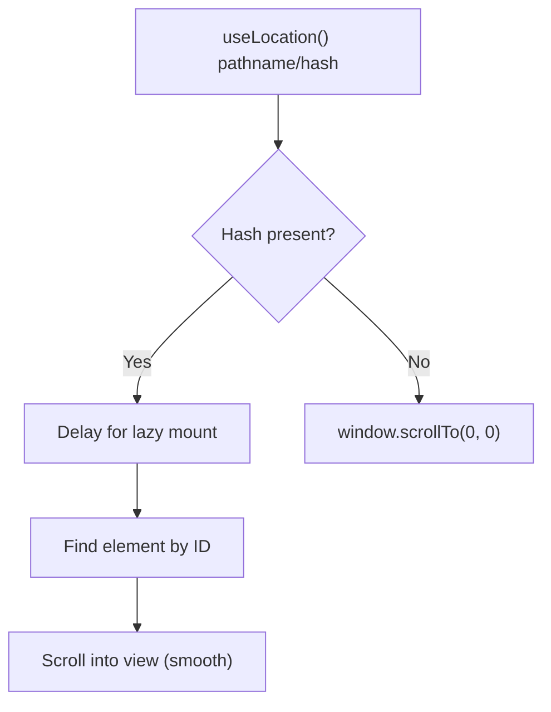

**Diagram sources**
- [src/App.jsx](file://src/App.jsx#L51-L72)

**Section sources**
- [src/App.jsx](file://src/App.jsx#L51-L72)

### Lazy Loading and Suspense Fallbacks
- All major page components are lazy-loaded with Suspense wrapping.
- Skeleton loaders provide immediate feedback during component hydration.
- HomePage composes multiple lazy components and applies a page-level transition.

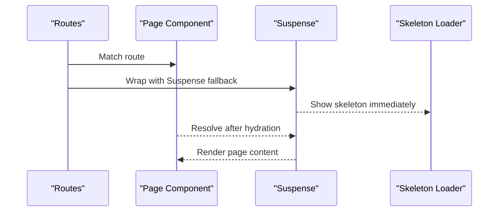

**Diagram sources**
- [src/App.jsx](file://src/App.jsx#L18-L36)
- [src/App.jsx](file://src/App.jsx#L180-L290)
- [src/pages/HomePage.jsx](file://src/pages/HomePage.jsx#L12-L23)

**Section sources**
- [src/App.jsx](file://src/App.jsx#L18-L36)
- [src/App.jsx](file://src/App.jsx#L180-L290)
- [src/pages/HomePage.jsx](file://src/pages/HomePage.jsx#L12-L23)

### Animation Transitions with Framer Motion
- AnimatePresence with mode="wait" coordinates page exits and entries.
- Page-level motion wrappers provide fade transitions.
- Progress indicator tracks scroll progress using useScroll/useSpring.
- Navbar underline and mobile overlays use motion for interactive feedback.

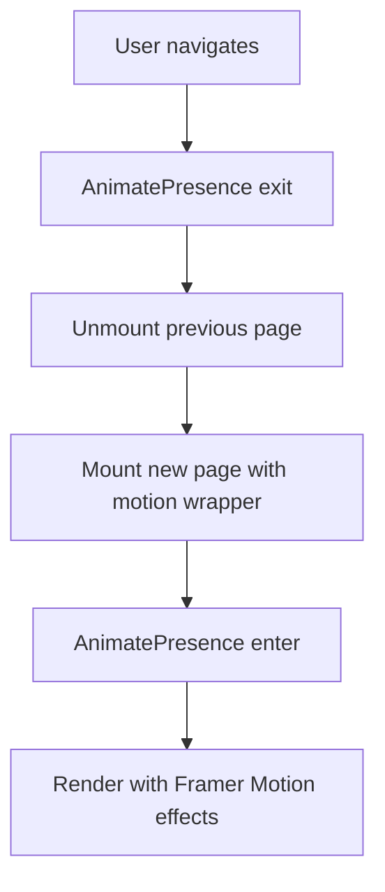

**Diagram sources**
- [src/App.jsx](file://src/App.jsx#L179-L291)
- [src/components/Navbar.jsx](file://src/components/Navbar.jsx#L129-L135)

**Section sources**
- [src/App.jsx](file://src/App.jsx#L179-L291)
- [src/components/Navbar.jsx](file://src/components/Navbar.jsx#L129-L135)

### Internationalization-Aware Routing and Language Synchronization
- i18n initialized with language detection and storage.
- App.jsx synchronizes URL prefix with i18n language and updates document direction/attributes.
- Navbar builds language-aware links and toggles between English and Arabic paths.

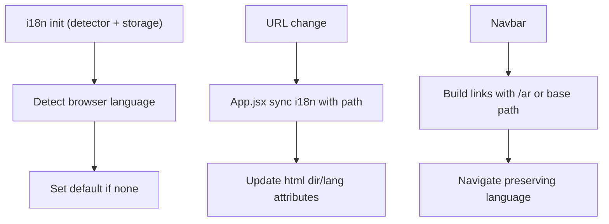

**Diagram sources**
- [src/i18n.js](file://src/i18n.js#L1-L45)
- [src/App.jsx](file://src/App.jsx#L118-L143)
- [src/components/Navbar.jsx](file://src/components/Navbar.jsx#L39-L57)

**Section sources**
- [src/i18n.js](file://src/i18n.js#L1-L45)
- [src/App.jsx](file://src/App.jsx#L118-L143)
- [src/components/Navbar.jsx](file://src/components/Navbar.jsx#L39-L57)

### Active Link Highlighting and Accessibility
- Navbar computes active state based on current path, supporting both base and Arabic routes.
- Uses aria-current for screen readers.
- Mobile overlay and desktop links reflect active state with visual cues.

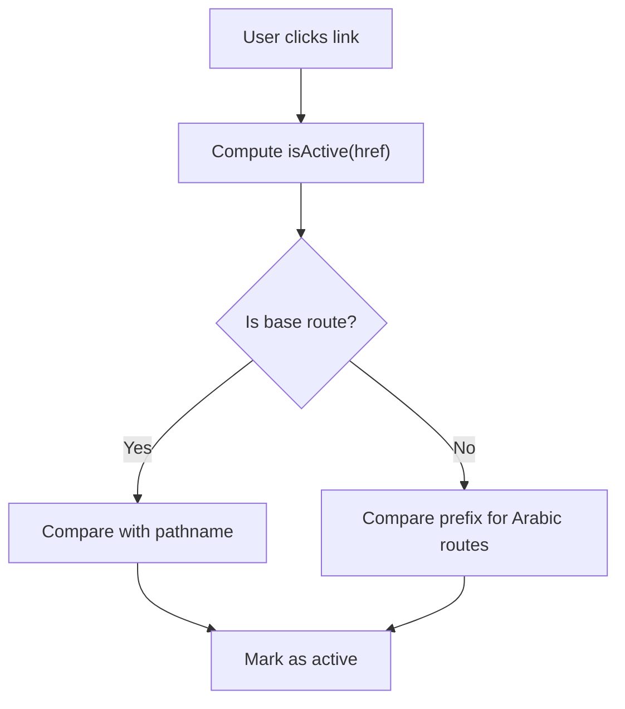

**Diagram sources**
- [src/components/Navbar.jsx](file://src/components/Navbar.jsx#L66-L71)

**Section sources**
- [src/components/Navbar.jsx](file://src/components/Navbar.jsx#L66-L71)

### SEO, Breadcrumbs, and Structured Data
- SEO component injects metadata and JSON-LD based on current path and language.
- BreadcrumbList is generated dynamically from path segments.
- MetaConfig centralizes metadata and validates required fields.

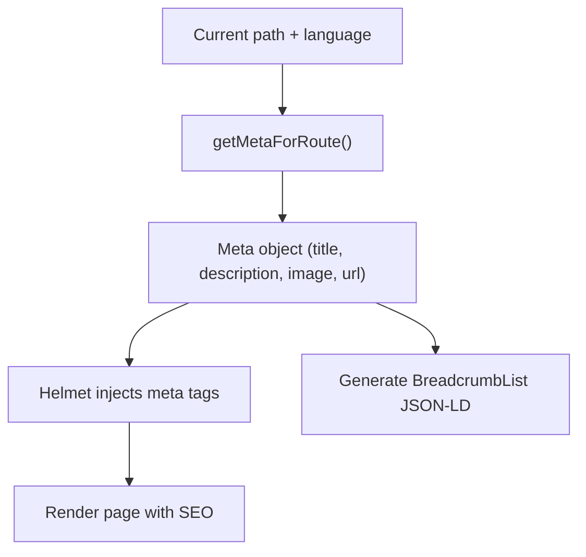

**Diagram sources**
- [src/components/SEO.jsx](file://src/components/SEO.jsx#L7-L274)
- [src/utils/MetaConfig.js](file://src/utils/MetaConfig.js#L250-L295)

**Section sources**
- [src/components/SEO.jsx](file://src/components/SEO.jsx#L7-L274)
- [src/utils/MetaConfig.js](file://src/utils/MetaConfig.js#L19-L180)
- [src/utils/MetaConfig.js](file://src/utils/MetaConfig.js#L250-L295)

### Error Handling and Fallback Mechanisms
- ErrorBoundary catches uncaught errors and renders a friendly error UI with reload action.
- NotFound page provides bilingual messaging and navigation back to home.
- Catch-all route ensures invalid paths render a branded 404.

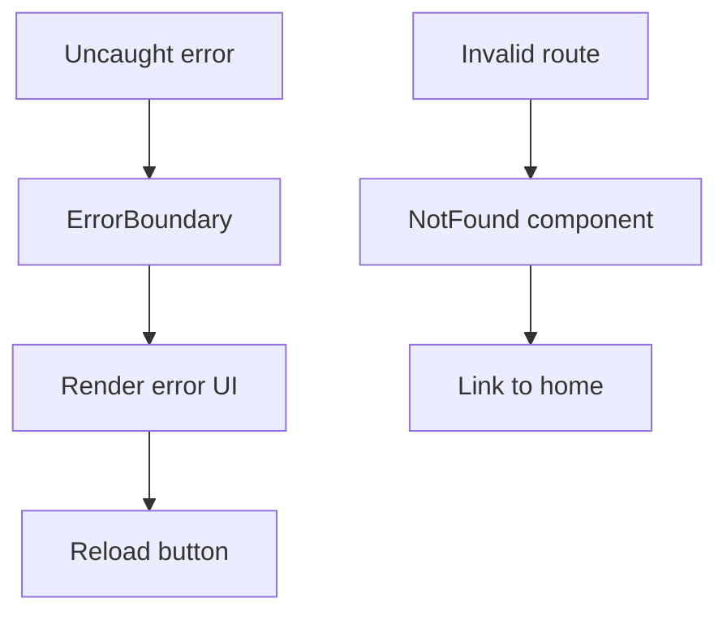

**Diagram sources**
- [src/components/ErrorBoundary.jsx](file://src/components/ErrorBoundary.jsx#L4-L56)
- [src/pages/NotFound.jsx](file://src/pages/NotFound.jsx#L18-L152)
- [src/App.jsx](file://src/App.jsx#L284-L290)

**Section sources**
- [src/components/ErrorBoundary.jsx](file://src/components/ErrorBoundary.jsx#L4-L56)
- [src/pages/NotFound.jsx](file://src/pages/NotFound.jsx#L18-L152)
- [src/App.jsx](file://src/App.jsx#L284-L290)

### Route Parameter Handling and Navigation State
- Dynamic blog post links are constructed from slugs and language context.
- Legal pages accept a type prop to render privacy or terms content.
- Scroll spy in LegalPage highlights active section during navigation.

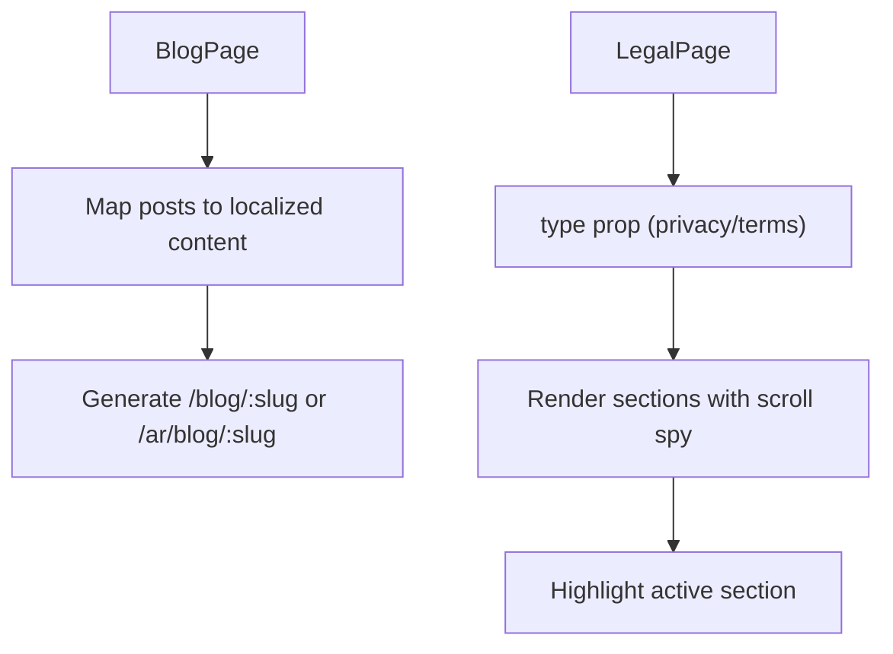

**Diagram sources**
- [src/pages/BlogPage.jsx](file://src/pages/BlogPage.jsx#L33-L77)
- [src/pages/LegalPage.jsx](file://src/pages/LegalPage.jsx#L8-L56)

**Section sources**
- [src/pages/BlogPage.jsx](file://src/pages/BlogPage.jsx#L33-L77)
- [src/pages/LegalPage.jsx](file://src/pages/LegalPage.jsx#L8-L56)

### Navigation Patterns and UX Enhancements
- Desktop and mobile navigation with animated overlays and language switching.
- Sticky header with theme toggle and language selector.
- Global share button and install prompt integrated conditionally.

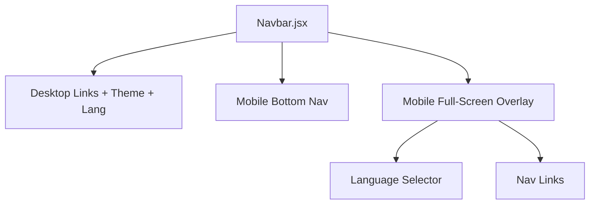

**Diagram sources**
- [src/components/Navbar.jsx](file://src/components/Navbar.jsx#L73-L332)

**Section sources**
- [src/components/Navbar.jsx](file://src/components/Navbar.jsx#L73-L332)

## Dependency Analysis
The routing system exhibits low coupling between pages and high cohesion within shared components:
- App.jsx depends on Router, Routes, Route, ScrollToTop, ErrorBoundary, and ThemeProvider.
- Pages depend on SEO and lazy-loaded components.
- Navbar depends on i18n, location, and navigate for language-aware navigation.
- SEO depends on MetaConfig for metadata and generates structured data.

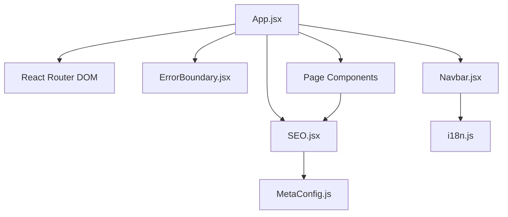

**Diagram sources**
- [src/App.jsx](file://src/App.jsx#L336-L340)
- [src/components/SEO.jsx](file://src/components/SEO.jsx#L1-L278)
- [src/components/ErrorBoundary.jsx](file://src/components/ErrorBoundary.jsx#L1-L57)
- [src/components/Navbar.jsx](file://src/components/Navbar.jsx#L1-L337)
- [src/i18n.js](file://src/i18n.js#L1-L45)
- [src/utils/MetaConfig.js](file://src/utils/MetaConfig.js#L1-L530)

**Section sources**
- [src/App.jsx](file://src/App.jsx#L336-L340)
- [src/components/SEO.jsx](file://src/components/SEO.jsx#L1-L278)
- [src/components/ErrorBoundary.jsx](file://src/components/ErrorBoundary.jsx#L1-L57)
- [src/components/Navbar.jsx](file://src/components/Navbar.jsx#L1-L337)
- [src/i18n.js](file://src/i18n.js#L1-L45)
- [src/utils/MetaConfig.js](file://src/utils/MetaConfig.js#L1-L530)

## Performance Considerations
- Lazy loading reduces initial bundle size; ensure critical routes preload minimal chunks.
- Skeleton loaders improve perceived performance during hydration.
- AnimatePresence with mode="wait" prevents layout thrashing during transitions.
- Avoid unnecessary re-renders by memoizing computed values (e.g., isArabic in NotFound).
- Keep metadata centralized to minimize repeated computations.

## Troubleshooting Guide
- 404 pages: Verify catch-all route and ensure Suspense fallback is rendered.
- Language switching: Confirm App.jsx synchronization and Navbar path building logic.
- Scroll issues: Ensure ScrollToTop runs after lazy content mounts; adjust delay if needed.
- SEO metadata: Validate MetaConfig entries and confirm SEO component injection.
- Error boundaries: Check ErrorBoundary state updates and console logs for uncaught errors.

**Section sources**
- [src/pages/NotFound.jsx](file://src/pages/NotFound.jsx#L18-L152)
- [src/App.jsx](file://src/App.jsx#L118-L143)
- [src/components/Navbar.jsx](file://src/components/Navbar.jsx#L39-L57)
- [src/components/SEO.jsx](file://src/components/SEO.jsx#L30-L44)
- [src/components/ErrorBoundary.jsx](file://src/components/ErrorBoundary.jsx#L14-L20)

## Conclusion
The routing and navigation system combines React Router DOM, i18n, Framer Motion, and centralized SEO to deliver a fast, accessible, and multilingual SPA. Routes are explicit and internationalized, transitions are smooth, and error handling is robust. The architecture supports scalability and maintainability through shared components and centralized metadata.