# State Management

<cite>
**Referenced Files in This Document**
- [ThemeContext.jsx](file://src/context/ThemeContext.jsx)
- [App.jsx](file://src/App.jsx)
- [main.jsx](file://src/main.jsx)
- [ThemeToggle.jsx](file://src/components/ThemeToggle.jsx)
- [Navbar.jsx](file://src/components/Navbar.jsx)
- [Contact.jsx](file://src/components/Contact.jsx)
- [ErrorBoundary.jsx](file://src/components/ErrorBoundary.jsx)
- [InstallPrompt.jsx](file://src/components/InstallPrompt.jsx)
- [OfflineToast.jsx](file://src/components/OfflineToast.jsx)
- [useMetadata.js](file://src/hooks/useMetadata.js)
</cite>

## Table of Contents
1. [Introduction](#introduction)
2. [Project Structure](#project-structure)
3. [Core Components](#core-components)
4. [Architecture Overview](#architecture-overview)
5. [Detailed Component Analysis](#detailed-component-analysis)
6. [Dependency Analysis](#dependency-analysis)
7. [Performance Considerations](#performance-considerations)
8. [Troubleshooting Guide](#troubleshooting-guide)
9. [Conclusion](#conclusion)

## Introduction
This document explains the state management patterns used across the application, focusing on:
- ThemeProvider implementation and theme switching logic with dark/light mode persistence
- Global state via React hooks and context providers
- Component state management, including form state handling
- Application-wide state coordination (language, offline status, service worker updates)
- Persistence strategies (localStorage, browser APIs), state hydration on initialization
- Optimization techniques, performance considerations, and debugging approaches for complex state scenarios

## Project Structure
The application initializes the React root and wraps the entire app in providers that manage global state and cross-cutting concerns. Providers include ThemeProvider, ErrorBoundary, and HelmetProvider. The ThemeProvider is the central orchestrator for theme state and persistence.

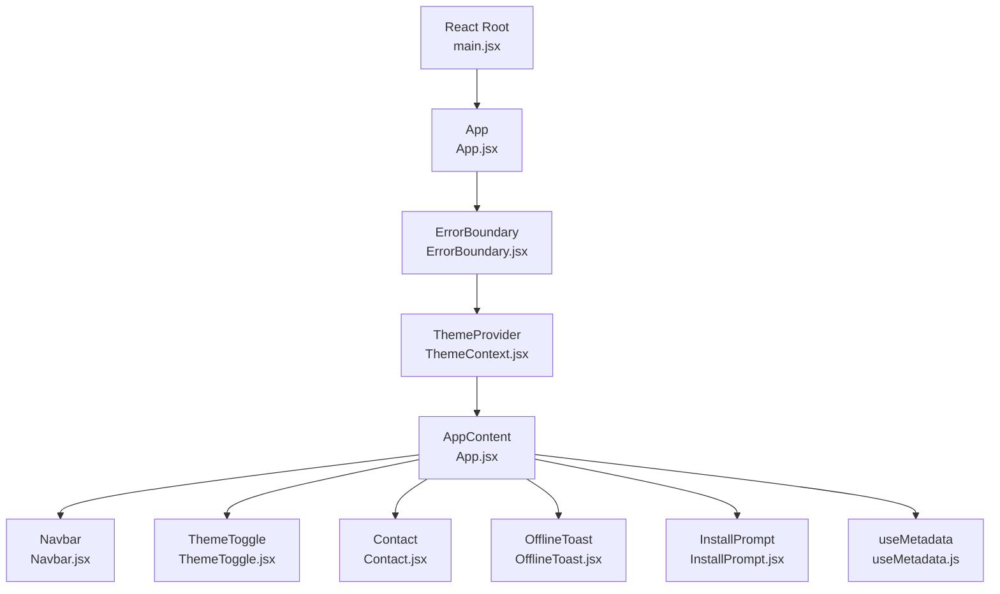

**Diagram sources**
- [main.jsx](file://src/main.jsx#L1-L12)
- [App.jsx](file://src/App.jsx#L311-L345)
- [ThemeContext.jsx](file://src/context/ThemeContext.jsx#L5-L37)
- [Navbar.jsx](file://src/components/Navbar.jsx#L1-L337)
- [ThemeToggle.jsx](file://src/components/ThemeToggle.jsx#L1-L51)
- [Contact.jsx](file://src/components/Contact.jsx#L1-L359)
- [OfflineToast.jsx](file://src/components/OfflineToast.jsx#L1-L47)
- [InstallPrompt.jsx](file://src/components/InstallPrompt.jsx#L1-L104)
- [useMetadata.js](file://src/hooks/useMetadata.js#L1-L117)

**Section sources**
- [main.jsx](file://src/main.jsx#L1-L12)
- [App.jsx](file://src/App.jsx#L311-L345)

## Core Components
- ThemeProvider: Manages theme state, persists to localStorage, and applies DOM class toggles for Tailwind dark mode. Exposes a toggle function and current theme to consumers.
- ThemeToggle: A presentational component that reads theme state and triggers theme switching.
- Navbar: Uses theme state and exposes a theme toggle button; also manages mobile menu and language switching state.
- Contact: Demonstrates controlled form state with validation, submission, loading, and success/error feedback.
- OfflineToast: Tracks and displays offline status using browser online/offline events.
- InstallPrompt: Handles the beforeinstallprompt lifecycle to defer and trigger PWA installation prompts.
- useMetadata: Provides utilities for metadata management and localization-aware defaults.

**Section sources**
- [ThemeContext.jsx](file://src/context/ThemeContext.jsx#L5-L45)
- [ThemeToggle.jsx](file://src/components/ThemeToggle.jsx#L6-L47)
- [Navbar.jsx](file://src/components/Navbar.jsx#L9-L17)
- [Contact.jsx](file://src/components/Contact.jsx#L21-L90)
- [OfflineToast.jsx](file://src/components/OfflineToast.jsx#L6-L21)
- [InstallPrompt.jsx](file://src/components/InstallPrompt.jsx#L5-L30)
- [useMetadata.js](file://src/hooks/useMetadata.js#L43-L114)

## Architecture Overview
The state architecture centers on a single provider (ThemeProvider) that encapsulates theme state and persistence. Other components rely on React hooks and context to consume and modify state. Global application state is coordinated through:
- Theme state (theme, toggleTheme)
- Language synchronization (detected from URL and applied to i18n and document attributes)
- Offline status (observed via browser events)
- Service worker update availability (via virtual:pwa-register/react)
- PWA install prompt lifecycle (beforeinstallprompt)

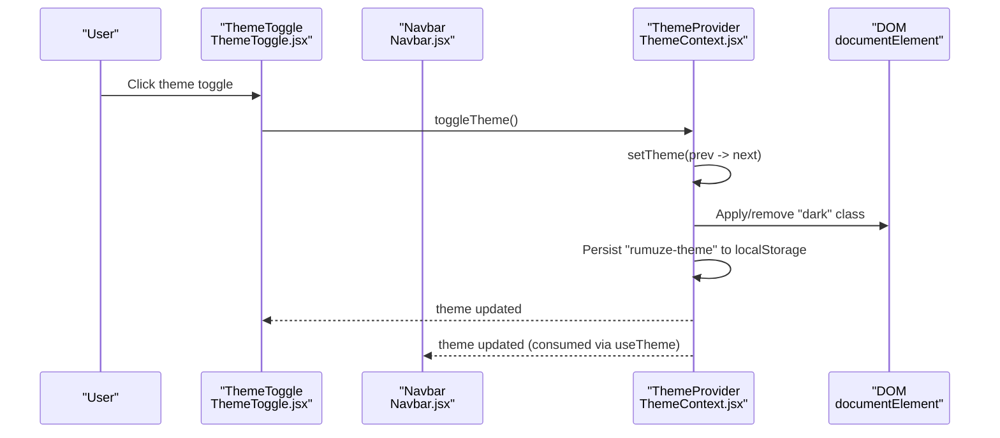

**Diagram sources**
- [ThemeToggle.jsx](file://src/components/ThemeToggle.jsx#L10-L13)
- [ThemeContext.jsx](file://src/context/ThemeContext.jsx#L28-L30)
- [ThemeContext.jsx](file://src/context/ThemeContext.jsx#L18-L26)
- [Navbar.jsx](file://src/components/Navbar.jsx#L14-L14)

## Detailed Component Analysis

### ThemeProvider and ThemeToggling
- Initialization: Reads "rumuze-theme" from localStorage; falls back to system preference using matchMedia.
- Persistence: On theme change, writes to localStorage and toggles the "dark" class on the root element for Tailwind dark mode.
- Consumption: Exposes theme and toggleTheme via context; useTheme hook validates provider presence.

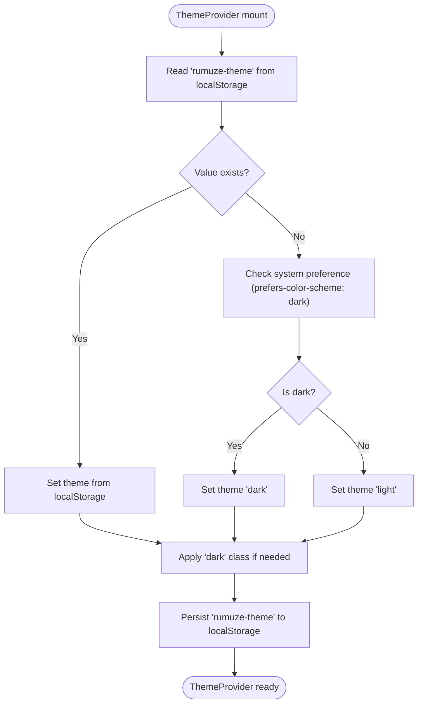

**Diagram sources**
- [ThemeContext.jsx](file://src/context/ThemeContext.jsx#L6-L16)
- [ThemeContext.jsx](file://src/context/ThemeContext.jsx#L18-L26)
- [ThemeContext.jsx](file://src/context/ThemeContext.jsx#L28-L30)

**Section sources**
- [ThemeContext.jsx](file://src/context/ThemeContext.jsx#L5-L45)

### ThemeToggle Component
- Consumes theme and toggleTheme from ThemeProvider via useTheme.
- Renders animated icons based on current theme and triggers toggle on click.

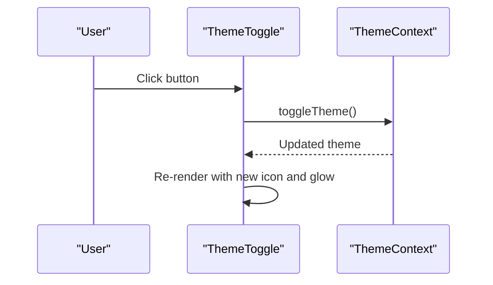

**Diagram sources**
- [ThemeToggle.jsx](file://src/components/ThemeToggle.jsx#L6-L47)
- [ThemeContext.jsx](file://src/context/ThemeContext.jsx#L39-L45)

**Section sources**
- [ThemeToggle.jsx](file://src/components/ThemeToggle.jsx#L6-L47)

### Navbar State Coordination
- Local state: isOpen (mobile menu), scrolled (scroll effect), showLangMenu (language dropdown).
- Theme state: theme and toggleTheme from ThemeProvider.
- Language switching: Computes target language from current path, navigates to canonical path, and relies on App.jsx to synchronize i18n and document attributes.

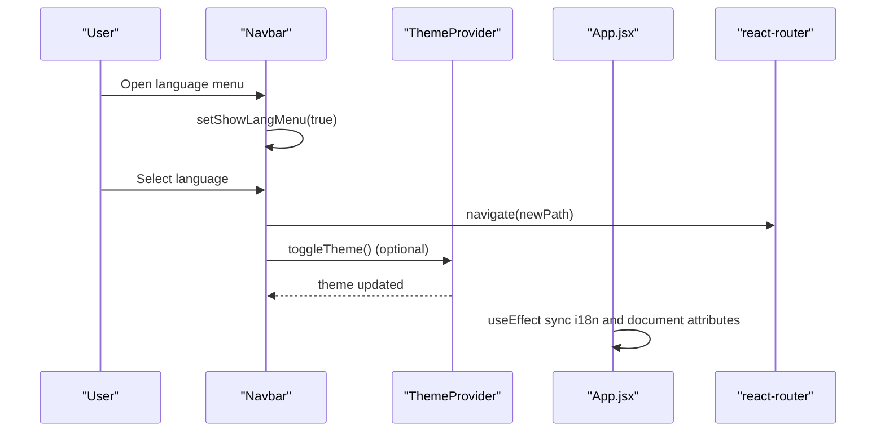

**Diagram sources**
- [Navbar.jsx](file://src/components/Navbar.jsx#L10-L28)
- [Navbar.jsx](file://src/components/Navbar.jsx#L39-L57)
- [App.jsx](file://src/App.jsx#L119-L143)
- [ThemeContext.jsx](file://src/context/ThemeContext.jsx#L39-L45)

**Section sources**
- [Navbar.jsx](file://src/components/Navbar.jsx#L9-L17)
- [App.jsx](file://src/App.jsx#L119-L143)

### Contact Form State Handling
- Controlled form state: formData object tracks all inputs; errors tracks validation failures; loading indicates submission progress; success controls success overlay visibility.
- Validation: Runs on submit; clears per-field errors on input change.
- Submission: Posts to /api/contact, resets form on success, auto-hides success message.

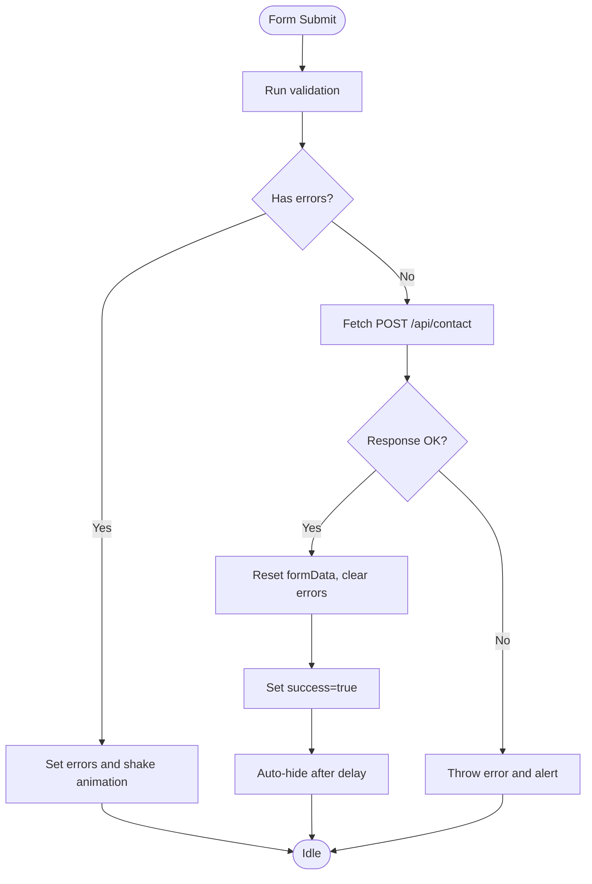

**Diagram sources**
- [Contact.jsx](file://src/components/Contact.jsx#L33-L42)
- [Contact.jsx](file://src/components/Contact.jsx#L44-L82)
- [Contact.jsx](file://src/components/Contact.jsx#L84-L90)

**Section sources**
- [Contact.jsx](file://src/components/Contact.jsx#L21-L90)

### Offline Status and Toast
- Tracks online/offline state via window events.
- Displays a persistent toast with animated indicator when offline.

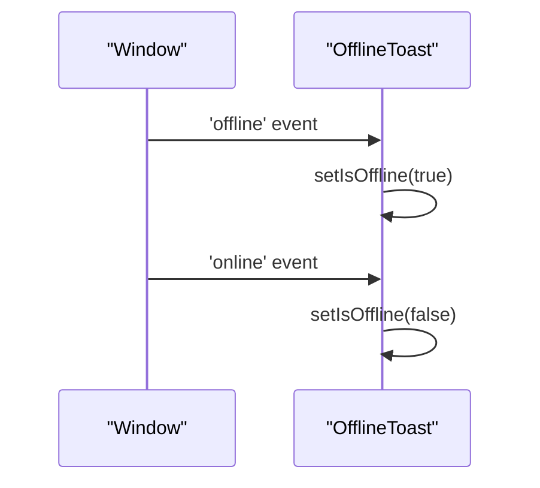

**Diagram sources**
- [OfflineToast.jsx](file://src/components/OfflineToast.jsx#L10-L21)

**Section sources**
- [OfflineToast.jsx](file://src/components/OfflineToast.jsx#L6-L21)

### PWA Install Prompt Lifecycle
- Defers the native install prompt via beforeinstallprompt, stores the event, and conditionally shows a custom prompt after engagement.
- After user choice, clears the deferred prompt and hides the toast.

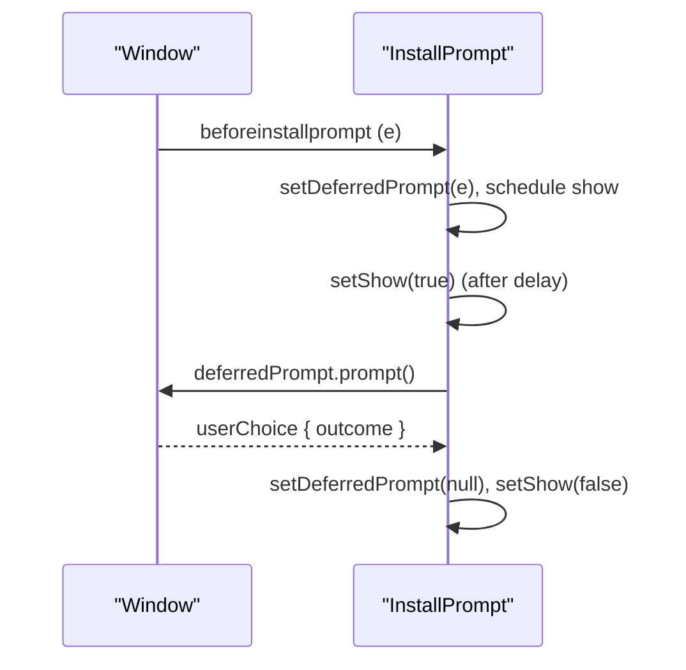

**Diagram sources**
- [InstallPrompt.jsx](file://src/components/InstallPrompt.jsx#L9-L30)
- [InstallPrompt.jsx](file://src/components/InstallPrompt.jsx#L32-L48)

**Section sources**
- [InstallPrompt.jsx](file://src/components/InstallPrompt.jsx#L5-L30)

### Error Boundary and Global Error State
- Catches uncaught errors and renders a friendly error UI with a reload action.
- Logs error and errorInfo for debugging.

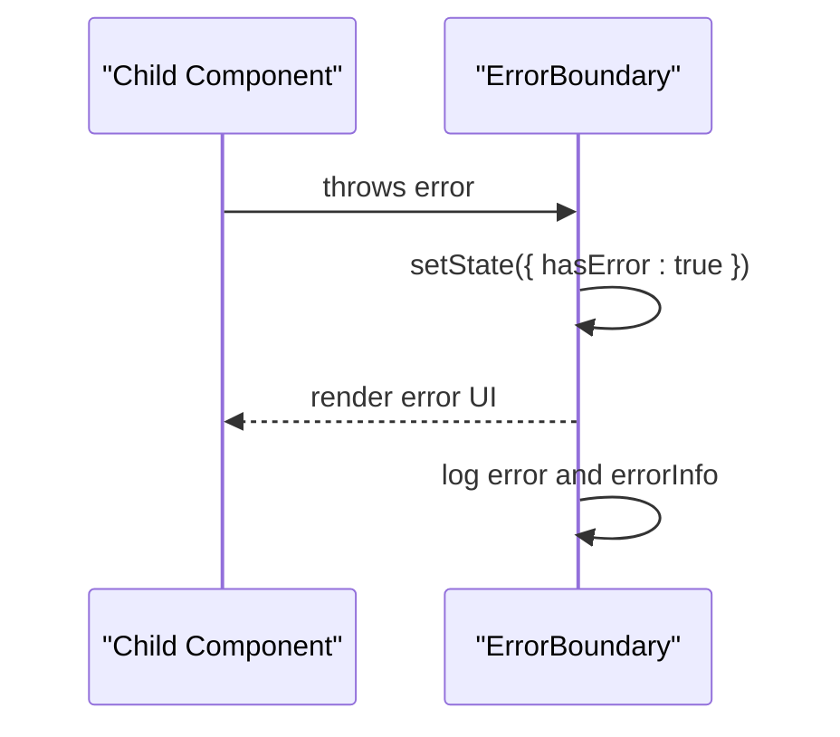

**Diagram sources**
- [ErrorBoundary.jsx](file://src/components/ErrorBoundary.jsx#L10-L20)
- [ErrorBoundary.jsx](file://src/components/ErrorBoundary.jsx#L22-L53)

**Section sources**
- [ErrorBoundary.jsx](file://src/components/ErrorBoundary.jsx#L4-L56)

### Metadata and Localization State Utilities
- useMetadata provides helpers to compute absolute URLs, default OG images, and current metadata state for SEO.
- Integrates with i18n and router location to keep metadata aligned with the current route and language.

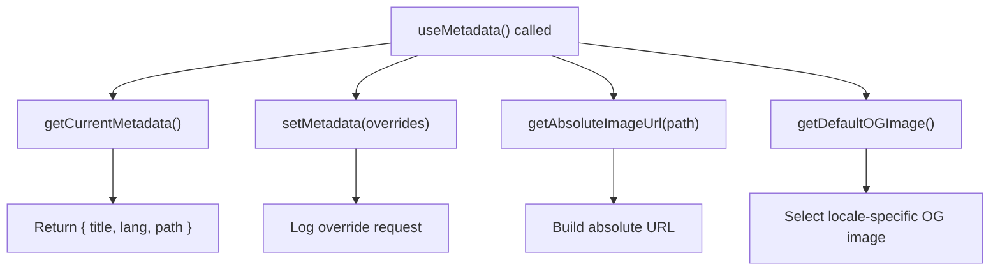

**Diagram sources**
- [useMetadata.js](file://src/hooks/useMetadata.js#L75-L81)
- [useMetadata.js](file://src/hooks/useMetadata.js#L60-L68)
- [useMetadata.js](file://src/hooks/useMetadata.js#L89-L94)
- [useMetadata.js](file://src/hooks/useMetadata.js#L101-L104)

**Section sources**
- [useMetadata.js](file://src/hooks/useMetadata.js#L43-L114)

## Dependency Analysis
- Provider hierarchy: main.jsx → App → ErrorBoundary → ThemeProvider → AppContent → Components.
- ThemeProvider is consumed by ThemeToggle and Navbar; Navbar consumes ThemeProvider indirectly via ThemeToggle.
- App.jsx coordinates language synchronization and offline status, which are separate from ThemeProvider but integrated at the app level.
- Contact form state is self-contained within the component and does not rely on shared context.

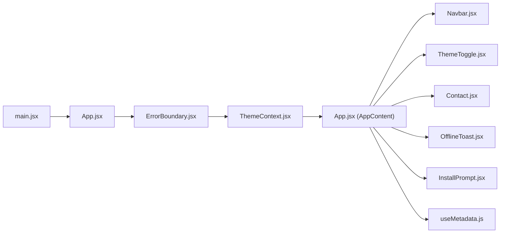

**Diagram sources**
- [main.jsx](file://src/main.jsx#L7-L11)
- [App.jsx](file://src/App.jsx#L323-L341)
- [ThemeContext.jsx](file://src/context/ThemeContext.jsx#L5-L37)
- [Navbar.jsx](file://src/components/Navbar.jsx#L1-L337)
- [ThemeToggle.jsx](file://src/components/ThemeToggle.jsx#L1-L51)
- [Contact.jsx](file://src/components/Contact.jsx#L1-L359)
- [OfflineToast.jsx](file://src/components/OfflineToast.jsx#L1-L47)
- [InstallPrompt.jsx](file://src/components/InstallPrompt.jsx#L1-L104)
- [useMetadata.js](file://src/hooks/useMetadata.js#L1-L117)

**Section sources**
- [main.jsx](file://src/main.jsx#L7-L11)
- [App.jsx](file://src/App.jsx#L323-L341)

## Performance Considerations
- Minimize re-renders:
  - Keep theme state in a dedicated provider to avoid unnecessary propagation to unrelated components.
  - Use shallow comparisons for props passed to memoized components.
- Debounce or throttle expensive listeners:
  - Scroll effects and resize handlers should be throttled if extended to more components.
- Avoid blocking the main thread:
  - Keep heavy computations out of render; defer to useEffect or Web Workers when applicable.
- Optimize animations:
  - Prefer transform and opacity for animations; avoid layout-affecting properties.
- Hydration and persistence:
  - Theme hydration occurs synchronously during provider initialization; ensure minimal work in the provider initializer to avoid blocking the first paint.
- Lazy loading and skeleton loaders:
  - The app already uses Suspense and skeleton loaders for routes, reducing perceived loading time.

[No sources needed since this section provides general guidance]

## Troubleshooting Guide
- Theme not persisting:
  - Verify localStorage key "rumuze-theme" is writable and not being cleared by browser policies.
  - Confirm the root element class toggling logic runs after theme updates.
- Theme toggle not switching:
  - Ensure ThemeToggle is rendered inside ThemeProvider.
  - Check that useTheme is not called outside the provider.
- Language not syncing:
  - Confirm App.jsx effect runs and updates documentElement dir/lang.
  - Ensure navigation uses canonical paths (/ar/* or /*) to trigger the effect.
- Offline toast not appearing:
  - Confirm online/offline listeners are attached and removed properly.
- PWA install prompt not showing:
  - Ensure beforeinstallprompt fires and deferredPrompt is stored.
  - Check that the app is not already installed (standalone mode).
- Form submission errors:
  - Inspect network tab for /api/contact responses.
  - Validate client-side errors and ensure success state resets form.
- Error boundary not catching errors:
  - Verify ErrorBoundary wraps the root App component.
  - Ensure errors are thrown synchronously within React lifecycle.

**Section sources**
- [ThemeContext.jsx](file://src/context/ThemeContext.jsx#L39-L45)
- [App.jsx](file://src/App.jsx#L119-L143)
- [OfflineToast.jsx](file://src/components/OfflineToast.jsx#L10-L21)
- [InstallPrompt.jsx](file://src/components/InstallPrompt.jsx#L9-L30)
- [Contact.jsx](file://src/components/Contact.jsx#L44-L82)
- [ErrorBoundary.jsx](file://src/components/ErrorBoundary.jsx#L10-L20)

## Conclusion
The application employs a focused, predictable state management model:
- ThemeProvider encapsulates theme state, persistence, and DOM side-effects.
- Components consume state via hooks and context, keeping logic localized and testable.
- Global coordination is achieved through app-level effects for language and offline status.
- Form state is managed locally with clear validation and feedback loops.
- Persistence leverages localStorage and browser APIs, with hydration occurring at startup.
Adhering to these patterns ensures maintainability, performance, and a consistent user experience across modes and locales.