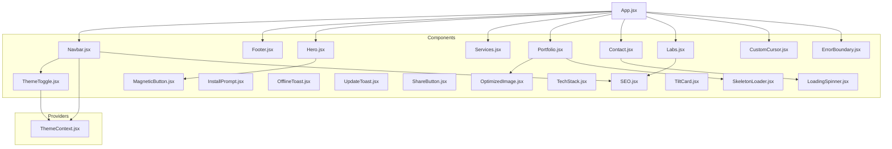
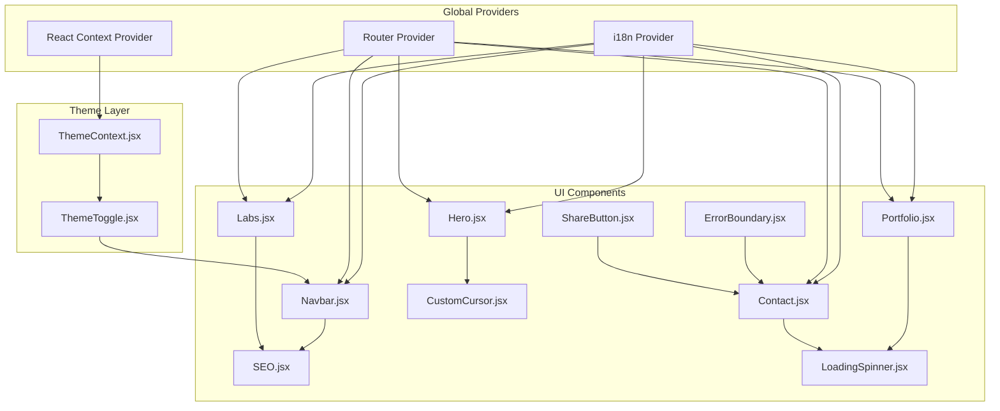
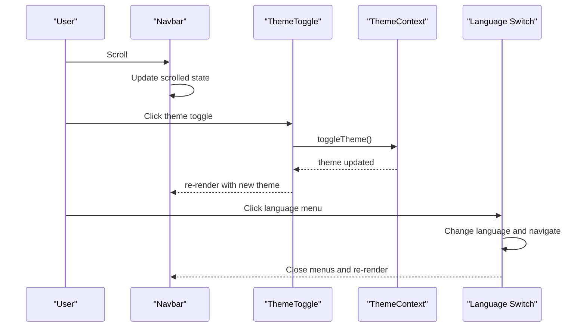
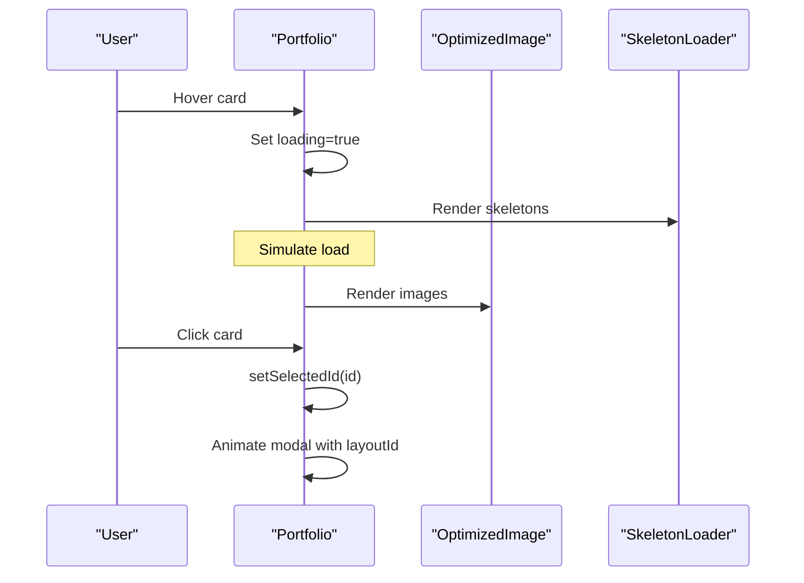
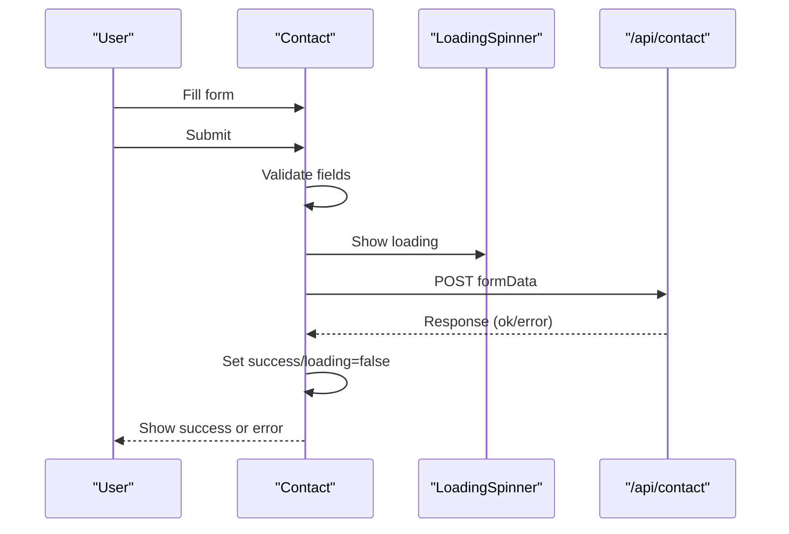
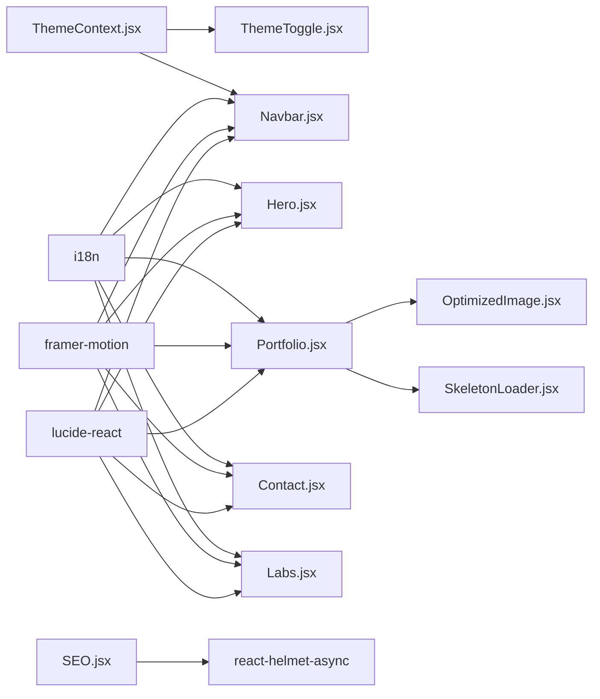

# UI Components

<cite>
**Referenced Files in This Document**
- [Navbar.jsx](file://src/components/Navbar.jsx)
- [Footer.jsx](file://src/components/Footer.jsx)
- [Hero.jsx](file://src/components/Hero.jsx)
- [Services.jsx](file://src/components/Services.jsx)
- [Portfolio.jsx](file://src/components/Portfolio.jsx)
- [Contact.jsx](file://src/components/Contact.jsx)
- [Labs.jsx](file://src/components/Labs.jsx)
- [SEO.jsx](file://src/components/SEO.jsx)
- [CustomCursor.jsx](file://src/components/CustomCursor.jsx)
- [LoadingSpinner.jsx](file://src/components/LoadingSpinner.jsx)
- [ErrorBoundary.jsx](file://src/components/ErrorBoundary.jsx)
- [ThemeToggle.jsx](file://src/components/ThemeToggle.jsx)
- [InstallPrompt.jsx](file://src/components/InstallPrompt.jsx)
- [OfflineToast.jsx](file://src/components/OfflineToast.jsx)
- [UpdateToast.jsx](file://src/components/UpdateToast.jsx)
- [ShareButton.jsx](file://src/components/ShareButton.jsx)
- [SkeletonLoader.jsx](file://src/components/SkeletonLoader.jsx)
- [TechStack.jsx](file://src/components/TechStack.jsx)
- [MagneticButton.jsx](file://src/components/MagneticButton.jsx)
- [TiltCard.jsx](file://src/components/TiltCard.jsx)
- [ThemeContext.jsx](file://src/context/ThemeContext.jsx)
- [OptimizedImage.jsx](file://src/components/OptimizedImage.jsx)
- [App.jsx](file://src/App.jsx)
</cite>

## Table of Contents
1. [Introduction](#introduction)
2. [Project Structure](#project-structure)
3. [Core Components](#core-components)
4. [Architecture Overview](#architecture-overview)
5. [Detailed Component Analysis](#detailed-component-analysis)
6. [Dependency Analysis](#dependency-analysis)
7. [Performance Considerations](#performance-considerations)
8. [Troubleshooting Guide](#troubleshooting-guide)
9. [Conclusion](#conclusion)
10. [Appendices](#appendices)

## Introduction
This document provides comprehensive documentation for all reusable UI components in the landing page project. It explains component architecture, props interfaces, styling patterns, and usage examples for each component. It also covers composition patterns, state management, event handling, integration with global providers, responsive design, accessibility, performance optimization, customization options, theming support, and best practices.

## Project Structure
Reusable UI components live under src/components and are composed within pages and layouts. Global theming is provided by ThemeContext.jsx. Many components integrate with translation (useTranslation), routing (react-router-dom), animations (framer-motion), icons (lucide-react), and SEO (react-helmet-async).

**Diagram sources**
- [Navbar.jsx](file://src/components/Navbar.jsx#L1-L337)
- [Footer.jsx](file://src/components/Footer.jsx#L1-L80)
- [Hero.jsx](file://src/components/Hero.jsx#L1-L165)
- [Services.jsx](file://src/components/Services.jsx#L1-L88)
- [Portfolio.jsx](file://src/components/Portfolio.jsx#L1-L160)
- [Contact.jsx](file://src/components/Contact.jsx#L1-L359)
- [Labs.jsx](file://src/components/Labs.jsx#L1-L277)
- [SEO.jsx](file://src/components/SEO.jsx#L1-L278)
- [CustomCursor.jsx](file://src/components/CustomCursor.jsx#L1-L91)
- [LoadingSpinner.jsx](file://src/components/LoadingSpinner.jsx#L1-L94)
- [ErrorBoundary.jsx](file://src/components/ErrorBoundary.jsx#L1-L57)
- [ThemeToggle.jsx](file://src/components/ThemeToggle.jsx#L1-L51)
- [InstallPrompt.jsx](file://src/components/InstallPrompt.jsx#L1-L104)
- [OfflineToast.jsx](file://src/components/OfflineToast.jsx#L1-L47)
- [UpdateToast.jsx](file://src/components/UpdateToast.jsx#L1-L47)
- [ShareButton.jsx](file://src/components/ShareButton.jsx#L1-L106)
- [SkeletonLoader.jsx](file://src/components/SkeletonLoader.jsx)
- [TechStack.jsx](file://src/components/TechStack.jsx)
- [MagneticButton.jsx](file://src/components/MagneticButton.jsx)
- [TiltCard.jsx](file://src/components/TiltCard.jsx)
- [OptimizedImage.jsx](file://src/components/OptimizedImage.jsx)
- [ThemeContext.jsx](file://src/context/ThemeContext.jsx)
- [App.jsx](file://src/App.jsx)

**Section sources**
- [App.jsx](file://src/App.jsx)

## Core Components
- Navbar: Responsive navigation with desktop and mobile overlays, language switching, theme toggle, and scroll-aware styling.
- Footer: Multi-column footer with links, social profiles, and legal links.
- Hero: Animated hero section with gradient backgrounds, animated code display, and magnetic CTA.
- Services: Service categories with icons and items, rendered with scroll-triggered animations.
- Portfolio: Project showcase with image cards, skeleton loaders, and modal detail view.
- Contact: Contact form with validation, submission flow, success overlay, and loading spinner.
- Labs: Labs landing with animated terminal log, project cards, and SEO integration.
- SEO: Centralized SEO metadata and structured data injection via react-helmet-async and JSON-LD.
- CustomCursor: Smooth animated mouse cursor with hover detection and spring physics.
- LoadingSpinner: Animated loader with rotating rings and progress messages.
- ErrorBoundary: Class-based error boundary with friendly fallback UI.
- ThemeToggle: Animated theme switcher integrated with ThemeContext.
- InstallPrompt: Progressive Web App install prompt with beforeinstallprompt handling.
- OfflineToast: Network status toast using online/offline events.
- UpdateToast: Update notification with action handlers.
- ShareButton: Cross-platform sharing via Web Share API or fallback popover.
- SkeletonLoader: Skeleton placeholders for content areas.
- TechStack: Technology stack display component.
- MagneticButton: Interactive button with magnetic drag effect.
- TiltCard: Interactive card with tilt and hover effects.

**Section sources**
- [Navbar.jsx](file://src/components/Navbar.jsx#L1-L337)
- [Footer.jsx](file://src/components/Footer.jsx#L1-L80)
- [Hero.jsx](file://src/components/Hero.jsx#L1-L165)
- [Services.jsx](file://src/components/Services.jsx#L1-L88)
- [Portfolio.jsx](file://src/components/Portfolio.jsx#L1-L160)
- [Contact.jsx](file://src/components/Contact.jsx#L1-L359)
- [Labs.jsx](file://src/components/Labs.jsx#L1-L277)
- [SEO.jsx](file://src/components/SEO.jsx#L1-L278)
- [CustomCursor.jsx](file://src/components/CustomCursor.jsx#L1-L91)
- [LoadingSpinner.jsx](file://src/components/LoadingSpinner.jsx#L1-L94)
- [ErrorBoundary.jsx](file://src/components/ErrorBoundary.jsx#L1-L57)
- [ThemeToggle.jsx](file://src/components/ThemeToggle.jsx#L1-L51)
- [InstallPrompt.jsx](file://src/components/InstallPrompt.jsx#L1-L104)
- [OfflineToast.jsx](file://src/components/OfflineToast.jsx#L1-L47)
- [UpdateToast.jsx](file://src/components/UpdateToast.jsx#L1-L47)
- [ShareButton.jsx](file://src/components/ShareButton.jsx#L1-L106)
- [SkeletonLoader.jsx](file://src/components/SkeletonLoader.jsx)
- [TechStack.jsx](file://src/components/TechStack.jsx)
- [MagneticButton.jsx](file://src/components/MagneticButton.jsx)
- [TiltCard.jsx](file://src/components/TiltCard.jsx)

## Architecture Overview
The UI layer relies on:
- Global theming via ThemeContext (theme state, toggle function).
- Translation via react-i18next (useTranslation).
- Routing via react-router-dom (useLocation, useNavigate).
- Animations via framer-motion (motion, AnimatePresence, useSpring, useMotionValue).
- Icons via lucide-react.
- SEO via react-helmet-async and centralized metadata utilities.

**Diagram sources**
- [ThemeContext.jsx](file://src/context/ThemeContext.jsx)
- [ThemeToggle.jsx](file://src/components/ThemeToggle.jsx#L1-L51)
- [Navbar.jsx](file://src/components/Navbar.jsx#L1-L337)
- [Hero.jsx](file://src/components/Hero.jsx#L1-L165)
- [Portfolio.jsx](file://src/components/Portfolio.jsx#L1-L160)
- [Contact.jsx](file://src/components/Contact.jsx#L1-L359)
- [Labs.jsx](file://src/components/Labs.jsx#L1-L277)
- [SEO.jsx](file://src/components/SEO.jsx#L1-L278)
- [CustomCursor.jsx](file://src/components/CustomCursor.jsx#L1-L91)
- [LoadingSpinner.jsx](file://src/components/LoadingSpinner.jsx#L1-L94)
- [ErrorBoundary.jsx](file://src/components/ErrorBoundary.jsx#L1-L57)
- [ShareButton.jsx](file://src/components/ShareButton.jsx#L1-L106)

## Detailed Component Analysis

### Navbar
- Purpose: Primary navigation with desktop and mobile experiences, language switcher, theme toggle, and scroll-aware styling.
- Props: None.
- State: isOpen (mobile menu), scrolled (background effect), showLangMenu (language dropdown), currentLang derived from i18n.
- Events: Scroll listener for background effect; click handlers for menu toggles and language changes.
- Composition: Integrates ThemeToggle, uses Lucide icons, and leverages framer-motion for animations.
- Accessibility: Proper aria labels and roles for buttons and menus; keyboard navigable via router links.
- Theming: Uses theme-aware classes and ThemeToggle integration.

**Diagram sources**
- [Navbar.jsx](file://src/components/Navbar.jsx#L1-L337)
- [ThemeToggle.jsx](file://src/components/ThemeToggle.jsx#L1-L51)
- [ThemeContext.jsx](file://src/context/ThemeContext.jsx)

**Section sources**
- [Navbar.jsx](file://src/components/Navbar.jsx#L1-L337)
- [ThemeToggle.jsx](file://src/components/ThemeToggle.jsx#L1-L51)
- [ThemeContext.jsx](file://src/context/ThemeContext.jsx)

### Footer
- Purpose: Multi-column footer with branding, links, and social profiles.
- Props: None.
- State: None.
- Composition: Uses translation keys for dynamic content and constructs paths based on current locale.
- Accessibility: Links include aria-labels for social icons.

**Section sources**
- [Footer.jsx](file://src/components/Footer.jsx#L1-L80)

### Hero
- Purpose: Hero section with animated gradients, animated code display, and CTAs.
- Props: None.
- State: activeCodeStep for animated code lines.
- Composition: Uses MagneticButton for primary CTA; renders desktop code block and mobile animated stream.
- Animations: Framer Motion for entrance and glow effects; CSS for mesh gradients.

**Section sources**
- [Hero.jsx](file://src/components/Hero.jsx#L1-L165)
- [MagneticButton.jsx](file://src/components/MagneticButton.jsx)

### Services
- Purpose: Render service categories and items with icons and hover effects.
- Props: None.
- State: None.
- Composition: Uses scroll-triggered animations (whileInView) and localized content.

**Section sources**
- [Services.jsx](file://src/components/Services.jsx#L1-L88)

### Portfolio
- Purpose: Project showcase with image cards, skeleton loaders, and modal detail view.
- Props: None.
- State: selectedId (modal), loading (skeleton).
- Composition: Uses OptimizedImage and SkeletonLoader; implements layout animations with AnimatePresence.

**Diagram sources**
- [Portfolio.jsx](file://src/components/Portfolio.jsx#L1-L160)
- [OptimizedImage.jsx](file://src/components/OptimizedImage.jsx)
- [SkeletonLoader.jsx](file://src/components/SkeletonLoader.jsx)

**Section sources**
- [Portfolio.jsx](file://src/components/Portfolio.jsx#L1-L160)

### Contact
- Purpose: Contact form with validation, submission, and success feedback.
- Props: None.
- State: formData, errors, loading, success.
- Composition: Integrates LoadingSpinner; uses fetch to submit to /api/contact; handles success and error states.

**Diagram sources**
- [Contact.jsx](file://src/components/Contact.jsx#L1-L359)
- [LoadingSpinner.jsx](file://src/components/LoadingSpinner.jsx#L1-L94)

**Section sources**
- [Contact.jsx](file://src/components/Contact.jsx#L1-L359)

### Labs
- Purpose: Labs landing with animated terminal log and project cards.
- Props: None.
- State: TerminalBlock manages log lines; Labs manages layout and grid.
- Composition: Uses SEO component; integrates scroll-triggered animations.

**Section sources**
- [Labs.jsx](file://src/components/Labs.jsx#L1-L277)
- [SEO.jsx](file://src/components/SEO.jsx#L1-L278)

### SEO
- Purpose: Centralized SEO metadata and structured data injection.
- Props: title, description, image, type, path (optional overrides).
- State: None.
- Composition: Builds JSON-LD schemas (Organization, Service, FAQPage, Breadcrumbs, WebPage); injects via react-helmet-async and fallback DOM updates.

**Section sources**
- [SEO.jsx](file://src/components/SEO.jsx#L1-L278)

### CustomCursor
- Purpose: Animated custom cursor with spring physics and hover detection.
- Props: None.
- State: isHovered, cursorX/cursorY motion values.
- Composition: Uses useMotionValue and useSpring; only activates on fine pointer devices.

**Section sources**
- [CustomCursor.jsx](file://src/components/CustomCursor.jsx#L1-L91)

### LoadingSpinner
- Purpose: Animated loader with rotating rings and progress messages.
- Props: fullScreen (boolean).
- State: currentMessage index.
- Composition: Uses framer-motion for rings and pulsing core; supports full-screen overlay.

**Section sources**
- [LoadingSpinner.jsx](file://src/components/LoadingSpinner.jsx#L1-L94)

### ErrorBoundary
- Purpose: Class-based error boundary to gracefully handle client-side errors.
- Props: children.
- State: hasError, error, errorInfo.
- Composition: Renders friendly UI with error summary and reload action.

**Section sources**
- [ErrorBoundary.jsx](file://src/components/ErrorBoundary.jsx#L1-L57)

### ThemeToggle
- Purpose: Animated theme switcher integrated with ThemeContext.
- Props: className (optional).
- State: None.
- Composition: Uses AnimatePresence for icon transitions; triggers context toggle.

**Section sources**
- [ThemeToggle.jsx](file://src/components/ThemeToggle.jsx#L1-L51)
- [ThemeContext.jsx](file://src/context/ThemeContext.jsx)

### InstallPrompt
- Purpose: Progressive Web App install prompt using beforeinstallprompt.
- Props: None.
- State: deferredPrompt, show.
- Composition: Defers prompt, delays display, and handles user choice.

**Section sources**
- [InstallPrompt.jsx](file://src/components/InstallPrompt.jsx#L1-L104)

### OfflineToast
- Purpose: Network status toast using online/offline events.
- Props: None.
- State: isOffline.
- Composition: Uses AnimatePresence for enter/exit animations.

**Section sources**
- [OfflineToast.jsx](file://src/components/OfflineToast.jsx#L1-L47)

### UpdateToast
- Purpose: Update notification with action handlers.
- Props: show, onUpdate, onClose.
- State: None.
- Composition: Uses AnimatePresence and framer-motion for animations.

**Section sources**
- [UpdateToast.jsx](file://src/components/UpdateToast.jsx#L1-L47)

### ShareButton
- Purpose: Cross-platform sharing via Web Share API or fallback popover.
- Props: title, url (optional overrides).
- State: isOpen (popover), copied (clipboard).
- Composition: Uses navigator.share and clipboard API; opens external share URLs.

**Section sources**
- [ShareButton.jsx](file://src/components/ShareButton.jsx#L1-L106)

### SkeletonLoader
- Purpose: Skeleton placeholders for content areas.
- Props: None.
- State: None.
- Composition: Used by Portfolio during loading phase.

**Section sources**
- [SkeletonLoader.jsx](file://src/components/SkeletonLoader.jsx)

### TechStack
- Purpose: Technology stack display component.
- Props: None.
- State: None.
- Composition: Used within Labs project cards.

**Section sources**
- [TechStack.jsx](file://src/components/TechStack.jsx)

### MagneticButton
- Purpose: Interactive button with magnetic drag effect.
- Props: None.
- State: None.
- Composition: Used by Hero and other components.

**Section sources**
- [MagneticButton.jsx](file://src/components/MagneticButton.jsx)

### TiltCard
- Purpose: Interactive card with tilt and hover effects.
- Props: None.
- State: None.
- Composition: Used within Labs project cards.

**Section sources**
- [TiltCard.jsx](file://src/components/TiltCard.jsx)

## Dependency Analysis
- ThemeContext is consumed by ThemeToggle and Navbar.
- Translation is used across most components via useTranslation.
- Framer Motion is used extensively for animations and transitions.
- Lucide icons are used across components for UI affordances.
- SEO component depends on centralized metadata utilities and react-helmet-async.
- Portfolio composes OptimizedImage and SkeletonLoader.

**Diagram sources**
- [ThemeContext.jsx](file://src/context/ThemeContext.jsx)
- [ThemeToggle.jsx](file://src/components/ThemeToggle.jsx#L1-L51)
- [Navbar.jsx](file://src/components/Navbar.jsx#L1-L337)
- [Hero.jsx](file://src/components/Hero.jsx#L1-L165)
- [Portfolio.jsx](file://src/components/Portfolio.jsx#L1-L160)
- [Contact.jsx](file://src/components/Contact.jsx#L1-L359)
- [Labs.jsx](file://src/components/Labs.jsx#L1-L277)
- [SEO.jsx](file://src/components/SEO.jsx#L1-L278)
- [OptimizedImage.jsx](file://src/components/OptimizedImage.jsx)

**Section sources**
- [ThemeContext.jsx](file://src/context/ThemeContext.jsx)
- [SEO.jsx](file://src/components/SEO.jsx#L1-L278)

## Performance Considerations
- Prefer lazy loading and skeleton placeholders for heavy content (Portfolio).
- Use OptimizedImage for responsive images with appropriate sizes and priorities.
- Minimize animation-heavy components on low-power devices; detect fine pointer devices for custom cursor.
- Debounce or throttle scroll listeners (already handled via useEffect cleanup).
- Use viewport-based animations (whileInView) to avoid unnecessary computations.
- Avoid blocking the main thread during animations; leverage useSpring and useMotionValue.
- Keep SEO metadata centralized to reduce duplication and improve caching.

## Troubleshooting Guide
- CustomCursor does not appear: Ensure device has fine pointer support; component checks pointer capabilities and hides otherwise.
- ThemeToggle not switching: Verify ThemeContext provider wraps the app and that toggleTheme is invoked.
- Contact form validation fails: Ensure required fields are present; errors are cleared on input change.
- SEO metadata missing: Confirm MetaConfig utilities return values and that react-helmet-async is rendering; fallback DOM updates occur in development.
- InstallPrompt not showing: beforeinstallprompt fires only when conditions are met; ensure app is not already installed and delay logic allows prompt.
- OfflineToast not hiding: Ensure online/offline events are firing; check network connectivity.
- UpdateToast not responding: Ensure show prop is controlled externally and that onUpdate/onClose callbacks are passed.

**Section sources**
- [CustomCursor.jsx](file://src/components/CustomCursor.jsx#L1-L91)
- [ThemeToggle.jsx](file://src/components/ThemeToggle.jsx#L1-L51)
- [Contact.jsx](file://src/components/Contact.jsx#L1-L359)
- [SEO.jsx](file://src/components/SEO.jsx#L1-L278)
- [InstallPrompt.jsx](file://src/components/InstallPrompt.jsx#L1-L104)
- [OfflineToast.jsx](file://src/components/OfflineToast.jsx#L1-L47)
- [UpdateToast.jsx](file://src/components/UpdateToast.jsx#L1-L47)

## Conclusion
The UI component library emphasizes composability, responsiveness, and accessibility. Global providers enable consistent theming and localization. Animation primitives from framer-motion enhance interactivity, while SEO and performance best practices ensure discoverability and speed. Components are designed to be reusable, customizable, and maintainable across pages.

## Appendices
- Props Reference Summary
  - Navbar: None.
  - Footer: None.
  - Hero: None.
  - Services: None.
  - Portfolio: None.
  - Contact: None.
  - Labs: None.
  - SEO: title, description, image, type, path.
  - CustomCursor: None.
  - LoadingSpinner: fullScreen.
  - ErrorBoundary: children.
  - ThemeToggle: className.
  - InstallPrompt: None.
  - OfflineToast: None.
  - UpdateToast: show, onUpdate, onClose.
  - ShareButton: title, url.
  - SkeletonLoader: None.
  - TechStack: None.
  - MagneticButton: None.
  - TiltCard: None.