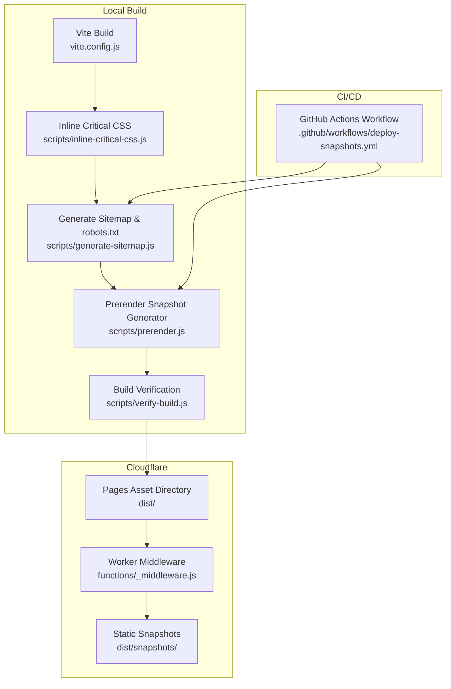
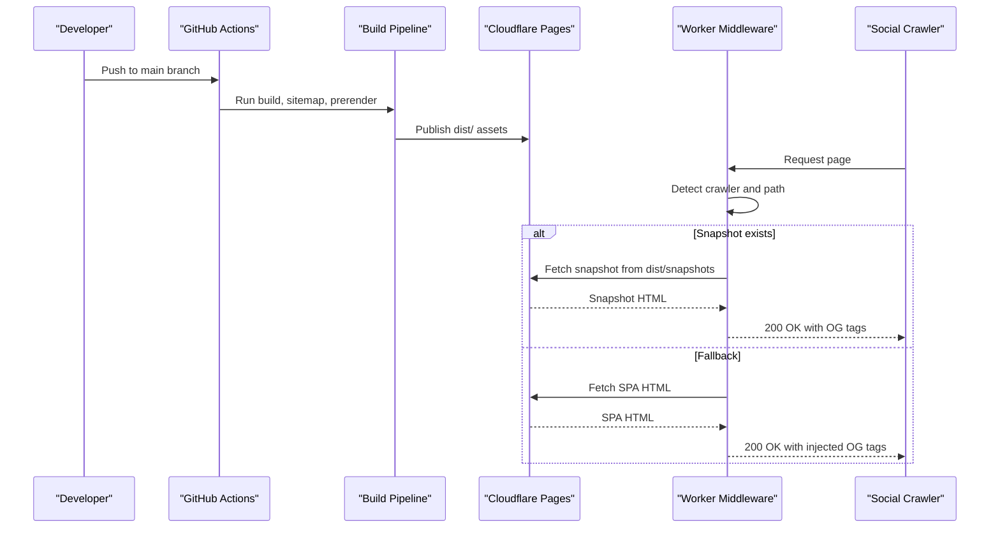
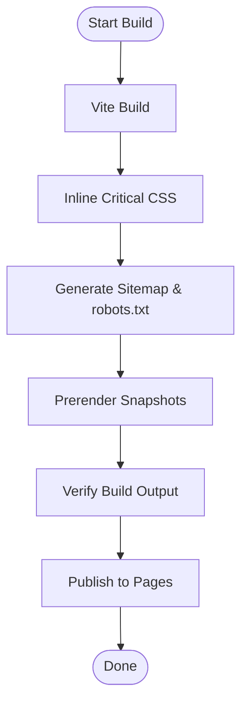
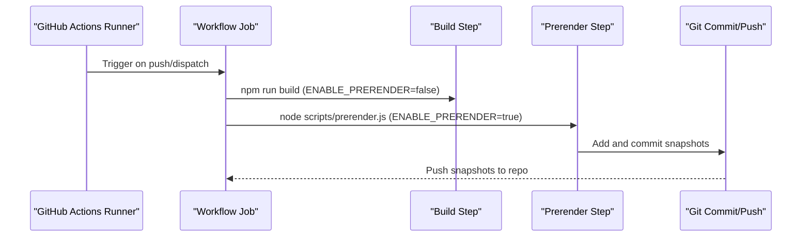
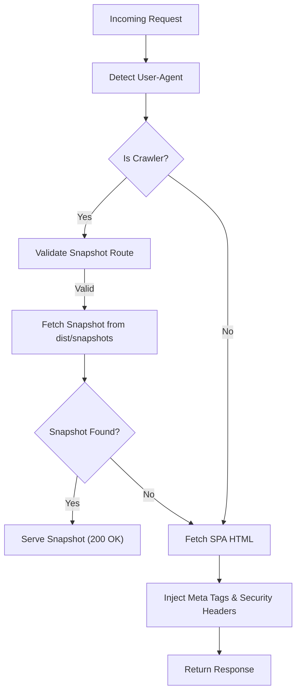
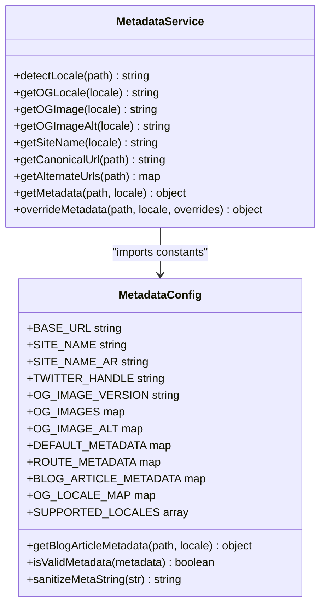
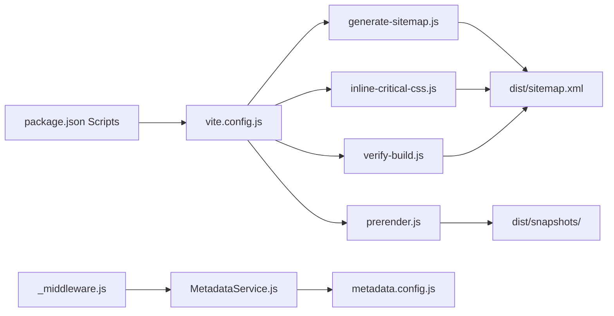

# Deployment and CI/CD

<cite>
**Referenced Files in This Document**
- [.github/workflows/deploy-snapshots.yml](file://.github/workflows/deploy-snapshots.yml)
- [package.json](file://package.json)
- [vite.config.js](file://vite.config.js)
- [wrangler.jsonc](file://wrangler.jsonc)
- [scripts/generate-sitemap.js](file://scripts/generate-sitemap.js)
- [scripts/inline-critical-css.js](file://scripts/inline-critical-css.js)
- [scripts/prerender.js](file://scripts/prerender.js)
- [scripts/verify-build.js](file://scripts/verify-build.js)
- [functions/_middleware.js](file://functions/_middleware.js)
- [functions/services/MetadataService.js](file://functions/services/MetadataService.js)
- [functions/config/metadata.config.js](file://functions/config/metadata.config.js)
- [functions/services/MetadataService.test.js](file://functions/services/MetadataService.test.js)
- [docs/DEPLOYMENT.md](file://docs/DEPLOYMENT.md)
</cite>

## Table of Contents
1. [Introduction](#introduction)
2. [Project Structure](#project-structure)
3. [Core Components](#core-components)
4. [Architecture Overview](#architecture-overview)
5. [Detailed Component Analysis](#detailed-component-analysis)
6. [Dependency Analysis](#dependency-analysis)
7. [Performance Considerations](#performance-considerations)
8. [Troubleshooting Guide](#troubleshooting-guide)
9. [Conclusion](#conclusion)
10. [Appendices](#appendices)

## Introduction
This document explains the deployment and CI/CD workflows for the landing page project, focusing on Cloudflare Pages deployment configuration, build pipeline automation, environment variable management, and the GitHub Actions workflow for automated snapshot generation and verification. It also covers production deployment, staging environments, rollback procedures, deployment triggers, monitoring, security considerations, domain configuration, and performance monitoring.

## Project Structure
The deployment pipeline integrates Vite build outputs, Cloudflare Pages asset serving, and a Cloudflare Worker middleware that injects metadata for social crawlers. Snapshot generation is automated via a prerender script and committed back to the repository for static serving. The CI workflow orchestrates snapshot updates and builds.

**Diagram sources**
- [vite.config.js](file://vite.config.js#L1-L262)
- [scripts/inline-critical-css.js](file://scripts/inline-critical-css.js#L1-L61)
- [scripts/generate-sitemap.js](file://scripts/generate-sitemap.js#L1-L148)
- [scripts/prerender.js](file://scripts/prerender.js#L1-L234)
- [scripts/verify-build.js](file://scripts/verify-build.js#L1-L84)
- [.github/workflows/deploy-snapshots.yml](file://.github/workflows/deploy-snapshots.yml#L1-L54)
- [functions/_middleware.js](file://functions/_middleware.js#L1-L383)

**Section sources**
- [vite.config.js](file://vite.config.js#L1-L262)
- [scripts/inline-critical-css.js](file://scripts/inline-critical-css.js#L1-L61)
- [scripts/generate-sitemap.js](file://scripts/generate-sitemap.js#L1-L148)
- [scripts/prerender.js](file://scripts/prerender.js#L1-L234)
- [scripts/verify-build.js](file://scripts/verify-build.js#L1-L84)
- [.github/workflows/deploy-snapshots.yml](file://.github/workflows/deploy-snapshots.yml#L1-L54)
- [functions/_middleware.js](file://functions/_middleware.js#L1-L383)

## Core Components
- Build pipeline: Vite build with PWA and compression plugins, followed by critical CSS inlining, sitemap generation, prerendering, and verification.
- Cloudflare Pages configuration: Asset directory mapping and compatibility settings.
- Worker middleware: Detects crawlers, serves pre-rendered snapshots when available, and injects metadata otherwise.
- CI workflow: Automates snapshot generation and commits updated snapshots to the repository.
- Environment variable management: Controlled via workflow environment and script guards.

**Section sources**
- [package.json](file://package.json#L1-L49)
- [vite.config.js](file://vite.config.js#L1-L262)
- [wrangler.jsonc](file://wrangler.jsonc#L1-L8)
- [functions/_middleware.js](file://functions/_middleware.js#L1-L383)
- [.github/workflows/deploy-snapshots.yml](file://.github/workflows/deploy-snapshots.yml#L1-L54)

## Architecture Overview
The system combines a static asset pipeline with a Cloudflare Worker that adapts responses for social media crawlers. Snapshot generation ensures fast, accurate previews for platforms like WhatsApp and Facebook.

**Diagram sources**
- [.github/workflows/deploy-snapshots.yml](file://.github/workflows/deploy-snapshots.yml#L1-L54)
- [scripts/prerender.js](file://scripts/prerender.js#L1-L234)
- [functions/_middleware.js](file://functions/_middleware.js#L1-L383)

## Detailed Component Analysis

### Cloudflare Pages Configuration
- Asset directory: The Pages configuration maps the dist directory as the asset root for static delivery.
- Compatibility date: Ensures runtime compatibility for Workers and Pages features.

**Section sources**
- [wrangler.jsonc](file://wrangler.jsonc#L1-L8)

### Build Pipeline Automation
- Vite build: Produces optimized assets, splits chunks, and disables CSS code splitting for critical inlining.
- Compression: Gzip and Brotli compression enabled.
- PWA configuration: Service worker, offline page, and manifest generation.
- Critical CSS inlining: Replaces external CSS link with inline styles in index.html.
- Sitemap generation: Creates sitemap.xml and robots.txt with hreflang and disallows admin routes.
- Prerendering: Generates static HTML snapshots from sitemap.xml using Puppeteer.
- Build verification: Enforces a clean dist root to avoid routing conflicts.

**Diagram sources**
- [vite.config.js](file://vite.config.js#L1-L262)
- [scripts/inline-critical-css.js](file://scripts/inline-critical-css.js#L1-L61)
- [scripts/generate-sitemap.js](file://scripts/generate-sitemap.js#L1-L148)
- [scripts/prerender.js](file://scripts/prerender.js#L1-L234)
- [scripts/verify-build.js](file://scripts/verify-build.js#L1-L84)

**Section sources**
- [vite.config.js](file://vite.config.js#L1-L262)
- [scripts/inline-critical-css.js](file://scripts/inline-critical-css.js#L1-L61)
- [scripts/generate-sitemap.js](file://scripts/generate-sitemap.js#L1-L148)
- [scripts/prerender.js](file://scripts/prerender.js#L1-L234)
- [scripts/verify-build.js](file://scripts/verify-build.js#L1-L84)

### Environment Variable Management
- ENABLE_PRERENDER: Controls whether prerendering executes in scripts.
- ENABLE_PRERENDER is explicitly disabled during the initial build step and enabled during the prerender step in CI.

**Section sources**
- [.github/workflows/deploy-snapshots.yml](file://.github/workflows/deploy-snapshots.yml#L28-L37)
- [scripts/prerender.js](file://scripts/prerender.js#L34-L38)

### GitHub Actions Workflow for Automated Deployments
- Triggers: Push to main branch and manual dispatch.
- Permissions: Write access to contents for committing snapshots.
- Jobs:
  - Setup Node.js and install dependencies.
  - Build project (disables prerender to avoid redundant attempts).
  - Run prerender with ENABLE_PRERENDER=true.
  - Commit and push updated snapshots to public/snapshots.

**Diagram sources**
- [.github/workflows/deploy-snapshots.yml](file://.github/workflows/deploy-snapshots.yml#L1-L54)
- [scripts/prerender.js](file://scripts/prerender.js#L34-L38)

**Section sources**
- [.github/workflows/deploy-snapshots.yml](file://.github/workflows/deploy-snapshots.yml#L1-L54)

### Worker Middleware for Metadata Injection and Snapshot Serving
- Crawler detection: Matches known social media and search engine user agents.
- Snapshot serving: Attempts to serve pre-rendered HTML from dist/snapshots when available.
- Fallback metadata injection: Injects OG tags, canonical, hreflang, and security headers.
- Security headers: CSP, HSTS, X-Content-Type-Options, X-Frame-Options, X-XSS-Protection, Referrer-Policy, Permissions-Policy.
- HTMLRewriter: Prepends meta tags to ensure they appear in the first 1KB for crawler parsing.

**Diagram sources**
- [functions/_middleware.js](file://functions/_middleware.js#L1-L383)

**Section sources**
- [functions/_middleware.js](file://functions/_middleware.js#L1-L383)

### Metadata Service and Configuration
- Centralized metadata configuration with locale-aware defaults and route-specific overrides.
- Blog article metadata support with shared and localized fields.
- Utility functions for sanitization and validation.
- Singleton pattern for efficient reuse within a worker lifecycle.

**Diagram sources**
- [functions/services/MetadataService.js](file://functions/services/MetadataService.js#L1-L380)
- [functions/config/metadata.config.js](file://functions/config/metadata.config.js#L1-L369)

**Section sources**
- [functions/services/MetadataService.js](file://functions/services/MetadataService.js#L1-L380)
- [functions/config/metadata.config.js](file://functions/config/metadata.config.js#L1-L369)

### Snapshot Generation and Verification
- Prerender script:
  - Reads sitemap.xml to discover routes.
  - Filters excluded routes and asset paths.
  - Starts a local preview server and uses Puppeteer to render pages.
  - Writes snapshot HTML files to dist/snapshots with path-based filenames.
- Verification script:
  - Ensures dist root contains only allowed HTML files to prevent routing conflicts on Pages.

**Section sources**
- [scripts/prerender.js](file://scripts/prerender.js#L1-L234)
- [scripts/verify-build.js](file://scripts/verify-build.js#L1-L84)

### Domain Configuration and Production Deployment
- Base URL and www subdomain consistency are enforced in metadata and middleware.
- Pages asset directory configured to dist.
- Deployment commands and verification steps documented.

**Section sources**
- [functions/config/metadata.config.js](file://functions/config/metadata.config.js#L39-L46)
- [functions/_middleware.js](file://functions/_middleware.js#L35-L36)
- [wrangler.jsonc](file://wrangler.jsonc#L4-L6)
- [docs/DEPLOYMENT.md](file://docs/DEPLOYMENT.md#L24-L32)

### Staging Environments and Rollback Procedures
- Staging: Use a separate branch or preview environment for testing snapshots and metadata before merging to main.
- Rollback: Revert to the previous commit containing working snapshots or redeploy a known-good Pages version via Wrangler.

[No sources needed since this section provides general guidance]

### Monitoring Deployment Status
- Cloudflare Analytics: Monitor Worker performance and error rates.
- Social crawler checks: Validate OG tags and image dimensions using platform debuggers.

**Section sources**
- [docs/DEPLOYMENT.md](file://docs/DEPLOYMENT.md#L127-L144)

### Security Considerations
- Security headers enforced by the Worker.
- Sanitization of metadata strings to prevent XSS.
- CSP allows only necessary resources and restricts framing and inline scripts to safe contexts.

**Section sources**
- [functions/_middleware.js](file://functions/_middleware.js#L196-L225)
- [functions/config/metadata.config.js](file://functions/config/metadata.config.js#L357-L369)

## Dependency Analysis
The build pipeline depends on Vite and several plugins, with post-processing scripts for SEO and prerendering. The Worker depends on the MetadataService and configuration. The CI workflow orchestrates snapshot generation and pushes changes back to the repository.

**Diagram sources**
- [package.json](file://package.json#L6-L14)
- [vite.config.js](file://vite.config.js#L1-L262)
- [scripts/inline-critical-css.js](file://scripts/inline-critical-css.js#L1-L61)
- [scripts/generate-sitemap.js](file://scripts/generate-sitemap.js#L1-L148)
- [scripts/prerender.js](file://scripts/prerender.js#L1-L234)
- [scripts/verify-build.js](file://scripts/verify-build.js#L1-L84)
- [functions/_middleware.js](file://functions/_middleware.js#L29-L30)
- [functions/services/MetadataService.js](file://functions/services/MetadataService.js#L16-L29)
- [functions/config/metadata.config.js](file://functions/config/metadata.config.js#L1-L369)

**Section sources**
- [package.json](file://package.json#L6-L14)
- [vite.config.js](file://vite.config.js#L1-L262)
- [functions/_middleware.js](file://functions/_middleware.js#L29-L30)
- [functions/services/MetadataService.js](file://functions/services/MetadataService.js#L16-L29)

## Performance Considerations
- Critical CSS inlining reduces render-blocking requests.
- Compression (gzip/Brotli) reduces payload sizes.
- Snapshot serving minimizes Worker processing for crawlers.
- Chunk splitting and manual chunks optimize caching and loading.

**Section sources**
- [vite.config.js](file://vite.config.js#L204-L248)
- [scripts/inline-critical-css.js](file://scripts/inline-critical-css.js#L22-L55)
- [functions/_middleware.js](file://functions/_middleware.js#L102-L144)

## Troubleshooting Guide
Common issues and resolutions:
- WhatsApp shows old OG image: Update the OG image cache-busting version and scrape again.
- Arabic text not rendering: Regenerate OG images with proper RTL support and update the version.
- Duplicate meta tags: Middleware removes existing tags; verify selector correctness and order.
- Image not loading (404): Confirm images exist in public and are included in the build output.

**Section sources**
- [docs/DEPLOYMENT.md](file://docs/DEPLOYMENT.md#L147-L181)
- [functions/config/metadata.config.js](file://functions/config/metadata.config.js#L52-L56)

## Conclusion
The deployment and CI/CD setup leverages a robust build pipeline, automated snapshot generation, and a Cloudflare Worker to deliver accurate social previews with strong security and performance characteristics. The CI workflow ensures snapshots are consistently generated and committed, while the Worker provides graceful fallbacks and strict security controls.

## Appendices

### Practical Examples
- Configure deployment triggers: Use the workflow trigger configuration to automate snapshot generation on pushes to main and on demand via workflow_dispatch.
- Monitor deployment status: Review Cloudflare Worker metrics and logs; validate social previews using platform debuggers.
- Troubleshoot deployment issues: Validate build output with the verification script, confirm snapshot existence, and check crawler user agents in logs.

**Section sources**
- [.github/workflows/deploy-snapshots.yml](file://.github/workflows/deploy-snapshots.yml#L3-L7)
- [scripts/verify-build.js](file://scripts/verify-build.js#L37-L81)
- [docs/DEPLOYMENT.md](file://docs/DEPLOYMENT.md#L127-L144)