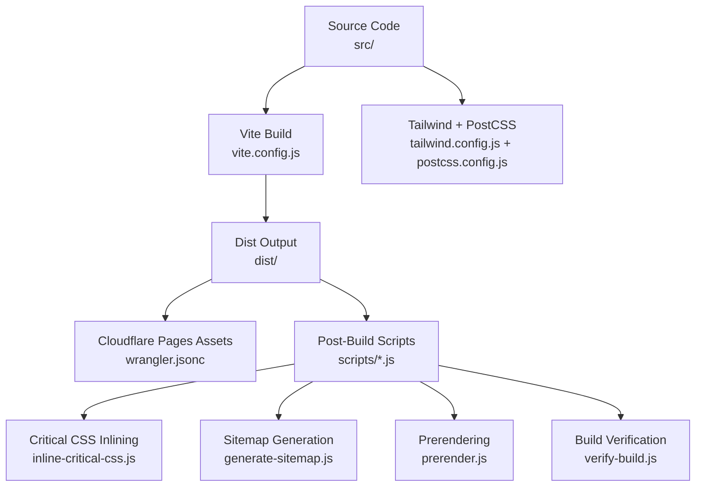
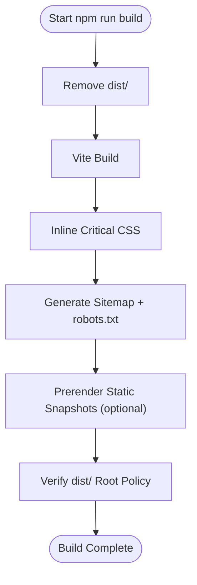
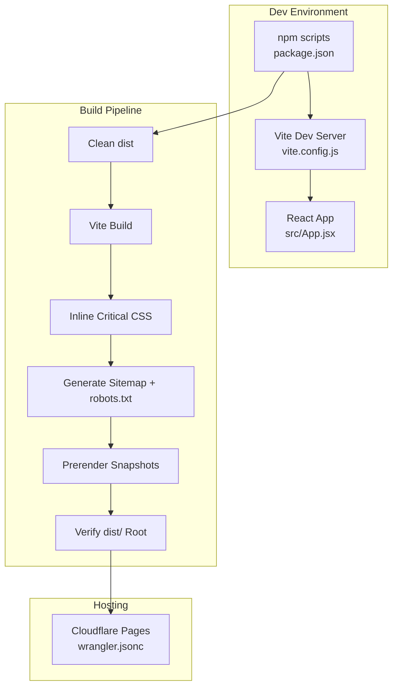
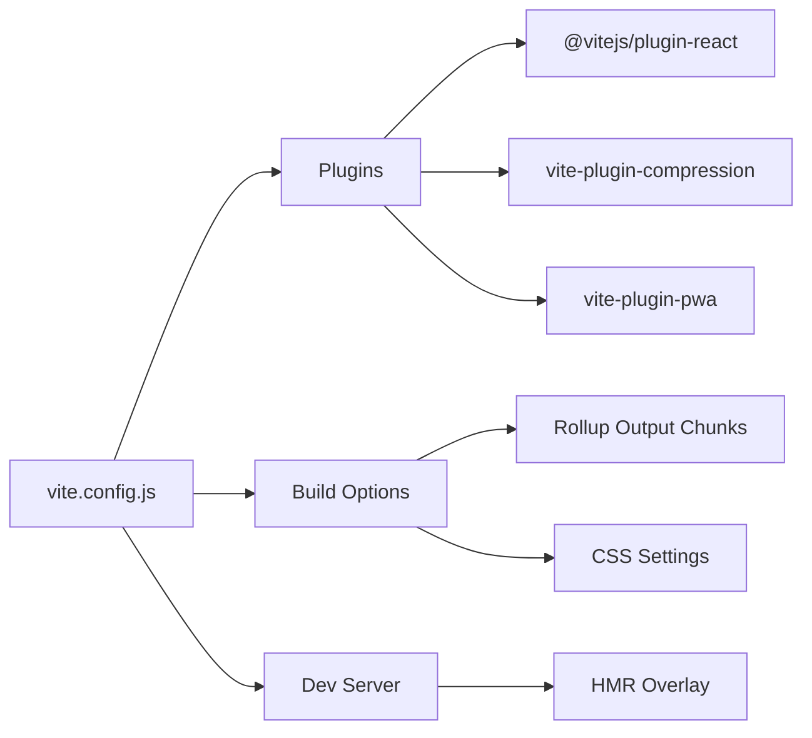
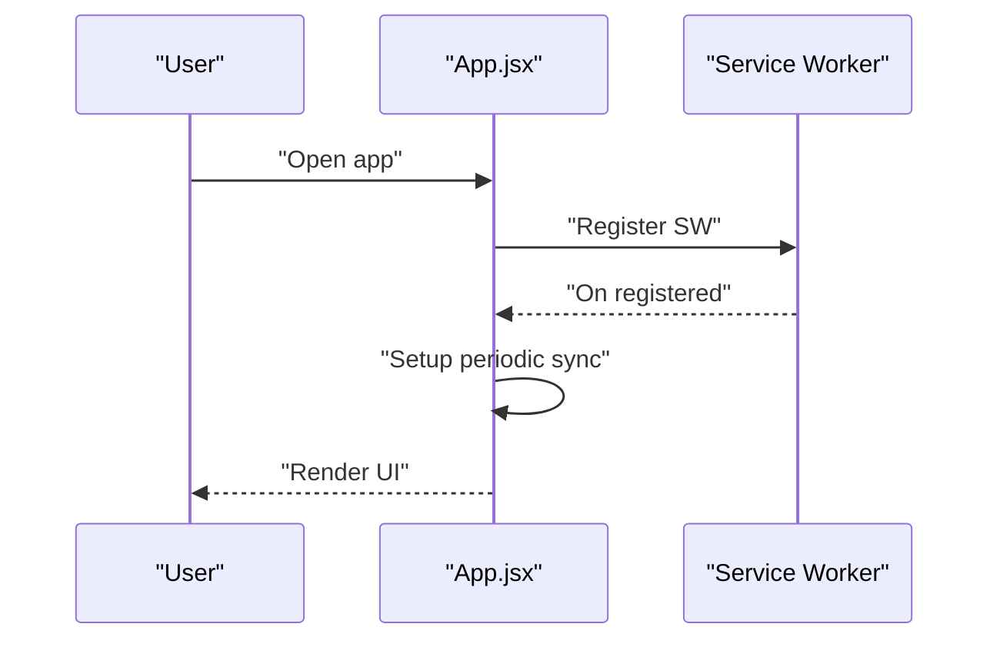
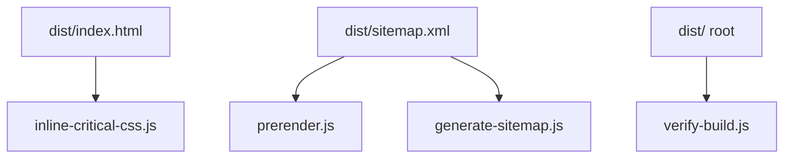
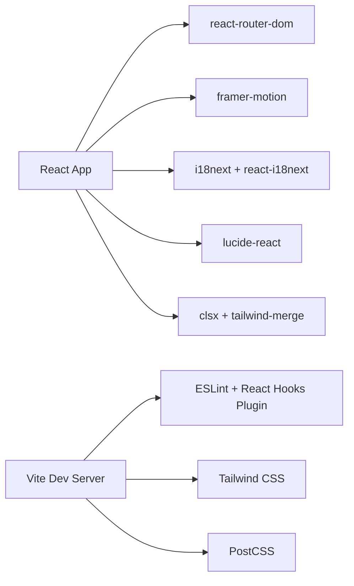

# Getting Started

<cite>
**Referenced Files in This Document**
- [README.md](file://README.md)
- [package.json](file://package.json)
- [vite.config.js](file://vite.config.js)
- [wrangler.jsonc](file://wrangler.jsonc)
- [tailwind.config.js](file://tailwind.config.js)
- [postcss.config.js](file://postcss.config.js)
- [eslint.config.js](file://eslint.config.js)
- [src/main.jsx](file://src/main.jsx)
- [src/App.jsx](file://src/App.jsx)
- [scripts/inline-critical-css.js](file://scripts/inline-critical-css.js)
- [scripts/generate-sitemap.js](file://scripts/generate-sitemap.js)
- [scripts/prerender.js](file://scripts/prerender.js)
- [scripts/verify-build.js](file://scripts/verify-build.js)
- [docs/DEPLOYMENT.md](file://docs/DEPLOYMENT.md)
</cite>

## Table of Contents
1. [Introduction](#introduction)
2. [Project Structure](#project-structure)
3. [Prerequisites](#prerequisites)
4. [Installation](#installation)
5. [Environment Setup](#environment-setup)
6. [Development Workflow](#development-workflow)
7. [Build and Deployment](#build-and-deployment)
8. [Architecture Overview](#architecture-overview)
9. [Detailed Component Analysis](#detailed-component-analysis)
10. [Dependency Analysis](#dependency-analysis)
11. [Performance Considerations](#performance-considerations)
12. [Troubleshooting Guide](#troubleshooting-guide)
13. [Conclusion](#conclusion)

## Introduction
This guide helps you set up the Rumuze landing page development environment from scratch. It covers prerequisites, installation, local development, build processes, and deployment preparation. The project uses React 19, Vite, Tailwind CSS, and Cloudflare Pages for hosting. It also includes automated SEO enhancements (critical CSS inlining, sitemap generation, prerendering) and a PWA setup.

## Project Structure
At a high level, the project consists of:
- Source code under src/ (React app entry, pages, components, hooks, context, styles)
- Build configuration via Vite (vite.config.js)
- Styling pipeline with Tailwind and PostCSS
- Scripts for post-build automation (critical CSS, sitemap, prerender, verification)
- Cloudflare Pages configuration (wrangler.jsonc)
- Deployment and testing documentation (docs/DEPLOYMENT.md)

**Diagram sources**
- [vite.config.js](file://vite.config.js#L1-L262)
- [wrangler.jsonc](file://wrangler.jsonc#L1-L8)
- [tailwind.config.js](file://tailwind.config.js#L1-L47)
- [postcss.config.js](file://postcss.config.js#L1-L7)
- [scripts/inline-critical-css.js](file://scripts/inline-critical-css.js#L1-L61)
- [scripts/generate-sitemap.js](file://scripts/generate-sitemap.js#L1-L148)
- [scripts/prerender.js](file://scripts/prerender.js#L1-L234)
- [scripts/verify-build.js](file://scripts/verify-build.js#L1-L84)

**Section sources**
- [README.md](file://README.md#L1-L17)
- [package.json](file://package.json#L1-L49)
- [vite.config.js](file://vite.config.js#L1-L262)
- [wrangler.jsonc](file://wrangler.jsonc#L1-L8)
- [tailwind.config.js](file://tailwind.config.js#L1-L47)
- [postcss.config.js](file://postcss.config.js#L1-L7)

## Prerequisites
Before starting, ensure you have:
- Node.js LTS (e.g., 18.x or 20.x) installed and available in PATH
- npm (comes with Node.js) or Yarn as your package manager
- Basic understanding of React 19 and modern JavaScript (ES modules, JSX)
- Optional: Git for version control

Tip: Confirm your setup by running:
- node --version
- npm --version
- npx vite --version

**Section sources**
- [README.md](file://README.md#L1-L17)
- [package.json](file://package.json#L1-L49)

## Installation
Follow these steps to install dependencies and prepare your environment:

1. Clone the repository (if applicable) and navigate to the project directory.
2. Install dependencies:
   - Using npm: npm ci
   - Using Yarn: yarn install
3. Verify installation by running:
   - npm run dev
   - npm run preview
   - npm run build

Notes:
- The project uses ES modules ("type": "module" in package.json).
- Vite is configured as the dev/build tool.
- Tailwind CSS and PostCSS are integrated for styling.

**Section sources**
- [package.json](file://package.json#L1-L49)
- [vite.config.js](file://vite.config.js#L1-L262)
- [tailwind.config.js](file://tailwind.config.js#L1-L47)
- [postcss.config.js](file://postcss.config.js#L1-L7)

## Environment Setup
Configure your development environment:

- React and Vite
  - The app initializes in src/main.jsx and renders App.jsx.
  - Vite handles hot module replacement (HMR) and fast refresh.

- Styling
  - Tailwind is configured to scan src and index.html.
  - PostCSS applies Tailwind and Autoprefixer automatically during builds.

- Linting
  - ESLint is configured with recommended rules and React-specific plugins.
  - Run npm run lint to check for issues.

- PWA and Offline
  - VitePWA is enabled with injectManifest strategy and Workbox configuration.
  - Offline fallback and service worker registration are handled automatically.

- Internationalization
  - i18n is initialized in src/i18n.js and used across components/pages.

- Routing
  - React Router DOM manages SPA routing with lazy-loaded pages and animations.

**Section sources**
- [src/main.jsx](file://src/main.jsx#L1-L12)
- [src/App.jsx](file://src/App.jsx#L1-L348)
- [vite.config.js](file://vite.config.js#L1-L262)
- [tailwind.config.js](file://tailwind.config.js#L1-L47)
- [postcss.config.js](file://postcss.config.js#L1-L7)
- [eslint.config.js](file://eslint.config.js#L1-L30)

## Development Workflow
Local development steps:

1. Start the development server:
   - npm run dev
   - The dev server starts with HMR enabled.

2. Access the app:
   - Open http://localhost:5173 (default Vite port).
   - Arabic routes are supported (e.g., /ar).

3. Preview production build locally:
   - npm run preview
   - This serves the built assets from dist/.

4. Run tests:
   - npm test (runs Vitest)
   - npm run test:watch (watch mode)

5. Linting:
   - npm run lint

6. Build:
   - npm run build (cleans dist, runs Vite build, then post-build scripts)

Tips:
- On Windows, ensure WSL or PowerShell is used consistently if you encounter permission issues.
- On Unix-like systems, use bash/zsh and ensure executable permissions for scripts if needed.

**Section sources**
- [package.json](file://package.json#L6-L14)
- [vite.config.js](file://vite.config.js#L250-L256)
- [docs/DEPLOYMENT.md](file://docs/DEPLOYMENT.md#L1-L226)

## Build and Deployment
Build pipeline overview:

**Diagram sources**
- [package.json](file://package.json#L8-L8)
- [scripts/inline-critical-css.js](file://scripts/inline-critical-css.js#L1-L61)
- [scripts/generate-sitemap.js](file://scripts/generate-sitemap.js#L1-L148)
- [scripts/prerender.js](file://scripts/prerender.js#L1-L234)
- [scripts/verify-build.js](file://scripts/verify-build.js#L1-L84)

Post-build automation details:
- Critical CSS inlining: scripts/inline-critical-css.js replaces the stylesheet link with inline styles in index.html.
- Sitemap generation: scripts/generate-sitemap.js creates sitemap.xml and robots.txt in dist/.
- Prerendering: scripts/prerender.js uses Puppeteer to generate static HTML snapshots for search bots (controlled by ENABLE_PRERENDER).
- Build verification: scripts/verify-build.js ensures only allowed HTML files exist in dist/ root.

Deployment to Cloudflare Pages:
- Configure wrangler.jsonc to serve dist/ as static assets.
- Use npm run deploy to push to Cloudflare.

Verification checklist (post-deployment):
- Confirm meta tags and OG images for both locales.
- Test WhatsApp, Facebook, and LinkedIn previews.
- Monitor Cloudflare Worker metrics.

**Section sources**
- [package.json](file://package.json#L8-L14)
- [scripts/inline-critical-css.js](file://scripts/inline-critical-css.js#L1-L61)
- [scripts/generate-sitemap.js](file://scripts/generate-sitemap.js#L1-L148)
- [scripts/prerender.js](file://scripts/prerender.js#L35-L38)
- [scripts/verify-build.js](file://scripts/verify-build.js#L6-L14)
- [wrangler.jsonc](file://wrangler.jsonc#L1-L8)
- [docs/DEPLOYMENT.md](file://docs/DEPLOYMENT.md#L24-L32)

## Architecture Overview
High-level architecture of the development and build pipeline:

**Diagram sources**
- [package.json](file://package.json#L6-L14)
- [vite.config.js](file://vite.config.js#L1-L262)
- [src/App.jsx](file://src/App.jsx#L1-L348)
- [scripts/inline-critical-css.js](file://scripts/inline-critical-css.js#L1-L61)
- [scripts/generate-sitemap.js](file://scripts/generate-sitemap.js#L1-L148)
- [scripts/prerender.js](file://scripts/prerender.js#L1-L234)
- [scripts/verify-build.js](file://scripts/verify-build.js#L1-L84)
- [wrangler.jsonc](file://wrangler.jsonc#L1-L8)

## Detailed Component Analysis

### Vite Configuration
Key aspects:
- Plugins: React refresh, gzip/brotli compression, PWA with injectManifest.
- Build: Manual chunking for core libraries, CSS inlining strategy, source maps disabled for production.
- Dev server: HMR overlay enabled.

**Diagram sources**
- [vite.config.js](file://vite.config.js#L1-L262)

**Section sources**
- [vite.config.js](file://vite.config.js#L1-L262)

### PWA and Service Worker
- PWA manifest and Workbox configuration are defined in vite.config.js.
- Service worker registration and periodic sync are handled in src/App.jsx.

**Diagram sources**
- [vite.config.js](file://vite.config.js#L19-L202)
- [src/App.jsx](file://src/App.jsx#L87-L167)

**Section sources**
- [vite.config.js](file://vite.config.js#L19-L202)
- [src/App.jsx](file://src/App.jsx#L87-L167)

### Post-Build Scripts
- Critical CSS inlining: reads dist/index.html and replaces the stylesheet link with inline styles.
- Sitemap generation: creates sitemap.xml and robots.txt with bilingual routes.
- Prerendering: launches a preview server, navigates to discovered routes, and saves snapshots.
- Build verification: enforces a strict policy on dist/ root contents.

**Diagram sources**
- [scripts/inline-critical-css.js](file://scripts/inline-critical-css.js#L24-L56)
- [scripts/generate-sitemap.js](file://scripts/generate-sitemap.js#L123-L145)
- [scripts/prerender.js](file://scripts/prerender.js#L136-L231)
- [scripts/verify-build.js](file://scripts/verify-build.js#L37-L81)

**Section sources**
- [scripts/inline-critical-css.js](file://scripts/inline-critical-css.js#L1-L61)
- [scripts/generate-sitemap.js](file://scripts/generate-sitemap.js#L1-L148)
- [scripts/prerender.js](file://scripts/prerender.js#L1-L234)
- [scripts/verify-build.js](file://scripts/verify-build.js#L1-L84)

## Dependency Analysis
- Runtime dependencies include React 19, React Router DOM, Tailwind merge, Framer Motion, i18next ecosystem, and PWA plugin.
- Dev dependencies include Vite, React plugin, Tailwind CSS, PostCSS, ESLint, and Vitest.

**Diagram sources**
- [package.json](file://package.json#L16-L48)

**Section sources**
- [package.json](file://package.json#L16-L48)

## Performance Considerations
- CSS inlining reduces render-blocking requests.
- Manual chunking optimizes caching and initial load.
- Compression (gzip/brotli) reduces payload sizes.
- Source maps disabled in production for performance.
- Prerendering improves SEO and perceived performance for bots.

[No sources needed since this section provides general guidance]

## Troubleshooting Guide
Common setup and runtime issues:

- Node or npm not found
  - Ensure Node.js LTS is installed and added to PATH.
  - Use nvm to manage versions if needed.

- Port conflicts during dev
  - Change Vite port in vite.config.js or kill the conflicting process.

- Missing dependencies after clone
  - Run npm ci or yarn install to install exact versions.

- ESLint errors
  - Fix reported issues or run npm run lint to review.

- PWA or offline features not working
  - Confirm service worker registration and manifest in devtools.

- Cloudflare Pages routing issues
  - Ensure dist/ root contains only allowed HTML files (index.html, 404.html, offline.html, google*.html).
  - Use npm run verify-build to enforce policy.

- Prerendering fails
  - Ensure ENABLE_PRERENDER=true is set and Puppeteer can launch Chrome.
  - Confirm sitemap.xml exists before prerendering.

- Arabic locale not applied
  - Verify language detection and pathname prefix logic in App.jsx.

**Section sources**
- [vite.config.js](file://vite.config.js#L250-L256)
- [scripts/verify-build.js](file://scripts/verify-build.js#L25-L35)
- [scripts/prerender.js](file://scripts/prerender.js#L35-L38)
- [src/App.jsx](file://src/App.jsx#L118-L143)
- [docs/DEPLOYMENT.md](file://docs/DEPLOYMENT.md#L147-L182)

## Conclusion
You now have the essentials to set up, develop, build, and deploy the Rumuze landing page. Use npm run dev for local iteration, npm run build for production preparation, and npm run deploy to publish to Cloudflare Pages. Leverage the post-build scripts for SEO and performance, and consult the troubleshooting section for frequent issues.