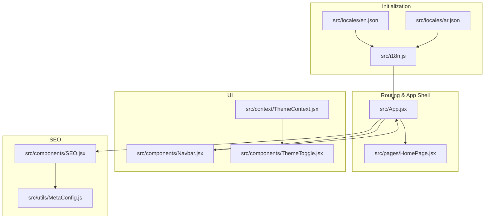
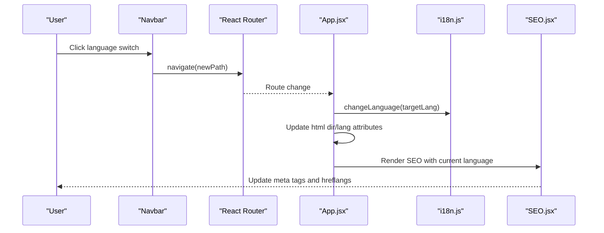
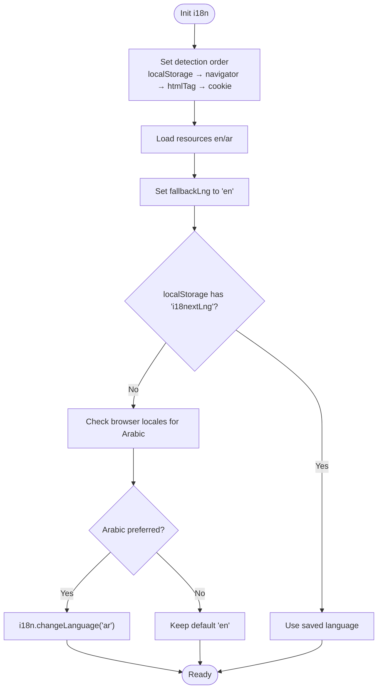
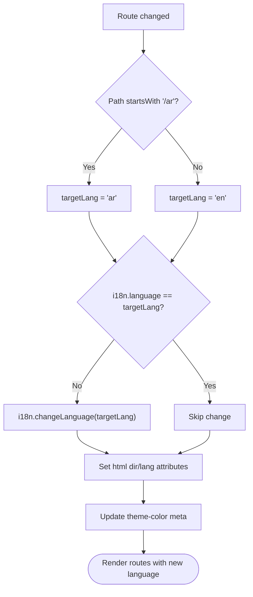
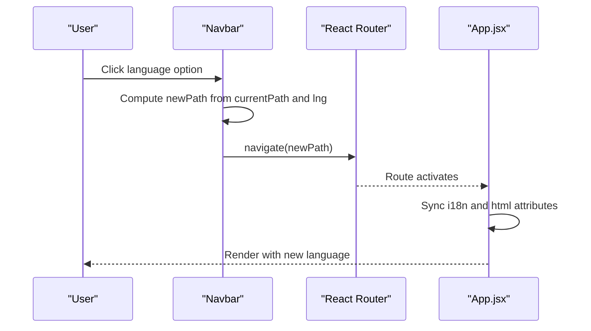
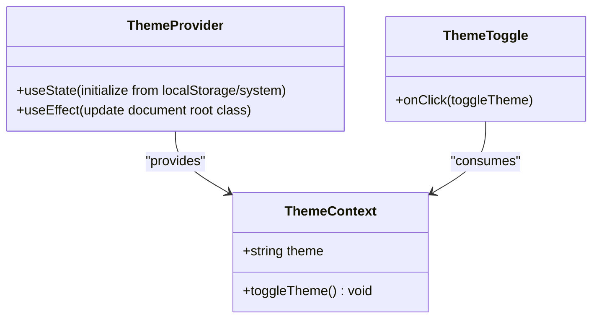
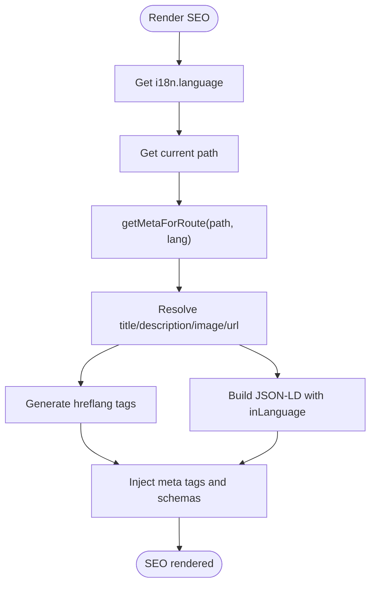
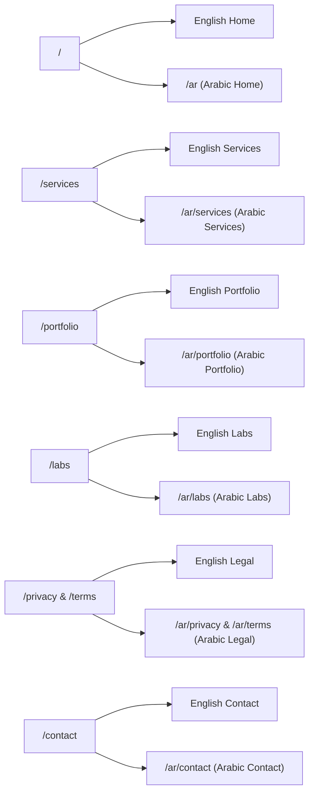
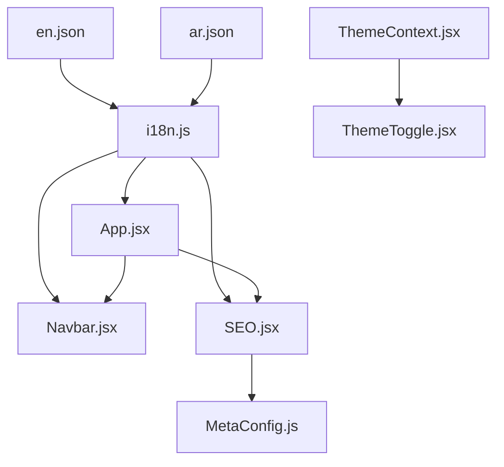

# Dynamic Language Switching

<cite>
**Referenced Files in This Document**
- [src/i18n.js](file://src/i18n.js)
- [src/locales/en.json](file://src/locales/en.json)
- [src/locales/ar.json](file://src/locales/ar.json)
- [src/App.jsx](file://src/App.jsx)
- [src/components/Navbar.jsx](file://src/components/Navbar.jsx)
- [src/components/ThemeToggle.jsx](file://src/components/ThemeToggle.jsx)
- [src/context/ThemeContext.jsx](file://src/context/ThemeContext.jsx)
- [src/components/SEO.jsx](file://src/components/SEO.jsx)
- [src/utils/MetaConfig.js](file://src/utils/MetaConfig.js)
- [src/pages/HomePage.jsx](file://src/pages/HomePage.jsx)
</cite>

## Table of Contents
1. [Introduction](#introduction)
2. [Project Structure](#project-structure)
3. [Core Components](#core-components)
4. [Architecture Overview](#architecture-overview)
5. [Detailed Component Analysis](#detailed-component-analysis)
6. [Dependency Analysis](#dependency-analysis)
7. [Performance Considerations](#performance-considerations)
8. [Troubleshooting Guide](#troubleshooting-guide)
9. [Conclusion](#conclusion)

## Introduction
This document explains how dynamic language switching is implemented in the project, focusing on triggers, state management, component re-rendering, integration with theme switching, URL parameter handling, and persistent language preferences. It also covers SEO implications, loading states, and UX optimization strategies for smooth language transitions.

## Project Structure
The language switching system spans initialization, routing, UI components, and SEO metadata management:
- Initialization: i18n setup with detection, fallback, and persistence
- Routing: URL-based language synchronization and route mapping
- UI: Language selector in the navbar and theme toggle integration
- SEO: Dynamic metadata generation and hreflang tags

**Diagram sources**
- [src/i18n.js](file://src/i18n.js#L1-L45)
- [src/locales/en.json](file://src/locales/en.json#L1-L414)
- [src/locales/ar.json](file://src/locales/ar.json#L1-L414)
- [src/App.jsx](file://src/App.jsx#L74-L309)
- [src/pages/HomePage.jsx](file://src/pages/HomePage.jsx#L25-L43)
- [src/components/Navbar.jsx](file://src/components/Navbar.jsx#L9-L337)
- [src/context/ThemeContext.jsx](file://src/context/ThemeContext.jsx#L1-L46)
- [src/components/ThemeToggle.jsx](file://src/components/ThemeToggle.jsx#L1-L51)
- [src/components/SEO.jsx](file://src/components/SEO.jsx#L7-L278)
- [src/utils/MetaConfig.js](file://src/utils/MetaConfig.js#L19-L295)

**Section sources**
- [src/i18n.js](file://src/i18n.js#L1-L45)
- [src/App.jsx](file://src/App.jsx#L74-L309)
- [src/components/Navbar.jsx](file://src/components/Navbar.jsx#L9-L337)
- [src/components/SEO.jsx](file://src/components/SEO.jsx#L7-L278)
- [src/utils/MetaConfig.js](file://src/utils/MetaConfig.js#L19-L295)

## Core Components
- i18n initialization and detection: Initializes i18next with resources, detection order, and persistence to localStorage
- App-level language sync: Watches route changes and synchronizes i18n language and document direction
- Navbar language selector: Provides UI to switch languages and navigates accordingly
- Theme integration: Theme context persists and toggles theme independently of language
- SEO metadata: Generates bilingual metadata and hreflang tags based on current language and path

**Section sources**
- [src/i18n.js](file://src/i18n.js#L14-L40)
- [src/App.jsx](file://src/App.jsx#L117-L143)
- [src/components/Navbar.jsx](file://src/components/Navbar.jsx#L39-L57)
- [src/context/ThemeContext.jsx](file://src/context/ThemeContext.jsx#L5-L36)
- [src/components/SEO.jsx](file://src/components/SEO.jsx#L234-L239)

## Architecture Overview
The language switching pipeline integrates initialization, routing, UI, and SEO:

**Diagram sources**
- [src/components/Navbar.jsx](file://src/components/Navbar.jsx#L39-L57)
- [src/App.jsx](file://src/App.jsx#L117-L143)
- [src/i18n.js](file://src/i18n.js#L14-L40)
- [src/components/SEO.jsx](file://src/components/SEO.jsx#L225-L278)

## Detailed Component Analysis

### i18n Initialization and Persistence
- Detection order prioritizes localStorage, then browser language detection, HTML tag, and cookie
- Resources loaded from JSON files for English and Arabic
- On first load, detects Arabic preference based on browser locales and sets language accordingly
- Uses localStorage to persist language preference across sessions

**Diagram sources**
- [src/i18n.js](file://src/i18n.js#L14-L40)

**Section sources**
- [src/i18n.js](file://src/i18n.js#L14-L40)

### App-Level Language Synchronization
- Watches route changes and determines target language from path prefix
- Calls i18n.changeLanguage when mismatched
- Updates document.documentElement.lang and dir attributes for proper RTL/LTR rendering
- Ensures theme color meta updates for mobile browsers

**Diagram sources**
- [src/App.jsx](file://src/App.jsx#L117-L143)

**Section sources**
- [src/App.jsx](file://src/App.jsx#L117-L143)

### Navbar Language Selector
- Displays current language and flags
- Computes new path based on current location and desired language
- Navigates to synchronized path; App.jsx handles i18n change and document attributes
- Closes dropdown menus after selection

**Diagram sources**
- [src/components/Navbar.jsx](file://src/components/Navbar.jsx#L39-L57)
- [src/App.jsx](file://src/App.jsx#L117-L143)

**Section sources**
- [src/components/Navbar.jsx](file://src/components/Navbar.jsx#L39-L57)

### Theme Integration
- ThemeContext persists theme in localStorage and applies dark/light class to document root
- ThemeToggle toggles between themes and is integrated in both desktop and mobile navigation
- Theme switching is independent of language switching and does not trigger i18n changes

**Diagram sources**
- [src/context/ThemeContext.jsx](file://src/context/ThemeContext.jsx#L5-L36)
- [src/components/ThemeToggle.jsx](file://src/components/ThemeToggle.jsx#L6-L47)

**Section sources**
- [src/context/ThemeContext.jsx](file://src/context/ThemeContext.jsx#L5-L36)
- [src/components/ThemeToggle.jsx](file://src/components/ThemeToggle.jsx#L6-L47)

### SEO and Multilingual Metadata
- SEO component reads current language and path to select appropriate metadata
- Generates canonical URLs and hreflang links for both languages
- Emits structured data with inLanguage set to ar_EG or en_US
- Falls back gracefully if metadata is missing

**Diagram sources**
- [src/components/SEO.jsx](file://src/components/SEO.jsx#L7-L278)
- [src/utils/MetaConfig.js](file://src/utils/MetaConfig.js#L250-L295)

**Section sources**
- [src/components/SEO.jsx](file://src/components/SEO.jsx#L7-L278)
- [src/utils/MetaConfig.js](file://src/utils/MetaConfig.js#L19-L295)

### Route Mapping and Language Prefixes
- Routes are defined for both English and Arabic prefixes
- HomePage accepts an isAr prop to adjust SEO path
- All major pages have corresponding /ar routes

**Diagram sources**
- [src/App.jsx](file://src/App.jsx#L182-L290)
- [src/pages/HomePage.jsx](file://src/pages/HomePage.jsx#L25-L43)

**Section sources**
- [src/App.jsx](file://src/App.jsx#L182-L290)
- [src/pages/HomePage.jsx](file://src/pages/HomePage.jsx#L25-L43)

## Dependency Analysis
- i18n depends on resource JSON files for translations
- App.jsx depends on i18n for language state and on SEO for metadata
- Navbar depends on i18n for current language and on router for navigation
- SEO depends on MetaConfig for metadata and on i18n for language
- ThemeContext and ThemeToggle are independent of i18n

**Diagram sources**
- [src/i18n.js](file://src/i18n.js#L1-L45)
- [src/locales/en.json](file://src/locales/en.json#L1-L414)
- [src/locales/ar.json](file://src/locales/ar.json#L1-L414)
- [src/App.jsx](file://src/App.jsx#L74-L309)
- [src/components/Navbar.jsx](file://src/components/Navbar.jsx#L9-L337)
- [src/components/SEO.jsx](file://src/components/SEO.jsx#L7-L278)
- [src/utils/MetaConfig.js](file://src/utils/MetaConfig.js#L19-L295)
- [src/context/ThemeContext.jsx](file://src/context/ThemeContext.jsx#L1-L46)
- [src/components/ThemeToggle.jsx](file://src/components/ThemeToggle.jsx#L1-L51)

**Section sources**
- [src/i18n.js](file://src/i18n.js#L1-L45)
- [src/App.jsx](file://src/App.jsx#L74-L309)
- [src/components/Navbar.jsx](file://src/components/Navbar.jsx#L9-L337)
- [src/components/SEO.jsx](file://src/components/SEO.jsx#L7-L278)
- [src/utils/MetaConfig.js](file://src/utils/MetaConfig.js#L19-L295)
- [src/context/ThemeContext.jsx](file://src/context/ThemeContext.jsx#L1-L46)
- [src/components/ThemeToggle.jsx](file://src/components/ThemeToggle.jsx#L1-L51)

## Performance Considerations
- Lazy loading: Pages and components are lazy-loaded to reduce initial bundle size
- Suspense fallback: Skeleton loaders improve perceived performance during transitions
- Minimal re-renders: App.jsx updates only document attributes and triggers i18n change when needed
- SEO caching: MetaConfig centralizes metadata to avoid repeated computations
- Theme persistence: ThemeContext avoids unnecessary DOM manipulations by reading from localStorage

[No sources needed since this section provides general guidance]

## Troubleshooting Guide
Common issues and resolutions:
- Language not sticking after reload
  - Ensure localStorage key 'i18nextLng' is present and correctly set
  - Verify detection order and whitelist checks in i18n initialization
- Wrong direction on page load
  - Confirm App.jsx route effect runs before rendering and sets html dir/lang
- Hreflang or metadata incorrect
  - Check MetaConfig normalization and canonical URL generation
  - Ensure SEO component receives current path and language
- Theme conflicts with language
  - ThemeContext operates independently; verify ThemeToggle and ThemeProvider wrapping

**Section sources**
- [src/i18n.js](file://src/i18n.js#L26-L33)
- [src/App.jsx](file://src/App.jsx#L117-L143)
- [src/utils/MetaConfig.js](file://src/utils/MetaConfig.js#L206-L295)
- [src/components/SEO.jsx](file://src/components/SEO.jsx#L225-L278)
- [src/context/ThemeContext.jsx](file://src/context/ThemeContext.jsx#L5-L36)

## Conclusion
The project implements robust dynamic language switching by combining i18n initialization with URL-based synchronization, a user-friendly language selector, and comprehensive SEO metadata management. Theme switching is cleanly separated for predictable behavior. The system balances performance with user experience through lazy loading, skeleton loaders, and efficient state updates.