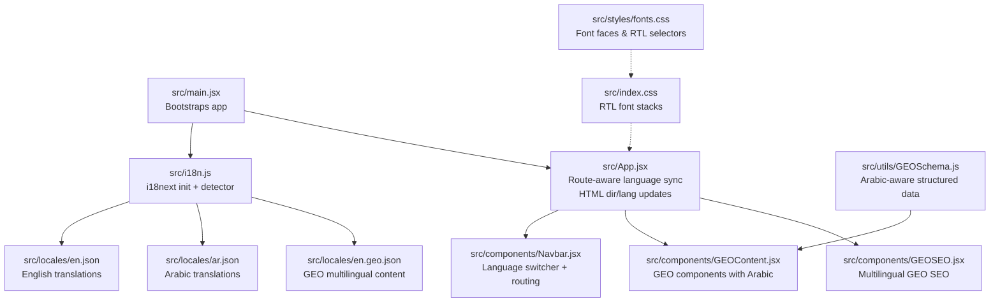
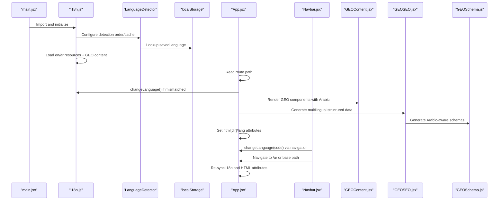
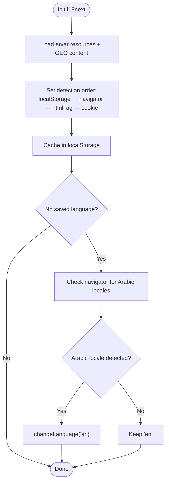
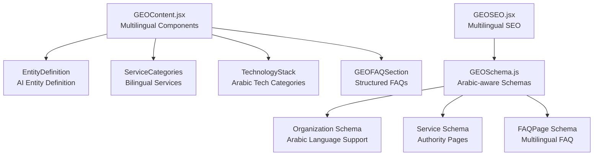
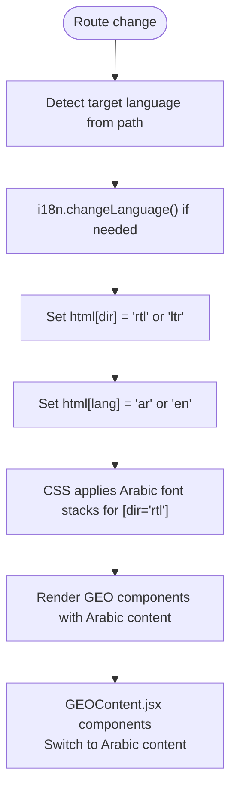
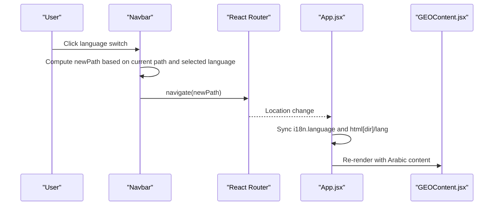
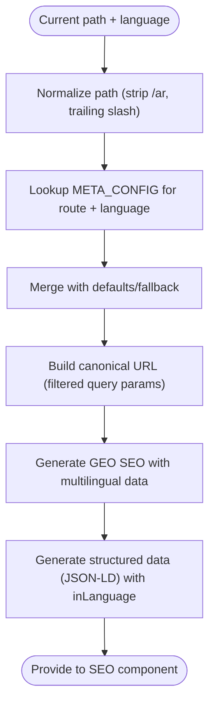
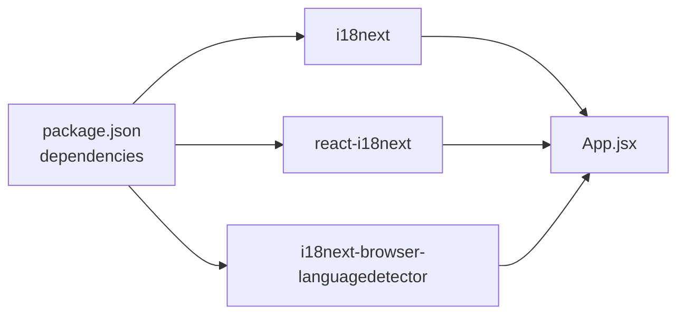

# Internationalization (i18n)

<cite>
**Referenced Files in This Document**
- [src/i18n.js](file://src/i18n.js)
- [src/locales/en.json](file://src/locales/en.json)
- [src/locales/ar.json](file://src/locales/ar.json)
- [src/locales/en.geo.json](file://src/locales/en.geo.json)
- [src/App.jsx](file://src/App.jsx)
- [src/main.jsx](file://src/main.jsx)
- [src/components/Navbar.jsx](file://src/components/Navbar.jsx)
- [src/components/GEOContent.jsx](file://src/components/GEOContent.jsx)
- [src/components/GEOSEO.jsx](file://src/components/GEOSEO.jsx)
- [src/utils/GEOSchema.js](file://src/utils/GEOSchema.js)
- [src/utils/MetaConfig.js](file://src/utils/MetaConfig.js)
- [src/utils/MetaConfig.test.js](file://src/utils/MetaConfig.test.js)
- [src/pages/HomePage.jsx](file://src/pages/HomePage.jsx)
- [src/pages/ServicesPage.jsx](file://src/pages/ServicesPage.jsx)
- [package.json](file://package.json)
</cite>

## Update Summary
**Changes Made**
- Added comprehensive GEO (Generative Engine Optimization) multilingual support documentation
- Updated GEO content components with Arabic localization
- Enhanced GEO schema implementation for Arabic language support
- Added GEO SEO component with multilingual structured data
- Updated translation resource management to include GEO-specific content
- Expanded Arabic language support documentation with GEO implementation details

## Table of Contents
1. [Introduction](#introduction)
2. [Project Structure](#project-structure)
3. [Core Components](#core-components)
4. [Architecture Overview](#architecture-overview)
5. [Detailed Component Analysis](#detailed-component-analysis)
6. [GEO Multilingual Implementation](#geo-multilingual-implementation)
7. [Dependency Analysis](#dependency-analysis)
8. [Performance Considerations](#performance-considerations)
9. [Troubleshooting Guide](#troubleshooting-guide)
10. [Conclusion](#conclusion)
11. [Appendices](#appendices)

## Introduction
This document explains the internationalization (i18n) system for the landing page, focusing on the i18next configuration, automatic language detection, translation resource management, and comprehensive multilingual support with Arabic localization for all GEO (Generative Engine Optimization) components. The system now includes specialized GEO content components, enhanced structured data for AI engines, and full Arabic language support for entity definitions, service descriptions, FAQ content, and technical specifications.

## Project Structure
The i18n system is centered around a comprehensive set of files including GEO-specific components and enhanced multilingual support:
- i18next initialization and detection configuration
- Translation JSON resources for English and Arabic, including GEO content
- GEO content components with Arabic localization
- GEO SEO components with multilingual structured data
- Enhanced schema utilities supporting Arabic language entities
- Application-wide language synchronization and HTML direction/lang attributes
- Navbar language switcher and routing integration
- CSS and font stacks for Latin and Arabic
- SEO metadata configuration supporting bilingual pages

**Diagram sources**
- [src/main.jsx](file://src/main.jsx#L1-L12)
- [src/i18n.js](file://src/i18n.js#L1-L45)
- [src/locales/en.json](file://src/locales/en.json#L1-L414)
- [src/locales/ar.json](file://src/locales/ar.json#L1-L414)
- [src/locales/en.geo.json](file://src/locales/en.geo.json#L1-L247)
- [src/App.jsx](file://src/App.jsx#L74-L144)
- [src/components/Navbar.jsx](file://src/components/Navbar.jsx#L39-L57)
- [src/components/GEOContent.jsx](file://src/components/GEOContent.jsx#L1-L374)
- [src/components/GEOSEO.jsx](file://src/components/GEOSEO.jsx#L1-L150)
- [src/utils/GEOSchema.js](file://src/utils/GEOSchema.js#L1-L375)
- [src/index.css](file://src/index.css#L32-L90)
- [src/styles/fonts.css](file://src/styles/fonts.css#L190-L224)

**Section sources**
- [src/main.jsx](file://src/main.jsx#L1-L12)
- [src/i18n.js](file://src/i18n.js#L1-L45)
- [src/locales/en.json](file://src/locales/en.json#L1-L414)
- [src/locales/ar.json](file://src/locales/ar.json#L1-L414)
- [src/locales/en.geo.json](file://src/locales/en.geo.json#L1-L247)
- [src/App.jsx](file://src/App.jsx#L74-L144)
- [src/components/Navbar.jsx](file://src/components/Navbar.jsx#L39-L57)
- [src/components/GEOContent.jsx](file://src/components/GEOContent.jsx#L1-L374)
- [src/components/GEOSEO.jsx](file://src/components/GEOSEO.jsx#L1-L150)
- [src/utils/GEOSchema.js](file://src/utils/GEOSchema.js#L1-L375)
- [src/index.css](file://src/index.css#L32-L90)
- [src/styles/fonts.css](file://src/styles/fonts.css#L190-L224)

## Core Components
- i18next configuration and detector
  - Initializes resources for English and Arabic
  - Uses browser language detection with localStorage caching
  - Applies a whitelist check and fallback to English
  - Biases initial Arabic preference for Arabic-speaking locales if no saved preference exists

- Translation resources with GEO integration
  - English and Arabic JSON files under src/locales
  - Hierarchical keys covering SEO, navigation, hero, services, portfolio, tech stack, contact, footer, about, services_page, blog, legal, labs, and GEO content
  - GEO-specific content includes entity definitions, service descriptions, FAQ content, and technical specifications in both languages

- GEO multilingual content components
  - EntityDefinition component with Arabic localization
  - ServiceCategories component with bilingual service descriptions
  - TechnologyStack component with Arabic technology categories
  - GEOFAQSection with multilingual FAQ content
  - IndustriesSection and ProcessSection with Arabic content

- Enhanced GEO SEO components
  - GEOSEO component with multilingual structured data
  - Service-specific schema configurations for Arabic language support
  - Entity reinforcement meta tags for AI engines

- Application language synchronization
  - Detects language from URL path and synchronizes i18n
  - Updates document.documentElement.dir and lang attributes for RTL/LTR
  - Ensures theme color and layout adapt accordingly

- Language switcher and routing
  - Navbar presents language options and navigates to corresponding paths
  - App.jsx listens to route changes and keeps language and HTML attributes in sync

- Fonts and RTL styling
  - CSS defines font stacks for Latin and Arabic
  - RTL selectors adjust typography and transforms for Arabic

- Bilingual SEO metadata
  - Centralized metadata configuration with EN/AR variants
  - Generates canonical URLs and structured data with appropriate language

**Section sources**
- [src/i18n.js](file://src/i18n.js#L7-L40)
- [src/locales/en.json](file://src/locales/en.json#L1-L414)
- [src/locales/ar.json](file://src/locales/ar.json#L1-L414)
- [src/locales/en.geo.json](file://src/locales/en.geo.json#L1-L247)
- [src/components/GEOContent.jsx](file://src/components/GEOContent.jsx#L15-L374)
- [src/components/GEOSEO.jsx](file://src/components/GEOSEO.jsx#L15-L150)
- [src/utils/GEOSchema.js](file://src/utils/GEOSchema.js#L17-L375)
- [src/App.jsx](file://src/App.jsx#L117-L143)
- [src/components/Navbar.jsx](file://src/components/Navbar.jsx#L39-L57)
- [src/index.css](file://src/index.css#L32-L90)
- [src/styles/fonts.css](file://src/styles/fonts.css#L190-L224)
- [src/utils/MetaConfig.js](file://src/utils/MetaConfig.js#L19-L180)

## Architecture Overview
The i18n pipeline integrates initialization, detection, resource loading, runtime synchronization, and presentation updates with comprehensive GEO multilingual support.

**Diagram sources**
- [src/main.jsx](file://src/main.jsx#L1-L12)
- [src/i18n.js](file://src/i18n.js#L14-L33)
- [src/App.jsx](file://src/App.jsx#L117-L143)
- [src/components/Navbar.jsx](file://src/components/Navbar.jsx#L39-L57)
- [src/components/GEOContent.jsx](file://src/components/GEOContent.jsx#L15-L374)
- [src/components/GEOSEO.jsx](file://src/components/GEOSEO.jsx#L52-L68)
- [src/utils/GEOSchema.js](file://src/utils/GEOSchema.js#L264-L313)
- [src/index.css](file://src/index.css#L32-L90)
- [src/styles/fonts.css](file://src/styles/fonts.css#L190-L224)

## Detailed Component Analysis

### i18next Configuration and Detection
- Resources are loaded from JSON files for English and Arabic, including GEO content
- Fallback language is English
- Detection order prioritizes localStorage, then navigator, then HTML tag and cookie
- Whitelist checking is enabled
- Initial Arabic preference is applied when no saved language and navigator indicates Arabic locales

**Diagram sources**
- [src/i18n.js](file://src/i18n.js#L14-L40)

**Section sources**
- [src/i18n.js](file://src/i18n.js#L14-L40)

### Translation Resource Management
- Keys are organized by functional areas (SEO, navbar, hero, services, portfolio, contact, footer, about, services_page, blog, legal, labs, and GEO content)
- Both English and Arabic files mirror the same structure
- GEO content includes entity definitions, service descriptions, FAQ content, and technical specifications
- Use hierarchical keys to keep related strings grouped and maintainable

Practical tips:
- Keep key names consistent across languages
- Prefer sentence fragments for flexibility (e.g., separate headline parts)
- Use arrays for lists (e.g., FAQ items) to support iteration
- GEO content follows AI-friendly structure with entity definitions, contextual authority, and structured FAQs

**Section sources**
- [src/locales/en.json](file://src/locales/en.json#L1-L414)
- [src/locales/ar.json](file://src/locales/ar.json#L1-L414)
- [src/locales/en.geo.json](file://src/locales/en.geo.json#L1-L247)

### GEO Multilingual Implementation
The GEO system provides comprehensive multilingual support with specialized components and structured data:

#### GEO Content Components
- EntityDefinition: Displays AI-readable entity definitions in both languages
- ServiceCategories: Shows service descriptions with proper semantic structure
- TechnologyStack: Displays technology expertise with Arabic categories
- GEOFAQSection: Provides structured FAQ content for AI extraction
- IndustriesSection and ProcessSection: Include Arabic content for industries and processes

#### GEO SEO Components
- GEOSEO: Extends standard SEO with multilingual structured data
- Service-specific schema configurations for Arabic language support
- Entity reinforcement meta tags for AI engines
- Multilingual hreflang tags for SEO optimization

#### GEO Schema Utilities
- Enhanced Organization Schema with Arabic language support
- Service Schema configurations for authority pages
- FAQPage Schema with multilingual FAQ content
- WebPage Schema with locale-specific language settings
- Complete GEO Schema Graph combining multiple schema types

**Diagram sources**
- [src/components/GEOContent.jsx](file://src/components/GEOContent.jsx#L15-L374)
- [src/components/GEOSEO.jsx](file://src/components/GEOSEO.jsx#L15-L150)
- [src/utils/GEOSchema.js](file://src/utils/GEOSchema.js#L17-L375)

**Section sources**
- [src/components/GEOContent.jsx](file://src/components/GEOContent.jsx#L15-L374)
- [src/components/GEOSEO.jsx](file://src/components/GEOSEO.jsx#L15-L150)
- [src/utils/GEOSchema.js](file://src/utils/GEOSchema.js#L17-L375)

### Arabic Language Support and RTL Layout
- HTML direction and language attributes are synchronized with the current language
- CSS applies Arabic font stacks when dir="rtl"
- Typography adjustments for Arabic (line-height, letter-spacing) improve readability
- Utility transforms (e.g., flip icons) support mirrored layouts
- GEO components automatically switch to Arabic content when language changes

**Diagram sources**
- [src/App.jsx](file://src/App.jsx#L117-L143)
- [src/components/GEOContent.jsx](file://src/components/GEOContent.jsx#L15-L374)
- [src/index.css](file://src/index.css#L32-L90)
- [src/styles/fonts.css](file://src/styles/fonts.css#L190-L224)

**Section sources**
- [src/App.jsx](file://src/App.jsx#L117-L143)
- [src/components/GEOContent.jsx](file://src/components/GEOContent.jsx#L15-L374)
- [src/index.css](file://src/index.css#L32-L90)
- [src/styles/fonts.css](file://src/styles/fonts.css#L190-L224)

### Dynamic Language Switching
- The Navbar component exposes language options and computes the destination path
- On selection, it navigates to either the Arabic or base path
- App.jsx observes route changes and ensures i18n and HTML attributes stay in sync
- GEO components automatically re-render with appropriate language content

**Diagram sources**
- [src/components/Navbar.jsx](file://src/components/Navbar.jsx#L39-L57)
- [src/App.jsx](file://src/App.jsx#L117-L143)
- [src/components/GEOContent.jsx](file://src/components/GEOContent.jsx#L15-L374)

**Section sources**
- [src/components/Navbar.jsx](file://src/components/Navbar.jsx#L39-L57)
- [src/App.jsx](file://src/App.jsx#L117-L143)
- [src/components/GEOContent.jsx](file://src/components/GEOContent.jsx#L15-L374)

### Locale-Aware Formatting and SEO
- Metadata configuration provides bilingual titles, descriptions, keywords, and images
- Canonical URLs are constructed with proper normalization and query parameter filtering
- Structured data includes language-specific fields and breadcrumbs
- GEO SEO components generate multilingual structured data for AI engines
- Hreflang tags provide proper language targeting for SEO

**Diagram sources**
- [src/utils/MetaConfig.js](file://src/utils/MetaConfig.js#L250-L295)
- [src/components/GEOSEO.jsx](file://src/components/GEOSEO.jsx#L52-L68)

**Section sources**
- [src/utils/MetaConfig.js](file://src/utils/MetaConfig.js#L19-L180)
- [src/utils/MetaConfig.js](file://src/utils/MetaConfig.js#L250-L295)
- [src/components/GEOSEO.jsx](file://src/components/GEOSEO.jsx#L52-L68)

### Practical Examples

- Adding new translations
  - Extend the English JSON with new keys following existing hierarchy
  - Mirror the keys in the Arabic JSON with translated values
  - Include GEO content in both languages for entity definitions, service descriptions, and FAQ items
  - Reference keys in components via the translation hook

- Implementing language-specific components
  - Use the current language to conditionally render content or adjust layout
  - Keep directional and alignment logic consistent with html[dir]
  - GEO components automatically handle Arabic content switching

- Handling bidirectional text
  - Ensure text direction is controlled by html[dir]
  - Use CSS utilities for mirroring (e.g., flipping icons) and typography adjustments
  - GEO components handle Arabic text rendering automatically

- Testing strategies
  - Unit tests validate canonical URL normalization and query parameter handling
  - Manual verification includes navigating between / and /ar, confirming fonts and layout, and checking metadata
  - GEO components should be tested for proper Arabic content rendering
  - Structured data validation for both English and Arabic schemas

**Section sources**
- [src/locales/en.json](file://src/locales/en.json#L1-L414)
- [src/locales/ar.json](file://src/locales/ar.json#L1-L414)
- [src/locales/en.geo.json](file://src/locales/en.geo.json#L1-L247)
- [src/App.jsx](file://src/App.jsx#L117-L143)
- [src/components/GEOContent.jsx](file://src/components/GEOContent.jsx#L15-L374)
- [src/utils/MetaConfig.test.js](file://src/utils/MetaConfig.test.js#L1-L54)

## Dependency Analysis
External libraries involved in i18n:
- i18next for core internationalization
- react-i18next for React integration
- i18next-browser-languagedetector for automatic detection

**Diagram sources**
- [package.json](file://package.json#L16-L31)
- [src/i18n.js](file://src/i18n.js#L1-L3)
- [src/App.jsx](file://src/App.jsx#L1-L10)

**Section sources**
- [package.json](file://package.json#L16-L31)
- [src/i18n.js](file://src/i18n.js#L1-L3)
- [src/App.jsx](file://src/App.jsx#L1-L10)

## Performance Considerations
- Translation resources are bundled statically; consider code splitting or dynamic imports if the dictionary grows large
- GEO content components use conditional rendering based on language
- Font loading uses progressive enhancement with system fonts as immediate fallbacks; ensure custom fonts are sized appropriately to minimize layout shifts
- Keep metadata generation efficient; memoize computed values where possible
- GEO schema generation is memoized to avoid unnecessary recomputation

## Troubleshooting Guide
Common issues and resolutions:
- Language not persisting across sessions
  - Verify localStorage cache is enabled and keys match the configured lookup
  - Confirm detection order includes localStorage

- Incorrect direction or font stacking
  - Ensure html[dir] and html[lang] are updated on route changes
  - Check CSS selectors for [dir="rtl"] and font stacks

- Mixed content in Arabic vs English
  - Confirm keys exist in both language files
  - Validate that components render the correct language variant
  - Check GEO components for proper Arabic content switching

- SEO metadata inconsistencies
  - Review canonical URL normalization and query parameter filtering
  - Validate structured data generation for the active language
  - Ensure GEO SEO components generate proper multilingual structured data

- GEO content not rendering correctly
  - Verify GEO translation keys exist in both English and Arabic files
  - Check GEO components for proper language detection and content switching
  - Ensure GEOSchema utilities handle Arabic language parameters correctly

**Section sources**
- [src/i18n.js](file://src/i18n.js#L26-L33)
- [src/App.jsx](file://src/App.jsx#L117-L143)
- [src/index.css](file://src/index.css#L32-L90)
- [src/utils/MetaConfig.js](file://src/utils/MetaConfig.js#L250-L295)
- [src/components/GEOContent.jsx](file://src/components/GEOContent.jsx#L15-L374)
- [src/utils/GEOSchema.js](file://src/utils/GEOSchema.js#L264-L313)

## Conclusion
The i18n system combines a straightforward i18next setup with robust language detection, synchronized HTML attributes for RTL support, comprehensive bilingual metadata, and advanced GEO multilingual capabilities. The system now includes specialized GEO content components, enhanced structured data for AI engines, and full Arabic localization support. The Navbar enables seamless language switching, while CSS and font configurations ensure readable, culturally appropriate typography. Following the guidelines herein will help maintain translation consistency and expand support across additional locales with comprehensive GEO implementation.

## Appendices

### Guidelines for Maintaining Translation Consistency
- Keep key naming consistent across languages
- Group related keys under shared parent namespaces
- Avoid embedding language-specific formatting inside translation strings
- Test both languages after any structural changes to translation keys
- GEO content should follow AI-friendly structure with entity definitions, contextual authority, and structured FAQs

### Example: Adding a New Feature Page Translation
- Add new keys under a dedicated namespace in both English and Arabic JSON files
- Include GEO content for entity definitions, service descriptions, and FAQ items
- Reference the keys in the new page component
- Update SEO metadata configuration if the page needs localized titles, descriptions, or keywords
- Ensure GEO components render properly in both languages

### GEO Multilingual Best Practices
- Maintain consistent entity definitions across languages
- Ensure technical terms are properly localized
- Follow AI-friendly content structure in both languages
- Validate GEO schema generation for Arabic language support
- Test GEO components thoroughly in both English and Arabic contexts

**Section sources**
- [src/locales/en.json](file://src/locales/en.json#L1-L414)
- [src/locales/ar.json](file://src/locales/ar.json#L1-L414)
- [src/locales/en.geo.json](file://src/locales/en.geo.json#L1-L247)
- [src/utils/MetaConfig.js](file://src/utils/MetaConfig.js#L19-L180)
- [src/components/GEOContent.jsx](file://src/components/GEOContent.jsx#L15-L374)
- [src/utils/GEOSchema.js](file://src/utils/GEOSchema.js#L17-L375)