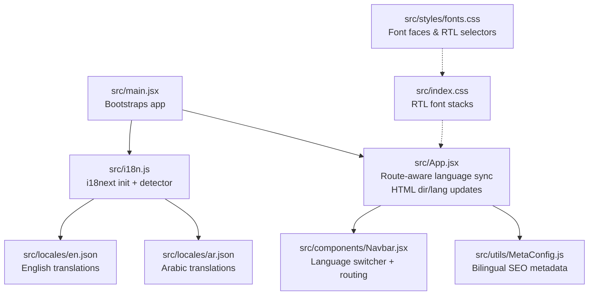
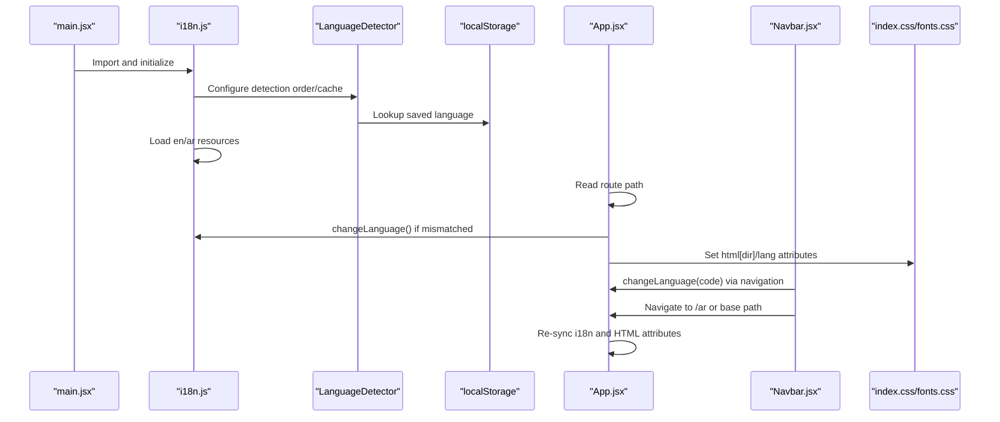
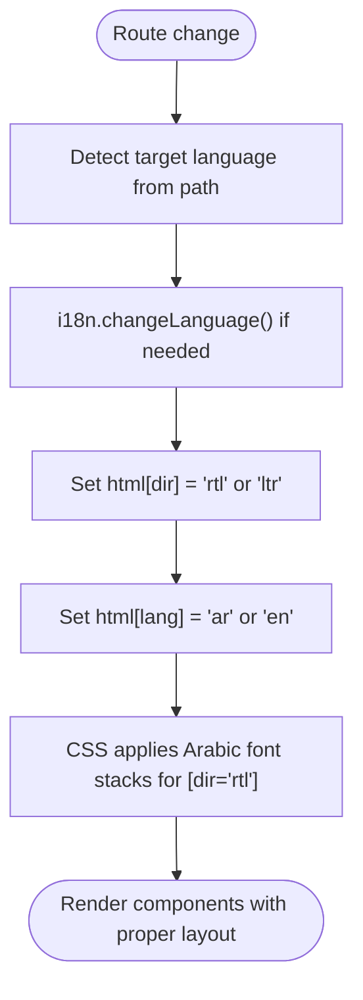
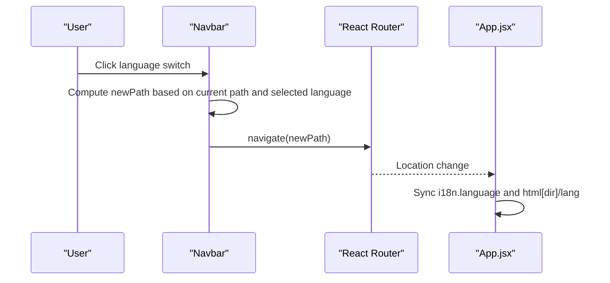
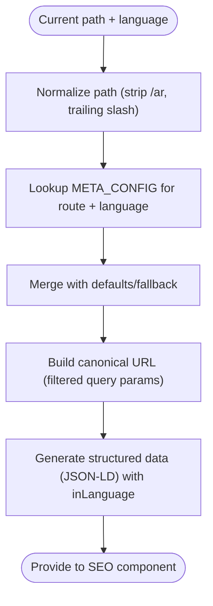
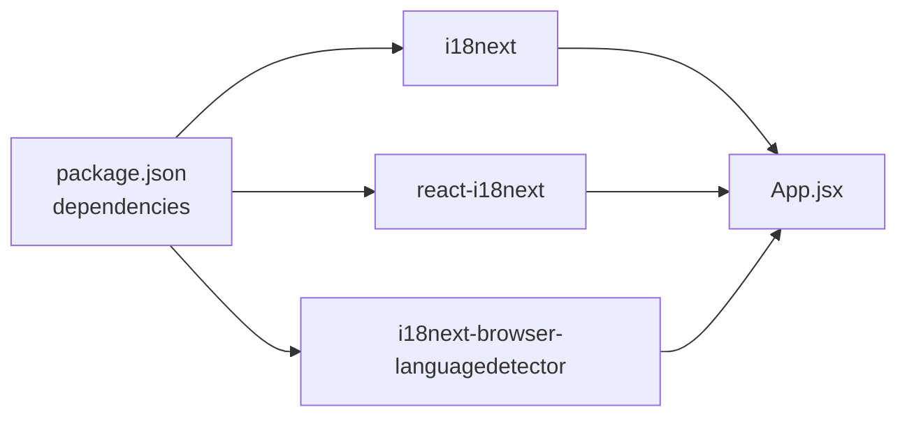

# Internationalization (i18n)

<cite>
**Referenced Files in This Document**
- [src/i18n.js](file://src/i18n.js)
- [src/locales/en.json](file://src/locales/en.json)
- [src/locales/ar.json](file://src/locales/ar.json)
- [src/App.jsx](file://src/App.jsx)
- [src/main.jsx](file://src/main.jsx)
- [src/components/Navbar.jsx](file://src/components/Navbar.jsx)
- [src/index.css](file://src/index.css)
- [src/styles/fonts.css](file://src/styles/fonts.css)
- [src/utils/MetaConfig.js](file://src/utils/MetaConfig.js)
- [src/utils/MetaConfig.test.js](file://src/utils/MetaConfig.test.js)
- [package.json](file://package.json)
</cite>

## Table of Contents
1. [Introduction](#introduction)
2. [Project Structure](#project-structure)
3. [Core Components](#core-components)
4. [Architecture Overview](#architecture-overview)
5. [Detailed Component Analysis](#detailed-component-analysis)
6. [Dependency Analysis](#dependency-analysis)
7. [Performance Considerations](#performance-considerations)
8. [Troubleshooting Guide](#troubleshooting-guide)
9. [Conclusion](#conclusion)
10. [Appendices](#appendices)

## Introduction
This document explains the internationalization (i18n) system for the landing page, focusing on the i18next configuration, automatic language detection, translation resource management, and Arabic language support including right-to-left (RTL) layout handling, dynamic language switching, and locale-aware metadata. It also provides practical guidance for adding new translations, building language-specific components, handling bidirectional text, and testing strategies for both English and Arabic.

## Project Structure
The i18n system is centered around a small set of files:
- i18next initialization and detection configuration
- Translation JSON resources for English and Arabic
- Application-wide language synchronization and HTML direction/lang attributes
- Navbar language switcher and routing integration
- CSS and font stacks for Latin and Arabic
- SEO metadata configuration supporting bilingual pages

**Diagram sources**
- [src/main.jsx](file://src/main.jsx#L1-L12)
- [src/i18n.js](file://src/i18n.js#L1-L45)
- [src/locales/en.json](file://src/locales/en.json#L1-L414)
- [src/locales/ar.json](file://src/locales/ar.json#L1-L414)
- [src/App.jsx](file://src/App.jsx#L74-L144)
- [src/components/Navbar.jsx](file://src/components/Navbar.jsx#L39-L57)
- [src/utils/MetaConfig.js](file://src/utils/MetaConfig.js#L19-L180)
- [src/index.css](file://src/index.css#L32-L90)
- [src/styles/fonts.css](file://src/styles/fonts.css#L190-L224)

**Section sources**
- [src/main.jsx](file://src/main.jsx#L1-L12)
- [src/i18n.js](file://src/i18n.js#L1-L45)
- [src/locales/en.json](file://src/locales/en.json#L1-L414)
- [src/locales/ar.json](file://src/locales/ar.json#L1-L414)
- [src/App.jsx](file://src/App.jsx#L74-L144)
- [src/components/Navbar.jsx](file://src/components/Navbar.jsx#L39-L57)
- [src/index.css](file://src/index.css#L32-L90)
- [src/styles/fonts.css](file://src/styles/fonts.css#L190-L224)
- [src/utils/MetaConfig.js](file://src/utils/MetaConfig.js#L19-L180)

## Core Components
- i18next configuration and detector
  - Initializes resources for English and Arabic
  - Uses browser language detection with localStorage caching
  - Applies a whitelist check and fallback to English
  - Biases initial Arabic preference for Arabic-speaking locales if no saved preference exists

- Translation resources
  - English and Arabic JSON files under src/locales
  - Hierarchical keys covering SEO, navigation, hero, services, portfolio, tech stack, contact, footer, about, services_page, blog, legal, and labs

- Application language synchronization
  - Detects language from URL path and synchronizes i18n
  - Updates document.documentElement.dir and lang attributes for RTL/LTR
  - Ensures theme color and layout adapt accordingly

- Language switcher and routing
  - Navbar presents language options and navigates to corresponding paths
  - App.jsx listens to route changes and keeps language and HTML attributes in sync

- Fonts and RTL styling
  - CSS defines font stacks for Latin and Arabic
  - RTL selectors adjust typography and transforms for Arabic

- Bilingual SEO metadata
  - Centralized metadata configuration with EN/AR variants
  - Generates canonical URLs and structured data with appropriate language

**Section sources**
- [src/i18n.js](file://src/i18n.js#L7-L40)
- [src/locales/en.json](file://src/locales/en.json#L1-L414)
- [src/locales/ar.json](file://src/locales/ar.json#L1-L414)
- [src/App.jsx](file://src/App.jsx#L117-L143)
- [src/components/Navbar.jsx](file://src/components/Navbar.jsx#L39-L57)
- [src/index.css](file://src/index.css#L32-L90)
- [src/styles/fonts.css](file://src/styles/fonts.css#L190-L224)
- [src/utils/MetaConfig.js](file://src/utils/MetaConfig.js#L19-L180)

## Architecture Overview
The i18n pipeline integrates initialization, detection, resource loading, runtime synchronization, and presentation updates.

**Diagram sources**
- [src/main.jsx](file://src/main.jsx#L1-L12)
- [src/i18n.js](file://src/i18n.js#L14-L33)
- [src/App.jsx](file://src/App.jsx#L117-L143)
- [src/components/Navbar.jsx](file://src/components/Navbar.jsx#L39-L57)
- [src/index.css](file://src/index.css#L32-L90)
- [src/styles/fonts.css](file://src/styles/fonts.css#L190-L224)

## Detailed Component Analysis

### i18next Configuration and Detection
- Resources are loaded from JSON files for English and Arabic
- Fallback language is English
- Detection order prioritizes localStorage, then navigator, then HTML tag and cookie
- Whitelist checking is enabled
- Initial Arabic preference is applied when no saved language and navigator indicates Arabic locales

**Diagram sources**
- [src/i18n.js](file://src/i18n.js#L14-L40)

**Section sources**
- [src/i18n.js](file://src/i18n.js#L14-L40)

### Translation Resource Management
- Keys are organized by functional areas (SEO, navbar, hero, services, portfolio, contact, footer, about, services_page, blog, legal, labs)
- Both English and Arabic files mirror the same structure
- Use hierarchical keys to keep related strings grouped and maintainable

Practical tips:
- Keep key names consistent across languages
- Prefer sentence fragments for flexibility (e.g., separate headline parts)
- Use arrays for lists (e.g., FAQ items) to support iteration

**Section sources**
- [src/locales/en.json](file://src/locales/en.json#L1-L414)
- [src/locales/ar.json](file://src/locales/ar.json#L1-L414)

### Arabic Language Support and RTL Layout
- HTML direction and language attributes are synchronized with the current language
- CSS applies Arabic font stacks when dir="rtl"
- Typography adjustments for Arabic (line-height, letter-spacing) improve readability
- Utility transforms (e.g., flip icons) support mirrored layouts

**Diagram sources**
- [src/App.jsx](file://src/App.jsx#L117-L143)
- [src/index.css](file://src/index.css#L32-L90)
- [src/styles/fonts.css](file://src/styles/fonts.css#L190-L224)

**Section sources**
- [src/App.jsx](file://src/App.jsx#L117-L143)
- [src/index.css](file://src/index.css#L32-L90)
- [src/styles/fonts.css](file://src/styles/fonts.css#L190-L224)

### Dynamic Language Switching
- The Navbar component exposes language options and computes the destination path
- On selection, it navigates to either the Arabic or base path
- App.jsx observes route changes and ensures i18n and HTML attributes stay in sync

**Diagram sources**
- [src/components/Navbar.jsx](file://src/components/Navbar.jsx#L39-L57)
- [src/App.jsx](file://src/App.jsx#L117-L143)

**Section sources**
- [src/components/Navbar.jsx](file://src/components/Navbar.jsx#L39-L57)
- [src/App.jsx](file://src/App.jsx#L117-L143)

### Locale-Aware Formatting and SEO
- Metadata configuration provides bilingual titles, descriptions, keywords, and images
- Canonical URLs are constructed with proper normalization and query parameter filtering
- Structured data includes language-specific fields and breadcrumbs

**Diagram sources**
- [src/utils/MetaConfig.js](file://src/utils/MetaConfig.js#L250-L295)

**Section sources**
- [src/utils/MetaConfig.js](file://src/utils/MetaConfig.js#L19-L180)
- [src/utils/MetaConfig.js](file://src/utils/MetaConfig.js#L250-L295)

### Practical Examples

- Adding new translations
  - Extend the English JSON with new keys following existing hierarchy
  - Mirror the keys in the Arabic JSON with translated values
  - Reference keys in components via the translation hook

- Implementing language-specific components
  - Use the current language to conditionally render content or adjust layout
  - Keep directional and alignment logic consistent with html[dir]

- Handling bidirectional text
  - Ensure text direction is controlled by html[dir]
  - Use CSS utilities for mirroring (e.g., flipping icons) and typography adjustments

- Testing strategies
  - Unit tests validate canonical URL normalization and query parameter handling
  - Manual verification includes navigating between / and /ar, confirming fonts and layout, and checking metadata

**Section sources**
- [src/locales/en.json](file://src/locales/en.json#L1-L414)
- [src/locales/ar.json](file://src/locales/ar.json#L1-L414)
- [src/App.jsx](file://src/App.jsx#L117-L143)
- [src/utils/MetaConfig.test.js](file://src/utils/MetaConfig.test.js#L1-L54)

## Dependency Analysis
External libraries involved in i18n:
- i18next for core internationalization
- react-i18next for React integration
- i18next-browser-languagedetector for automatic detection

**Diagram sources**
- [package.json](file://package.json#L16-L31)
- [src/i18n.js](file://src/i18n.js#L1-L3)
- [src/App.jsx](file://src/App.jsx#L1-L10)

**Section sources**
- [package.json](file://package.json#L16-L31)
- [src/i18n.js](file://src/i18n.js#L1-L3)
- [src/App.jsx](file://src/App.jsx#L1-L10)

## Performance Considerations
- Translation resources are bundled statically; consider code splitting or dynamic imports if the dictionary grows large
- Font loading uses progressive enhancement with system fonts as immediate fallbacks; ensure custom fonts are sized appropriately to minimize layout shifts
- Keep metadata generation efficient; memoize computed values where possible

## Troubleshooting Guide
Common issues and resolutions:
- Language not persisting across sessions
  - Verify localStorage cache is enabled and keys match the configured lookup
  - Confirm detection order includes localStorage

- Incorrect direction or font stacking
  - Ensure html[dir] and html[lang] are updated on route changes
  - Check CSS selectors for [dir="rtl"] and font stacks

- Mixed content in Arabic vs English
  - Confirm keys exist in both language files
  - Validate that components render the correct language variant

- SEO metadata inconsistencies
  - Review canonical URL normalization and query parameter filtering
  - Validate structured data generation for the active language

**Section sources**
- [src/i18n.js](file://src/i18n.js#L26-L33)
- [src/App.jsx](file://src/App.jsx#L117-L143)
- [src/index.css](file://src/index.css#L32-L90)
- [src/utils/MetaConfig.js](file://src/utils/MetaConfig.js#L250-L295)

## Conclusion
The i18n system combines a straightforward i18next setup with robust language detection, synchronized HTML attributes for RTL support, and comprehensive bilingual metadata. The Navbar enables seamless language switching, while CSS and font configurations ensure readable, culturally appropriate typography. Following the guidelines herein will help maintain translation consistency and expand support across additional locales.

## Appendices

### Guidelines for Maintaining Translation Consistency
- Keep key naming consistent across languages
- Group related keys under shared parent namespaces
- Avoid embedding language-specific formatting inside translation strings
- Test both languages after any structural changes to translation keys

### Example: Adding a New Feature Page Translation
- Add new keys under a dedicated namespace in both English and Arabic JSON files
- Reference the keys in the new page component
- Update SEO metadata configuration if the page needs localized titles, descriptions, or keywords

**Section sources**
- [src/locales/en.json](file://src/locales/en.json#L1-L414)
- [src/locales/ar.json](file://src/locales/ar.json#L1-L414)
- [src/utils/MetaConfig.js](file://src/utils/MetaConfig.js#L19-L180)