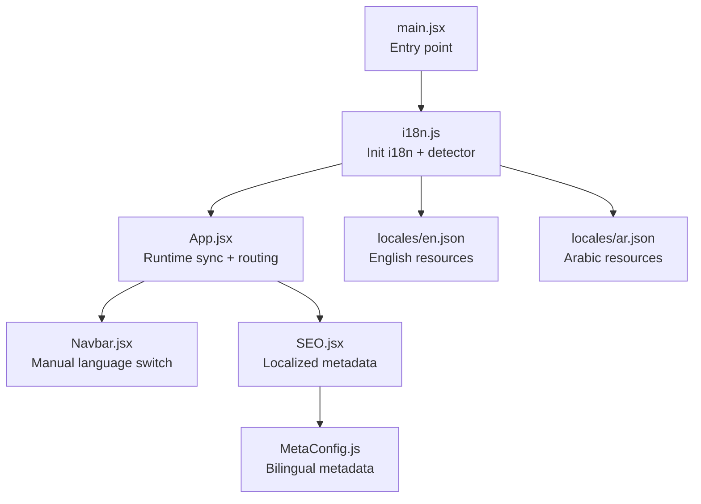
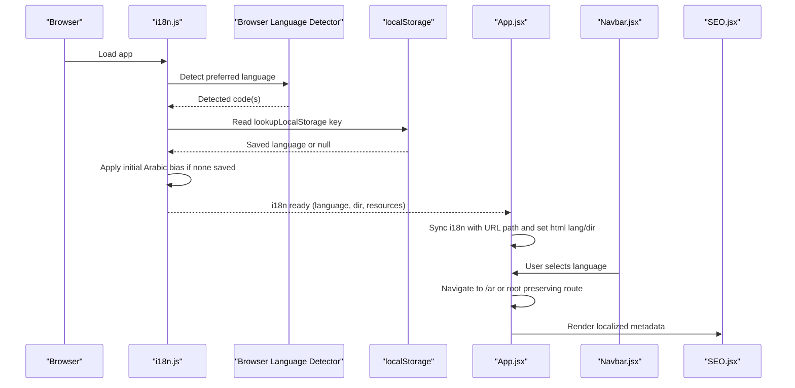
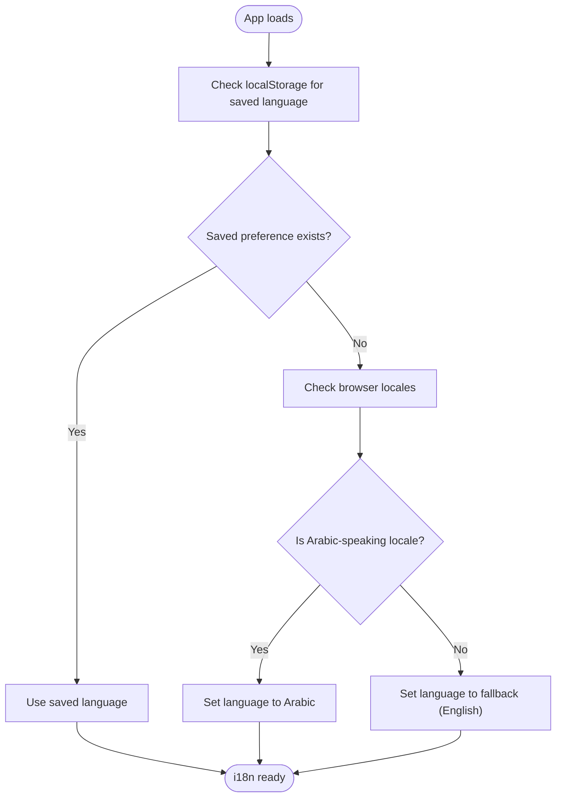
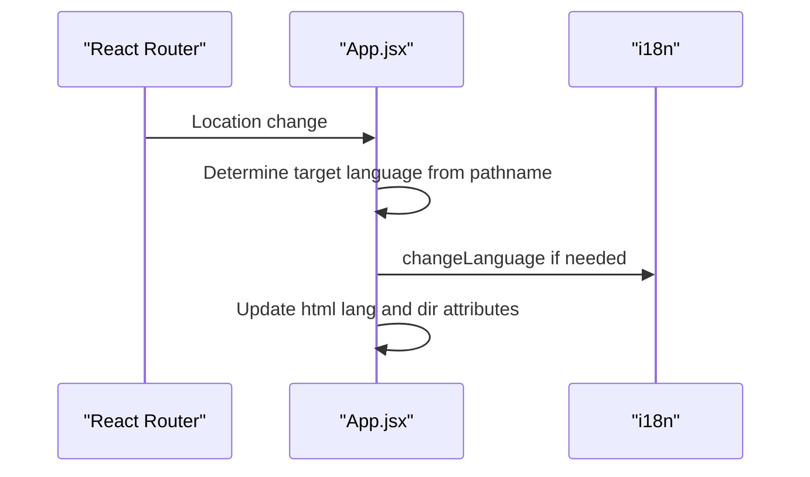
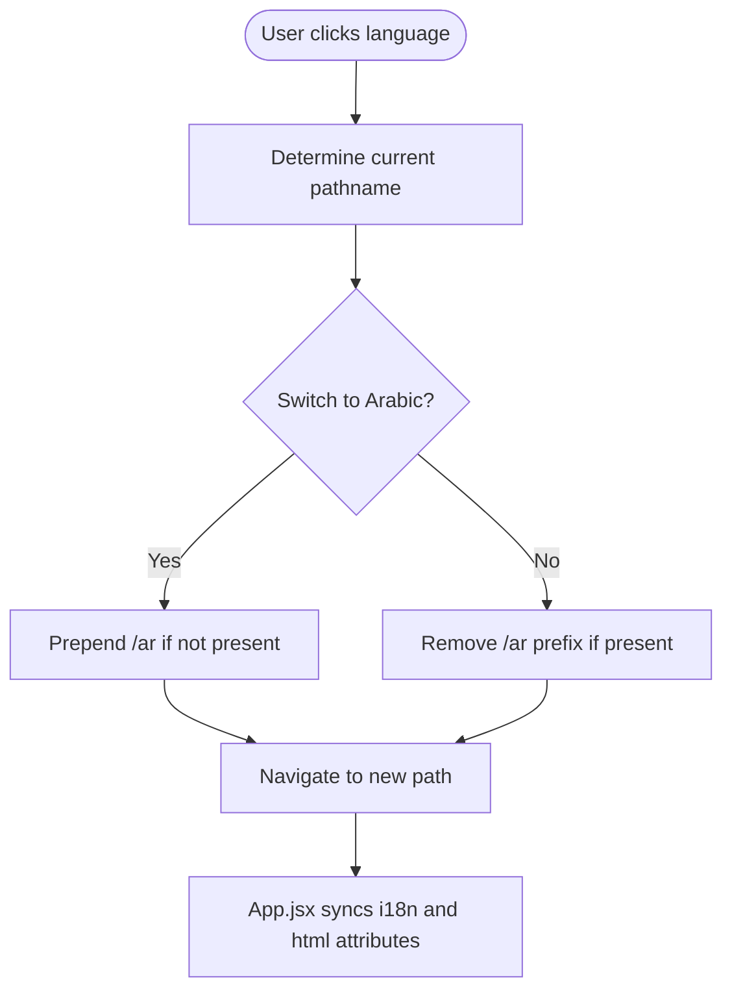
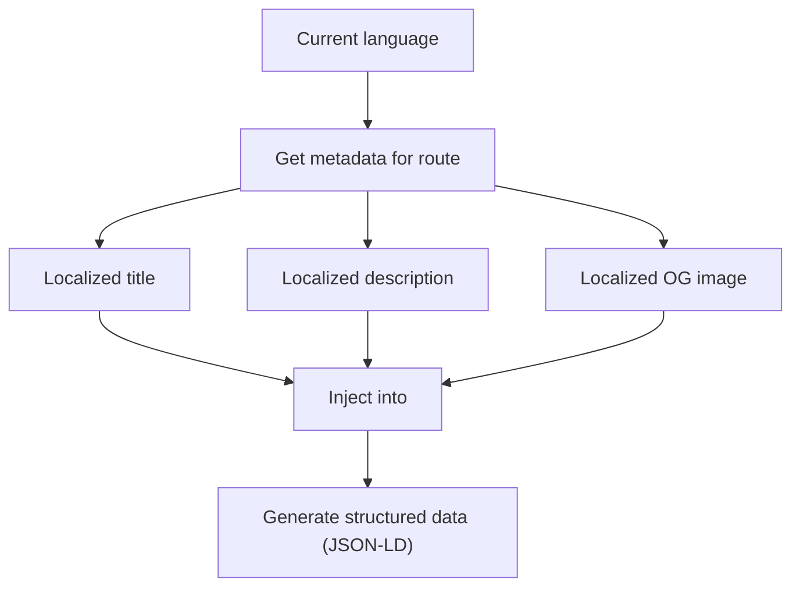
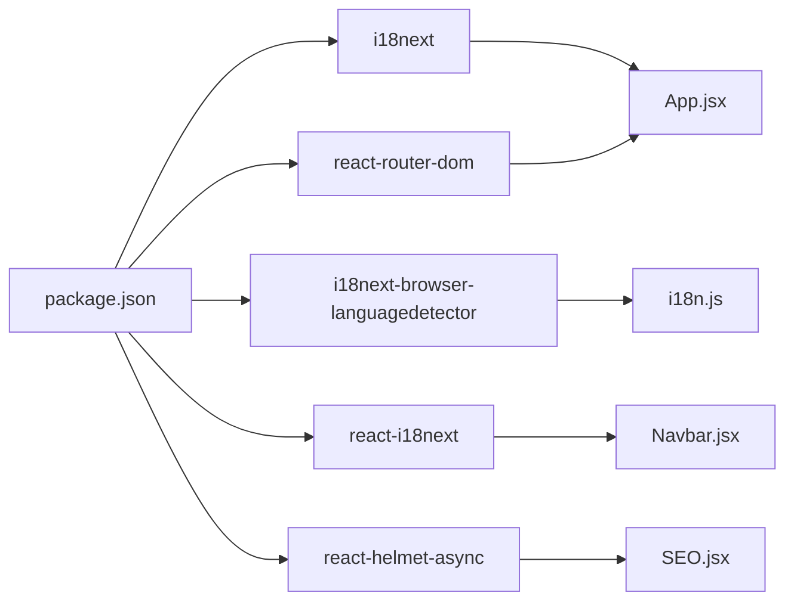

# Language Detection and Preferences

<cite>
**Referenced Files in This Document**
- [src/i18n.js](file://src/i18n.js)
- [src/App.jsx](file://src/App.jsx)
- [src/components/Navbar.jsx](file://src/components/Navbar.jsx)
- [src/components/SEO.jsx](file://src/components/SEO.jsx)
- [src/hooks/useMetadata.js](file://src/hooks/useMetadata.js)
- [src/utils/MetaConfig.js](file://src/utils/MetaConfig.js)
- [src/locales/en.json](file://src/locales/en.json)
- [src/locales/ar.json](file://src/locales/ar.json)
- [src/main.jsx](file://src/main.jsx)
- [package.json](file://package.json)
</cite>

## Table of Contents
1. [Introduction](#introduction)
2. [Project Structure](#project-structure)
3. [Core Components](#core-components)
4. [Architecture Overview](#architecture-overview)
5. [Detailed Component Analysis](#detailed-component-analysis)
6. [Dependency Analysis](#dependency-analysis)
7. [Performance Considerations](#performance-considerations)
8. [Troubleshooting Guide](#troubleshooting-guide)
9. [Conclusion](#conclusion)

## Introduction
This document explains the automatic language detection and user preferences system for the landing page. It covers the detection order, localStorage caching, browser language detection logic, Arabic-region bias, whitelist checks, fallback handling, and practical customization patterns for manual language switching. It also addresses browser compatibility, user preference persistence, detection accuracy optimization, and troubleshooting.

## Project Structure
The language system spans initialization, runtime synchronization, UI controls, and SEO metadata generation:
- Initialization and detection: i18n setup, detection order, and initial Arabic bias
- Runtime synchronization: URL path and document direction/language attributes
- Manual switching: Navbar language selector and navigation logic
- SEO and metadata: localized metadata and structured data
- Locale resources: English and Arabic translation bundles

**Diagram sources**
- [src/main.jsx](file://src/main.jsx#L1-L12)
- [src/i18n.js](file://src/i18n.js#L1-L45)
- [src/App.jsx](file://src/App.jsx#L74-L144)
- [src/components/Navbar.jsx](file://src/components/Navbar.jsx#L39-L57)
- [src/components/SEO.jsx](file://src/components/SEO.jsx#L7-L278)
- [src/utils/MetaConfig.js](file://src/utils/MetaConfig.js#L19-L295)
- [src/locales/en.json](file://src/locales/en.json#L1-L414)
- [src/locales/ar.json](file://src/locales/ar.json#L1-L414)

**Section sources**
- [src/main.jsx](file://src/main.jsx#L1-L12)
- [src/i18n.js](file://src/i18n.js#L1-L45)
- [src/App.jsx](file://src/App.jsx#L74-L144)
- [src/components/Navbar.jsx](file://src/components/Navbar.jsx#L39-L57)
- [src/components/SEO.jsx](file://src/components/SEO.jsx#L7-L278)
- [src/utils/MetaConfig.js](file://src/utils/MetaConfig.js#L19-L295)
- [src/locales/en.json](file://src/locales/en.json#L1-L414)
- [src/locales/ar.json](file://src/locales/ar.json#L1-L414)

## Core Components
- i18n initialization and detection
  - Uses i18next with react-i18next and i18next-browser-languagedetector
  - Defines detection order, localStorage caching, whitelist checking, and fallback language
  - Applies an initial Arabic bias based on browser locales if no saved preference exists
- Runtime language synchronization
  - Synchronizes i18n language with URL path and sets HTML lang/dir attributes
- Manual language switching
  - Navbar provides language toggle that navigates to /ar or root while preserving route context
- SEO and metadata
  - Generates localized metadata and structured data based on current language
  - Provides default OG images per language and validates metadata in development

**Section sources**
- [src/i18n.js](file://src/i18n.js#L14-L40)
- [src/App.jsx](file://src/App.jsx#L117-L143)
- [src/components/Navbar.jsx](file://src/components/Navbar.jsx#L39-L57)
- [src/components/SEO.jsx](file://src/components/SEO.jsx#L7-L278)
- [src/utils/MetaConfig.js](file://src/utils/MetaConfig.js#L19-L295)

## Architecture Overview
The language detection pipeline integrates initialization, runtime synchronization, and UI-driven switching.

**Diagram sources**
- [src/i18n.js](file://src/i18n.js#L14-L40)
- [src/App.jsx](file://src/App.jsx#L117-L143)
- [src/components/Navbar.jsx](file://src/components/Navbar.jsx#L39-L57)
- [src/components/SEO.jsx](file://src/components/SEO.jsx#L7-L278)

## Detailed Component Analysis

### i18n Initialization and Detection
- Detection order: localStorage, navigator, htmlTag, cookie
- Caching: localStorage is used for persistence
- Whitelist: Enabled to restrict supported languages
- Fallback: English is configured as fallback
- Initial Arabic bias: If no localStorage preference exists, detects Arabic-speaking locales and switches to Arabic on first visit

**Diagram sources**
- [src/i18n.js](file://src/i18n.js#L26-L40)

**Section sources**
- [src/i18n.js](file://src/i18n.js#L14-L40)

### Runtime Language Synchronization
- URL-based language detection: If URL starts with /ar, language becomes Arabic; otherwise English
- Synchronizes i18n language and updates document HTML attributes (lang and direction)
- Ensures theme color and other UI behaviors align with language direction

**Diagram sources**
- [src/App.jsx](file://src/App.jsx#L117-L143)

**Section sources**
- [src/App.jsx](file://src/App.jsx#L117-L143)

### Manual Language Switching
- Navbar exposes a language switcher with English and Arabic
- Navigation logic:
  - Switching to Arabic: prepends /ar to current path (or uses root if already at root)
  - Switching to English: removes /ar prefix (or stays at root)
- After navigation, App.jsx synchronizes language and HTML attributes

**Diagram sources**
- [src/components/Navbar.jsx](file://src/components/Navbar.jsx#L39-L57)
- [src/App.jsx](file://src/App.jsx#L117-L143)

**Section sources**
- [src/components/Navbar.jsx](file://src/components/Navbar.jsx#L39-L57)
- [src/App.jsx](file://src/App.jsx#L117-L143)

### Arabic-Language Bias for Arabic-Speaking Regions
- Initial bias logic inspects navigator languages and compares against a curated list of Arabic locales
- If any match is found and no localStorage preference exists, the system defaults to Arabic on first visit
- This improves perceived relevance for users in Arabic-speaking countries

**Section sources**
- [src/i18n.js](file://src/i18n.js#L7-L12)
- [src/i18n.js](file://src/i18n.js#L36-L40)

### Whitelist Checking and Fallback Language Handling
- Whitelist checking ensures only supported languages are accepted during detection
- Fallback language is English, ensuring graceful degradation when detection fails or whitelist filtering rejects a code

**Section sources**
- [src/i18n.js](file://src/i18n.js#L26-L32)

### Browser Language Detection Logic
- Uses i18next-browser-languagedetector with a deterministic order
- Reads from navigator, htmlTag, and cookie if configured
- Persists detected language to localStorage for subsequent visits

**Section sources**
- [src/i18n.js](file://src/i18n.js#L14-L31)

### SEO and Metadata Localization
- SEO component generates localized metadata and structured data based on current language
- Uses centralized metadata configuration with bilingual entries
- Provides default OG images per language and validates metadata in development

**Diagram sources**
- [src/components/SEO.jsx](file://src/components/SEO.jsx#L7-L278)
- [src/utils/MetaConfig.js](file://src/utils/MetaConfig.js#L250-L295)

**Section sources**
- [src/components/SEO.jsx](file://src/components/SEO.jsx#L7-L278)
- [src/utils/MetaConfig.js](file://src/utils/MetaConfig.js#L19-L295)

### Practical Examples and Customization Patterns
- Customize detection preferences
  - Adjust detection order, lookup keys, and caches in the i18n initialization
  - Enable or disable whitelist checking and configure supported languages
- Implement manual language switching
  - Extend the Navbar language switcher to add more languages
  - Preserve route context when navigating between /ar and root
- Handle edge cases
  - If localStorage is disabled, the system falls back to browser detection and whitelist filtering
  - If no browser language is detected, the fallback language is applied
  - Ensure html lang and dir attributes are updated consistently with language changes

**Section sources**
- [src/i18n.js](file://src/i18n.js#L26-L32)
- [src/components/Navbar.jsx](file://src/components/Navbar.jsx#L39-L57)
- [src/App.jsx](file://src/App.jsx#L117-L143)

## Dependency Analysis
- Dependencies involved in language detection and preferences:
  - i18next and react-i18next for translation and hooks
  - i18next-browser-languagedetector for browser language detection
  - react-router-dom for URL-based language routing
  - react-helmet-async for SEO metadata injection

**Diagram sources**
- [package.json](file://package.json#L16-L31)
- [src/i18n.js](file://src/i18n.js#L1-L3)
- [src/App.jsx](file://src/App.jsx#L1-L16)
- [src/components/Navbar.jsx](file://src/components/Navbar.jsx#L1-L8)
- [src/components/SEO.jsx](file://src/components/SEO.jsx#L1-L6)

**Section sources**
- [package.json](file://package.json#L16-L31)

## Performance Considerations
- Keep detection order minimal to reduce overhead
- Persist language in localStorage to avoid repeated detection on subsequent visits
- Avoid unnecessary re-renders by synchronizing language changes with URL updates efficiently
- Ensure metadata generation is lightweight and cached where appropriate

## Troubleshooting Guide
- Language does not persist across sessions
  - Verify localStorage availability and that the lookup key matches the configured value
  - Confirm that the cache option includes localStorage
- Language does not switch when clicking the Navbar language switcher
  - Ensure the navigation logic correctly prepends/removes /ar and that App.jsx synchronizes i18n and HTML attributes
- Arabic bias not triggering for users in Arabic-speaking regions
  - Confirm the browser locale list includes the detected locale and that whitelist filtering permits Arabic
- SEO metadata not localized
  - Check that the current language is correctly determined and that the metadata configuration includes bilingual entries
- Fallback language not applied
  - Verify the fallback language is configured and that whitelist filtering is not excluding the fallback code

**Section sources**
- [src/i18n.js](file://src/i18n.js#L26-L32)
- [src/components/Navbar.jsx](file://src/components/Navbar.jsx#L39-L57)
- [src/App.jsx](file://src/App.jsx#L117-L143)
- [src/components/SEO.jsx](file://src/components/SEO.jsx#L7-L278)

## Conclusion
The language detection and preferences system combines automatic detection with user control and persistence. It applies an initial Arabic bias for Arabic-speaking regions, respects whitelist constraints, and ensures a smooth user experience through URL-based synchronization and manual switching. The SEO layer further reinforces localization with bilingual metadata and structured data.