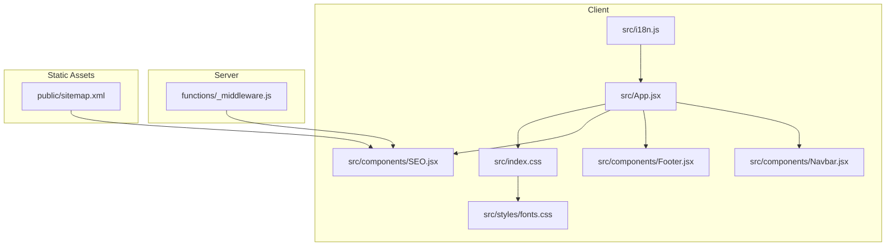
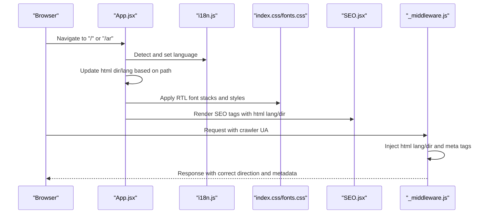
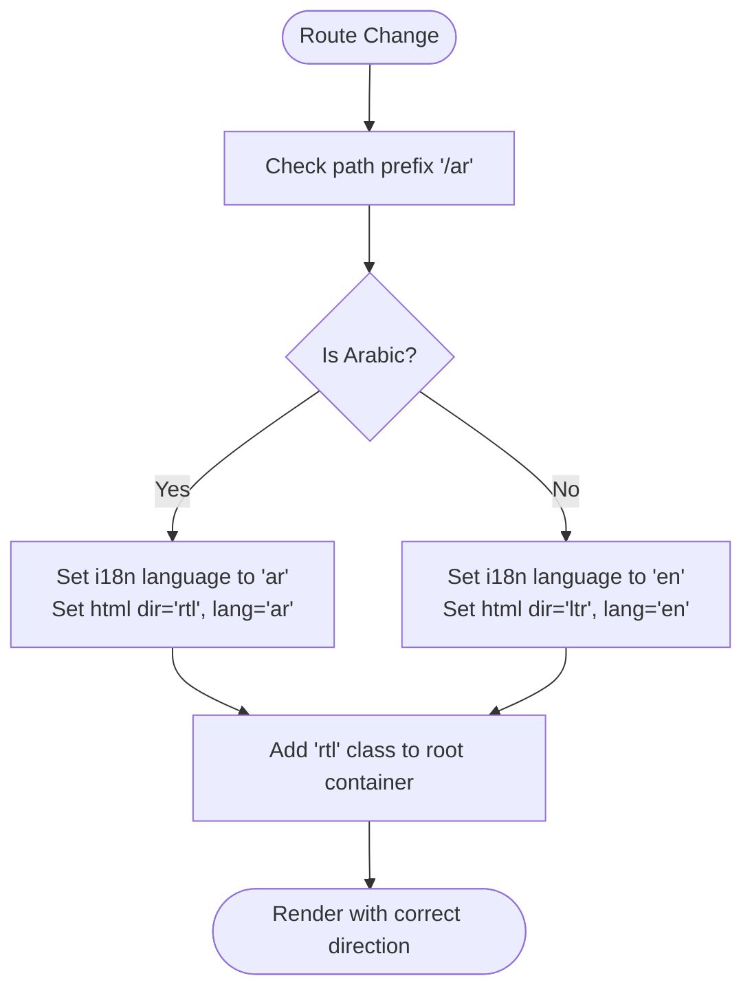
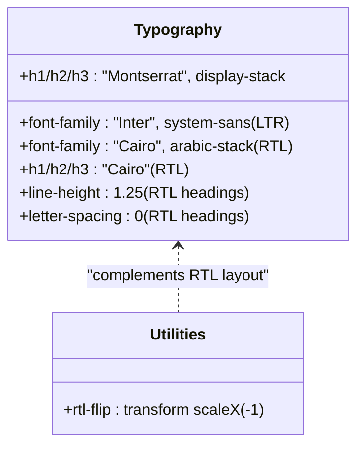
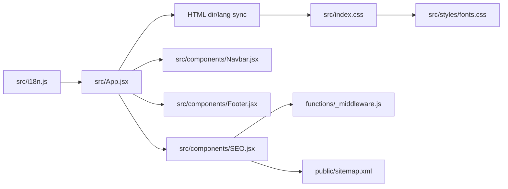

# Right-to-Left (RTL) Layout Support

<cite>
**Referenced Files in This Document**
- [src/i18n.js](file://src/i18n.js)
- [src/locales/ar.json](file://src/locales/ar.json)
- [src/locales/en.json](file://src/locales/en.json)
- [src/App.jsx](file://src/App.jsx)
- [src/index.css](file://src/index.css)
- [src/styles/fonts.css](file://src/styles/fonts.css)
- [tailwind.config.js](file://tailwind.config.js)
- [src/components/Navbar.jsx](file://src/components/Navbar.jsx)
- [src/components/Footer.jsx](file://src/components/Footer.jsx)
- [src/components/SEO.jsx](file://src/components/SEO.jsx)
- [functions/_middleware.js](file://functions/_middleware.js)
- [public/sitemap.xml](file://public/sitemap.xml)
</cite>

## Table of Contents
1. [Introduction](#introduction)
2. [Project Structure](#project-structure)
3. [Core Components](#core-components)
4. [Architecture Overview](#architecture-overview)
5. [Detailed Component Analysis](#detailed-component-analysis)
6. [Dependency Analysis](#dependency-analysis)
7. [Performance Considerations](#performance-considerations)
8. [Troubleshooting Guide](#troubleshooting-guide)
9. [Conclusion](#conclusion)
10. [Appendices](#appendices)

## Introduction
This document explains how the project implements right-to-left (RTL) layout support and Arabic language features. It covers direction attribute handling, CSS considerations for RTL, component adaptations for Arabic text direction, font rendering optimizations for Arabic characters, text alignment adjustments, responsive design considerations for RTL interfaces, practical examples of RTL-compatible components, handling mixed text directions, testing RTL functionality, common RTL layout challenges, browser-specific behaviors, and accessibility considerations.

## Project Structure
The RTL implementation spans internationalization configuration, CSS and font stacks, client-side routing and direction synchronization, server-side metadata injection for crawlers, and multilingual sitemaps.

**Diagram sources**
- [src/i18n.js](file://src/i18n.js#L1-L45)
- [src/App.jsx](file://src/App.jsx#L74-L309)
- [src/components/Navbar.jsx](file://src/components/Navbar.jsx#L1-L337)
- [src/components/Footer.jsx](file://src/components/Footer.jsx#L1-L80)
- [src/components/SEO.jsx](file://src/components/SEO.jsx#L1-L278)
- [src/index.css](file://src/index.css#L1-L246)
- [src/styles/fonts.css](file://src/styles/fonts.css#L1-L224)
- [functions/_middleware.js](file://functions/_middleware.js#L1-L383)
- [public/sitemap.xml](file://public/sitemap.xml#L1-L149)

**Section sources**
- [src/i18n.js](file://src/i18n.js#L1-L45)
- [src/App.jsx](file://src/App.jsx#L74-L309)
- [src/index.css](file://src/index.css#L1-L246)
- [src/styles/fonts.css](file://src/styles/fonts.css#L1-L224)
- [functions/_middleware.js](file://functions/_middleware.js#L1-L383)
- [public/sitemap.xml](file://public/sitemap.xml#L1-L149)

## Core Components
- Internationalization and language detection: initializes i18n with Arabic and English resources, detects browser language, and sets initial language preference for Arabic locales.
- Direction synchronization: synchronizes document direction and language attributes with the current route (/ar for Arabic).
- CSS and fonts: defines system font stacks for Latin and Arabic, applies Cairo for RTL, and adjusts typography for Arabic.
- Navigation and footer: adapt text alignment, layout, and spacing for RTL using direction-aware classes and inline direction attributes.
- SEO and crawler compatibility: injects html lang and dir attributes server-side for crawlers and renders hreflang alternates.
- Sitemap: provides multilingual alternate URLs for search engines.

**Section sources**
- [src/i18n.js](file://src/i18n.js#L1-L45)
- [src/App.jsx](file://src/App.jsx#L117-L143)
- [src/index.css](file://src/index.css#L24-L87)
- [src/styles/fonts.css](file://src/styles/fonts.css#L22-L199)
- [src/components/Navbar.jsx](file://src/components/Navbar.jsx#L73-L187)
- [src/components/Footer.jsx](file://src/components/Footer.jsx#L11-L76)
- [src/components/SEO.jsx](file://src/components/SEO.jsx#L225-L274)
- [functions/_middleware.js](file://functions/_middleware.js#L228-L263)
- [public/sitemap.xml](file://public/sitemap.xml#L1-L149)

## Architecture Overview
The RTL pipeline integrates client-side direction synchronization, CSS/typographic adaptation, and server-side metadata injection for crawlers.

**Diagram sources**
- [src/App.jsx](file://src/App.jsx#L117-L143)
- [src/i18n.js](file://src/i18n.js#L14-L40)
- [src/index.css](file://src/index.css#L24-L87)
- [src/styles/fonts.css](file://src/styles/fonts.css#L22-L199)
- [src/components/SEO.jsx](file://src/components/SEO.jsx#L225-L274)
- [functions/_middleware.js](file://functions/_middleware.js#L228-L263)

## Detailed Component Analysis

### Internationalization and Language Detection
- Initializes i18n with English and Arabic resources.
- Detects Arabic locales from the browser and sets initial language if none is stored.
- Uses localStorage to persist language preference and caches detection.

**Section sources**
- [src/i18n.js](file://src/i18n.js#L1-L45)

### Direction Attribute Handling and Route Synchronization
- Watches route changes and updates document.documentElement.dir and lang to match the path prefix (/ar for Arabic).
- Applies a direction class to the root container for component-level styling.
- Ensures theme color meta is set appropriately.

**Diagram sources**
- [src/App.jsx](file://src/App.jsx#L117-L143)

**Section sources**
- [src/App.jsx](file://src/App.jsx#L117-L143)

### CSS Considerations for RTL Layouts
- Defines system font stacks for Latin and Arabic.
- Applies Cairo for RTL contexts and adjusts heading families.
- Adjusts line-height and letter-spacing for Arabic headings.
- Provides a utility to flip icons in RTL (e.g., chevrons).

**Diagram sources**
- [src/index.css](file://src/index.css#L24-L87)
- [src/styles/fonts.css](file://src/styles/fonts.css#L22-L199)

**Section sources**
- [src/index.css](file://src/index.css#L24-L87)
- [src/styles/fonts.css](file://src/styles/fonts.css#L22-L199)

### Component Adaptations for Arabic Text Direction
- Navbar:
  - Sets dir="rtl" on desktop nav container.
  - Uses text-right and flex-row-reverse for language menu in RTL.
  - Adjusts spacing classes (e.g., ltr:ml-2 rtl:mr-2) for theme toggle.
  - Builds language-aware links (/ar prefix).
- Footer:
  - Uses text-right for paragraph alignment in RTL.
  - Reverses flex row order for footer links in RTL.

**Section sources**
- [src/components/Navbar.jsx](file://src/components/Navbar.jsx#L73-L187)
- [src/components/Navbar.jsx](file://src/components/Navbar.jsx#L190-L337)
- [src/components/Footer.jsx](file://src/components/Footer.jsx#L11-L76)

### Font Rendering Optimizations for Arabic Characters
- Uses Cairo for Arabic text with system fallbacks.
- Applies font-display: swap to avoid FOIT/FOUT.
- Provides optional font loading observer classes (.fonts-loading, .fonts-loaded, .fonts-failed) to transition gracefully when fonts are ready.

**Section sources**
- [src/styles/fonts.css](file://src/styles/fonts.css#L120-L170)
- [src/styles/fonts.css](file://src/styles/fonts.css#L175-L224)
- [src/index.css](file://src/index.css#L24-L49)

### Responsive Design Considerations for RTL Interfaces
- Mobile navigation overlays respect RTL by reversing flex directions and alignments.
- Language switching maintains correct path prefixes (/ar or root) and re-renders with appropriate direction.
- Tailwind theme supports dark mode and consistent spacing across directions.

**Section sources**
- [src/components/Navbar.jsx](file://src/components/Navbar.jsx#L233-L337)
- [tailwind.config.js](file://tailwind.config.js#L1-L47)

### Practical Examples of Implementing RTL-Compatible Components
- Direction-aware navigation:
  - Use dir attribute on containers requiring mirrored layouts.
  - Apply text alignment utilities (e.g., text-right) conditionally.
  - Reverse flex order with flex-row-reverse for RTL.
- Direction-aware buttons and icons:
  - Use rtl-flip utility to mirror directional icons.
  - Adjust margins with ltr: and rtl: variants.
- Language-aware routing:
  - Build paths with conditional prefixes (/ar or root).
  - Ensure SEO and sitemap alternates reflect both languages.

**Section sources**
- [src/components/Navbar.jsx](file://src/components/Navbar.jsx#L39-L57)
- [src/components/Navbar.jsx](file://src/components/Navbar.jsx#L140-L187)
- [src/components/Footer.jsx](file://src/components/Footer.jsx#L11-L76)
- [public/sitemap.xml](file://public/sitemap.xml#L1-L149)

### Handling Mixed Text Directions
- The project primarily serves Arabic content under /ar and English under root. Mixed-direction content within a single page is not demonstrated in the provided files.
- Recommendation: When mixing directions, use Unicode Control Characters or direction-specific HTML attributes (dir="auto") on inline elements to override parent direction.

[No sources needed since this section provides general guidance]

### Testing RTL Functionality
- Verify direction attributes:
  - Confirm documentElement.dir and lang update on navigating to /ar vs root.
- Visual inspection:
  - Check text alignment, icon mirroring, and spacing in RTL.
- Accessibility:
  - Ensure focus outlines and interactive elements remain usable.
- Crawlers:
  - Validate that server-side injection sets html dir and lang for crawlers.

**Section sources**
- [src/App.jsx](file://src/App.jsx#L117-L143)
- [functions/_middleware.js](file://functions/_middleware.js#L228-L263)

### Common RTL Layout Challenges and Browser Behaviors
- Font fallbacks: Ensure Cairo and system Arabic fonts are available; otherwise, use system fallbacks.
- Icon mirroring: Use a flip utility or transform to mirror directional icons.
- Text alignment: Prefer text-right for paragraphs and lists in RTL; avoid hardcoded margins.
- Mixed directions: Use dir="auto" for mixed-content spans.
- Browser quirks: Some browsers may render punctuation differently in RTL; test across devices.

**Section sources**
- [src/index.css](file://src/index.css#L165-L168)
- [src/styles/fonts.css](file://src/styles/fonts.css#L120-L170)

### Accessibility Considerations for RTL Languages
- Maintain focus visibility with focus-visible outlines.
- Ensure readable line-height and letter-spacing for Arabic text.
- Keep ARIA labels and roles direction-aware when building dynamic content.

**Section sources**
- [src/index.css](file://src/index.css#L96-L110)
- [src/index.css](file://src/index.css#L82-L87)

## Dependency Analysis
The RTL system depends on coordinated changes across i18n, CSS, components, SEO, and server middleware.

**Diagram sources**
- [src/i18n.js](file://src/i18n.js#L1-L45)
- [src/App.jsx](file://src/App.jsx#L117-L143)
- [src/index.css](file://src/index.css#L24-L87)
- [src/styles/fonts.css](file://src/styles/fonts.css#L22-L199)
- [src/components/Navbar.jsx](file://src/components/Navbar.jsx#L73-L187)
- [src/components/Footer.jsx](file://src/components/Footer.jsx#L11-L76)
- [src/components/SEO.jsx](file://src/components/SEO.jsx#L225-L274)
- [functions/_middleware.js](file://functions/_middleware.js#L228-L263)
- [public/sitemap.xml](file://public/sitemap.xml#L1-L149)

**Section sources**
- [src/i18n.js](file://src/i18n.js#L1-L45)
- [src/App.jsx](file://src/App.jsx#L117-L143)
- [src/components/Navbar.jsx](file://src/components/Navbar.jsx#L73-L187)
- [src/components/Footer.jsx](file://src/components/Footer.jsx#L11-L76)
- [src/components/SEO.jsx](file://src/components/SEO.jsx#L225-L274)
- [functions/_middleware.js](file://functions/_middleware.js#L228-L263)
- [public/sitemap.xml](file://public/sitemap.xml#L1-L149)

## Performance Considerations
- Font loading: font-display: swap minimizes layout shift; optional font loading observers enable transitions when fonts are ready.
- CSS specificity: keep RTL selectors minimal and scoped to reduce cascade overhead.
- Component-level direction: avoid excessive nested direction overrides; centralize via root class and targeted utilities.

**Section sources**
- [src/styles/fonts.css](file://src/styles/fonts.css#L175-L224)
- [src/index.css](file://src/index.css#L165-L168)

## Troubleshooting Guide
- Direction not updating:
  - Ensure route watcher updates html dir/lang and root container class.
- Fonts not applied in RTL:
  - Verify [dir="rtl"] selectors and Cairo availability; confirm fallbacks.
- Icons not flipped:
  - Use rtl-flip utility or transform on directional icons.
- Mixed-direction issues:
  - Apply dir="auto" to inline mixed-content spans.
- Crawler previews incorrect:
  - Confirm server-side injection sets html dir and lang and meta tags are prepended.

**Section sources**
- [src/App.jsx](file://src/App.jsx#L117-L143)
- [src/index.css](file://src/index.css#L165-L168)
- [functions/_middleware.js](file://functions/_middleware.js#L228-L263)

## Conclusion
The project implements a robust RTL solution by synchronizing direction with routes, applying Arabic font stacks, adapting components for text alignment and layout, injecting proper metadata for crawlers, and maintaining multilingual sitemaps. Following the outlined patterns ensures consistent, accessible, and performant RTL experiences across devices and languages.

## Appendices
- Example translations for Arabic and English are provided in the locales directory.
- Tailwind configuration supports dark mode and custom animations.

**Section sources**
- [src/locales/ar.json](file://src/locales/ar.json#L1-L414)
- [src/locales/en.json](file://src/locales/en.json#L1-L414)
- [tailwind.config.js](file://tailwind.config.js#L1-L47)