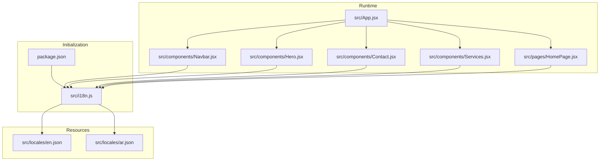
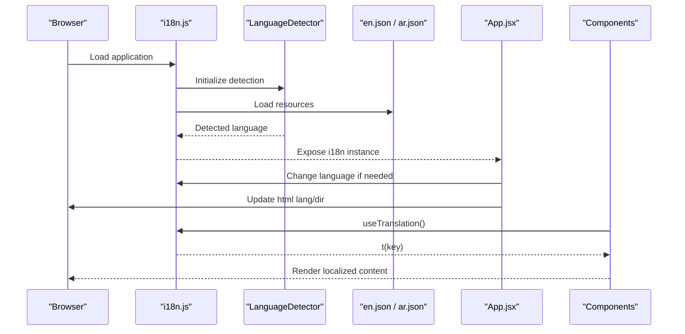
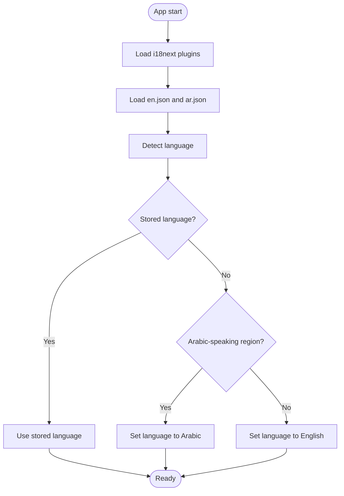
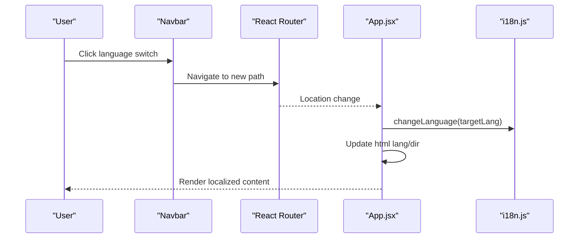
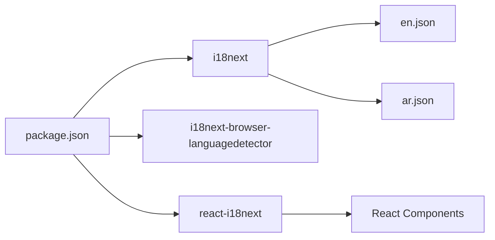

# Translation Management

<cite>
**Referenced Files in This Document**
- [src/i18n.js](file://src/i18n.js)
- [src/locales/en.json](file://src/locales/en.json)
- [src/locales/ar.json](file://src/locales/ar.json)
- [package.json](file://package.json)
- [src/App.jsx](file://src/App.jsx)
- [src/components/Navbar.jsx](file://src/components/Navbar.jsx)
- [src/components/Hero.jsx](file://src/components/Hero.jsx)
- [src/components/Contact.jsx](file://src/components/Contact.jsx)
- [src/components/Services.jsx](file://src/components/Services.jsx)
- [src/pages/HomePage.jsx](file://src/pages/HomePage.jsx)
</cite>

## Table of Contents
1. [Introduction](#introduction)
2. [Project Structure](#project-structure)
3. [Core Components](#core-components)
4. [Architecture Overview](#architecture-overview)
5. [Detailed Component Analysis](#detailed-component-analysis)
6. [Dependency Analysis](#dependency-analysis)
7. [Performance Considerations](#performance-considerations)
8. [Troubleshooting Guide](#troubleshooting-guide)
9. [Conclusion](#conclusion)
10. [Appendices](#appendices)

## Introduction
This document explains the translation management system used in the landing page application. It covers the i18next configuration, resource loading, translation file structure, and runtime usage across components. It also provides practical guidance for adding new keys, organizing hierarchies, managing consistency, handling pluralization and interpolation, validating translations, detecting missing keys, and establishing scalable workflows for large translation files.

## Project Structure
The translation system is centered around:
- A single initialization file that configures i18next, loads language detectors, and registers resources.
- Language-specific JSON files under a dedicated directory.
- React components that consume translations via the React i18next integration.
- Application-level routing and language synchronization logic.

**Diagram sources**
- [src/i18n.js](file://src/i18n.js#L1-L45)
- [src/locales/en.json](file://src/locales/en.json#L1-L414)
- [src/locales/ar.json](file://src/locales/ar.json#L1-L414)
- [src/App.jsx](file://src/App.jsx#L1-L348)
- [src/components/Navbar.jsx](file://src/components/Navbar.jsx#L1-L337)
- [src/components/Hero.jsx](file://src/components/Hero.jsx#L1-L165)
- [src/components/Contact.jsx](file://src/components/Contact.jsx#L1-L359)
- [src/components/Services.jsx](file://src/components/Services.jsx#L1-L88)
- [src/pages/HomePage.jsx](file://src/pages/HomePage.jsx#L1-L43)

**Section sources**
- [src/i18n.js](file://src/i18n.js#L1-L45)
- [src/locales/en.json](file://src/locales/en.json#L1-L414)
- [src/locales/ar.json](file://src/locales/ar.json#L1-L414)
- [src/App.jsx](file://src/App.jsx#L117-L143)
- [package.json](file://package.json#L1-L49)

## Core Components
- i18next initialization and configuration:
  - Loads language detector and React integration plugins.
  - Registers resources for English and Arabic.
  - Sets fallback language, interpolation behavior, and detection order.
  - Applies initial language preference based on browser locale for Arabic.
- Translation files:
  - Hierarchical JSON structure with nested keys for different domains (e.g., navigation, hero, services, contact).
  - Keys are organized by feature or page to improve maintainability.
- Runtime usage:
  - Components import the translation hook and render localized strings using dot notation keys.
  - Language switching updates the document direction and synchronizes routing.

Key configuration highlights:
- Detection order prioritizes persisted language, then browser detection, HTML tag, and cookie.
- Interpolation escape is disabled to allow HTML inside translations.
- Initial Arabic preference is applied when no stored language is found and the browser locale indicates Arabic-speaking regions.

**Section sources**
- [src/i18n.js](file://src/i18n.js#L14-L40)
- [src/locales/en.json](file://src/locales/en.json#L1-L414)
- [src/locales/ar.json](file://src/locales/ar.json#L1-L414)
- [src/App.jsx](file://src/App.jsx#L117-L143)

## Architecture Overview
The translation pipeline integrates initialization, resource loading, and runtime consumption across the app.

**Diagram sources**
- [src/i18n.js](file://src/i18n.js#L1-L45)
- [src/locales/en.json](file://src/locales/en.json#L1-L414)
- [src/locales/ar.json](file://src/locales/ar.json#L1-L414)
- [src/App.jsx](file://src/App.jsx#L117-L143)

## Detailed Component Analysis

### i18next Initialization and Resource Loading
- Plugins:
  - LanguageDetector: Detects language from storage, browser, HTML tag, and cookie.
  - React integration: Provides hooks and context for components.
- Resources:
  - English and Arabic translation files are loaded and attached under a shared namespace.
- Detection and caching:
  - Detection order and cache configured for persistence in local storage.
- Initial preference:
  - If no stored language and browser locale suggests Arabic-speaking regions, defaults to Arabic.

**Diagram sources**
- [src/i18n.js](file://src/i18n.js#L8-L40)

**Section sources**
- [src/i18n.js](file://src/i18n.js#L1-L45)

### Translation File Structure and Naming Conventions
- Structure:
  - Top-level domains (e.g., seo, navbar, hero, services, contact, footer, legal, labs).
  - Nested objects for granular grouping (e.g., services.software.items.erp.name).
  - Arrays for lists (e.g., services.software.process, blog.categories).
- Naming conventions:
  - Lowercase with underscores or dots for readability.
  - Feature-centric grouping to minimize key collisions and simplify maintenance.
  - Consistent pluralization and interpolation placeholders within values.

Examples of key categories present in the translation files:
- SEO and social meta
- Navigation and breadcrumbs
- Hero headline segments
- Services and capability items
- Portfolio and tech stack badges
- Contact form labels and info
- Legal pages (privacy and terms)
- Labs overview and project listings

**Section sources**
- [src/locales/en.json](file://src/locales/en.json#L1-L414)
- [src/locales/ar.json](file://src/locales/ar.json#L1-L414)

### Runtime Usage Patterns Across Components
- Hook usage:
  - Components import the translation hook and call the translation function with dot-notation keys.
- Direction and language attributes:
  - The application updates the document’s language and direction based on the active language.
- Language switching:
  - The navigation component toggles language and adjusts URLs accordingly, while the app synchronizes language and document attributes.

Representative usage locations:
- Navigation links and language switcher
- Hero headline parts and CTA buttons
- Contact form labels and success message
- Services category titles and item descriptions

**Section sources**
- [src/components/Navbar.jsx](file://src/components/Navbar.jsx#L30-L71)
- [src/components/Hero.jsx](file://src/components/Hero.jsx#L64-L87)
- [src/components/Contact.jsx](file://src/components/Contact.jsx#L118-L133)
- [src/components/Services.jsx](file://src/components/Services.jsx#L11-L32)
- [src/App.jsx](file://src/App.jsx#L117-L143)

### Language Synchronization and Routing
- Path-based language detection:
  - The app checks the current route to determine the target language and switches i18n accordingly.
- Document attributes:
  - Updates the document’s language and direction attributes to match the active language.
- Navigation integration:
  - The navigation component builds language-appropriate URLs and triggers route changes that the app listens to for synchronization.

**Diagram sources**
- [src/components/Navbar.jsx](file://src/components/Navbar.jsx#L39-L57)
- [src/App.jsx](file://src/App.jsx#L117-L143)

**Section sources**
- [src/components/Navbar.jsx](file://src/components/Navbar.jsx#L39-L57)
- [src/App.jsx](file://src/App.jsx#L117-L143)

### Practical Examples: Adding New Keys, Hierarchies, and Consistency
- Adding a new key:
  - Choose a domain and subdomain that reflect the feature area.
  - Add the key-value pair to both English and Arabic translation files.
  - Reference the key in components using dot notation.
- Organizing hierarchies:
  - Group related keys under a common parent (e.g., services.software.items.erp).
  - Use arrays for enumerations (e.g., process steps, categories).
- Maintaining consistency:
  - Keep identical key names across languages.
  - Prefer descriptive, feature-scoped keys to reduce ambiguity.
  - Avoid deep nesting; limit to 2–3 levels for readability.

**Section sources**
- [src/locales/en.json](file://src/locales/en.json#L1-L414)
- [src/locales/ar.json](file://src/locales/ar.json#L1-L414)

### Pluralization and Interpolation
- Interpolation:
  - The configuration disables escaping to allow HTML inside translations.
  - Use placeholders in translation values and pass values via the translation function’s second argument.
- Pluralization:
  - i18next supports pluralization rules per language.
  - For Arabic and English, plural forms can be handled using i18next pluralization features with appropriate plural keys in translation files.

Note: The current configuration does not include a dedicated pluralization plugin. To enable pluralization, integrate the pluralization plugin and define plural keys in translation files.

**Section sources**
- [src/i18n.js](file://src/i18n.js#L23-L26)

### Translation Validation and Missing Key Detection
- Missing keys:
  - If a key is missing in the active language, the returned key path is shown.
  - Enable a development-only validator to surface missing keys during development.
- Validation strategies:
  - Run periodic checks against the English baseline to detect missing keys in other languages.
  - Use a linter or script to compare key sets across languages.

[No sources needed since this section provides general guidance]

### Best Practices for Large Translation Files
- Modularization:
  - Split large translation files into domain-specific files (e.g., services.json, legal.json) and merge at runtime.
- Tooling:
  - Use a translation management tool to export/import files and track completeness.
- CI/CD:
  - Add a build step to validate translation completeness and fail on missing keys.
- Naming and structure:
  - Adopt a consistent naming scheme and enforce it via linting rules.

[No sources needed since this section provides general guidance]

### Translation Workflows
- Onboarding new languages:
  - Add a new language file with all top-level keys present (even if empty).
  - Implement language detection and routing for the new locale.
- Updating existing keys:
  - Update both English and target language files.
  - Verify rendering across components and adjust structure if needed.
- Maintenance:
  - Periodically audit translation coverage and remove unused keys.
  - Keep translation files sorted and grouped by domain.

[No sources needed since this section provides general guidance]

## Dependency Analysis
The translation system depends on:
- i18next core library
- Language detection plugin
- React integration plugin
- Translation files for each supported language

**Diagram sources**
- [package.json](file://package.json#L16-L30)
- [src/i18n.js](file://src/i18n.js#L1-L5)

**Section sources**
- [package.json](file://package.json#L16-L30)
- [src/i18n.js](file://src/i18n.js#L1-L5)

## Performance Considerations
- Bundle size:
  - Keep translation files concise and avoid unnecessary duplication.
- Rendering:
  - Use lazy loading for components to minimize initial payload.
- Language switching:
  - Avoid unnecessary re-renders by updating only the document attributes and i18n state.
- Caching:
  - Persist language selection to reduce repeated detection work.

[No sources needed since this section provides general guidance]

## Troubleshooting Guide
- Language not sticking:
  - Verify local storage key and detection order.
  - Confirm that the language switcher navigates to the correct path.
- Incorrect document direction:
  - Ensure the app updates the document’s direction attribute when changing languages.
- Missing translations:
  - Check that the key exists in both English and the target language files.
  - Confirm the component is using the correct dot-notation key.
- Pluralization not working:
  - Integrate the pluralization plugin and ensure plural keys are defined in translation files.

**Section sources**
- [src/i18n.js](file://src/i18n.js#L26-L33)
- [src/App.jsx](file://src/App.jsx#L129-L136)
- [src/components/Navbar.jsx](file://src/components/Navbar.jsx#L39-L57)

## Conclusion
The translation management system leverages i18next with a clean initialization, explicit resource loading, and consistent runtime usage across components. By following the naming conventions, maintaining parity across languages, and adopting validation and modularization strategies, teams can scale translation efforts reliably. Integrating pluralization support and CI-based validation will further strengthen quality and consistency.

[No sources needed since this section summarizes without analyzing specific files]

## Appendices

### Appendix A: Example Translation Key Paths
- Navigation: navbar.home, navbar.services, navbar.labs
- Hero: hero.badge, hero.headline_part1, hero.headline_part2, hero.headline_part3
- Contact: contact.title, contact.labels.name, contact.success
- Services: services.title, services.software.title, services.software.items.erp.name
- Legal: legal.privacy.title, legal.terms.title

**Section sources**
- [src/locales/en.json](file://src/locales/en.json#L1-L414)
- [src/locales/ar.json](file://src/locales/ar.json#L1-L414)