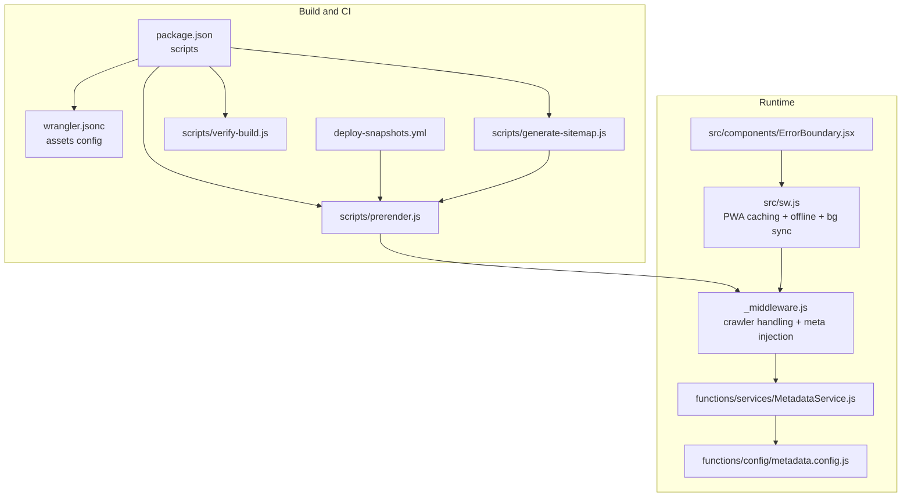
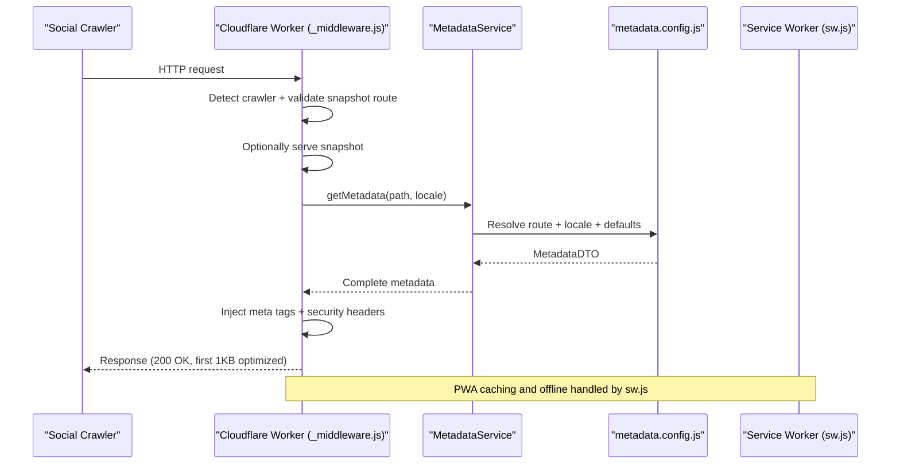
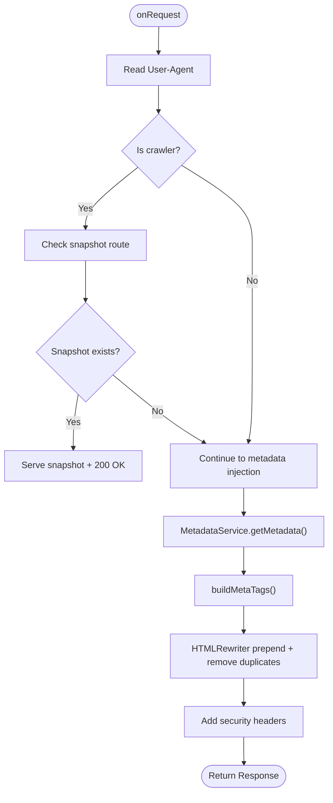
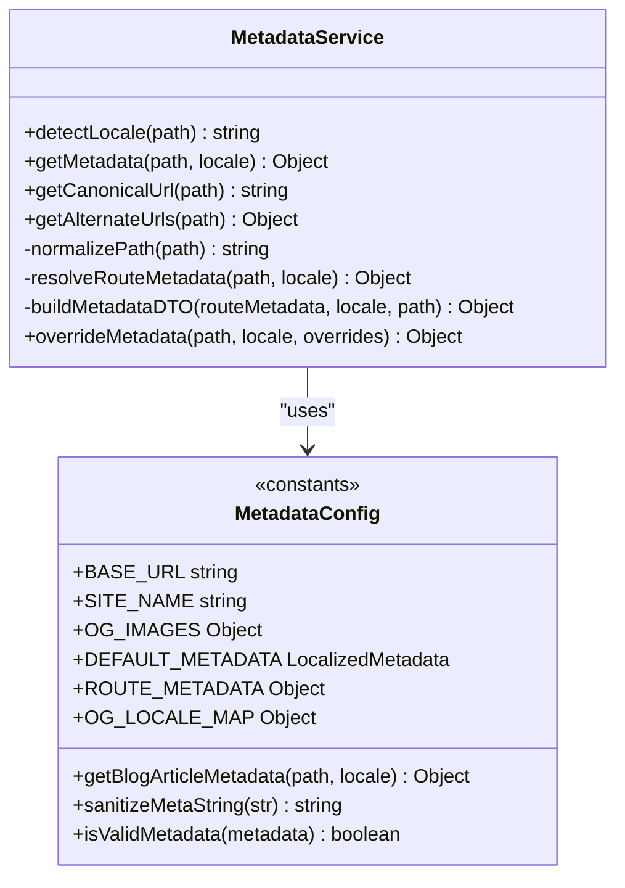
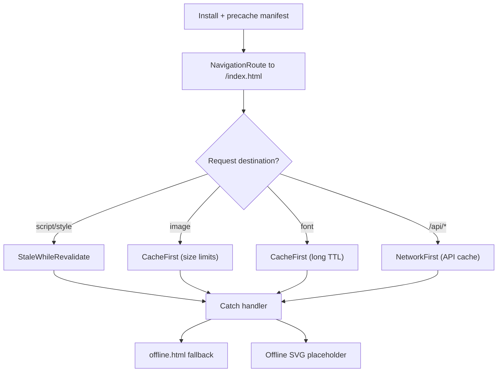
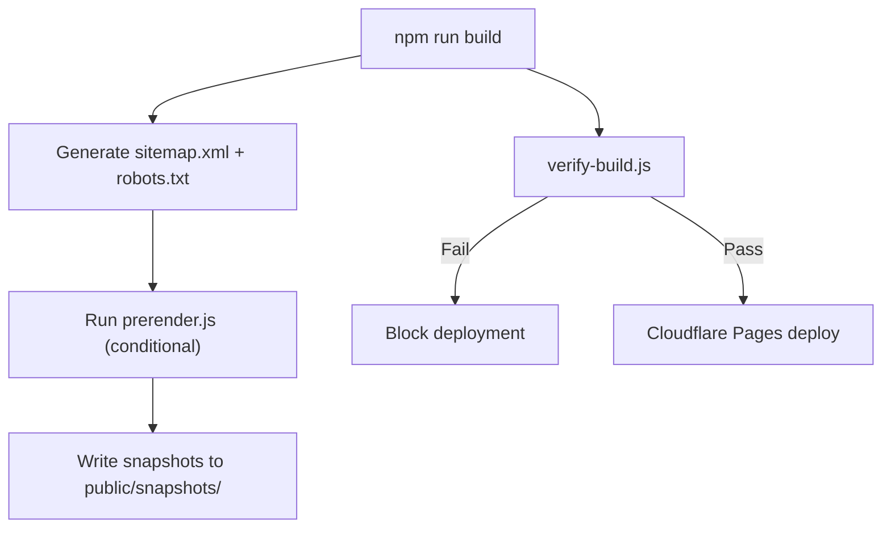
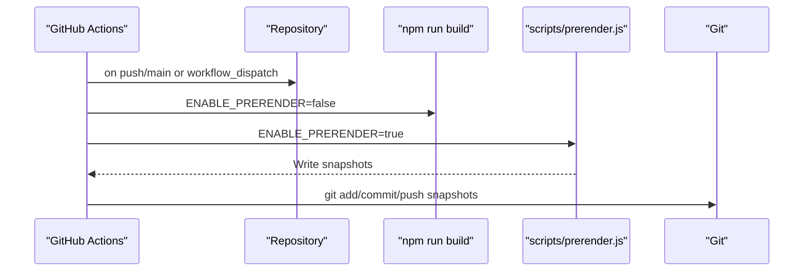
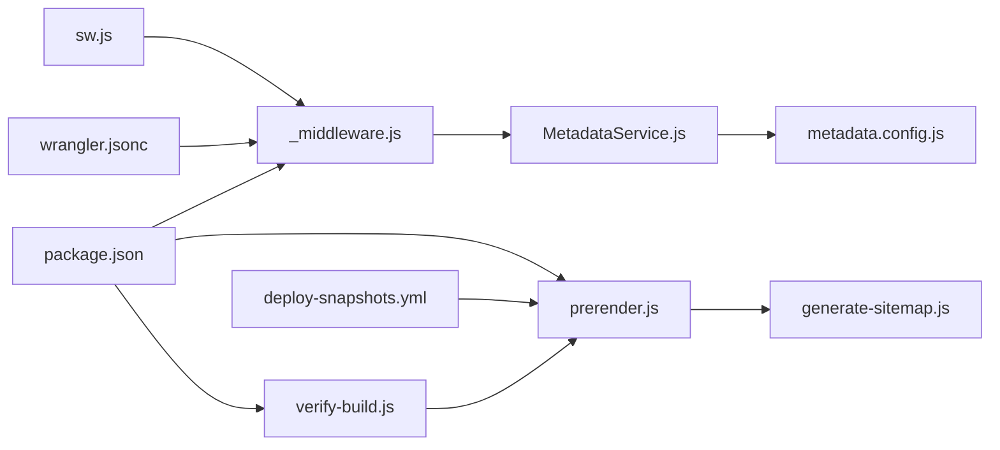

# Monitoring and Maintenance

<cite>
**Referenced Files in This Document**
- [package.json](file://package.json)
- [wrangler.jsonc](file://wrangler.jsonc)
- [vite.config.js](file://vite.config.js)
- [_middleware.js](file://functions/_middleware.js)
- [MetadataService.js](file://functions/services/MetadataService.js)
- [metadata.config.js](file://functions/config/metadata.config.js)
- [ErrorBoundary.jsx](file://src/components/ErrorBoundary.jsx)
- [sw.js](file://src/sw.js)
- [generate-sitemap.js](file://scripts/generate-sitemap.js)
- [prerender.js](file://scripts/prerender.js)
- [verify-build.js](file://scripts/verify-build.js)
- [deploy-snapshots.yml](file://.github/workflows/deploy-snapshots.yml)
- [DEPLOYMENT.md](file://docs/DEPLOYMENT.md)
</cite>

## Table of Contents
1. [Introduction](#introduction)
2. [Project Structure](#project-structure)
3. [Core Components](#core-components)
4. [Architecture Overview](#architecture-overview)
5. [Detailed Component Analysis](#detailed-component-analysis)
6. [Dependency Analysis](#dependency-analysis)
7. [Performance Considerations](#performance-considerations)
8. [Troubleshooting Guide](#troubleshooting-guide)
9. [Conclusion](#conclusion)
10. [Appendices](#appendices)

## Introduction
This document provides comprehensive guidance for monitoring and maintenance of the landing page application. It explains how performance monitoring, error tracking, and user experience analytics are implemented or prepared for, outlines maintenance workflows, update procedures, and health checks, and covers debugging approaches, performance profiling, and issue resolution strategies. It also includes practical examples for setting up monitoring dashboards, analyzing performance metrics, implementing preventive maintenance, backup strategies, disaster recovery procedures, and long-term maintenance planning.

## Project Structure
The project is a modern React SPA built with Vite and deployed via Cloudflare Workers and Pages. Key areas relevant to monitoring and maintenance include:
- Build-time scripts for SEO and pre-rendering
- Cloudflare Worker middleware for metadata injection and crawler handling
- Service Worker for PWA caching and offline behavior
- Configuration-driven metadata system
- GitHub Actions workflow for automated snapshot deployment

**Diagram sources**
- [package.json](file://package.json#L6-L14)
- [wrangler.jsonc](file://wrangler.jsonc#L1-L7)
- [generate-sitemap.js](file://scripts/generate-sitemap.js#L1-L148)
- [prerender.js](file://scripts/prerender.js#L1-L234)
- [verify-build.js](file://scripts/verify-build.js#L1-L84)
- [deploy-snapshots.yml](file://.github/workflows/deploy-snapshots.yml#L1-L54)
- [_middleware.js](file://functions/_middleware.js#L1-L383)
- [MetadataService.js](file://functions/services/MetadataService.js#L1-L380)
- [metadata.config.js](file://functions/config/metadata.config.js#L1-L369)
- [sw.js](file://src/sw.js#L1-L227)
- [ErrorBoundary.jsx](file://src/components/ErrorBoundary.jsx#L1-L57)

**Section sources**
- [package.json](file://package.json#L6-L14)
- [wrangler.jsonc](file://wrangler.jsonc#L1-L7)
- [generate-sitemap.js](file://scripts/generate-sitemap.js#L1-L148)
- [prerender.js](file://scripts/prerender.js#L1-L234)
- [verify-build.js](file://scripts/verify-build.js#L1-L84)
- [deploy-snapshots.yml](file://.github/workflows/deploy-snapshots.yml#L1-L54)
- [_middleware.js](file://functions/_middleware.js#L1-L383)
- [MetadataService.js](file://functions/services/MetadataService.js#L1-L380)
- [metadata.config.js](file://functions/config/metadata.config.js#L1-L369)
- [sw.js](file://src/sw.js#L1-L227)
- [ErrorBoundary.jsx](file://src/components/ErrorBoundary.jsx#L1-L57)

## Core Components
- Cloudflare Worker Middleware: Handles crawler detection, snapshot serving, metadata injection, and security headers.
- Metadata Service: Centralized resolver for route-specific and localized metadata with validation and sanitization.
- PWA Service Worker: Manages precache, runtime caching strategies, offline fallback, background sync for forms, and push notifications.
- Build Scripts: Generate sitemaps, prerender snapshots, and enforce build hygiene.
- GitHub Actions Workflow: Automates snapshot generation and commits to the repository.

**Section sources**
- [_middleware.js](file://functions/_middleware.js#L68-L264)
- [MetadataService.js](file://functions/services/MetadataService.js#L44-L347)
- [metadata.config.js](file://functions/config/metadata.config.js#L15-L369)
- [sw.js](file://src/sw.js#L14-L227)
- [generate-sitemap.js](file://scripts/generate-sitemap.js#L45-L84)
- [prerender.js](file://scripts/prerender.js#L136-L231)
- [verify-build.js](file://scripts/verify-build.js#L37-L81)
- [deploy-snapshots.yml](file://.github/workflows/deploy-snapshots.yml#L12-L53)

## Architecture Overview
The monitoring and maintenance architecture integrates build-time, runtime, and observability layers:
- Build-time: Sitemap generation and prerendering ensure social crawler compatibility and reduce runtime overhead.
- Runtime: Worker middleware injects metadata and applies security headers; Service Worker manages caching and offline UX.
- Observability: Cloudflare Analytics and logs provide performance insights; tests and verification scripts ensure correctness.

**Diagram sources**
- [_middleware.js](file://functions/_middleware.js#L76-L264)
- [MetadataService.js](file://functions/services/MetadataService.js#L70-L88)
- [metadata.config.js](file://functions/config/metadata.config.js#L119-L209)
- [sw.js](file://src/sw.js#L14-L227)

## Detailed Component Analysis

### Cloudflare Worker Middleware
Responsibilities:
- Detect social media crawlers and normalize responses to avoid partial content errors.
- Serve pre-rendered snapshots when available.
- Inject metadata tags at the beginning of the head to satisfy crawler parsing constraints.
- Apply robust security headers.
- Pass through PWA assets and avoid interfering with Service Worker or snapshots.

Key behaviors:
- Snapshot selection and serving with status normalization.
- Metadata building and sanitization.
- Security headers and CSP configuration.
- Exclusion logic for PWA assets and snapshot routes.

**Diagram sources**
- [_middleware.js](file://functions/_middleware.js#L76-L264)
- [MetadataService.js](file://functions/services/MetadataService.js#L70-L88)
- [metadata.config.js](file://functions/config/metadata.config.js#L310-L382)

**Section sources**
- [_middleware.js](file://functions/_middleware.js#L68-L264)
- [MetadataService.js](file://functions/services/MetadataService.js#L44-L347)
- [metadata.config.js](file://functions/config/metadata.config.js#L15-L369)

### Metadata Service and Configuration
Responsibilities:
- Resolve localized metadata for routes and locales.
- Provide fallbacks and sanitize inputs.
- Support blog article metadata resolution.
- Maintain type safety and centralized constants.

Design highlights:
- Strategy pattern for route matching.
- Factory pattern for DTO construction.
- Singleton instance for worker lifecycle efficiency.

**Diagram sources**
- [MetadataService.js](file://functions/services/MetadataService.js#L44-L347)
- [metadata.config.js](file://functions/config/metadata.config.js#L39-L369)

**Section sources**
- [MetadataService.js](file://functions/services/MetadataService.js#L44-L347)
- [metadata.config.js](file://functions/config/metadata.config.js#L15-L369)

### PWA Service Worker
Responsibilities:
- Precache critical assets defined by Vite PWA.
- Route-based caching strategies (Stale-While-Revalidate, Cache-First, Network-First).
- Navigation fallback to SPA shell.
- Background sync for contact form submissions.
- Comprehensive offline fallbacks.
- Push notifications.

**Diagram sources**
- [sw.js](file://src/sw.js#L26-L174)

**Section sources**
- [sw.js](file://src/sw.js#L14-L227)

### Build-Time Scripts and Verification
Responsibilities:
- Generate sitemap with hreflang and robots.txt.
- Discover routes from sitemap and prerender snapshots with Puppeteer.
- Enforce “clean dist root” policy to prevent routing conflicts on Cloudflare Pages.

**Diagram sources**
- [generate-sitemap.js](file://scripts/generate-sitemap.js#L45-L145)
- [prerender.js](file://scripts/prerender.js#L136-L231)
- [verify-build.js](file://scripts/verify-build.js#L37-L81)

**Section sources**
- [generate-sitemap.js](file://scripts/generate-sitemap.js#L1-L148)
- [prerender.js](file://scripts/prerender.js#L1-L234)
- [verify-build.js](file://scripts/verify-build.js#L1-L84)

### GitHub Actions Workflow for Snapshots
Automates snapshot generation and commits snapshots to the repository on pushes to main or manual dispatch.

**Diagram sources**
- [deploy-snapshots.yml](file://.github/workflows/deploy-snapshots.yml#L12-L53)

**Section sources**
- [deploy-snapshots.yml](file://.github/workflows/deploy-snapshots.yml#L1-L54)

## Dependency Analysis
- Worker middleware depends on MetadataService and metadata.config for metadata resolution.
- MetadataService depends on metadata.config for constants and helpers.
- PWA Service Worker depends on Vite PWA manifest and runtime routing strategies.
- Build scripts depend on each other (sitemap → prerender → verify).
- Deployment pipeline depends on build scripts and GitHub Actions.

**Diagram sources**
- [_middleware.js](file://functions/_middleware.js#L29-L151)
- [MetadataService.js](file://functions/services/MetadataService.js#L16-L29)
- [metadata.config.js](file://functions/config/metadata.config.js#L15-L369)
- [sw.js](file://src/sw.js#L14-L29)
- [generate-sitemap.js](file://scripts/generate-sitemap.js#L45-L84)
- [prerender.js](file://scripts/prerender.js#L136-L231)
- [verify-build.js](file://scripts/verify-build.js#L37-L81)
- [deploy-snapshots.yml](file://.github/workflows/deploy-snapshots.yml#L12-L53)
- [package.json](file://package.json#L6-L14)
- [wrangler.jsonc](file://wrangler.jsonc#L1-L7)

**Section sources**
- [_middleware.js](file://functions/_middleware.js#L29-L151)
- [MetadataService.js](file://functions/services/MetadataService.js#L16-L29)
- [metadata.config.js](file://functions/config/metadata.config.js#L15-L369)
- [sw.js](file://src/sw.js#L14-L29)
- [generate-sitemap.js](file://scripts/generate-sitemap.js#L45-L84)
- [prerender.js](file://scripts/prerender.js#L136-L231)
- [verify-build.js](file://scripts/verify-build.js#L37-L81)
- [deploy-snapshots.yml](file://.github/workflows/deploy-snapshots.yml#L12-L53)
- [package.json](file://package.json#L6-L14)
- [wrangler.jsonc](file://wrangler.jsonc#L1-L7)

## Performance Considerations
- Middleware latency: Target under 10 ms CPU time per request.
- Compression: Gzip and Brotli enabled at build time.
- Asset inlining threshold configured for efficient delivery.
- Chunk splitting and manual chunks for optimal caching and loading.
- PWA caching strategies tailored to destinations (JS/CSS, images, fonts, API).
- Offline fallback reduces error impact and improves resilience.
- Snapshot pre-rendering minimizes runtime work for crawlers.

Recommendations:
- Monitor Cloudflare Worker metrics for CPU time and error rates.
- Track image sizes and consider WebP conversion.
- Evaluate CDN caching headers for static assets.
- Consider lazy metadata injection only for crawlers.

**Section sources**
- [DEPLOYMENT.md](file://docs/DEPLOYMENT.md#L127-L197)
- [vite.config.js](file://vite.config.js#L10-L202)
- [sw.js](file://src/sw.js#L48-L116)

## Troubleshooting Guide
Common issues and resolutions:
- WhatsApp shows old OG image:
  - Update OG image version and scrape again.
- Arabic text not rendering in OG image:
  - Regenerate with proper RTL rendering and font support.
- Duplicate meta tags:
  - Middleware removes existing tags; verify selectors and order.
- Image not loading (404):
  - Confirm images exist in public and are included in build output.
- Build verification failure:
  - Ensure dist root contains only allowed HTML files; move prerendered pages to snapshots.

Operational checks:
- Use Cloudflare Workers logs to inspect crawler activity and response codes.
- Validate metadata correctness via browser DevTools inspection and social preview tools.
- Run tests and linting locally before deployment.

**Section sources**
- [DEPLOYMENT.md](file://docs/DEPLOYMENT.md#L147-L226)
- [_middleware.js](file://functions/_middleware.js#L255-L263)
- [verify-build.js](file://scripts/verify-build.js#L37-L81)

## Conclusion
The application’s monitoring and maintenance approach combines proactive build-time optimizations, runtime metadata injection for social crawlers, robust PWA caching, and automated snapshot deployment. By leveraging Cloudflare Analytics and logs, maintaining strict build hygiene, and following the outlined troubleshooting and maintenance procedures, the system achieves strong performance, reliability, and user experience across diverse environments.

## Appendices

### Monitoring Dashboards and Metrics
- Cloudflare Workers:
  - Metrics: CPU time per request, error rate thresholds.
  - Logs: Crawler User-Agents, response times, snapshot hits.
- Cloudflare Pages:
  - Static asset delivery metrics and cache hit ratios.
- Internal:
  - Test suites and linting as pre-deploy gates.

**Section sources**
- [DEPLOYMENT.md](file://docs/DEPLOYMENT.md#L127-L144)
- [package.json](file://package.json#L6-L14)

### Maintenance Workflows and Procedures
- Daily:
  - Monitor Cloudflare Worker metrics and logs.
- Weekly:
  - Validate metadata correctness and OG image freshness.
- Monthly:
  - Review crawler support and update metadata for new routes.
- Quarterly:
  - Audit metadata accuracy, refresh OG images if needed, review cache-busting strategy, and run full test suite.

**Section sources**
- [DEPLOYMENT.md](file://docs/DEPLOYMENT.md#L200-L215)

### Backup and Disaster Recovery
- Snapshot repository:
  - Automated snapshot commits ensure recoverable pre-rendered content.
- Build artifacts:
  - Keep dist output aligned with Cloudflare Pages expectations; verify build hygiene.
- Rollback strategy:
  - Revert to previous snapshot commits or tagged releases.

**Section sources**
- [deploy-snapshots.yml](file://.github/workflows/deploy-snapshots.yml#L39-L53)
- [verify-build.js](file://scripts/verify-build.js#L37-L81)

### Debugging and Profiling
- Middleware:
  - Inspect injected meta tags and security headers in DevTools.
  - Validate crawler detection and snapshot serving.
- PWA:
  - Use Application panel to inspect caches and offline fallback.
  - Test background sync and push notifications.
- Build:
  - Run sitemap generation and prerender scripts locally to reproduce issues.
  - Use verify-build to catch routing conflicts early.

**Section sources**
- [DEPLOYMENT.md](file://docs/DEPLOYMENT.md#L47-L90)
- [sw.js](file://src/sw.js#L14-L227)
- [prerender.js](file://scripts/prerender.js#L136-L231)