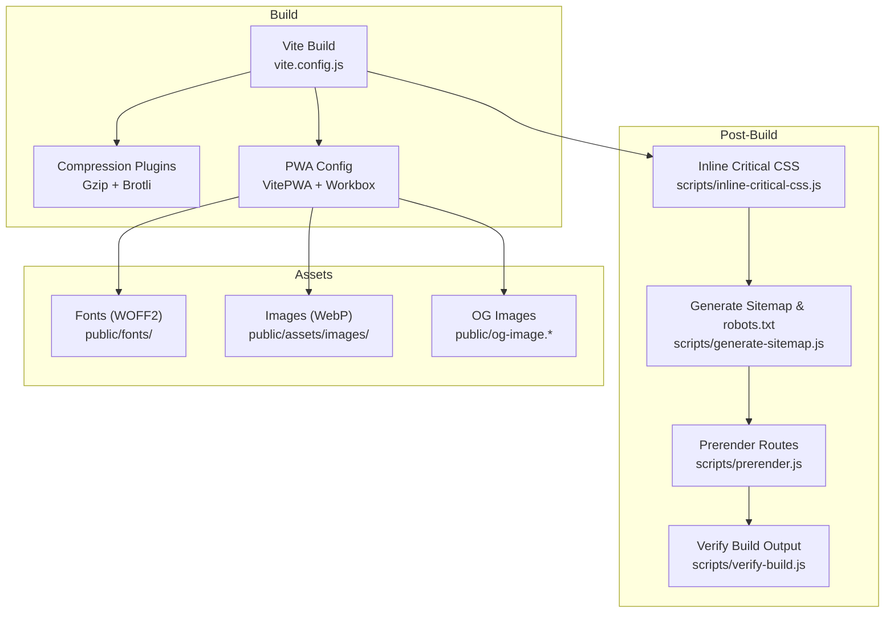
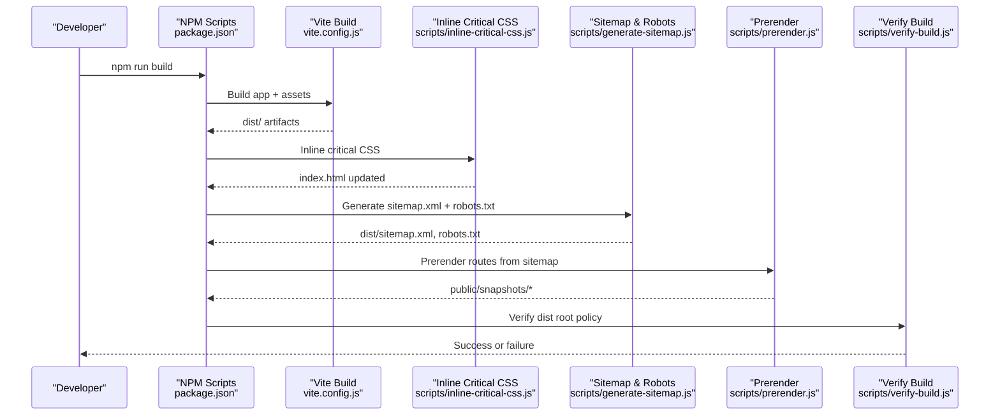
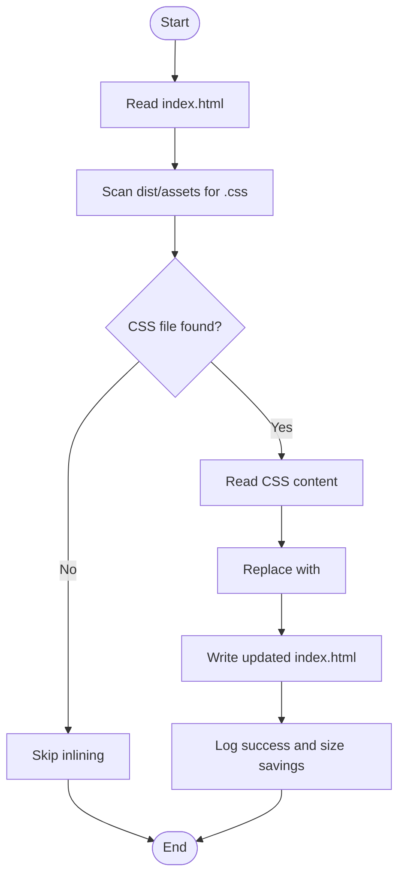
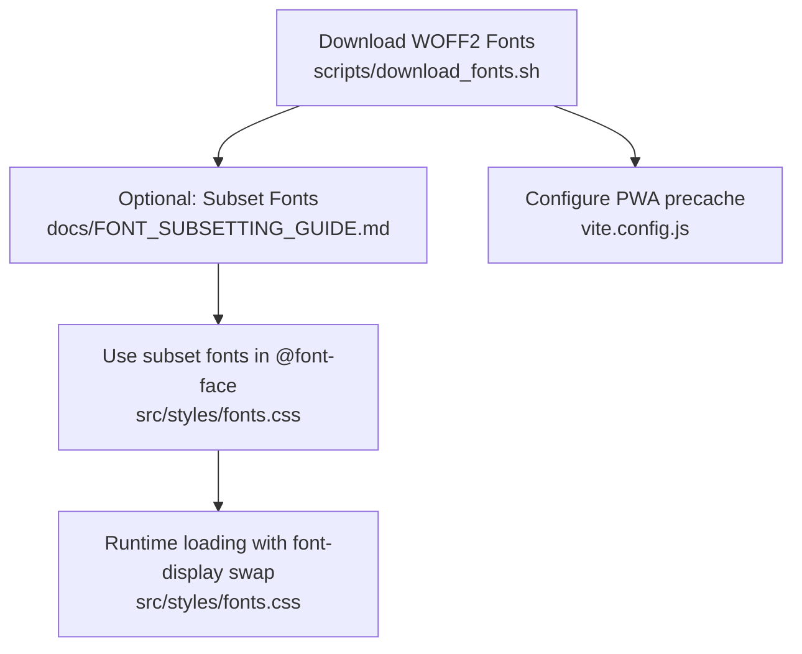
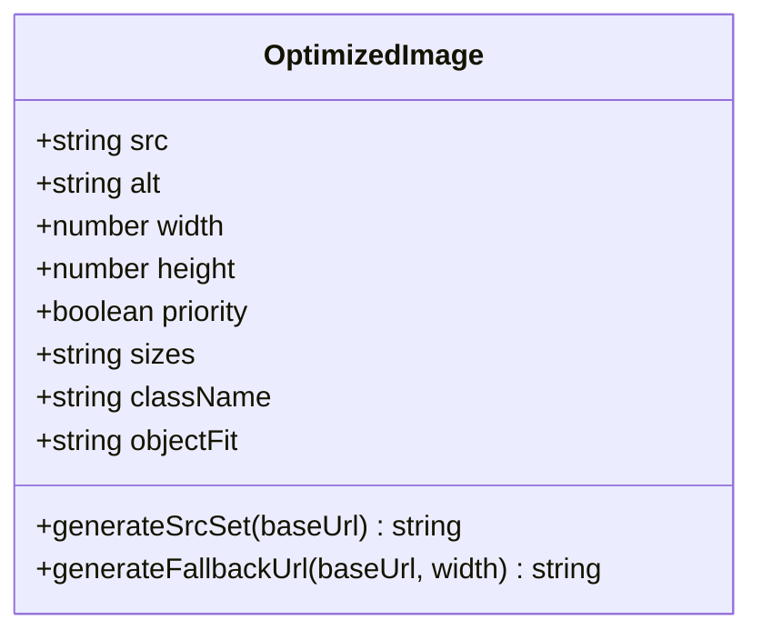
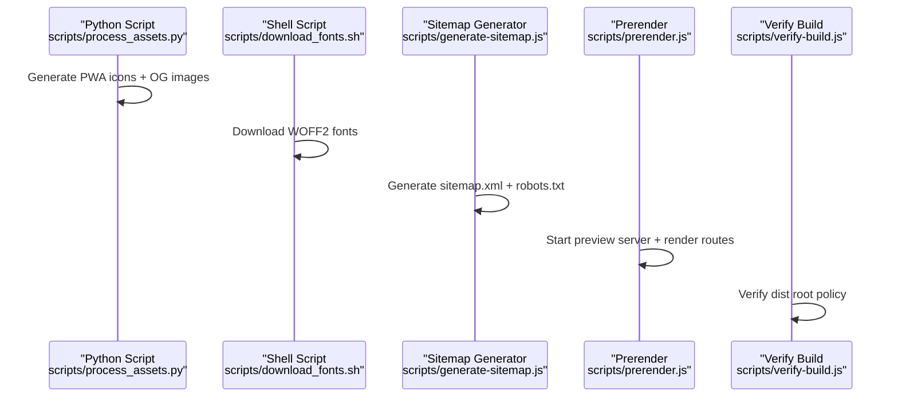
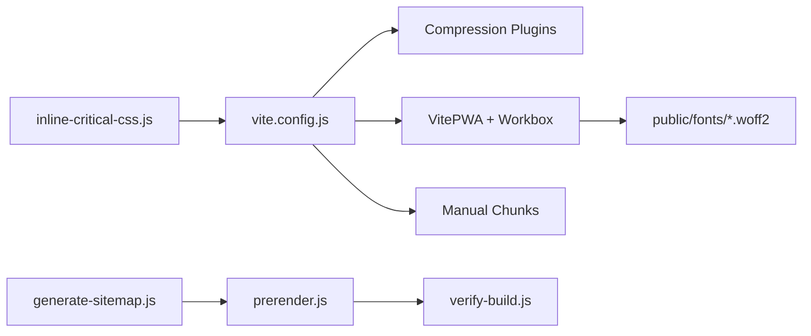

# Asset Optimization

<cite>
**Referenced Files in This Document**
- [package.json](file://package.json)
- [vite.config.js](file://vite.config.js)
- [scripts/process_assets.py](file://scripts/process_assets.py)
- [scripts/download_fonts.sh](file://scripts/download_fonts.sh)
- [scripts/inline-critical-css.js](file://scripts/inline-critical-css.js)
- [scripts/generate-sitemap.js](file://scripts/generate-sitemap.js)
- [scripts/prerender.js](file://scripts/prerender.js)
- [scripts/verify-build.js](file://scripts/verify-build.js)
- [src/styles/fonts.css](file://src/styles/fonts.css)
- [src/components/OptimizedImage.jsx](file://src/components/OptimizedImage.jsx)
- [docs/FONT_SUBSETTING_GUIDE.md](file://docs/FONT_SUBSETTING_GUIDE.md)
</cite>

## Table of Contents
1. [Introduction](#introduction)
2. [Project Structure](#project-structure)
3. [Core Components](#core-components)
4. [Architecture Overview](#architecture-overview)
5. [Detailed Component Analysis](#detailed-component-analysis)
6. [Dependency Analysis](#dependency-analysis)
7. [Performance Considerations](#performance-considerations)
8. [Troubleshooting Guide](#troubleshooting-guide)
9. [Conclusion](#conclusion)
10. [Appendices](#appendices)

## Introduction
This document explains the asset optimization strategies and automated processing workflows used in the project. It covers critical CSS inlining, font optimization (including WOFF2 subset generation), image compression and responsive serving, automated asset processing pipelines, compression algorithms (Gzip, Brotli), bundling strategies, and performance measurement. Practical examples demonstrate optimizing different asset types, implementing lazy loading for images, and monitoring asset delivery performance.

## Project Structure
The asset optimization pipeline integrates build-time and post-build automation:
- Build-time: Vite compiles assets, applies compression, and configures PWA caching and code splitting.
- Post-build: Scripts inline critical CSS, generate sitemaps and prerendered snapshots, and verify the build output.

**Diagram sources**
- [vite.config.js](file://vite.config.js#L1-L262)
- [scripts/inline-critical-css.js](file://scripts/inline-critical-css.js#L1-L61)
- [scripts/generate-sitemap.js](file://scripts/generate-sitemap.js#L1-L148)
- [scripts/prerender.js](file://scripts/prerender.js#L1-L234)
- [scripts/verify-build.js](file://scripts/verify-build.js#L1-L84)

**Section sources**
- [package.json](file://package.json#L6-L14)
- [vite.config.js](file://vite.config.js#L1-L262)

## Core Components
- Compression and Bundling: Vite with Gzip and Brotli plugins, PWA caching, and manual code splitting.
- Critical CSS Inlining: Post-build script that replaces external CSS with inline styles.
- Font Optimization: WOFF2 font acquisition and subsetting guidance; progressive enhancement with system fonts.
- Image Optimization: Component-driven responsive images with WebP and lazy loading.
- Automation: Shell and Node scripts orchestrate font downloads, sitemap generation, prerendering, and build verification.

**Section sources**
- [vite.config.js](file://vite.config.js#L11-L18)
- [scripts/inline-critical-css.js](file://scripts/inline-critical-css.js#L19-L55)
- [src/styles/fonts.css](file://src/styles/fonts.css#L1-L224)
- [src/components/OptimizedImage.jsx](file://src/components/OptimizedImage.jsx#L1-L145)
- [scripts/download_fonts.sh](file://scripts/download_fonts.sh#L1-L27)
- [docs/FONT_SUBSETTING_GUIDE.md](file://docs/FONT_SUBSETTING_GUIDE.md#L1-L223)

## Architecture Overview
The pipeline executes in sequence: Vite builds assets, then Node and shell scripts optimize and prepare content for deployment.

**Diagram sources**
- [package.json](file://package.json#L6-L14)
- [vite.config.js](file://vite.config.js#L1-L262)
- [scripts/inline-critical-css.js](file://scripts/inline-critical-css.js#L1-L61)
- [scripts/generate-sitemap.js](file://scripts/generate-sitemap.js#L1-L148)
- [scripts/prerender.js](file://scripts/prerender.js#L1-L234)
- [scripts/verify-build.js](file://scripts/verify-build.js#L1-L84)

## Detailed Component Analysis

### Critical CSS Inlining
Purpose: Eliminate render-blocking CSS requests by inlining the CSS bundle into the HTML head.

Key behaviors:
- Reads the built index.html and scans dist/assets for the CSS file.
- Replaces the stylesheet link with a style block containing the CSS content.
- Logs the original CSS size and the eliminated request count.

**Diagram sources**
- [scripts/inline-critical-css.js](file://scripts/inline-critical-css.js#L24-L55)

**Section sources**
- [scripts/inline-critical-css.js](file://scripts/inline-critical-css.js#L19-L55)

### Font Optimization and Subsetting
Strategy:
- Progressive enhancement: system fonts as instant fallbacks; custom WOFF2 fonts load with font-display swap.
- Subsetting reduces font sizes significantly by retaining only used glyphs.
- Two complementary approaches are documented: glyphhanger automation, online subsetting, and Fontsource variable fonts.

Implementation highlights:
- Font declarations include font-display swap and explicit preload-friendly formats.
- Shell script downloads WOFF2 fonts to public/fonts.
- Subsetting guide provides commands and expected savings.

**Diagram sources**
- [scripts/download_fonts.sh](file://scripts/download_fonts.sh#L9-L25)
- [src/styles/fonts.css](file://src/styles/fonts.css#L44-L170)
- [docs/FONT_SUBSETTING_GUIDE.md](file://docs/FONT_SUBSETTING_GUIDE.md#L18-L49)
- [vite.config.js](file://vite.config.js#L19-L30)

**Section sources**
- [src/styles/fonts.css](file://src/styles/fonts.css#L1-L224)
- [scripts/download_fonts.sh](file://scripts/download_fonts.sh#L1-L27)
- [docs/FONT_SUBSETTING_GUIDE.md](file://docs/FONT_SUBSETTING_GUIDE.md#L1-L223)
- [vite.config.js](file://vite.config.js#L19-L30)

### Image Compression and Responsive Serving
The OptimizedImage component delivers:
- WebP by default with fallbacks.
- Responsive srcset with device-optimized widths and aggressive compression for smaller screens.
- Lazy loading and fetchpriority controls for Largest Contentful Paint (LCP) optimization.
- Aspect-ratio preservation and loading placeholders to prevent Cumulative Layout Shift (CLS).

**Diagram sources**
- [src/components/OptimizedImage.jsx](file://src/components/OptimizedImage.jsx#L26-L79)

**Section sources**
- [src/components/OptimizedImage.jsx](file://src/components/OptimizedImage.jsx#L1-L145)

### Automated Asset Processing Pipeline
- Asset generation: Python script creates PWA icons and OG images.
- Font acquisition: Shell script downloads WOFF2 fonts.
- SEO: Sitemap generator writes sitemap.xml and robots.txt.
- Prerendering: Puppeteer renders routes discovered from sitemap.xml into static snapshots.
- Build verification: Ensures only allowed HTML files exist in dist root to avoid routing conflicts.

**Diagram sources**
- [scripts/process_assets.py](file://scripts/process_assets.py#L11-L77)
- [scripts/download_fonts.sh](file://scripts/download_fonts.sh#L9-L25)
- [scripts/generate-sitemap.js](file://scripts/generate-sitemap.js#L45-L145)
- [scripts/prerender.js](file://scripts/prerender.js#L136-L231)
- [scripts/verify-build.js](file://scripts/verify-build.js#L37-L81)

**Section sources**
- [scripts/process_assets.py](file://scripts/process_assets.py#L1-L78)
- [scripts/download_fonts.sh](file://scripts/download_fonts.sh#L1-L27)
- [scripts/generate-sitemap.js](file://scripts/generate-sitemap.js#L1-L148)
- [scripts/prerender.js](file://scripts/prerender.js#L1-L234)
- [scripts/verify-build.js](file://scripts/verify-build.js#L1-L84)

## Dependency Analysis
- Build-time dependencies:
  - Vite plugins: compression (Gzip/Brotli), PWA (VitePWA + Workbox), React plugin.
  - Manual code splitting targets core libraries and heavy dependencies for optimal caching.
- Post-build dependencies:
  - Inline critical CSS depends on the presence of a single CSS bundle (cssCodeSplit disabled).
  - Prerendering depends on sitemap.xml generated by the sitemap script.
  - Verify build depends on the prerendered snapshots being placed under public/snapshots.

**Diagram sources**
- [vite.config.js](file://vite.config.js#L9-L203)
- [scripts/inline-critical-css.js](file://scripts/inline-critical-css.js#L19-L55)
- [scripts/generate-sitemap.js](file://scripts/generate-sitemap.js#L45-L145)
- [scripts/prerender.js](file://scripts/prerender.js#L136-L231)
- [scripts/verify-build.js](file://scripts/verify-build.js#L37-L81)

**Section sources**
- [vite.config.js](file://vite.config.js#L204-L248)
- [package.json](file://package.json#L6-L14)

## Performance Considerations
- Compression:
  - Gzip and Brotli compression are enabled via Vite plugins. Brotli typically achieves higher compression ratios but slower decompression speed; Gzip offers broader compatibility and faster decompression.
  - Compressed artifacts are produced alongside original assets (e.g., index.html.br, index.html.gz).
- Critical CSS:
  - Inlining eliminates render-blocking CSS requests, improving First Contentful Paint (FCP) and Time to First Byte (TTFB) effects.
- Fonts:
  - Subsetting reduces transfer size significantly; combine with font-display swap to minimize Flash of Invisible Text (FOIT).
  - Preload critical fonts via PWA manifest and include fonts in precache to improve First Meaningful Paint (FMP).
- Images:
  - WebP with responsive srcset and lazy loading reduces bandwidth and improves Core Web Vitals.
  - Aspect-ratio and width/height attributes prevent layout shifts.
- Bundling:
  - Manual code splitting ensures frequently used libraries (React, router, i18n) are cached independently.
  - Assets below a threshold are inlined to reduce requests.

[No sources needed since this section provides general guidance]

## Troubleshooting Guide
- Critical CSS inlining fails:
  - Ensure a single CSS bundle exists in dist/assets; the script looks for a .css file and replaces the stylesheet link.
  - Confirm the build completes before running the inlining script.
- Fonts not loading:
  - Verify WOFF2 files exist in public/fonts and @font-face URLs match the filenames.
  - Check subsetting results and ensure all used characters are included.
- Images not responsive:
  - Confirm the component receives width/height props and that src is a supported provider (e.g., Unsplash).
  - Adjust sizes prop for different viewport widths.
- Prerendering errors:
  - Ensure sitemap.xml exists in dist; the prerender script parses it to discover routes.
  - Confirm the preview server is reachable on the configured port.
- Build verification failures:
  - Only index.html, 404.html, offline.html, and Google verification files are allowed in dist root.
  - Move other HTML content to dist/snapshots.

**Section sources**
- [scripts/inline-critical-css.js](file://scripts/inline-critical-css.js#L33-L36)
- [src/styles/fonts.css](file://src/styles/fonts.css#L44-L170)
- [src/components/OptimizedImage.jsx](file://src/components/OptimizedImage.jsx#L39-L79)
- [scripts/prerender.js](file://scripts/prerender.js#L85-L113)
- [scripts/verify-build.js](file://scripts/verify-build.js#L25-L62)

## Conclusion
The project employs a robust, automated asset optimization pipeline combining build-time compression, critical CSS inlining, font subsetting, and image responsiveness. The post-build scripts ensure SEO readiness, prerendered snapshots, and strict build output policies. Together, these strategies improve performance, accessibility, and maintainability.

[No sources needed since this section summarizes without analyzing specific files]

## Appendices

### Practical Examples
- Optimize fonts:
  - Use the subsetting guide to reduce font sizes and update @font-face declarations accordingly.
  - Keep system font fallbacks for instant rendering.
- Optimize images:
  - Use the OptimizedImage component for responsive WebP delivery with lazy loading and fetchpriority.
  - Provide accurate width/height to prevent CLS.
- Monitor performance:
  - Use browser DevTools Network panel to verify compression (gzip/brotli) and resource sizes.
  - Run Lighthouse to measure Core Web Vitals improvements after applying optimizations.

[No sources needed since this section provides general guidance]