# Build System Configuration

<cite>
**Referenced Files in This Document**
- [vite.config.js](file://vite.config.js)
- [package.json](file://package.json)
- [postcss.config.js](file://postcss.config.js)
- [tailwind.config.js](file://tailwind.config.js)
- [inline-critical-css.js](file://scripts/inline-critical-css.js)
- [generate-sitemap.js](file://scripts/generate-sitemap.js)
- [prerender.js](file://scripts/prerender.js)
- [verify-build.js](file://scripts/verify-build.js)
- [sw.js](file://src/sw.js)
- [main.jsx](file://src/main.jsx)
- [App.jsx](file://src/App.jsx)
- [i18n.js](file://src/i18n.js)
- [index.html](file://index.html)
- [eslint.config.js](file://eslint.config.js)
- [wrangler.jsonc](file://wrangler.jsonc)
</cite>

## Table of Contents
1. [Introduction](#introduction)
2. [Project Structure](#project-structure)
3. [Core Components](#core-components)
4. [Architecture Overview](#architecture-overview)
5. [Detailed Component Analysis](#detailed-component-analysis)
6. [Dependency Analysis](#dependency-analysis)
7. [Performance Considerations](#performance-considerations)
8. [Troubleshooting Guide](#troubleshooting-guide)
9. [Conclusion](#conclusion)
10. [Appendices](#appendices)

## Introduction
This document explains the Vite build system configuration and optimization strategies for the landing page project. It covers the build pipeline setup, plugin configurations (React, PWA, compression), manual chunking strategy for optimal code splitting, Terser compression settings, asset inlining thresholds, chunk naming conventions, development versus production differences, HMR optimization, and source map configuration. It also includes practical examples of build optimization techniques, bundle analysis approaches, and performance monitoring strategies tailored to this codebase.

## Project Structure
The build system centers around Vite’s configuration and a set of post-build scripts that enhance SEO, pre-render content, and enforce deployment-safe output. The project integrates Tailwind CSS via PostCSS and uses a service worker for PWA capabilities.

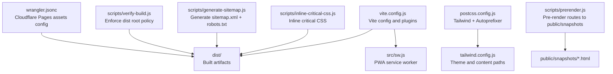

**Diagram sources**
- [vite.config.js](file://vite.config.js#L1-L262)
- [postcss.config.js](file://postcss.config.js#L1-L7)
- [tailwind.config.js](file://tailwind.config.js#L1-L47)
- [inline-critical-css.js](file://scripts/inline-critical-css.js#L1-L61)
- [generate-sitemap.js](file://scripts/generate-sitemap.js#L1-L148)
- [prerender.js](file://scripts/prerender.js#L1-L234)
- [verify-build.js](file://scripts/verify-build.js#L1-L84)
- [wrangler.jsonc](file://wrangler.jsonc#L1-L8)

**Section sources**
- [vite.config.js](file://vite.config.js#L1-L262)
- [package.json](file://package.json#L1-L49)
- [postcss.config.js](file://postcss.config.js#L1-L7)
- [tailwind.config.js](file://tailwind.config.js#L1-L47)

## Core Components
- Vite configuration defines plugins, build options, Rollup output, and dev server tuning.
- PostCSS and Tailwind configure CSS processing and design tokens.
- PWA plugin and service worker implement offline-first caching and app shell behavior.
- Compression plugin emits gzip and brotli artifacts for improved transfer performance.
- Post-build scripts optimize SEO, pre-render content, and validate deployment readiness.

**Section sources**
- [vite.config.js](file://vite.config.js#L7-L262)
- [postcss.config.js](file://postcss.config.js#L1-L7)
- [tailwind.config.js](file://tailwind.config.js#L1-L47)
- [package.json](file://package.json#L6-L14)

## Architecture Overview
The build pipeline transforms source code into optimized static assets, then enriches the output with SEO and pre-rendered content, and finally validates it for deployment.

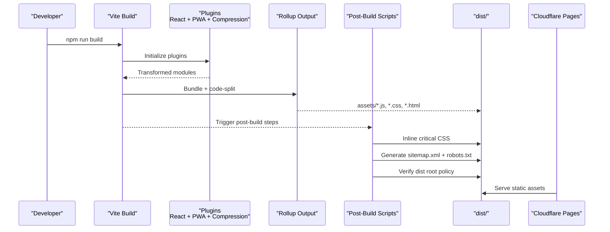

**Diagram sources**
- [vite.config.js](file://vite.config.js#L7-L262)
- [inline-critical-css.js](file://scripts/inline-critical-css.js#L1-L61)
- [generate-sitemap.js](file://scripts/generate-sitemap.js#L1-L148)
- [prerender.js](file://scripts/prerender.js#L1-L234)
- [verify-build.js](file://scripts/verify-build.js#L1-L84)
- [wrangler.jsonc](file://wrangler.jsonc#L1-L8)

## Detailed Component Analysis

### Vite Configuration and Plugin Setup
- Plugins:
  - React: Fast refresh and JSX transformations.
  - Compression: Emits gzip and brotli artifacts.
  - PWA: Injects manifest, service worker, and precache configuration.
- Build options:
  - Minification via Terser with console/debugger removal and multiple passes.
  - CSS code splitting disabled to inline all CSS into a single bundle for inlining.
  - Source maps disabled in production for performance; enabled per environment as needed.
  - Asset inlining threshold set to 4KB.
  - Chunk naming convention uses deterministic hashes for long-term caching.
- Manual chunking:
  - Dedicated bundles for React core, router, animations, i18n, and icons to improve caching and loading predictability.
- Dev server:
  - HMR overlay enabled for immediate feedback.

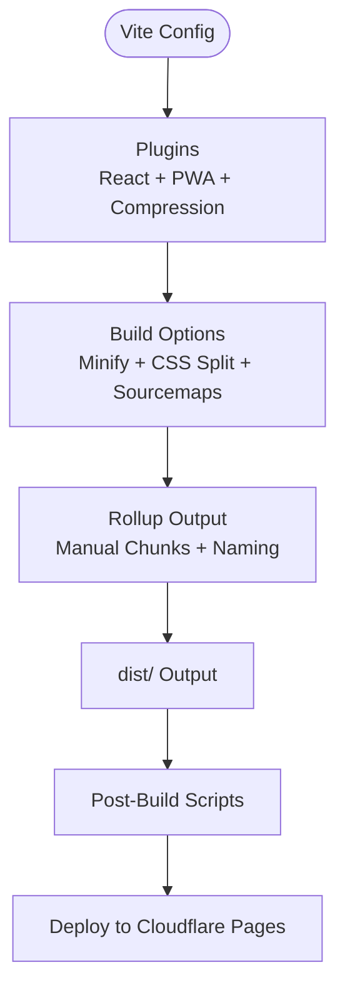

**Diagram sources**
- [vite.config.js](file://vite.config.js#L7-L262)

**Section sources**
- [vite.config.js](file://vite.config.js#L7-L262)

### Manual Chunking Strategy and Code Splitting
The configuration defines explicit manual chunks to optimize caching and reduce redundant downloads:
- react-core: react, react-dom, jsx runtime
- react-router: react-router-dom
- framer: framer-motion
- i18n: i18next, react-i18next, i18next-browser-languagedetector
- icons: lucide-react

These chunks are designed to reflect shared dependencies and heavy libraries, enabling long-lived cache hits across pages.

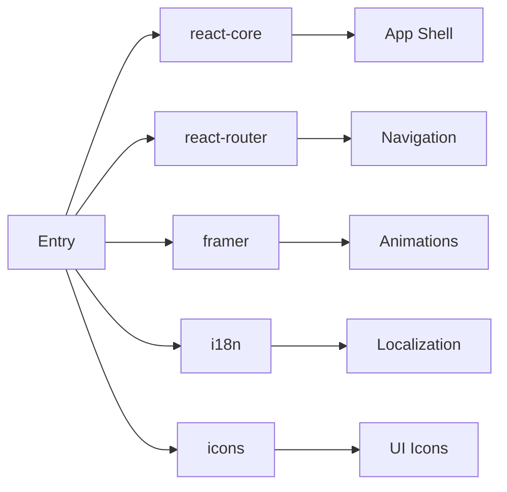

**Diagram sources**
- [vite.config.js](file://vite.config.js#L222-L237)

**Section sources**
- [vite.config.js](file://vite.config.js#L222-L237)

### Terser Compression Settings
- Minification: enabled via Terser.
- Compress options:
  - Drop console statements and debugger statements.
  - Multiple passes to further reduce bundle size.
- Sourcemaps:
  - Disabled in production to maximize performance.
  - Can be toggled per environment for debugging.

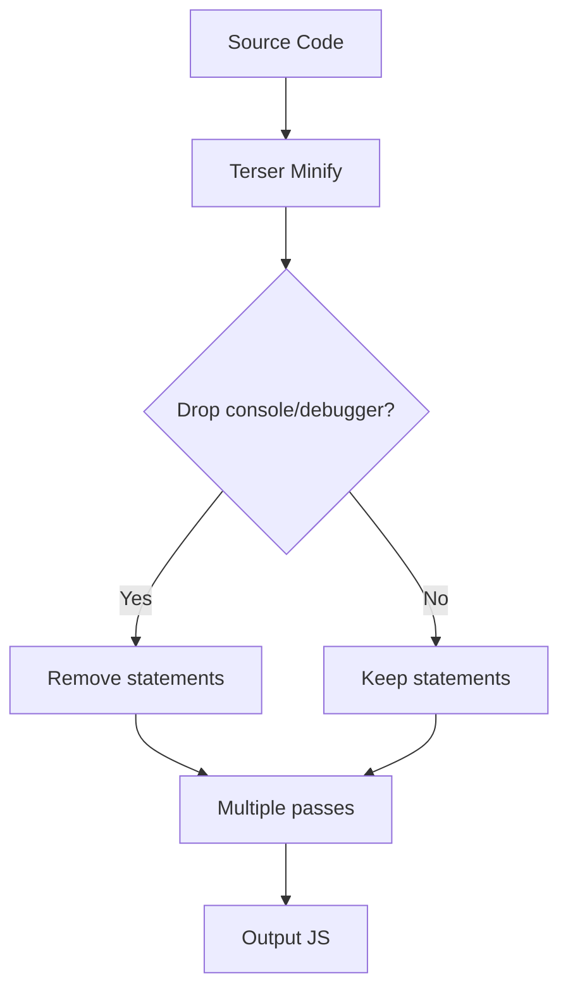

**Diagram sources**
- [vite.config.js](file://vite.config.js#L205-L212)
- [vite.config.js](file://vite.config.js#L243-L244)

**Section sources**
- [vite.config.js](file://vite.config.js#L205-L212)
- [vite.config.js](file://vite.config.js#L243-L244)

### Asset Inlining Thresholds and CSS Strategy
- CSS code splitting disabled to produce a single CSS bundle.
- Post-build script inlines critical CSS into index.html to eliminate render-blocking stylesheet requests.
- Asset inlining threshold set to 4KB to balance payload size and HTTP overhead.

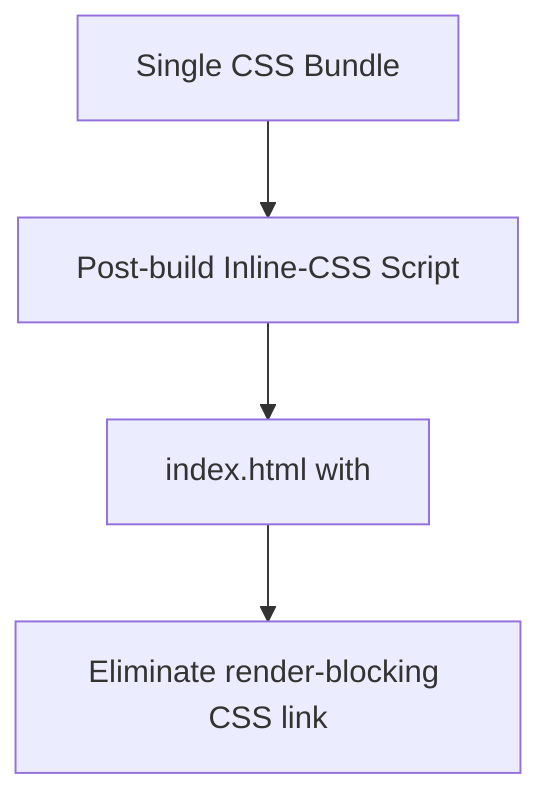

**Diagram sources**
- [vite.config.js](file://vite.config.js#L213-L247)
- [inline-critical-css.js](file://scripts/inline-critical-css.js#L1-L61)

**Section sources**
- [vite.config.js](file://vite.config.js#L213-L247)
- [inline-critical-css.js](file://scripts/inline-critical-css.js#L1-L61)

### Chunk Naming Conventions
- Deterministic naming pattern with hash suffixes for cache busting:
  - entryFileNames: assets/[name]-[hash].js
  - chunkFileNames: assets/[name]-[hash].js
  - assetFileNames: assets/[name]-[hash].[ext]

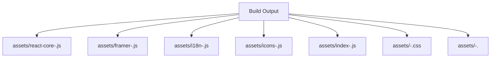

**Diagram sources**
- [vite.config.js](file://vite.config.js#L215-L219)

**Section sources**
- [vite.config.js](file://vite.config.js#L215-L219)

### Development vs Production Build Differences
- Development:
  - HMR overlay enabled for immediate feedback.
  - Sourcemaps for CSS and JS can be enabled for debugging.
- Production:
  - Minification enabled with Terser.
  - Sourcemaps disabled by default.
  - Compression plugins emit gzip and brotli artifacts.
  - CSS code splitting disabled; critical CSS inlined post-build.

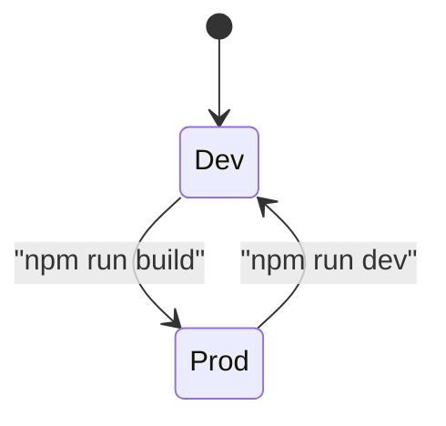

**Diagram sources**
- [vite.config.js](file://vite.config.js#L250-L260)
- [vite.config.js](file://vite.config.js#L205-L212)
- [vite.config.js](file://vite.config.js#L243-L247)

**Section sources**
- [vite.config.js](file://vite.config.js#L250-L260)
- [vite.config.js](file://vite.config.js#L205-L212)
- [vite.config.js](file://vite.config.js#L243-L247)

### HMR Optimization
- Overlay enabled for immediate error feedback.
- React Fast Refresh integrated via plugin for instant UI updates without losing state.

**Section sources**
- [vite.config.js](file://vite.config.js#L251-L254)
- [vite.config.js](file://vite.config.js#L9-L11)

### Source Map Configuration
- Production: sourcemap disabled to minimize payload.
- CSS devSourcemap disabled by default.
- Can be enabled selectively for debugging environments.

**Section sources**
- [vite.config.js](file://vite.config.js#L243-L244)
- [vite.config.js](file://vite.config.js#L258-L260)

### PWA Plugin and Service Worker
- PWA plugin:
  - injectManifest strategy with srcDir and filename pointing to the service worker.
  - Manifest includes metadata, icons, shortcuts, and widget definitions.
  - Workbox configuration restricts precache to small assets and ensures offline.html is cached.
- Service worker:
  - Pre-caching of critical assets.
  - Navigation fallback to SPA shell.
  - Runtime caching strategies:
    - Stale-while-revalidate for scripts/styles.
    - Cache-first for images and fonts.
    - Network-first for API calls.
  - Background sync for contact form submissions.
  - Comprehensive offline fallback handling.

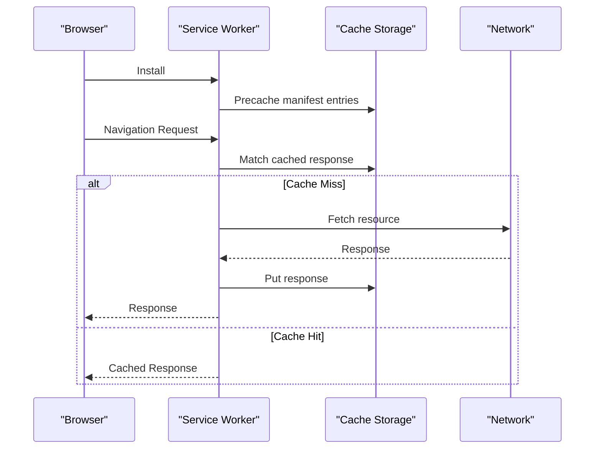

**Diagram sources**
- [vite.config.js](file://vite.config.js#L19-L202)
- [sw.js](file://src/sw.js#L1-L227)

**Section sources**
- [vite.config.js](file://vite.config.js#L19-L202)
- [sw.js](file://src/sw.js#L1-L227)

### Post-Build Scripts and Deployment Pipeline
- Inline critical CSS:
  - Reads built CSS and replaces stylesheet link with inline style in index.html.
- Generate sitemap and robots.txt:
  - Creates bilingual sitemap with hreflang entries and robots.txt with sitemap reference.
- Pre-render:
  - Discovers routes from sitemap.xml and generates static HTML snapshots for bots.
- Verify build:
  - Ensures dist root contains only allowed HTML files to avoid routing conflicts on Cloudflare Pages.

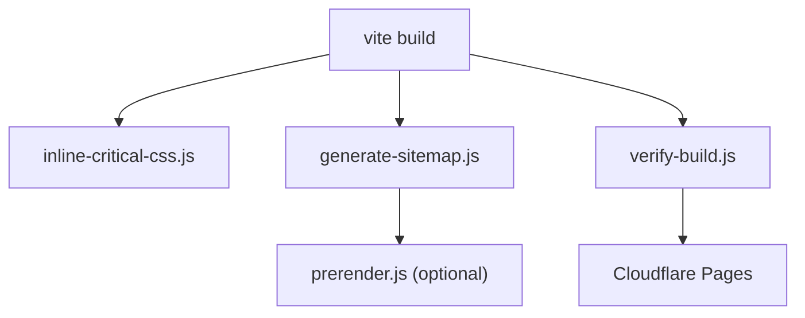

**Diagram sources**
- [package.json](file://package.json#L6-L14)
- [inline-critical-css.js](file://scripts/inline-critical-css.js#L1-L61)
- [generate-sitemap.js](file://scripts/generate-sitemap.js#L1-L148)
- [prerender.js](file://scripts/prerender.js#L1-L234)
- [verify-build.js](file://scripts/verify-build.js#L1-L84)
- [wrangler.jsonc](file://wrangler.jsonc#L1-L8)

**Section sources**
- [package.json](file://package.json#L6-L14)
- [inline-critical-css.js](file://scripts/inline-critical-css.js#L1-L61)
- [generate-sitemap.js](file://scripts/generate-sitemap.js#L1-L148)
- [prerender.js](file://scripts/prerender.js#L1-L234)
- [verify-build.js](file://scripts/verify-build.js#L1-L84)
- [wrangler.jsonc](file://wrangler.jsonc#L1-L8)

### CSS Toolchain (Tailwind + PostCSS)
- PostCSS pipeline configured with Tailwind and Autoprefixer.
- Tailwind configured with dark mode selector, content globs, theme extensions, and animation/keyframes.

**Section sources**
- [postcss.config.js](file://postcss.config.js#L1-L7)
- [tailwind.config.js](file://tailwind.config.js#L1-L47)

### Internationalization and Routing Integration
- i18n initialization with language detection and fallback to English.
- App synchronizes document direction and language with current route.
- Lazy loading and Suspense used across major routes for performance.

**Section sources**
- [i18n.js](file://src/i18n.js#L1-L45)
- [App.jsx](file://src/App.jsx#L1-L348)

### Application Entry and PWA Registration
- Application mounts under strict mode and initializes i18n and CSS.
- PWA registration script included in index.html for explicit control and auditability.

**Section sources**
- [main.jsx](file://src/main.jsx#L1-L12)
- [index.html](file://index.html#L65-L87)

## Dependency Analysis
The build system relies on Vite, React, PWA, and compression plugins, with Tailwind and PostCSS for CSS processing. Post-build scripts orchestrate SEO and pre-rendering. Deployment targets Cloudflare Pages assets directory.

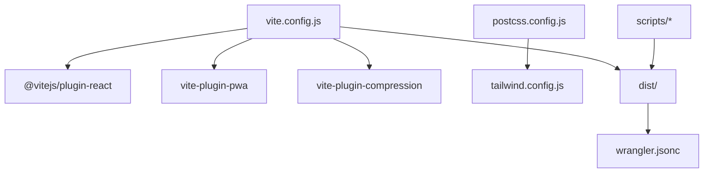

**Diagram sources**
- [vite.config.js](file://vite.config.js#L1-L5)
- [postcss.config.js](file://postcss.config.js#L1-L7)
- [tailwind.config.js](file://tailwind.config.js#L1-L47)
- [wrangler.jsonc](file://wrangler.jsonc#L1-L8)

**Section sources**
- [vite.config.js](file://vite.config.js#L1-L5)
- [package.json](file://package.json#L16-L48)
- [wrangler.jsonc](file://wrangler.jsonc#L1-L8)

## Performance Considerations
- Code splitting:
  - Manual chunks for core libraries and heavy dependencies to improve caching and reduce duplication.
- Minification:
  - Terser with console/debugger removal and multiple passes reduces payload size.
- Asset strategy:
  - CSS inlined to eliminate render-blocking requests; assets below 4KB inlined as base64.
- Caching:
  - Deterministic chunk names enable long-term caching; Workbox strategies differentiate cache policies by resource type.
- Rendering:
  - Lazy loading and Suspense reduce initial bundle size; skeleton loaders improve perceived performance.
- Observability:
  - Sourcemaps disabled in production; enable selectively for debugging environments.

[No sources needed since this section provides general guidance]

## Troubleshooting Guide
- Build verification failures:
  - Ensure dist root contains only allowed HTML files; pre-rendered pages must reside under dist/snapshots/.
- Missing CSS inlining:
  - Confirm a CSS file exists in dist/assets and the post-build script executed.
- Sitemap or prerender issues:
  - Verify sitemap.xml exists before prerendering; ensure ENABLE_PRERENDER is set appropriately.
- PWA caching problems:
  - Review Workbox configuration and service worker logs for cache misses or quota errors.

**Section sources**
- [verify-build.js](file://scripts/verify-build.js#L1-L84)
- [inline-critical-css.js](file://scripts/inline-critical-css.js#L1-L61)
- [generate-sitemap.js](file://scripts/generate-sitemap.js#L1-L148)
- [prerender.js](file://scripts/prerender.js#L1-L234)
- [sw.js](file://src/sw.js#L1-L227)

## Conclusion
The build system combines Vite’s modern bundling with targeted optimizations: manual chunking, aggressive minification, CSS inlining, and robust PWA caching. Post-build scripts enhance SEO and pre-rendering, while deployment configuration targets Cloudflare Pages. These strategies collectively improve performance, reliability, and developer experience across development and production workflows.

[No sources needed since this section summarizes without analyzing specific files]

## Appendices

### Practical Examples and Best Practices
- Bundle analysis:
  - Use Rollup’s built-in stats or third-party tools to inspect chunk sizes and identify oversized dependencies.
- Monitoring:
  - Track LCP, FID, and CLS in production; adjust asset thresholds and lazy-loading boundaries accordingly.
- Maintenance:
  - Periodically review manual chunk groups as dependencies evolve; update Workbox strategies for changing content patterns.

[No sources needed since this section provides general guidance]