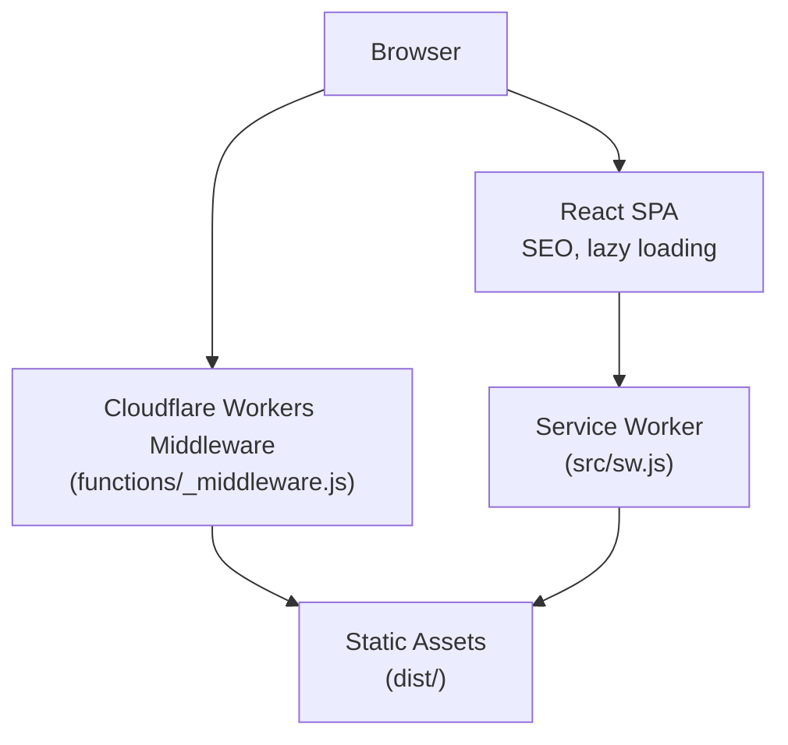
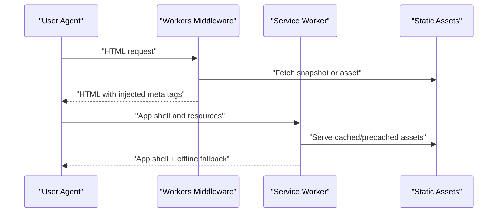
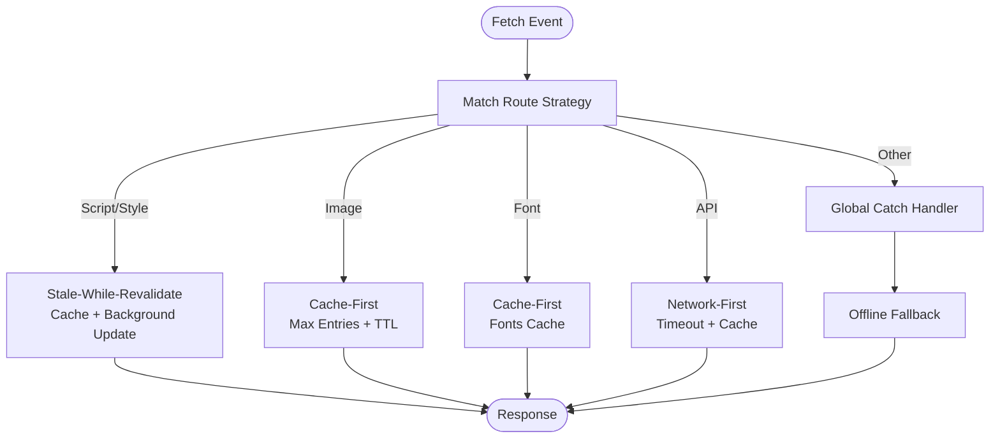
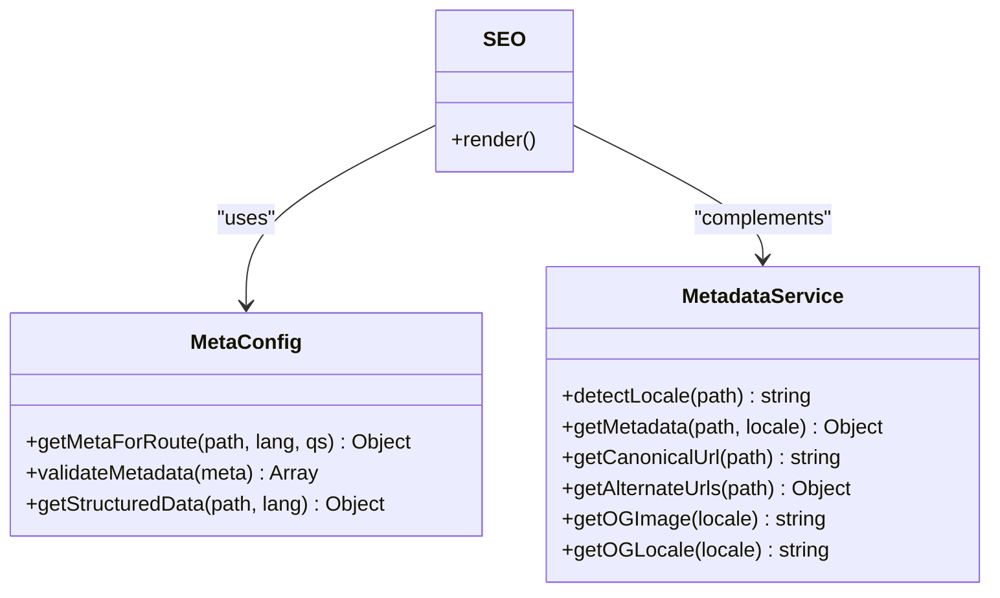
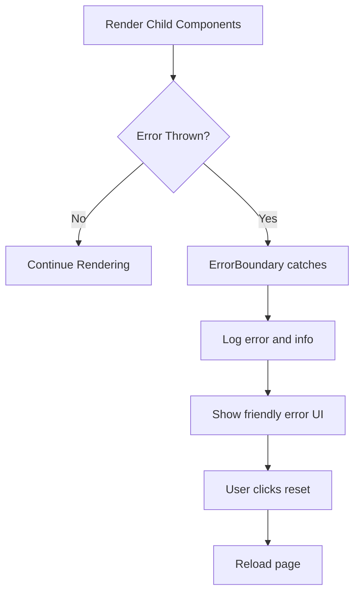
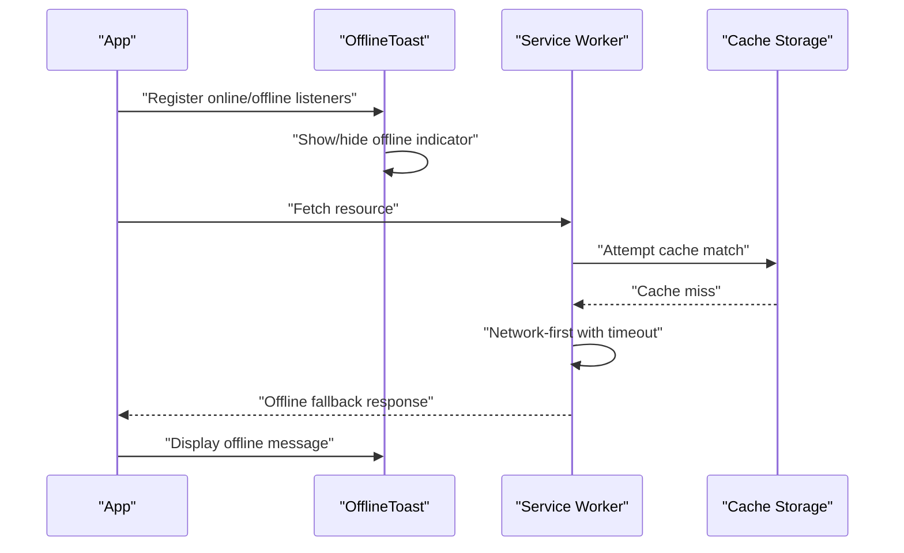
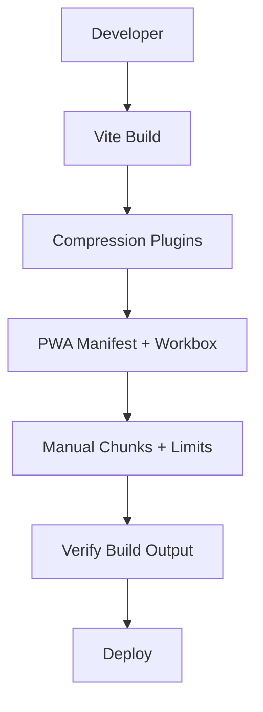
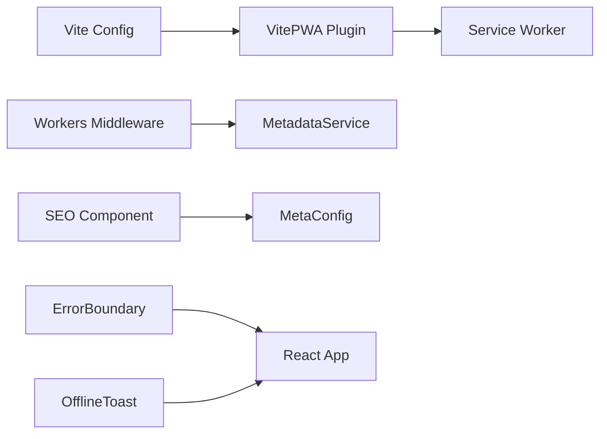

# Performance Monitoring and Metrics

<cite>
**Referenced Files in This Document**
- [src/sw.js](file://src/sw.js)
- [dist/sw.js](file://dist/sw.js)
- [functions/_middleware.js](file://functions/_middleware.js)
- [functions/services/MetadataService.js](file://functions/services/MetadataService.js)
- [src/components/ErrorBoundary.jsx](file://src/components/ErrorBoundary.jsx)
- [src/hooks/useMetadata.js](file://src/hooks/useMetadata.js)
- [vite.config.js](file://vite.config.js)
- [package.json](file://package.json)
- [scripts/verify-build.js](file://scripts/verify-build.js)
- [src/components/OfflineToast.jsx](file://src/components/OfflineToast.jsx)
- [src/pages/HomePage.jsx](file://src/pages/HomePage.jsx)
- [src/components/SEO.jsx](file://src/components/SEO.jsx)
- [src/utils/MetaConfig.js](file://src/utils/MetaConfig.js)
</cite>

## Table of Contents
1. [Introduction](#introduction)
2. [Project Structure](#project-structure)
3. [Core Components](#core-components)
4. [Architecture Overview](#architecture-overview)
5. [Detailed Component Analysis](#detailed-component-analysis)
6. [Dependency Analysis](#dependency-analysis)
7. [Performance Considerations](#performance-considerations)
8. [Troubleshooting Guide](#troubleshooting-guide)
9. [Conclusion](#conclusion)
10. [Appendices](#appendices)

## Introduction
This document explains how performance monitoring and metrics are implemented across the frontend, service worker, and serverless middleware layers. It covers:
- Core Web Vitals tracking and Lighthouse integration
- Real-user monitoring (RUM) approaches
- Service worker performance metrics, caching effectiveness, and offline monitoring
- Integration with the metadata system and error boundary components
- Practical examples for performance budgets, bundle size trend analysis, bottleneck identification
- Continuous performance monitoring, automated performance testing, and regression detection

## Project Structure
The performance monitoring stack spans three layers:
- Frontend SPA with SEO and lazy loading
- Cloudflare Workers middleware for crawler compatibility and metadata injection
- Service Worker (PWA) for caching, offline fallback, and background sync

**Diagram sources**
- [src/sw.js](file://src/sw.js#L1-L227)
- [functions/_middleware.js](file://functions/_middleware.js#L1-L383)

**Section sources**
- [src/sw.js](file://src/sw.js#L1-L227)
- [functions/_middleware.js](file://functions/_middleware.js#L1-L383)
- [vite.config.js](file://vite.config.js#L1-L262)

## Core Components
- Service Worker caching strategies and offline fallback
- Cloudflare Workers middleware for metadata injection and crawler compatibility
- Frontend SEO component and metadata utilities
- Error boundary for graceful failure and observability
- Build-time optimizations and PWA configuration

**Section sources**
- [src/sw.js](file://src/sw.js#L1-L227)
- [functions/_middleware.js](file://functions/_middleware.js#L1-L383)
- [src/components/SEO.jsx](file://src/components/SEO.jsx#L1-L278)
- [src/hooks/useMetadata.js](file://src/hooks/useMetadata.js#L1-L117)
- [src/components/ErrorBoundary.jsx](file://src/components/ErrorBoundary.jsx#L1-L57)
- [vite.config.js](file://vite.config.js#L1-L262)

## Architecture Overview
The performance architecture integrates:
- Precaching and runtime caching strategies in the Service Worker
- Snapshot-based prerendering and metadata injection for crawlers
- Client-side SEO and structured data for search engines
- Error boundary for resilience and observability

**Diagram sources**
- [functions/_middleware.js](file://functions/_middleware.js#L100-L144)
- [src/sw.js](file://src/sw.js#L26-L45)

## Detailed Component Analysis

### Service Worker Performance Metrics and Caching
The Service Worker implements:
- Pre-caching of critical assets
- Runtime strategies:
  - Stale-while-revalidate for JS/CSS
  - Cache-first for images/fonts
  - Network-first for API
- Background sync for offline form submissions
- Comprehensive offline fallback
- Periodic background sync for dynamic content refresh

**Diagram sources**
- [src/sw.js](file://src/sw.js#L48-L116)
- [src/sw.js](file://src/sw.js#L155-L174)

Key metrics and monitoring signals:
- Cache hit ratio via expiration plugin and entry limits
- Background sync queue size and retention time
- Offline fallback triggers for navigation and resource requests
- Periodic sync success/failure logs

Operational thresholds:
- Cache entry caps and age limits for images and fonts
- Network-first timeouts for API routes
- Background sync retention window for POST requests

**Section sources**
- [src/sw.js](file://src/sw.js#L1-L227)
- [dist/sw.js](file://dist/sw.js#L1-L2)

### Real-User Monitoring (RUM) and Core Web Vitals
Recommended approach:
- Use the browser’s PerformanceObserver and Navigation Timing APIs to capture Largest Contentful Paint (LCP), First Input Delay (FID), and Cumulative Layout Shift (CLS)
- Instrument navigation and resource timing events
- Aggregate metrics per page and user session
- Report metrics to an analytics backend or logging service

Implementation guidance:
- Track navigationStart to loadEventEnd for page load metrics
- Observe resource entries for TTFB and FCP
- Capture user interactions for FID
- Group metrics by route and locale for multilingual pages

[No sources needed since this section provides general guidance]

### Lighthouse Integration and Automated Testing
Recommended approach:
- Integrate Lighthouse CLI into CI to generate performance reports
- Compare scores against baselines to detect regressions
- Focus on performance budgets (bundle size, transfer size, resource count)
- Automate report publishing and alerts on score drops

[No sources needed since this section provides general guidance]

### Metadata System Integration
The metadata system supports performance:
- Ensures canonical URLs and hreflang tags reduce duplicate content and improve indexing performance
- Uses absolute OG image URLs with cache busting to minimize revalidation overhead
- Validates metadata length and format to prevent rendering delays caused by malformed tags

**Diagram sources**
- [functions/services/MetadataService.js](file://functions/services/MetadataService.js#L44-L347)
- [src/components/SEO.jsx](file://src/components/SEO.jsx#L1-L278)
- [src/utils/MetaConfig.js](file://src/utils/MetaConfig.js#L250-L295)

**Section sources**
- [functions/services/MetadataService.js](file://functions/services/MetadataService.js#L1-L380)
- [src/components/SEO.jsx](file://src/components/SEO.jsx#L1-L278)
- [src/utils/MetaConfig.js](file://src/utils/MetaConfig.js#L1-L530)

### Error Boundary Observability
The error boundary improves resilience and observability:
- Captures unhandled errors and renders a graceful fallback
- Logs error details for debugging
- Provides a reset mechanism to recover from transient failures

**Diagram sources**
- [src/components/ErrorBoundary.jsx](file://src/components/ErrorBoundary.jsx#L10-L20)

**Section sources**
- [src/components/ErrorBoundary.jsx](file://src/components/ErrorBoundary.jsx#L1-L57)

### Offline Functionality Monitoring
The offline toast and service worker offline fallback provide monitoring signals:
- Online/offline events trigger UI feedback
- Navigation and resource offline fallbacks indicate cache coverage and quota behavior

**Diagram sources**
- [src/components/OfflineToast.jsx](file://src/components/OfflineToast.jsx#L6-L21)
- [src/sw.js](file://src/sw.js#L155-L174)

**Section sources**
- [src/components/OfflineToast.jsx](file://src/components/OfflineToast.jsx#L1-L47)
- [src/sw.js](file://src/sw.js#L155-L174)

### Build-Time Performance and Bundle Size Trends
The build pipeline includes:
- Compression (gzip, brotli)
- PWA precache exclusions and file size limits
- Manual chunking for optimal caching
- Asset inlining thresholds
- Post-build verification to enforce routing policies

**Diagram sources**
- [vite.config.js](file://vite.config.js#L9-L203)
- [scripts/verify-build.js](file://scripts/verify-build.js#L37-L71)

**Section sources**
- [vite.config.js](file://vite.config.js#L1-L262)
- [scripts/verify-build.js](file://scripts/verify-build.js#L1-L84)
- [package.json](file://package.json#L6-L14)

## Dependency Analysis
The performance-related dependencies and their roles:
- Service Worker strategies depend on Workbox modules for caching and routing
- Middleware depends on MetadataService for accurate metadata injection
- Frontend SEO depends on centralized metadata utilities and React Helmet
- Build pipeline depends on Vite, PWA plugin, and compression plugins

**Diagram sources**
- [vite.config.js](file://vite.config.js#L19-L202)
- [functions/_middleware.js](file://functions/_middleware.js#L29-L151)
- [src/components/SEO.jsx](file://src/components/SEO.jsx#L5-L19)
- [src/components/ErrorBoundary.jsx](file://src/components/ErrorBoundary.jsx#L1-L57)
- [src/components/OfflineToast.jsx](file://src/components/OfflineToast.jsx#L1-L47)

**Section sources**
- [vite.config.js](file://vite.config.js#L1-L262)
- [functions/_middleware.js](file://functions/_middleware.js#L1-L383)
- [src/components/SEO.jsx](file://src/components/SEO.jsx#L1-L278)
- [src/components/ErrorBoundary.jsx](file://src/components/ErrorBoundary.jsx#L1-L57)
- [src/components/OfflineToast.jsx](file://src/components/OfflineToast.jsx#L1-L47)

## Performance Considerations
- Caching effectiveness:
  - Monitor cache hit rates and eviction patterns for images and fonts
  - Track background sync queue size and retry failures
- Offline monitoring:
  - Measure offline fallback frequency and user feedback
  - Validate cache coverage for critical routes
- Metadata performance:
  - Ensure canonical and hreflang tags are consistent to avoid crawl duplication
  - Keep OG image sizes and formats optimized
- Build performance:
  - Use manual chunking to balance initial payload and long-term caching
  - Apply strict precache file size limits and glob patterns
  - Verify build output to prevent routing conflicts

[No sources needed since this section provides general guidance]

## Troubleshooting Guide
Common issues and resolutions:
- 206 Partial Content errors for crawlers:
  - Middleware forces 200 OK status and prepends meta tags to the head
- Snapshot routing conflicts:
  - Build verification enforces a clean dist root excluding unintended HTML files
- Service Worker cache quota exceeded:
  - Use purge-on-quota-error and entry/time limits for images/cache-first routes
- Background sync failures:
  - Inspect queue retention and onSync handlers; ensure unique submission IDs to prevent duplicates

**Section sources**
- [functions/_middleware.js](file://functions/_middleware.js#L177-L187)
- [functions/_middleware.js](file://functions/_middleware.js#L102-L144)
- [scripts/verify-build.js](file://scripts/verify-build.js#L37-L71)
- [src/sw.js](file://src/sw.js#L64-L81)
- [src/sw.js](file://src/sw.js#L118-L153)

## Conclusion
The project implements a robust performance monitoring foundation through:
- A layered caching strategy in the Service Worker
- Metadata-driven SEO and crawler compatibility in the Workers middleware
- Client-side SEO and structured data for search engines
- Error boundary and offline monitoring for resilience
- Build-time optimizations and verification to maintain performance hygiene

[No sources needed since this section summarizes without analyzing specific files]

## Appendices

### Practical Examples

- Setting up performance budgets:
  - Define maximum asset sizes and counts in the build configuration
  - Monitor chunk sizes and adjust manual chunking to meet targets

- Analyzing bundle size trends:
  - Track asset file names and sizes across builds
  - Compare totals and individual chunk sizes to identify growth

- Identifying performance bottlenecks:
  - Use browser devtools to profile long tasks and layout thrashing
  - Monitor cache misses and offline fallbacks to assess caching effectiveness

- Continuous performance monitoring:
  - Integrate automated Lighthouse runs in CI
  - Compare metrics over time and alert on regressions

[No sources needed since this section provides general guidance]