# Performance Optimization

<cite>
**Referenced Files in This Document**
- [vite.config.js](file://vite.config.js)
- [package.json](file://package.json)
- [postcss.config.js](file://postcss.config.js)
- [tailwind.config.js](file://tailwind.config.js)
- [src/main.jsx](file://src/main.jsx)
- [src/App.jsx](file://src/App.jsx)
- [src/sw.js](file://src/sw.js)
- [functions/_middleware.js](file://functions/_middleware.js)
- [functions/config/metadata.config.js](file://functions/config/metadata.config.js)
- [src/utils/MetaConfig.js](file://src/utils/MetaConfig.js)
- [scripts/prerender.js](file://scripts/prerender.js)
- [scripts/inline-critical-css.js](file://scripts/inline-critical-css.js)
- [scripts/generate-sitemap.js](file://scripts/generate-sitemap.js)
- [scripts/verify-build.js](file://scripts/verify-build.js)
- [scripts/process_assets.py](file://scripts/process_assets.py)
- [docs/AUDIT_REPORT.md](file://docs/AUDIT_REPORT.md)
</cite>

## Table of Contents
1. [Introduction](#introduction)
2. [Project Structure](#project-structure)
3. [Core Components](#core-components)
4. [Architecture Overview](#architecture-overview)
5. [Detailed Component Analysis](#detailed-component-analysis)
6. [Dependency Analysis](#dependency-analysis)
7. [Performance Considerations](#performance-considerations)
8. [Troubleshooting Guide](#troubleshooting-guide)
9. [Conclusion](#conclusion)
10. [Appendices](#appendices)

## Introduction
This document explains the performance optimization strategies and build system configuration used in the project. It covers Vite build optimization, code splitting, asset optimization, pre-rendering, critical CSS inlining, sitemap generation, compression settings, bundle analysis, performance monitoring, and continuous performance monitoring approaches. Practical examples demonstrate how to optimize bundle size, implement lazy loading, measure performance metrics, and maintain robust caching and build pipeline hygiene.

## Project Structure
The project is a Vite + React application with a PWA layer and Cloudflare Workers middleware. The build pipeline integrates:
- Vite build with Terser minification, manual code splitting, and compression
- PostCSS and Tailwind for CSS optimization
- A custom service worker with Workbox strategies
- Cloudflare Workers middleware for crawler compatibility and metadata injection
- Scripts for pre-rendering, critical CSS inlining, sitemap generation, and build verification

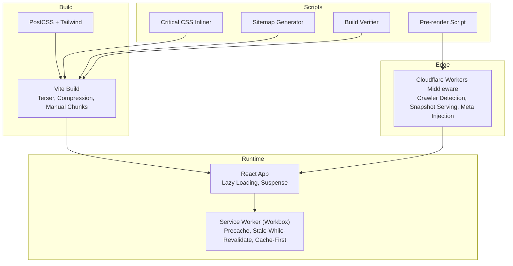

**Diagram sources**
- [vite.config.js](file://vite.config.js#L1-L262)
- [postcss.config.js](file://postcss.config.js#L1-L7)
- [tailwind.config.js](file://tailwind.config.js#L1-L47)
- [src/sw.js](file://src/sw.js#L1-L227)
- [functions/_middleware.js](file://functions/_middleware.js#L1-L383)
- [scripts/prerender.js](file://scripts/prerender.js#L1-L234)
- [scripts/inline-critical-css.js](file://scripts/inline-critical-css.js#L1-L61)
- [scripts/generate-sitemap.js](file://scripts/generate-sitemap.js#L1-L148)
- [scripts/verify-build.js](file://scripts/verify-build.js#L1-L84)

**Section sources**
- [vite.config.js](file://vite.config.js#L1-L262)
- [postcss.config.js](file://postcss.config.js#L1-L7)
- [tailwind.config.js](file://tailwind.config.js#L1-L47)
- [src/sw.js](file://src/sw.js#L1-L227)
- [functions/_middleware.js](file://functions/_middleware.js#L1-L383)
- [scripts/prerender.js](file://scripts/prerender.js#L1-L234)
- [scripts/inline-critical-css.js](file://scripts/inline-critical-css.js#L1-L61)
- [scripts/generate-sitemap.js](file://scripts/generate-sitemap.js#L1-L148)
- [scripts/verify-build.js](file://scripts/verify-build.js#L1-L84)

## Core Components
- Vite build configuration with Terser minification, gzip/brotli compression, manual code splitting, and asset inlining thresholds
- PostCSS and Tailwind for CSS optimization and purging unused styles
- PWA with VitePWA and a custom service worker implementing Workbox strategies
- Cloudflare Workers middleware for crawler compatibility, snapshot serving, and metadata injection
- Pre-rendering pipeline using Puppeteer to generate static snapshots for SEO
- Critical CSS inlining to eliminate render-blocking stylesheet requests
- Sitemap generation with multilingual hreflang and robots.txt creation
- Build verification to enforce routing hygiene on Cloudflare Pages

**Section sources**
- [vite.config.js](file://vite.config.js#L1-L262)
- [postcss.config.js](file://postcss.config.js#L1-L7)
- [tailwind.config.js](file://tailwind.config.js#L1-L47)
- [src/sw.js](file://src/sw.js#L1-L227)
- [functions/_middleware.js](file://functions/_middleware.js#L1-L383)
- [scripts/prerender.js](file://scripts/prerender.js#L1-L234)
- [scripts/inline-critical-css.js](file://scripts/inline-critical-css.js#L1-L61)
- [scripts/generate-sitemap.js](file://scripts/generate-sitemap.js#L1-L148)
- [scripts/verify-build.js](file://scripts/verify-build.js#L1-L84)

## Architecture Overview
The performance architecture combines client-side lazy loading, server-side pre-rendering, edge metadata injection, and robust caching strategies.

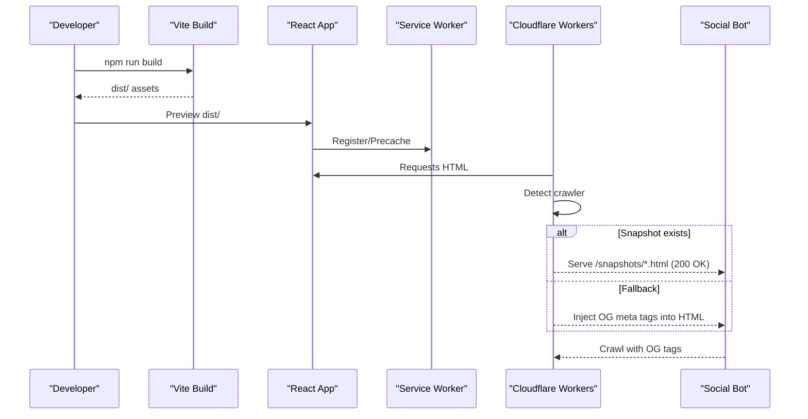

**Diagram sources**
- [package.json](file://package.json#L6-L14)
- [scripts/prerender.js](file://scripts/prerender.js#L136-L231)
- [functions/_middleware.js](file://functions/_middleware.js#L76-L264)
- [src/sw.js](file://src/sw.js#L26-L45)

## Detailed Component Analysis

### Vite Build Optimization and Code Splitting
- Minification: Terser with console/debugger removal and multiple passes
- Compression: gzip and brotli compression plugins
- Manual chunks: Separate bundles for core libraries, router, animations, i18n, and icons
- Chunk naming: Hashed filenames for long-term caching
- CSS strategy: Single CSS bundle for critical inlining; disable code-split CSS
- Asset inlining threshold: Small assets inlined as base64
- Source maps: Disabled for production builds

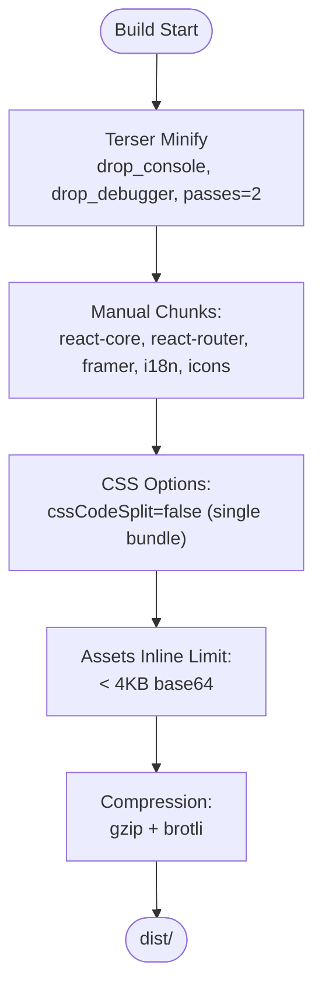

**Diagram sources**
- [vite.config.js](file://vite.config.js#L204-L248)

**Section sources**
- [vite.config.js](file://vite.config.js#L10-L203)
- [vite.config.js](file://vite.config.js#L204-L248)

### CSS Optimization with Tailwind and PostCSS
- Tailwind content scanning scoped to templates and source files
- Purge unused styles to reduce CSS size
- Autoprefixer for vendor prefixes

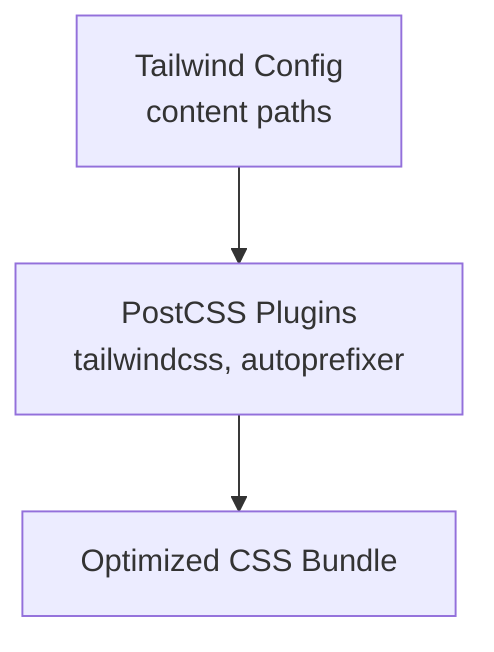

**Diagram sources**
- [tailwind.config.js](file://tailwind.config.js#L4-L7)
- [postcss.config.js](file://postcss.config.js#L1-L7)

**Section sources**
- [tailwind.config.js](file://tailwind.config.js#L1-L47)
- [postcss.config.js](file://postcss.config.js#L1-L7)

### Service Worker and Caching Strategies (PWA)
- Precache critical assets and offline page
- Navigation fallback to app shell
- Runtime caching:
  - JS/CSS: Stale-While-Revalidate
  - Images: Cache-First with size limits and quota error handling
  - Fonts: Cache-First with extended TTL
  - API: Network-First with timeouts and cache fallback
- Background sync for contact form submissions
- Periodic sync for background data refresh
- Offline fallback with custom page and placeholders

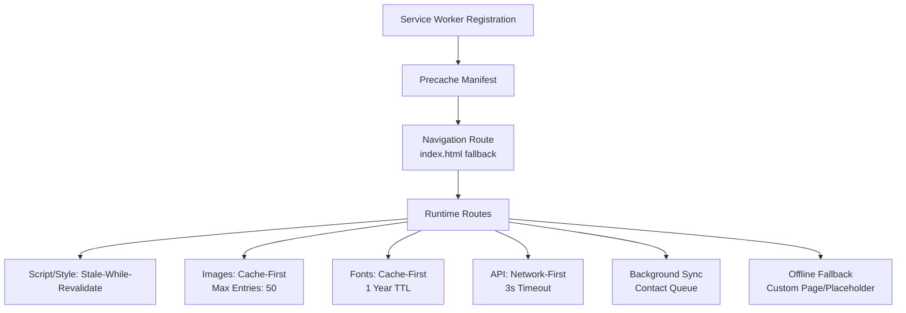

**Diagram sources**
- [src/sw.js](file://src/sw.js#L26-L174)
- [src/sw.js](file://src/sw.js#L176-L203)

**Section sources**
- [src/sw.js](file://src/sw.js#L1-L227)
- [vite.config.js](file://vite.config.js#L192-L201)

### Cloudflare Workers Middleware and Snapshot Serving
- Detects social crawlers and forces 200 OK for 206 responses
- Prepend OG meta tags to head for crawler parsing
- Hybrid pre-rendering: serve static snapshots when available
- Security headers injection for best practices score
- Locale-aware metadata injection and hreflang tags

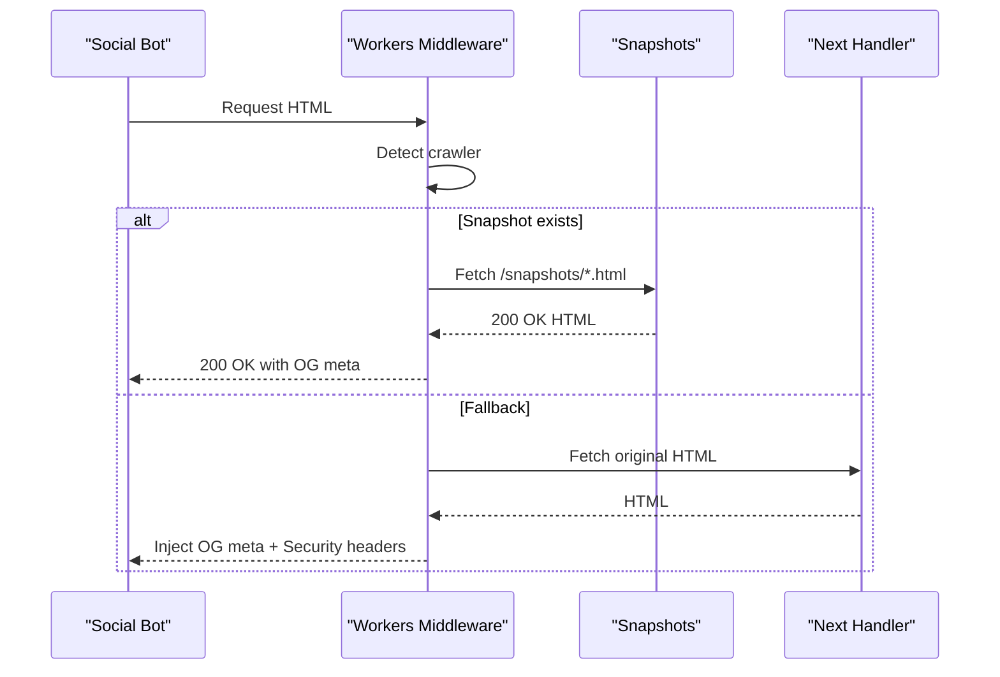

**Diagram sources**
- [functions/_middleware.js](file://functions/_middleware.js#L76-L144)
- [functions/_middleware.js](file://functions/_middleware.js#L228-L263)

**Section sources**
- [functions/_middleware.js](file://functions/_middleware.js#L1-L383)
- [functions/config/metadata.config.js](file://functions/config/metadata.config.js#L1-L369)
- [src/utils/MetaConfig.js](file://src/utils/MetaConfig.js#L1-L530)

### Pre-rendering Pipeline
- Discovers routes from sitemap.xml
- Starts Vite preview server and launches Puppeteer
- Navigates to each route and waits for network idle
- Writes snapshot HTML to public/snapshots with locale-aware naming
- Environment guard to enable/disable prerendering

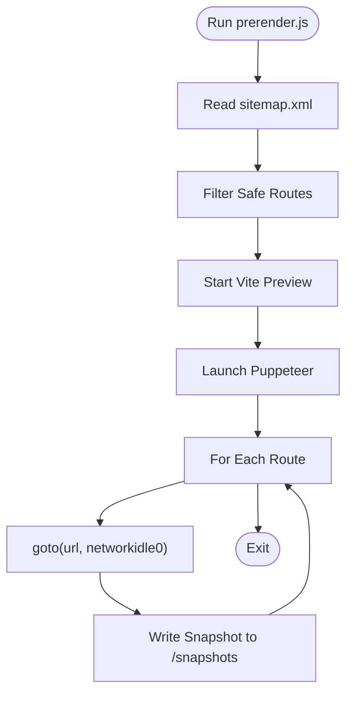

**Diagram sources**
- [scripts/prerender.js](file://scripts/prerender.js#L136-L231)

**Section sources**
- [scripts/prerender.js](file://scripts/prerender.js#L1-L234)

### Critical CSS Inlining
- Reads built index.html and finds the CSS asset
- Replaces stylesheet link with inline style block
- Logs size and elimination of render-blocking request

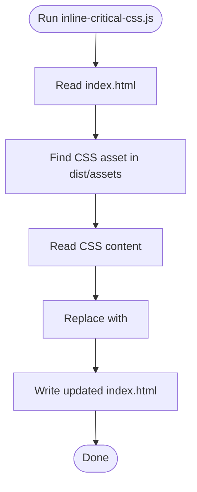

**Diagram sources**
- [scripts/inline-critical-css.js](file://scripts/inline-critical-css.js#L24-L55)

**Section sources**
- [scripts/inline-critical-css.js](file://scripts/inline-critical-css.js#L1-L61)

### Sitemap and Robots Generation
- Generates multilingual sitemap with hreflang alternates
- Creates robots.txt with sitemap reference and disallows
- Ensures dist directory exists before writing

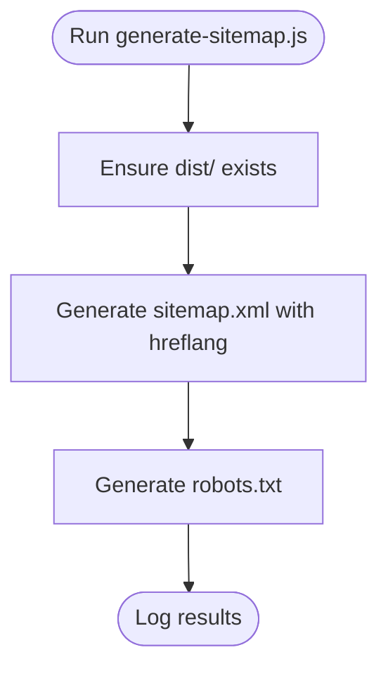

**Diagram sources**
- [scripts/generate-sitemap.js](file://scripts/generate-sitemap.js#L123-L145)

**Section sources**
- [scripts/generate-sitemap.js](file://scripts/generate-sitemap.js#L1-L148)

### Build Verification for Routing Hygiene
- Enforces “Clean Dist Root” policy on Cloudflare Pages
- Allows only specific HTML files in dist root
- Fails the build if unauthorized HTML files are found

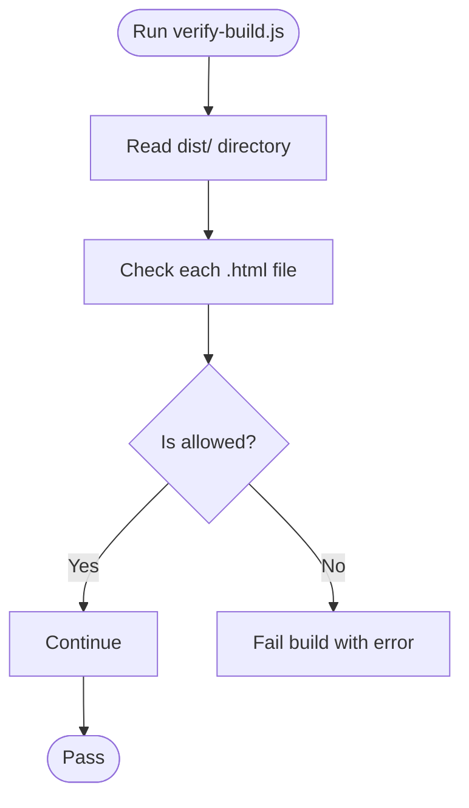

**Diagram sources**
- [scripts/verify-build.js](file://scripts/verify-build.js#L37-L81)

**Section sources**
- [scripts/verify-build.js](file://scripts/verify-build.js#L1-L84)

### Asset Generation Pipeline
- Automates PWA icons, favicons, and OG images from a master asset
- Produces multiple sizes and formats for branding and SEO

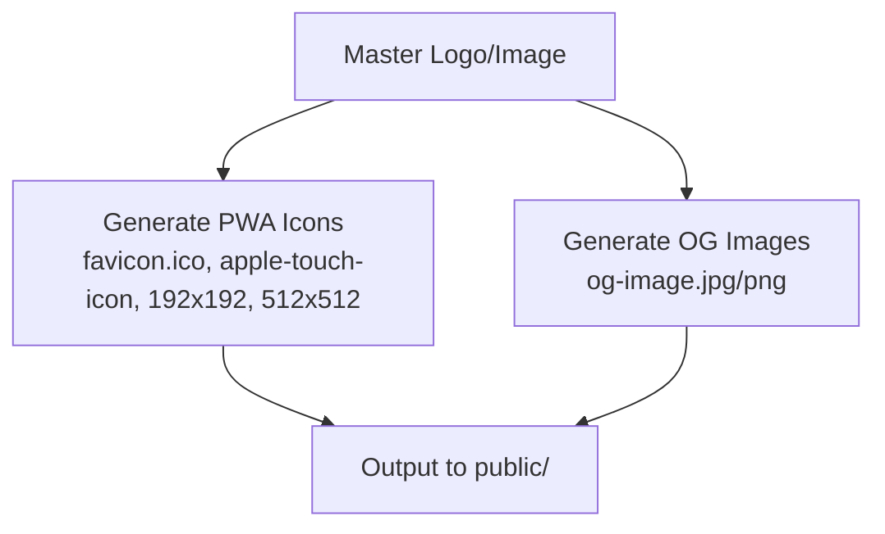

**Diagram sources**
- [scripts/process_assets.py](file://scripts/process_assets.py#L11-L77)

**Section sources**
- [scripts/process_assets.py](file://scripts/process_assets.py#L1-L78)

### Lazy Loading and Skeleton UI
- React.lazy with Suspense for route-level lazy loading
- Skeleton loader during initial page transitions
- Scroll-to-hash behavior with delayed smooth scroll

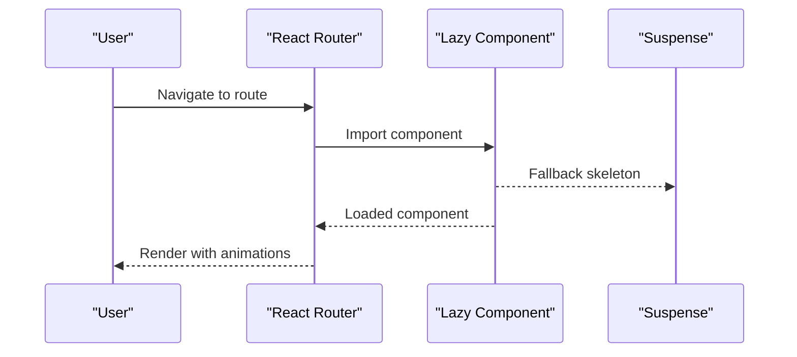

**Diagram sources**
- [src/App.jsx](file://src/App.jsx#L18-L36)
- [src/App.jsx](file://src/App.jsx#L39-L49)
- [src/App.jsx](file://src/App.jsx#L52-L72)

**Section sources**
- [src/App.jsx](file://src/App.jsx#L1-L348)
- [src/main.jsx](file://src/main.jsx#L1-L12)

## Dependency Analysis
The build and runtime depend on:
- Vite plugins for React, PWA, and compression
- Workbox for service worker strategies
- Cloudflare Workers for edge metadata and snapshot serving
- Puppeteer for pre-rendering
- Tailwind and PostCSS for CSS optimization

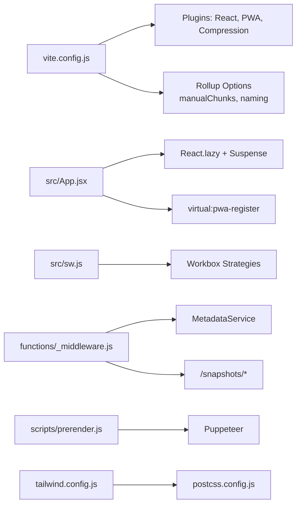

**Diagram sources**
- [vite.config.js](file://vite.config.js#L9-L203)
- [src/App.jsx](file://src/App.jsx#L18-L36)
- [src/sw.js](file://src/sw.js#L14-L21)
- [functions/_middleware.js](file://functions/_middleware.js#L29-L264)
- [scripts/prerender.js](file://scripts/prerender.js#L17-L231)
- [tailwind.config.js](file://tailwind.config.js#L1-L47)
- [postcss.config.js](file://postcss.config.js#L1-L7)

**Section sources**
- [vite.config.js](file://vite.config.js#L1-L262)
- [src/App.jsx](file://src/App.jsx#L1-L348)
- [src/sw.js](file://src/sw.js#L1-L227)
- [functions/_middleware.js](file://functions/_middleware.js#L1-L383)
- [scripts/prerender.js](file://scripts/prerender.js#L1-L234)
- [tailwind.config.js](file://tailwind.config.js#L1-L47)
- [postcss.config.js](file://postcss.config.js#L1-L7)

## Performance Considerations
- Bundle size optimization
  - Use manual chunks to separate heavy libraries (animations, i18n, icons)
  - Keep core bundles small and cacheable
  - Disable CSS code splitting to inline critical CSS
- Asset optimization
  - Inline small assets (< 4KB) as base64
  - Compress with gzip and brotli
  - Limit image cache size and purge on quota errors
- Caching strategies
  - Stale-While-Revalidate for JS/CSS
  - Cache-First for images and fonts
  - Network-First for API with timeouts
- Pre-rendering and metadata
  - Generate snapshots for SEO bots
  - Inject OG meta tags early in head for crawler parsing
- Monitoring and verification
  - Verify build output to avoid routing conflicts on Cloudflare Pages
  - Track bundle sizes and analyze with Vite’s built-in analyzer

[No sources needed since this section provides general guidance]

## Troubleshooting Guide
- Build verification failures
  - Ensure dist root contains only allowed HTML files
  - Investigate unauthorized HTML files and move content to snapshots
- Pre-rendering issues
  - Confirm ENABLE_PRERENDER is set to true
  - Verify sitemap.xml exists and routes are valid
  - Check Puppeteer launch and network idle conditions
- Service worker caching problems
  - Confirm precache manifest includes critical assets
  - Adjust cache expiration and size limits for images/fonts
- Metadata injection
  - Ensure crawler detection patterns match actual user agents
  - Verify snapshot paths align with prerendered filenames

**Section sources**
- [scripts/verify-build.js](file://scripts/verify-build.js#L37-L81)
- [scripts/prerender.js](file://scripts/prerender.js#L35-L38)
- [scripts/prerender.js](file://scripts/prerender.js#L85-L113)
- [src/sw.js](file://src/sw.js#L64-L96)
- [functions/_middleware.js](file://functions/_middleware.js#L276-L288)

## Conclusion
The project implements a comprehensive performance strategy combining Vite optimization, Workbox caching, Cloudflare Workers metadata injection, and pre-rendering. The build pipeline enforces routing hygiene and asset optimization, while the PWA layer ensures fast, reliable offline experiences. Together, these techniques deliver strong performance, SEO readiness, and maintainability.

[No sources needed since this section summarizes without analyzing specific files]

## Appendices

### Practical Examples

- Optimizing bundle size
  - Review manual chunk configuration and adjust vendor splits
  - Monitor chunk sizes and increase warning thresholds if needed
  - Keep CSS single-bundle for critical inlining

- Implementing lazy loading
  - Wrap route components with React.lazy and Suspense
  - Use skeleton loaders for smoother perceived performance

- Measuring performance metrics
  - Use Lighthouse and WebPageTest to benchmark
  - Monitor Core Web Vitals in production
  - Track bundle sizes and caching effectiveness

- Build pipeline optimization
  - Keep compression enabled (gzip/brotli)
  - Maintain hashed filenames for cache busting
  - Automate asset generation and metadata updates

- Caching strategies
  - Use Stale-While-Revalidate for JS/CSS
  - Apply Cache-First for images/fonts with quotas
  - Network-First for API with sensible timeouts

- Continuous performance monitoring
  - Integrate real-user monitoring (RUM) for LCP/FID/CLS
  - Automate build verification and pre-render checks
  - Regularly audit bundle composition and cache policies

**Section sources**
- [vite.config.js](file://vite.config.js#L222-L241)
- [src/App.jsx](file://src/App.jsx#L18-L36)
- [src/sw.js](file://src/sw.js#L49-L116)
- [functions/_middleware.js](file://functions/_middleware.js#L196-L224)
- [docs/AUDIT_REPORT.md](file://docs/AUDIT_REPORT.md#L17-L65)