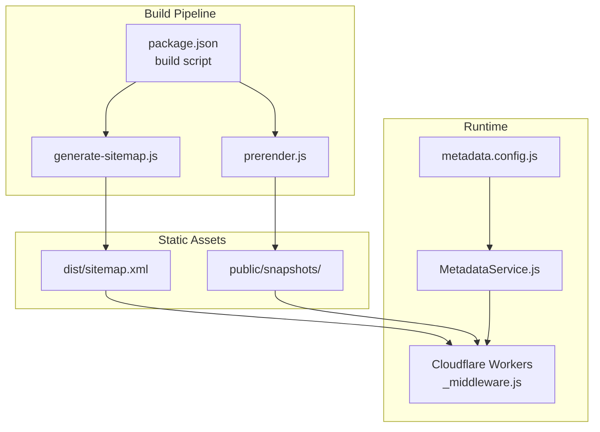
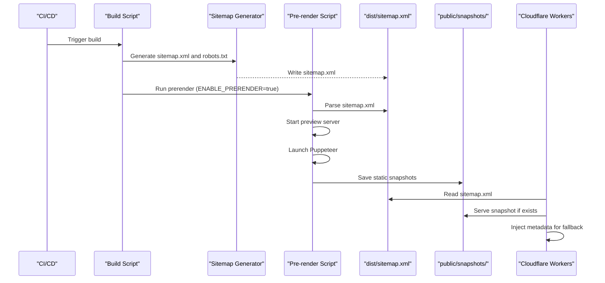
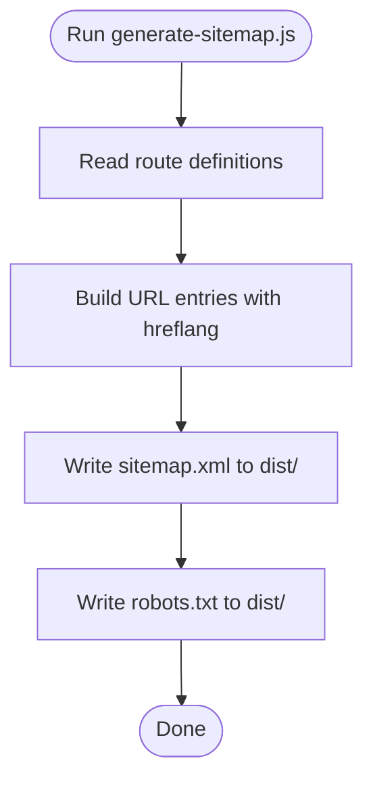
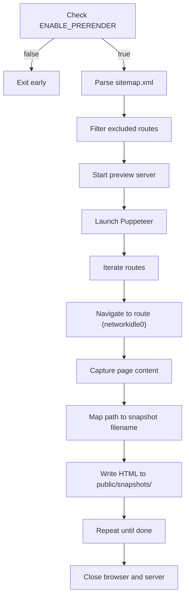
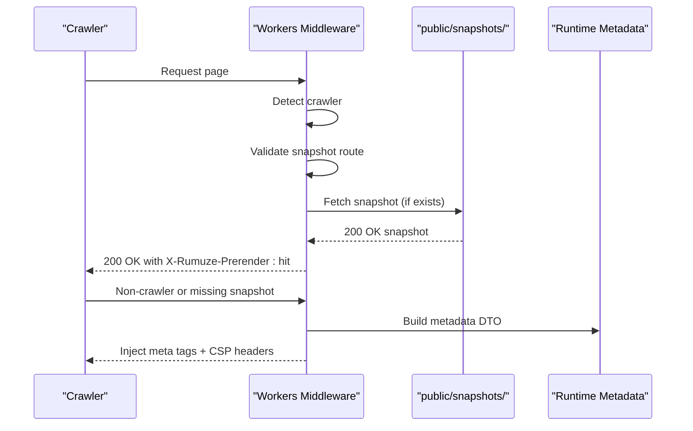
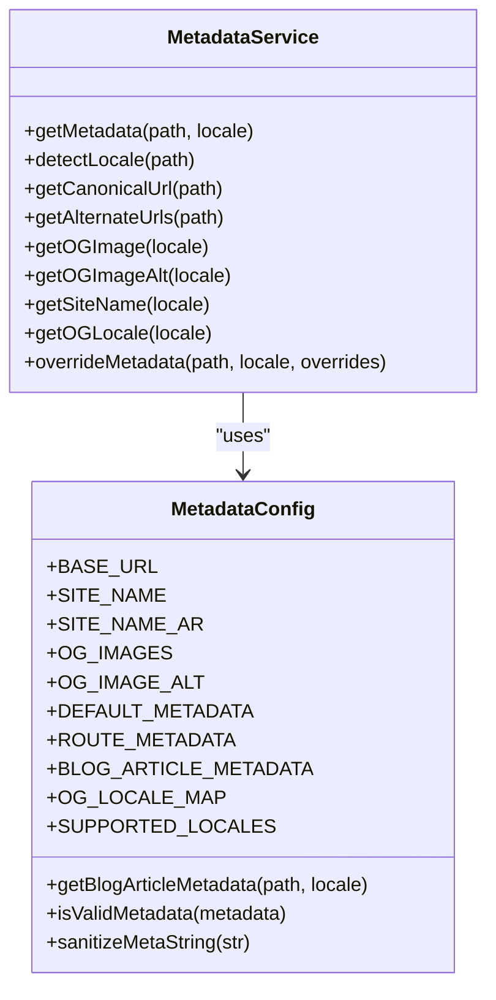
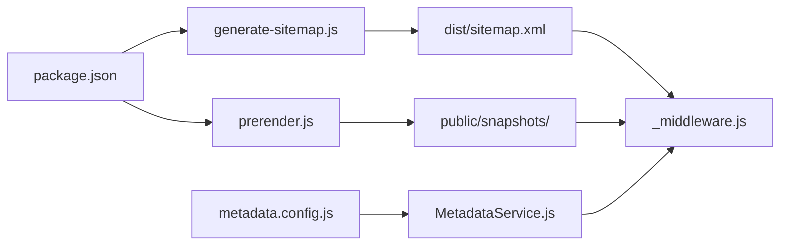

# Pre-rendering and Static Generation

<cite>
**Referenced Files in This Document**
- [prerender.js](file://scripts/prerender.js)
- [generate-sitemap.js](file://scripts/generate-sitemap.js)
- [_middleware.js](file://functions/_middleware.js)
- [MetadataService.js](file://functions/services/MetadataService.js)
- [metadata.config.js](file://functions/config/metadata.config.js)
- [sitemap.xml](file://dist/sitemap.xml)
- [package.json](file://package.json)
- [wrangler.jsonc](file://wrangler.jsonc)
- [deploy-snapshots.yml](file://.github/workflows/deploy-snapshots.yml)
- [index.html](file://public/snapshots/index.html)
- [ar_blog.html](file://public/snapshots/ar_blog.html)
</cite>

## Table of Contents
1. [Introduction](#introduction)
2. [Project Structure](#project-structure)
3. [Core Components](#core-components)
4. [Architecture Overview](#architecture-overview)
5. [Detailed Component Analysis](#detailed-component-analysis)
6. [Dependency Analysis](#dependency-analysis)
7. [Performance Considerations](#performance-considerations)
8. [Troubleshooting Guide](#troubleshooting-guide)
9. [Conclusion](#conclusion)

## Introduction
This document explains the pre-rendering system and static content generation for the landing page. It covers the workflow for generating static HTML snapshots of dynamic routes, the sitemap-driven discovery mechanism, URL mapping strategies, and SEO benefits of serving prerendered content. It also documents the integration with Cloudflare Workers middleware for serving prerendered content to crawlers, practical examples for extending the system, monitoring prerendering performance, and fallback strategies.

## Project Structure
The pre-rendering system spans several key areas:
- Build-time sitemap generation and critical CSS inlining
- Pre-rendering script that launches a local preview server, navigates to discovered routes, and saves static HTML snapshots
- Cloudflare Workers middleware that detects crawlers, serves prerendered snapshots when available, and injects metadata for fallback scenarios
- Metadata service and configuration that power SEO metadata generation for both prerendered snapshots and runtime metadata injection

**Diagram sources**
- [package.json](file://package.json#L6-L14)
- [generate-sitemap.js](file://scripts/generate-sitemap.js#L123-L145)
- [prerender.js](file://scripts/prerender.js#L136-L231)
- [_middleware.js](file://functions/_middleware.js#L76-L264)
- [MetadataService.js](file://functions/services/MetadataService.js#L44-L347)
- [metadata.config.js](file://functions/config/metadata.config.js#L119-L369)

**Section sources**
- [package.json](file://package.json#L6-L14)
- [generate-sitemap.js](file://scripts/generate-sitemap.js#L123-L145)
- [prerender.js](file://scripts/prerender.js#L136-L231)
- [_middleware.js](file://functions/_middleware.js#L76-L264)
- [MetadataService.js](file://functions/services/MetadataService.js#L44-L347)
- [metadata.config.js](file://functions/config/metadata.config.js#L119-L369)

## Core Components
- Sitemap generator: Produces multilingual sitemaps with hreflang entries and robots.txt, ensuring crawlers discover all routes consistently.
- Pre-rendering engine: Discovers routes from the generated sitemap, launches a preview server, renders pages with Puppeteer, and writes static HTML snapshots to the public snapshots directory.
- Cloudflare Workers middleware: Detects crawlers, checks for prerendered snapshots, serves them with a 200 OK status, and injects metadata for fallback scenarios.
- Metadata service: Centralized configuration and resolver for SEO metadata, supporting route-specific, article-level, and locale-aware metadata.

**Section sources**
- [generate-sitemap.js](file://scripts/generate-sitemap.js#L45-L84)
- [prerender.js](file://scripts/prerender.js#L85-L113)
- [_middleware.js](file://functions/_middleware.js#L94-L144)
- [MetadataService.js](file://functions/services/MetadataService.js#L70-L88)
- [metadata.config.js](file://functions/config/metadata.config.js#L119-L336)

## Architecture Overview
The system follows a hybrid prerendering approach:
- Build-time discovery: The sitemap drives which routes are prerendered.
- Snapshot generation: Puppeteer renders each route and saves static HTML.
- Runtime serving: Cloudflare Workers serves snapshots to crawlers and injects metadata for humans and non-prerendered requests.

**Diagram sources**
- [package.json](file://package.json#L6-L14)
- [generate-sitemap.js](file://scripts/generate-sitemap.js#L123-L145)
- [prerender.js](file://scripts/prerender.js#L136-L231)
- [_middleware.js](file://functions/_middleware.js#L94-L144)

## Detailed Component Analysis

### Sitemap Generation and Discovery
- Purpose: Automate sitemap creation with hreflang entries and robots.txt, ensuring multilingual coverage and crawler compliance.
- Key behaviors:
  - Defines route list with priorities and change frequencies.
  - Generates both English and Arabic variants for each route.
  - Writes sitemap.xml and robots.txt to the dist directory.
  - Robots.txt references the sitemap and disallows admin/API routes.

**Diagram sources**
- [generate-sitemap.js](file://scripts/generate-sitemap.js#L45-L84)
- [generate-sitemap.js](file://scripts/generate-sitemap.js#L123-L145)

**Section sources**
- [generate-sitemap.js](file://scripts/generate-sitemap.js#L23-L39)
- [generate-sitemap.js](file://scripts/generate-sitemap.js#L45-L84)
- [generate-sitemap.js](file://scripts/generate-sitemap.js#L123-L145)
- [sitemap.xml](file://dist/sitemap.xml#L1-L149)

### Pre-rendering Workflow
- Environment guard: Skips prerendering unless ENABLE_PRERENDER is set to true.
- Route discovery: Parses sitemap.xml and filters out excluded routes and file extensions.
- Server control: Spawns the Vite preview server on a fixed port.
- Rendering: Launches Puppeteer, navigates to each route with network idle, captures content, and writes snapshots to public/snapshots/.
- Naming strategy: Converts paths to filenames (e.g., / -> index.html, /services -> services.html, /ar/services -> ar_services.html).

**Diagram sources**
- [prerender.js](file://scripts/prerender.js#L35-L38)
- [prerender.js](file://scripts/prerender.js#L85-L113)
- [prerender.js](file://scripts/prerender.js#L119-L130)
- [prerender.js](file://scripts/prerender.js#L168-L231)

**Section sources**
- [prerender.js](file://scripts/prerender.js#L35-L38)
- [prerender.js](file://scripts/prerender.js#L85-L113)
- [prerender.js](file://scripts/prerender.js#L119-L130)
- [prerender.js](file://scripts/prerender.js#L168-L231)

### Cloudflare Workers Middleware Integration
- Crawler detection: Identifies social media and search engine crawlers via user-agent patterns.
- Snapshot serving: For valid snapshot routes, constructs snapshot path, fetches from same origin, and serves with 200 OK and prerender header.
- Fallback metadata injection: For non-crawlers or missing snapshots, builds and injects SEO meta tags, sets CSP headers, and normalizes response status.
- URL mapping: Mirrors the pre-render naming convention for snapshot paths.

**Diagram sources**
- [_middleware.js](file://functions/_middleware.js#L94-L144)
- [_middleware.js](file://functions/_middleware.js#L150-L264)

**Section sources**
- [_middleware.js](file://functions/_middleware.js#L42-L62)
- [_middleware.js](file://functions/_middleware.js#L94-L144)
- [_middleware.js](file://functions/_middleware.js#L150-L264)

### Metadata Service and Configuration
- MetadataService: Resolves localized metadata for routes, supports exact and includes-based matching, article-level metadata for blog posts, and hreflang alternates.
- metadata.config.js: Centralized configuration for default and route-specific metadata, blog article metadata, locale mappings, and helper functions for sanitization and validation.

**Diagram sources**
- [MetadataService.js](file://functions/services/MetadataService.js#L44-L347)
- [metadata.config.js](file://functions/config/metadata.config.js#L119-L369)

**Section sources**
- [MetadataService.js](file://functions/services/MetadataService.js#L70-L88)
- [MetadataService.js](file://functions/services/MetadataService.js#L247-L262)
- [MetadataService.js](file://functions/services/MetadataService.js#L336-L346)
- [metadata.config.js](file://functions/config/metadata.config.js#L119-L336)

### Snapshot Examples and URL Mapping
- Example snapshots: English home page and Arabic blog page demonstrate prerendered HTML with injected metadata and canonical/hreflang tags.
- URL mapping: The middleware and prerenderer convert paths to snapshot filenames using the same convention.

**Section sources**
- [index.html](file://public/snapshots/index.html#L1-L67)
- [ar_blog.html](file://public/snapshots/ar_blog.html#L1-L67)

## Dependency Analysis
The system integrates multiple components with clear boundaries:
- Build pipeline depends on sitemap generation and prerendering scripts.
- Runtime depends on Cloudflare Workers, snapshot availability, and metadata service.
- Configuration underpins both prerendering and runtime metadata generation.

**Diagram sources**
- [package.json](file://package.json#L6-L14)
- [generate-sitemap.js](file://scripts/generate-sitemap.js#L123-L145)
- [prerender.js](file://scripts/prerender.js#L136-L231)
- [_middleware.js](file://functions/_middleware.js#L76-L264)
- [metadata.config.js](file://functions/config/metadata.config.js#L119-L369)
- [MetadataService.js](file://functions/services/MetadataService.js#L44-L347)

**Section sources**
- [package.json](file://package.json#L6-L14)
- [generate-sitemap.js](file://scripts/generate-sitemap.js#L123-L145)
- [prerender.js](file://scripts/prerender.js#L136-L231)
- [_middleware.js](file://functions/_middleware.js#L76-L264)
- [metadata.config.js](file://functions/config/metadata.config.js#L119-L369)
- [MetadataService.js](file://functions/services/MetadataService.js#L44-L347)

## Performance Considerations
- Headless rendering: Puppeteer runs in headless mode with sandbox disabled for compatibility; ensure sufficient resources for concurrent rendering.
- Network idle waits: Using networkidle0 ensures heavy JavaScript loads complete; consider timeouts and throttling for large pages.
- Snapshot caching: Serving static snapshots avoids server-side rendering for crawlers, reducing latency and improving crawl efficiency.
- Asset delivery: Cloudflare Pages delivers snapshots efficiently; ensure proper caching headers and compression.
- Build pipeline: The prerender step runs after sitemap generation; keep sitemap minimal and accurate to reduce prerender workload.

[No sources needed since this section provides general guidance]

## Troubleshooting Guide
Common issues and resolutions:
- Sitemap not found: Ensure the build step runs before prerendering so dist/sitemap.xml exists.
- Empty route list: Verify sitemap contains valid URLs and that filtering rules do not exclude intended routes.
- Preview server failures: Confirm Vite preview port is free and the build artifacts are present.
- Snapshot not served: Check snapshot path mapping and ensure the snapshots directory is committed and deployed.
- Metadata mismatch: Validate metadata configuration and ensure locale detection resolves correctly for routes.
- CI/CD pipeline: The workflow disables prerendering during the build step and enables it for the dedicated prerender job.

**Section sources**
- [prerender.js](file://scripts/prerender.js#L85-L88)
- [prerender.js](file://scripts/prerender.js#L150-L157)
- [prerender.js](file://scripts/prerender.js#L165-L166)
- [deploy-snapshots.yml](file://.github/workflows/deploy-snapshots.yml#L28-L37)

## Conclusion
The pre-rendering system leverages a sitemap-driven discovery mechanism, Puppeteer-based rendering, and Cloudflare Workers middleware to deliver optimized static snapshots for crawlers while maintaining robust metadata injection for human visitors. By centralizing metadata configuration and automating snapshot generation, the system improves SEO performance, reduces runtime overhead, and ensures consistent cross-locale presentation.