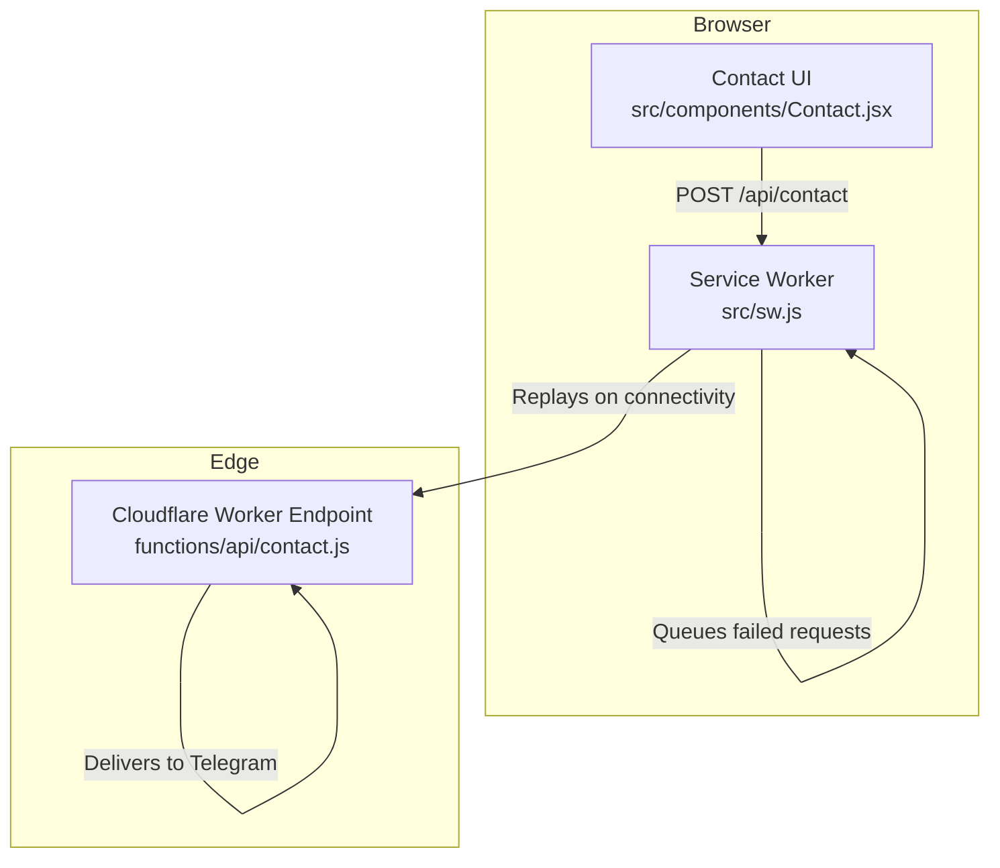
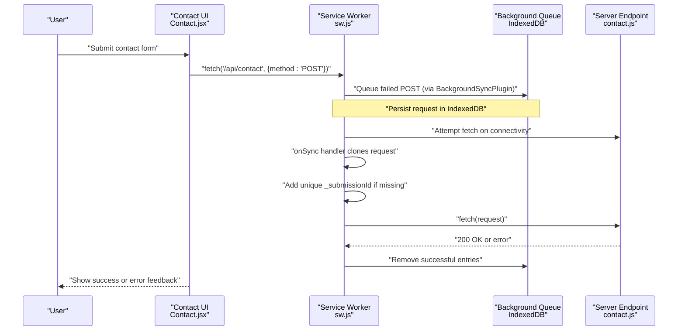
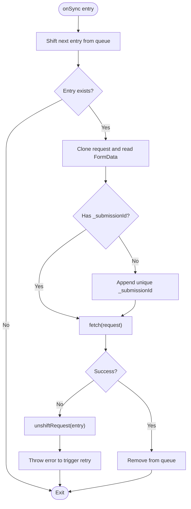
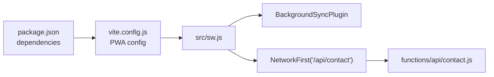

# Background Sync

<cite>
**Referenced Files in This Document**
- [src/sw.js](file://src/sw.js)
- [functions/api/contact.js](file://functions/api/contact.js)
- [src/components/Contact.jsx](file://src/components/Contact.jsx)
- [src/pages/ContactPage.jsx](file://src/pages/ContactPage.jsx)
- [vite.config.js](file://vite.config.js)
- [package.json](file://package.json)
- [docs/RUMUZE_TECHNICAL_MASTER_AUDIT.md](file://docs/RUMUZE_TECHNICAL_MASTER_AUDIT.md)
</cite>

## Table of Contents
1. [Introduction](#introduction)
2. [Project Structure](#project-structure)
3. [Core Components](#core-components)
4. [Architecture Overview](#architecture-overview)
5. [Detailed Component Analysis](#detailed-component-analysis)
6. [Dependency Analysis](#dependency-analysis)
7. [Performance Considerations](#performance-considerations)
8. [Troubleshooting Guide](#troubleshooting-guide)
9. [Conclusion](#conclusion)
10. [Appendices](#appendices)

## Introduction
This document explains the background sync implementation for the contact form submission system. It covers the BackgroundSyncPlugin configuration, queue management, retry mechanisms, unique submission ID generation, duplicate prevention, error handling, testing and debugging strategies, monitoring queues, onSync event handling, request cloning techniques, and server-side considerations. It also addresses sync limitations, browser support variations, and user permission requirements.

## Project Structure
The background sync solution spans three layers:
- Frontend: Contact form UI and submission flow
- Service Worker: Background sync orchestration and queue replay
- Backend: Cloudflare Worker endpoint for contact submissions

**Diagram sources**
- [src/components/Contact.jsx](file://src/components/Contact.jsx#L44-L82)
- [src/sw.js](file://src/sw.js#L118-L153)
- [functions/api/contact.js](file://functions/api/contact.js#L1-L62)

**Section sources**
- [src/components/Contact.jsx](file://src/components/Contact.jsx#L1-L359)
- [src/sw.js](file://src/sw.js#L1-L227)
- [functions/api/contact.js](file://functions/api/contact.js#L1-L62)

## Core Components
- BackgroundSyncPlugin in the Service Worker queues failed POST requests to IndexedDB and replays them when connectivity is restored.
- The onSync handler clones requests, appends a unique submission ID if missing, and sends them to the backend.
- The frontend Contact component submits data via fetch to the same endpoint used by the Service Worker, enabling background sync when offline or on network failure.
- The Cloudflare Worker endpoint validates and forwards messages to Telegram.

**Section sources**
- [src/sw.js](file://src/sw.js#L118-L153)
- [src/components/Contact.jsx](file://src/components/Contact.jsx#L44-L82)
- [functions/api/contact.js](file://functions/api/contact.js#L1-L62)

## Architecture Overview
The background sync pipeline integrates Workbox’s BackgroundSyncPlugin with a custom onSync handler to ensure reliable delivery of contact form submissions.

**Diagram sources**
- [src/sw.js](file://src/sw.js#L118-L153)
- [src/sw.js](file://src/sw.js#L121-L145)
- [src/components/Contact.jsx](file://src/components/Contact.jsx#L44-L82)
- [functions/api/contact.js](file://functions/api/contact.js#L1-L62)

## Detailed Component Analysis

### BackgroundSyncPlugin Configuration and onSync Handler
- Queue name: "contactQueue"
- Retention window: 24 hours
- Route: NetworkFirst strategy for POST to "/api/contact"
- onSync loop:
  - Shifts the next entry from the queue
  - Clones the request and reads its FormData
  - Ensures a unique "_submissionId" is present
  - Sends the request to the server
  - On failure, re-unshifts the entry to retry later

**Diagram sources**
- [src/sw.js](file://src/sw.js#L121-L145)

**Section sources**
- [src/sw.js](file://src/sw.js#L118-L153)
- [src/sw.js](file://src/sw.js#L121-L145)

### Queue Management and Retries
- Workbox persists queued requests in IndexedDB under the "workbox-background-sync" database.
- The Queue maintains entries with timestamps and supports FIFO ordering.
- Retention is enforced by maxRetentionTime; expired entries are pruned.
- The onSync handler replays entries in order; failures cause re-insertion at the front of the queue.

**Section sources**
- [src/sw.js](file://src/sw.js#L118-L153)

### Unique Submission ID Generation and Duplicate Prevention
- The onSync handler checks for "_submissionId" in the FormData.
- If absent, it generates a unique ID combining a timestamp and a random suffix.
- This ID prevents duplicate submissions when the same request is replayed after a network failure.

**Section sources**
- [src/sw.js](file://src/sw.js#L121-L145)

### Frontend Contact Form Submission
- The Contact component validates fields and posts JSON to "/api/contact".
- On success, it clears the form and shows a success message.
- On error, it surfaces a user-friendly alert.

**Section sources**
- [src/components/Contact.jsx](file://src/components/Contact.jsx#L33-L82)
- [src/pages/ContactPage.jsx](file://src/pages/ContactPage.jsx#L1-L27)

### Server-Side Endpoint Behavior
- The Cloudflare Worker endpoint expects JSON, extracts fields, and posts to Telegram.
- It returns a 200 on success and a 500 on error with a JSON body.

**Section sources**
- [functions/api/contact.js](file://functions/api/contact.js#L1-L62)

### Request Cloning Techniques
- The onSync handler clones the Request and its body to safely replay it.
- FormData is read from a cloned request to inspect and augment with "_submissionId".

**Section sources**
- [src/sw.js](file://src/sw.js#L121-L145)

### Testing Background Sync Scenarios
Recommended testing approaches:
- Simulate offline conditions and submit the form; verify it is queued.
- Trigger a periodic background sync event to replay queued requests.
- Force a failure in the endpoint to ensure re-queuing and retries.
- Verify unique "_submissionId" appears in replayed requests.

Practical steps:
- Use DevTools Network panel to toggle "Offline" and submit.
- Use the Periodic Background Sync event to manually trigger queue replay.
- Observe IndexedDB entries under the "workbox-background-sync" database.

**Section sources**
- [src/sw.js](file://src/sw.js#L183-L203)

### Debugging Failed Requests
- Inspect the "workbox-background-sync" database in the browser’s Application panel.
- Confirm entries exist with timestamps and queue names.
- Review Service Worker logs for errors during onSync.
- Validate that "_submissionId" is present on replayed requests.

**Section sources**
- [src/sw.js](file://src/sw.js#L121-L145)

### Monitoring Sync Queues
- Use the browser’s IndexedDB viewer to inspect the "requests" object store.
- Track queue size and retention by querying entries and timestamps.
- Monitor Service Worker logs for replay attempts and failures.

**Section sources**
- [src/sw.js](file://src/sw.js#L118-L153)

### Browser Support and Permissions
- Background sync requires the "sync" registration capability in the Service Worker.
- Some runtimes may fall back to replaying on startup if background sync is unavailable.
- Users must grant permission for notifications if the site uses them; however, background sync itself does not require notification permissions.

**Section sources**
- [src/sw.js](file://src/sw.js#L183-L203)

## Dependency Analysis
The background sync relies on:
- Workbox BackgroundSyncPlugin for queuing and replay
- Service Worker lifecycle for onSync handling
- Cloudflare Worker for endpoint processing
- Vite PWA configuration for service worker injection

**Diagram sources**
- [package.json](file://package.json#L16-L31)
- [vite.config.js](file://vite.config.js#L19-L202)
- [src/sw.js](file://src/sw.js#L118-L153)
- [functions/api/contact.js](file://functions/api/contact.js#L1-L62)

**Section sources**
- [package.json](file://package.json#L1-L49)
- [vite.config.js](file://vite.config.js#L1-L262)
- [src/sw.js](file://src/sw.js#L1-L227)
- [functions/api/contact.js](file://functions/api/contact.js#L1-L62)

## Performance Considerations
- Keep request bodies small to minimize IndexedDB storage and improve replay throughput.
- Use concise FormData or JSON payloads for contact submissions.
- Avoid unnecessary metadata in queue entries; only include essential request data.

## Troubleshooting Guide
Common issues and resolutions:
- Requests not replaying:
  - Verify the "sync" registration is available and the tag matches the queue name.
  - Check for errors thrown in onSync that would re-register the sync.
- Duplicate submissions:
  - Ensure "_submissionId" is appended and respected by the server.
- Stuck or oversized queues:
  - Confirm maxRetentionTime is sufficient and expired entries are pruned.
- Endpoint failures:
  - Inspect server logs and response codes; ensure proper JSON handling.

**Section sources**
- [src/sw.js](file://src/sw.js#L118-L153)
- [src/sw.js](file://src/sw.js#L121-L145)
- [functions/api/contact.js](file://functions/api/contact.js#L1-L62)

## Conclusion
The background sync implementation provides robust, offline-first contact form submissions by queuing failed POST requests and replaying them reliably when connectivity returns. The unique submission ID mechanism prevents duplicates, while the onSync handler ensures safe request cloning and controlled retries. Together with the Cloudflare Worker endpoint, this design delivers a resilient user experience across varied network conditions.

## Appendices

### Practical Examples and References
- Background sync configuration and onSync handler: [src/sw.js](file://src/sw.js#L118-L153), [src/sw.js](file://src/sw.js#L121-L145)
- Contact form submission flow: [src/components/Contact.jsx](file://src/components/Contact.jsx#L44-L82)
- Server endpoint behavior: [functions/api/contact.js](file://functions/api/contact.js#L1-L62)
- PWA and Service Worker configuration: [vite.config.js](file://vite.config.js#L19-L202), [package.json](file://package.json#L16-L31)
- Technical audit reference: [docs/RUMUZE_TECHNICAL_MASTER_AUDIT.md](file://docs/RUMUZE_TECHNICAL_MASTER_AUDIT.md#L85-L92)