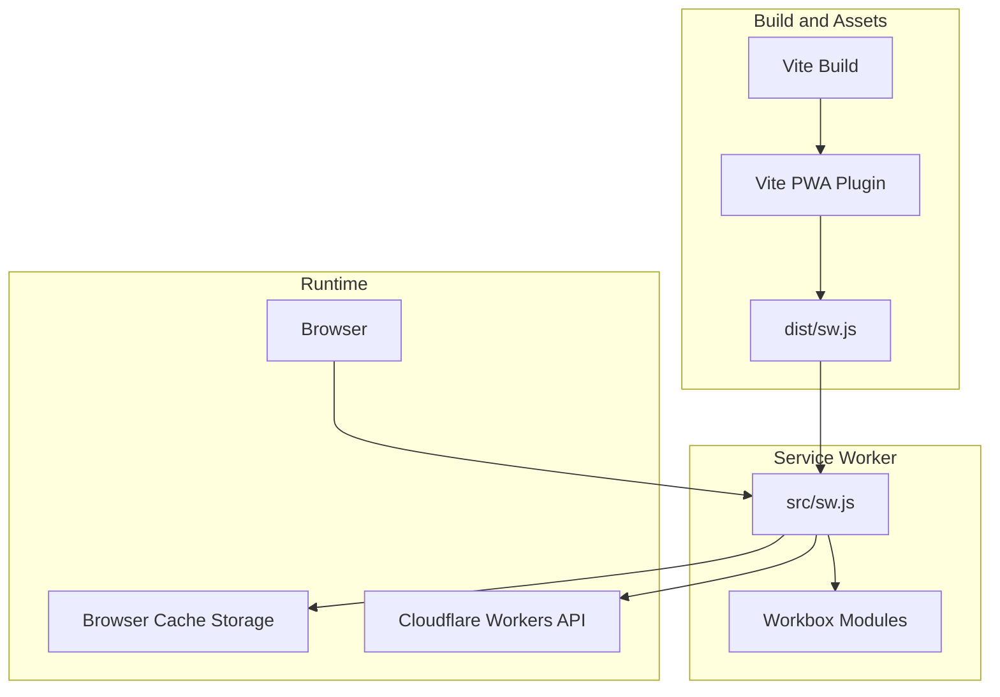
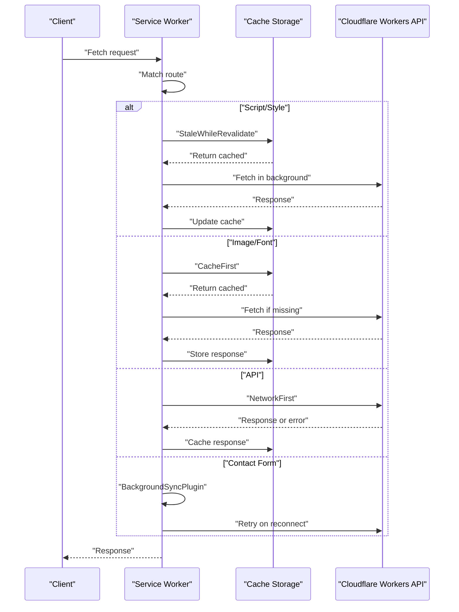
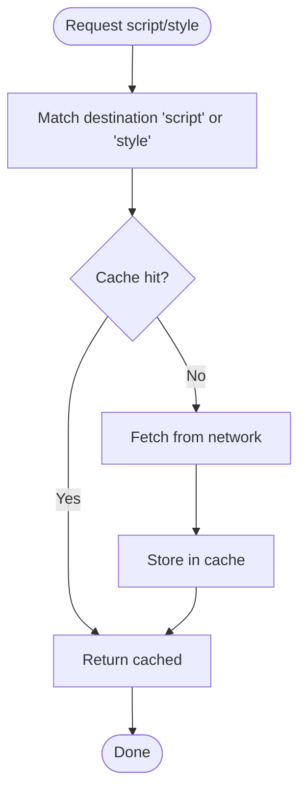
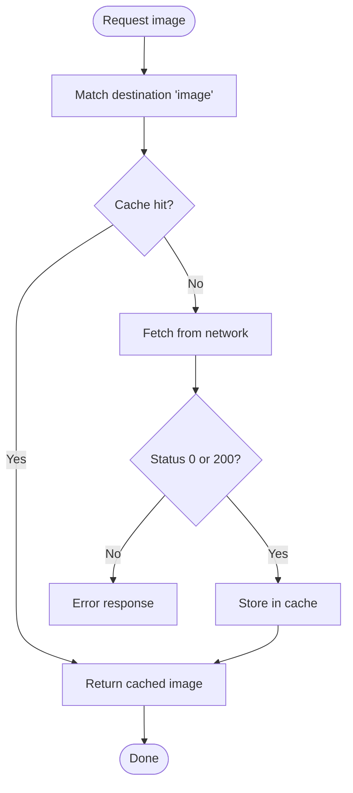
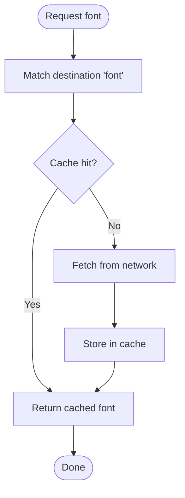
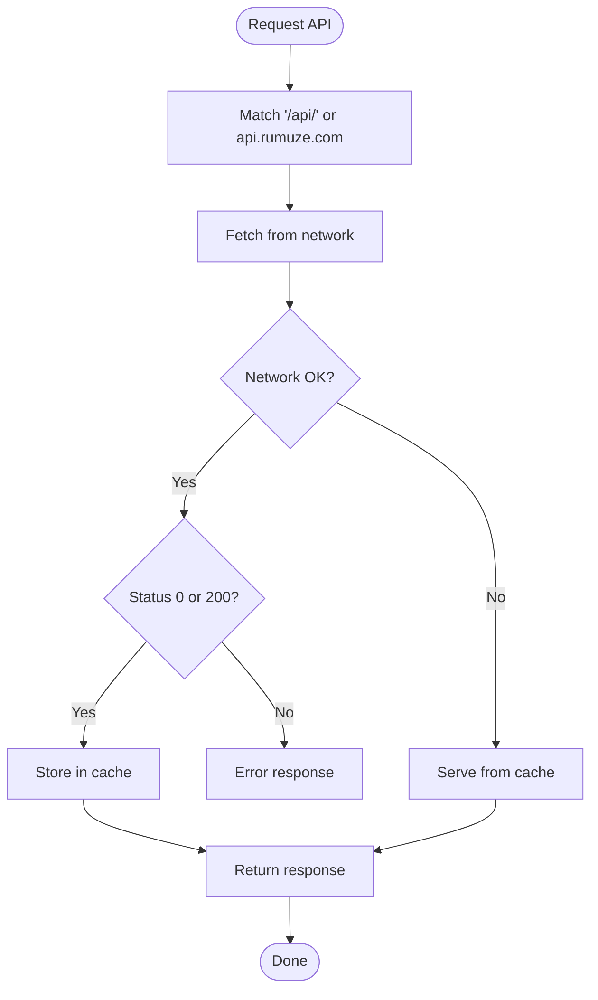
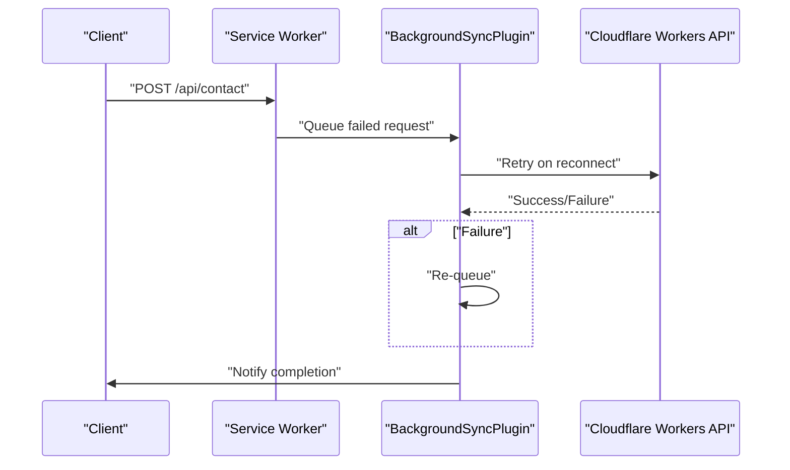
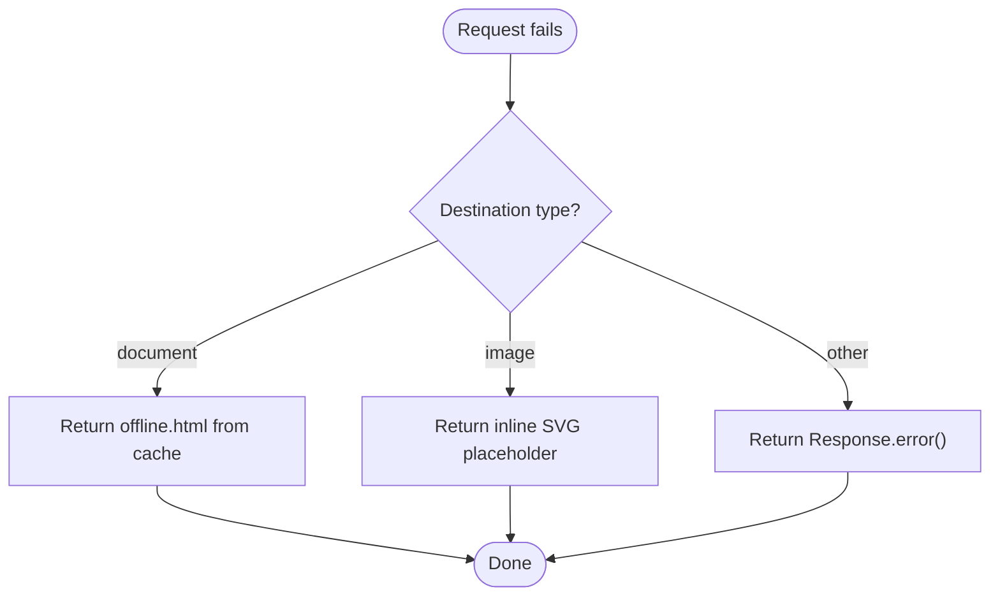
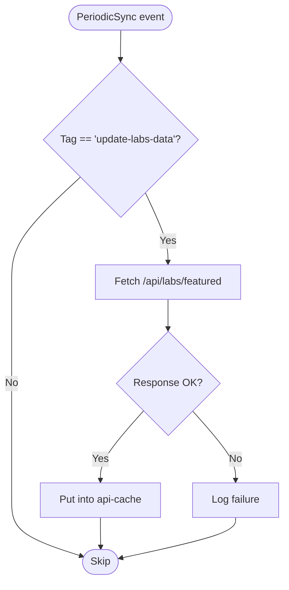
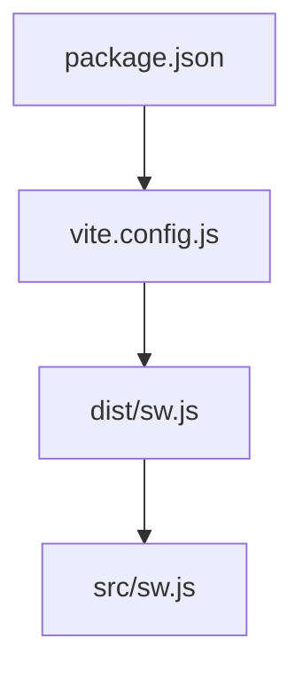

# Caching Strategies

<cite>
**Referenced Files in This Document**
- [src/sw.js](file://src/sw.js)
- [dist/sw.js](file://dist/sw.js)
- [vite.config.js](file://vite.config.js)
- [package.json](file://package.json)
- [public/offline.html](file://public/offline.html)
- [src/pages/OfflineFallback.jsx](file://src/pages/OfflineFallback.jsx)
- [functions/api/contact.js](file://functions/api/contact.js)
- [wrangler.jsonc](file://wrangler.jsonc)
</cite>

## Table of Contents
1. [Introduction](#introduction)
2. [Project Structure](#project-structure)
3. [Core Components](#core-components)
4. [Architecture Overview](#architecture-overview)
5. [Detailed Component Analysis](#detailed-component-analysis)
6. [Dependency Analysis](#dependency-analysis)
7. [Performance Considerations](#performance-considerations)
8. [Troubleshooting Guide](#troubleshooting-guide)
9. [Conclusion](#conclusion)
10. [Appendices](#appendices)

## Introduction
This document explains the caching strategies implemented using Workbox in the project. It covers:
- StaleWhileRevalidate for scripts and styles
- CacheFirst for images and fonts
- NetworkFirst for API calls
- Background Sync for forms
- Cache expiration policies, entry limits, and quota management
- Practical configuration examples for cache names, expiration plugins, and cacheable response validation
- Rationale, performance implications, and trade-offs
- Guidance on optimizing cache sizes, managing cache conflicts, and implementing cache warming

## Project Structure
The caching logic is implemented in a Service Worker built with Vite and injected via the PWA plugin. The Service Worker registers runtime caching strategies and sets up offline fallbacks and background sync.

**Diagram sources**
- [vite.config.js](file://vite.config.js#L19-L202)
- [src/sw.js](file://src/sw.js#L1-L227)
- [dist/sw.js](file://dist/sw.js#L1-L2)

**Section sources**
- [vite.config.js](file://vite.config.js#L1-L262)
- [package.json](file://package.json#L1-L49)

## Core Components
- Service Worker entry and Workbox imports
- Pre-caching and outdated cache cleanup
- Navigation fallback to SPA shell
- Runtime caching strategies:
  - StaleWhileRevalidate for scripts/styles
  - CacheFirst for images/fonts
  - NetworkFirst for API
  - Background Sync for contact form
- Global offline fallback handler
- Periodic background sync for data updates
- Push notifications

**Section sources**
- [src/sw.js](file://src/sw.js#L1-L227)
- [dist/sw.js](file://dist/sw.js#L1-L2)

## Architecture Overview
The Service Worker orchestrates caching and offline behavior:
- Precache critical assets during install
- Route requests to appropriate strategies
- Enforce expiration and quotas
- Fallback to offline pages or placeholders
- Retry failed form submissions via background sync

**Diagram sources**
- [src/sw.js](file://src/sw.js#L49-L153)
- [dist/sw.js](file://dist/sw.js#L1-L2)

## Detailed Component Analysis

### StaleWhileRevalidate for Scripts and Styles
- Strategy: Serve from cache immediately, update in background
- Cache name: static-resources
- Expiration: maxEntries 50, maxAgeSeconds ~30 days
- Rationale: Fast first render for JS/CSS; background refresh keeps assets fresh
- Trade-offs: Slight risk of serving slightly stale assets until background update completes

**Diagram sources**
- [src/sw.js](file://src/sw.js#L49-L62)
- [dist/sw.js](file://dist/sw.js#L1-L2)

**Section sources**
- [src/sw.js](file://src/sw.js#L49-L62)

### CacheFirst for Images
- Strategy: Serve from cache; fall back to network if missing
- Cache name: images-cache
- Expiration: maxEntries 50, maxAgeSeconds ~30 days, purgeOnQuotaError enabled
- Cacheable response validation: statuses [0, 200]
- Rationale: Images are static and benefit from fast local delivery
- Trade-offs: Risk of serving expired images if purgeOnQuotaError triggers

**Diagram sources**
- [src/sw.js](file://src/sw.js#L64-L81)
- [dist/sw.js](file://dist/sw.js#L1-L2)

**Section sources**
- [src/sw.js](file://src/sw.js#L64-L81)

### CacheFirst for Fonts
- Strategy: Serve from cache; fetch if missing
- Cache name: fonts-cache
- Expiration: maxEntries 20, maxAgeSeconds ~1 year
- Rationale: Fonts are critical for First Contentful Paint and Largest Contentful Paint
- Trade-offs: Long cache retention reduces freshness but improves performance

**Diagram sources**
- [src/sw.js](file://src/sw.js#L83-L96)
- [dist/sw.js](file://dist/sw.js#L1-L2)

**Section sources**
- [src/sw.js](file://src/sw.js#L83-L96)

### NetworkFirst for API Calls
- Strategy: Try network first; fallback to cache if offline
- Cache name: api-cache
- Network timeout: 3 seconds
- Expiration: maxEntries 50, maxAgeSeconds 24 hours
- Cacheable response validation: statuses [0, 200]
- Rationale: API responses should be fresh; cache provides offline resilience
- Trade-offs: Network latency overhead; cache may become stale after 24 hours

**Diagram sources**
- [src/sw.js](file://src/sw.js#L98-L116)
- [dist/sw.js](file://dist/sw.js#L1-L2)

**Section sources**
- [src/sw.js](file://src/sw.js#L98-L116)

### Background Sync for Forms
- Route: POST to /api/contact
- Strategy: NetworkFirst with BackgroundSyncPlugin
- Retention: up to 24 hours
- Deduplication: unique submission ID appended to form data
- Rationale: Ensure form submissions succeed even when offline
- Trade-offs: Delayed delivery; potential duplicate submissions mitigated by unique ID

**Diagram sources**
- [src/sw.js](file://src/sw.js#L118-L153)
- [dist/sw.js](file://dist/sw.js#L1-L2)

**Section sources**
- [src/sw.js](file://src/sw.js#L118-L153)
- [functions/api/contact.js](file://functions/api/contact.js#L1-L62)

### Global Offline Fallback
- Navigation failures: serve offline.html from cache
- Image failures: return inline SVG placeholder
- Other failures: return Response.error()

**Diagram sources**
- [src/sw.js](file://src/sw.js#L155-L174)
- [dist/sw.js](file://dist/sw.js#L1-L2)

**Section sources**
- [src/sw.js](file://src/sw.js#L155-L174)
- [public/offline.html](file://public/offline.html#L1-L283)

### Periodic Background Sync
- Tag: update-labs-data
- Purpose: periodically fetch fresh data for critical dynamic content
- Implementation: fetch and put into api-cache

**Diagram sources**
- [src/sw.js](file://src/sw.js#L183-L203)
- [dist/sw.js](file://dist/sw.js#L1-L2)

**Section sources**
- [src/sw.js](file://src/sw.js#L183-L203)

## Dependency Analysis
- Workbox modules used:
  - Strategies: StaleWhileRevalidate, CacheFirst, NetworkFirst
  - Plugins: ExpirationPlugin, CacheableResponsePlugin, BackgroundSyncPlugin
  - Routing: registerRoute, NavigationRoute, setCatchHandler
  - Precaching: precacheAndRoute, cleanupOutdatedCaches
- Build pipeline:
  - Vite PWA plugin injects the Service Worker
  - Workbox configuration controls precache patterns and file size limits
- Deployment:
  - Cloudflare Workers serves static assets from dist

**Diagram sources**
- [package.json](file://package.json#L1-L49)
- [vite.config.js](file://vite.config.js#L1-L262)
- [src/sw.js](file://src/sw.js#L1-L227)
- [dist/sw.js](file://dist/sw.js#L1-L2)

**Section sources**
- [package.json](file://package.json#L1-L49)
- [vite.config.js](file://vite.config.js#L1-L262)
- [wrangler.jsonc](file://wrangler.jsonc#L1-L8)

## Performance Considerations
- Cache sizing and limits:
  - Scripts/styles: 50 entries, ~30 days
  - Images: 50 entries, ~30 days, purgeOnQuotaError
  - Fonts: 20 entries, ~1 year
  - API: 50 entries, 24 hours
- Quota management:
  - purgeOnQuotaError enabled for images-cache to prevent cache growth beyond device capacity
- Cacheable response validation:
  - Ensures only successful responses (0, 200) are cached
- Network timeouts:
  - API NetworkFirst uses 3-second timeout to balance responsiveness and reliability
- Precache optimization:
  - Glob patterns restrict precache to small, critical assets
  - maximumFileSizeToCacheInBytes set to 512 KB to keep precache under 2 MB

**Section sources**
- [src/sw.js](file://src/sw.js#L49-L116)
- [vite.config.js](file://vite.config.js#L192-L201)

## Troubleshooting Guide
- Navigation fallback not working:
  - Verify denyList excludes API/admin routes and static assets
  - Ensure index.html is precached
- Images not loading offline:
  - Confirm images-cache expiration and purgeOnQuotaError settings
  - Check CacheableResponsePlugin statuses
- API responses stale:
  - Review api-cache expiration (24 hours)
  - Consider reducing maxAgeSeconds for highly dynamic endpoints
- Background sync not retrying:
  - Confirm tag and route match /api/contact POST
  - Check unique submission ID logic and queue retention (24 hours)
- Offline fallback not shown:
  - Ensure offline.html is precached or manually cached during install
  - Verify setCatchHandler logic for document/image fallbacks

**Section sources**
- [src/sw.js](file://src/sw.js#L34-L45)
- [src/sw.js](file://src/sw.js#L64-L81)
- [src/sw.js](file://src/sw.js#L98-L116)
- [src/sw.js](file://src/sw.js#L118-L153)
- [src/sw.js](file://src/sw.js#L155-L174)
- [public/offline.html](file://public/offline.html#L1-L283)

## Conclusion
The caching strategy balances performance and reliability:
- Fast, reliable assets via StaleWhileRevalidate and CacheFirst
- Freshness and offline resilience via NetworkFirst for APIs
- Guaranteed delivery of critical form submissions via Background Sync
- Controlled cache growth and quota safety through expiration and purgeOnQuotaError
- Comprehensive offline fallbacks for navigation and media

## Appendices

### Practical Configuration Examples
- Cache names:
  - static-resources (scripts/styles)
  - images-cache (images)
  - fonts-cache (fonts)
  - api-cache (API)
- Expiration plugins:
  - maxEntries and maxAgeSeconds configured per cache
  - purgeOnQuotaError enabled for images-cache
- Cacheable response validation:
  - statuses [0, 200] for images and API
- Background Sync:
  - Queue name contactQueue
  - maxRetentionTime 24 hours
  - Unique submission ID appended to form data to prevent duplicates

**Section sources**
- [src/sw.js](file://src/sw.js#L49-L153)
- [dist/sw.js](file://dist/sw.js#L1-L2)

### Cache Warming Strategies
- Precache critical assets during install to reduce first-load latency
- Use periodic background sync to refresh frequently accessed dynamic content
- Consider prefetching likely future navigations for key pages

**Section sources**
- [src/sw.js](file://src/sw.js#L26-L32)
- [src/sw.js](file://src/sw.js#L183-L203)