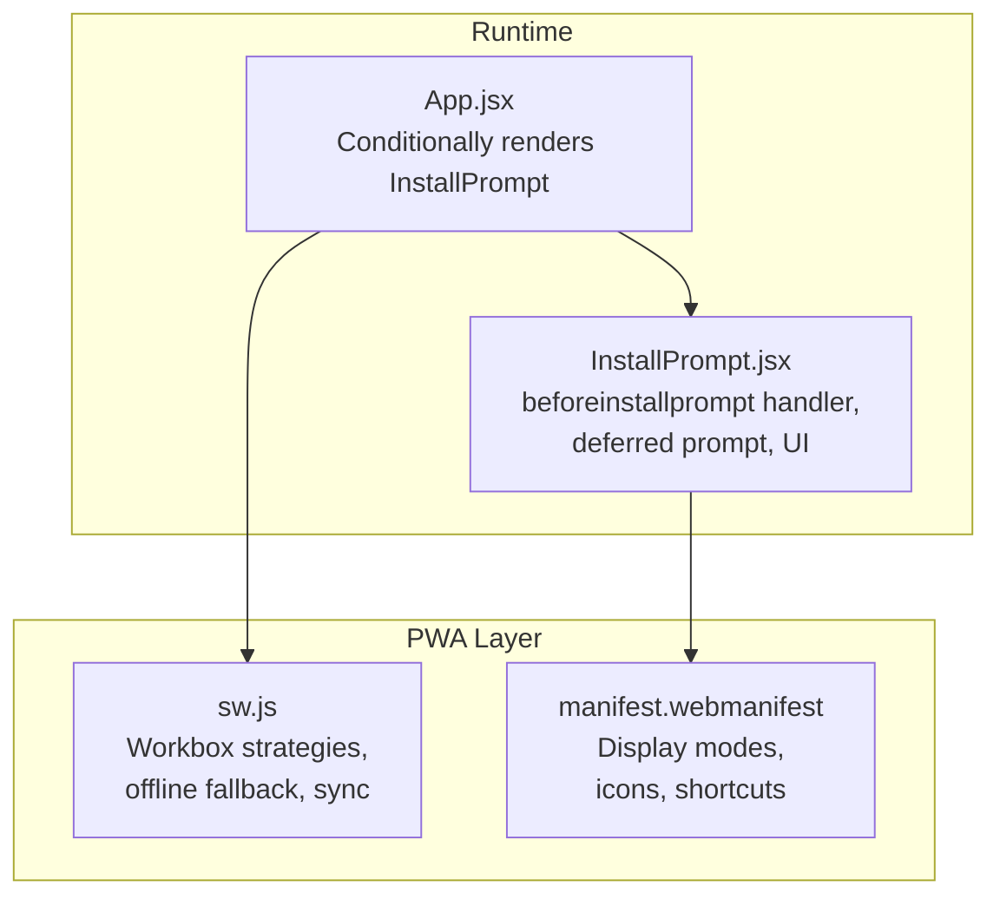
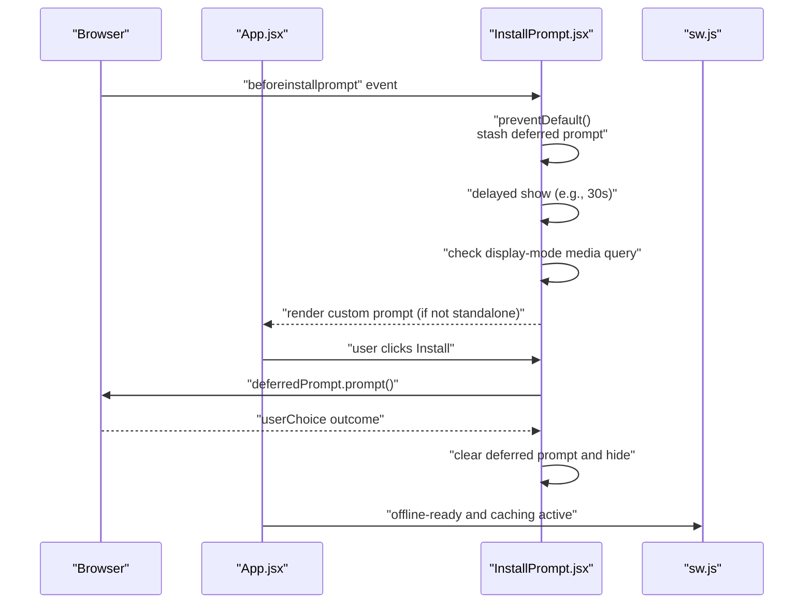
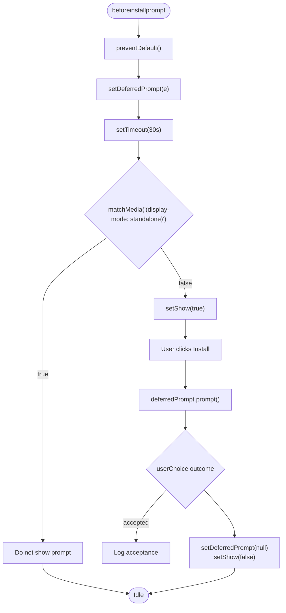
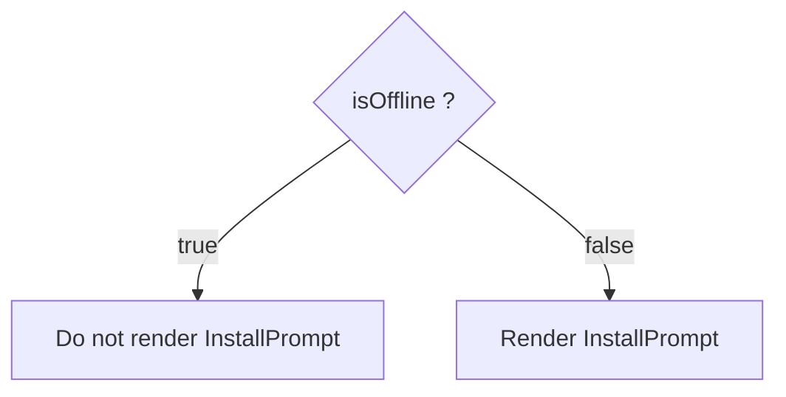
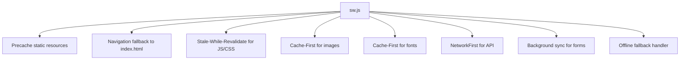
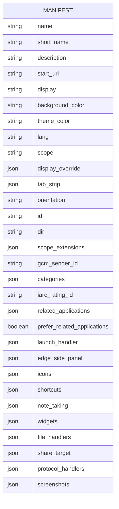
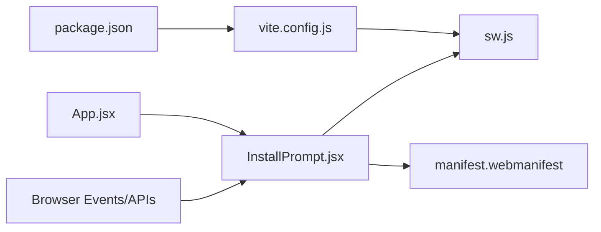

# Installation Prompt

<cite>
**Referenced Files in This Document**
- [InstallPrompt.jsx](file://src/components/InstallPrompt.jsx)
- [App.jsx](file://src/App.jsx)
- [sw.js](file://src/sw.js)
- [manifest.webmanifest](file://dist/manifest.webmanifest)
- [package.json](file://package.json)
- [vite.config.js](file://vite.config.js)
</cite>

## Table of Contents
1. [Introduction](#introduction)
2. [Project Structure](#project-structure)
3. [Core Components](#core-components)
4. [Architecture Overview](#architecture-overview)
5. [Detailed Component Analysis](#detailed-component-analysis)
6. [Dependency Analysis](#dependency-analysis)
7. [Performance Considerations](#performance-considerations)
8. [Troubleshooting Guide](#troubleshooting-guide)
9. [Conclusion](#conclusion)
10. [Appendices](#appendices)

## Introduction
This document explains the Progressive Web App (PWA) installation prompt system implemented in the project. It covers how the beforeinstallprompt event is captured and deferred, how the custom prompt is shown conditionally, how the installation is triggered, and how the installation state is tracked. It also documents the InstallPrompt component, user preference persistence, prompt dismissal handling, and practical customization strategies. Browser-specific behaviors, user education approaches, and installation success metrics are addressed to help you optimize the installation experience.

## Project Structure
The installation prompt system spans a few key areas:
- The InstallPrompt component renders a custom install prompt and manages deferred prompt lifecycle.
- The App container conditionally renders the InstallPrompt only when the app is online.
- The service worker handles caching strategies and background tasks, supporting offline readiness and background sync.
- The web app manifest defines installability criteria and display overrides.

**Diagram sources**
- [App.jsx](file://src/App.jsx#L304-L305)
- [InstallPrompt.jsx](file://src/components/InstallPrompt.jsx#L9-L30)
- [sw.js](file://src/sw.js#L1-L227)
- [manifest.webmanifest](file://dist/manifest.webmanifest#L1-L2)

**Section sources**
- [App.jsx](file://src/App.jsx#L304-L305)
- [InstallPrompt.jsx](file://src/components/InstallPrompt.jsx#L5-L30)
- [sw.js](file://src/sw.js#L1-L227)
- [manifest.webmanifest](file://dist/manifest.webmanifest#L1-L2)

## Core Components
- InstallPrompt component
  - Listens for beforeinstallprompt, stashes the event, and defers showing the custom prompt until after user engagement.
  - Checks whether the app is already installed via display mode media query.
  - Provides a custom install button that triggers the browser’s native install dialog and records user choice.
  - Dismisses itself after installation attempt.

- App container
  - Renders InstallPrompt only when the app is online, avoiding prompts during offline sessions.

- Service worker
  - Implements caching strategies and offline fallback, enabling robust offline readiness that improves perceived installability.

- Web app manifest
  - Defines display modes, icons, and other metadata that influence installability and prompt behavior.

**Section sources**
- [InstallPrompt.jsx](file://src/components/InstallPrompt.jsx#L5-L104)
- [App.jsx](file://src/App.jsx#L304-L305)
- [sw.js](file://src/sw.js#L1-L227)
- [manifest.webmanifest](file://dist/manifest.webmanifest#L1-L2)

## Architecture Overview
The installation flow integrates the browser’s beforeinstallprompt event with a custom UI and deferred prompt management.

**Diagram sources**
- [InstallPrompt.jsx](file://src/components/InstallPrompt.jsx#L9-L48)
- [App.jsx](file://src/App.jsx#L304-L305)
- [sw.js](file://src/sw.js#L1-L227)

## Detailed Component Analysis

### InstallPrompt Component
The InstallPrompt component encapsulates:
- Event handling for beforeinstallprompt
- Deferred prompt storage and delayed presentation
- Standalone detection via display-mode media query
- User choice handling and state reset
- Custom UI with animation and dismissal

**Diagram sources**
- [InstallPrompt.jsx](file://src/components/InstallPrompt.jsx#L9-L48)

**Section sources**
- [InstallPrompt.jsx](file://src/components/InstallPrompt.jsx#L5-L104)

### App Container Integration
The App container conditionally renders the InstallPrompt only when the app is online, ensuring the prompt appears only when appropriate.

**Diagram sources**
- [App.jsx](file://src/App.jsx#L304-L305)

**Section sources**
- [App.jsx](file://src/App.jsx#L304-L305)

### Service Worker and Offline Readiness
The service worker implements caching strategies and offline fallback, which improve the user experience and indirectly support installability by ensuring reliable offline behavior.

**Diagram sources**
- [sw.js](file://src/sw.js#L1-L227)

**Section sources**
- [sw.js](file://src/sw.js#L1-L227)

### Web App Manifest and Installability Criteria
The manifest defines display modes, icons, and other metadata that influence installability and prompt behavior. It includes display override configurations and icon sets suitable for standalone installation.

**Diagram sources**
- [manifest.webmanifest](file://dist/manifest.webmanifest#L1-L2)

**Section sources**
- [manifest.webmanifest](file://dist/manifest.webmanifest#L1-L2)

## Dependency Analysis
The installation prompt relies on:
- Browser events (beforeinstallprompt) and deferred prompt APIs
- Display mode detection via matchMedia
- Service worker caching and offline fallback
- Build-time PWA configuration via Vite and Workbox

**Diagram sources**
- [InstallPrompt.jsx](file://src/components/InstallPrompt.jsx#L9-L48)
- [App.jsx](file://src/App.jsx#L304-L305)
- [sw.js](file://src/sw.js#L1-L227)
- [manifest.webmanifest](file://dist/manifest.webmanifest#L1-L2)
- [vite.config.js](file://vite.config.js)
- [package.json](file://package.json#L30-L30)

**Section sources**
- [InstallPrompt.jsx](file://src/components/InstallPrompt.jsx#L5-L104)
- [App.jsx](file://src/App.jsx#L304-L305)
- [sw.js](file://src/sw.js#L1-L227)
- [manifest.webmanifest](file://dist/manifest.webmanifest#L1-L2)
- [package.json](file://package.json#L30-L30)

## Performance Considerations
- Debounce or delay showing the prompt to avoid interrupting user tasks. The component delays rendering for a period to encourage engagement before prompting.
- Avoid blocking the main thread during prompt handling; the component stores the event and triggers the prompt on user action.
- Keep the service worker’s caching strategies efficient to ensure fast offline availability, which improves perceived installability.
- Minimize the number of deferred prompt attempts; once a prompt is used, it becomes unavailable for reuse.

[No sources needed since this section provides general guidance]

## Troubleshooting Guide
Common issues and resolutions:
- Prompt not appearing
  - Ensure the beforeinstallprompt event fires and is prevented. Confirm the component listens and stashes the event.
  - Verify the app is not already installed (standalone mode). The component checks display mode and avoids showing the prompt if already installed.
  - Confirm the app is online; the container conditionally renders the prompt only when online.

- Prompt dismissed immediately
  - The component clears the deferred prompt after use. If the prompt is reused, it will be null. Ensure the prompt is re-initialized when needed.

- Installation not recorded
  - The component logs the user choice outcome. If you need to track metrics, extend the logging and analytics integration around the userChoice outcome.

- Offline scenarios
  - The component hides itself when offline. Ensure your service worker provides a good offline experience to improve the likelihood of successful installation.

**Section sources**
- [InstallPrompt.jsx](file://src/components/InstallPrompt.jsx#L9-L48)
- [App.jsx](file://src/App.jsx#L304-L305)

## Conclusion
The installation prompt system combines browser-native beforeinstallprompt handling with a custom UI and deferred prompt management. It respects user context by delaying the prompt and avoiding standalone environments, and it integrates with service worker caching and offline fallback to improve reliability. By following the guidance here, you can customize the installation experience, handle different contexts, and track success metrics effectively.

[No sources needed since this section summarizes without analyzing specific files]

## Appendices

### Practical Customization Examples
- Customize timing: Adjust the delay before showing the prompt to align with user engagement goals.
- Branding: Update the prompt UI to reflect brand colors and messaging.
- Placement: Position the prompt near high-engagement areas or after specific actions.
- Accessibility: Ensure the prompt is keyboard accessible and screen-reader friendly.

[No sources needed since this section provides general guidance]

### Browser-Specific Behaviors
- Chrome: Supports beforeinstallprompt and standalone detection. The prompt may appear automatically or via custom UI depending on heuristics.
- Edge/Firefox/Safari: Similar event support; behavior may vary slightly. Test across browsers and adjust messaging accordingly.

[No sources needed since this section provides general guidance]

### User Education Strategies
- Provide clear value statements in the prompt copy.
- Offer optional reminders or re-prompts after a delay.
- Use tooltips or microcopy to explain benefits of installing.

[No sources needed since this section provides general guidance]

### Installation Success Metrics
- Track userChoice outcomes (accepted vs dismissed).
- Measure conversion rates from prompt exposure to installation.
- Monitor post-install retention and engagement.

[No sources needed since this section provides general guidance]