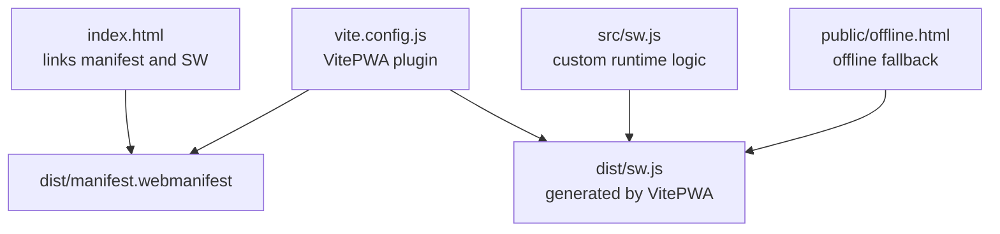
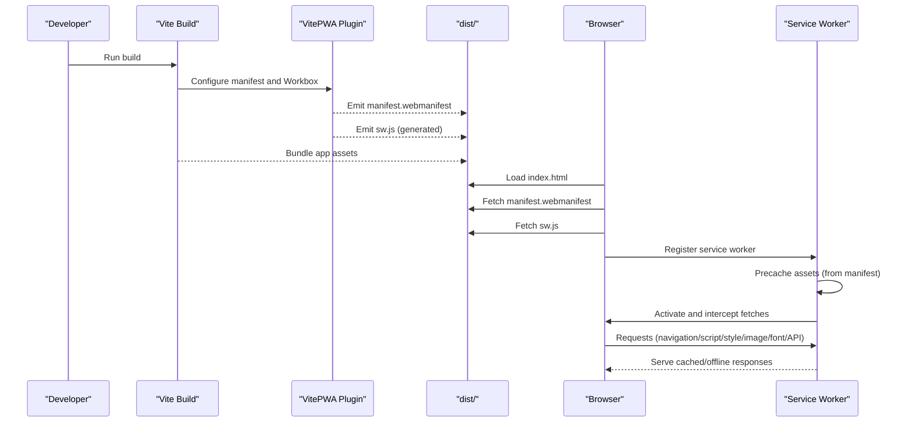
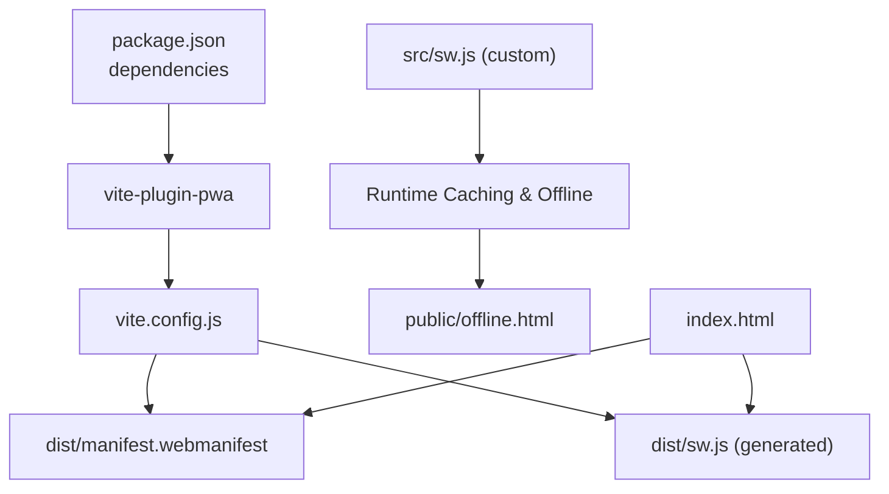

# Manifest Configuration

<cite>
**Referenced Files in This Document**
- [vite.config.js](file://vite.config.js)
- [package.json](file://package.json)
- [dist/manifest.webmanifest](file://dist/manifest.webmanifest)
- [src/sw.js](file://src/sw.js)
- [dist/sw.js](file://dist/sw.js)
- [public/offline.html](file://public/offline.html)
- [index.html](file://index.html)
</cite>

## Table of Contents
1. [Introduction](#introduction)
2. [Project Structure](#project-structure)
3. [Core Components](#core-components)
4. [Architecture Overview](#architecture-overview)
5. [Detailed Component Analysis](#detailed-component-analysis)
6. [Dependency Analysis](#dependency-analysis)
7. [Performance Considerations](#performance-considerations)
8. [Troubleshooting Guide](#troubleshooting-guide)
9. [Conclusion](#conclusion)

## Introduction
This document explains how the project configures the Progressive Web App (PWA) manifest and integrates the Vite PWA plugin. It covers the manifest file structure, icons configuration, theme color settings, display modes, and advanced features such as tabbed application mode, shortcuts, widgets, file handlers, share targets, protocol handlers, and screenshots. It also documents the Vite PWA plugin configuration, asset generation, and build-time optimizations, along with practical customization examples, validation techniques, browser compatibility testing, and performance impact considerations.

## Project Structure
The PWA configuration spans several key areas:
- Vite configuration defines the PWA plugin, manifest options, and Workbox behavior.
- The built manifest is emitted to the distribution folder.
- The service worker is generated via the PWA plugin and enhanced manually for runtime caching and offline behavior.
- The HTML page links to the manifest and registers the service worker.
- An offline page is included for graceful offline experiences.

**Diagram sources**
- [index.html](file://index.html#L68-L85)
- [vite.config.js](file://vite.config.js#L19-L202)
- [dist/manifest.webmanifest](file://dist/manifest.webmanifest#L1-L2)
- [src/sw.js](file://src/sw.js#L1-L227)
- [dist/sw.js](file://dist/sw.js#L1-L2)
- [public/offline.html](file://public/offline.html#L1-L283)

**Section sources**
- [vite.config.js](file://vite.config.js#L1-L262)
- [dist/manifest.webmanifest](file://dist/manifest.webmanifest#L1-L2)
- [index.html](file://index.html#L1-L87)
- [src/sw.js](file://src/sw.js#L1-L227)
- [public/offline.html](file://public/offline.html#L1-L283)

## Core Components
- Vite PWA Plugin: Configures manifest fields, assets to precache, Workbox behavior, and injection strategy.
- Built Manifest: Emits a complete web app manifest with icons, shortcuts, widgets, and advanced capabilities.
- Service Worker: Generated by the plugin and extended with custom runtime caching, offline fallback, background sync, and push notifications.
- HTML Page: Links the manifest and registers the service worker for installation and runtime behavior.
- Offline Page: Provides a themed offline experience with automatic online/offline detection.

**Section sources**
- [vite.config.js](file://vite.config.js#L19-L202)
- [dist/manifest.webmanifest](file://dist/manifest.webmanifest#L1-L2)
- [src/sw.js](file://src/sw.js#L1-L227)
- [index.html](file://index.html#L68-L85)
- [public/offline.html](file://public/offline.html#L7-L10)

## Architecture Overview
The PWA lifecycle integrates build-time manifest generation and asset precaching with runtime service worker logic for offline-first behavior.

**Diagram sources**
- [vite.config.js](file://vite.config.js#L19-L202)
- [dist/manifest.webmanifest](file://dist/manifest.webmanifest#L1-L2)
- [dist/sw.js](file://dist/sw.js#L1-L2)
- [index.html](file://index.html#L68-L85)
- [src/sw.js](file://src/sw.js#L1-L227)

## Detailed Component Analysis

### Manifest Structure and Fields
The built manifest includes core fields and advanced capabilities:
- Identity and presentation: name, short_name, description, id, dir, lang, scope, scope_extensions.
- Launch and display: start_url, display, display_override, orientation, background_color, theme_color.
- Icons and maskable support: primary icon and maskable variant.
- Shortcuts: quick-access entries with icons.
- Widgets: dynamic content integration with screenshots and icons.
- File Handlers: accept image/* with supported extensions.
- Share Target: form-based sharing to a specific endpoint.
- Protocol Handlers: custom protocol registration.
- Screenshots: wide and narrow form factor previews.
- System Integration: tab_strip (home_tab and new_tab_button), note_taking, launch_handler, edge_side_panel, categories, IARC rating, GCM sender ID, related applications.

Practical customization tips:
- Adjust theme_color and background_color to match brand guidelines.
- Add or remove icons and maskable variants to support different platforms.
- Extend shortcuts to improve discoverability of key sections.
- Configure share_target and protocol_handlers to integrate with OS sharing and deep linking.
- Use screenshots to showcase the app on various device form factors.

Validation and compatibility:
- Validate the manifest using browser developer tools and online validators.
- Test on Chrome, Edge, Safari, and Firefox for differences in display_override and tabbed mode support.
- Verify offline.html is precached and served when navigation fails.

**Section sources**
- [dist/manifest.webmanifest](file://dist/manifest.webmanifest#L1-L2)
- [vite.config.js](file://vite.config.js#L31-L191)

### Vite PWA Plugin Configuration
Key configuration areas:
- Strategies and source: injectManifest with srcDir and filename.
- Registration: autoUpdate with auto injection.
- Assets to include: favicon.ico, small icon for manifest, offline.html, and fonts.
- Manifest definition: comprehensive fields mirroring the built manifest.
- Workbox behavior: globPatterns to restrict precache, maximumFileSizeToCacheInBytes to limit asset size, and additionalManifestEntries to force offline.html inclusion.

Build-time optimizations:
- Precaching only small assets reduces cache size and improves install performance.
- Maximum file size limits prevent bloating caches with large images.
- Additional manifest entries ensure critical offline.html is always available.

**Section sources**
- [vite.config.js](file://vite.config.js#L19-L202)

### Service Worker Generation and Runtime Logic
Generated vs. custom logic:
- The plugin generates sw.js with precache manifests and basic routing.
- The custom src/sw.js adds sophisticated runtime caching strategies:
  - Navigation fallback to index.html for SPAs.
  - Stale-while-revalidate for scripts and styles.
  - Cache-first for images and fonts.
  - Network-first for API calls with expiration and cacheable response plugins.
  - Background sync for contact form submissions.
  - Comprehensive offline fallback with document, image placeholders, and a dedicated offline.html.
  - Push notifications with icon and badge.
  - Periodic background sync for updating critical data.

Runtime caching strategies:
- Static resources: stale-while-revalidate with entry limits and age-based expiration.
- Images: cache-first with quota error handling and size limits.
- Fonts: cache-first with long-term retention.
- API: network-first with timeouts and short retention.
- Background sync: queue management with unique submission IDs to prevent duplicates.

Offline experience:
- The offline.html page is cached and served when navigation fails.
- Automatic online/offline detection updates UI and refreshes on reconnect.

Push notifications:
- Uses the configured icon and badge from the manifest assets.

**Section sources**
- [dist/sw.js](file://dist/sw.js#L1-L2)
- [src/sw.js](file://src/sw.js#L1-L227)
- [public/offline.html](file://public/offline.html#L1-L283)

### HTML Integration and Service Worker Registration
- The HTML page links to the manifest and registers the service worker with explicit scope.
- This ensures deterministic installation and runtime behavior across browsers.

**Section sources**
- [index.html](file://index.html#L68-L85)

### Practical Examples and Customization
- Customize app appearance:
  - Update theme_color and background_color in the manifest to reflect branding.
  - Add or modify icons and maskable variants for platform-specific rendering.
- Configure splash screens:
  - Use background_color and theme_color to ensure smooth transitions during cold start.
  - Provide appropriate screenshots for different form factors.
- Optimize icon assets:
  - Keep icons under the configured maximum file size.
  - Prefer vector formats (SVG) when feasible and ensure raster assets are compressed.
- Advanced integrations:
  - Add shortcuts for high-value actions.
  - Configure share_target and protocol_handlers for OS-level integration.
  - Use widgets and file_handlers to extend functionality.

**Section sources**
- [vite.config.js](file://vite.config.js#L31-L191)
- [dist/manifest.webmanifest](file://dist/manifest.webmanifest#L1-L2)
- [src/sw.js](file://src/sw.js#L118-L153)

### Validation Techniques and Browser Compatibility
- Manifest validation:
  - Use Chrome DevTools Application panel to inspect the manifest and verify fields.
  - Validate against the Web App Manifest specification and platform-specific requirements.
- Browser compatibility:
  - Test display_override and tabbed mode on Chromium-based browsers.
  - Verify offline.html behavior and navigation fallback on Safari and Firefox.
  - Confirm push notification permissions and icon rendering.
- Progressive Web App scoring:
  - Use Lighthouse to audit installability, offline behavior, and performance.
  - Address failing audits by ensuring HTTPS, reliable offline fallback, and fast loading.

**Section sources**
- [dist/manifest.webmanifest](file://dist/manifest.webmanifest#L1-L2)
- [src/sw.js](file://src/sw.js#L155-L174)

## Dependency Analysis
The PWA relies on the Vite PWA plugin and Workbox libraries. The plugin generates the service worker and manifest, while the custom service worker extends runtime behavior.

**Diagram sources**
- [package.json](file://package.json#L16-L30)
- [vite.config.js](file://vite.config.js#L19-L202)
- [dist/manifest.webmanifest](file://dist/manifest.webmanifest#L1-L2)
- [dist/sw.js](file://dist/sw.js#L1-L2)
- [src/sw.js](file://src/sw.js#L1-L227)
- [public/offline.html](file://public/offline.html#L1-L283)
- [index.html](file://index.html#L68-L85)

**Section sources**
- [package.json](file://package.json#L16-L30)
- [vite.config.js](file://vite.config.js#L19-L202)

## Performance Considerations
- Precache size: Restrict precache to small assets to minimize cache size and installation time.
- Asset limits: Use maximumFileSizeToCacheInBytes to avoid caching large images.
- Chunking and caching: Manual chunking and cache-first strategies reduce bandwidth and improve reliability.
- Offline fallback: Ensure offline.html is always precached to avoid cache misses.
- Background sync: Prevent duplicate submissions with unique identifiers and manage retention windows.

[No sources needed since this section provides general guidance]

## Troubleshooting Guide
Common issues and resolutions:
- Manifest not updating:
  - Clear browser cache or open an incognito window to bypass cached manifest.
  - Verify the manifest link in the HTML and ensure the file is served with correct MIME type.
- Service worker not registering:
  - Check HTTPS and cross-origin restrictions.
  - Inspect the browser console for registration errors and verify the SW path.
- Offline fallback not working:
  - Confirm offline.html is included in precache or added during install.
  - Ensure navigation routes are properly handled and denyList does not block intended routes.
- Background sync failures:
  - Validate queue configuration and ensure unique submission IDs are appended.
  - Monitor network conditions and retention time settings.
- Push notifications not appearing:
  - Verify icon and badge paths and ensure they are precached.
  - Check notification permissions and browser support.

**Section sources**
- [src/sw.js](file://src/sw.js#L155-L174)
- [src/sw.js](file://src/sw.js#L118-L153)
- [src/sw.js](file://src/sw.js#L205-L226)
- [public/offline.html](file://public/offline.html#L1-L283)

## Conclusion
The project’s PWA configuration leverages the Vite PWA plugin for robust manifest generation and asset precaching, complemented by a custom service worker that implements sophisticated runtime caching, offline fallback, background sync, and push notifications. By carefully tuning manifest fields, icons, and Workbox behavior, the application achieves strong installability, performance, and user experience across devices and browsers. Regular validation and testing ensure compatibility and high PWA scores.