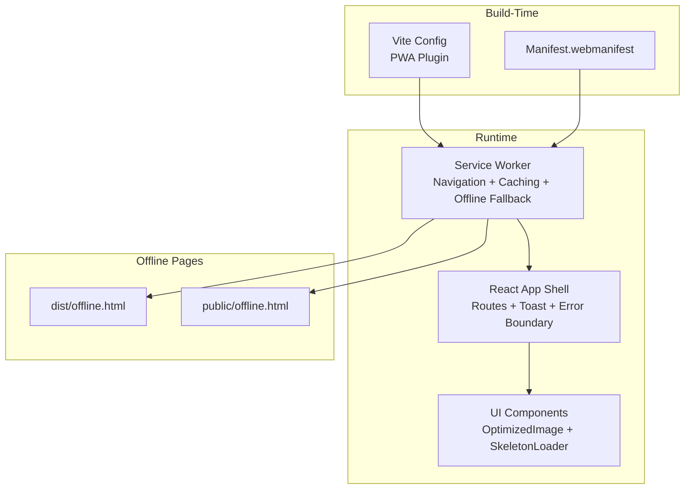
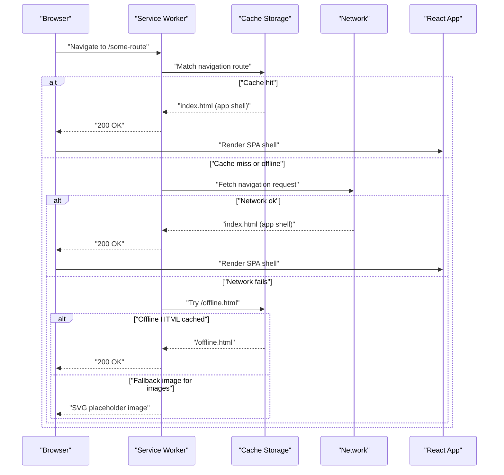
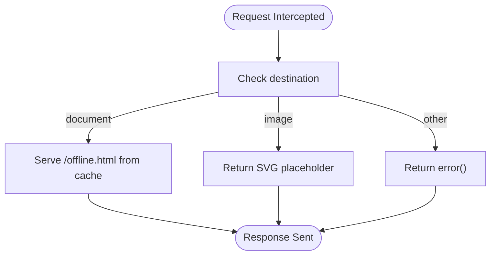
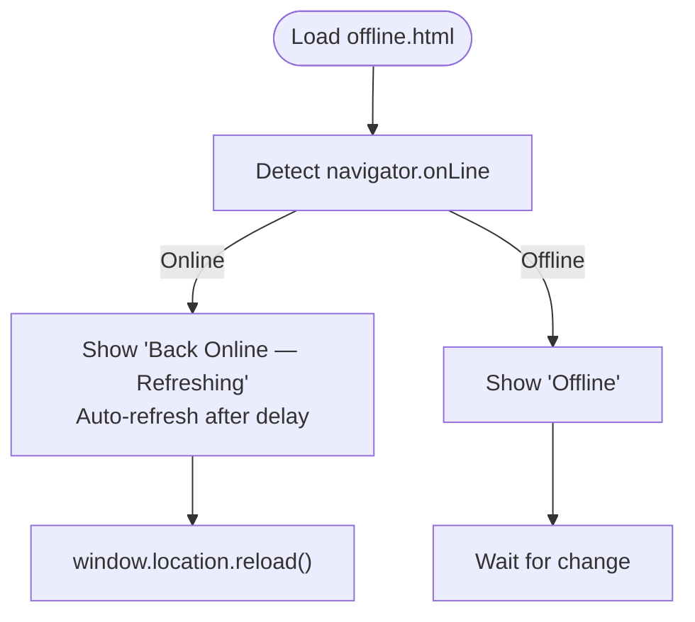
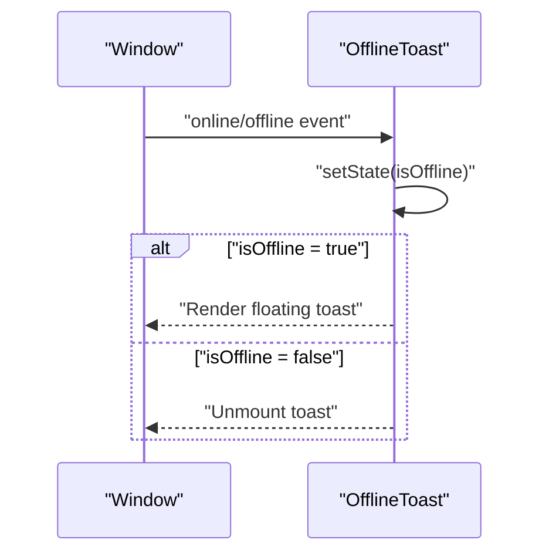
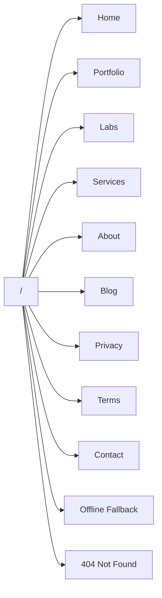
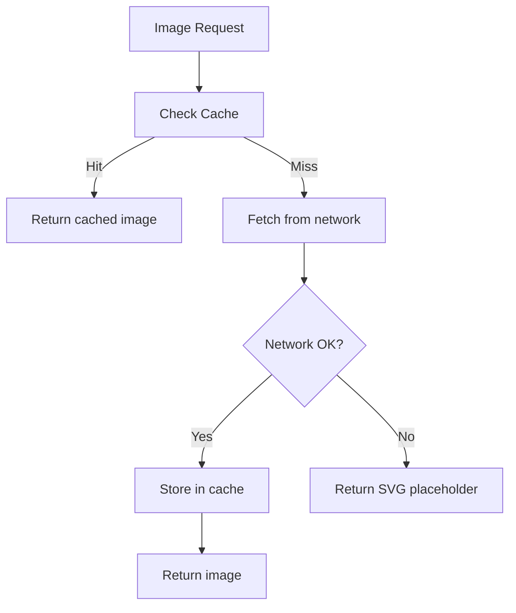
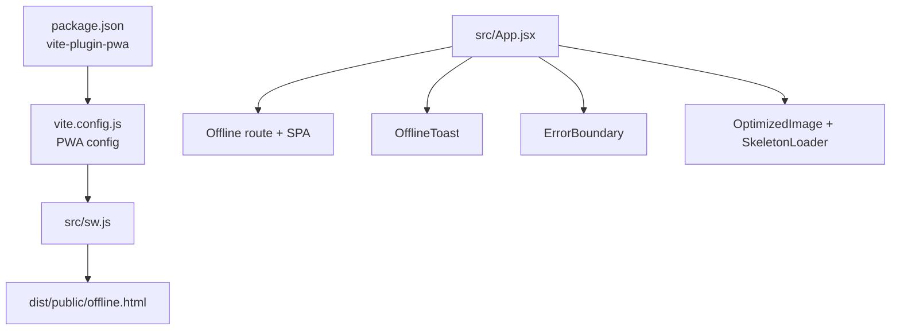

# Offline Functionality

<cite>
**Referenced Files in This Document**
- [src/App.jsx](file://src/App.jsx)
- [src/sw.js](file://src/sw.js)
- [src/pages/OfflineFallback.jsx](file://src/pages/OfflineFallback.jsx)
- [src/components/OfflineToast.jsx](file://src/components/OfflineToast.jsx)
- [src/components/ErrorBoundary.jsx](file://src/components/ErrorBoundary.jsx)
- [src/components/OptimizedImage.jsx](file://src/components/OptimizedImage.jsx)
- [src/components/SkeletonLoader.jsx](file://src/components/SkeletonLoader.jsx)
- [dist/offline.html](file://dist/offline.html)
- [public/offline.html](file://public/offline.html)
- [vite.config.js](file://vite.config.js)
- [package.json](file://package.json)
</cite>

## Table of Contents
1. [Introduction](#introduction)
2. [Project Structure](#project-structure)
3. [Core Components](#core-components)
4. [Architecture Overview](#architecture-overview)
5. [Detailed Component Analysis](#detailed-component-analysis)
6. [Dependency Analysis](#dependency-analysis)
7. [Performance Considerations](#performance-considerations)
8. [Troubleshooting Guide](#troubleshooting-guide)
9. [Conclusion](#conclusion)
10. [Appendices](#appendices)

## Introduction
This document explains the offline functionality of the application, covering navigation fallback, offline page handling, graceful degradation, and progressive enhancement. It details the navigation route configuration, offline HTML fallback, image placeholder strategies, the offline toast notification system, user experience considerations, and integration with the application shell. It also includes practical examples for testing offline scenarios, simulating network failures, debugging offline behavior, and understanding browser-specific offline behaviors and recovery mechanisms.

## Project Structure
The offline system spans three layers:
- Build-time and manifest configuration for service worker injection and precaching.
- Service worker runtime logic for navigation fallback, caching strategies, and global offline fallback.
- Client-side React components for user feedback and graceful degradation.

**Diagram sources**
- [vite.config.js](file://vite.config.js#L19-L202)
- [src/sw.js](file://src/sw.js#L1-L227)
- [src/App.jsx](file://src/App.jsx#L176-L308)
- [src/components/OptimizedImage.jsx](file://src/components/OptimizedImage.jsx#L1-L145)
- [src/components/SkeletonLoader.jsx](file://src/components/SkeletonLoader.jsx#L1-L48)
- [dist/offline.html](file://dist/offline.html#L1-L283)
- [public/offline.html](file://public/offline.html#L1-L283)

**Section sources**
- [vite.config.js](file://vite.config.js#L19-L202)
- [src/sw.js](file://src/sw.js#L1-L227)
- [src/App.jsx](file://src/App.jsx#L176-L308)

## Core Components
- Service Worker: Implements navigation fallback, runtime caching strategies, background sync for forms, and a global offline fallback for documents and images.
- Offline Fallback Page: A standalone HTML page served when navigation fails offline.
- Offline Toast: A persistent, animated indicator that informs users they are offline and provides localized messaging.
- App Shell Routes: Defines offline-aware routes and integrates the offline fallback page.
- Image Optimization and Placeholders: Provides responsive, compressed images with graceful error placeholders.
- Skeleton Loaders: Offers perceptual loading feedback during offline or slow network conditions.
- Error Boundary: Catches unhandled errors and presents a recovery-oriented UI.

**Section sources**
- [src/sw.js](file://src/sw.js#L34-L174)
- [dist/offline.html](file://dist/offline.html#L1-L283)
- [src/components/OfflineToast.jsx](file://src/components/OfflineToast.jsx#L1-L47)
- [src/App.jsx](file://src/App.jsx#L198-L200)
- [src/components/OptimizedImage.jsx](file://src/components/OptimizedImage.jsx#L1-L145)
- [src/components/SkeletonLoader.jsx](file://src/components/SkeletonLoader.jsx#L1-L48)
- [src/components/ErrorBoundary.jsx](file://src/components/ErrorBoundary.jsx#L1-L57)

## Architecture Overview
The offline architecture combines a PWA-managed service worker with React routing and UI components. The service worker:
- Precaches critical assets and the offline HTML page.
- Intercepts navigation requests and serves the app shell when offline.
- Applies caching strategies per resource type.
- Falls back to a custom offline page for documents and a placeholder image for missing images.

**Diagram sources**
- [src/sw.js](file://src/sw.js#L34-L174)
- [src/App.jsx](file://src/App.jsx#L198-L200)
- [dist/offline.html](file://dist/offline.html#L1-L283)

## Detailed Component Analysis

### Service Worker Offline Behavior
- Navigation Fallback: Uses a navigation route handler to serve the app shell when navigation requests fail offline.
- Runtime Caching Strategies:
  - Static resources (scripts/styles) use stale-while-revalidate.
  - Images use cache-first with size limits and quota-aware purging.
  - Fonts use cache-first with long TTL.
  - API calls use network-first with a short timeout and cache fallback.
- Background Sync: Queues and retries contact form submissions when connectivity is restored.
- Global Offline Fallback:
  - For document requests, attempts to serve the offline HTML page from cache.
  - For image requests, returns a compact SVG placeholder.
  - Other requests return an error response.

**Diagram sources**
- [src/sw.js](file://src/sw.js#L155-L174)

**Section sources**
- [src/sw.js](file://src/sw.js#L34-L174)

### Offline HTML Fallback
- Standalone page with embedded styles and inline assets for minimal external dependencies.
- Self-contained online/offline detection script updates the status indicator and refreshes on reconnect.
- Provides “Try Again” and “Go Home” actions for immediate recovery.

**Diagram sources**
- [dist/offline.html](file://dist/offline.html#L257-L280)

**Section sources**
- [dist/offline.html](file://dist/offline.html#L1-L283)
- [public/offline.html](file://public/offline.html#L1-L283)

### Offline Toast Notification
- Monitors global online/offline events and displays a persistent, animated indicator.
- Localized messages via i18n for accessibility and clarity.
- Minimal footprint with backdrop blur and subtle animations.

**Diagram sources**
- [src/components/OfflineToast.jsx](file://src/components/OfflineToast.jsx#L10-L21)

**Section sources**
- [src/components/OfflineToast.jsx](file://src/components/OfflineToast.jsx#L1-L47)

### App Shell Routes and Offline Fallback Route
- The app defines explicit offline routes for both languages.
- Integrates the offline fallback page alongside other pages.
- The service worker’s navigation fallback ensures SPA hydration even when offline.

**Diagram sources**
- [src/App.jsx](file://src/App.jsx#L182-L290)

**Section sources**
- [src/App.jsx](file://src/App.jsx#L198-L200)

### Image Placeholder Strategies
- OptimizedImage component:
  - Generates responsive srcset and WebP fallbacks for Unsplash URLs.
  - Uses lazy loading and fetchpriority hints for LCP-friendly loading.
  - Displays a branded glassmorphism placeholder with a “R” logo on load error.
- Service Worker fallback:
  - Returns a compact SVG placeholder for images when offline.

**Diagram sources**
- [src/components/OptimizedImage.jsx](file://src/components/OptimizedImage.jsx#L39-L78)
- [src/sw.js](file://src/sw.js#L164-L169)

**Section sources**
- [src/components/OptimizedImage.jsx](file://src/components/OptimizedImage.jsx#L1-L145)
- [src/sw.js](file://src/sw.js#L164-L169)

### Graceful Degradation and Skeleton Loaders
- SkeletonLoader provides shimmering placeholders to maintain perceived performance and layout stability during slow or offline loads.
- Combined with OptimizedImage error handling, users see meaningful placeholders instead of broken images.

**Section sources**
- [src/components/SkeletonLoader.jsx](file://src/components/SkeletonLoader.jsx#L1-L48)
- [src/components/OptimizedImage.jsx](file://src/components/OptimizedImage.jsx#L117-L128)

### Error Boundary and Recovery UX
- Catches unhandled errors in the React tree and presents a friendly recovery interface with a reload action.
- Supports dark mode and subtle animations for a polished experience.

**Section sources**
- [src/components/ErrorBoundary.jsx](file://src/components/ErrorBoundary.jsx#L1-L57)

## Dependency Analysis
- PWA and Service Worker:
  - Vite PWA plugin injects and registers the service worker, precaches assets, and includes the offline HTML page.
  - The service worker uses Workbox for routing, caching, and background sync.
- Client-side:
  - App listens for online/offline events and conditionally renders the offline toast and install prompt.
  - Routes include an explicit offline fallback page.

**Diagram sources**
- [package.json](file://package.json#L30-L30)
- [vite.config.js](file://vite.config.js#L19-L202)
- [src/sw.js](file://src/sw.js#L1-L227)
- [src/App.jsx](file://src/App.jsx#L176-L308)

**Section sources**
- [package.json](file://package.json#L30-L30)
- [vite.config.js](file://vite.config.js#L19-L202)
- [src/sw.js](file://src/sw.js#L1-L227)
- [src/App.jsx](file://src/App.jsx#L176-L308)

## Performance Considerations
- Precaching and caching strategies:
  - Static resources use stale-while-revalidate to minimize latency.
  - Images and fonts use cache-first with expiration and quota-aware purging to reduce bandwidth and storage pressure.
  - API calls use network-first with a short timeout to balance freshness and reliability.
- Asset limits:
  - Maximum file size for precache entries is constrained to keep the offline cache manageable.
- Image optimization:
  - Responsive srcset and WebP generation reduce payload sizes.
  - SVG placeholders avoid extra network requests for missing images.

**Section sources**
- [src/sw.js](file://src/sw.js#L49-L116)
- [vite.config.js](file://vite.config.js#L192-L201)
- [src/components/OptimizedImage.jsx](file://src/components/OptimizedImage.jsx#L39-L78)

## Troubleshooting Guide
- Testing offline scenarios:
  - Use DevTools: Application panel > Service Worker > Offline checkbox to simulate offline behavior.
  - Network panel: Disable network or throttle to simulate poor connectivity.
  - Hard reload to ensure the service worker handles navigation fallback.
- Simulating network failures:
  - Block network requests for specific hosts or paths to verify fallback behavior.
  - Test background sync by submitting a form while offline and reconnecting later.
- Debugging offline behavior:
  - Open DevTools Application tab to inspect Cache Storage and verify precached assets.
  - Check the Console for service worker logs and PWA registration status.
  - Verify the offline HTML page is served by navigating to a non-existent route while offline.
- Browser-specific behaviors:
  - Some browsers may require HTTPS for service workers and background sync.
  - Edge-based browsers may differ in periodic sync availability; check feature support and adjust intervals accordingly.
- Recovery mechanisms:
  - The offline page auto-refreshes when connectivity is restored.
  - The offline toast disappears when online.
  - The error boundary provides a clear “Reinitialize System” action.

**Section sources**
- [src/sw.js](file://src/sw.js#L155-L182)
- [src/components/OfflineToast.jsx](file://src/components/OfflineToast.jsx#L10-L21)
- [src/components/ErrorBoundary.jsx](file://src/components/ErrorBoundary.jsx#L41-L46)

## Conclusion
The application delivers robust offline functionality through a combination of PWA precaching, navigation fallback, targeted caching strategies, and user-centric UI components. Users receive clear feedback via the offline toast and a visually consistent offline page, while the app gracefully degrades content using skeleton loaders and image placeholders. Background sync ensures asynchronous tasks are retried reliably upon recovery. Together, these techniques provide a resilient, progressive web experience across diverse network conditions.

## Appendices

### Practical Examples
- Testing offline navigation:
  - Navigate to a deep route while offline; confirm the app shell loads and the offline fallback route is reachable.
- Verifying image fallback:
  - Force block image assets; confirm SVG placeholder appears.
- Background sync verification:
  - Submit a contact form offline; reconnect and observe automatic retry.

### Offline Page Content and Styling
- The offline page includes:
  - A gradient background and centered content.
  - Inline logo and a WiFi-off icon.
  - Buttons for “Try Again” and “Go Home.”
  - A status indicator that updates on online/offline transitions.
- Styling considerations:
  - Minimal external dependencies; all styles are embedded.
  - Responsive layout and subtle animations for a polished feel.

**Section sources**
- [dist/offline.html](file://dist/offline.html#L1-L283)
- [public/offline.html](file://public/offline.html#L1-L283)