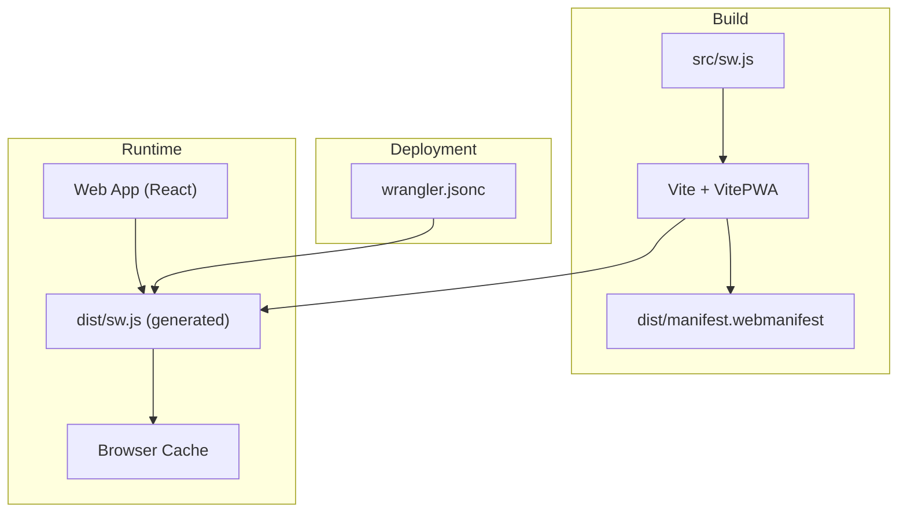
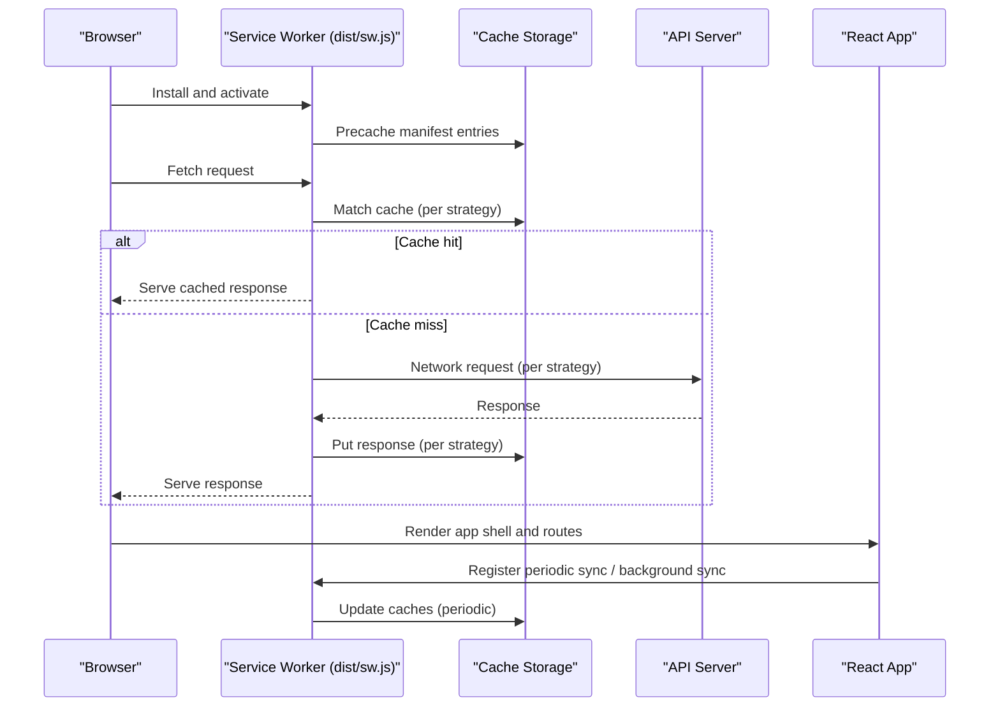
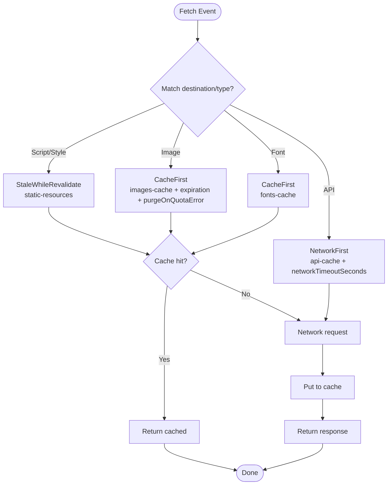
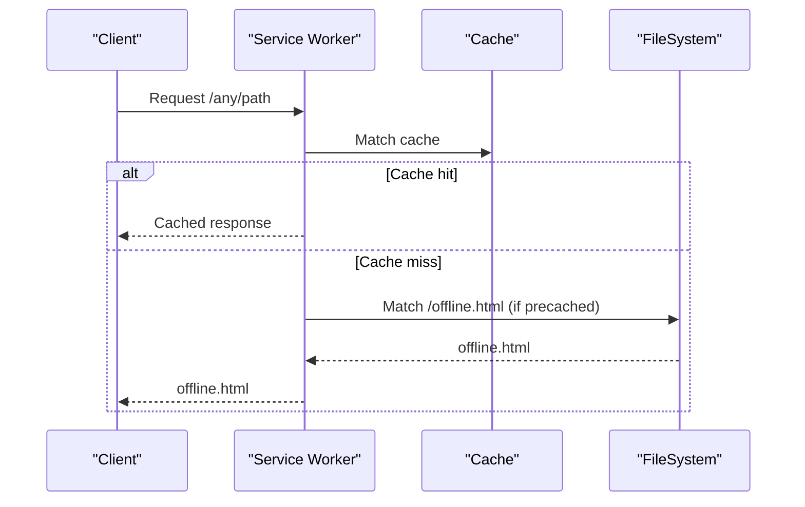
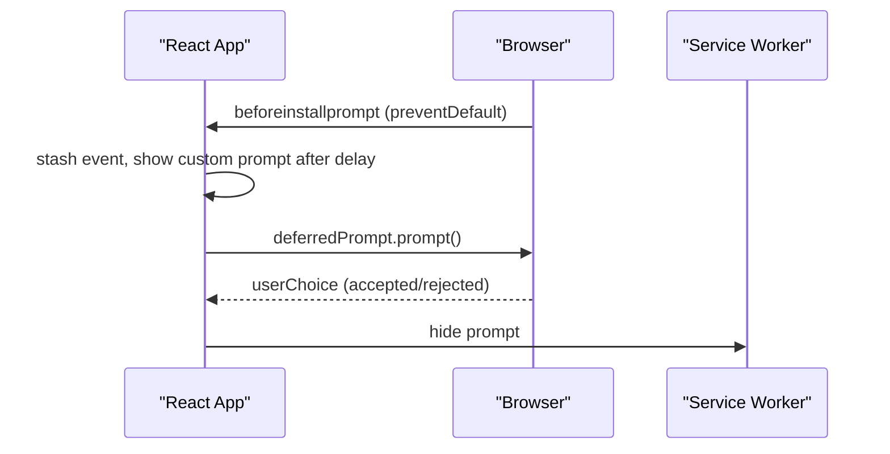
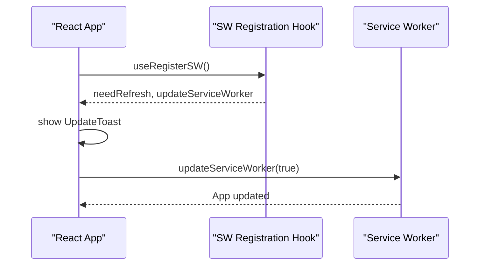
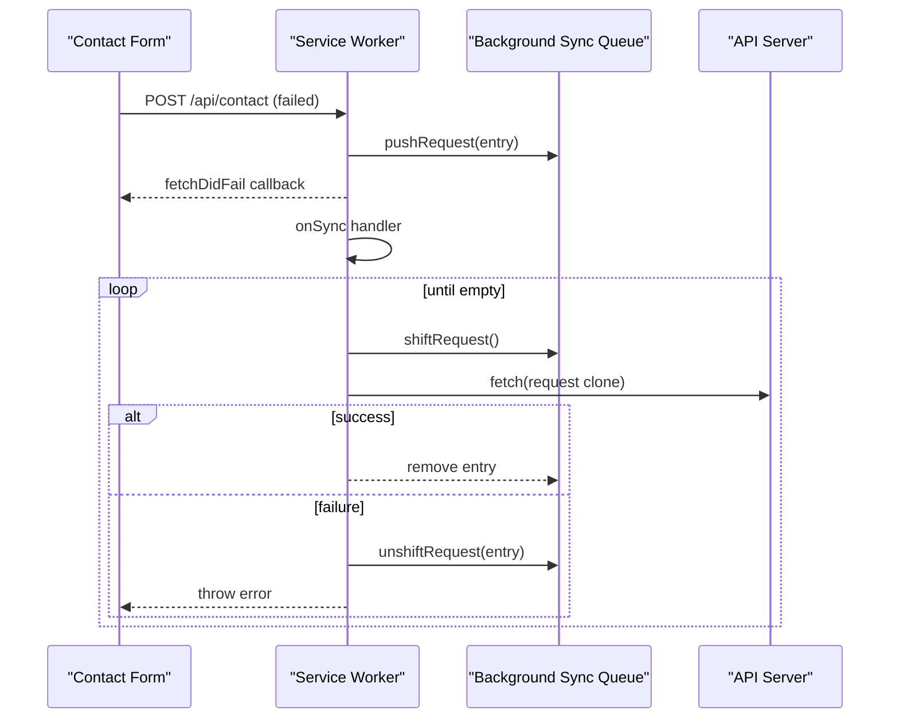
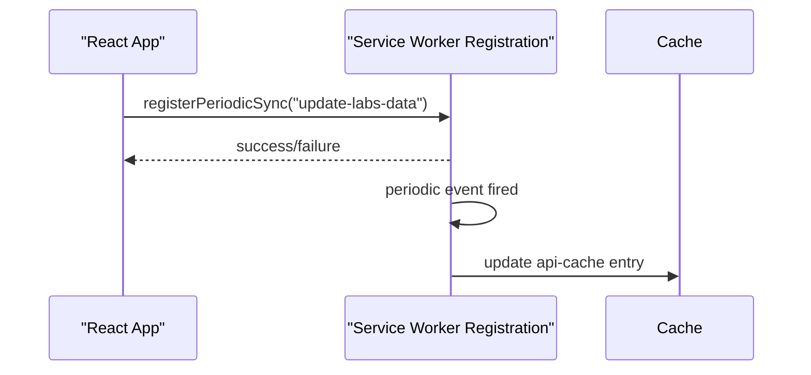
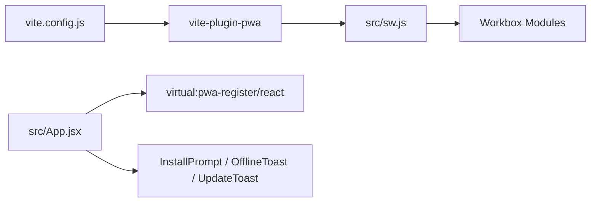

# Progressive Web App (PWA)

<cite>
**Referenced Files in This Document**
- [src/sw.js](file://src/sw.js)
- [dist/sw.js](file://dist/sw.js)
- [vite.config.js](file://vite.config.js)
- [package.json](file://package.json)
- [dist/manifest.webmanifest](file://dist/manifest.webmanifest)
- [public/offline.html](file://public/offline.html)
- [dist/offline.html](file://dist/offline.html)
- [src/pages/OfflineFallback.jsx](file://src/pages/OfflineFallback.jsx)
- [src/components/InstallPrompt.jsx](file://src/components/InstallPrompt.jsx)
- [src/components/OfflineToast.jsx](file://src/components/OfflineToast.jsx)
- [src/components/UpdateToast.jsx](file://src/components/UpdateToast.jsx)
- [src/App.jsx](file://src/App.jsx)
- [src/main.jsx](file://src/main.jsx)
- [wrangler.jsonc](file://wrangler.jsonc)
</cite>

## Table of Contents
1. [Introduction](#introduction)
2. [Project Structure](#project-structure)
3. [Core Components](#core-components)
4. [Architecture Overview](#architecture-overview)
5. [Detailed Component Analysis](#detailed-component-analysis)
6. [Dependency Analysis](#dependency-analysis)
7. [Performance Considerations](#performance-considerations)
8. [Troubleshooting Guide](#troubleshooting-guide)
9. [Conclusion](#conclusion)
10. [Appendices](#appendices)

## Introduction
This document explains the Progressive Web App (PWA) implementation for the landing page, focusing on the service worker built with Workbox, caching strategies, offline handling, installation prompts, update notifications, background sync, manifest configuration, and performance optimizations. It also covers testing approaches, browser compatibility, security considerations, and maintenance procedures for the service worker.

## Project Structure
The PWA stack is composed of:
- Build-time: Vite + VitePWA plugin generates the service worker and manifest, and injects assets.
- Runtime: The service worker implements Workbox strategies and lifecycle events.
- Client-side: React components manage install prompts, offline UX, update notifications, and periodic sync registration.

**Diagram sources**
- [vite.config.js](file://vite.config.js#L19-L202)
- [src/sw.js](file://src/sw.js#L1-L227)
- [dist/sw.js](file://dist/sw.js#L1-L2)
- [dist/manifest.webmanifest](file://dist/manifest.webmanifest#L1-L2)
- [wrangler.jsonc](file://wrangler.jsonc#L1-L8)

**Section sources**
- [vite.config.js](file://vite.config.js#L1-L262)
- [package.json](file://package.json#L1-L49)
- [wrangler.jsonc](file://wrangler.jsonc#L1-L8)

## Core Components
- Service Worker (Workbox-based): Implements precaching, runtime caching strategies, navigation fallback, background sync, periodic sync, and push notifications.
- Manifest: Defines app identity, display modes, icons, shortcuts, and system integrations.
- Client-side PWA UX:
  - InstallPrompt: Prompts users to install the app.
  - OfflineToast: Shows offline status.
  - UpdateToast: Notifies and triggers updates.
  - OfflineFallback: React component for offline page rendering.

**Section sources**
- [src/sw.js](file://src/sw.js#L1-L227)
- [dist/sw.js](file://dist/sw.js#L1-L2)
- [dist/manifest.webmanifest](file://dist/manifest.webmanifest#L1-L2)
- [src/components/InstallPrompt.jsx](file://src/components/InstallPrompt.jsx#L1-L104)
- [src/components/OfflineToast.jsx](file://src/components/OfflineToast.jsx#L1-L47)
- [src/components/UpdateToast.jsx](file://src/components/UpdateToast.jsx#L1-L47)
- [src/pages/OfflineFallback.jsx](file://src/pages/OfflineFallback.jsx#L1-L57)

## Architecture Overview
The PWA architecture integrates build-time manifest generation and runtime service worker logic with client-side UX components.

**Diagram sources**
- [src/sw.js](file://src/sw.js#L26-L174)
- [dist/sw.js](file://dist/sw.js#L1-L2)
- [src/App.jsx](file://src/App.jsx#L145-L167)

## Detailed Component Analysis

### Service Worker (Workbox-based)
The service worker is generated from [src/sw.js](file://src/sw.js) and configured via VitePWA. It:
- Claims control immediately.
- Precaches the app shell and assets.
- Registers runtime caching strategies:
  - Static resources (scripts/styles): Stale-While-Revalidate with expiration limits.
  - Images: Cache First with expiration and quota handling.
  - Fonts: Cache First with long TTL.
  - API: Network First with network timeout and cache fallback.
- Provides a global navigation fallback and catch handler for offline scenarios.
- Handles background sync for contact form submissions.
- Registers periodic background sync for labs data.
- Supports push notifications and notification click handling.

**Diagram sources**
- [src/sw.js](file://src/sw.js#L49-L116)
- [dist/sw.js](file://dist/sw.js#L1-L2)

**Section sources**
- [src/sw.js](file://src/sw.js#L1-L227)
- [dist/sw.js](file://dist/sw.js#L1-L2)

### Caching Strategies and Expiration
- Static resources: Stale-While-Revalidate with a cap of 50 entries and 30-day max age.
- Images: Cache First with 50-entry cap, 30-day max age, and automatic purge on quota errors.
- Fonts: Cache First with 20-entry cap and 1-year max age.
- API: Network First with 24-hour max age and 3-second network timeout.

These policies are implemented via Workbox ExpirationPlugin and CacheableResponsePlugin.

**Section sources**
- [src/sw.js](file://src/sw.js#L49-L116)

### Offline Handling and Fallback Pages
- Global catch handler serves:
  - The offline HTML page for document/navigation requests.
  - A fallback SVG for image requests.
  - Error responses otherwise.
- The offline HTML page is included in the manifest and precached.
- A React-based offline page component is available at the offline route.

**Diagram sources**
- [src/sw.js](file://src/sw.js#L155-L174)
- [dist/sw.js](file://dist/sw.js#L1-L2)
- [public/offline.html](file://public/offline.html#L1-L283)
- [dist/offline.html](file://dist/offline.html#L1-L283)

**Section sources**
- [src/sw.js](file://src/sw.js#L155-L174)
- [public/offline.html](file://public/offline.html#L1-L283)
- [dist/offline.html](file://dist/offline.html#L1-L283)
- [src/pages/OfflineFallback.jsx](file://src/pages/OfflineFallback.jsx#L1-L57)

### Installation Prompt System
- Uses the native beforeinstallprompt lifecycle to capture and show a custom install prompt after user engagement.
- Respects standalone display mode to avoid prompting when already installed.
- Integrates with the app shell and hides when offline.

**Diagram sources**
- [src/components/InstallPrompt.jsx](file://src/components/InstallPrompt.jsx#L9-L30)
- [src/App.jsx](file://src/App.jsx#L304-L305)

**Section sources**
- [src/components/InstallPrompt.jsx](file://src/components/InstallPrompt.jsx#L1-L104)
- [src/App.jsx](file://src/App.jsx#L304-L305)

### Update Notifications and Auto-Update
- VitePWA is configured with auto-update registration.
- The virtual service worker registration hook exposes needRefresh and updateServiceWorker.
- An UpdateToast component displays a persistent notification with actions to refresh immediately.

**Diagram sources**
- [src/App.jsx](file://src/App.jsx#L87-L101)
- [src/App.jsx](file://src/App.jsx#L299-L303)

**Section sources**
- [vite.config.js](file://vite.config.js#L23-L24)
- [src/App.jsx](file://src/App.jsx#L87-L101)
- [src/App.jsx](file://src/App.jsx#L299-L303)
- [src/components/UpdateToast.jsx](file://src/components/UpdateToast.jsx#L1-L47)

### Background Sync (Contact Form)
- A BackgroundSyncPlugin queues failed POST requests to the contact endpoint.
- On sync, the app replays queued requests, adding a unique submission identifier to prevent duplicates.
- Retention time is set to 24 hours.

**Diagram sources**
- [src/sw.js](file://src/sw.js#L118-L153)

**Section sources**
- [src/sw.js](file://src/sw.js#L118-L153)

### Periodic Background Sync
- Registers a periodic sync tag to update critical dynamic content in the background.
- The client registers the tag on first load if supported.

**Diagram sources**
- [src/App.jsx](file://src/App.jsx#L145-L167)
- [src/sw.js](file://src/sw.js#L183-L203)

**Section sources**
- [src/App.jsx](file://src/App.jsx#L145-L167)
- [src/sw.js](file://src/sw.js#L183-L203)

### Push Notifications
- Push events trigger a notification with a title/body/icon/badge and open the specified URL on click.

**Section sources**
- [src/sw.js](file://src/sw.js#L205-L226)

### Manifest Configuration
- Generated by VitePWA with icons, shortcuts, screenshots, share targets, protocol handlers, and scope extensions.
- Includes offline.html in additional manifest entries to ensure precaching.

**Section sources**
- [vite.config.js](file://vite.config.js#L19-L201)
- [dist/manifest.webmanifest](file://dist/manifest.webmanifest#L1-L2)

## Dependency Analysis
- Build-time dependencies:
  - VitePWA plugin drives manifest generation and service worker injection.
  - Compression plugins optimize assets.
- Runtime dependencies:
  - Workbox modules (core, precaching, routing, strategies, expiration, cacheable-response, background-sync).
  - Client-side libraries for UI and internationalization.

**Diagram sources**
- [vite.config.js](file://vite.config.js#L3-L202)
- [package.json](file://package.json#L30-L30)
- [src/App.jsx](file://src/App.jsx#L11-L13)

**Section sources**
- [package.json](file://package.json#L16-L30)
- [vite.config.js](file://vite.config.js#L1-L262)

## Performance Considerations
- Precaching strategy:
  - Restrict glob patterns to small assets and exclude large images to keep under 2MB.
  - Ensure offline.html is always precached.
- Runtime caching:
  - Use Cache First for static assets (fonts, images) with strict entry caps and max ages.
  - Use Stale-While-Revalidate for JS/CSS to balance freshness and speed.
  - Use Network First for API with timeouts to degrade gracefully.
- Compression:
  - Gzip and Brotli compression enabled at build time.
- Asset inlining:
  - Small assets below a threshold are inlined to reduce roundtrips.
- Chunking:
  - Manual chunk groups optimize loading of core, router, animations, i18n, and icons.

**Section sources**
- [vite.config.js](file://vite.config.js#L192-L248)
- [src/sw.js](file://src/sw.js#L49-L116)

## Troubleshooting Guide
- Service worker not updating:
  - Verify auto-update registration and that the client calls updateServiceWorker when prompted.
  - Check browser DevTools Application panel for SW registration and scope.
- Offline page not shown:
  - Confirm offline.html is precached and the catch handler matches document requests.
  - Ensure denyList excludes SPA routes and includes API/admin/assets.
- Background sync not working:
  - Verify the queue name and onSync handler are defined.
  - Check IndexedDB availability and permissions.
- Periodic sync not firing:
  - Ensure the client registers the tag and the browser supports periodic background sync.
- Push notifications not received:
  - Confirm push event listener and notification options are set.

**Section sources**
- [src/App.jsx](file://src/App.jsx#L87-L101)
- [src/sw.js](file://src/sw.js#L155-L174)
- [src/sw.js](file://src/sw.js#L183-L226)

## Conclusion
The PWA implementation leverages Workbox for robust caching and offline behavior, VitePWA for streamlined build-time integration, and React components for engaging user experiences. The combination of precaching, strategic runtime caching, background sync, periodic updates, and a polished offline fallback delivers a resilient, fast, and installable web app.

## Appendices

### Practical Examples
- Configure cache expiration policies:
  - Adjust maxEntries and maxAgeSeconds per cache name in runtime strategies.
  - Use purgeOnQuotaError for caches that risk exceeding storage limits.
- Handle network failures gracefully:
  - Use NetworkFirst with networkTimeoutSeconds to fall back to cache quickly.
  - Implement a global catch handler to serve offline.html or placeholders.
- Testing PWA functionality:
  - Use DevTools Application panel to inspect service worker lifecycle and cache contents.
  - Simulate offline mode and verify fallback behavior.
  - Trigger background sync and periodic sync events where supported.

### Browser Compatibility and Security
- Compatibility:
  - Service worker, background sync, periodic sync, and push notifications require secure contexts (HTTPS).
  - Some features may vary by browser; test across major browsers.
- Security:
  - Keep scope and scope_extensions minimal and intentional.
  - Validate push notification configuration and use appropriate sender IDs or VAPID keys.
  - Ensure assets are served with correct MIME types and integrity checks where applicable.

### Maintenance Procedures
- Update Workbox and VitePWA versions periodically.
- Review and adjust cache expiration and entry caps based on usage analytics.
- Monitor background sync queue health and clean stale entries.
- Validate manifest entries and icons regularly.
- Keep the offline page content aligned with brand guidelines and accessibility standards.