# Service Worker Architecture

<cite>
**Referenced Files in This Document**
- [src/sw.js](file://src/sw.js)
- [dist/sw.js](file://dist/sw.js)
- [index.html](file://index.html)
- [vite.config.js](file://vite.config.js)
- [package.json](file://package.json)
- [wrangler.jsonc](file://wrangler.jsonc)
- [public/offline.html](file://public/offline.html)
- [functions/_middleware.js](file://functions/_middleware.js)
</cite>

## Table of Contents
1. [Introduction](#introduction)
2. [Project Structure](#project-structure)
3. [Core Components](#core-components)
4. [Architecture Overview](#architecture-overview)
5. [Detailed Component Analysis](#detailed-component-analysis)
6. [Dependency Analysis](#dependency-analysis)
7. [Performance Considerations](#performance-considerations)
8. [Troubleshooting Guide](#troubleshooting-guide)
9. [Conclusion](#conclusion)
10. [Appendices](#appendices)

## Introduction
This document explains the service worker architecture and Workbox v7 integration for the landing page PWA. It covers the service worker lifecycle, registration and initialization sequence, precaching and runtime routing strategies, plugin architecture, scope and activation behavior, client claiming, event handlers, debugging techniques, cache inspection, performance monitoring, browser compatibility, and fallback strategies for unsupported environments.

## Project Structure
The service worker is implemented as an Inject Manifest with Workbox v7. The build pipeline uses Vite with vite-plugin-pwa to generate and inject the service worker into the distribution output. The HTML registers the service worker with explicit scope configuration. Cloudflare Workers and Pages host the assets and middleware.

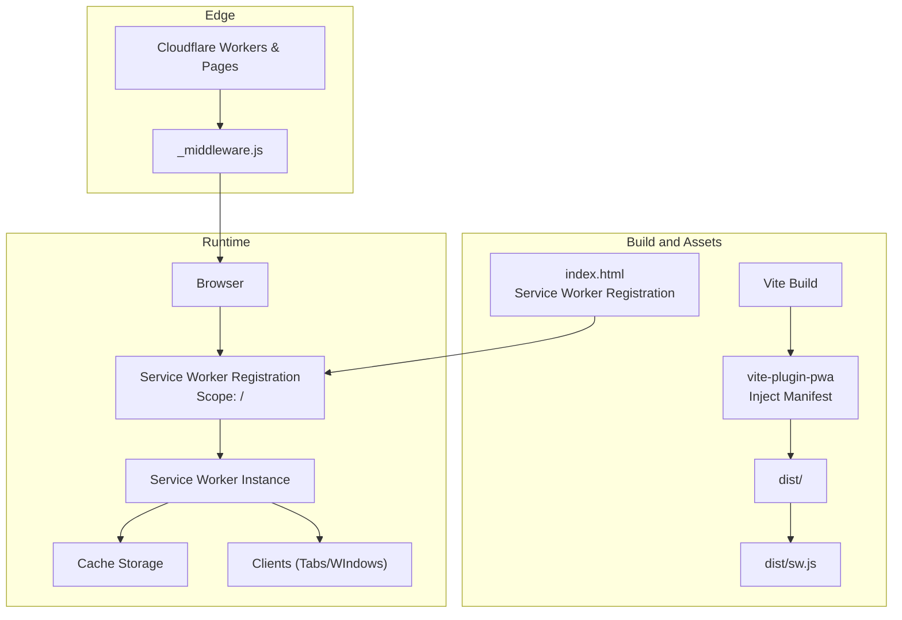

**Diagram sources**
- [vite.config.js](file://vite.config.js#L19-L203)
- [index.html](file://index.html#L73-L85)
- [dist/sw.js](file://dist/sw.js#L1-L2)
- [wrangler.jsonc](file://wrangler.jsonc#L1-L8)

**Section sources**
- [vite.config.js](file://vite.config.js#L19-L203)
- [index.html](file://index.html#L73-L85)
- [dist/sw.js](file://dist/sw.js#L1-L2)
- [wrangler.jsonc](file://wrangler.jsonc#L1-L8)

## Core Components
- Service Worker entry and Workbox modules: Import and initialize Workbox modules for precaching, routing, strategies, and plugins.
- Lifecycle control: Skip waiting and claim clients immediately upon installation.
- Precaching: Pre-cache critical assets from the Vite-PWA manifest.
- Runtime routing: Register strategies for scripts/styles, images, fonts, and API calls.
- Background sync: Queue and retry failed contact form submissions.
- Global offline fallback: Serve a custom offline page or placeholders when all else fails.
- Periodic background sync: Update featured labs data periodically.
- Push notifications: Show notifications and handle clicks.

**Section sources**
- [src/sw.js](file://src/sw.js#L14-L24)
- [src/sw.js](file://src/sw.js#L29-L32)
- [src/sw.js](file://src/sw.js#L43-L45)
- [src/sw.js](file://src/sw.js#L51-L62)
- [src/sw.js](file://src/sw.js#L66-L81)
- [src/sw.js](file://src/sw.js#L85-L96)
- [src/sw.js](file://src/sw.js#L101-L116)
- [src/sw.js](file://src/sw.js#L121-L153)
- [src/sw.js](file://src/sw.js#L157-L174)
- [src/sw.js](file://src/sw.js#L177-L182)
- [src/sw.js](file://src/sw.js#L185-L203)
- [src/sw.js](file://src/sw.js#L206-L226)

## Architecture Overview
The service worker integrates Workbox modules to provide a layered caching strategy:
- Precache critical assets at install time.
- Route runtime requests to appropriate strategies.
- Apply expiration and cacheable response plugins for cache hygiene.
- Provide offline fallback and push notification support.

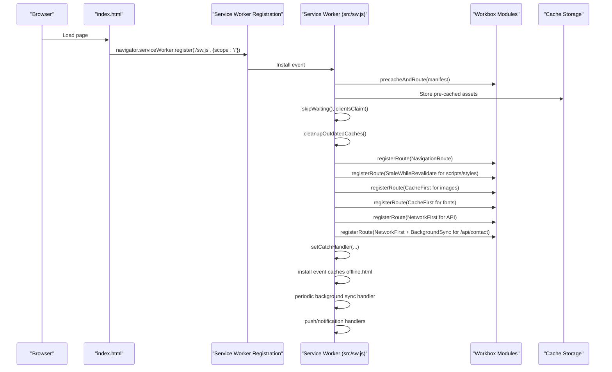

**Diagram sources**
- [index.html](file://index.html#L73-L85)
- [src/sw.js](file://src/sw.js#L14-L24)
- [src/sw.js](file://src/sw.js#L29-L32)
- [src/sw.js](file://src/sw.js#L43-L45)
- [src/sw.js](file://src/sw.js#L51-L62)
- [src/sw.js](file://src/sw.js#L66-L81)
- [src/sw.js](file://src/sw.js#L85-L96)
- [src/sw.js](file://src/sw.js#L101-L116)
- [src/sw.js](file://src/sw.js#L121-L153)
- [src/sw.js](file://src/sw.js#L157-L182)
- [src/sw.js](file://src/sw.js#L185-L226)

## Detailed Component Analysis

### Service Worker Lifecycle and Initialization
- Immediate control: The service worker calls skip waiting and claims clients to take control immediately after installation.
- Precache manifest: Uses the Vite-PWA generated manifest to precache assets.
- Outdated cache cleanup: Removes older cache versions scoped to the registration.
- Navigation fallback: Registers a navigation route that serves the app shell for unmatched navigations.

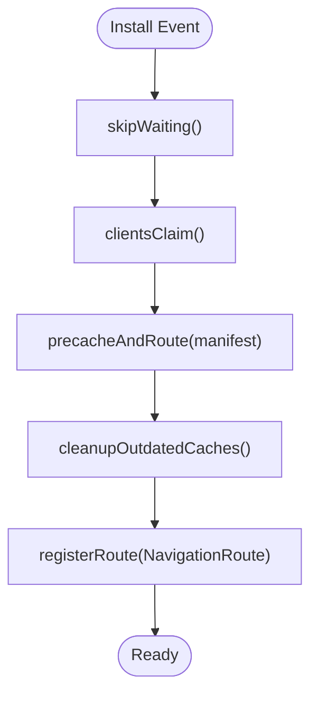

**Diagram sources**
- [src/sw.js](file://src/sw.js#L22-L32)
- [src/sw.js](file://src/sw.js#L43-L45)

**Section sources**
- [src/sw.js](file://src/sw.js#L22-L32)
- [src/sw.js](file://src/sw.js#L43-L45)

### Precaching Strategy
- Source: Vite-PWA injects the manifest into the service worker.
- Offline fallback: An offline.html is cached during install for offline fallback scenarios.

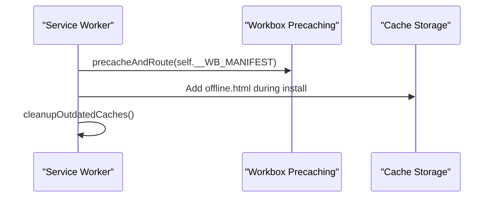

**Diagram sources**
- [src/sw.js](file://src/sw.js#L29-L32)
- [src/sw.js](file://src/sw.js#L177-L182)

**Section sources**
- [src/sw.js](file://src/sw.js#L29-L32)
- [src/sw.js](file://src/sw.js#L177-L182)

### Runtime Routing and Strategies
- Scripts and Styles: Stale-While-Revalidate with cache limits.
- Images: Cache-First with expiration and quota-aware purging.
- Fonts: Cache-First with long TTL.
- API: Network-First with short network timeout and cache fallback.
- Navigation: NavigationRoute with denylist to avoid serving shell for API/admin/assets.

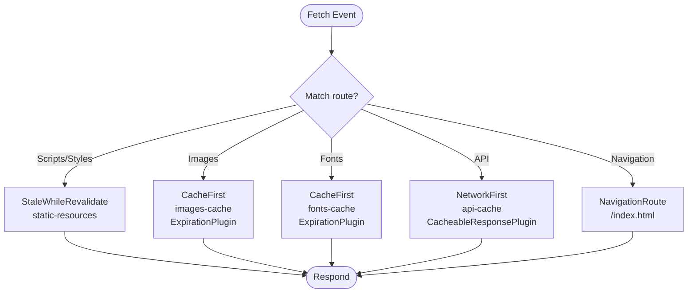

**Diagram sources**
- [src/sw.js](file://src/sw.js#L51-L62)
- [src/sw.js](file://src/sw.js#L66-L81)
- [src/sw.js](file://src/sw.js#L85-L96)
- [src/sw.js](file://src/sw.js#L101-L116)
- [src/sw.js](file://src/sw.js#L43-L45)

**Section sources**
- [src/sw.js](file://src/sw.js#L51-L62)
- [src/sw.js](file://src/sw.js#L66-L81)
- [src/sw.js](file://src/sw.js#L85-L96)
- [src/sw.js](file://src/sw.js#L101-L116)
- [src/sw.js](file://src/sw.js#L43-L45)

### Plugin Architecture
- ExpirationPlugin: Enforces max entries and max age; optionally purges on quota errors.
- CacheableResponsePlugin: Whitelists HTTP statuses for cacheability.
- BackgroundSyncPlugin: Queues failed POST requests and retries when online.

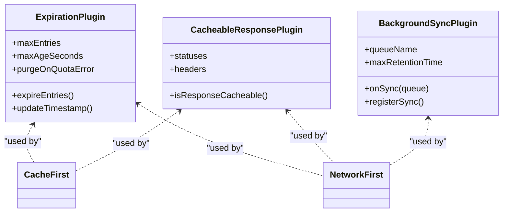

**Diagram sources**
- [src/sw.js](file://src/sw.js#L56-L60)
- [src/sw.js](file://src/sw.js#L76-L78)
- [src/sw.js](file://src/sw.js#L110-L113)
- [src/sw.js](file://src/sw.js#L121-L144)

**Section sources**
- [src/sw.js](file://src/sw.js#L56-L60)
- [src/sw.js](file://src/sw.js#L76-L78)
- [src/sw.js](file://src/sw.js#L110-L113)
- [src/sw.js](file://src/sw.js#L121-L144)

### Background Sync for Contact Form
- Dedicated NetworkFirst route for POST /api/contact.
- BackgroundSyncPlugin queues failed submissions and retries with a unique submission identifier to prevent duplicates.

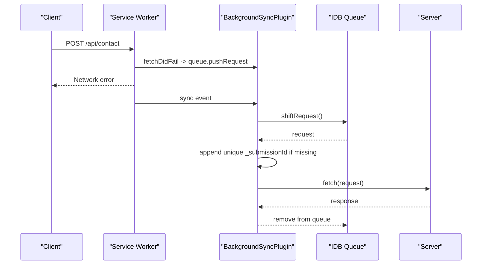

**Diagram sources**
- [src/sw.js](file://src/sw.js#L147-L153)
- [src/sw.js](file://src/sw.js#L121-L144)

**Section sources**
- [src/sw.js](file://src/sw.js#L147-L153)
- [src/sw.js](file://src/sw.js#L121-L144)

### Global Offline Fallback
- setCatchHandler provides fallback responses based on request destination.
- Install-time caching of offline.html ensures offline navigation fallback.

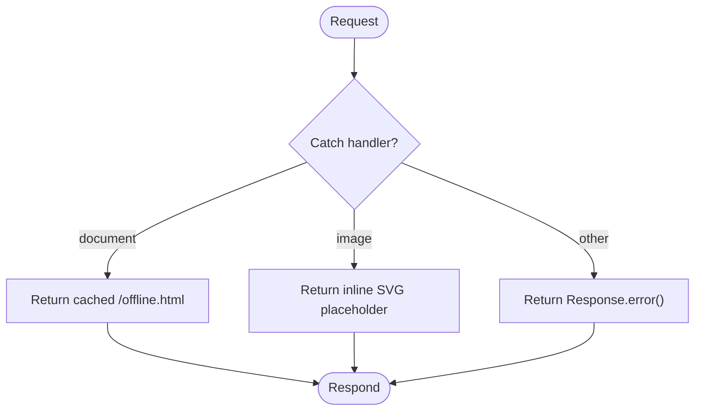

**Diagram sources**
- [src/sw.js](file://src/sw.js#L157-L174)
- [src/sw.js](file://src/sw.js#L177-L182)

**Section sources**
- [src/sw.js](file://src/sw.js#L157-L174)
- [src/sw.js](file://src/sw.js#L177-L182)
- [public/offline.html](file://public/offline.html#L1-L283)

### Periodic Background Sync
- PeriodicSync event handler updates featured labs data in api-cache.

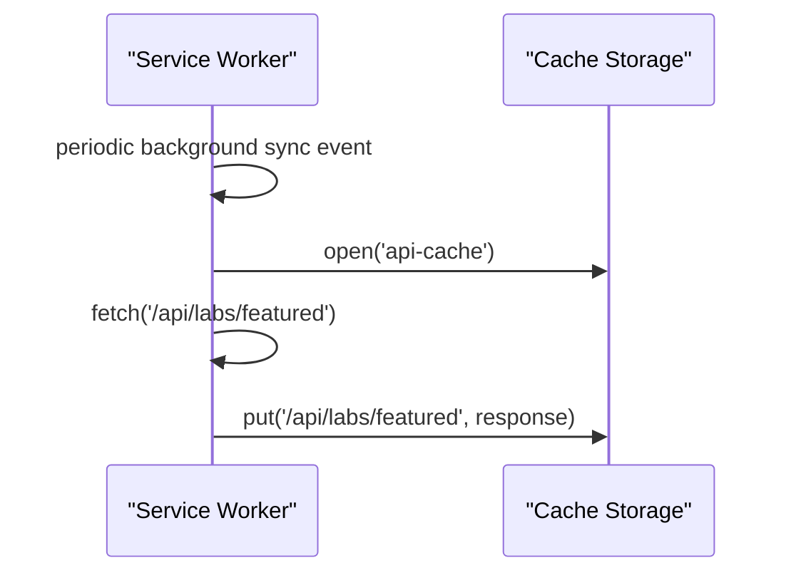

**Diagram sources**
- [src/sw.js](file://src/sw.js#L185-L203)

**Section sources**
- [src/sw.js](file://src/sw.js#L185-L203)

### Push Notifications
- Push event shows a notification with icon and badge.
- Notification click opens the URL from notification data.

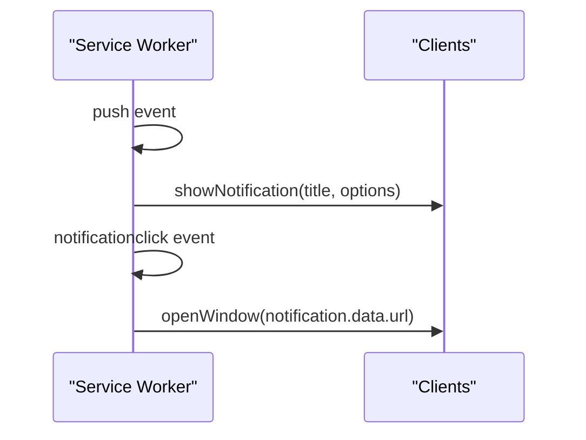

**Diagram sources**
- [src/sw.js](file://src/sw.js#L206-L226)

**Section sources**
- [src/sw.js](file://src/sw.js#L206-L226)

### Service Worker Scope and Activation
- Scope: Explicitly set to "/" in registration.
- Activation: skipWaiting() and clientsClaim() ensure immediate control.
- Outdated cache cleanup: Removes caches not matching the current precache cache name and scope.

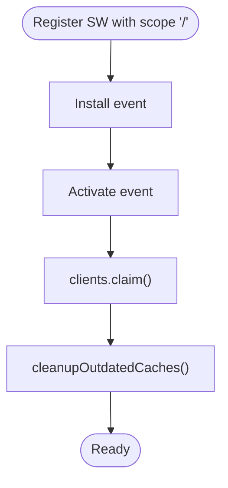

**Diagram sources**
- [index.html](file://index.html#L76-L76)
- [src/sw.js](file://src/sw.js#L22-L32)
- [src/sw.js](file://src/sw.js#L177-L182)

**Section sources**
- [index.html](file://index.html#L76-L76)
- [src/sw.js](file://src/sw.js#L22-L32)
- [src/sw.js](file://src/sw.js#L177-L182)

### Import Statements and Global Configurations
- Imports: workbox-core, workbox-precaching, workbox-routing, workbox-strategies, workbox-expiration, workbox-cacheable-response, workbox-background-sync.
- Global configs: VitePWA injectManifest strategy, filename, registerType, includeAssets, manifest, workbox options (globPatterns, maximumFileSizeToCacheInBytes, additionalManifestEntries).

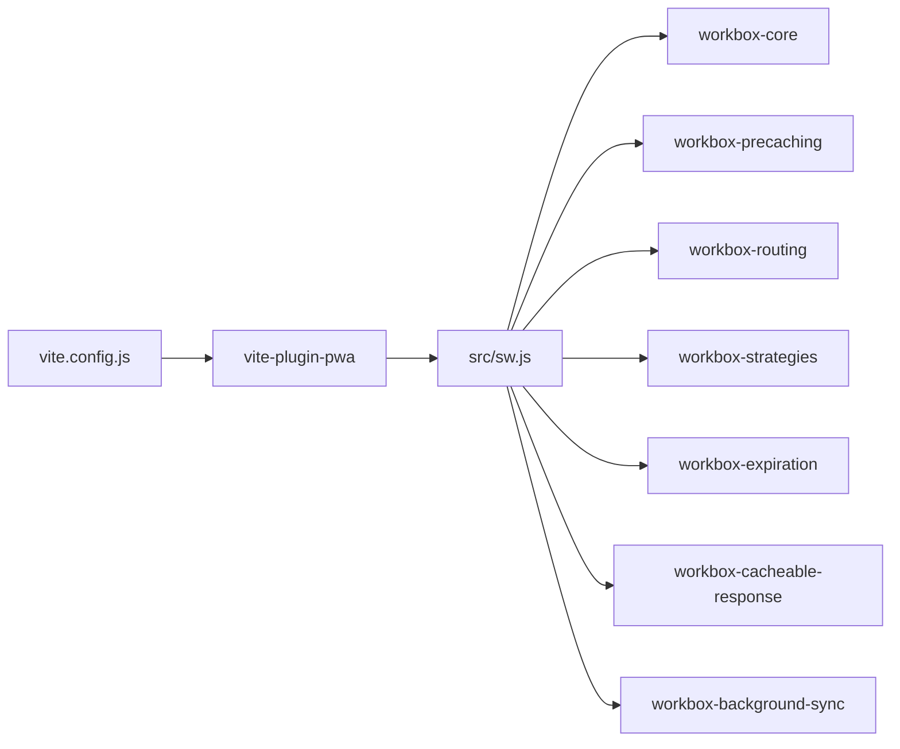

**Diagram sources**
- [src/sw.js](file://src/sw.js#L14-L21)
- [vite.config.js](file://vite.config.js#L19-L203)

**Section sources**
- [src/sw.js](file://src/sw.js#L14-L21)
- [vite.config.js](file://vite.config.js#L19-L203)

### Event Handlers
- Install: Cache offline.html.
- Activate: Claim clients and cleanup outdated caches.
- Fetch: Route requests to strategies.
- Background sync: Replay queued requests.
- Periodic sync: Update featured data.
- Push/notification: Show and handle notifications.

**Section sources**
- [src/sw.js](file://src/sw.js#L177-L182)
- [src/sw.js](file://src/sw.js#L185-L203)
- [src/sw.js](file://src/sw.js#L206-L226)

## Dependency Analysis
- Build-time dependency: vite-plugin-pwa generates the service worker and injects the manifest.
- Runtime dependency: Workbox modules provide precaching, routing, strategies, and plugins.
- Hosting dependency: Cloudflare Workers and Pages deliver assets and middleware.

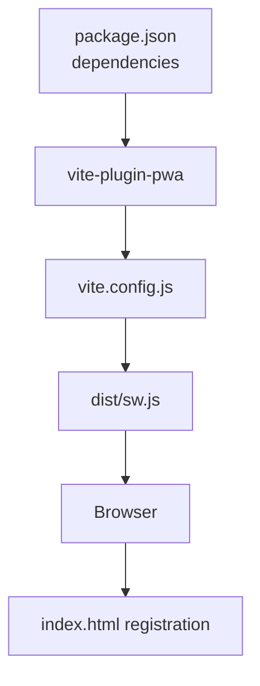

**Diagram sources**
- [package.json](file://package.json#L30-L30)
- [vite.config.js](file://vite.config.js#L19-L203)
- [dist/sw.js](file://dist/sw.js#L1-L2)
- [index.html](file://index.html#L73-L85)

**Section sources**
- [package.json](file://package.json#L30-L30)
- [vite.config.js](file://vite.config.js#L19-L203)
- [dist/sw.js](file://dist/sw.js#L1-L2)
- [index.html](file://index.html#L73-L85)

## Performance Considerations
- Precache limits: globPatterns restricts included files; maximumFileSizeToCacheInBytes caps individual file size.
- Strategy tuning: Stale-While-Revalidate for scripts/styles balances freshness and speed; Cache-First for images/fonts improves repeat visits; Network-First for API ensures fresh data with cache fallback.
- Cache hygiene: ExpirationPlugin controls cache size and age; purgeOnQuotaError helps recover from storage pressure.
- Background sync retention: Controlled via maxRetentionTime to avoid indefinite queue growth.

[No sources needed since this section provides general guidance]

## Troubleshooting Guide
- Service worker registration: Confirm registration script and scope in index.html.
- Cache inspection: Use browser DevTools Application panel to inspect Cache Storage and verify precached entries.
- Debug logging: Use console logs during install/activate/fetch events for visibility.
- Workbox window: Use workbox-window to monitor updates and skip waiting if desired.
- Middleware conflicts: Ensure Cloudflare middleware does not interfere with service worker behavior.
- Offline testing: Simulate offline conditions and verify offline.html fallback.

**Section sources**
- [index.html](file://index.html#L73-L85)
- [src/sw.js](file://src/sw.js#L177-L182)
- [public/offline.html](file://public/offline.html#L257-L280)
- [functions/_middleware.js](file://functions/_middleware.js#L81-L86)

## Conclusion
The service worker leverages Workbox v7 to deliver a robust offline-first experience with precise control over caching strategies, background sync, and push notifications. The Inject Manifest approach integrates seamlessly with Vite and Cloudflare hosting, ensuring reliable updates and predictable behavior across browsers.

## Appendices

### Browser Compatibility and Fallbacks
- Workbox v7 requires modern browsers with Service Worker support.
- For environments without background sync or periodic sync, the service worker gracefully falls back to immediate network attempts and cache fallbacks.
- Push notifications require permission; absence of permissions disables notification features without breaking other functionality.

[No sources needed since this section provides general guidance]