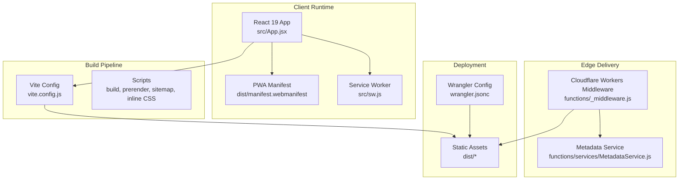
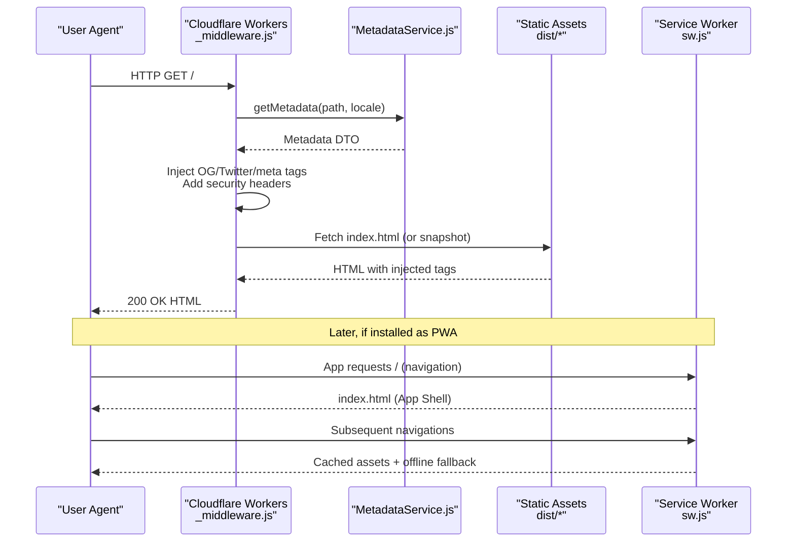
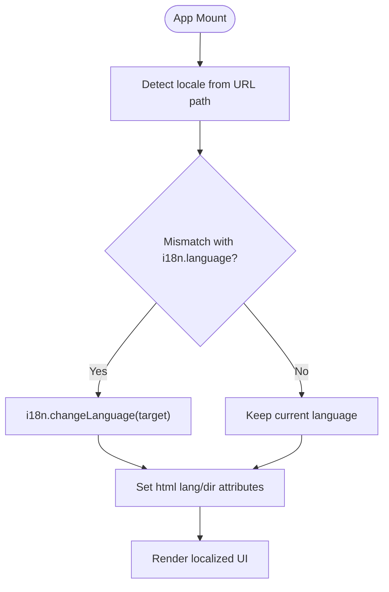
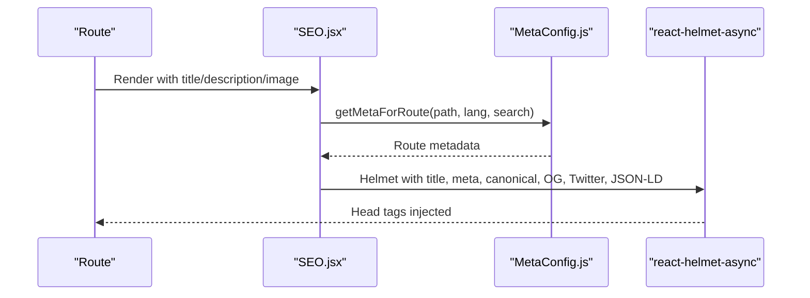
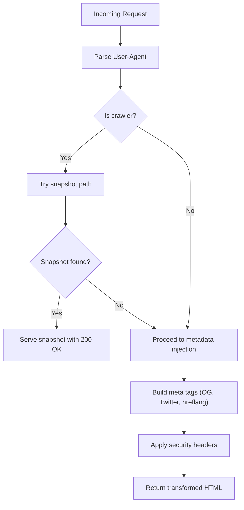
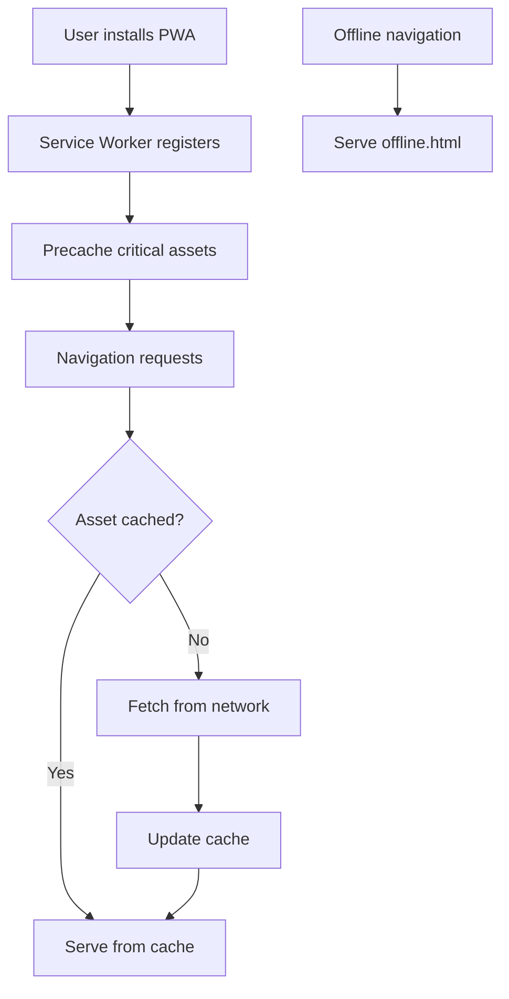
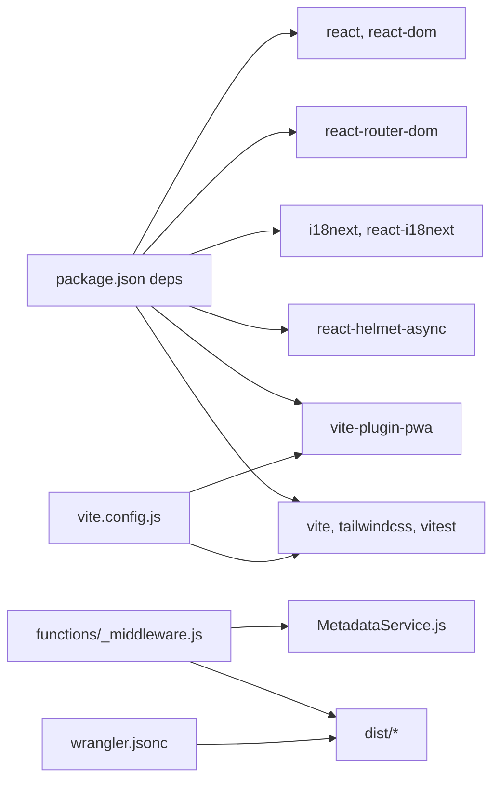

# Project Overview

<cite>
**Referenced Files in This Document**
- [README.md](file://README.md)
- [package.json](file://package.json)
- [vite.config.js](file://vite.config.js)
- [src/App.jsx](file://src/App.jsx)
- [src/main.jsx](file://src/main.jsx)
- [src/i18n.js](file://src/i18n.js)
- [src/locales/en.json](file://src/locales/en.json)
- [src/locales/ar.json](file://src/locales/ar.json)
- [src/components/SEO.jsx](file://src/components/SEO.jsx)
- [functions/_middleware.js](file://functions/_middleware.js)
- [functions/services/MetadataService.js](file://functions/services/MetadataService.js)
- [src/sw.js](file://src/sw.js)
- [wrangler.jsonc](file://wrangler.jsonc)
- [public/sitemap.xml](file://public/sitemap.xml)
- [dist/manifest.webmanifest](file://dist/manifest.webmanifest)
</cite>

## Table of Contents
1. [Introduction](#introduction)
2. [Project Structure](#project-structure)
3. [Core Components](#core-components)
4. [Architecture Overview](#architecture-overview)
5. [Detailed Component Analysis](#detailed-component-analysis)
6. [Dependency Analysis](#dependency-analysis)
7. [Performance Considerations](#performance-considerations)
8. [Troubleshooting Guide](#troubleshooting-guide)
9. [Conclusion](#conclusion)

## Introduction
Rumuze’s digital agency landing page is a professional showcase for enterprise software development, AI research and deployment, and growth marketing services. Built with modern web technologies, the project emphasizes multilingual support, SEO readiness, and progressive web app capabilities. It targets decision-makers and stakeholders who seek a high-authority, scalable, and globally optimized digital presence.

Key value propositions:
- Multilingual experience with automatic locale detection and synchronized routing for English and Arabic.
- SEO-first implementation with crawler-friendly metadata injection and structured data.
- Progressive web app features for installability, offline readiness, and background synchronization.
- Cloudflare Workers integration for fast, secure, and scalable edge delivery.

## Project Structure
The project combines a React 19 frontend with Vite, PWA tooling, and Cloudflare Workers middleware. The build pipeline produces a static site plus a service worker, while Cloudflare Workers intercepts requests to inject metadata for social crawlers and enforce security headers.

**Diagram sources**
- [src/App.jsx](file://src/App.jsx#L1-L348)
- [vite.config.js](file://vite.config.js#L1-L262)
- [src/sw.js](file://src/sw.js#L1-L227)
- [functions/_middleware.js](file://functions/_middleware.js#L1-L383)
- [functions/services/MetadataService.js](file://functions/services/MetadataService.js#L1-L380)
- [wrangler.jsonc](file://wrangler.jsonc#L1-L8)

**Section sources**
- [README.md](file://README.md#L1-L17)
- [package.json](file://package.json#L1-L49)
- [vite.config.js](file://vite.config.js#L1-L262)
- [src/App.jsx](file://src/App.jsx#L1-L348)
- [src/main.jsx](file://src/main.jsx#L1-L12)
- [src/sw.js](file://src/sw.js#L1-L227)
- [functions/_middleware.js](file://functions/_middleware.js#L1-L383)
- [functions/services/MetadataService.js](file://functions/services/MetadataService.js#L1-L380)
- [wrangler.jsonc](file://wrangler.jsonc#L1-L8)

## Core Components
- React 19 application with router-based lazy loading, skeleton loaders, and theme-aware rendering.
- Internationalization with i18next, language detection, and synchronized document direction and language attributes.
- SEO component that generates canonical links, Open Graph, Twitter cards, and structured data (JSON-LD).
- Cloudflare Workers middleware that injects metadata for crawlers, normalizes responses, and applies security headers.
- PWA configuration enabling install prompts, offline fallback, background sync, and periodic updates.

Practical examples:
- Multilingual routing: accessing /ar or /ar/services switches language and direction automatically.
- SEO optimization: crawler-compatible metadata injection and structured data for services, labs, and legal pages.
- PWA features: install prompt, offline page, background sync for contact forms, and periodic background updates.

**Section sources**
- [src/App.jsx](file://src/App.jsx#L74-L309)
- [src/i18n.js](file://src/i18n.js#L1-L45)
- [src/components/SEO.jsx](file://src/components/SEO.jsx#L1-L278)
- [functions/_middleware.js](file://functions/_middleware.js#L76-L264)
- [src/sw.js](file://src/sw.js#L118-L153)
- [vite.config.js](file://vite.config.js#L19-L202)

## Architecture Overview
The system integrates three layers:
- Frontend runtime: React 19 with router, lazy loading, and PWA integration.
- Edge runtime: Cloudflare Workers middleware for metadata injection and security hardening.
- Build and deployment: Vite bundling, PWA generation, and static asset publishing via Wrangler.

**Diagram sources**
- [functions/_middleware.js](file://functions/_middleware.js#L76-L264)
- [functions/services/MetadataService.js](file://functions/services/MetadataService.js#L70-L88)
- [src/sw.js](file://src/sw.js#L34-L45)

## Detailed Component Analysis

### Multilingual Experience (i18n and Routing)
The application detects browser language preferences, synchronizes the routing prefix (/en or /ar), and updates document direction and language attributes. Translations are loaded from JSON files and consumed via i18next with React integration.

**Diagram sources**
- [src/App.jsx](file://src/App.jsx#L117-L143)
- [src/i18n.js](file://src/i18n.js#L14-L40)

**Section sources**
- [src/App.jsx](file://src/App.jsx#L74-L143)
- [src/i18n.js](file://src/i18n.js#L1-L45)
- [src/locales/en.json](file://src/locales/en.json#L1-L414)
- [src/locales/ar.json](file://src/locales/ar.json#L1-L414)

### SEO and Structured Data
The SEO component centralizes metadata resolution, builds canonical URLs, and injects Open Graph, Twitter Cards, and JSON-LD schemas. It also renders hreflang alternatives and validates metadata in development.

**Diagram sources**
- [src/components/SEO.jsx](file://src/components/SEO.jsx#L7-L278)

**Section sources**
- [src/components/SEO.jsx](file://src/components/SEO.jsx#L1-L278)
- [public/sitemap.xml](file://public/sitemap.xml#L1-L149)

### Cloudflare Workers Middleware (Crawler-Friendly Metadata)
The middleware detects social and search engine crawlers, serves pre-rendered snapshots when available, injects metadata at the beginning of the head tag, normalizes status codes, and applies security headers.

**Diagram sources**
- [functions/_middleware.js](file://functions/_middleware.js#L76-L264)

**Section sources**
- [functions/_middleware.js](file://functions/_middleware.js#L1-L383)
- [functions/services/MetadataService.js](file://functions/services/MetadataService.js#L1-L380)

### Progressive Web App (PWA)
The PWA is configured via Vite PWA and Workbox, enabling:
- Automatic updates and background sync for offline-capable experiences.
- Precaching of critical assets and offline fallback.
- Periodic background sync for dynamic content refresh.
- Install prompt integration and tabbed application mode.

**Diagram sources**
- [vite.config.js](file://vite.config.js#L19-L202)
- [src/sw.js](file://src/sw.js#L26-L96)

**Section sources**
- [vite.config.js](file://vite.config.js#L1-L262)
- [src/sw.js](file://src/sw.js#L1-L227)
- [dist/manifest.webmanifest](file://dist/manifest.webmanifest#L1-L2)

## Dependency Analysis
The project’s dependencies align with a modern React 19 stack and PWA tooling. Cloudflare Workers provide edge logic for metadata and security. Wrangler manages static asset deployment.

**Diagram sources**
- [package.json](file://package.json#L16-L30)
- [vite.config.js](file://vite.config.js#L1-L262)
- [functions/_middleware.js](file://functions/_middleware.js#L29-L151)
- [functions/services/MetadataService.js](file://functions/services/MetadataService.js#L16-L29)
- [wrangler.jsonc](file://wrangler.jsonc#L1-L8)

**Section sources**
- [package.json](file://package.json#L1-L49)
- [vite.config.js](file://vite.config.js#L1-L262)
- [functions/_middleware.js](file://functions/_middleware.js#L1-L383)
- [functions/services/MetadataService.js](file://functions/services/MetadataService.js#L1-L380)
- [wrangler.jsonc](file://wrangler.jsonc#L1-L8)

## Performance Considerations
- Code splitting and chunking are tuned for optimal caching and initial load performance.
- Compression (gzip/brotli) and asset inlining reduce payload sizes.
- PWA caching strategies balance freshness and performance with stale-while-revalidate and cache-first policies.
- Build warnings and limits are configured to maintain bundle health.

[No sources needed since this section provides general guidance]

## Troubleshooting Guide
Common areas to inspect:
- Metadata injection for crawlers: verify crawler detection, snapshot availability, and tag placement order.
- PWA installation and updates: confirm service worker registration, precache entries, and update triggers.
- Localization mismatches: ensure URL prefixes (/ar vs /) and document direction/language attributes are synchronized.
- SEO validation: check canonical URLs, alternate hreflang tags, and JSON-LD schema completeness.

**Section sources**
- [functions/_middleware.js](file://functions/_middleware.js#L276-L288)
- [src/App.jsx](file://src/App.jsx#L117-L143)
- [src/components/SEO.jsx](file://src/components/SEO.jsx#L234-L239)
- [src/sw.js](file://src/sw.js#L118-L153)

## Conclusion
Rumuze’s landing page is architected as a high-performance, multilingual, SEO-ready, and installable digital platform. It leverages React 19, Vite, PWA technologies, and Cloudflare Workers to deliver a scalable, secure, and globally optimized experience for enterprise audiences.