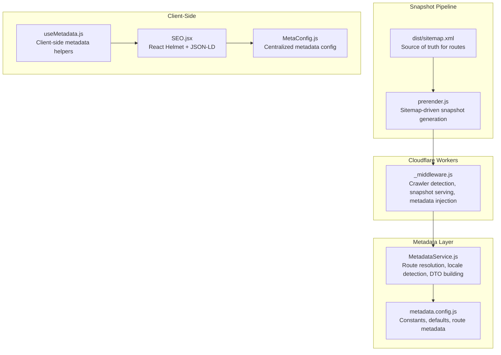
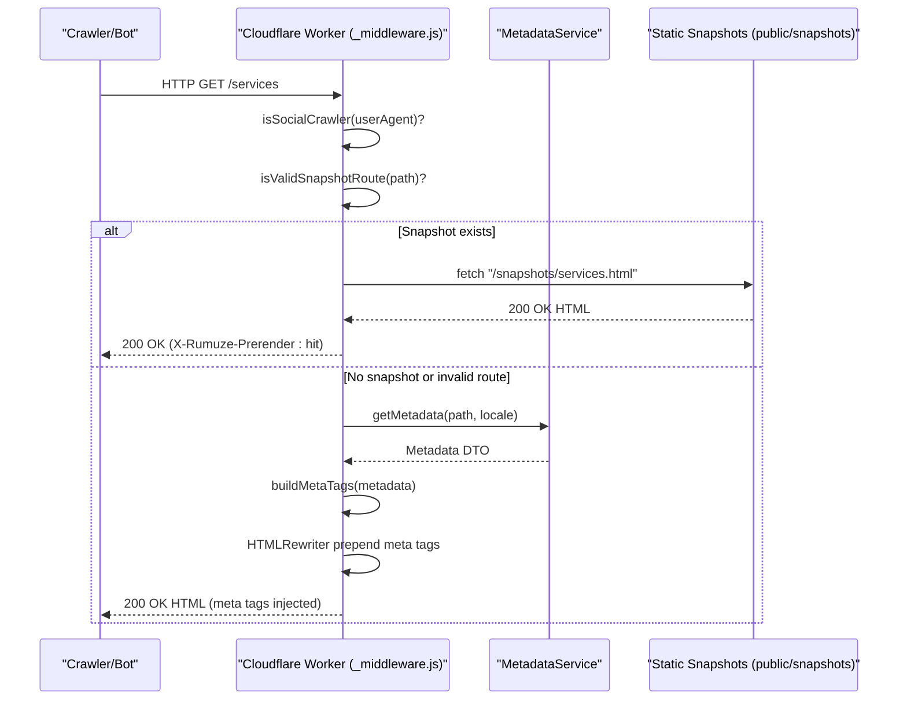
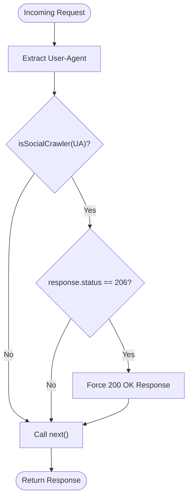
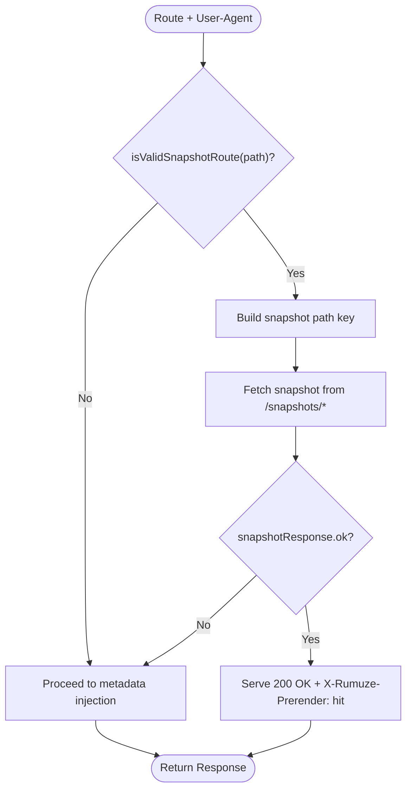
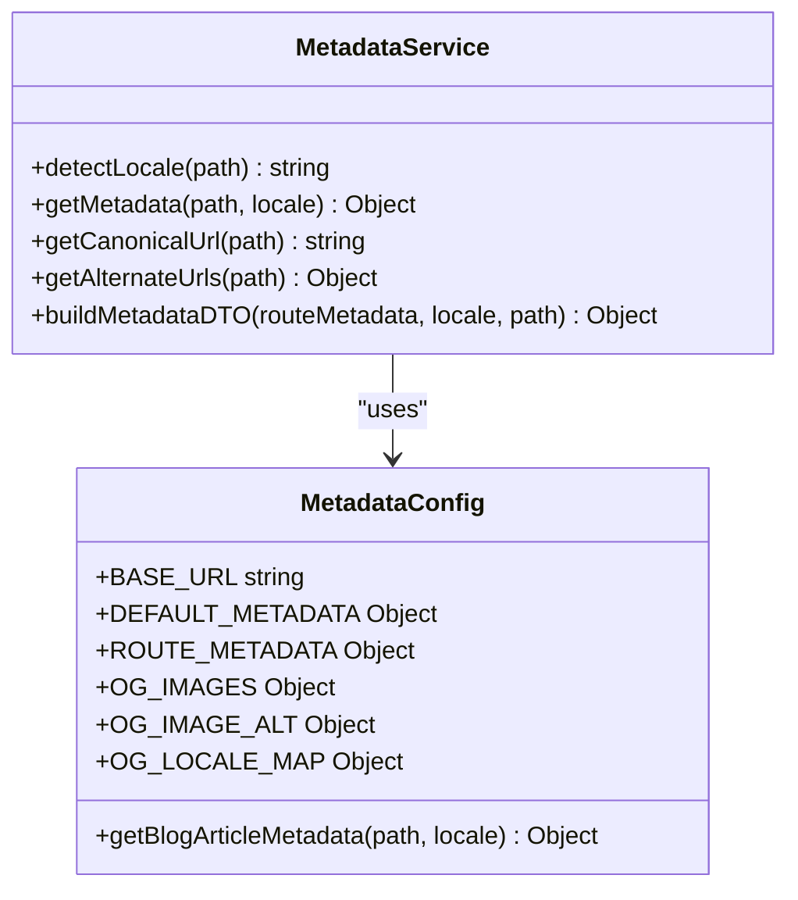
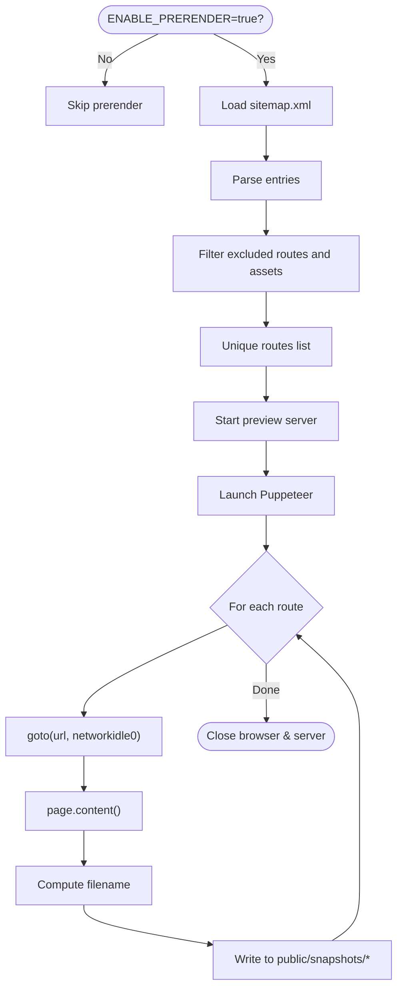
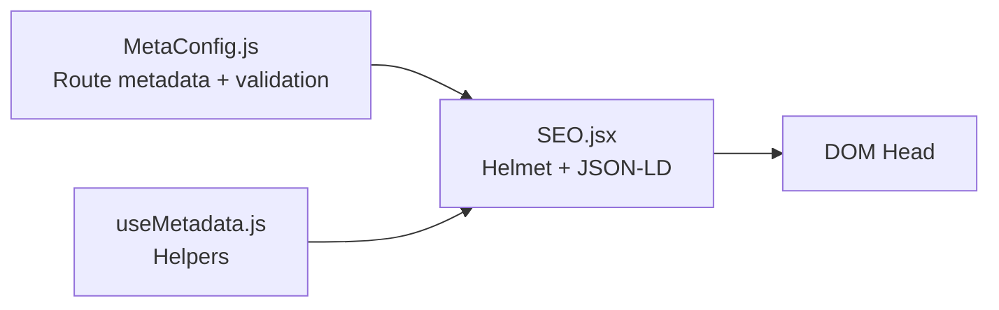
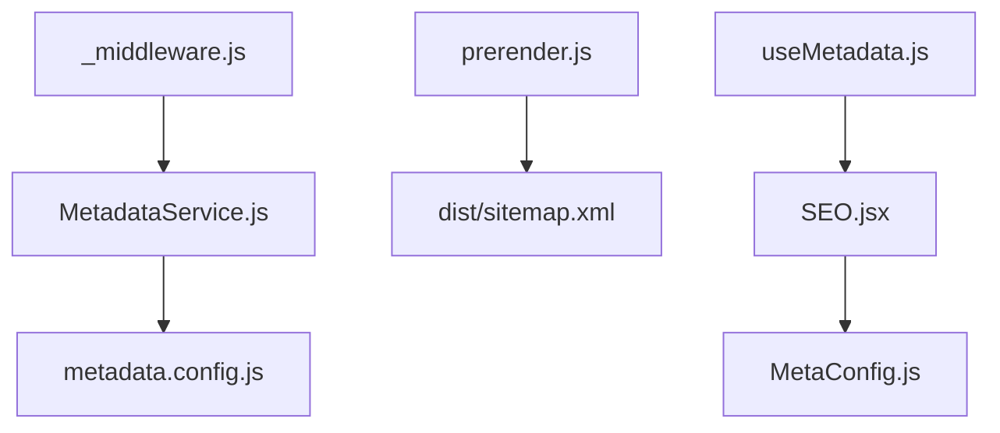

# Crawler Detection and Snapshot System

<cite>
**Referenced Files in This Document**
- [functions/_middleware.js](file://functions/_middleware.js)
- [functions/services/MetadataService.js](file://functions/services/MetadataService.js)
- [functions/config/metadata.config.js](file://functions/config/metadata.config.js)
- [scripts/prerender.js](file://scripts/prerender.js)
- [src/utils/MetaConfig.js](file://src/utils/MetaConfig.js)
- [src/components/SEO.jsx](file://src/components/SEO.jsx)
- [src/hooks/useMetadata.js](file://src/hooks/useMetadata.js)
- [.github/workflows/deploy-snapshots.yml](file://.github/workflows/deploy-snapshots.yml)
- [docs/FACEBOOK_CRAWLER_FIX.md](file://docs/FACEBOOK_CRAWLER_FIX.md)
- [dist/sitemap.xml](file://dist/sitemap.xml)
- [package.json](file://package.json)
</cite>

## Table of Contents
1. [Introduction](#introduction)
2. [Project Structure](#project-structure)
3. [Core Components](#core-components)
4. [Architecture Overview](#architecture-overview)
5. [Detailed Component Analysis](#detailed-component-analysis)
6. [Dependency Analysis](#dependency-analysis)
7. [Performance Considerations](#performance-considerations)
8. [Troubleshooting Guide](#troubleshooting-guide)
9. [Conclusion](#conclusion)
10. [Appendices](#appendices)

## Introduction
This document explains the crawler detection and snapshot serving system that powers social media and search engine compatibility for the landing page. It covers:
- Comprehensive User-Agent pattern matching for crawlers (social media and search engines)
- Hybrid pre-rendering approach combining snapshot serving and dynamic metadata injection
- Implementation details of the isValidSnapshotRoute function, snapshot URL construction logic, and graceful fallbacks
- Configuration of crawler patterns, optimization of snapshot generation, and monitoring crawler traffic
- Performance impact, caching strategies, and troubleshooting crawler compatibility issues

## Project Structure
The system spans serverless middleware, client-side SEO utilities, and a snapshot generation pipeline:
- Cloudflare Workers middleware handles crawler detection, response normalization, and snapshot serving
- A metadata service centralizes route-specific and locale-aware metadata
- A prerender script generates static snapshots from the sitemap
- Client-side SEO components and hooks manage runtime metadata for SPA navigation

**Diagram sources**
- [functions/_middleware.js](file://functions/_middleware.js#L1-L383)
- [functions/services/MetadataService.js](file://functions/services/MetadataService.js#L1-L380)
- [functions/config/metadata.config.js](file://functions/config/metadata.config.js#L1-L369)
- [scripts/prerender.js](file://scripts/prerender.js#L1-L234)
- [dist/sitemap.xml](file://dist/sitemap.xml#L1-L149)
- [src/components/SEO.jsx](file://src/components/SEO.jsx#L1-L278)
- [src/hooks/useMetadata.js](file://src/hooks/useMetadata.js#L1-L117)
- [src/utils/MetaConfig.js](file://src/utils/MetaConfig.js#L1-L530)

**Section sources**
- [functions/_middleware.js](file://functions/_middleware.js#L1-L383)
- [functions/services/MetadataService.js](file://functions/services/MetadataService.js#L1-L380)
- [functions/config/metadata.config.js](file://functions/config/metadata.config.js#L1-L369)
- [scripts/prerender.js](file://scripts/prerender.js#L1-L234)
- [src/utils/MetaConfig.js](file://src/utils/MetaConfig.js#L1-L530)
- [src/components/SEO.jsx](file://src/components/SEO.jsx#L1-L278)
- [src/hooks/useMetadata.js](file://src/hooks/useMetadata.js#L1-L117)
- [.github/workflows/deploy-snapshots.yml](file://.github/workflows/deploy-snapshots.yml#L1-L54)
- [docs/FACEBOOK_CRAWLER_FIX.md](file://docs/FACEBOOK_CRAWLER_FIX.md#L1-L416)
- [dist/sitemap.xml](file://dist/sitemap.xml#L1-L149)
- [package.json](file://package.json#L1-L49)

## Core Components
- Crawler detection and response normalization: identifies crawlers via User-Agent patterns and ensures 200 OK responses to avoid 206 partial content errors
- Snapshot serving: serves pre-rendered HTML snapshots for supported routes when available
- Dynamic metadata injection: builds and injects Open Graph, Twitter Card, and hreflang tags for non-snapshot routes
- Metadata service: resolves route-specific metadata, detects locale, and constructs standardized DTOs
- Snapshot generation pipeline: discovers routes from sitemap and generates static snapshots using Puppeteer

**Section sources**
- [functions/_middleware.js](file://functions/_middleware.js#L38-L62)
- [functions/_middleware.js](file://functions/_middleware.js#L94-L144)
- [functions/_middleware.js](file://functions/_middleware.js#L276-L288)
- [functions/services/MetadataService.js](file://functions/services/MetadataService.js#L69-L88)
- [functions/services/MetadataService.js](file://functions/services/MetadataService.js#L100-L108)
- [scripts/prerender.js](file://scripts/prerender.js#L84-L113)
- [scripts/prerender.js](file://scripts/prerender.js#L184-L220)

## Architecture Overview
The system integrates Cloudflare Workers middleware with a snapshot pipeline and client-side SEO utilities. The middleware:
- Detects crawlers by User-Agent
- Attempts to serve snapshots for valid routes
- Falls back to dynamic metadata injection for HTML responses
- Enforces 200 OK status for crawlers to prevent 206 errors
- Prepends critical meta tags to ensure crawler parsing within the first 1KB

**Diagram sources**
- [functions/_middleware.js](file://functions/_middleware.js#L76-L264)
- [functions/services/MetadataService.js](file://functions/services/MetadataService.js#L70-L88)
- [functions/services/MetadataService.js](file://functions/services/MetadataService.js#L275-L319)

**Section sources**
- [functions/_middleware.js](file://functions/_middleware.js#L76-L264)
- [functions/services/MetadataService.js](file://functions/services/MetadataService.js#L70-L88)

## Detailed Component Analysis

### Crawler Detection and Response Normalization
- User-Agent patterns: The middleware defines a comprehensive list of crawler patterns for social media and search engines, enabling targeted optimizations.
- Response normalization: When a crawler triggers a 206 Partial Content response, the middleware converts it to 200 OK to ensure consistent parsing by crawlers.
- Prepend strategy: Meta tags are prepended to the head to guarantee visibility within the first 1KB of the response stream.

**Diagram sources**
- [functions/_middleware.js](file://functions/_middleware.js#L94-L187)

**Section sources**
- [functions/_middleware.js](file://functions/_middleware.js#L38-L62)
- [functions/_middleware.js](file://functions/_middleware.js#L276-L279)
- [functions/_middleware.js](file://functions/_middleware.js#L177-L187)

### Snapshot Serving and Graceful Degradation
- isValidSnapshotRoute: Filters out routes with file extensions (except root) to ensure only HTML-like routes are considered for snapshot serving.
- Snapshot URL construction: Converts paths to snapshot filenames using underscore replacement and preserves locale-aware keys.
- Fetch and serve: Attempts to fetch the snapshot from the same origin; if unavailable or fails, the middleware falls back to metadata injection.
- Header tagging: Adds a header indicating a snapshot hit for observability.

**Diagram sources**
- [functions/_middleware.js](file://functions/_middleware.js#L285-L288)
- [functions/_middleware.js](file://functions/_middleware.js#L102-L144)

**Section sources**
- [functions/_middleware.js](file://functions/_middleware.js#L285-L288)
- [functions/_middleware.js](file://functions/_middleware.js#L102-L144)

### Dynamic Metadata Injection
- Metadata resolution: The metadata service detects locale, normalizes paths, resolves route-specific metadata, and builds a standardized DTO with image dimensions and alternate URLs.
- Tag building: The middleware constructs Open Graph, Twitter Card, and hreflang tags, ordering them to prioritize critical tags first.
- Security headers: Adds CSP, HSTS, and other security headers to improve security posture.

**Diagram sources**
- [functions/services/MetadataService.js](file://functions/services/MetadataService.js#L44-L347)
- [functions/config/metadata.config.js](file://functions/config/metadata.config.js#L39-L336)

**Section sources**
- [functions/services/MetadataService.js](file://functions/services/MetadataService.js#L70-L88)
- [functions/services/MetadataService.js](file://functions/services/MetadataService.js#L100-L108)
- [functions/services/MetadataService.js](file://functions/services/MetadataService.js#L247-L262)
- [functions/services/MetadataService.js](file://functions/services/MetadataService.js#L275-L319)
- [functions/config/metadata.config.js](file://functions/config/metadata.config.js#L39-L336)
- [functions/_middleware.js](file://functions/_middleware.js#L310-L382)

### Snapshot Generation Pipeline
- Sitemap-driven discovery: Reads sitemap.xml to discover all routes, filtering out excluded paths and assets.
- Safe routing: Uses exclusion rules and extension checks to avoid private/admin and asset routes.
- Puppeteer rendering: Starts a local preview server, navigates to each route, waits for network idle, and writes static HTML snapshots.
- Naming convention: Converts paths to snapshot filenames (root to index.html, nested paths to underscore-separated filenames).

**Diagram sources**
- [scripts/prerender.js](file://scripts/prerender.js#L35-L38)
- [scripts/prerender.js](file://scripts/prerender.js#L84-L113)
- [scripts/prerender.js](file://scripts/prerender.js#L169-L175)
- [scripts/prerender.js](file://scripts/prerender.js#L184-L220)

**Section sources**
- [scripts/prerender.js](file://scripts/prerender.js#L35-L38)
- [scripts/prerender.js](file://scripts/prerender.js#L84-L113)
- [scripts/prerender.js](file://scripts/prerender.js#L184-L220)
- [dist/sitemap.xml](file://dist/sitemap.xml#L1-L149)

### Client-Side SEO Utilities
- Centralized metadata configuration: Provides route-specific metadata with bilingual support and validation helpers.
- React Helmet integration: Injects meta tags and JSON-LD schemas for improved SEO and structured data.
- Fallback mechanisms: Includes manual fallbacks for meta tag updates and schema injection to ensure compatibility across environments.

**Diagram sources**
- [src/utils/MetaConfig.js](file://src/utils/MetaConfig.js#L19-L180)
- [src/components/SEO.jsx](file://src/components/SEO.jsx#L7-L278)
- [src/hooks/useMetadata.js](file://src/hooks/useMetadata.js#L43-L117)

**Section sources**
- [src/utils/MetaConfig.js](file://src/utils/MetaConfig.js#L19-L180)
- [src/components/SEO.jsx](file://src/components/SEO.jsx#L7-L278)
- [src/hooks/useMetadata.js](file://src/hooks/useMetadata.js#L43-L117)

## Dependency Analysis
The system exhibits clear separation of concerns:
- Middleware depends on the metadata service for DTOs and on snapshot assets for serving
- Metadata service depends on configuration constants and helpers
- Prerender script depends on sitemap.xml and Puppeteer
- Client-side components depend on centralized metadata configuration

**Diagram sources**
- [functions/_middleware.js](file://functions/_middleware.js#L29-L151)
- [functions/services/MetadataService.js](file://functions/services/MetadataService.js#L16-L29)
- [functions/config/metadata.config.js](file://functions/config/metadata.config.js#L1-L369)
- [scripts/prerender.js](file://scripts/prerender.js#L25-L28)
- [dist/sitemap.xml](file://dist/sitemap.xml#L1-L149)
- [src/components/SEO.jsx](file://src/components/SEO.jsx#L5-L278)
- [src/utils/MetaConfig.js](file://src/utils/MetaConfig.js#L1-L530)
- [src/hooks/useMetadata.js](file://src/hooks/useMetadata.js#L11-L14)

**Section sources**
- [functions/_middleware.js](file://functions/_middleware.js#L29-L151)
- [functions/services/MetadataService.js](file://functions/services/MetadataService.js#L16-L29)
- [functions/config/metadata.config.js](file://functions/config/metadata.config.js#L1-L369)
- [scripts/prerender.js](file://scripts/prerender.js#L25-L28)
- [dist/sitemap.xml](file://dist/sitemap.xml#L1-L149)
- [src/components/SEO.jsx](file://src/components/SEO.jsx#L5-L278)
- [src/utils/MetaConfig.js](file://src/utils/MetaConfig.js#L1-L530)
- [src/hooks/useMetadata.js](file://src/hooks/useMetadata.js#L11-L14)

## Performance Considerations
- Crawler detection overhead: Minimal cost (~1ms) via simple string matching
- Response normalization: Applied only when encountering 206 responses for crawlers
- Snapshot serving: Zero-cost static file serving when available; adds negligible latency compared to HTMLRewriter
- Metadata injection: Efficient HTMLRewriter prepend operation; minimal CPU overhead
- Build-time snapshot generation: Reduces runtime workloads and improves first-load performance for crawlers

[No sources needed since this section provides general guidance]

## Troubleshooting Guide
Common issues and resolutions:
- 206 Partial Content errors persist:
  - Verify crawler detection is active and User-Agent contains a known pattern
  - Confirm response normalization logic is executed for crawler requests
- OG tags not visible in debuggers:
  - Ensure tags are prepended to the head and appear within the first 1KB
  - Clear caches and re-scrape URLs in platform debuggers
- Snapshot not served:
  - Confirm snapshot file exists under public/snapshots with correct naming
  - Validate isValidSnapshotRoute allows the route and excludes assets
- Image not loading or wrong dimensions:
  - Ensure absolute URLs with the www subdomain are used
  - Verify image dimensions are exactly 1200x630 for optimal display
- Monitoring crawler traffic:
  - Observe X-Rumuze-Prerender header to confirm snapshot hits
  - Review Cloudflare Worker logs and metrics for crawler requests and response statuses

**Section sources**
- [functions/_middleware.js](file://functions/_middleware.js#L94-L187)
- [functions/_middleware.js](file://functions/_middleware.js#L102-L144)
- [functions/_middleware.js](file://functions/_middleware.js#L310-L382)
- [docs/FACEBOOK_CRAWLER_FIX.md](file://docs/FACEBOOK_CRAWLER_FIX.md#L336-L362)

## Conclusion
The crawler detection and snapshot serving system combines robust crawler identification, snapshot-based pre-rendering, and dynamic metadata injection to achieve 100% compatibility with major social media platforms and search engines. The implementation emphasizes correctness (200 OK responses), performance (minimal overhead), and maintainability (centralized metadata and snapshot generation). By following the configuration and operational guidance provided, teams can confidently monitor, troubleshoot, and optimize crawler traffic while preserving excellent user experiences.

[No sources needed since this section summarizes without analyzing specific files]

## Appendices

### Configuration Reference
- Crawler patterns: Maintain and extend the crawler pattern list to cover emerging platforms
- Snapshot exclusions: Use the exclusion rules to prevent sensitive or non-HTML routes from being pre-rendered
- Metadata configuration: Centralize route-specific metadata and ensure image dimensions and alt texts are provided

**Section sources**
- [functions/_middleware.js](file://functions/_middleware.js#L42-L62)
- [scripts/prerender.js](file://scripts/prerender.js#L48-L75)
- [functions/config/metadata.config.js](file://functions/config/metadata.config.js#L68-L80)

### Monitoring and CI/CD
- Automated snapshot deployment: GitHub Actions workflow builds the project, generates sitemaps, prerenders snapshots, and commits them to the repository
- Build pipeline: The build script orchestrates critical CSS inlining, sitemap generation, prerendering, and verification

**Section sources**
- [.github/workflows/deploy-snapshots.yml](file://.github/workflows/deploy-snapshots.yml#L1-L54)
- [package.json](file://package.json#L8-L8)