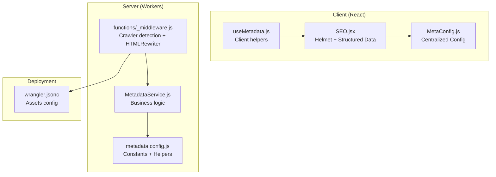
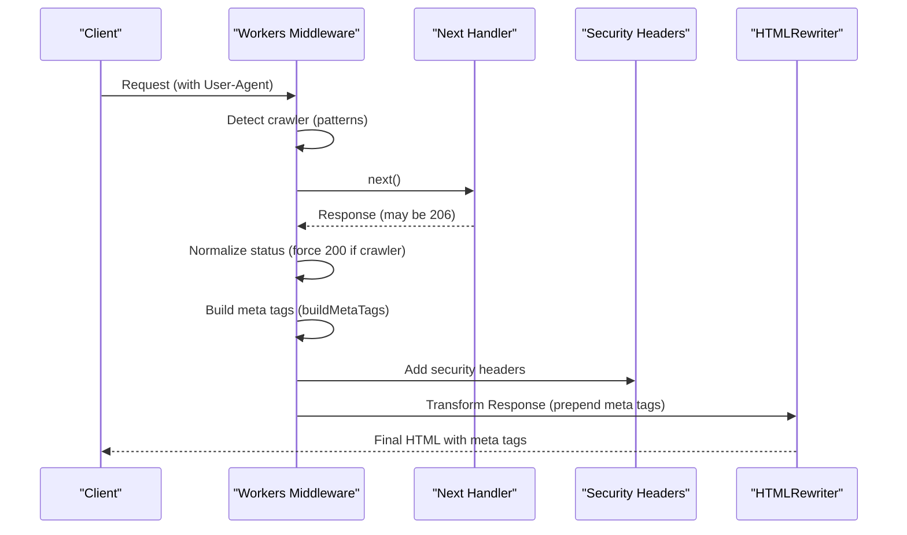
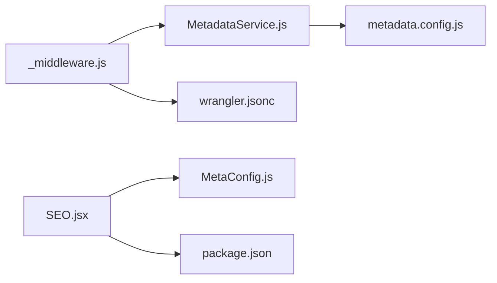

# Meta Tag Generation and Injection

<cite>
**Referenced Files in This Document**
- [functions/_middleware.js](file://functions/_middleware.js)
- [functions/config/metadata.config.js](file://functions/config/metadata.config.js)
- [functions/services/MetadataService.js](file://functions/services/MetadataService.js)
- [functions/services/MetadataService.test.js](file://functions/services/MetadataService.test.js)
- [src/utils/MetaConfig.js](file://src/utils/MetaConfig.js)
- [src/utils/MetaConfig.test.js](file://src/utils/MetaConfig.test.js)
- [src/components/SEO.jsx](file://src/components/SEO.jsx)
- [src/hooks/useMetadata.js](file://src/hooks/useMetadata.js)
- [docs/FACEBOOK_CRAWLER_FIX.md](file://docs/FACEBOOK_CRAWLER_FIX.md)
- [wrangler.jsonc](file://wrangler.jsonc)
- [package.json](file://package.json)
</cite>

## Table of Contents
1. [Introduction](#introduction)
2. [Project Structure](#project-structure)
3. [Core Components](#core-components)
4. [Architecture Overview](#architecture-overview)
5. [Detailed Component Analysis](#detailed-component-analysis)
6. [Dependency Analysis](#dependency-analysis)
7. [Performance Considerations](#performance-considerations)
8. [Troubleshooting Guide](#troubleshooting-guide)
9. [Conclusion](#conclusion)
10. [Appendices](#appendices)

## Introduction
This document explains the meta tag generation and HTML injection system used to power social media previews and SEO across the landing page. It focuses on the critical fixes that resolved 206 partial content errors, the pre-pending strategy for meta tags, and absolute URL normalization. It also documents the comprehensive meta tag structure (Open Graph, Twitter Cards, hreflang alternates, structured data), the buildMetaTags function, meta tag ordering priorities, and the HTMLRewriter transformation pipeline. Practical guidance is included for configuring meta tags across content types, testing social previews, integrating security headers, optimizing performance, and debugging.

## Project Structure
The system spans both the client-side React application and the Cloudflare Workers middleware:
- Client-side: centralized metadata configuration and SEO component with React Helmet
- Server-side: workers middleware that detects crawlers, builds metadata, injects meta tags, and adds security headers

**Diagram sources**
- [functions/_middleware.js](file://functions/_middleware.js#L1-L383)
- [functions/services/MetadataService.js](file://functions/services/MetadataService.js#L1-L380)
- [functions/config/metadata.config.js](file://functions/config/metadata.config.js#L1-L369)
- [src/components/SEO.jsx](file://src/components/SEO.jsx#L1-L278)
- [src/utils/MetaConfig.js](file://src/utils/MetaConfig.js#L1-L530)
- [src/hooks/useMetadata.js](file://src/hooks/useMetadata.js#L1-L117)
- [wrangler.jsonc](file://wrangler.jsonc#L1-L8)

**Section sources**
- [functions/_middleware.js](file://functions/_middleware.js#L1-L383)
- [functions/services/MetadataService.js](file://functions/services/MetadataService.js#L1-L380)
- [functions/config/metadata.config.js](file://functions/config/metadata.config.js#L1-L369)
- [src/utils/MetaConfig.js](file://src/utils/MetaConfig.js#L1-L530)
- [src/components/SEO.jsx](file://src/components/SEO.jsx#L1-L278)
- [src/hooks/useMetadata.js](file://src/hooks/useMetadata.js#L1-L117)
- [wrangler.jsonc](file://wrangler.jsonc#L1-L8)

## Core Components
- Cloudflare Workers middleware: detects crawlers, normalizes responses, builds meta tags, injects them at the head start, removes duplicates, and adds security headers.
- MetadataService: resolves locale, route metadata, canonical URLs, alternate URLs, and constructs a complete metadata DTO with sanitization and validation.
- Client-side SEO component: manages client-side metadata via React Helmet, validates metadata in development, and injects structured data.
- Centralized metadata configuration: constants, locale mapping, default metadata, route-specific metadata, and helpers for blog articles and sanitization.

**Section sources**
- [functions/_middleware.js](file://functions/_middleware.js#L1-L383)
- [functions/services/MetadataService.js](file://functions/services/MetadataService.js#L1-L380)
- [functions/config/metadata.config.js](file://functions/config/metadata.config.js#L1-L369)
- [src/components/SEO.jsx](file://src/components/SEO.jsx#L1-L278)
- [src/utils/MetaConfig.js](file://src/utils/MetaConfig.js#L1-L530)

## Architecture Overview
The system integrates server-side and client-side metadata management:
- Server-side: workers middleware runs before responses are sent, ensuring social crawlers receive complete, properly ordered meta tags and security headers.
- Client-side: React Helmet injects metadata for SPA navigation and provides fallbacks for edge cases.

**Diagram sources**
- [functions/_middleware.js](file://functions/_middleware.js#L76-L264)

## Detailed Component Analysis

### Workers Middleware: Crawler Detection, Response Normalization, and Injection
- Crawler detection: identifies social media and search engine bots via User-Agent patterns.
- Response normalization: forces 200 OK for crawlers when the original response is 206 to avoid partial content errors.
- Pre-pending strategy: injects meta tags at the beginning of the head to ensure they appear within the first 1KB for crawler parsing.
- Absolute URL normalization: replaces base URLs to use the www subdomain consistently.
- Security headers: adds CSP, HSTS, X-Content-Type-Options, X-Frame-Options, X-XSS-Protection, Referrer-Policy, Permissions-Policy.
- Duplicate removal: strips existing client-side meta tags before injection to avoid duplication.

Key implementation references:
- Crawler detection and patterns: [functions/_middleware.js](file://functions/_middleware.js#L42-L62)
- Response normalization: [functions/_middleware.js](file://functions/_middleware.js#L177-L187)
- Pre-pending meta tags: [functions/_middleware.js](file://functions/_middleware.js#L248-L253)
- Security headers: [functions/_middleware.js](file://functions/_middleware.js#L196-L225)
- Absolute URL normalization: [functions/_middleware.js](file://functions/_middleware.js#L159-L166)
- buildMetaTags function: [functions/_middleware.js](file://functions/_middleware.js#L294-L382)

**Section sources**
- [functions/_middleware.js](file://functions/_middleware.js#L1-L383)
- [docs/FACEBOOK_CRAWLER_FIX.md](file://docs/FACEBOOK_CRAWLER_FIX.md#L1-L416)

### MetadataService: Business Logic and DTO Construction
Responsibilities:
- Locale detection from paths.
- Route metadata resolution with exact and includes matching.
- Canonical URL and alternate URLs generation for hreflang.
- Image selection with cache busting and alt text.
- Article metadata resolution for blog slugs.
- Validation and sanitization of metadata strings.
- Factory-style construction of a complete metadata DTO.

Key implementation references:
- Locale detection: [functions/services/MetadataService.js](file://functions/services/MetadataService.js#L100-L108)
- Path normalization: [functions/services/MetadataService.js](file://functions/services/MetadataService.js#L213-L232)
- Route resolution: [functions/services/MetadataService.js](file://functions/services/MetadataService.js#L247-L262)
- Canonical URL: [functions/services/MetadataService.js](file://functions/services/MetadataService.js#L167-L171)
- Alternate URLs: [functions/services/MetadataService.js](file://functions/services/MetadataService.js#L183-L196)
- DTO building: [functions/services/MetadataService.js](file://functions/services/MetadataService.js#L275-L319)
- Blog article metadata: [functions/config/metadata.config.js](file://functions/config/metadata.config.js#L217-L284)

Validation and tests:
- Unit tests covering locale detection, normalization, canonical URL, alternate URLs, and DTO completeness: [functions/services/MetadataService.test.js](file://functions/services/MetadataService.test.js#L1-L370)

**Section sources**
- [functions/services/MetadataService.js](file://functions/services/MetadataService.js#L1-L380)
- [functions/config/metadata.config.js](file://functions/config/metadata.config.js#L1-L369)
- [functions/services/MetadataService.test.js](file://functions/services/MetadataService.test.js#L1-L370)

### Client-Side SEO Component and Hooks
- SEO component: centralizes metadata rendering via React Helmet, generates structured data (JSON-LD), and provides fallbacks for async hydration issues.
- useMetadata hook: provides helpers for absolute image URLs and default OG images, and exposes current metadata state.

Key implementation references:
- SEO component: [src/components/SEO.jsx](file://src/components/SEO.jsx#L1-L278)
- useMetadata hook: [src/hooks/useMetadata.js](file://src/hooks/useMetadata.js#L1-L117)
- Centralized metadata configuration: [src/utils/MetaConfig.js](file://src/utils/MetaConfig.js#L1-L530)

Validation and tests:
- Client-side metadata validation and canonical URL normalization tests: [src/utils/MetaConfig.test.js](file://src/utils/MetaConfig.test.js#L1-L54)

**Section sources**
- [src/components/SEO.jsx](file://src/components/SEO.jsx#L1-L278)
- [src/hooks/useMetadata.js](file://src/hooks/useMetadata.js#L1-L117)
- [src/utils/MetaConfig.js](file://src/utils/MetaConfig.js#L1-L530)
- [src/utils/MetaConfig.test.js](file://src/utils/MetaConfig.test.js#L1-L54)

### Meta Tag Structure and Ordering
The buildMetaTags function composes a complete set of meta tags with strict ordering priorities:
- Open Graph tags first (including image dimensions required by Facebook).
- Standard meta tags (description, canonical).
- Hreflang alternates for multilingual SEO.
- Twitter Card tags.
- Additional SEO tags (robots, googlebot).

Ordering rationale:
- Facebook crawler reads the first ~1KB; placing OG tags first ensures they are parsed reliably.
- Image dimensions are placed immediately after the image URL to satisfy Facebook’s requirements.

References:
- buildMetaTags function: [functions/_middleware.js](file://functions/_middleware.js#L294-L382)
- OG locale mapping and supported locales: [functions/config/metadata.config.js](file://functions/config/metadata.config.js#L289-L303)
- Image dimensions and alt text: [functions/_middleware.js](file://functions/_middleware.js#L344-L347)

**Section sources**
- [functions/_middleware.js](file://functions/_middleware.js#L294-L382)
- [functions/config/metadata.config.js](file://functions/config/metadata.config.js#L289-L303)

### Structured Data (JSON-LD)
The system generates structured data for:
- Organization and WebSite for Knowledge Graph presence.
- WebPage for the current page.
- BreadcrumbList for navigation context.
- Service for services pages.
- Article for blog posts.

References:
- Structured data generation: [src/utils/MetaConfig.js](file://src/utils/MetaConfig.js#L337-L521)
- Client-side structured data injection: [src/components/SEO.jsx](file://src/components/SEO.jsx#L46-L168)

**Section sources**
- [src/utils/MetaConfig.js](file://src/utils/MetaConfig.js#L337-L521)
- [src/components/SEO.jsx](file://src/components/SEO.jsx#L46-L168)

### Security Headers Integration
The middleware adds comprehensive security headers to improve security posture and achieve best-practice scores:
- Content-Security-Policy
- Strict-Transport-Security
- X-Content-Type-Options
- X-Frame-Options
- X-XSS-Protection
- Referrer-Policy
- Permissions-Policy

References:
- Security headers: [functions/_middleware.js](file://functions/_middleware.js#L196-L225)

**Section sources**
- [functions/_middleware.js](file://functions/_middleware.js#L196-L225)

## Dependency Analysis
High-level dependencies:
- Workers middleware depends on MetadataService and metadata.config for metadata resolution and constants.
- Client-side SEO component depends on centralized metadata configuration and React Helmet.
- Both sides coordinate around canonical URLs, alternate URLs, and image dimensions.

**Diagram sources**
- [functions/_middleware.js](file://functions/_middleware.js#L1-L383)
- [functions/services/MetadataService.js](file://functions/services/MetadataService.js#L1-L380)
- [functions/config/metadata.config.js](file://functions/config/metadata.config.js#L1-L369)
- [src/components/SEO.jsx](file://src/components/SEO.jsx#L1-L278)
- [src/utils/MetaConfig.js](file://src/utils/MetaConfig.js#L1-L530)
- [wrangler.jsonc](file://wrangler.jsonc#L1-L8)
- [package.json](file://package.json#L1-L49)

**Section sources**
- [functions/_middleware.js](file://functions/_middleware.js#L1-L383)
- [functions/services/MetadataService.js](file://functions/services/MetadataService.js#L1-L380)
- [functions/config/metadata.config.js](file://functions/config/metadata.config.js#L1-L369)
- [src/components/SEO.jsx](file://src/components/SEO.jsx#L1-L278)
- [src/utils/MetaConfig.js](file://src/utils/MetaConfig.js#L1-L530)
- [wrangler.jsonc](file://wrangler.jsonc#L1-L8)
- [package.json](file://package.json#L1-L49)

## Performance Considerations
- Crawler detection and response normalization have minimal overhead and apply only to crawler requests and 206 responses.
- Pre-pending meta tags is equivalent to append in performance but improves crawler parsing reliability.
- Absolute URL normalization avoids redirects and ensures consistent canonicals.
- Security headers are added once per response and do not impact payload size significantly.
- Snapshot serving for crawlers reduces compute by serving pre-rendered HTML when available.

[No sources needed since this section provides general guidance]

## Troubleshooting Guide
Common issues and resolutions:
- 206 Partial Content errors:
  - Ensure crawler detection is active and response normalization is applied for crawlers.
  - Confirm meta tags are prepended to the head.
  - References: [functions/_middleware.js](file://functions/_middleware.js#L177-L187), [functions/_middleware.js](file://functions/_middleware.js#L248-L253), [docs/FACEBOOK_CRAWLER_FIX.md](file://docs/FACEBOOK_CRAWLER_FIX.md#L1-L416)
- OG tags not visible in debuggers:
  - Verify tags appear at the top of the head.
  - Clear caches and scrape again.
  - References: [functions/_middleware.js](file://functions/_middleware.js#L248-L253), [docs/FACEBOOK_CRAWLER_FIX.md](file://docs/FACEBOOK_CRAWLER_FIX.md#L225-L279)
- Image not loading or wrong dimensions:
  - Use absolute URLs with the www subdomain.
  - Ensure image dimensions are 1200x630 and placed immediately after the image URL.
  - References: [functions/_middleware.js](file://functions/_middleware.js#L159-L166), [functions/_middleware.js](file://functions/_middleware.js#L344-L347)
- Multilingual hreflang issues:
  - Confirm alternate URLs are generated for both locales and x-default is set.
  - References: [functions/services/MetadataService.js](file://functions/services/MetadataService.js#L183-L196), [functions/_middleware.js](file://functions/_middleware.js#L358-L361)
- Client-side hydration mismatches:
  - Use React Helmet and fallback DOM updates for async hydration scenarios.
  - References: [src/components/SEO.jsx](file://src/components/SEO.jsx#L179-L223)

**Section sources**
- [functions/_middleware.js](file://functions/_middleware.js#L159-L187)
- [functions/_middleware.js](file://functions/_middleware.js#L248-L253)
- [functions/services/MetadataService.js](file://functions/services/MetadataService.js#L183-L196)
- [src/components/SEO.jsx](file://src/components/SEO.jsx#L179-L223)
- [docs/FACEBOOK_CRAWLER_FIX.md](file://docs/FACEBOOK_CRAWLER_FIX.md#L225-L362)

## Conclusion
The meta tag generation and injection system combines robust server-side middleware with client-side React Helmet to deliver reliable social previews and strong SEO. The critical fixes—response normalization, pre-pending meta tags, crawler detection, absolute URL normalization, and explicit image dimensions—resolve 206 partial content errors and ensure consistent parsing by major social platforms. The system’s layered design, with centralized configuration and comprehensive validation, enables maintainability and scalability across content types and locales.

[No sources needed since this section summarizes without analyzing specific files]

## Appendices

### Example: Configuring Meta Tags for Different Content Types
- Website pages: configure route-specific metadata with titles, descriptions, and default OG images.
  - References: [functions/config/metadata.config.js](file://functions/config/metadata.config.js#L109-L209), [src/utils/MetaConfig.js](file://src/utils/MetaConfig.js#L19-L180)
- Blog articles: use slug-based metadata with shared fields (author, published time, tags) and locale-specific overrides.
  - References: [functions/config/metadata.config.js](file://functions/config/metadata.config.js#L217-L284), [functions/services/MetadataService.js](file://functions/services/MetadataService.js#L74-L78)
- Products or services: customize type, image, and structured data accordingly.
  - References: [src/utils/MetaConfig.js](file://src/utils/MetaConfig.js#L447-L487), [src/utils/MetaConfig.js](file://src/utils/MetaConfig.js#L337-L521)

### Testing Meta Tag Injection and Social Previews
- Facebook Sharing Debugger: verify 200 status, OG tags visibility, and image dimensions.
  - References: [docs/FACEBOOK_CRAWLER_FIX.md](file://docs/FACEBOOK_CRAWLER_FIX.md#L225-L248)
- WhatsApp and LinkedIn preview tests: validate link preview cards.
  - References: [docs/FACEBOOK_CRAWLER_FIX.md](file://docs/FACEBOOK_CRAWLER_FIX.md#L249-L267)
- Browser DevTools inspection: confirm meta tags appear first in head and headers show 200 OK.
  - References: [docs/FACEBOOK_CRAWLER_FIX.md](file://docs/FACEBOOK_CRAWLER_FIX.md#L268-L279)

### Validation Utilities
- Server-side validation and sanitization:
  - References: [functions/config/metadata.config.js](file://functions/config/metadata.config.js#L347-L368), [functions/services/MetadataService.js](file://functions/services/MetadataService.js#L275-L319)
- Client-side validation:
  - References: [src/utils/MetaConfig.js](file://src/utils/MetaConfig.js#L304-L325), [src/utils/MetaConfig.test.js](file://src/utils/MetaConfig.test.js#L1-L54)

### Debugging Techniques
- Enable development logs to inspect metadata rendering and detect missing fields.
  - References: [src/components/SEO.jsx](file://src/components/SEO.jsx#L30-L44), [src/components/SEO.jsx](file://src/components/SEO.jsx#L171-L176)
- Use crawler detection logs and network inspection to confirm response normalization and header injection.
  - References: [functions/_middleware.js](file://functions/_middleware.js#L94-L96), [functions/_middleware.js](file://functions/_middleware.js#L177-L187), [functions/_middleware.js](file://functions/_middleware.js#L210-L225)