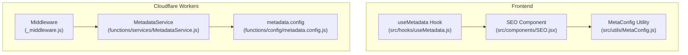
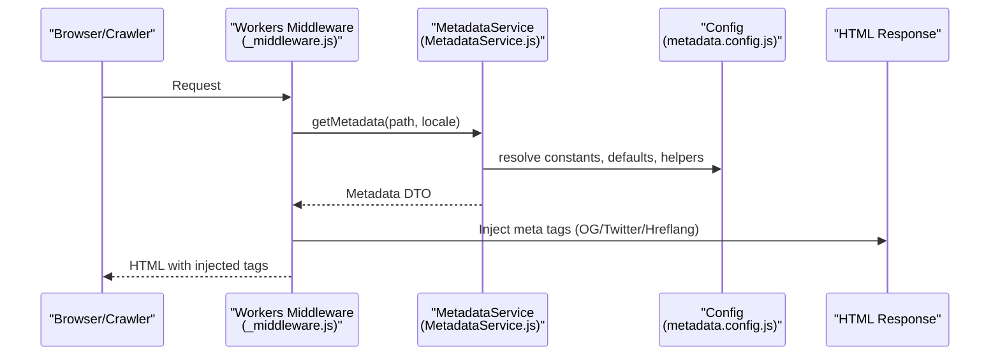
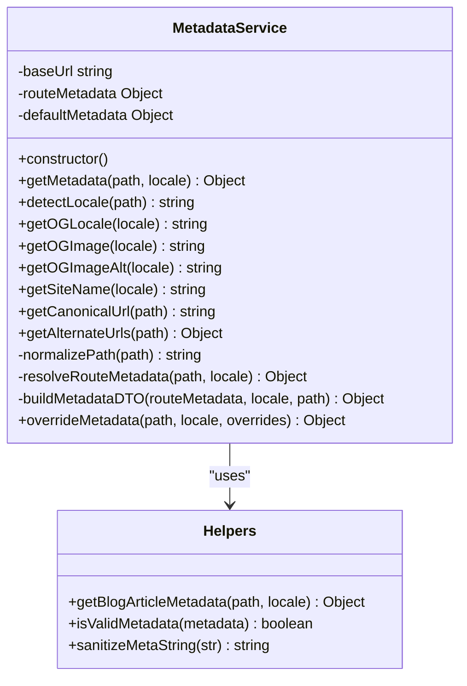
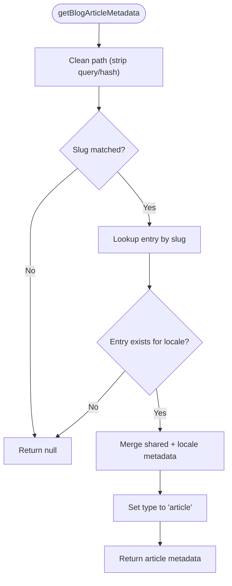
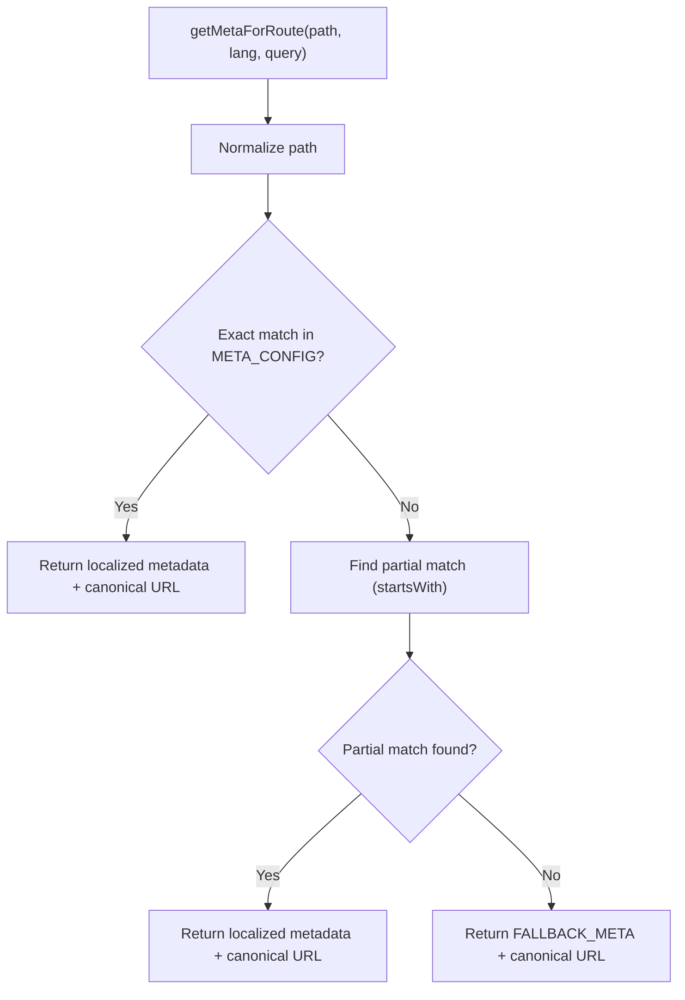
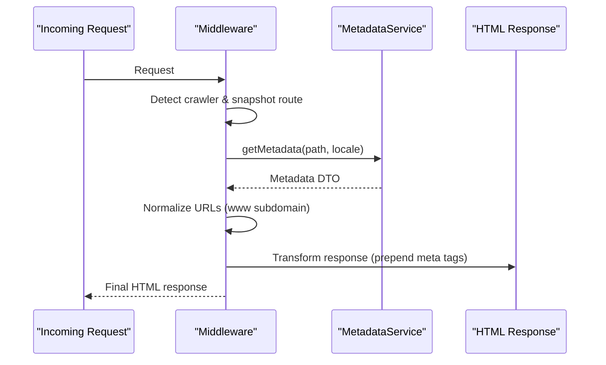
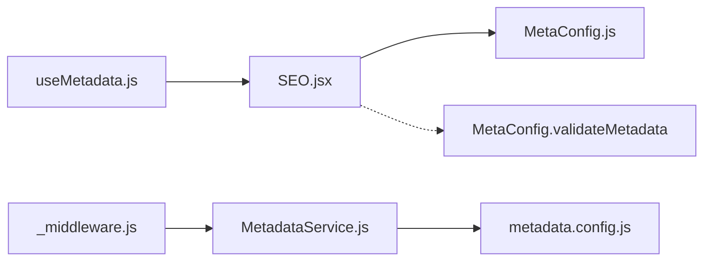

# Metadata Service Architecture

<cite>
**Referenced Files in This Document**
- [MetadataService.js](file://functions/services/MetadataService.js)
- [metadata.config.js](file://functions/config/metadata.config.js)
- [MetaConfig.js](file://src/utils/MetaConfig.js)
- [_middleware.js](file://functions/_middleware.js)
- [useMetadata.js](file://src/hooks/useMetadata.js)
- [SEO.jsx](file://src/components/SEO.jsx)
- [MetadataService.test.js](file://functions/services/MetadataService.test.js)
- [MetaConfig.test.js](file://src/utils/MetaConfig.test.js)
- [package.json](file://package.json)
</cite>

## Table of Contents
1. [Introduction](#introduction)
2. [Project Structure](#project-structure)
3. [Core Components](#core-components)
4. [Architecture Overview](#architecture-overview)
5. [Detailed Component Analysis](#detailed-component-analysis)
6. [Dependency Analysis](#dependency-analysis)
7. [Performance Considerations](#performance-considerations)
8. [Troubleshooting Guide](#troubleshooting-guide)
9. [Conclusion](#conclusion)
10. [Appendices](#appendices)

## Introduction
This document explains the Metadata Service architecture used to generate, validate, and inject SEO metadata across the application. It covers the singleton pattern implementation, metadata configuration system, route-based metadata resolution, DTO structure, validation logic, locale detection, inheritance and fallback strategies, dynamic content generation, and practical guidance for extending the service.

## Project Structure
The metadata system spans both the frontend and Cloudflare Workers middleware layers:
- Frontend: centralized metadata configuration and client-side SEO component
- Backend: Cloudflare Workers middleware that injects Open Graph and Twitter tags
- Shared: a reusable service with singleton pattern for consistent metadata resolution

**Diagram sources**
- [SEO.jsx](file://src/components/SEO.jsx#L1-L278)
- [useMetadata.js](file://src/hooks/useMetadata.js#L1-L117)
- [MetaConfig.js](file://src/utils/MetaConfig.js#L1-L530)
- [_middleware.js](file://functions/_middleware.js#L1-L383)
- [MetadataService.js](file://functions/services/MetadataService.js#L1-L380)
- [metadata.config.js](file://functions/config/metadata.config.js#L1-L369)

**Section sources**
- [SEO.jsx](file://src/components/SEO.jsx#L1-L278)
- [_middleware.js](file://functions/_middleware.js#L1-L383)
- [MetadataService.js](file://functions/services/MetadataService.js#L1-L380)
- [metadata.config.js](file://functions/config/metadata.config.js#L1-L369)

## Core Components
- MetadataService: central resolver with singleton pattern, locale detection, route matching, and DTO building
- metadata.config: centralized configuration for constants, defaults, route metadata, helpers, and validation
- MetaConfig: frontend-centric metadata configuration and structured data generation
- Middleware: Cloudflare Workers handler that detects crawlers, injects meta tags, and applies security headers
- SEO Component: client-side SEO management with React Helmet and structured data
- useMetadata Hook: client-side utilities for dynamic metadata overrides

**Section sources**
- [MetadataService.js](file://functions/services/MetadataService.js#L44-L347)
- [metadata.config.js](file://functions/config/metadata.config.js#L15-L369)
- [MetaConfig.js](file://src/utils/MetaConfig.js#L1-L530)
- [_middleware.js](file://functions/_middleware.js#L76-L264)
- [SEO.jsx](file://src/components/SEO.jsx#L1-L278)
- [useMetadata.js](file://src/hooks/useMetadata.js#L1-L117)

## Architecture Overview
The system follows a layered approach:
- Frontend layer: renders SEO tags and structured data using MetaConfig
- Backend layer: Cloudflare Workers middleware resolves metadata via MetadataService and injects tags into HTML responses
- Shared configuration: constants, defaults, and helpers live in metadata.config

**Diagram sources**
- [_middleware.js](file://functions/_middleware.js#L76-L264)
- [MetadataService.js](file://functions/services/MetadataService.js#L70-L88)
- [metadata.config.js](file://functions/config/metadata.config.js#L39-L369)

## Detailed Component Analysis

### MetadataService
Implements the core business logic for metadata resolution:
- Singleton pattern for worker lifecycle reuse
- Locale detection from URL path
- Path normalization and route metadata resolution
- Blog article metadata resolution
- DTO factory with validation and sanitization
- Canonical URL, alternate URLs, and OG locale mapping

**Diagram sources**
- [MetadataService.js](file://functions/services/MetadataService.js#L44-L347)
- [metadata.config.js](file://functions/config/metadata.config.js#L317-L369)

Key behaviors:
- Locale detection: checks path prefix for Arabic routes
- Route resolution: exact match then includes match, fallback to defaults
- Blog articles: slug-based resolution with shared and localized metadata
- DTO building: validates, sanitizes, and enriches with computed fields
- Overrides: merges base metadata with user-provided overrides

**Section sources**
- [MetadataService.js](file://functions/services/MetadataService.js#L70-L347)
- [metadata.config.js](file://functions/config/metadata.config.js#L317-L369)

### metadata.config
Centralized configuration and helpers:
- Constants: base URL, site names, OG images, locale mapping
- Defaults: fallback metadata for all routes
- Route metadata: localized entries for each route
- Blog article metadata: shared and localized fields
- Helpers: blog resolution, validation, sanitization

**Diagram sources**
- [metadata.config.js](file://functions/config/metadata.config.js#L317-L336)

**Section sources**
- [metadata.config.js](file://functions/config/metadata.config.js#L39-L369)

### MetaConfig (Frontend)
Frontend-centric metadata configuration and structured data:
- Route-specific metadata with bilingual support
- Fallback metadata for unknown routes
- Path normalization and canonical URL generation
- Validation and structured data (JSON-LD) generation
- Canonical query parameter filtering

**Diagram sources**
- [MetaConfig.js](file://src/utils/MetaConfig.js#L250-L295)

**Section sources**
- [MetaConfig.js](file://src/utils/MetaConfig.js#L19-L530)

### Middleware (Cloudflare Workers)
Injects metadata into HTML responses for crawlers and browsers:
- Crawler detection and snapshot serving
- Response normalization and security headers
- Prepending meta tags to head for optimal crawler parsing
- Canonical URL and image URL normalization

**Diagram sources**
- [_middleware.js](file://functions/_middleware.js#L76-L264)
- [MetadataService.js](file://functions/services/MetadataService.js#L70-L88)

**Section sources**
- [_middleware.js](file://functions/_middleware.js#L76-L383)

### SEO Component (Client-Side)
Manages SEO tags and structured data on the client:
- Uses MetaConfig for initial metadata
- Allows prop-based overrides
- Generates JSON-LD schemas
- Manages canonical and hreflang tags

**Section sources**
- [SEO.jsx](file://src/components/SEO.jsx#L1-L278)

### useMetadata Hook
Provides client-side utilities for dynamic metadata overrides and image URL generation.

**Section sources**
- [useMetadata.js](file://src/hooks/useMetadata.js#L1-L117)

## Dependency Analysis
The system exhibits clear separation of concerns:
- Frontend depends on MetaConfig for route-based metadata and structured data
- Middleware depends on MetadataService for robust metadata resolution
- MetadataService depends on metadata.config for constants, defaults, and helpers
- SEO component depends on MetaConfig for initial metadata and validation

**Diagram sources**
- [SEO.jsx](file://src/components/SEO.jsx#L1-L278)
- [MetaConfig.js](file://src/utils/MetaConfig.js#L304-L325)
- [_middleware.js](file://functions/_middleware.js#L29-L151)
- [MetadataService.js](file://functions/services/MetadataService.js#L16-L29)
- [metadata.config.js](file://functions/config/metadata.config.js#L16-L29)

**Section sources**
- [SEO.jsx](file://src/components/SEO.jsx#L1-L278)
- [_middleware.js](file://functions/_middleware.js#L1-L383)
- [MetadataService.js](file://functions/services/MetadataService.js#L1-L380)
- [metadata.config.js](file://functions/config/metadata.config.js#L1-L369)
- [MetaConfig.js](file://src/utils/MetaConfig.js#L1-L530)

## Performance Considerations
- Singleton pattern: MetadataService instances are reused within a worker lifecycle to reduce overhead
- Path normalization: reduces repeated string manipulation and improves route matching performance
- Caching strategy: consider adding in-memory caching for frequently accessed routes and blog slugs
- CDN optimization: OG images include cache-busting version to balance freshness and caching
- Snapshot serving: reduces server-side rendering load for crawlers by serving pre-rendered HTML when available
- Security headers: CSP and other headers are applied once per response to minimize overhead

[No sources needed since this section provides general guidance]

## Troubleshooting Guide
Common issues and resolutions:
- Invalid metadata warnings: ensure route metadata includes required fields; validation logs missing keys
- Incorrect locale detection: verify path prefixes and locale mapping
- Missing OG tags for crawlers: confirm middleware is active and meta tags are prepended
- Canonical URL mismatches: ensure base URL normalization and query parameter filtering
- XSS prevention: rely on built-in sanitization for metadata strings
- Snapshot serving failures: verify snapshot paths and static asset availability

**Section sources**
- [MetadataService.js](file://functions/services/MetadataService.js#L276-L280)
- [_middleware.js](file://functions/_middleware.js#L177-L187)
- [MetaConfig.js](file://src/utils/MetaConfig.js#L304-L325)

## Conclusion
The Metadata Service architecture provides a robust, maintainable, and scalable solution for SEO metadata across bilingual routes. It leverages design patterns (singleton, strategy, factory), centralized configuration, and layered injection to ensure consistent, crawler-friendly metadata while supporting dynamic content and extensible providers.

[No sources needed since this section summarizes without analyzing specific files]

## Appendices

### Metadata DTO Structure
The service constructs a comprehensive metadata DTO with core, image, OG, URL, and additional fields. Validation ensures required fields are present and sanitized.

**Section sources**
- [MetadataService.js](file://functions/services/MetadataService.js#L275-L319)
- [metadata.config.js](file://functions/config/metadata.config.js#L15-L33)

### Route-Based Metadata Resolution
Resolution strategy:
- Exact match against normalized path
- Includes match for dynamic routes
- Fallback to default metadata
- Blog article metadata takes precedence for article routes

**Section sources**
- [MetadataService.js](file://functions/services/MetadataService.js#L247-L262)
- [metadata.config.js](file://functions/config/metadata.config.js#L317-L336)

### Locale Detection and Inheritance
- Locale detection: path prefix determines locale
- Inheritance: localized metadata inherits from defaults when keys are missing
- Fallback: unknown locales default to English

**Section sources**
- [MetadataService.js](file://functions/services/MetadataService.js#L100-L108)
- [metadata.config.js](file://functions/config/metadata.config.js#L294-L303)

### Dynamic Content Generation
- Blog articles: slug-based resolution with shared and localized metadata
- Overrides: merge base metadata with user-provided overrides
- Structured data: JSON-LD generation for Knowledge Graph

**Section sources**
- [metadata.config.js](file://functions/config/metadata.config.js#L217-L284)
- [MetadataService.js](file://functions/services/MetadataService.js#L336-L346)
- [MetaConfig.js](file://src/utils/MetaConfig.js#L337-L521)

### Practical Examples

- Configure metadata for a new page type:
  - Add route metadata entries in the centralized configuration
  - Ensure both English and Arabic variants are provided
  - Use the service to resolve and inject metadata

- Implement custom metadata providers:
  - Extend the service with additional resolution strategies
  - Integrate with external content APIs for dynamic overrides

- Extend for new content types:
  - Add new route patterns and metadata entries
  - Implement specialized helpers for content-specific metadata

**Section sources**
- [metadata.config.js](file://functions/config/metadata.config.js#L119-L209)
- [MetadataService.js](file://functions/services/MetadataService.js#L247-L262)

### Testing Coverage
Unit tests validate:
- Locale detection and mapping
- Path normalization and route resolution
- DTO completeness and sanitization
- Canonical URL and alternate URL generation
- Singleton behavior and edge cases

**Section sources**
- [MetadataService.test.js](file://functions/services/MetadataService.test.js#L15-L370)
- [MetaConfig.test.js](file://src/utils/MetaConfig.test.js#L1-L54)