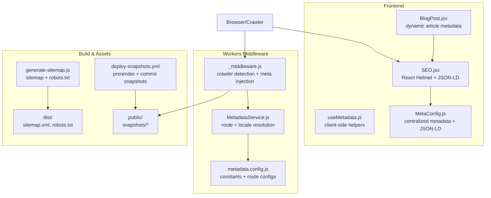
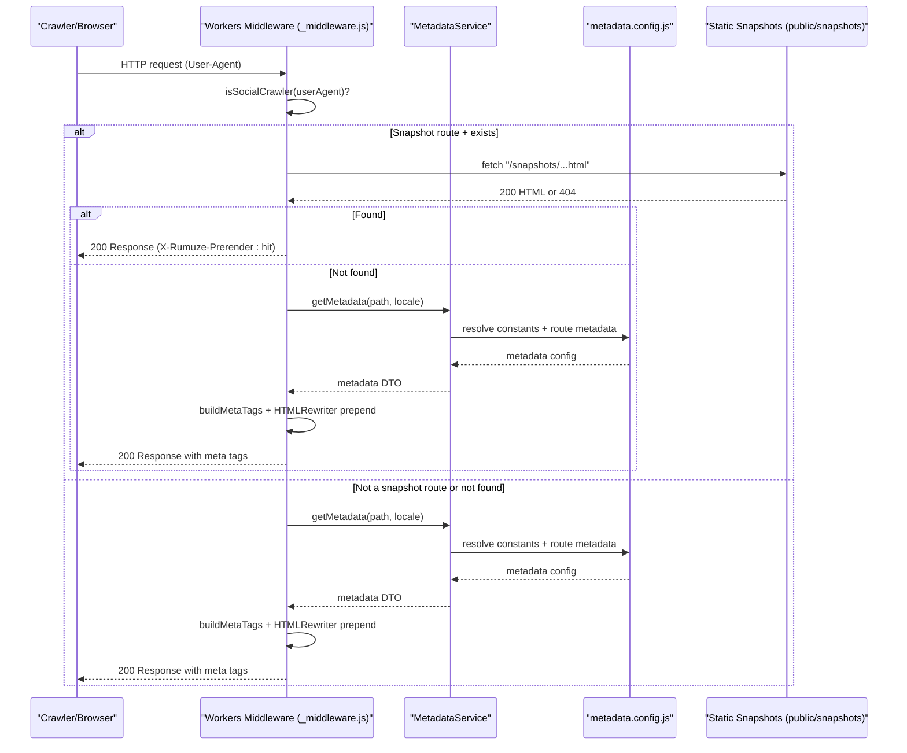
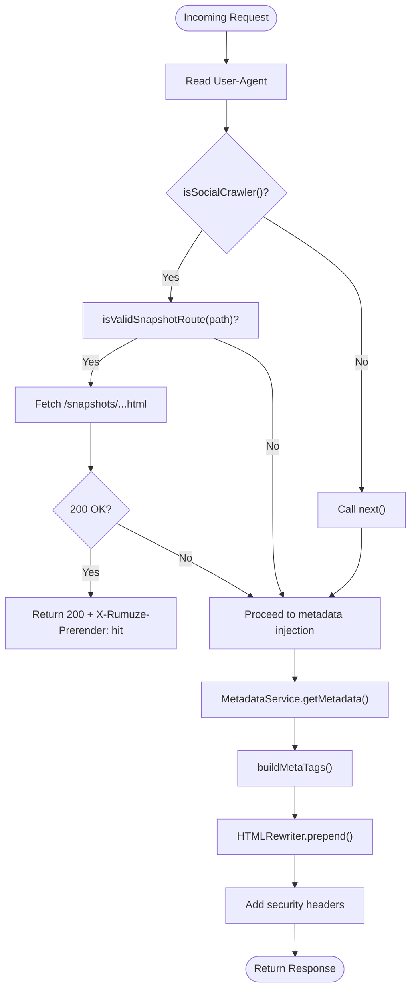
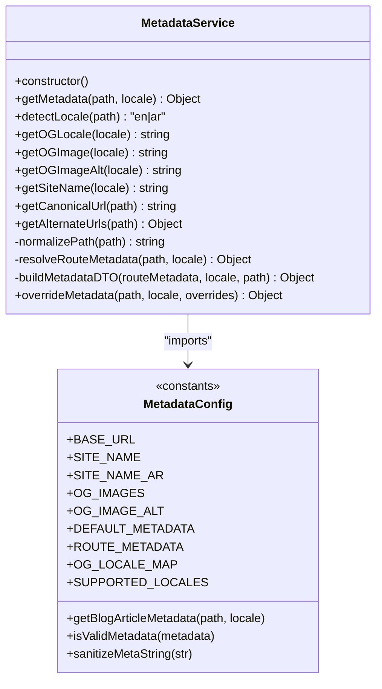
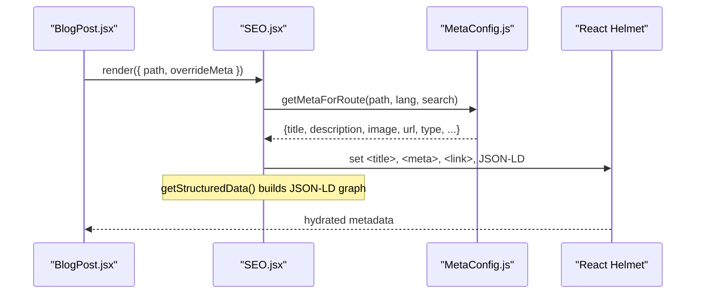
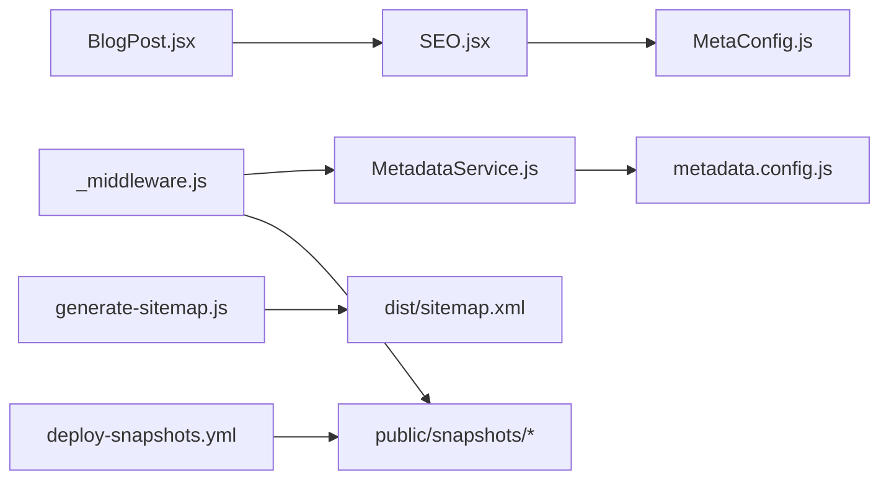

# SEO and Social Media Optimization

<cite>
**Referenced Files in This Document**
- [_middleware.js](file://functions/_middleware.js)
- [MetadataService.js](file://functions/services/MetadataService.js)
- [metadata.config.js](file://functions/config/metadata.config.js)
- [MetaConfig.js](file://src/utils/MetaConfig.js)
- [SEO.jsx](file://src/components/SEO.jsx)
- [useMetadata.js](file://src/hooks/useMetadata.js)
- [BlogPost.jsx](file://src/pages/BlogPost.jsx)
- [sitemap.xml (public)](file://public/sitemap.xml)
- [robots.txt (public)](file://public/robots.txt)
- [sitemap.xml (dist)](file://dist/sitemap.xml)
- [generate-sitemap.js](file://scripts/generate-sitemap.js)
- [deploy-snapshots.yml](file://.github/workflows/deploy-snapshots.yml)
- [wrangler.jsonc](file://wrangler.jsonc)
- [FACEBOOK_CRAWLER_FIX.md](file://docs/FACEBOOK_CRAWLER_FIX.md)
- [MetadataService.test.js](file://functions/services/MetadataService.test.js)
- [MetaConfig.test.js](file://src/utils/MetaConfig.test.js)
</cite>

## Table of Contents
1. [Introduction](#introduction)
2. [Project Structure](#project-structure)
3. [Core Components](#core-components)
4. [Architecture Overview](#architecture-overview)
5. [Detailed Component Analysis](#detailed-component-analysis)
6. [Dependency Analysis](#dependency-analysis)
7. [Performance Considerations](#performance-considerations)
8. [Troubleshooting Guide](#troubleshooting-guide)
9. [Conclusion](#conclusion)
10. [Appendices](#appendices)

## Introduction
This document explains the SEO and social media optimization system implemented across the frontend, Cloudflare Workers middleware, and build-time tooling. It covers:
- Cloudflare Workers middleware for crawler detection and snapshot serving
- Metadata service architecture and dynamic meta tag generation
- Structured data (JSON-LD) implementation
- Open Graph tags, Twitter Cards, and multilingual hreflang integration
- Practical configuration examples for different page types
- Crawler compatibility, performance impact, and monitoring strategies

## Project Structure
The SEO stack spans three layers:
- Frontend React components and hooks that manage client-side metadata and structured data
- Cloudflare Workers middleware that detects crawlers, injects meta tags, and serves pre-rendered snapshots
- Build-time scripts and GitHub Actions that generate sitemaps, robots.txt, and pre-rendered snapshots

**Diagram sources**
- [_middleware.js](file://functions/_middleware.js#L1-L383)
- [MetadataService.js](file://functions/services/MetadataService.js#L1-L380)
- [metadata.config.js](file://functions/config/metadata.config.js#L1-L369)
- [MetaConfig.js](file://src/utils/MetaConfig.js#L1-L530)
- [SEO.jsx](file://src/components/SEO.jsx#L1-L278)
- [useMetadata.js](file://src/hooks/useMetadata.js#L1-L117)
- [BlogPost.jsx](file://src/pages/BlogPost.jsx#L1-L132)
- [generate-sitemap.js](file://scripts/generate-sitemap.js#L1-L148)
- [deploy-snapshots.yml](file://.github/workflows/deploy-snapshots.yml#L1-L54)
- [dist/sitemap.xml](file://dist/sitemap.xml#L1-L149)
- [public/sitemap.xml](file://public/sitemap.xml#L1-L149)

**Section sources**
- [_middleware.js](file://functions/_middleware.js#L1-L383)
- [MetadataService.js](file://functions/services/MetadataService.js#L1-L380)
- [metadata.config.js](file://functions/config/metadata.config.js#L1-L369)
- [MetaConfig.js](file://src/utils/MetaConfig.js#L1-L530)
- [SEO.jsx](file://src/components/SEO.jsx#L1-L278)
- [useMetadata.js](file://src/hooks/useMetadata.js#L1-L117)
- [BlogPost.jsx](file://src/pages/BlogPost.jsx#L1-L132)
- [generate-sitemap.js](file://scripts/generate-sitemap.js#L1-L148)
- [deploy-snapshots.yml](file://.github/workflows/deploy-snapshots.yml#L1-L54)
- [dist/sitemap.xml](file://dist/sitemap.xml#L1-L149)
- [public/sitemap.xml](file://public/sitemap.xml#L1-L149)

## Core Components
- Cloudflare Workers middleware: Detects social and search engine crawlers, normalizes responses, injects meta tags at the start of head, and optionally serves pre-rendered snapshots.
- MetadataService: Centralized resolver for locale detection, route matching, fallbacks, and metadata DTO building with sanitization and hreflang generation.
- Frontend metadata utilities: React-based helpers and components to manage client-side metadata, structured data, and Open Graph/Twitter tags.
- Build-time SEO infrastructure: Sitemap and robots.txt generation, snapshot prerendering pipeline, and deployment automation.

**Section sources**
- [_middleware.js](file://functions/_middleware.js#L68-L264)
- [MetadataService.js](file://functions/services/MetadataService.js#L44-L347)
- [metadata.config.js](file://functions/config/metadata.config.js#L119-L368)
- [MetaConfig.js](file://src/utils/MetaConfig.js#L19-L521)
- [SEO.jsx](file://src/components/SEO.jsx#L7-L274)
- [generate-sitemap.js](file://scripts/generate-sitemap.js#L30-L147)

## Architecture Overview
The system integrates serverless metadata injection with client-side enhancements and automated asset generation.

**Diagram sources**
- [_middleware.js](file://functions/_middleware.js#L76-L144)
- [MetadataService.js](file://functions/services/MetadataService.js#L70-L88)
- [metadata.config.js](file://functions/config/metadata.config.js#L119-L368)

## Detailed Component Analysis

### Cloudflare Workers Middleware
- Crawler detection: Uses a curated list of crawler User-Agent patterns to identify social and search engine bots.
- Response normalization: Converts 206 Partial Content to 200 OK for crawlers to avoid parsing failures.
- Meta tag injection: Prepends Open Graph, Twitter, canonical, and hreflang tags at the start of head for fast crawler parsing.
- Snapshot serving: Attempts to serve pre-rendered HTML snapshots for supported routes, falling back to metadata injection.
- Security headers: Adds CSP, HSTS, X-Frame-Options, and other hardening headers.

**Diagram sources**
- [_middleware.js](file://functions/_middleware.js#L76-L263)

**Section sources**
- [_middleware.js](file://functions/_middleware.js#L42-L62)
- [_middleware.js](file://functions/_middleware.js#L94-L144)
- [_middleware.js](file://functions/_middleware.js#L150-L175)
- [_middleware.js](file://functions/_middleware.js#L177-L187)
- [_middleware.js](file://functions/_middleware.js#L226-L263)

### Metadata Service Architecture
- Strategy pattern: Resolves route metadata via exact match or includes-match against route patterns.
- Factory pattern: Builds a complete metadata DTO with defaults, locale mapping, and image alt text.
- Helpers: Canonical URL, alternate URLs (hreflang), locale mapping, and sanitization.
- Singleton: Reuses a single MetadataService instance per worker lifecycle.

**Diagram sources**
- [MetadataService.js](file://functions/services/MetadataService.js#L44-L347)
- [metadata.config.js](file://functions/config/metadata.config.js#L39-L368)

**Section sources**
- [MetadataService.js](file://functions/services/MetadataService.js#L44-L347)
- [metadata.config.js](file://functions/config/metadata.config.js#L119-L368)

### Dynamic Meta Tag Generation and Structured Data
- Frontend metadata: Centralized configuration with bilingual support, canonical URL normalization, and query parameter filtering.
- Structured data: JSON-LD graph including Organization, WebSite, WebPage, BreadcrumbList, Service, and Article schemas.
- Client-side fallback: Manual meta tag and JSON-LD injection via DOM manipulation for robustness.

**Diagram sources**
- [BlogPost.jsx](file://src/pages/BlogPost.jsx#L31-L41)
- [SEO.jsx](file://src/components/SEO.jsx#L7-L274)
- [MetaConfig.js](file://src/utils/MetaConfig.js#L250-L521)

**Section sources**
- [MetaConfig.js](file://src/utils/MetaConfig.js#L19-L521)
- [SEO.jsx](file://src/components/SEO.jsx#L7-L274)
- [useMetadata.js](file://src/hooks/useMetadata.js#L43-L114)

### Open Graph, Twitter Cards, and Multilingual Support
- Open Graph: og:type, og:title, og:description, og:url, og:site_name, og:locale, og:image variants, image dimensions, and alt text.
- Twitter Cards: summary_large_image with title, description, image, alt, site, and creator.
- Hreflang: alternate links for en/ar/x-default.
- Direction and lang attributes: applied to html element for RTL languages.

**Section sources**
- [_middleware.js](file://functions/_middleware.js#L310-L382)
- [SEO.jsx](file://src/components/SEO.jsx#L240-L265)
- [SEO.jsx](file://src/components/SEO.jsx#L234-L239)

### Snapshot Serving and Pre-rendering Pipeline
- Snapshot routes: Translates incoming paths to static snapshot filenames and serves them when available.
- Pre-rendering: Puppeteer-based prerendering executed in CI to generate HTML snapshots committed to public/snapshots.
- Fallback: If snapshot not found, metadata injection occurs in the worker.

**Section sources**
- [_middleware.js](file://functions/_middleware.js#L102-L144)
- [deploy-snapshots.yml](file://.github/workflows/deploy-snapshots.yml#L13-L53)

### Sitemap, Robots, and Crawlability
- Sitemap: Generated with hreflang pairs, priorities, and changefreq for all routes.
- Robots: Allows crawlers and references sitemap.
- Deployment: Workers asset binding configured to serve dist directory.

**Section sources**
- [generate-sitemap.js](file://scripts/generate-sitemap.js#L30-L117)
- [dist/sitemap.xml](file://dist/sitemap.xml#L1-L149)
- [public/sitemap.xml](file://public/sitemap.xml#L1-L149)
- [public/robots.txt](file://public/robots.txt#L1-L15)
- [wrangler.jsonc](file://wrangler.jsonc#L1-L8)

## Dependency Analysis
The system exhibits clear separation of concerns:
- Workers middleware depends on MetadataService and metadata.config for metadata resolution and tag building.
- Frontend components depend on MetaConfig for centralized metadata and structured data generation.
- Build scripts produce sitemaps and robots.txt consumed by search engines and workers.
- Snapshot prerendering is decoupled via CI and stored under public/snapshots.

**Diagram sources**
- [_middleware.js](file://functions/_middleware.js#L29-L151)
- [MetadataService.js](file://functions/services/MetadataService.js#L16-L53)
- [metadata.config.js](file://functions/config/metadata.config.js#L16-L29)
- [SEO.jsx](file://src/components/SEO.jsx#L5-L19)
- [MetaConfig.js](file://src/utils/MetaConfig.js#L1-L14)
- [BlogPost.jsx](file://src/pages/BlogPost.jsx#L6-L15)
- [generate-sitemap.js](file://scripts/generate-sitemap.js#L23-L39)
- [deploy-snapshots.yml](file://.github/workflows/deploy-snapshots.yml#L34-L53)

**Section sources**
- [_middleware.js](file://functions/_middleware.js#L29-L151)
- [MetadataService.js](file://functions/services/MetadataService.js#L16-L53)
- [metadata.config.js](file://functions/config/metadata.config.js#L16-L29)
- [SEO.jsx](file://src/components/SEO.jsx#L5-L19)
- [MetaConfig.js](file://src/utils/MetaConfig.js#L1-L14)
- [BlogPost.jsx](file://src/pages/BlogPost.jsx#L6-L15)
- [generate-sitemap.js](file://scripts/generate-sitemap.js#L23-L39)
- [deploy-snapshots.yml](file://.github/workflows/deploy-snapshots.yml#L34-L53)

## Performance Considerations
- Crawler detection overhead: Negligible cost via simple substring checks on User-Agent.
- Response normalization: Only applies when a 206 response is encountered; minimal extra latency.
- Tag injection: HTMLRewriter prepend is efficient; tags are placed at the top of head for fast crawler parsing.
- Snapshot serving: Avoids runtime metadata computation and HTML rewriting for crawlers.
- Image dimensions: Explicit width/height improve Facebook image prioritization without extra computation.
- Security headers: Applied to all responses; negligible overhead for HTML responses.

[No sources needed since this section provides general guidance]

## Troubleshooting Guide
Common issues and resolutions:
- Facebook 206 error persists
  - Verify crawler detection is active and User-Agent contains crawler patterns.
  - Confirm response normalization converts 206 to 200 for crawlers.
  - Ensure meta tags are prepended to head and appear within the first 1KB.
- OG tags not visible in debuggers
  - Check that tags are prepended (not appended) and ordered correctly.
  - Use “Scrape Again” to refresh caches.
- Image not loading or wrong dimensions
  - Confirm absolute URLs with www subdomain.
  - Ensure image dimensions are exactly 1200x630.
- Snapshot not served
  - Confirm snapshot filename matches expected pattern.
  - Ensure prerender job ran and snapshots were committed.
- Multilingual hreflang mismatches
  - Validate alternate URLs generated for en/ar/x-default.
  - Check canonical URLs and locale mapping.

**Section sources**
- [FACEBOOK_CRAWLER_FIX.md](file://docs/FACEBOOK_CRAWLER_FIX.md#L1-L416)
- [_middleware.js](file://functions/_middleware.js#L94-L144)
- [_middleware.js](file://functions/_middleware.js#L226-L263)
- [metadata.config.js](file://functions/config/metadata.config.js#L294-L297)

## Conclusion
The SEO and social media optimization system combines robust crawler detection, metadata injection, snapshot serving, and structured data to maximize discoverability and rich previews across platforms. The architecture balances serverless performance with comprehensive metadata coverage, supports multilingual hreflang, and provides strong testing and monitoring hooks.

[No sources needed since this section summarizes without analyzing specific files]

## Appendices

### Practical Examples: Configuring Metadata for Different Page Types
- Home page
  - Title/description: Use default metadata for both locales.
  - Image: Use localized OG image with cache-busting version.
- Services page
  - Title/description: Use route-specific metadata.
  - Type: website; image alt: service-focused description.
- About page
  - Title/description: Company-focused messaging.
  - Locale: mapped to appropriate OG locale.
- Blog article
  - Type: article; include author, publishedTime, modifiedTime, section, and tags.
  - Image: Use post-specific image when available.
- Legal pages (Privacy/Terms)
  - Keywords and descriptions tailored to legal content.
  - Canonical URLs without query parameters.

**Section sources**
- [metadata.config.js](file://functions/config/metadata.config.js#L119-L284)
- [MetadataService.js](file://functions/services/MetadataService.js#L275-L319)
- [MetaConfig.js](file://src/utils/MetaConfig.js#L19-L180)

### Testing Social Media Previews
- Facebook Sharing Debugger: Test EN/AR home, services, and blog articles; verify 200 OK and presence of og:title, og:description, og:image with correct dimensions.
- WhatsApp preview: Paste URLs in chat to verify preview card rendering.
- LinkedIn preview: Post URLs to LinkedIn to validate preview.
- Browser inspection: Confirm meta tags appear first in head and security headers are present.

**Section sources**
- [FACEBOOK_CRAWLER_FIX.md](file://docs/FACEBOOK_CRAWLER_FIX.md#L225-L279)

### Monitoring SEO Effectiveness
- Cloudflare Workers metrics: Track response status, latency, and prerender hits.
- Sitemap submission: Ensure sitemaps are submitted to Google Search Console and Bing Webmaster Tools.
- Robots.txt validation: Confirm allowed paths and sitemap references.
- Snapshot freshness: Monitor CI prerender job and snapshot commits.

**Section sources**
- [deploy-snapshots.yml](file://.github/workflows/deploy-snapshots.yml#L1-L54)
- [dist/sitemap.xml](file://dist/sitemap.xml#L1-L149)
- [public/robots.txt](file://public/robots.txt#L1-L15)

### Unit Tests Coverage
- MetadataService tests: Locale detection, path normalization, route resolution, DTO structure, canonical URL, alternate URLs, and override behavior.
- MetaConfig tests: Canonical URL normalization and query parameter handling.

**Section sources**
- [MetadataService.test.js](file://functions/services/MetadataService.test.js#L1-L370)
- [MetaConfig.test.js](file://src/utils/MetaConfig.test.js#L1-L54)