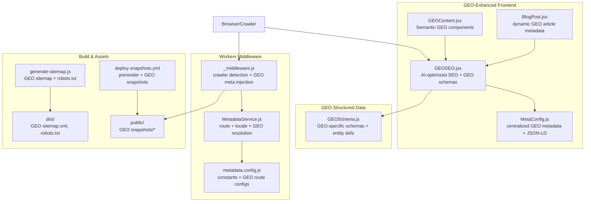
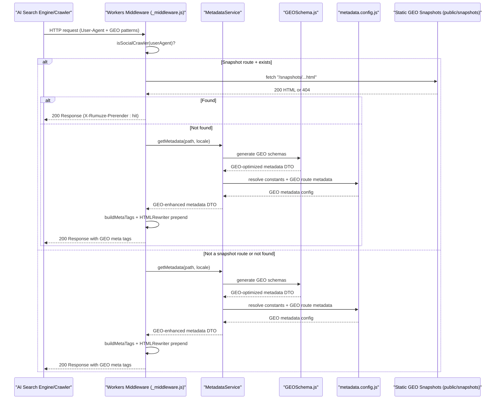
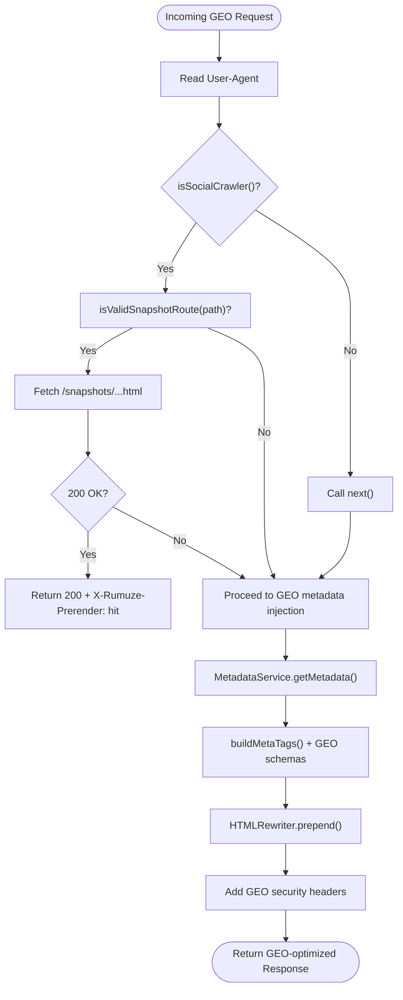
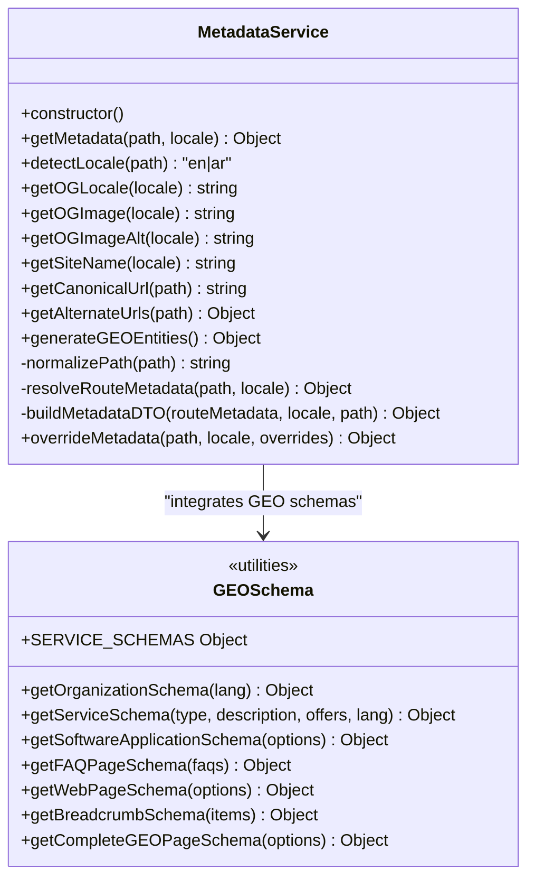
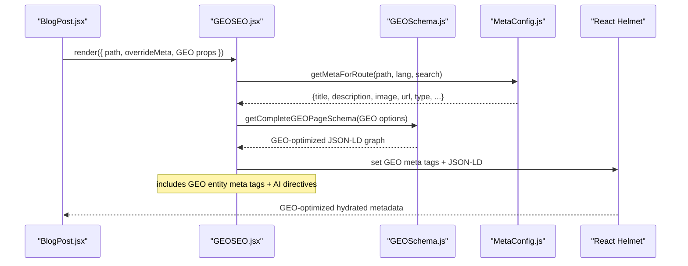
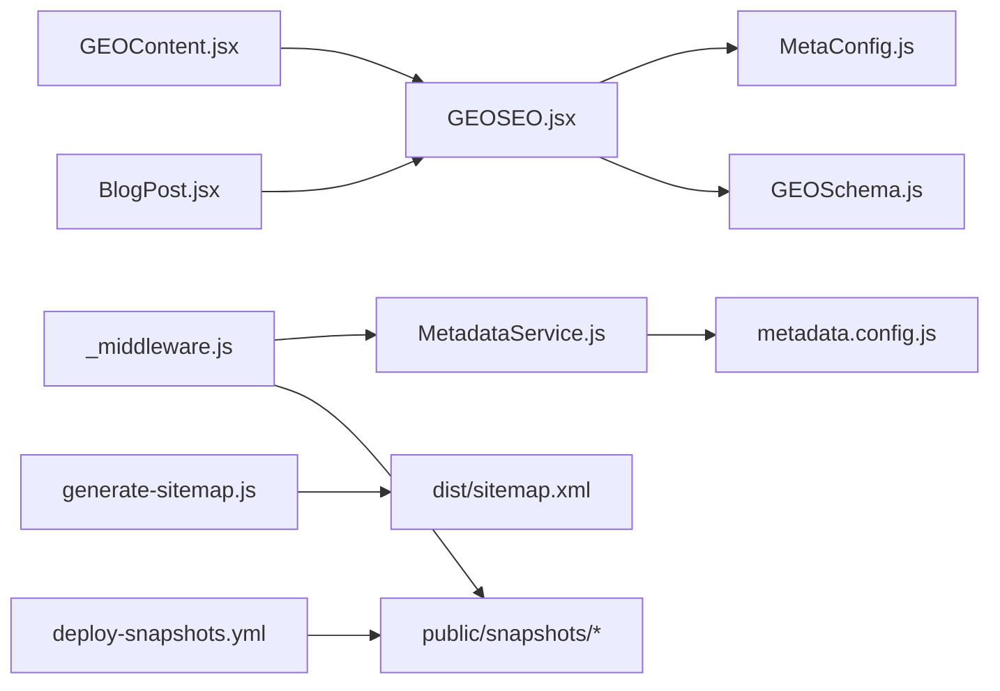

# SEO and Social Media Optimization

<cite>
**Referenced Files in This Document**
- [_middleware.js](file://functions/_middleware.js)
- [MetadataService.js](file://functions/services/MetadataService.js)
- [metadata.config.js](file://functions/config/metadata.config.js)
- [MetaConfig.js](file://src/utils/MetaConfig.js)
- [GEOSEO.jsx](file://src/components/GEOSEO.jsx)
- [GEOContent.jsx](file://src/components/GEOContent.jsx)
- [GEOSchema.js](file://src/utils/GEOSchema.js)
- [SEO.jsx](file://src/components/SEO.jsx)
- [useMetadata.js](file://src/hooks/useMetadata.js)
- [BlogPost.jsx](file://src/pages/BlogPost.jsx)
- [sitemap.xml (public)](file://public/sitemap.xml)
- [robots.txt (public)](file://public/robots.txt)
- [sitemap.xml (dist)](file://dist/sitemap.xml)
- [generate-sitemap.js](file://scripts/generate-sitemap.js)
- [deploy-snapshots.yml](file://.github/workflows/deploy-snapshots.yml)
- [wrangler.jsonc](file://wrangler.jsonc)
- [FACEBOOK_CRAWLER_FIX.md](file://docs/FACEBOOK_CRAWLER_FIX.md)
- [GEO_STRATEGY.md](file://docs/GEO_STRATEGY.md)
- [en.geo.json](file://src/locales/en.geo.json)
- [MetadataService.test.js](file://functions/services/MetadataService.test.js)
- [MetaConfig.test.js](file://src/utils/MetaConfig.test.js)
</cite>

## Update Summary
**Changes Made**
- Added comprehensive GEO (Generative Engine Optimization) implementation replacing traditional SEO with AI-optimized content architecture
- Integrated GEO-specific structured data schemas including Organization, Service, SoftwareApplication, and FAQPage schemas
- Added GEO-optimized content components with semantic markup for AI entity recognition
- Updated metadata service architecture to support GEO entity reinforcement and AI-focused metadata strategies
- Enhanced structured data implementation with GEO-specific properties and AI search engine directives

## Table of Contents
1. [Introduction](#introduction)
2. [Project Structure](#project-structure)
3. [Core Components](#core-components)
4. [Architecture Overview](#architecture-overview)
5. [Detailed Component Analysis](#detailed-component-analysis)
6. [Dependency Analysis](#dependency-analysis)
7. [Performance Considerations](#performance-considerations)
8. [Troubleshooting Guide](#troubleshooting-guide)
9. [Conclusion](#conclusion)
10. [Appendices](#appendices)

## Introduction
This document explains the comprehensive SEO and social media optimization system that has evolved to incorporate Generative Engine Optimization (GEO) principles. The system now combines traditional SEO with AI-optimized content architecture designed specifically for generative engines like ChatGPT, Google Gemini, and Perplexity AI. It covers:
- Cloudflare Workers middleware for crawler detection and snapshot serving
- Metadata service architecture with GEO entity reinforcement
- Dynamic meta tag generation with AI-focused structured data
- Comprehensive GEO-specific structured data implementation including Organization, Service, SoftwareApplication, and FAQPage schemas
- GEO-optimized content components with semantic markup for AI entity recognition
- Open Graph tags, Twitter Cards, and multilingual hreflang integration
- Practical configuration examples for GEO-optimized page types
- Crawler compatibility, performance impact, and monitoring strategies for AI search engines

## Project Structure
The SEO stack now spans four layers with GEO integration:
- Frontend React components with GEO-optimized metadata and structured data
- GEO-specific content components with semantic markup for AI recognition
- Cloudflare Workers middleware with GEO-aware metadata injection
- GEO-structured data utilities and entity definition schemas
- Build-time scripts and GitHub Actions for GEO optimization

**Diagram sources**
- [_middleware.js](file://functions/_middleware.js#L1-L383)
- [MetadataService.js](file://functions/services/MetadataService.js#L1-L380)
- [metadata.config.js](file://functions/config/metadata.config.js#L1-L369)
- [MetaConfig.js](file://src/utils/MetaConfig.js#L1-L530)
- [GEOSEO.jsx](file://src/components/GEOSEO.jsx#L1-L150)
- [GEOContent.jsx](file://src/components/GEOContent.jsx#L1-L374)
- [GEOSchema.js](file://src/utils/GEOSchema.js#L1-L375)
- [BlogPost.jsx](file://src/pages/BlogPost.jsx#L1-L132)
- [generate-sitemap.js](file://scripts/generate-sitemap.js#L1-L148)
- [deploy-snapshots.yml](file://.github/workflows/deploy-snapshots.yml#L1-L54)

**Section sources**
- [_middleware.js](file://functions/_middleware.js#L1-L383)
- [MetadataService.js](file://functions/services/MetadataService.js#L1-L380)
- [metadata.config.js](file://functions/config/metadata.config.js#L1-L369)
- [MetaConfig.js](file://src/utils/MetaConfig.js#L1-L530)
- [GEOSEO.jsx](file://src/components/GEOSEO.jsx#L1-L150)
- [GEOContent.jsx](file://src/components/GEOContent.jsx#L1-L374)
- [GEOSchema.js](file://src/utils/GEOSchema.js#L1-L375)
- [BlogPost.jsx](file://src/pages/BlogPost.jsx#L1-L132)
- [generate-sitemap.js](file://scripts/generate-sitemap.js#L1-L148)
- [deploy-snapshots.yml](file://.github/workflows/deploy-snapshots.yml#L1-L54)

## Core Components
- **GEO-Enhanced Cloudflare Workers middleware**: Detects social and search engine crawlers, normalizes responses, injects GEO-aware meta tags, and serves pre-rendered snapshots with AI-optimized content.
- **GEO Metadata Service**: Centralized resolver for locale detection, route matching, GEO entity reinforcement, and metadata DTO building with sanitization and GEO-specific schemas.
- **GEO-Optimized Frontend Components**: React-based components with GEO-specific metadata management, semantic markup for AI recognition, and GEO-structured data integration.
- **GEO Structured Data Utilities**: Comprehensive schema implementations for Organization, Service, SoftwareApplication, FAQPage, and WebPage schemas optimized for AI search engines.
- **GEO Content Components**: Pre-built components with proper semantic structure for displaying AI-optimized content with entity definition blocks, service categories, and authority page structures.
- **Build-time GEO Infrastructure**: Sitemap and robots.txt generation with GEO optimization, snapshot prerendering pipeline with GEO awareness, and deployment automation.

**Section sources**
- [_middleware.js](file://functions/_middleware.js#L68-L264)
- [MetadataService.js](file://functions/services/MetadataService.js#L44-L347)
- [metadata.config.js](file://functions/config/metadata.config.js#L119-L368)
- [MetaConfig.js](file://src/utils/MetaConfig.js#L19-L521)
- [GEOSEO.jsx](file://src/components/GEOSEO.jsx#L1-L150)
- [GEOContent.jsx](file://src/components/GEOContent.jsx#L1-L374)
- [GEOSchema.js](file://src/utils/GEOSchema.js#L1-L375)
- [generate-sitemap.js](file://scripts/generate-sitemap.js#L30-L147)

## Architecture Overview
The system now integrates serverless GEO-aware metadata injection with client-side GEO enhancements and automated asset generation optimized for AI search engines.

**Diagram sources**
- [_middleware.js](file://functions/_middleware.js#L76-L144)
- [MetadataService.js](file://functions/services/MetadataService.js#L70-L88)
- [metadata.config.js](file://functions/config/metadata.config.js#L119-L368)
- [GEOSchema.js](file://src/utils/GEOSchema.js#L264-L313)

## Detailed Component Analysis

### GEO-Enhanced Cloudflare Workers Middleware
- **GEO-aware crawler detection**: Uses curated list of crawler User-Agent patterns including AI search engines (ChatGPT, Google Gemini, Perplexity AI) alongside social media bots.
- **Response normalization**: Converts 206 Partial Content to 200 OK for crawlers to avoid parsing failures, with GEO-specific optimizations.
- **GEO meta tag injection**: Prepends Open Graph, Twitter, canonical, hreflang tags, and GEO-specific AI search engine directives at the start of head for fast crawler parsing.
- **GEO snapshot serving**: Attempts to serve pre-rendered HTML snapshots for supported routes, with GEO optimization for AI engines.
- **Security headers**: Adds CSP, HSTS, X-Frame-Options, and other hardening headers with GEO considerations.

**Diagram sources**
- [_middleware.js](file://functions/_middleware.js#L76-L263)

**Section sources**
- [_middleware.js](file://functions/_middleware.js#L42-L62)
- [_middleware.js](file://functions/_middleware.js#L94-L144)
- [_middleware.js](file://functions/_middleware.js#L150-L175)
- [_middleware.js](file://functions/_middleware.js#L177-L187)
- [_middleware.js](file://functions/_middleware.js#L226-L263)

### GEO Metadata Service Architecture
- **Strategy pattern**: Resolves route metadata via exact match or includes-match against route patterns with GEO entity reinforcement.
- **Factory pattern**: Builds a complete GEO-enhanced metadata DTO with defaults, locale mapping, image alt text, and GEO-specific schemas.
- **GEO entity integration**: Incorporates entity definition schemas, service schemas, and AI-focused metadata properties.
- **Helpers**: Canonical URL, alternate URLs (hreflang), locale mapping, sanitization, and GEO schema generation.
- **Singleton**: Reuses a single MetadataService instance per worker lifecycle with GEO awareness.

**Diagram sources**
- [MetadataService.js](file://functions/services/MetadataService.js#L44-L347)
- [metadata.config.js](file://functions/config/metadata.config.js#L39-L368)
- [GEOSchema.js](file://src/utils/GEOSchema.js#L1-L375)

**Section sources**
- [MetadataService.js](file://functions/services/MetadataService.js#L44-L347)
- [metadata.config.js](file://functions/config/metadata.config.js#L119-L368)
- [GEOSchema.js](file://src/utils/GEOSchema.js#L264-L313)

### GEO-Optimized Dynamic Meta Tag Generation and Structured Data
- **GEO frontend metadata**: Centralized GEO configuration with bilingual support, canonical URL normalization, and GEO-specific AI search engine directives.
- **GEO structured data**: Comprehensive JSON-LD graph including Organization, Service, SoftwareApplication, FAQPage, and WebPage schemas optimized for AI entity recognition.
- **Client-side GEO fallback**: Manual meta tag and GEO-structured data injection via DOM manipulation for robustness.
- **Entity reinforcement**: GEO-specific meta tags and AI search engine directives for enhanced AI recognition.

**Diagram sources**
- [BlogPost.jsx](file://src/pages/BlogPost.jsx#L31-L41)
- [GEOSEO.jsx](file://src/components/GEOSEO.jsx#L52-L68)
- [GEOSchema.js](file://src/utils/GEOSchema.js#L264-L313)
- [MetaConfig.js](file://src/utils/MetaConfig.js#L250-L521)

**Section sources**
- [MetaConfig.js](file://src/utils/MetaConfig.js#L19-L521)
- [GEOSEO.jsx](file://src/components/GEOSEO.jsx#L51-L144)
- [GEOSchema.js](file://src/utils/GEOSchema.js#L264-L313)
- [useMetadata.js](file://src/hooks/useMetadata.js#L43-L114)

### GEO-Optimized Content Components and Semantic Markup
- **Entity Definition Blocks**: Clear, AI-readable entity definitions with proper semantic structure for homepage and about pages.
- **Service Categories**: Four core service categories with proper semantic markup (Service schema) for AI entity recognition.
- **Technology Stack Display**: Structured technology expertise with semantic markup for AI extraction.
- **GEO-Optimized FAQ Section**: Structured FAQ content with FAQPage schema for AI extraction and knowledge graph optimization.
- **Authority Page Structure**: GEO-optimized content templates with definitional paragraphs, contextual authority sections, and entity reinforcement modules.

**Section sources**
- [GEOContent.jsx](file://src/components/GEOContent.jsx#L15-L374)
- [GEOSchema.js](file://src/utils/GEOSchema.js#L17-L91)
- [GEOSchema.js](file://src/utils/GEOSchema.js#L169-L199)
- [GEO_STRATEGY.md](file://docs/GEO_STRATEGY.md#L109-L132)

### GEO-Enhanced Open Graph, Twitter Cards, and Multilingual Support
- **GEO Open Graph**: Enhanced og:type, og:title, og:description, og:url, og:site_name, og:locale, og:image variants with GEO-specific entity meta tags.
- **GEO Twitter Cards**: summary_large_image with title, description, image, alt, site, and creator, plus GEO AI search engine directives.
- **GEO Hreflang**: Enhanced alternate links for en/ar/x-default with GEO optimization.
- **GEO Direction and lang attributes**: Applied to html element for RTL languages with GEO considerations.

**Section sources**
- [_middleware.js](file://functions/_middleware.js#L310-L382)
- [GEOSEO.jsx](file://src/components/GEOSEO.jsx#L70-L132)
- [GEOSEO.jsx](file://src/components/GEOSEO.jsx#L121-L132)

### GEO Snapshot Serving and Pre-rendering Pipeline
- **GEO snapshot routes**: Translates incoming paths to static GEO-optimized snapshot filenames and serves them when available.
- **GEO pre-rendering**: Puppeteer-based prerendering executed in CI to generate HTML snapshots with GEO optimization committed to public/snapshots.
- **GEO fallback**: If GEO snapshot not found, GEO metadata injection occurs in the worker with AI-optimized content.

**Section sources**
- [_middleware.js](file://functions/_middleware.js#L102-L144)
- [deploy-snapshots.yml](file://.github/workflows/deploy-snapshots.yml#L13-L53)

### GEO Sitemap, Robots, and Crawlability
- **GEO sitemap**: Generated with GEO-optimized hreflang pairs, priorities, and changefreq for all routes with GEO entity optimization.
- **GEO robots**: Allows GEO-aware crawlers and references GEO-optimized sitemap.
- **GEO deployment**: Workers asset binding configured to serve GEO-optimized dist directory.

**Section sources**
- [generate-sitemap.js](file://scripts/generate-sitemap.js#L30-L117)
- [dist/sitemap.xml](file://dist/sitemap.xml#L1-L149)
- [public/sitemap.xml](file://public/sitemap.xml#L1-L149)
- [public/robots.txt](file://public/robots.txt#L1-L15)
- [wrangler.jsonc](file://wrangler.jsonc#L1-L8)

## Dependency Analysis
The system now exhibits enhanced GEO-aware separation of concerns:
- Workers middleware depends on GEO MetadataService and metadata.config for GEO-aware metadata resolution and tag building.
- GEO frontend components depend on GEO-structured data utilities and centralized GEO metadata configuration.
- GEO content components integrate with GEO-structured data for AI entity recognition.
- Build scripts produce GEO-optimized sitemaps and robots.txt consumed by AI search engines and workers.
- GEO snapshot prerendering is decoupled via CI with GEO optimization and stored under public/snapshots.

**Diagram sources**
- [_middleware.js](file://functions/_middleware.js#L29-L151)
- [MetadataService.js](file://functions/services/MetadataService.js#L16-L53)
- [metadata.config.js](file://functions/config/metadata.config.js#L16-L29)
- [GEOSEO.jsx](file://src/components/GEOSEO.jsx#L12-L13)
- [GEOSchema.js](file://src/utils/GEOSchema.js#L1-L7)
- [GEOContent.jsx](file://src/components/GEOContent.jsx#L8-L9)
- [MetaConfig.js](file://src/utils/MetaConfig.js#L1-L14)
- [BlogPost.jsx](file://src/pages/BlogPost.jsx#L6-L15)
- [generate-sitemap.js](file://scripts/generate-sitemap.js#L23-L39)
- [deploy-snapshots.yml](file://.github/workflows/deploy-snapshots.yml#L34-L53)

**Section sources**
- [_middleware.js](file://functions/_middleware.js#L29-L151)
- [MetadataService.js](file://functions/services/MetadataService.js#L16-L53)
- [metadata.config.js](file://functions/config/metadata.config.js#L16-L29)
- [GEOSEO.jsx](file://src/components/GEOSEO.jsx#L12-L13)
- [GEOSchema.js](file://src/utils/GEOSchema.js#L1-L7)
- [GEOContent.jsx](file://src/components/GEOContent.jsx#L8-L9)
- [MetaConfig.js](file://src/utils/MetaConfig.js#L1-L14)
- [BlogPost.jsx](file://src/pages/BlogPost.jsx#L6-L15)
- [generate-sitemap.js](file://scripts/generate-sitemap.js#L23-L39)
- [deploy-snapshots.yml](file://.github/workflows/deploy-snapshots.yml#L34-L53)

## Performance Considerations
- **GEO crawler detection overhead**: Negligible cost via simple substring checks on User-Agent with GEO-specific patterns.
- **GEO response normalization**: Only applies when a 206 response is encountered; minimal extra latency with GEO optimizations.
- **GEO tag injection**: HTMLRewriter prepend is efficient; GEO tags are placed at the top of head for fast AI engine parsing.
- **GEO snapshot serving**: Avoids runtime GEO metadata computation and HTML rewriting for crawlers.
- **GEO structured data generation**: JSON-LD schema generation adds minimal overhead with GEO optimization benefits.
- **GEO image dimensions**: Explicit width/height improve Facebook image prioritization without extra computation.
- **GEO security headers**: Applied to all responses with GEO considerations; negligible overhead for HTML responses.

## Troubleshooting Guide
Common GEO-specific issues and resolutions:
- **AI search engine 206 error persists**
  - Verify GEO crawler detection is active and User-Agent contains GEO crawler patterns.
  - Confirm response normalization converts 206 to 200 for GEO crawlers.
  - Ensure GEO meta tags are prepended to head and appear within the first 1KB.
- **GEO tags not visible in AI search previews**
  - Check that GEO tags are prepended (not appended) and ordered correctly.
  - Use "Scrape Again" to refresh GEO caches.
  - Verify GEO entity meta tags and AI search engine directives are present.
- **GEO structured data validation fails**
  - Check that GEO schemas include all required properties for AI recognition.
  - Ensure GEO entity definitions are complete and consistent.
  - Validate GEO schema graph structure and @context declarations.
- **GEO content not appearing in AI responses**
  - Confirm GEO content components are properly implemented with semantic markup.
  - Verify GEO entity reinforcement modules are included.
  - Check that GEO FAQ sections use proper FAQPage schema.
- **GEO snapshot not served**
  - Confirm GEO snapshot filename matches expected pattern.
  - Ensure GEO prerender job ran and GEO snapshots were committed.
  - Verify GEO optimization settings in prerendering pipeline.

**Section sources**
- [FACEBOOK_CRAWLER_FIX.md](file://docs/FACEBOOK_CRAWLER_FIX.md#L1-L416)
- [_middleware.js](file://functions/_middleware.js#L94-L144)
- [_middleware.js](file://functions/_middleware.js#L226-L263)
- [metadata.config.js](file://functions/config/metadata.config.js#L294-L297)

## Conclusion
The GEO-optimized SEO and social media optimization system combines robust crawler detection, GEO-aware metadata injection, snapshot serving, and comprehensive structured data to maximize discoverability and rich previews across AI search engines and traditional platforms. The architecture balances serverless performance with GEO-specific optimizations, supports multilingual hreflang with GEO considerations, and provides strong testing and monitoring hooks for AI search engine effectiveness.

## Appendices

### GEO-Optimized Practical Examples: Configuring Metadata for Different Page Types
- **GEO Homepage**
  - Title/description: Use GEO entity definition with bilingual support.
  - Image: Use GEO-optimized OG image with cache-busting version.
  - GEO schema: Include Organization and WebPage schemas with GEO entity properties.
- **GEO Services Page**
  - Title/description: Use GEO service-specific metadata with entity reinforcement.
  - Type: service; include GEO Service schema with offers and categories.
  - GEO schema: Add GEO Service schema with proper serviceType and areaServed.
- **GEO About Page**
  - Title/description: Company-focused GEO entity definition with GEO-specific properties.
  - Locale: mapped to appropriate GEO locale with entity consistency.
  - GEO schema: Enhanced Organization schema with GEO entity properties.
- **GEO Blog Article**
  - Type: article; include GEO Article schema with author, publishedTime, modifiedTime.
  - Image: Use GEO-optimized post-specific image with GEO dimensions.
  - GEO schema: Comprehensive GEO Article schema with GEO entity references.
- **GEO Legal Pages**
  - Keywords and descriptions tailored to legal content with GEO optimization.
  - Canonical URLs without GEO-specific query parameters.

**Section sources**
- [metadata.config.js](file://functions/config/metadata.config.js#L119-L284)
- [MetadataService.js](file://functions/services/MetadataService.js#L275-L319)
- [MetaConfig.js](file://src/utils/MetaConfig.js#L19-L180)
- [GEOSchema.js](file://src/utils/GEOSchema.js#L264-L313)

### GEO Testing Social Media and AI Search Previews
- **AI Search Engine Testing**: Test GEO optimization with ChatGPT, Google Gemini, Perplexity AI, and Claude for entity recognition and knowledge graph presence.
- **Facebook Sharing Debugger**: Test GEO EN/AR home, services, and blog articles; verify 200 OK and presence of GEO og:title, GEO og:description, GEO og:image with correct dimensions.
- **WhatsApp preview**: Paste GEO URLs in chat to verify GEO preview card rendering with GEO entity reinforcement.
- **LinkedIn preview**: Post GEO URLs to LinkedIn to validate GEO preview with GEO structured data.
- **Browser inspection**: Confirm GEO meta tags appear first in head, GEO security headers are present, and GEO structured data is properly formatted.

**Section sources**
- [FACEBOOK_CRAWLER_FIX.md](file://docs/FACEBOOK_CRAWLER_FIX.md#L225-L279)

### GEO Monitoring SEO Effectiveness
- **AI Search Engine metrics**: Track GEO entity recognition, knowledge graph presence, and AI citation mentions.
- **Cloudflare Workers GEO metrics**: Track GEO response status, latency, and GEO prerender hits.
- **GEO sitemap submission**: Ensure GEO sitemaps are submitted to Google Search Console, Bing Webmaster Tools, and AI search engine platforms.
- **GEO robots.txt validation**: Confirm allowed GEO paths and GEO sitemap references.
- **GEO snapshot freshness**: Monitor GEO CI prerender job and GEO snapshot commits.
- **GEO success metrics**: Track GEO-specific KPIs including AI citation mentions, entity recognition accuracy, and featured snippet capture.

**Section sources**
- [deploy-snapshots.yml](file://.github/workflows/deploy-snapshots.yml#L1-L54)
- [dist/sitemap.xml](file://dist/sitemap.xml#L1-L149)
- [public/robots.txt](file://public/robots.txt#L1-L15)
- [GEO_STRATEGY.md](file://docs/GEO_STRATEGY.md#L730-L750)

### GEO Unit Tests Coverage
- **MetadataService GEO tests**: Locale detection, path normalization, GEO route resolution, DTO structure, canonical URL, alternate URLs, GEO schema generation, and override behavior.
- **MetaConfig GEO tests**: Canonical URL normalization, GEO query parameter handling, and GEO metadata validation.
- **GEOSchema GEO tests**: Organization schema generation, Service schema creation, FAQPage schema validation, and GEO schema graph composition.

**Section sources**
- [MetadataService.test.js](file://functions/services/MetadataService.test.js#L1-L370)
- [MetaConfig.test.js](file://src/utils/MetaConfig.test.js#L1-L54)
- [GEOSchema.js](file://src/utils/GEOSchema.js#L264-L313)

### GEO Strategy Implementation
- **Entity Definition Architecture**: Clear core entity statement with AI-readable properties for Rumuze as an enterprise software engineering company.
- **Website Architecture for GEO**: Semantic hierarchy with authority page structure optimized for AI search engines.
- **Content Templates**: AI-optimized content structure with definitional paragraphs, contextual authority sections, and entity reinforcement modules.
- **Success Metrics**: GEO-specific KPIs including AI citation mentions, knowledge graph presence, entity recognition accuracy, and featured snippet capture.

**Section sources**
- [GEO_STRATEGY.md](file://docs/GEO_STRATEGY.md#L9-L54)
- [GEO_STRATEGY.md](file://docs/GEO_STRATEGY.md#L58-L132)
- [GEO_STRATEGY.md](file://docs/GEO_STRATEGY.md#L135-L200)
- [GEO_STRATEGY.md](file://docs/GEO_STRATEGY.md#L730-L750)

### GEO Content Localization
- **GEO Localization Strategy**: Use GEO-specific locale files (en.geo.json) for AI-optimized content with entity definitions, service descriptions, and FAQ content.
- **Bilingual GEO Content**: Ensure GEO entity definitions, service descriptions, and FAQ content are available in both English and Arabic with GEO optimization.
- **GEO Content Consistency**: Maintain consistent GEO entity properties and service categorization across all locales for AI recognition.

**Section sources**
- [en.geo.json](file://src/locales/en.geo.json#L1-L247)
- [GEOContent.jsx](file://src/components/GEOContent.jsx#L15-L374)
- [GEOSchema.js](file://src/utils/GEOSchema.js#L17-L91)