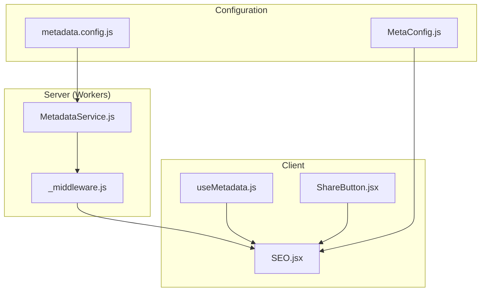
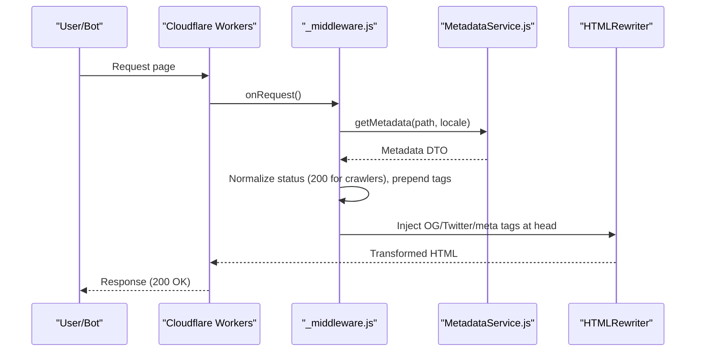
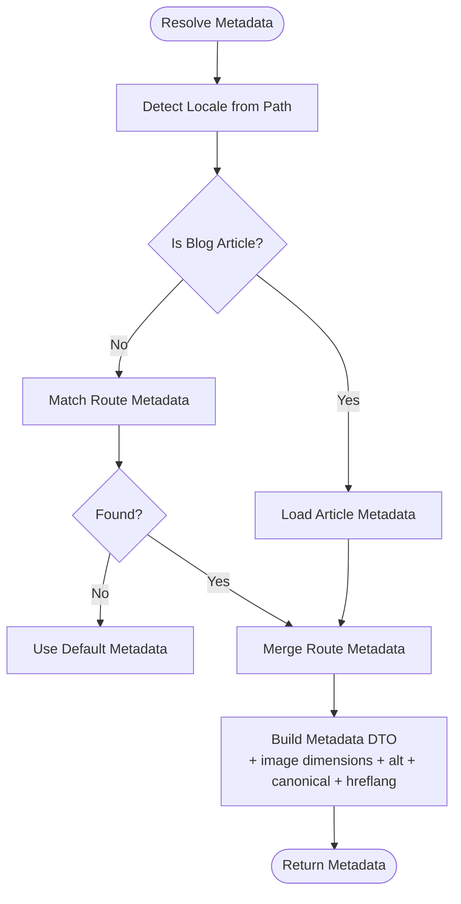
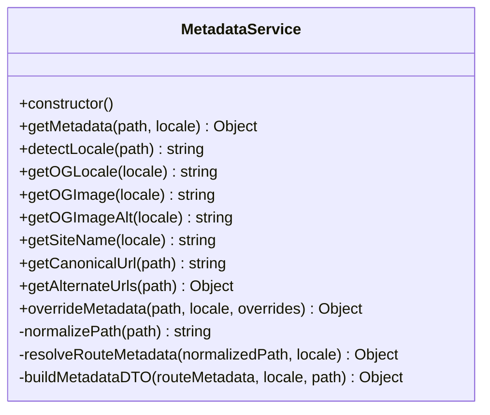
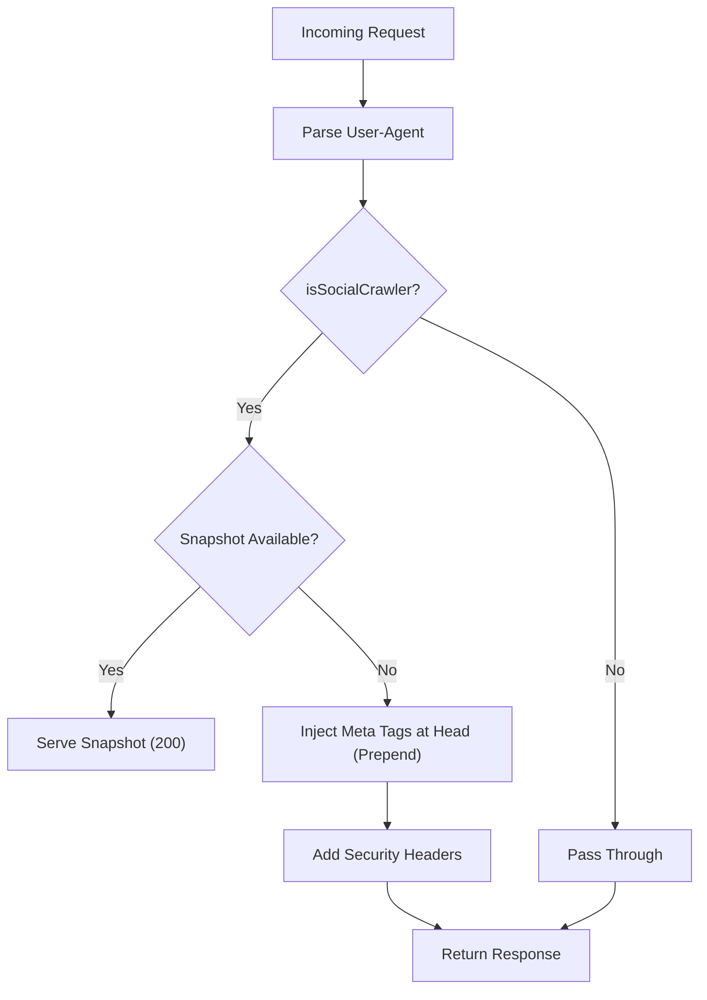
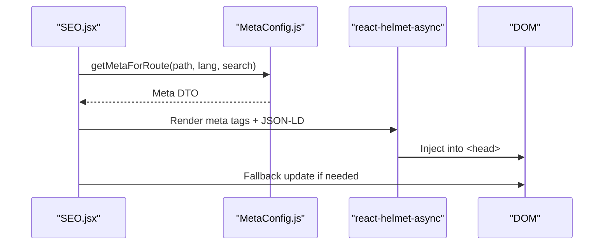
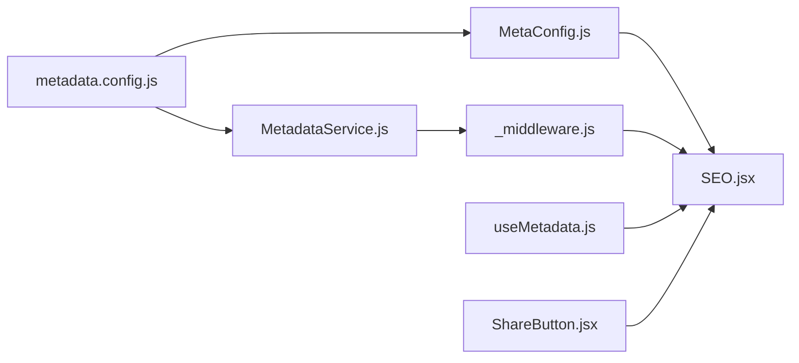
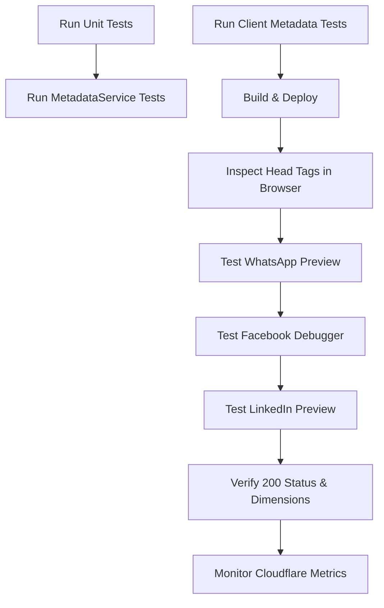

# Social Media Integration and Testing

<cite>
**Referenced Files in This Document**
- [MetadataService.js](file://functions/services/MetadataService.js)
- [MetadataService.test.js](file://functions/services/MetadataService.test.js)
- [metadata.config.js](file://functions/config/metadata.config.js)
- [_middleware.js](file://functions/_middleware.js)
- [MetaConfig.js](file://src/utils/MetaConfig.js)
- [MetaConfig.test.js](file://src/utils/MetaConfig.test.js)
- [SEO.jsx](file://src/components/SEO.jsx)
- [useMetadata.js](file://src/hooks/useMetadata.js)
- [ShareButton.jsx](file://src/components/ShareButton.jsx)
- [FACEBOOK_CRAWLER_FIX.md](file://docs/FACEBOOK_CRAWLER_FIX.md)
- [DEPLOYMENT.md](file://docs/DEPLOYMENT.md)
- [test_jsonld.js](file://scripts/test_jsonld.js)
</cite>

## Table of Contents
1. [Introduction](#introduction)
2. [Project Structure](#project-structure)
3. [Core Components](#core-components)
4. [Architecture Overview](#architecture-overview)
5. [Detailed Component Analysis](#detailed-component-analysis)
6. [Dependency Analysis](#dependency-analysis)
7. [Performance Considerations](#performance-considerations)
8. [Testing Procedures](#testing-procedures)
9. [Platform-Specific Optimizations](#platform-specific-optimizations)
10. [Troubleshooting Guide](#troubleshooting-guide)
11. [Conclusion](#conclusion)

## Introduction
This document explains the social media platform integrations and testing procedures implemented in the landing page project. It covers how Open Graph and Twitter Card metadata are generated and injected, how the system handles multilingual locales, and how Cloudflare Workers middleware ensures compatibility with major social media crawlers. It also documents testing procedures using official platform debuggers, preview generation techniques, performance validation, and maintenance practices to keep integrations robust across platform changes.

## Project Structure
The social media integration spans three layers:
- Configuration and business logic for metadata resolution
- Cloudflare Workers middleware for crawler-aware HTML rewriting and injection
- Client-side SEO component and hooks for runtime updates and JSON-LD

**Diagram sources**
- [metadata.config.js](file://functions/config/metadata.config.js#L1-L369)
- [MetaConfig.js](file://src/utils/MetaConfig.js#L1-L530)
- [_middleware.js](file://functions/_middleware.js#L1-L383)
- [MetadataService.js](file://functions/services/MetadataService.js#L1-L380)
- [SEO.jsx](file://src/components/SEO.jsx#L1-L278)
- [useMetadata.js](file://src/hooks/useMetadata.js#L1-L117)
- [ShareButton.jsx](file://src/components/ShareButton.jsx#L1-L106)

**Section sources**
- [metadata.config.js](file://functions/config/metadata.config.js#L1-L369)
- [_middleware.js](file://functions/_middleware.js#L1-L383)
- [MetaConfig.js](file://src/utils/MetaConfig.js#L1-L530)
- [SEO.jsx](file://src/components/SEO.jsx#L1-L278)
- [useMetadata.js](file://src/hooks/useMetadata.js#L1-L117)
- [ShareButton.jsx](file://src/components/ShareButton.jsx#L1-L106)

## Core Components
- Metadata configuration and routing: centralized definitions for base URL, site name, OG images, default and route-specific metadata, and helpers for blog articles.
- Metadata service: resolves locale, builds standardized metadata DTOs, and applies overrides safely.
- Cloudflare Workers middleware: detects crawlers, normalizes responses, injects meta tags at the top of head, and adds security headers.
- Client-side SEO component: renders meta tags, JSON-LD, and hreflang links; includes fallback logic for React/Helmet edge cases.
- Hooks and share utilities: expose helpers for dynamic image URLs and social sharing.

**Section sources**
- [metadata.config.js](file://functions/config/metadata.config.js#L1-L369)
- [MetadataService.js](file://functions/services/MetadataService.js#L1-L380)
- [_middleware.js](file://functions/_middleware.js#L1-L383)
- [SEO.jsx](file://src/components/SEO.jsx#L1-L278)
- [useMetadata.js](file://src/hooks/useMetadata.js#L1-L117)
- [ShareButton.jsx](file://src/components/ShareButton.jsx#L1-L106)

## Architecture Overview
The system integrates server-side and client-side responsibilities:
- Server-side: Workers middleware detects crawlers, ensures 200 responses, injects OG/Twitter tags at the top of head, and sets security headers.
- Client-side: SEO component renders meta tags, JSON-LD, and hreflang; hooks provide utilities for dynamic content.

**Diagram sources**
- [_middleware.js](file://functions/_middleware.js#L76-L264)
- [MetadataService.js](file://functions/services/MetadataService.js#L70-L88)

**Section sources**
- [_middleware.js](file://functions/_middleware.js#L1-L383)
- [MetadataService.js](file://functions/services/MetadataService.js#L1-L380)

## Detailed Component Analysis

### Metadata Configuration and Routing
- Centralizes base URL, site names, OG image URLs with cache-busting, default metadata, route-specific metadata, and blog article metadata.
- Provides locale mapping to Open Graph locales and helper functions for blog slugs and sanitization.

**Diagram sources**
- [metadata.config.js](file://functions/config/metadata.config.js#L119-L336)
- [MetadataService.js](file://functions/services/MetadataService.js#L275-L319)

**Section sources**
- [metadata.config.js](file://functions/config/metadata.config.js#L1-L369)
- [MetadataService.js](file://functions/services/MetadataService.js#L1-L380)

### Metadata Service
- Public API: getMetadata(path, locale?), detectLocale(path), getCanonicalUrl(path), getAlternateUrls(path), overrideMetadata(path, locale, overrides).
- Private helpers: normalizePath(path), resolveRouteMetadata(normalizedPath, locale), buildMetadataDTO(routeMetadata, locale, path).
- Enforces validation and sanitization; constructs complete DTO with image dimensions, locale, site name, canonical URL, alternate URLs, and optional article fields.

**Diagram sources**
- [MetadataService.js](file://functions/services/MetadataService.js#L44-L347)

**Section sources**
- [MetadataService.js](file://functions/services/MetadataService.js#L1-L380)

### Cloudflare Workers Middleware
- Detects social media crawlers by User-Agent patterns.
- Normalizes response status to 200 for crawlers when receiving 206 Partial Content.
- Prepends meta tags at the beginning of head to ensure crawlers parse OG/Twitter tags within the first KB.
- Adds comprehensive security headers.
- Optionally serves pre-rendered snapshots for crawler requests.

**Diagram sources**
- [_middleware.js](file://functions/_middleware.js#L76-L264)

**Section sources**
- [_middleware.js](file://functions/_middleware.js#L1-L383)

### Client-Side SEO Component
- Renders title, description, canonical, Open Graph, Twitter Card, hreflang, robots, and JSON-LD schemas.
- Includes a fallback mechanism to manually update meta tags and JSON-LD in case of async rendering issues.
- Uses localized metadata from configuration and supports dynamic overrides.

**Diagram sources**
- [SEO.jsx](file://src/components/SEO.jsx#L7-L274)
- [MetaConfig.js](file://src/utils/MetaConfig.js#L250-L295)

**Section sources**
- [SEO.jsx](file://src/components/SEO.jsx#L1-L278)
- [MetaConfig.js](file://src/utils/MetaConfig.js#L1-L530)

### Hooks and Share Utilities
- useMetadata hook provides helpers for absolute image URLs, default OG image selection, and current language/path introspection.
- ShareButton component offers native share fallback and platform-specific share links (LinkedIn, WhatsApp).

**Section sources**
- [useMetadata.js](file://src/hooks/useMetadata.js#L1-L117)
- [ShareButton.jsx](file://src/components/ShareButton.jsx#L1-L106)

## Dependency Analysis
- Configuration depends on constants and helper functions to produce route metadata and blog article metadata.
- MetadataService depends on configuration and helper functions to construct DTOs.
- Workers middleware depends on MetadataService and HTMLRewriter to inject tags and normalize responses.
- Client-side SEO depends on MetaConfig and react-helmet-async to render tags and JSON-LD.

**Diagram sources**
- [metadata.config.js](file://functions/config/metadata.config.js#L1-L369)
- [MetadataService.js](file://functions/services/MetadataService.js#L1-L380)
- [_middleware.js](file://functions/_middleware.js#L1-L383)
- [MetaConfig.js](file://src/utils/MetaConfig.js#L1-L530)
- [SEO.jsx](file://src/components/SEO.jsx#L1-L278)
- [useMetadata.js](file://src/hooks/useMetadata.js#L1-L117)
- [ShareButton.jsx](file://src/components/ShareButton.jsx#L1-L106)

**Section sources**
- [metadata.config.js](file://functions/config/metadata.config.js#L1-L369)
- [MetadataService.js](file://functions/services/MetadataService.js#L1-L380)
- [_middleware.js](file://functions/_middleware.js#L1-L383)
- [MetaConfig.js](file://src/utils/MetaConfig.js#L1-L530)
- [SEO.jsx](file://src/components/SEO.jsx#L1-L278)
- [useMetadata.js](file://src/hooks/useMetadata.js#L1-L117)
- [ShareButton.jsx](file://src/components/ShareButton.jsx#L1-L106)

## Performance Considerations
- Middleware latency is minimal (~5–10 ms), with crawler detection and response normalization adding negligible overhead.
- OG images are 1200x630 pixels with cache-busting to balance quality and freshness.
- Security headers are applied consistently to improve security posture without impacting social previews.
- Snapshot serving reduces HTML generation cost for crawlers when available.

[No sources needed since this section provides general guidance]

## Testing Procedures
- Unit tests validate locale detection, path normalization, metadata DTO completeness, canonical URL generation, alternate URLs, and metadata overrides.
- Integration tests validate canonical URL normalization and query parameter filtering in client-side metadata.
- Deployment guide outlines browser inspection, WhatsApp preview, Facebook Sharing Debugger, LinkedIn preview, cache busting, and monitoring.

**Diagram sources**
- [MetadataService.test.js](file://functions/services/MetadataService.test.js#L1-L370)
- [MetaConfig.test.js](file://src/utils/MetaConfig.test.js#L1-L54)
- [DEPLOYMENT.md](file://docs/DEPLOYMENT.md#L11-L226)

**Section sources**
- [MetadataService.test.js](file://functions/services/MetadataService.test.js#L1-L370)
- [MetaConfig.test.js](file://src/utils/MetaConfig.test.js#L1-L54)
- [DEPLOYMENT.md](file://docs/DEPLOYMENT.md#L1-L226)

## Platform-Specific Optimizations
- Facebook
  - Ensures 200 OK for crawlers, prepends OG tags at the top of head, and includes explicit image width/height for priority handling.
  - Uses www subdomain canonical URLs and absolute OG image URLs.
  - Verified via Facebook Sharing Debugger.

- WhatsApp
  - Uses 1200x630 OG image dimensions and absolute image URLs for consistent preview rendering.
  - Tested via WhatsApp link preview.

- LinkedIn
  - Injects Twitter Card tags for broad compatibility; tested via LinkedIn post preview.

- Twitter/X
  - Injects Twitter Card tags with site and creator handles; tested via Twitter previews.

- General best practices
  - Canonical URLs and hreflang alternate links for multilingual SEO.
  - Structured data (JSON-LD) for Knowledge Graph and breadcrumbs.

**Section sources**
- [FACEBOOK_CRAWLER_FIX.md](file://docs/FACEBOOK_CRAWLER_FIX.md#L1-L416)
- [_middleware.js](file://functions/_middleware.js#L42-L62)
- [SEO.jsx](file://src/components/SEO.jsx#L240-L261)
- [DEPLOYMENT.md](file://docs/DEPLOYMENT.md#L69-L89)

## Troubleshooting Guide
Common issues and resolutions:
- Facebook 206 Partial Content
  - Ensure crawler detection is active and response normalization forces 200 status for crawlers.
  - Confirm meta tags are prepended at the top of head.

- OG tags not visible in debugger
  - Verify tags appear first in head and “Scrape Again” in Facebook Debugger.

- Image not loading or wrong dimensions
  - Confirm absolute URLs and 1200x630 dimensions; update cache-busting version if images changed.

- Duplicate meta tags
  - Middleware removes existing tags before injection; confirm selectors and order.

- Arabic text rendering
  - Regenerate OG images with proper RTL rendering and fonts.

- Monitoring and verification
  - Use Cloudflare Worker metrics and logs to track crawler activity and response codes.

**Section sources**
- [FACEBOOK_CRAWLER_FIX.md](file://docs/FACEBOOK_CRAWLER_FIX.md#L336-L362)
- [_middleware.js](file://functions/_middleware.js#L246-L263)
- [DEPLOYMENT.md](file://docs/DEPLOYMENT.md#L147-L181)

## Conclusion
The project implements a robust, crawler-aware social media integration pipeline:
- Centralized metadata configuration and service layer
- Workers middleware optimized for Facebook, WhatsApp, LinkedIn, and Twitter/X
- Client-side SEO rendering with fallbacks and JSON-LD
- Comprehensive testing and deployment procedures with cache-busting and monitoring

This foundation enables consistent, high-quality previews across platforms while maintaining performance and reliability.