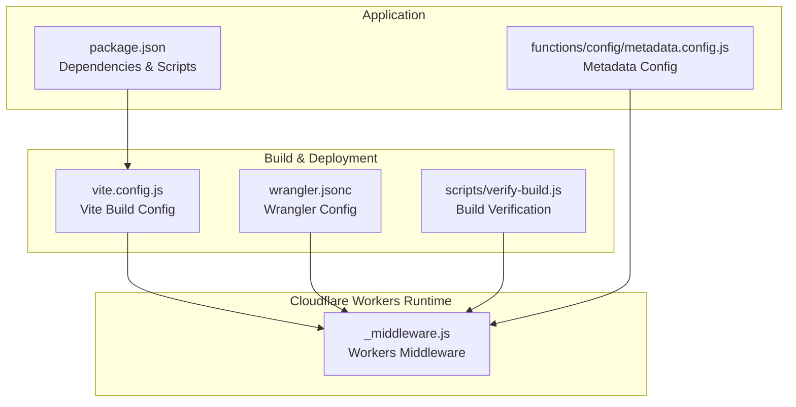
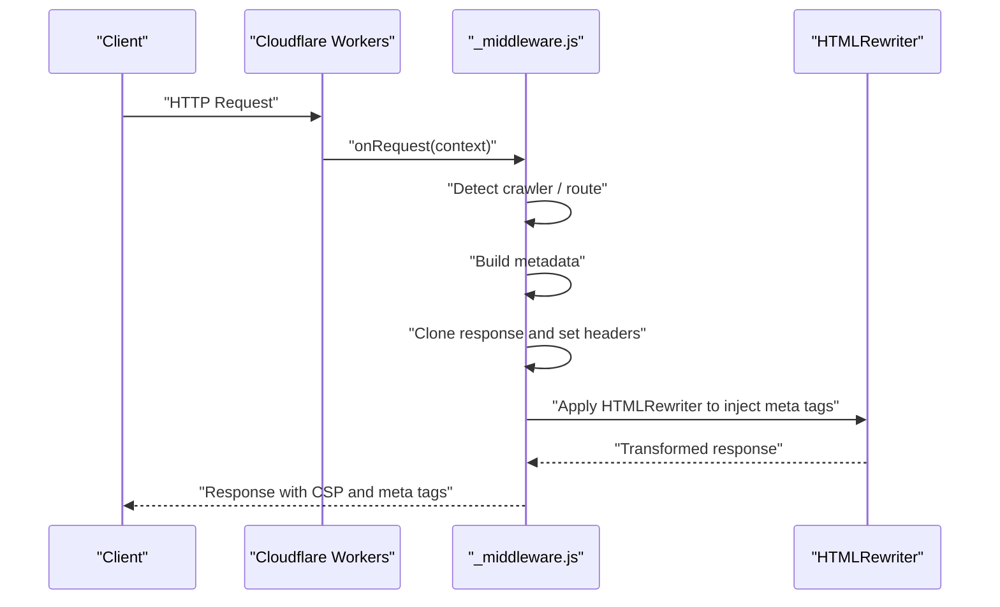
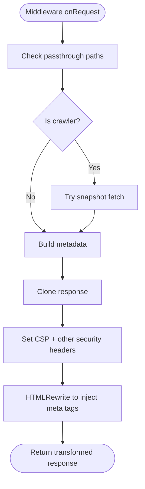
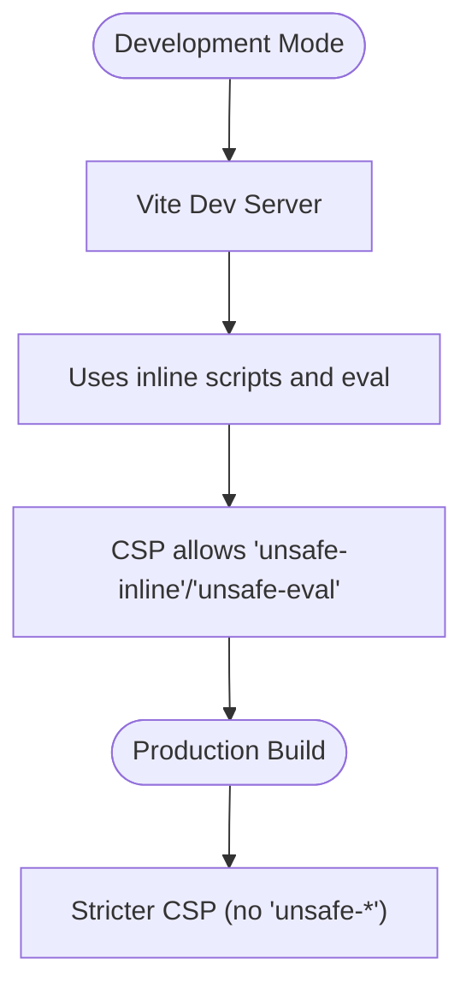
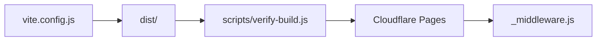
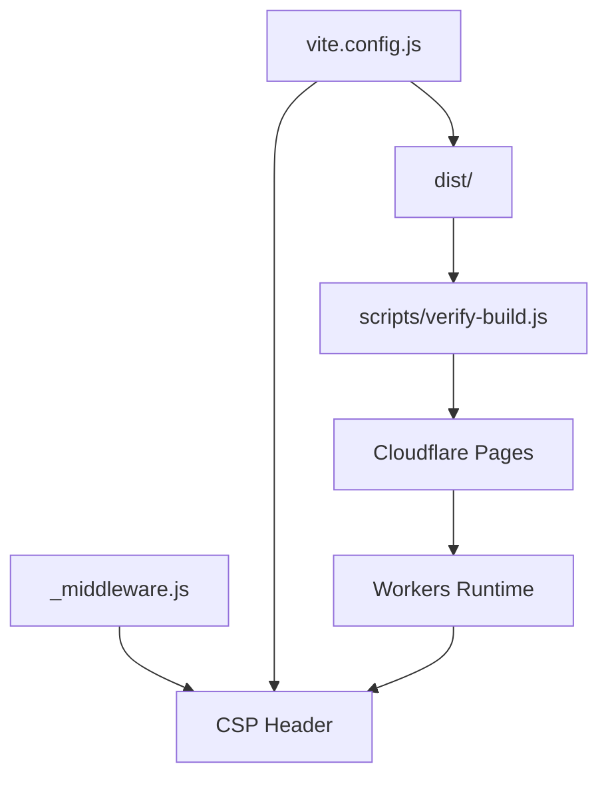

# Content Security Policy (CSP)

<cite>
**Referenced Files in This Document**
- [_middleware.js](file://functions/_middleware.js)
- [vite.config.js](file://vite.config.js)
- [wrangler.jsonc](file://wrangler.jsonc)
- [package.json](file://package.json)
- [metadata.config.js](file://functions/config/metadata.config.js)
- [verify-build.js](file://scripts/verify-build.js)
</cite>

## Table of Contents
1. [Introduction](#introduction)
2. [Project Structure](#project-structure)
3. [Core Components](#core-components)
4. [Architecture Overview](#architecture-overview)
5. [Detailed Component Analysis](#detailed-component-analysis)
6. [Dependency Analysis](#dependency-analysis)
7. [Performance Considerations](#performance-considerations)
8. [Troubleshooting Guide](#troubleshooting-guide)
9. [Conclusion](#conclusion)

## Introduction
This document explains the Content Security Policy (CSP) implementation in the Cloudflare Workers middleware for the landing page. It details the CSP header configuration, the rationale for allowing certain sources during development (such as Vite/React’s inline and eval), and the security trade-offs. It also covers how CSP violations are surfaced, how to test and debug CSP policies, and how to adjust rules across environments while maintaining a strong security posture.

## Project Structure
The CSP is applied centrally in the Cloudflare Workers middleware. Supporting configuration comes from Vite (development bundling and CSS inlining), Wrangler (deployment configuration), and the build verification script (ensuring a clean distribution for Cloudflare Pages).

**Diagram sources**
- [_middleware.js](file://functions/_middleware.js#L195-L225)
- [vite.config.js](file://vite.config.js#L204-L248)
- [wrangler.jsonc](file://wrangler.jsonc#L1-L8)
- [verify-build.js](file://scripts/verify-build.js#L1-L84)
- [metadata.config.js](file://functions/config/metadata.config.js#L1-L50)
- [package.json](file://package.json#L1-L49)

**Section sources**
- [_middleware.js](file://functions/_middleware.js#L195-L225)
- [vite.config.js](file://vite.config.js#L204-L248)
- [wrangler.jsonc](file://wrangler.jsonc#L1-L8)
- [verify-build.js](file://scripts/verify-build.js#L1-L84)
- [metadata.config.js](file://functions/config/metadata.config.js#L1-L50)
- [package.json](file://package.json#L1-L49)

## Core Components
- CSP header construction and injection in the Workers middleware
- Development-time allowances for Vite/React (inline scripts/styles and eval)
- Security headers complementing CSP
- Build pipeline supporting CSP-friendly outputs

Key CSP directive highlights:
- default-src: restricts default resource fetching
- script-src: allows self plus inline and eval for Vite/React dev
- style-src: allows self plus inline for critical CSS
- img-src: allows self, external CDN, data:, and blob:
- font-src: allows self and data:
- connect-src: allows self
- frame-ancestors: blocks framing
- base-uri: restricts base tag sources
- form-action: restricts form targets
- upgrade-insecure-requests: upgrades HTTP to HTTPS

Security headers included alongside CSP:
- Strict-Transport-Security
- X-Content-Type-Options
- X-Frame-Options
- X-XSS-Protection
- Referrer-Policy
- Permissions-Policy

**Section sources**
- [_middleware.js](file://functions/_middleware.js#L195-L225)

## Architecture Overview
The Workers middleware intercepts requests, prepares metadata for social crawlers, and injects security headers (including CSP) before returning the response. The CSP is built from a constant array and applied to every HTML response.

**Diagram sources**
- [_middleware.js](file://functions/_middleware.js#L76-L264)

## Detailed Component Analysis

### CSP Header Construction and Injection
- CSP is constructed as a single header string combining multiple directives.
- The header is applied to the response before HTML rewriting.
- The response is cloned to safely modify headers without side effects.

**Diagram sources**
- [_middleware.js](file://functions/_middleware.js#L76-L264)

**Section sources**
- [_middleware.js](file://functions/_middleware.js#L76-L264)

### Development-Time CSP Allowances (Vite/React)
- script-src includes 'unsafe-inline' and 'unsafe-eval' to support Vite’s development server HMR and React Fast Refresh.
- style-src includes 'unsafe-inline' to enable critical CSS inlining during development.
- These allowances are acceptable in development contexts because:
  - The app runs locally during dev, not in production.
  - The CSP is applied only by the Workers middleware, not by the Vite dev server itself.
  - Production builds should enforce stricter CSP rules.

**Diagram sources**
- [_middleware.js](file://functions/_middleware.js#L197-L208)
- [vite.config.js](file://vite.config.js#L250-L261)

**Section sources**
- [_middleware.js](file://functions/_middleware.js#L197-L208)
- [vite.config.js](file://vite.config.js#L250-L261)

### Security Headers Complementing CSP
The middleware sets additional security headers:
- Strict-Transport-Security: Enforces HTTPS
- X-Content-Type-Options: Prevents MIME sniffing
- X-Frame-Options: Mitigates clickjacking
- X-XSS-Protection: Enables XSS protection
- Referrer-Policy: Controls referrer leakage
- Permissions-Policy: Restricts powerful features

These headers provide defense-in-depth and complement CSP’s restrictions.

**Section sources**
- [_middleware.js](file://functions/_middleware.js#L219-L224)

### Build Pipeline and CSP-Friendly Outputs
- Vite build configuration:
  - CSS inlining for critical CSS in development.
  - Chunk splitting and asset naming optimized for caching.
  - Source maps disabled in production builds.
- Build verification script enforces a clean dist root to avoid routing conflicts on Cloudflare Pages.

**Diagram sources**
- [vite.config.js](file://vite.config.js#L204-L248)
- [verify-build.js](file://scripts/verify-build.js#L1-L84)
- [wrangler.jsonc](file://wrangler.jsonc#L1-L8)

**Section sources**
- [vite.config.js](file://vite.config.js#L204-L248)
- [verify-build.js](file://scripts/verify-build.js#L1-L84)
- [wrangler.jsonc](file://wrangler.jsonc#L1-L8)

## Dependency Analysis
- The CSP configuration depends on:
  - Middleware logic that constructs and applies the header
  - Vite configuration affecting how scripts and styles are bundled
  - Build verification ensuring the distribution aligns with Cloudflare Pages expectations
  - Wrangler configuration specifying the assets directory

**Diagram sources**
- [_middleware.js](file://functions/_middleware.js#L195-L225)
- [vite.config.js](file://vite.config.js#L204-L248)
- [verify-build.js](file://scripts/verify-build.js#L1-L84)
- [wrangler.jsonc](file://wrangler.jsonc#L1-L8)

**Section sources**
- [_middleware.js](file://functions/_middleware.js#L195-L225)
- [vite.config.js](file://vite.config.js#L204-L248)
- [verify-build.js](file://scripts/verify-build.js#L1-L84)
- [wrangler.jsonc](file://wrangler.jsonc#L1-L8)

## Performance Considerations
- CSP does not introduce runtime overhead; it is enforced by the browser.
- Keep CSP directives minimal to reduce fetches and improve caching.
- Prefer hashed or nonce-based script-src values in production for stricter policies.
- Ensure static assets are served efficiently to minimize CSP bypass attempts via external resources.

## Troubleshooting Guide

### How CSP Violations Are Reported
- Modern browsers report CSP violations to the console and can send violation reports to a configured endpoint.
- In development, CSP violations often appear in the browser console when using 'unsafe-inline' or 'unsafe-eval'.

### Testing Methods
- Browser Developer Tools:
  - Inspect the Network tab to confirm the Content-Security-Policy header is present.
  - Check the Console tab for CSP violation messages.
- Lighthouse:
  - Run audits to detect missing or weak security headers.
- Static Analysis:
  - Review CSP header composition in the middleware for unintended permissiveness.

### Debugging Techniques
- Temporarily tighten CSP in non-production environments to surface issues early.
- Use report-uri/report-to directives to collect violation reports without blocking content.
- Validate CSP after bundler changes (e.g., adding new libraries) to ensure allowed sources remain valid.

### Environment-Specific Adjustments
- Development:
  - Keep 'unsafe-inline' and 'unsafe-eval' for Vite/React HMR and fast refresh.
- Staging:
  - Narrow allowed sources; consider hashes/nonces for scripts/styles.
- Production:
  - Remove 'unsafe-*' directives; use strict hosts and hashes/nonces where applicable.
  - Ensure all external resources (CDNs, fonts, images) are explicitly allowed.

### Common Violations and Fixes
- Inline scripts blocked:
  - Move to external scripts or use a nonce/hash strategy.
- Eval usage blocked:
  - Avoid dynamic evaluation; refactor to safer alternatives.
- External fonts/images blocked:
  - Add appropriate hosts to font-src/img-src or use data: where applicable.

**Section sources**
- [_middleware.js](file://functions/_middleware.js#L197-L208)

## Conclusion
The CSP implementation in the Cloudflare Workers middleware establishes a strong baseline of security while accommodating development needs through targeted allowances for Vite/React. By combining CSP with complementary security headers, validating builds, and adopting environment-specific policies, the project maintains a robust security posture across development, staging, and production.