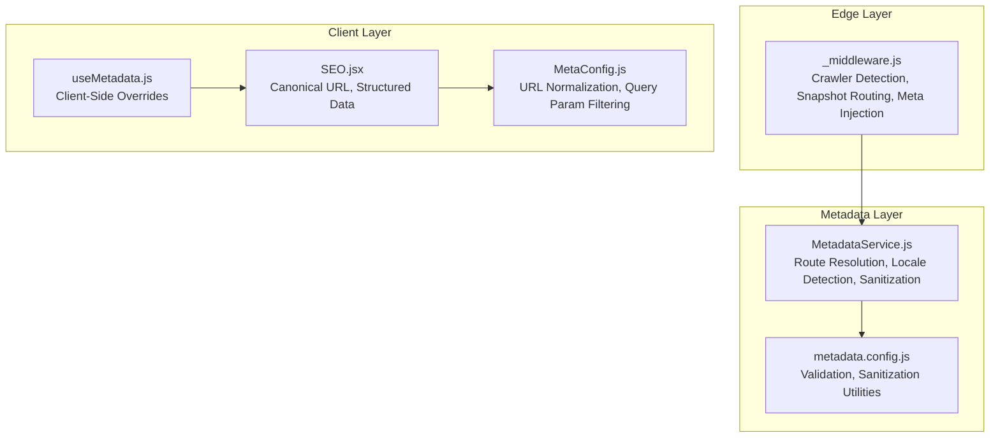
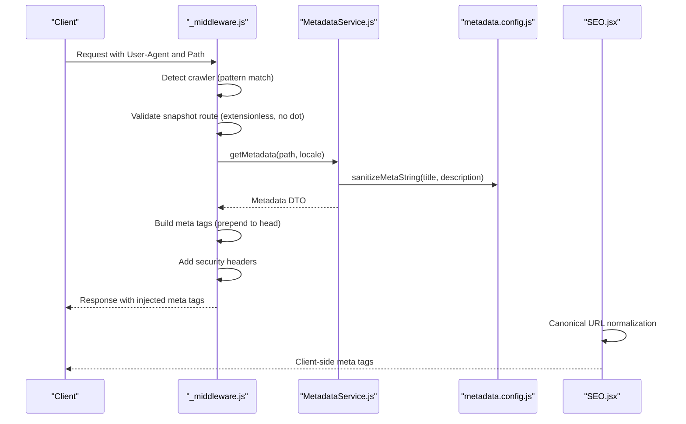
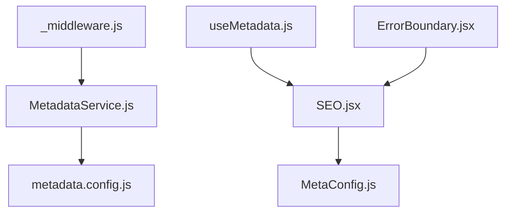

# Input Validation and Sanitization

<cite>
**Referenced Files in This Document**
- [_middleware.js](file://functions/_middleware.js)
- [MetadataService.js](file://functions/services/MetadataService.js)
- [metadata.config.js](file://functions/config/metadata.config.js)
- [MetaConfig.js](file://src/utils/MetaConfig.js)
- [SEO.jsx](file://src/components/SEO.jsx)
- [useMetadata.js](file://src/hooks/useMetadata.js)
- [MetadataService.test.js](file://functions/services/MetadataService.test.js)
- [MetaConfig.test.js](file://src/utils/MetaConfig.test.js)
- [ErrorBoundary.jsx](file://src/components/ErrorBoundary.jsx)
</cite>

## Table of Contents
1. [Introduction](#introduction)
2. [Project Structure](#project-structure)
3. [Core Components](#core-components)
4. [Architecture Overview](#architecture-overview)
5. [Detailed Component Analysis](#detailed-component-analysis)
6. [Dependency Analysis](#dependency-analysis)
7. [Performance Considerations](#performance-considerations)
8. [Troubleshooting Guide](#troubleshooting-guide)
9. [Conclusion](#conclusion)

## Introduction
This document provides comprehensive coverage of input validation and sanitization practices across the application. It focuses on:
- Crawler detection logic using regular expression-like patterns
- Path validation for snapshot routes
- Metadata extraction from URLs and locale detection
- Security measures against malicious user agents, path traversal, and injection attempts
- Examples of validated inputs, sanitization techniques used in metadata processing, and error handling for malformed requests
- Security implications of dynamic content generation and sanitization in meta tag construction

## Project Structure
The validation and sanitization logic spans three layers:
- Edge middleware for crawler detection, snapshot routing, and meta tag injection
- Metadata service for route resolution, locale detection, and sanitization
- Client-side SEO utilities for canonical URL normalization and structured data generation

**Diagram sources**
- [_middleware.js](file://functions/_middleware.js#L1-L383)
- [MetadataService.js](file://functions/services/MetadataService.js#L1-L380)
- [metadata.config.js](file://functions/config/metadata.config.js#L1-L369)
- [MetaConfig.js](file://src/utils/MetaConfig.js#L1-L530)
- [SEO.jsx](file://src/components/SEO.jsx#L1-L278)
- [useMetadata.js](file://src/hooks/useMetadata.js#L1-L117)

**Section sources**
- [_middleware.js](file://functions/_middleware.js#L1-L383)
- [MetadataService.js](file://functions/services/MetadataService.js#L1-L380)
- [metadata.config.js](file://functions/config/metadata.config.js#L1-L369)
- [MetaConfig.js](file://src/utils/MetaConfig.js#L1-L530)
- [SEO.jsx](file://src/components/SEO.jsx#L1-L278)
- [useMetadata.js](file://src/hooks/useMetadata.js#L1-L117)

## Core Components
- Crawler detection and snapshot routing: Validates user agent patterns and path structure before serving cached snapshots or injecting metadata.
- Metadata service: Resolves localized metadata, validates structure, and sanitizes strings for safe HTML insertion.
- URL normalization: Filters query parameters and strips trailing slashes for canonical URLs.
- Security headers: Enforces CSP, HSTS, and other headers to mitigate XSS and clickjacking.
- Error boundary: Provides graceful degradation and logging for unhandled exceptions.

**Section sources**
- [_middleware.js](file://functions/_middleware.js#L42-L62)
- [_middleware.js](file://functions/_middleware.js#L266-L288)
- [_middleware.js](file://functions/_middleware.js#L196-L225)
- [MetadataService.js](file://functions/services/MetadataService.js#L275-L319)
- [metadata.config.js](file://functions/config/metadata.config.js#L347-L368)
- [MetaConfig.js](file://src/utils/MetaConfig.js#L224-L240)
- [SEO.jsx](file://src/components/SEO.jsx#L1-L278)
- [ErrorBoundary.jsx](file://src/components/ErrorBoundary.jsx#L1-L57)

## Architecture Overview
The system integrates edge middleware with metadata services and client-side SEO utilities to ensure robust input validation and sanitization.

**Diagram sources**
- [_middleware.js](file://functions/_middleware.js#L76-L264)
- [MetadataService.js](file://functions/services/MetadataService.js#L70-L88)
- [metadata.config.js](file://functions/config/metadata.config.js#L357-L368)
- [SEO.jsx](file://src/components/SEO.jsx#L16-L44)

## Detailed Component Analysis

### Crawler Detection and Snapshot Routing
- User-Agent patterns: Maintains a curated list of known social media and search engine crawlers. Detection uses case-insensitive substring matching against the User-Agent header.
- Snapshot route validation: Ensures only extensionless paths are considered valid snapshot routes, with special handling for root and exclusion of PWA assets and snapshot paths themselves to prevent recursion.
- Response normalization: Forces 200 OK status for crawler responses to avoid 206 Partial Content errors that break OG tag parsing.

Security implications:
- Prevents malicious crawlers from exploiting range requests.
- Guards against infinite loops by excluding snapshot paths from snapshot fetching.

Examples of validated inputs:
- User-Agent strings containing known crawler identifiers.
- Paths that are extensionless and do not include file extensions.

**Section sources**
- [_middleware.js](file://functions/_middleware.js#L42-L62)
- [_middleware.js](file://functions/_middleware.js#L84-L92)
- [_middleware.js](file://functions/_middleware.js#L285-L288)
- [_middleware.js](file://functions/_middleware.js#L177-L187)

### Metadata Service and Sanitization
- Locale detection: Automatically detects locale from path prefixes and defaults to English.
- Route resolution: Normalizes paths, resolves route-specific metadata, and falls back to defaults.
- Sanitization: Applies HTML entity escaping to metadata strings to prevent XSS when injecting into meta tags.
- Validation: Ensures metadata objects have required fields before building the DTO.

Security implications:
- Sanitization prevents script injection in meta tags.
- Validation guards against malformed metadata.

Examples of validated inputs:
- Route paths with optional Arabic prefix and trailing slashes.
- Metadata objects with required fields and sanitized strings.

**Section sources**
- [MetadataService.js](file://functions/services/MetadataService.js#L100-L108)
- [MetadataService.js](file://functions/services/MetadataService.js#L213-L232)
- [MetadataService.js](file://functions/services/MetadataService.js#L275-L319)
- [metadata.config.js](file://functions/config/metadata.config.js#L347-L368)
- [MetadataService.test.js](file://functions/services/MetadataService.test.js#L26-L44)
- [MetadataService.test.js](file://functions/services/MetadataService.test.js#L94-L115)
- [MetadataService.test.js](file://functions/services/MetadataService.test.js#L174-L221)

### URL Normalization and Canonical Generation
- Canonical URL normalization: Strips trailing slashes and handles Arabic routes consistently.
- Query parameter filtering: Whitelists specific parameters (e.g., pagination) and removes others to keep canonical URLs stable.
- Client-side overrides: Provides helpers for absolute image URLs and default OG images.

Security implications:
- Prevents parameter pollution and ensures stable canonical URLs.
- Reduces attack surface by limiting accepted query parameters.

Examples of validated inputs:
- Paths with optional trailing slashes and Arabic prefixes.
- Query strings with allowed parameters only.

**Section sources**
- [MetaConfig.js](file://src/utils/MetaConfig.js#L206-L219)
- [MetaConfig.js](file://src/utils/MetaConfig.js#L225-L240)
- [MetaConfig.test.js](file://src/utils/MetaConfig.test.js#L7-L30)
- [MetaConfig.test.js](file://src/utils/MetaConfig.test.js#L32-L53)

### Security Headers and Injection Prevention
- Content Security Policy: Restricts script and style sources, frame ancestors, and image/font origins.
- Strict Transport Security: Enforces HTTPS.
- XSS protection: Sets X-XSS-Protection header.
- Meta tag injection: Uses HTMLRewriter to prepend meta tags to the head, ensuring they appear within the first 1KB for optimal crawler parsing.

Security implications:
- Mitigates XSS, clickjacking, and mixed-content risks.
- Ensures crawler compatibility by preventing 206 responses.

**Section sources**
- [_middleware.js](file://functions/_middleware.js#L196-L225)
- [_middleware.js](file://functions/_middleware.js#L228-L263)

### Client-Side SEO and Dynamic Content
- Client-side metadata management: Provides hooks for dynamic overrides and absolute URL generation.
- Structured data: Generates JSON-LD for Knowledge Graph integration with controlled schema composition.
- Error boundary: Catches and displays errors gracefully while logging details for debugging.

Security implications:
- Client-side sanitization complements server-side protections.
- Structured data generation avoids exposing sensitive information.

**Section sources**
- [SEO.jsx](file://src/components/SEO.jsx#L1-L278)
- [useMetadata.js](file://src/hooks/useMetadata.js#L1-L117)
- [ErrorBoundary.jsx](file://src/components/ErrorBoundary.jsx#L1-L57)

## Dependency Analysis
The following diagram illustrates dependencies among validation and sanitization components:

**Diagram sources**
- [_middleware.js](file://functions/_middleware.js#L29-L29)
- [MetadataService.js](file://functions/services/MetadataService.js#L16-L29)
- [metadata.config.js](file://functions/config/metadata.config.js#L1-L369)
- [SEO.jsx](file://src/components/SEO.jsx#L1-L6)
- [MetaConfig.js](file://src/utils/MetaConfig.js#L1-L530)
- [useMetadata.js](file://src/hooks/useMetadata.js#L1-L14)
- [ErrorBoundary.jsx](file://src/components/ErrorBoundary.jsx#L1-L57)

**Section sources**
- [_middleware.js](file://functions/_middleware.js#L1-L383)
- [MetadataService.js](file://functions/services/MetadataService.js#L1-L380)
- [metadata.config.js](file://functions/config/metadata.config.js#L1-L369)
- [MetaConfig.js](file://src/utils/MetaConfig.js#L1-L530)
- [SEO.jsx](file://src/components/SEO.jsx#L1-L278)
- [useMetadata.js](file://src/hooks/useMetadata.js#L1-L117)
- [ErrorBoundary.jsx](file://src/components/ErrorBoundary.jsx#L1-L57)

## Performance Considerations
- Crawler detection uses lightweight substring checks to minimize overhead.
- Snapshot routing short-circuits middleware for known asset paths to reduce processing.
- Metadata sanitization is applied once during DTO construction to avoid repeated transformations.
- Canonical URL normalization and query parameter filtering are performed efficiently using URL APIs.

## Troubleshooting Guide
Common issues and resolutions:
- Malformed User-Agent headers: The crawler detection is case-insensitive and substring-based, reducing false negatives. Verify patterns if crawlers are not detected.
- Snapshot fetch failures: The middleware catches and logs errors, then falls back to metadata injection. Check snapshot availability and origin consistency.
- Invalid metadata objects: The service validates metadata structure and falls back to defaults. Ensure required fields are present.
- Canonical URL mismatches: Confirm query parameter filtering and trailing slash handling align with expectations.
- Client-side errors: Use the error boundary to capture and log exceptions, then reload the page to recover.

**Section sources**
- [_middleware.js](file://functions/_middleware.js#L133-L143)
- [MetadataService.js](file://functions/services/MetadataService.js#L275-L280)
- [MetaConfig.js](file://src/utils/MetaConfig.js#L225-L240)
- [ErrorBoundary.jsx](file://src/components/ErrorBoundary.jsx#L14-L20)

## Conclusion
The application employs a layered approach to input validation and sanitization:
- Edge middleware validates user agents and paths, injects sanitized meta tags, and enforces security headers.
- The metadata service resolves and sanitizes content, ensuring safe HTML insertion.
- Client-side utilities normalize URLs and manage structured data with controlled overrides.
- Comprehensive error handling and testing provide resilience and confidence in production deployments.