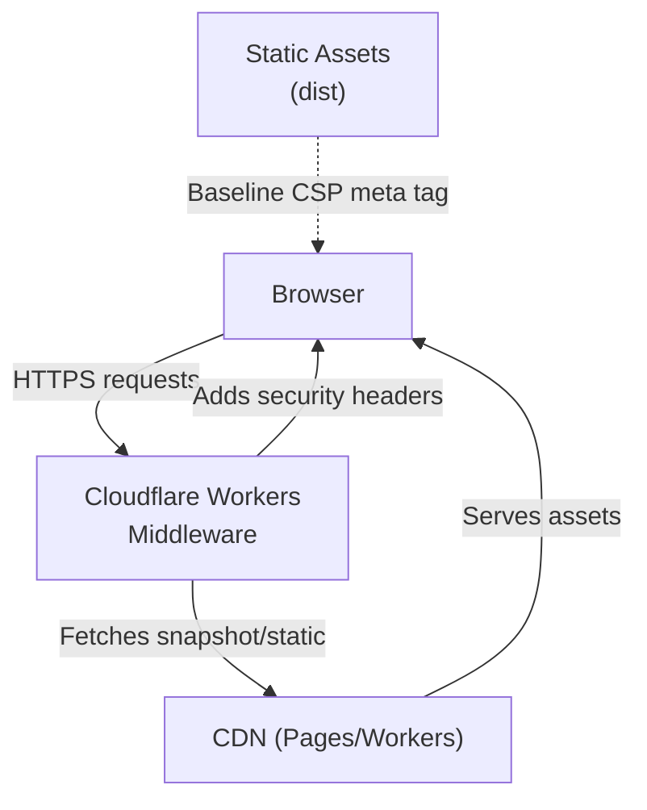
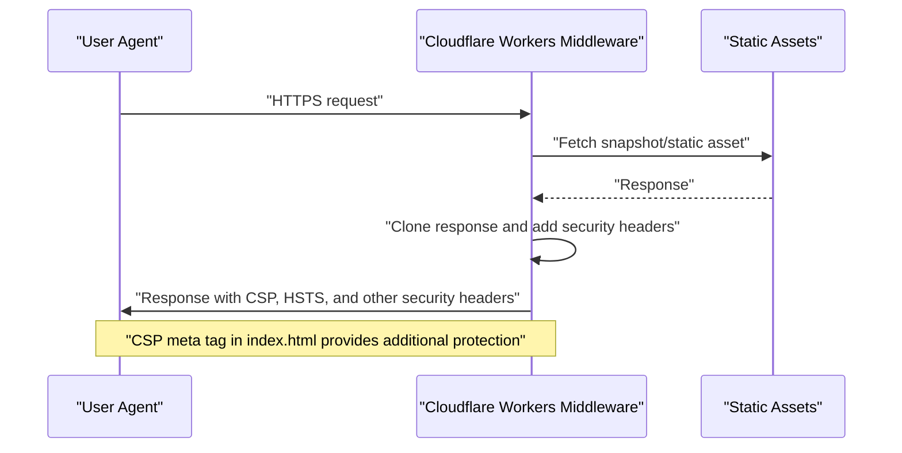
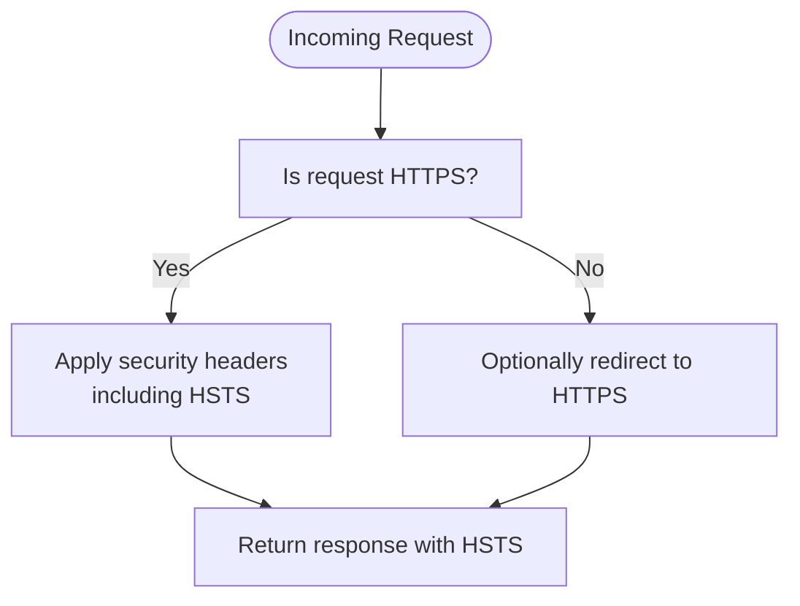
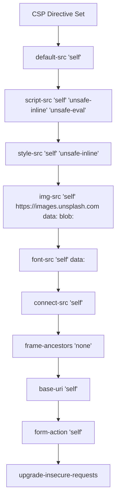
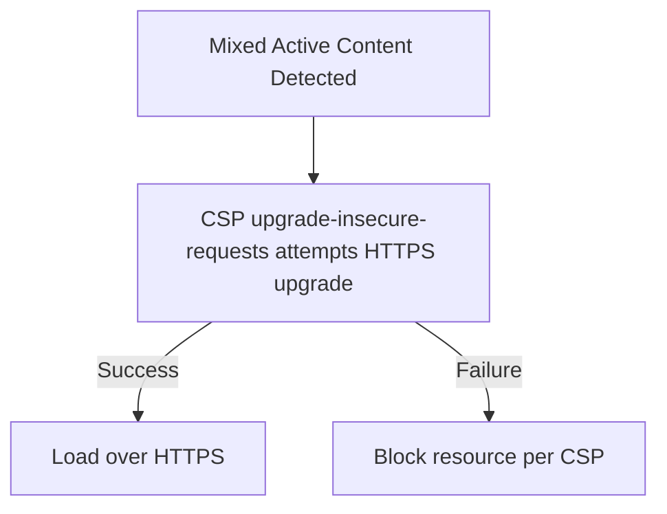
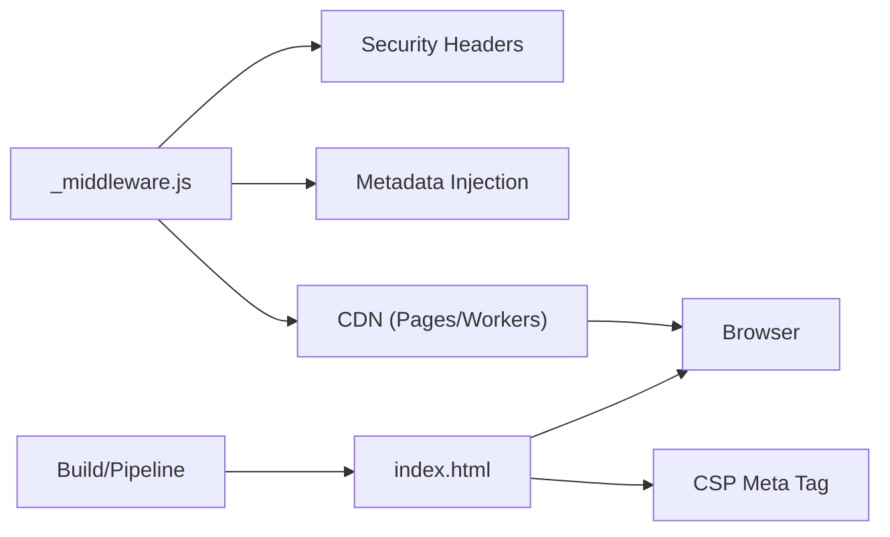

# Secure Communication Protocols

<cite>
**Referenced Files in This Document**
- [wrangler.jsonc](file://wrangler.jsonc)
- [_middleware.js](file://functions/_middleware.js)
- [index.html](file://index.html)
- [AUDIT_REPORT.md](file://docs/AUDIT_REPORT.md)
- [PROJECT_AUDIT_REPORT.md](file://docs/PROJECT_AUDIT_REPORT.md)
- [MetaConfig.js](file://src/utils/MetaConfig.js)
- [package.json](file://package.json)
</cite>

## Table of Contents
1. [Introduction](#introduction)
2. [Project Structure](#project-structure)
3. [Core Components](#core-components)
4. [Architecture Overview](#architecture-overview)
5. [Detailed Component Analysis](#detailed-component-analysis)
6. [Dependency Analysis](#dependency-analysis)
7. [Performance Considerations](#performance-considerations)
8. [Troubleshooting Guide](#troubleshooting-guide)
9. [Conclusion](#conclusion)

## Introduction
This document explains how the project enforces secure communication, focusing on HTTPS, Strict-Transport-Security (HSTS), secure resource loading, and the interaction between Content Security Policy (CSP) and HTTPS. It also covers upgrade-insecure-requests, mixed-content handling, and practical guidance for development versus production environments, along with debugging tips and the relationship between CSP and HTTPS.

## Project Structure
The secure communication stack spans three layers:
- Edge middleware (Cloudflare Workers) applies security headers and metadata for crawlers.
- Static HTML defines a baseline CSP meta tag.
- Build and deployment configuration targets a CDN-backed static site.

**Diagram sources**
- [_middleware.js](file://functions/_middleware.js#L196-L225)
- [index.html](file://index.html#L9-L10)
- [wrangler.jsonc](file://wrangler.jsonc#L4-L6)

**Section sources**
- [wrangler.jsonc](file://wrangler.jsonc#L1-L8)
- [_middleware.js](file://functions/_middleware.js#L1-L383)
- [index.html](file://index.html#L1-L87)

## Core Components
- Edge middleware security headers:
  - Content-Security-Policy (CSP) with upgrade-insecure-requests.
  - Strict-Transport-Security (HSTS) with includeSubDomains and preload.
  - X-Content-Type-Options, X-Frame-Options, X-XSS-Protection, Referrer-Policy, Permissions-Policy.
- Static HTML CSP meta tag for defense-in-depth.
- Canonical URLs and absolute OG image URLs consistently using HTTPS.

Key implementation references:
- CSP and HSTS headers applied in middleware.
- Baseline CSP meta tag in index.html.
- HTTPS canonical URLs and OG images in metadata configuration.

**Section sources**
- [_middleware.js](file://functions/_middleware.js#L196-L225)
- [index.html](file://index.html#L9-L10)
- [MetaConfig.js](file://src/utils/MetaConfig.js#L11-L35)

## Architecture Overview
The secure communication flow integrates CSP and HSTS at the edge and reinforces them with a static CSP meta tag. The middleware also injects crawler-friendly metadata and ensures canonical URLs use HTTPS.

**Diagram sources**
- [_middleware.js](file://functions/_middleware.js#L196-L225)
- [index.html](file://index.html#L9-L10)

## Detailed Component Analysis

### HTTPS Enforcement and HSTS
- HSTS is enforced via Strict-Transport-Security with max-age, includeSubDomains, and preload directives.
- This ensures browsers upgrade insecure requests and enforce HTTPS for the domain and subdomains.
- The header is set in the Cloudflare Workers middleware for all responses.

**Diagram sources**
- [_middleware.js](file://functions/_middleware.js#L218-L225)

**Section sources**
- [_middleware.js](file://functions/_middleware.js#L218-L225)
- [AUDIT_REPORT.md](file://docs/AUDIT_REPORT.md#L244-L254)

### Content Security Policy (CSP) and Secure Resource Loading
- The middleware constructs a robust CSP that:
  - Restricts default sources to self.
  - Allows images from self and a trusted CDN.
  - Uses 'unsafe-inline' and 'unsafe-eval' for development needs (React/Vite).
  - Enables upgrade-insecure-requests to automatically upgrade mixed active content.
- A baseline CSP meta tag is embedded in index.html for defense-in-depth.

**Diagram sources**
- [_middleware.js](file://functions/_middleware.js#L196-L208)
- [index.html](file://index.html#L9-L10)

**Section sources**
- [_middleware.js](file://functions/_middleware.js#L196-L208)
- [index.html](file://index.html#L9-L10)
- [AUDIT_REPORT.md](file://docs/AUDIT_REPORT.md#L210-L242)

### Mixed Content Handling
- The CSP directive upgrade-insecure-requests instructs the browser to attempt HTTPS upgrades for mixed active content.
- The metadata configuration ensures canonical URLs and OG images use HTTPS, reducing mixed content risk.

**Diagram sources**
- [_middleware.js](file://functions/_middleware.js#L207-L208)
- [MetaConfig.js](file://src/utils/MetaConfig.js#L20-L35)

**Section sources**
- [_middleware.js](file://functions/_middleware.js#L207-L208)
- [MetaConfig.js](file://src/utils/MetaConfig.js#L20-L35)

### Redirect Configurations and SPA Routing
- SPA fallback routing is configured via _redirects files to serve index.html for client-side routes.
- While these redirects are not inherently HTTPS enforcement, they work alongside HSTS and CSP to maintain secure delivery.

**Section sources**
- [dist/_redirects](file://dist/_redirects#L1-L3)
- [public/_redirects](file://public/_redirects#L1-L3)

### Relationship Between CSP and HTTPS
- HTTPS enables CSP directives like upgrade-insecure-requests to function effectively.
- Mixed content resources are blocked when CSP blocks non-secure origins; HTTPS reduces violations.
- The combination improves enforcement of secure resource loading and mitigates protocol downgrade attacks.

**Section sources**
- [_middleware.js](file://functions/_middleware.js#L196-L208)
- [AUDIT_REPORT.md](file://docs/AUDIT_REPORT.md#L210-L242)

### Development vs Production Guidance
- Development:
  - CSP relaxations (e.g., 'unsafe-inline', 'unsafe-eval') are acceptable during development.
  - Ensure HTTPS is available locally if testing HSTS behavior (e.g., using a local certificate).
- Production:
  - Keep HSTS with preload and includeSubDomains.
  - Maintain strict CSP and rely on upgrade-insecure-requests to handle legacy mixed content gracefully.
  - Verify canonical URLs and OG images use HTTPS.

**Section sources**
- [_middleware.js](file://functions/_middleware.js#L196-L208)
- [MetaConfig.js](file://src/utils/MetaConfig.js#L20-L35)

## Dependency Analysis
The secure communication stack depends on:
- Cloudflare Workers runtime for applying headers and metadata.
- Static assets served via CDN for performance and HTTPS delivery.
- Build pipeline that generates index.html with a baseline CSP meta tag.

**Diagram sources**
- [_middleware.js](file://functions/_middleware.js#L196-L225)
- [index.html](file://index.html#L9-L10)
- [wrangler.jsonc](file://wrangler.jsonc#L4-L6)

**Section sources**
- [package.json](file://package.json#L6-L14)
- [wrangler.jsonc](file://wrangler.jsonc#L1-L8)

## Performance Considerations
- HSTS reduces TLS handshake ambiguity and can improve perceived performance by avoiding unnecessary redirects.
- Preconnecting and preloading critical resources (fonts, images) in index.html reduce latency while maintaining HTTPS.
- Upgrade-insecure-requests minimizes mixed content failures, reducing retries and degraded experiences.

**Section sources**
- [index.html](file://index.html#L22-L30)
- [_middleware.js](file://functions/_middleware.js#L218-L225)

## Troubleshooting Guide
Common issues and resolutions:
- Mixed content warnings:
  - Ensure all resources (images, fonts, scripts) load over HTTPS.
  - Rely on CSP upgrade-insecure-requests to upgrade active content when possible.
- HSTS preload and includeSubDomains:
  - Confirm all subdomains support HTTPS before enabling preload.
  - Test with a staging environment using HTTPS certificates.
- CSP blocking resources:
  - Temporarily relax CSP for diagnostics; harden after identifying offending sources.
  - Verify canonical URLs and OG image URLs use HTTPS to avoid mixed content.
- Debugging secure connections:
  - Use browser devtools Network panel to inspect headers and CSP violations.
  - Validate certificate installation and chain completeness on CDN endpoints.

**Section sources**
- [_middleware.js](file://functions/_middleware.js#L196-L225)
- [MetaConfig.js](file://src/utils/MetaConfig.js#L320-L322)

## Conclusion
The project enforces secure communication through layered protections: HSTS at the edge, a robust CSP with upgrade-insecure-requests, and a baseline CSP meta tag in the HTML. Canonical URLs and HTTPS OG images further reduce mixed content risks. For production, keep HSTS with includeSubDomains and preload, maintain strict CSP, and ensure all subdomains support HTTPS. For development, leverage CSP relaxations while validating HTTPS behavior locally.