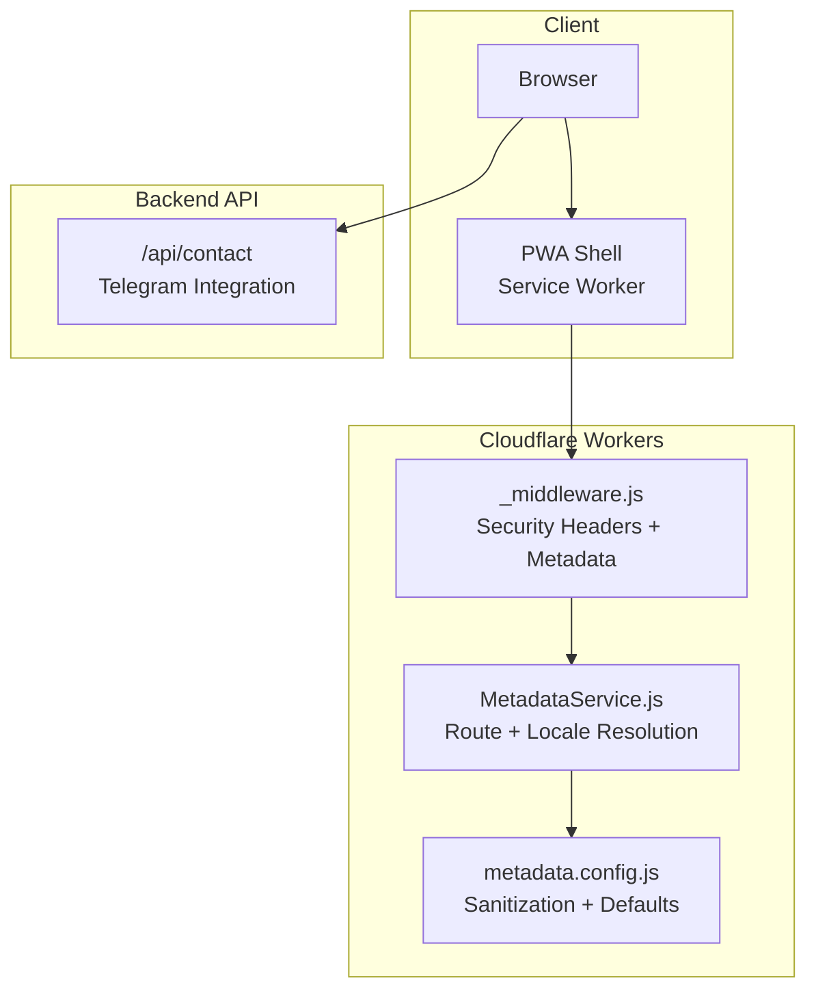
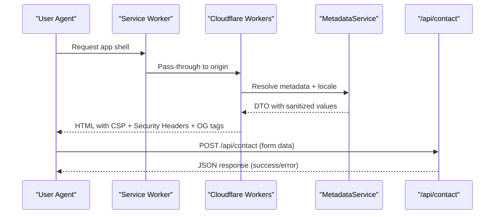
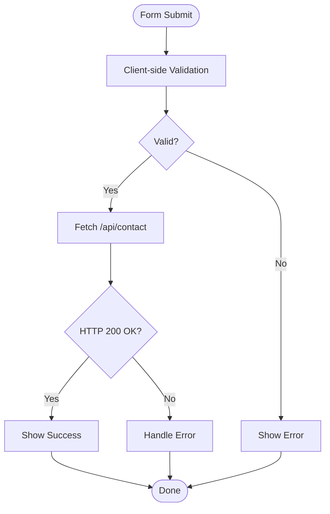
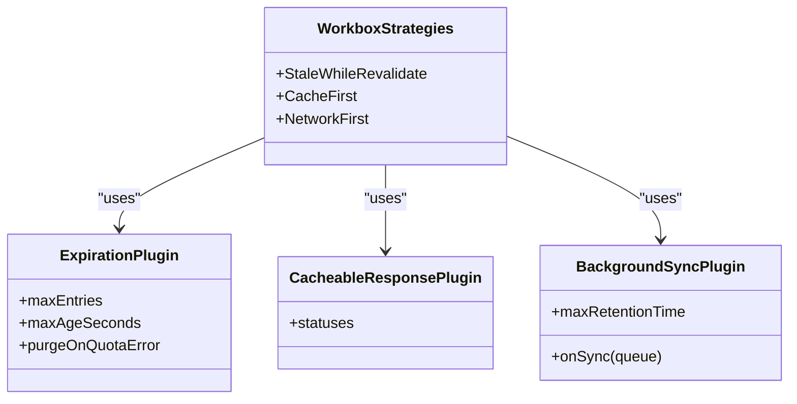
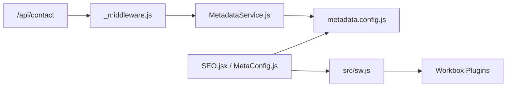

# Security Considerations

<cite>
**Referenced Files in This Document**
- [_middleware.js](file://functions/_middleware.js)
- [MetadataService.js](file://functions/services/MetadataService.js)
- [metadata.config.js](file://functions/config/metadata.config.js)
- [contact.js](file://functions/api/contact.js)
- [sw.js](file://src/sw.js)
- [sw.js](file://dist/sw.js)
- [index.html](file://dist/index.html)
- [vite.config.js](file://vite.config.js)
- [SEO.jsx](file://src/components/SEO.jsx)
- [MetaConfig.js](file://src/utils/MetaConfig.js)
- [Contact.jsx](file://src/components/Contact.jsx)
- [ContactPage.jsx](file://src/pages/ContactPage.jsx)
- [wrangler.jsonc](file://wrangler.jsonc)
</cite>

## Table of Contents
1. [Introduction](#introduction)
2. [Project Structure](#project-structure)
3. [Core Components](#core-components)
4. [Architecture Overview](#architecture-overview)
5. [Detailed Component Analysis](#detailed-component-analysis)
6. [Dependency Analysis](#dependency-analysis)
7. [Performance Considerations](#performance-considerations)
8. [Troubleshooting Guide](#troubleshooting-guide)
9. [Conclusion](#conclusion)
10. [Appendices](#appendices)

## Introduction
This document provides comprehensive security documentation for the landing page application. It focuses on security implementation and best practices across three pillars:
- Content Security Policy (CSP) configuration and header security measures
- Cross-site scripting (XSS) prevention strategies
- Service worker security implications, secure caching practices, and offline data handling

It also covers input validation and sanitization processes, secure communication patterns, practical examples for implementing security headers, protections against common vulnerabilities, incident monitoring approaches, privacy considerations, data protection measures, and compliance requirements.

## Project Structure
The application follows a modern frontend-first architecture with a Cloudflare Workers middleware layer responsible for injecting metadata and security headers, and a PWA built with Vite and Workbox for caching and offline behavior.

**Diagram sources**
- [_middleware.js](file://functions/_middleware.js#L76-L264)
- [MetadataService.js](file://functions/services/MetadataService.js#L44-L373)
- [metadata.config.js](file://functions/config/metadata.config.js#L362-L368)
- [contact.js](file://functions/api/contact.js#L1-L62)

**Section sources**
- [wrangler.jsonc](file://wrangler.jsonc#L1-L8)
- [vite.config.js](file://vite.config.js#L19-L202)

## Core Components
- Cloudflare Workers middleware: Applies CSP and other security headers, injects SEO metadata for crawlers, and serves snapshot-based pre-rendering for social media previews.
- Metadata service: Centralized, validated, and sanitized metadata resolution with locale-aware defaults and fallbacks.
- PWA service worker: Precaching, runtime caching strategies, offline fallbacks, background sync for forms, and periodic updates.
- Frontend components: Client-side validation and secure form submission to the backend API.

**Section sources**
- [_middleware.js](file://functions/_middleware.js#L196-L225)
- [MetadataService.js](file://functions/services/MetadataService.js#L275-L319)
- [metadata.config.js](file://functions/config/metadata.config.js#L347-L368)
- [sw.js](file://src/sw.js#L1-L227)
- [Contact.jsx](file://src/components/Contact.jsx#L33-L82)

## Architecture Overview
The security architecture integrates at two layers:
- Edge (Workers): Enforces strict CSP, HSTS, X-Content-Type-Options, X-Frame-Options, X-XSS-Protection, Referrer-Policy, Permissions-Policy, and crawler-friendly metadata injection.
- Client (PWA): Uses Workbox strategies to cache only trusted resources, enforce cache expiration, and provide offline fallbacks.

**Diagram sources**
- [_middleware.js](file://functions/_middleware.js#L76-L169)
- [MetadataService.js](file://functions/services/MetadataService.js#L70-L88)
- [contact.js](file://functions/api/contact.js#L1-L62)

## Detailed Component Analysis

### Content Security Policy (CSP) and Security Headers
- CSP directives include default-src 'self', script-src allowing 'unsafe-inline'/'unsafe-eval' for Vite/React dev-time needs, style-src allowing 'unsafe-inline' for critical CSS, img-src/font-src with trusted origins, connect-src 'self', frame-ancestors 'none', base-uri 'self', form-action 'self', and upgrade-insecure-requests.
- Additional headers enforced: Strict-Transport-Security (HSTS), X-Content-Type-Options (nosniff), X-Frame-Options (DENY), X-XSS-Protection (mode=block), Referrer-Policy (strict-origin-when-cross-origin), Permissions-Policy (camera/microphone/geo disabled).

These headers are applied consistently to HTML responses and ensure crawler compatibility by forcing 200 OK status when needed.

**Section sources**
- [_middleware.js](file://functions/_middleware.js#L196-L225)
- [_middleware.js](file://functions/_middleware.js#L177-L187)

### XSS Prevention Strategies
- Metadata sanitization: The metadata configuration exports a sanitizer that escapes HTML-sensitive characters in strings before insertion into meta tags.
- Client-side validation: The contact form validates presence of required fields and basic email format before submission.
- Secure injection: The middleware injects meta tags at the beginning of head to satisfy crawler parsing constraints and avoids appending content that could be misinterpreted.

**Diagram sources**
- [Contact.jsx](file://src/components/Contact.jsx#L33-L82)
- [contact.js](file://functions/api/contact.js#L1-L62)

**Section sources**
- [metadata.config.js](file://functions/config/metadata.config.js#L362-L368)
- [MetadataService.js](file://functions/services/MetadataService.js#L275-L319)
- [Contact.jsx](file://src/components/Contact.jsx#L33-L42)

### Service Worker Security Implications and Secure Caching
- Precaching: Critical assets are precached and guarded by revision checks; offline.html is included to guarantee fallback availability.
- Runtime strategies:
  - Stale-While-Revalidate for JS/CSS
  - Cache-First for images/fonts with size limits and quota handling
  - Network-First for API calls with timeouts
- Offline fallback: Comprehensive fallback for documents and images; a custom offline page is cached and served when offline.
- Background sync: POST submissions are queued and retried with a unique submission identifier to prevent duplicates.
- Periodic sync: Background updates for critical data (e.g., labs featured content).
- Push notifications: Registered and handled securely with notification click actions opening the app.

**Diagram sources**
- [sw.js](file://src/sw.js#L49-L116)
- [sw.js](file://src/sw.js#L118-L153)
- [sw.js](file://src/sw.js#L155-L182)

**Section sources**
- [sw.js](file://src/sw.js#L26-L46)
- [sw.js](file://src/sw.js#L49-L116)
- [sw.js](file://src/sw.js#L118-L153)
- [sw.js](file://src/sw.js#L155-L182)
- [sw.js](file://src/sw.js#L183-L203)
- [vite.config.js](file://vite.config.js#L192-L201)

### Offline Data Handling
- The service worker caches offline.html and serves it when navigation fails.
- For images, a minimal SVG placeholder is returned to avoid broken visuals.
- IndexedDB-backed cache expiration and timestamp management ensure stale entries are pruned.

**Section sources**
- [sw.js](file://src/sw.js#L155-L182)
- [sw.js](file://src/sw.js#L164-L174)

### Input Validation and Sanitization Processes
- Server-side metadata: All metadata DTOs are validated and sanitized before rendering into HTML.
- Client-side form validation: Required fields and email format are checked prior to submission.
- API response handling: Errors are surfaced safely without exposing internal details.

**Section sources**
- [MetadataService.js](file://functions/services/MetadataService.js#L275-L319)
- [metadata.config.js](file://functions/config/metadata.config.js#L347-L368)
- [Contact.jsx](file://src/components/Contact.jsx#L33-L42)
- [contact.js](file://functions/api/contact.js#L52-L61)

### Secure Communication Patterns
- All OG image and resource URLs are HTTPS and absolute to prevent mixed content and downgrade attacks.
- HSTS header ensures encrypted connections.
- CSP upgrade-insecure-requests directive encourages modern transport security.

**Section sources**
- [_middleware.js](file://functions/_middleware.js#L196-L208)
- [_middleware.js](file://functions/_middleware.js#L159-L166)

### Practical Examples
- Implementing security headers in middleware:
  - Apply CSP, HSTS, X-Content-Type-Options, X-Frame-Options, X-XSS-Protection, Referrer-Policy, Permissions-Policy.
  - Ensure crawler compatibility by forcing 200 OK for partial content responses.
- Protecting against common vulnerabilities:
  - Use CSP with least-privilege script-src and style-src.
  - Sanitize all dynamic metadata before injection.
  - Validate and sanitize form inputs on both client and server.
- Monitoring security incidents:
  - Log CSP violations via reporting endpoints (configure report-uri/report-to in CSP).
  - Monitor Cloudflare Workers logs for unusual patterns and blocked requests.
  - Track background sync failures and retries for contact submissions.

**Section sources**
- [_middleware.js](file://functions/_middleware.js#L196-L225)
- [_middleware.js](file://functions/_middleware.js#L177-L187)
- [metadata.config.js](file://functions/config/metadata.config.js#L362-L368)
- [contact.js](file://functions/api/contact.js#L52-L61)

### Privacy Considerations and Compliance
- Data minimization: The contact form collects only essential fields; no sensitive data is stored by default.
- Consent and transparency: Include a privacy policy page and link to it from the footer.
- Cookie handling: Avoid third-party cookies; if analytics are used, ensure compliance with privacy regulations.
- Data retention: Configure background sync and cache expiration policies to limit data persistence.

Note: The repository includes a privacy page configuration in the metadata system, indicating awareness of privacy requirements.

**Section sources**
- [MetaConfig.js](file://src/utils/MetaConfig.js#L132-L147)
- [SEO.jsx](file://src/components/SEO.jsx#L234-L238)

## Dependency Analysis
The security posture depends on several interdependent components:
- Workers middleware depends on MetadataService and configuration for accurate, sanitized metadata injection.
- PWA relies on Workbox plugins for secure caching and offline behavior.
- Frontend components depend on centralized metadata utilities and client-side validation.

**Diagram sources**
- [_middleware.js](file://functions/_middleware.js#L29-L30)
- [MetadataService.js](file://functions/services/MetadataService.js#L16-L29)
- [metadata.config.js](file://functions/config/metadata.config.js#L362-L368)
- [SEO.jsx](file://src/components/SEO.jsx#L5-L5)
- [MetaConfig.js](file://src/utils/MetaConfig.js#L1-L14)

**Section sources**
- [_middleware.js](file://functions/_middleware.js#L29-L30)
- [MetadataService.js](file://functions/services/MetadataService.js#L16-L29)
- [SEO.jsx](file://src/components/SEO.jsx#L5-L5)
- [MetaConfig.js](file://src/utils/MetaConfig.js#L1-L14)

## Performance Considerations
- CSP with 'unsafe-inline'/'unsafe-eval' is acceptable for development builds; consider moving to hashed nonces/nonces for production CSP.
- Precaching strict file size limits and cache expiration reduce memory pressure and improve reliability.
- Network-first strategies for APIs balance freshness and resilience.

[No sources needed since this section provides general guidance]

## Troubleshooting Guide
Common issues and resolutions:
- CSP violations: Review CSP header composition and adjust directives for production.
- Mixed content warnings: Ensure all resources are HTTPS.
- Background sync failures: Verify queue handling and unique submission IDs.
- Offline fallback not working: Confirm offline.html is precached and cache keys are correct.

**Section sources**
- [_middleware.js](file://functions/_middleware.js#L196-L225)
- [sw.js](file://src/sw.js#L118-L153)
- [sw.js](file://src/sw.js#L155-L182)

## Conclusion
The application implements a robust security model combining edge-level CSP and headers, centralized metadata sanitization, secure PWA caching, and client-side validation. By maintaining strict CSP policies, validating and sanitizing inputs, and leveraging Workbox’s secure caching patterns, the system mitigates common web vulnerabilities while preserving a smooth user experience and offline capability.

[No sources needed since this section summarizes without analyzing specific files]

## Appendices

### Appendix A: CSP Header Composition
- default-src 'self'
- script-src 'self' 'unsafe-inline' 'unsafe-eval'
- style-src 'self' 'unsafe-inline'
- img-src 'self' https://images.unsplash.com data: blob:
- font-src 'self' data:
- connect-src 'self'
- frame-ancestors 'none'
- base-uri 'self'
- form-action 'self'
- upgrade-insecure-requests

**Section sources**
- [_middleware.js](file://functions/_middleware.js#L196-L208)

### Appendix B: Security Headers Applied
- Strict-Transport-Security: max-age=31536000; includeSubDomains; preload
- X-Content-Type-Options: nosniff
- X-Frame-Options: DENY
- X-XSS-Protection: 1; mode=block
- Referrer-Policy: strict-origin-when-cross-origin
- Permissions-Policy: geolocation=(), microphone=(), camera=()

**Section sources**
- [_middleware.js](file://functions/_middleware.js#L219-L224)

### Appendix C: PWA Caching Policies
- Static resources: Stale-While-Revalidate with expiration
- Images: Cache-First with size limits and quota handling
- Fonts: Cache-First with long TTL
- API: Network-First with timeout and expiration
- Offline fallback: Document and image placeholders

**Section sources**
- [sw.js](file://src/sw.js#L49-L116)
- [sw.js](file://src/sw.js#L155-L182)
- [vite.config.js](file://vite.config.js#L192-L201)

### Appendix D: Client-Side Validation Checklist
- Required fields: name, email, message
- Email format validation
- Clear error feedback and real-time validation
- Disable submit button during loading

**Section sources**
- [Contact.jsx](file://src/components/Contact.jsx#L33-L42)