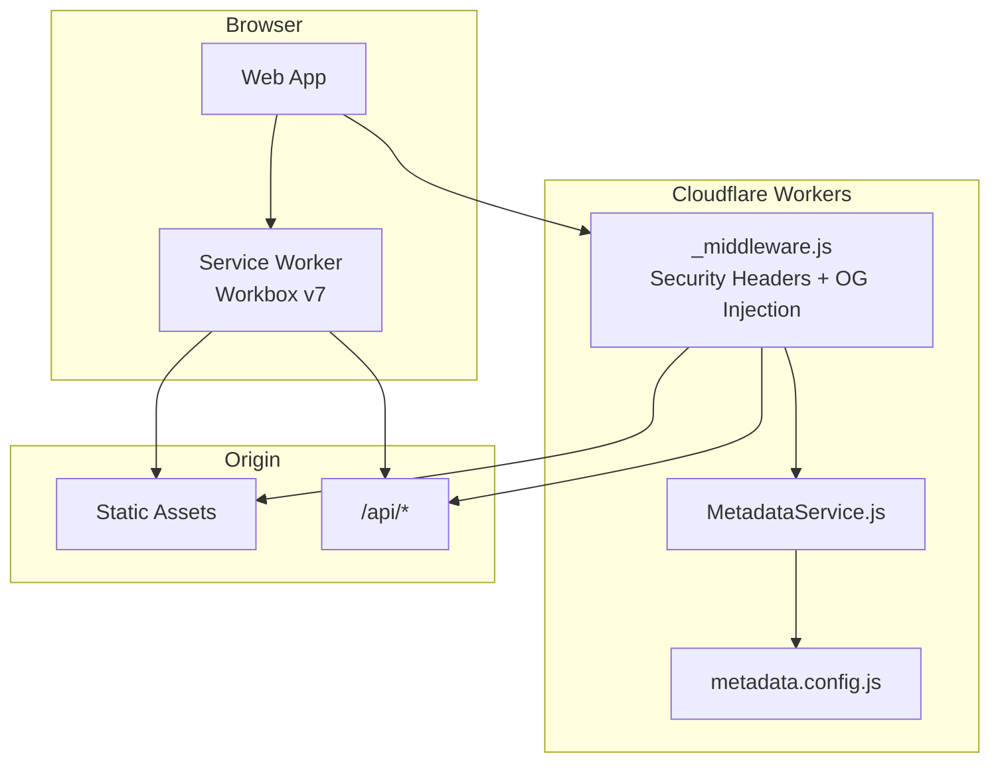
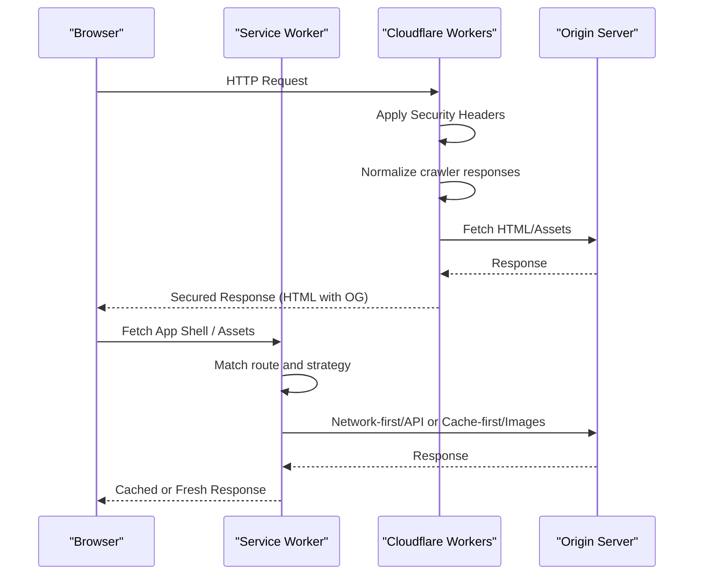
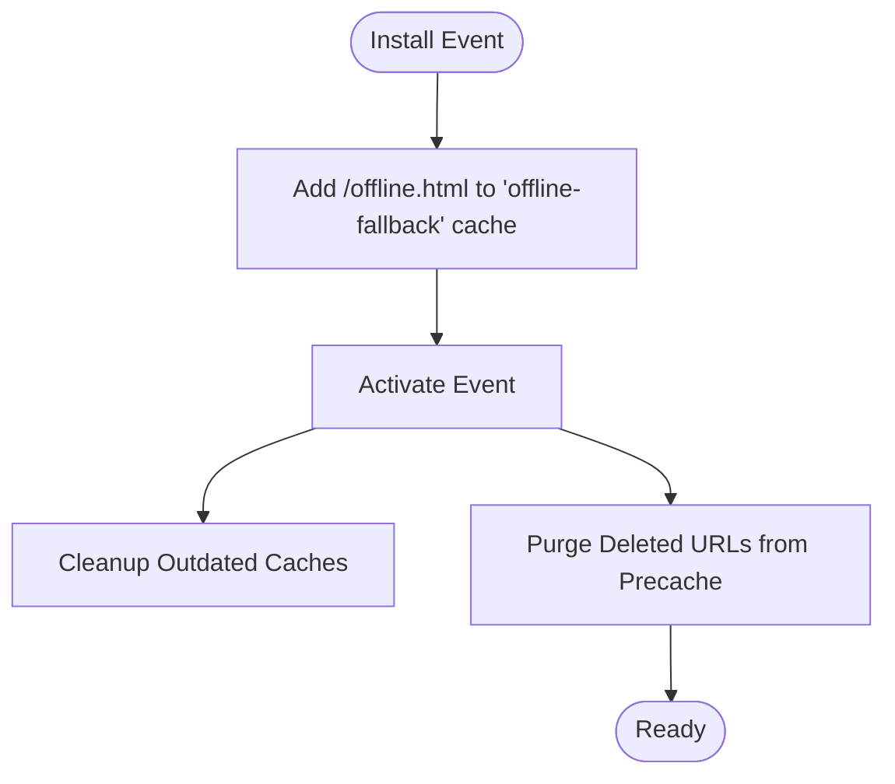
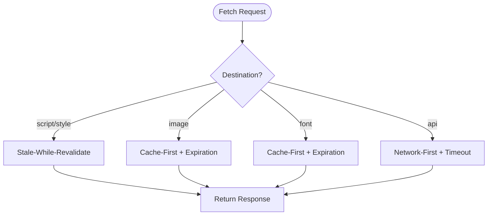
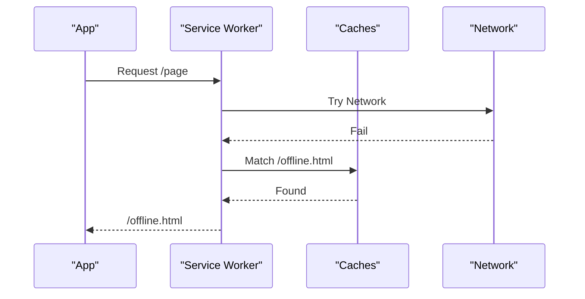
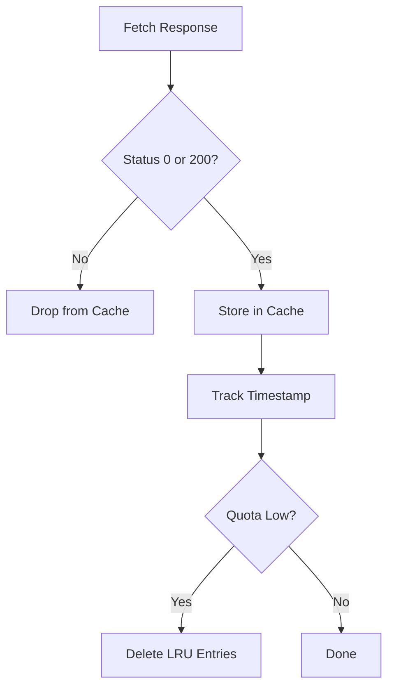
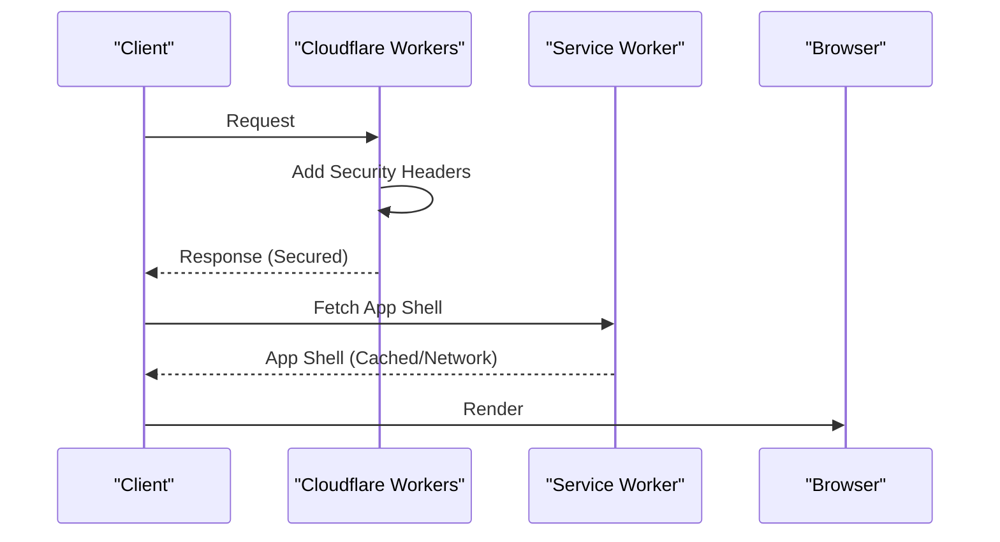
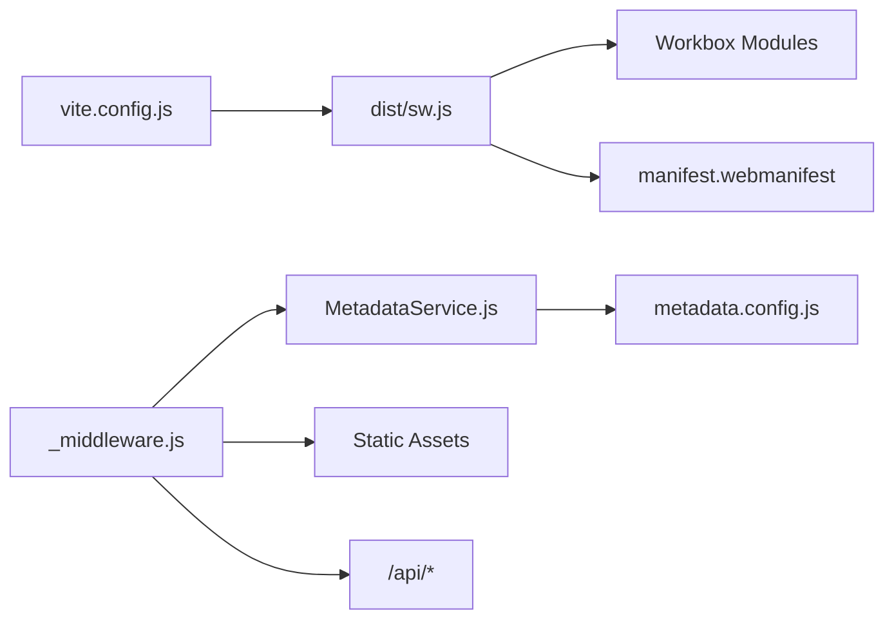

# Service Worker Security

<cite>
**Referenced Files in This Document**
- [src/sw.js](file://src/sw.js)
- [dist/sw.js](file://dist/sw.js)
- [functions/_middleware.js](file://functions/_middleware.js)
- [functions/services/MetadataService.js](file://functions/services/MetadataService.js)
- [functions/config/metadata.config.js](file://functions/config/metadata.config.js)
- [vite.config.js](file://vite.config.js)
- [dist/manifest.webmanifest](file://dist/manifest.webmanifest)
- [dist/offline.html](file://dist/offline.html)
- [wrangler.jsonc](file://wrangler.jsonc)
</cite>

## Table of Contents
1. [Introduction](#introduction)
2. [Project Structure](#project-structure)
3. [Core Components](#core-components)
4. [Architecture Overview](#architecture-overview)
5. [Detailed Component Analysis](#detailed-component-analysis)
6. [Dependency Analysis](#dependency-analysis)
7. [Performance Considerations](#performance-considerations)
8. [Troubleshooting Guide](#troubleshooting-guide)
9. [Conclusion](#conclusion)

## Introduction
This document explains the security model of the service worker and the broader PWA, focusing on secure caching strategies, offline behavior, resource access controls, and the interaction between the service worker and Cloudflare Workers security headers. It also covers cache invalidation, cache poisoning protections, and how the PWA maintains a consistent security posture across both layers.

## Project Structure
The PWA integrates a custom service worker with Workbox and a Cloudflare Workers middleware. The service worker is built via Vite PWA and injected into the app, while Cloudflare Workers adds security headers and crawler-friendly metadata injection.

**Diagram sources**
- [src/sw.js](file://src/sw.js#L1-L227)
- [dist/sw.js](file://dist/sw.js#L1-L2)
- [functions/_middleware.js](file://functions/_middleware.js#L1-L383)
- [functions/services/MetadataService.js](file://functions/services/MetadataService.js#L1-L380)
- [functions/config/metadata.config.js](file://functions/config/metadata.config.js#L1-L369)

**Section sources**
- [src/sw.js](file://src/sw.js#L1-L227)
- [functions/_middleware.js](file://functions/_middleware.js#L1-L383)
- [vite.config.js](file://vite.config.js#L1-L262)
- [dist/manifest.webmanifest](file://dist/manifest.webmanifest#L1-L2)

## Core Components
- Service Worker (Workbox v7):
  - Precaching of critical assets and offline fallback
  - Runtime caching strategies: Stale-While-Revalidate, Cache-First, Network-First
  - Background sync for forms with deduplication
  - Periodic background sync for critical data refresh
  - Comprehensive offline fallback with a custom HTML page
- Cloudflare Workers Middleware:
  - Security headers for CSP, HSTS, X-Content-Type-Options, X-Frame-Options, X-XSS-Protection, Referrer-Policy, Permissions-Policy
  - Crawler compatibility fixes (206 partial content handling)
  - Prepending OG tags early in the response
  - Snapshot-based hybrid pre-rendering for crawlers
- Vite PWA:
  - InjectManifest strategy with controlled precache entries and strict file size limits
  - Offline HTML inclusion and scope configuration

**Section sources**
- [src/sw.js](file://src/sw.js#L1-L227)
- [dist/sw.js](file://dist/sw.js#L1-L2)
- [functions/_middleware.js](file://functions/_middleware.js#L1-L383)
- [vite.config.js](file://vite.config.js#L192-L202)

## Architecture Overview
The system enforces layered security:
- Cloudflare Workers secures responses with robust headers and normalizes crawler responses.
- The service worker enforces cache safety, offline resilience, and secure runtime routing.
- Vite PWA ensures only safe assets are precached and scoped appropriately.

**Diagram sources**
- [functions/_middleware.js](file://functions/_middleware.js#L196-L225)
- [src/sw.js](file://src/sw.js#L49-L116)
- [vite.config.js](file://vite.config.js#L19-L202)

## Detailed Component Analysis

### Service Worker Lifecycle and Security Controls
- Lifecycle hooks:
  - skipWaiting and clients.claim to take control immediately upon activation.
  - install: caches offline fallback page for offline scenarios.
  - activate: cleans outdated caches and purges stale entries.
- Routing and strategies:
  - Navigation fallback to the app shell for SPA navigation.
  - Stale-While-Revalidate for scripts and styles.
  - Cache-First for images and fonts with expiration and quota handling.
  - Network-First for API calls with timeouts and cacheable response filtering.
- Background sync:
  - Queues failed POST requests and retries them with a unique submission identifier to prevent duplicates.
- Offline fallback:
  - Custom offline page cached during install and served when navigation fails.
- Cache invalidation:
  - ExpirationPlugin with maxEntries and maxAgeSeconds.
  - purgeOnQuotaError to automatically evict least-recently used entries when storage is low.
  - Cleanup of outdated caches on activation.

**Diagram sources**
- [src/sw.js](file://src/sw.js#L176-L182)
- [src/sw.js](file://src/sw.js#L31-L32)
- [src/sw.js](file://src/sw.js#L176-L182)

**Section sources**
- [src/sw.js](file://src/sw.js#L22-L24)
- [src/sw.js](file://src/sw.js#L31-L32)
- [src/sw.js](file://src/sw.js#L176-L182)
- [src/sw.js](file://src/sw.js#L183-L203)

### Secure Caching Strategies
- Scripts and Styles (Stale-While-Revalidate):
  - Serves cached content immediately and updates in the background.
  - Prevents stale content from being served indefinitely via expiration limits.
- Images (Cache-First with size limits):
  - Limits total entries and age, with automatic purge on quota errors.
  - Filters cacheable responses to avoid storing non-200s unintentionally.
- Fonts (Cache-First with long TTL):
  - Keeps critical fonts available for rendering performance.
- API (Network-First with timeout):
  - Ensures fresh data when available, falls back to cache after a short network timeout.
  - Restricts cached responses to 0 or 200 to avoid caching error states.

**Diagram sources**
- [src/sw.js](file://src/sw.js#L49-L116)

**Section sources**
- [src/sw.js](file://src/sw.js#L49-L116)

### Offline Data Handling and Fallbacks
- The service worker precaches critical assets and a custom offline page.
- Navigation failures are routed to the app shell; if the app shell is unavailable, a static offline page is returned.
- A dedicated offline cache is populated during installation to guarantee availability.

**Diagram sources**
- [src/sw.js](file://src/sw.js#L155-L174)
- [src/sw.js](file://src/sw.js#L176-L182)

**Section sources**
- [src/sw.js](file://src/sw.js#L155-L174)
- [src/sw.js](file://src/sw.js#L176-L182)
- [dist/offline.html](file://dist/offline.html#L1-L283)

### Protection Against Cache Poisoning
- Response filtering:
  - CacheableResponsePlugin restricts cached responses to 0 or 200 to avoid storing error responses.
- Cross-origin copy prevention:
  - The service worker validates origins when copying responses to prevent cross-origin poisoning.
- Quota-driven eviction:
  - ExpirationPlugin with purgeOnQuotaError proactively removes least-recently used entries to reduce risk of stale or poisoned content persisting.
- Precache integrity:
  - Precache controller validates conflicting entries and integrity mismatches to prevent inconsistent or malicious assets.

**Diagram sources**
- [src/sw.js](file://src/sw.js#L106-L114)
- [src/sw.js](file://src/sw.js#L66-L81)
- [src/sw.js](file://src/sw.js#L118-L153)

**Section sources**
- [src/sw.js](file://src/sw.js#L106-L114)
- [src/sw.js](file://src/sw.js#L66-L81)
- [src/sw.js](file://src/sw.js#L118-L153)

### Interaction Between Service Worker Security and Cloudflare Workers Security Headers
- Cloudflare Workers applies:
  - Content-Security-Policy (including relaxed inline/script for Vite/React dev/build needs)
  - Strict-Transport-Security
  - X-Content-Type-Options, X-Frame-Options, X-XSS-Protection
  - Referrer-Policy, Permissions-Policy
- The service worker does not duplicate these headers but benefits from the hardened baseline provided by Cloudflare Workers.
- The middleware also normalizes crawler responses (e.g., forcing 200 OK for 206 partial content) to ensure OG tags are parsed correctly, indirectly supporting security by avoiding malformed responses.

**Diagram sources**
- [functions/_middleware.js](file://functions/_middleware.js#L196-L225)
- [src/sw.js](file://src/sw.js#L1-L227)

**Section sources**
- [functions/_middleware.js](file://functions/_middleware.js#L196-L225)
- [src/sw.js](file://src/sw.js#L1-L227)

### PWA Manifest and Scope Security
- The manifest defines scope, display modes, and security-related integrations (e.g., scope extensions for *.rumuze.com).
- Vite PWA configuration:
  - InjectManifest strategy with controlled glob patterns and a strict maximum file size to limit attack surface.
  - Ensures offline.html is precached.
- The service worker’s navigation route denieslist excludes API/admin routes and static file extensions to prevent unnecessary caching.

**Section sources**
- [dist/manifest.webmanifest](file://dist/manifest.webmanifest#L1-L2)
- [vite.config.js](file://vite.config.js#L192-L202)
- [src/sw.js](file://src/sw.js#L34-L45)

### Metadata and Crawler Security
- MetadataService centralizes metadata generation with sanitization to prevent XSS in OG tags.
- The middleware injects OG tags at the beginning of the head to satisfy crawler parsing requirements and forces 200 OK for 206 responses to avoid partial content parsing issues.
- Snapshot-based hybrid pre-rendering reduces reliance on client-side rendering for crawlers.

**Section sources**
- [functions/services/MetadataService.js](file://functions/services/MetadataService.js#L1-L380)
- [functions/config/metadata.config.js](file://functions/config/metadata.config.js#L1-L369)
- [functions/_middleware.js](file://functions/_middleware.js#L177-L187)
- [functions/_middleware.js](file://functions/_middleware.js#L228-L263)

## Dependency Analysis
- Service Worker depends on:
  - Workbox modules for precaching, routing, strategies, expiration, cacheable responses, and background sync.
  - Vite PWA-managed manifest for precache entries.
- Cloudflare Workers depends on:
  - MetadataService and configuration for generating OG tags and alternate URLs.
  - HTMLRewriter to prepend OG tags and remove duplicates.
- Vite PWA depends on:
  - InjectManifest configuration to produce a deterministic service worker.

**Diagram sources**
- [vite.config.js](file://vite.config.js#L19-L202)
- [dist/sw.js](file://dist/sw.js#L1-L2)
- [functions/_middleware.js](file://functions/_middleware.js#L1-L383)
- [functions/services/MetadataService.js](file://functions/services/MetadataService.js#L1-L380)
- [functions/config/metadata.config.js](file://functions/config/metadata.config.js#L1-L369)

**Section sources**
- [vite.config.js](file://vite.config.js#L19-L202)
- [dist/sw.js](file://dist/sw.js#L1-L2)
- [functions/_middleware.js](file://functions/_middleware.js#L1-L383)

## Performance Considerations
- Precache size and file size limits reduce memory footprint and improve reliability.
- Expiration policies and quota-driven eviction prevent cache bloat and stale content accumulation.
- Network-first timeouts balance freshness and resilience.
- Compression (gzip/brotli) and chunk splitting optimize delivery.

[No sources needed since this section provides general guidance]

## Troubleshooting Guide
- Service worker not updating:
  - Ensure skipWaiting and clients.claim are present and that activate clears outdated caches.
- Offline fallback not appearing:
  - Verify offline.html is precached or added during install and that navigation routes are correctly matched.
- Background sync not retrying:
  - Confirm BackgroundSyncPlugin is registered and that unique submission IDs are appended to POST requests.
- Crawler OG tags missing:
  - Ensure middleware excludes service worker and static assets from rewriting and prepends OG tags to head.
- 206 Partial Content errors:
  - Confirm the middleware forces 200 OK for crawler responses.

**Section sources**
- [src/sw.js](file://src/sw.js#L22-L24)
- [src/sw.js](file://src/sw.js#L176-L182)
- [src/sw.js](file://src/sw.js#L118-L153)
- [functions/_middleware.js](file://functions/_middleware.js#L81-L92)
- [functions/_middleware.js](file://functions/_middleware.js#L177-L187)

## Conclusion
The PWA achieves a strong security posture through layered protections: Cloudflare Workers hardens responses with comprehensive security headers and crawler normalization; the service worker enforces safe caching, offline resilience, and secure runtime routing; and Vite PWA constrains the precache to trusted assets. Together, these components deliver a secure, resilient, and crawler-friendly experience with robust cache invalidation and anti-poisoning safeguards.