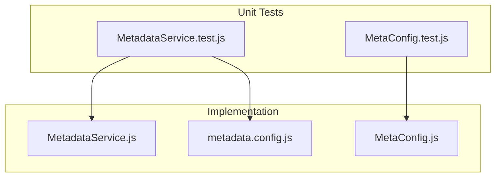
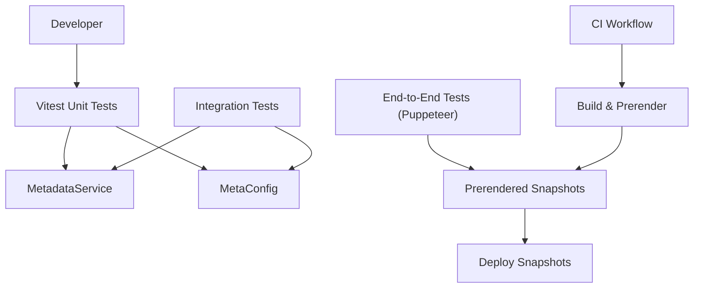
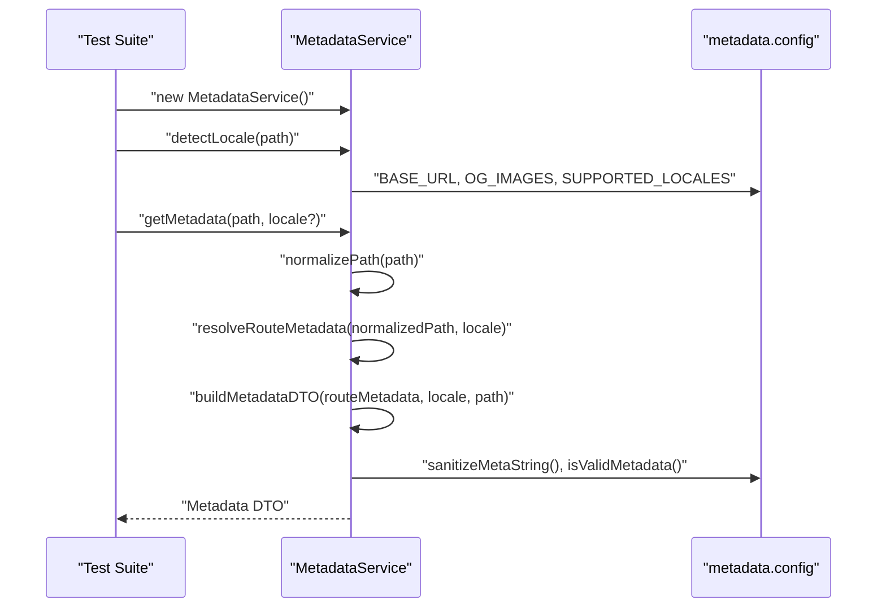
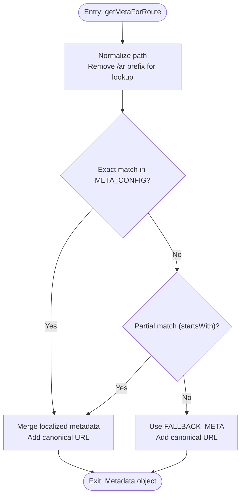
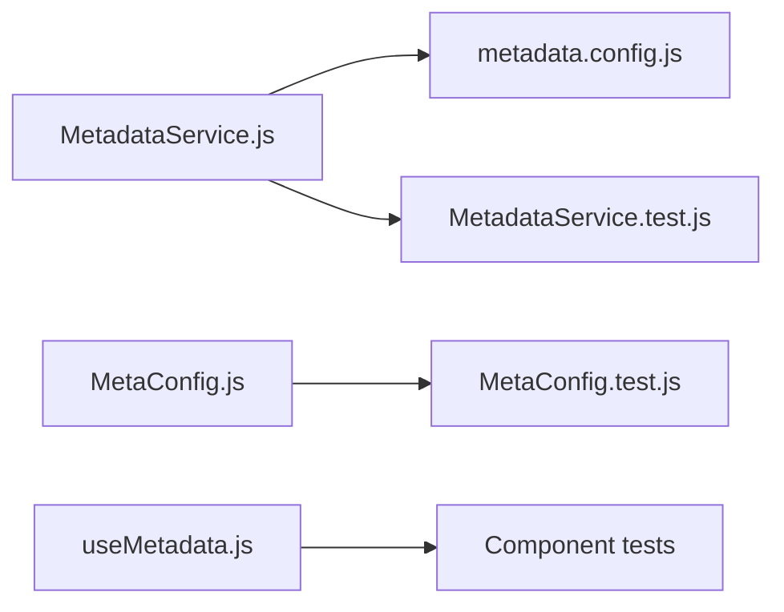

# Testing Strategy

<cite>
**Referenced Files in This Document**
- [package.json](file://package.json)
- [vite.config.js](file://vite.config.js)
- [.github/workflows/deploy-snapshots.yml](file://.github/workflows/deploy-snapshots.yml)
- [functions/services/MetadataService.js](file://functions/services/MetadataService.js)
- [functions/services/MetadataService.test.js](file://functions/services/MetadataService.test.js)
- [functions/config/metadata.config.js](file://functions/config/metadata.config.js)
- [src/utils/MetaConfig.js](file://src/utils/MetaConfig.js)
- [src/utils/MetaConfig.test.js](file://src/utils/MetaConfig.test.js)
- [src/hooks/useMetadata.js](file://src/hooks/useMetadata.js)
</cite>

## Table of Contents
1. [Introduction](#introduction)
2. [Project Structure](#project-structure)
3. [Core Components](#core-components)
4. [Architecture Overview](#architecture-overview)
5. [Detailed Component Analysis](#detailed-component-analysis)
6. [Dependency Analysis](#dependency-analysis)
7. [Performance Considerations](#performance-considerations)
8. [Troubleshooting Guide](#troubleshooting-guide)
9. [Conclusion](#conclusion)
10. [Appendices](#appendices)

## Introduction
This document defines the testing strategy and implementation for the landing page project. It covers unit testing with Vitest, component testing patterns, service testing methodologies, configuration, mocking strategies, and coverage requirements. It also documents integration testing approaches, end-to-end testing considerations, and continuous integration testing workflows. Practical examples demonstrate testing metadata service functions, utility functions, and React components. Guidelines are provided for writing effective tests, maintaining coverage, and debugging failures.

## Project Structure
The repository organizes tests alongside the code they validate:
- Unit tests for backend services are located under functions/services with a .test.js suffix.
- Utility tests reside under src/utils.
- Frontend components and hooks are under src/components and src/hooks; tests can be colocated or centralized depending on team preference.
- CI workflows are defined under .github/workflows.

Key testing-related configuration and scripts:
- Vitest is configured via package.json scripts for running and watching tests.
- Vite configuration supports build-time optimizations and does not interfere with unit tests.

**Diagram sources**
- [functions/services/MetadataService.test.js](file://functions/services/MetadataService.test.js#L1-L370)
- [src/utils/MetaConfig.test.js](file://src/utils/MetaConfig.test.js#L1-L54)
- [functions/services/MetadataService.js](file://functions/services/MetadataService.js#L1-L380)
- [src/utils/MetaConfig.js](file://src/utils/MetaConfig.js#L1-L530)
- [functions/config/metadata.config.js](file://functions/config/metadata.config.js#L1-L369)

**Section sources**
- [package.json](file://package.json#L6-L15)
- [vite.config.js](file://vite.config.js#L1-L262)

## Core Components
This section outlines the testing approach for the core components involved in metadata generation and client-side metadata management.

- MetadataService (backend service): Comprehensive unit tests validate locale detection, path normalization, route metadata resolution, canonical URL generation, alternate URLs (hreflang), metadata DTO construction, and singleton behavior.
- MetaConfig (utility module): Tests focus on canonical URL normalization and query parameter handling for SEO correctness.
- metadata.config (configuration): Provides constants and helpers consumed by both service and utility modules; tests validate behavior indirectly through service and utility tests.
- useMetadata (React hook): Tests can validate client-side metadata overrides, absolute image URL generation, and default OG image selection.

Practical testing examples:
- Service tests: [functions/services/MetadataService.test.js](file://functions/services/MetadataService.test.js#L1-L370)
- Utility tests: [src/utils/MetaConfig.test.js](file://src/utils/MetaConfig.test.js#L1-L54)
- Service implementation: [functions/services/MetadataService.js](file://functions/services/MetadataService.js#L1-L380)
- Utility implementation: [src/utils/MetaConfig.js](file://src/utils/MetaConfig.js#L1-L530)
- Configuration: [functions/config/metadata.config.js](file://functions/config/metadata.config.js#L1-L369)
- React hook: [src/hooks/useMetadata.js](file://src/hooks/useMetadata.js#L1-L117)

**Section sources**
- [functions/services/MetadataService.test.js](file://functions/services/MetadataService.test.js#L1-L370)
- [src/utils/MetaConfig.test.js](file://src/utils/MetaConfig.test.js#L1-L54)
- [functions/services/MetadataService.js](file://functions/services/MetadataService.js#L1-L380)
- [src/utils/MetaConfig.js](file://src/utils/MetaConfig.js#L1-L530)
- [functions/config/metadata.config.js](file://functions/config/metadata.config.js#L1-L369)
- [src/hooks/useMetadata.js](file://src/hooks/useMetadata.js#L1-L117)

## Architecture Overview
The testing architecture separates concerns across unit, integration, and CI layers:
- Unit tests validate pure functions and service logic in isolation using Vitest.
- Integration tests can validate serverless functions and middleware behavior against real or mocked environments.
- End-to-end tests (e.g., Puppeteer) can verify prerendered snapshots and runtime behavior.
- CI workflows orchestrate builds, prerendering, and snapshot updates.

**Diagram sources**
- [functions/services/MetadataService.js](file://functions/services/MetadataService.js#L1-L380)
- [src/utils/MetaConfig.js](file://src/utils/MetaConfig.js#L1-L530)
- [.github/workflows/deploy-snapshots.yml](file://.github/workflows/deploy-snapshots.yml#L1-L54)

## Detailed Component Analysis

### MetadataService Unit Tests
The MetadataService test suite validates:
- Locale detection from paths.
- OG locale mapping.
- OG image URL resolution with cache busting.
- Path normalization (prefix removal, trailing slash handling).
- Route metadata resolution with fallbacks.
- Canonical URL and alternate URLs generation.
- Metadata DTO structure, absolute URLs, image dimensions, and sanitization.
- Metadata override behavior with preservation of base metadata and sanitization.
- Singleton pattern behavior and reuse.
- Edge cases (empty paths, query parameters, hashes, nested routes).

**Diagram sources**
- [functions/services/MetadataService.test.js](file://functions/services/MetadataService.test.js#L1-L370)
- [functions/services/MetadataService.js](file://functions/services/MetadataService.js#L1-L380)
- [functions/config/metadata.config.js](file://functions/config/metadata.config.js#L1-L369)

**Section sources**
- [functions/services/MetadataService.test.js](file://functions/services/MetadataService.test.js#L1-L370)
- [functions/services/MetadataService.js](file://functions/services/MetadataService.js#L1-L380)
- [functions/config/metadata.config.js](file://functions/config/metadata.config.js#L1-L369)

### MetaConfig Utility Tests
The MetaConfig test suite focuses on:
- Canonical URL normalization for root and nested paths.
- Handling of Arabic routes and canonicalization behavior.
- Query parameter filtering to preserve allowed parameters and strip disallowed ones.

**Diagram sources**
- [src/utils/MetaConfig.test.js](file://src/utils/MetaConfig.test.js#L1-L54)
- [src/utils/MetaConfig.js](file://src/utils/MetaConfig.js#L1-L530)

**Section sources**
- [src/utils/MetaConfig.test.js](file://src/utils/MetaConfig.test.js#L1-L54)
- [src/utils/MetaConfig.js](file://src/utils/MetaConfig.js#L1-L530)

### React Hook Tests (useMetadata)
Recommended testing patterns for the useMetadata hook:
- Mock React Helmet and translation providers to isolate hook behavior.
- Verify absolute URL generation for images and default OG image selection.
- Validate current metadata retrieval and language awareness.
- Test programmatic metadata overrides by asserting expected behavior in consuming components.

Example test scenarios:
- Default OG image URL composition based on current language.
- Absolute URL normalization for relative image paths.
- Current metadata shape returned by getCurrentMetadata.

**Section sources**
- [src/hooks/useMetadata.js](file://src/hooks/useMetadata.js#L1-L117)

## Dependency Analysis
The testing strategy relies on clear boundaries between service logic, configuration, and utilities. Tests depend on:
- Service implementation and configuration for backend logic.
- Utility functions for client-side SEO logic.
- Vitest for test execution and assertions.

**Diagram sources**
- [functions/services/MetadataService.js](file://functions/services/MetadataService.js#L1-L380)
- [functions/config/metadata.config.js](file://functions/config/metadata.config.js#L1-L369)
- [functions/services/MetadataService.test.js](file://functions/services/MetadataService.test.js#L1-L370)
- [src/utils/MetaConfig.js](file://src/utils/MetaConfig.js#L1-L530)
- [src/utils/MetaConfig.test.js](file://src/utils/MetaConfig.test.js#L1-L54)
- [src/hooks/useMetadata.js](file://src/hooks/useMetadata.js#L1-L117)

**Section sources**
- [functions/services/MetadataService.js](file://functions/services/MetadataService.js#L1-L380)
- [functions/config/metadata.config.js](file://functions/config/metadata.config.js#L1-L369)
- [src/utils/MetaConfig.js](file://src/utils/MetaConfig.js#L1-L530)
- [src/hooks/useMetadata.js](file://src/hooks/useMetadata.js#L1-L117)

## Performance Considerations
- Keep unit tests fast by avoiding network calls; mock external dependencies.
- Use Vitest’s built-in mocks and spies for deterministic behavior.
- Favor pure functions and small units to minimize test flakiness.
- For integration tests, limit external service calls and use lightweight stubs.

## Troubleshooting Guide
Common issues and resolutions:
- Locale detection mismatches: Verify path prefixes and normalization logic in the service and utility modules.
- Canonical URL discrepancies: Confirm query parameter filtering and trailing slash handling in MetaConfig.
- Metadata DTO validation errors: Ensure required fields are populated and sanitized.
- Snapshot inconsistencies: Re-run prerendering and commit updated snapshots via CI.

**Section sources**
- [functions/services/MetadataService.js](file://functions/services/MetadataService.js#L1-L380)
- [src/utils/MetaConfig.js](file://src/utils/MetaConfig.js#L1-L530)
- [.github/workflows/deploy-snapshots.yml](file://.github/workflows/deploy-snapshots.yml#L1-L54)

## Conclusion
The testing strategy leverages Vitest for robust unit tests of service logic and utilities, with clear separation of concerns and strong configuration-driven behavior. Integration and end-to-end testing complement unit tests, while CI workflows automate prerendering and snapshot updates. By following the outlined patterns and guidelines, teams can maintain high-quality, reliable metadata handling across locales and routes.

## Appendices

### Test Configuration and Scripts
- Run tests: npm test
- Watch mode: npm run test:watch
- Coverage: Configure coverage thresholds in Vitest settings as needed.

**Section sources**
- [package.json](file://package.json#L6-L15)

### Continuous Integration Testing Workflows
- The CI workflow builds the project, generates sitemaps, prerenders snapshots, and commits updated snapshots to the repository.

**Section sources**
- [.github/workflows/deploy-snapshots.yml](file://.github/workflows/deploy-snapshots.yml#L1-L54)